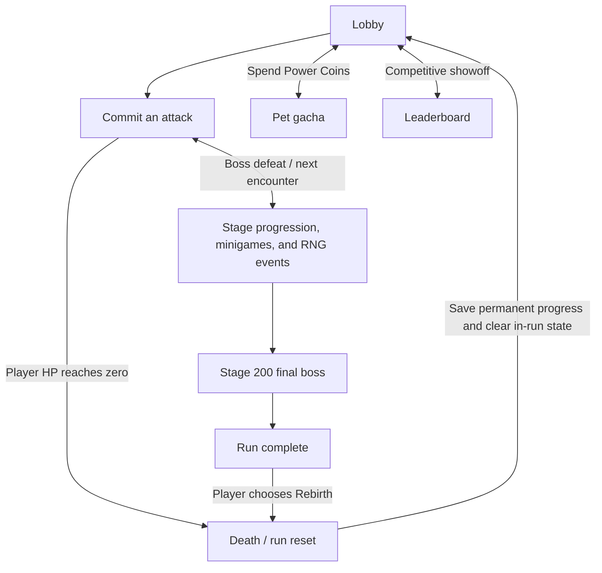
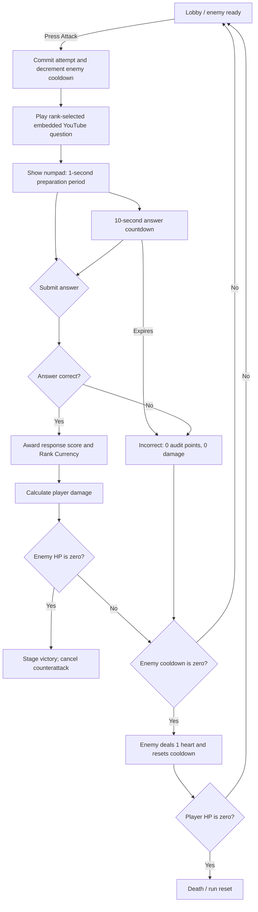

# Power!-Math — Game Design Document

## Document Status

This revision incorporates the new brief and the approved mechanic corrections. Formulas labeled **Starting formula** must be validated through playtesting before they are treated as final balance values.

---

## Project Overview

| Field | Direction |
| --- | --- |
| Title | **Power!-Math** |
| Genre | **2D UI Interactive / Education-Driven / Rogue-lite** |
| Theme | **Fantasy / Boss Rush / RPG** |
| Core Fantasy | Upgrade your sword, challenge yourself, and go beyond your power through a mathematics-driven rogue-lite boss rush. Solve video-based questions, build strength across multiple runs, and reach Stage 200. |
| Platform | **Unity WebGL with mobile compatibility** |
| Presentation | **2D interactive gameplay and visuals**, using “Tan Titan” as the visual reference named in the brief. |
| Run Length | **200 stages** |

### Core Aesthetics

1. **Challenge** — overcome increasingly durable bosses through mathematical performance and multiple runs.
2. **Expression** — shape a run through weapons, pets, upgrades, buffs, and card choices.
3. **Ownership** — retain educational progress, permanent currencies, pets, weapons, and honor across runs.

---

<!-- @tag:core-loop -->
## Core, Meta, and Social Loops



### Player Flow

1. A newly registered student begins at Silver Rank and enters the `Lobby` scene.
2. The lobby displays the current combat/Event encounter, action panel, visual Stage, relevant HP/rules, player hearts, and the enemy cooldown when standard combat is active.
3. Selecting **Attack** commits one combat attempt and loads the active Rank question in an embedded YouTube IFrame Player.
4. When the embedded player reports that the video ended, the answer interface appears. The student enters one non-negative integer answer using the numpad.
5. In standard combat, a correct answer awards a responsiveness score, grants the active Rank Currency, and attacks the enemy. Event questions use their Event Definition's explicit audit/currency policy.
6. An incorrect answer, timeout, browser close, refresh, or abandoned committed attempt records an incorrect result and deals no damage.
7. Every committed standard-combat attempt consumes one count from the current enemy's attack cooldown; Events use their explicit committed-attempt policy.
8. If the enemy survives when its cooldown reaches zero, it attacks for 1 heart and its cooldown resets.
9. Clearing the active enemy or Event advances the visual stage and resolves the next saved encounter from the Stage Map.
10. If player HP reaches zero, the run resets and awards Power Coins through the run-reset formula.
11. Fixed or chance-based encounters can include a Math Minigame or RNG Card Draw; permanent Weapon Ascend is available from Main Menu between combat actions.
12. Defeating the Stage 200 final boss enters `RunComplete`. The player may remain in the lobby, but further combat progression is locked until the optional **Rebirth** button is used.

---

<!-- @tag:combat-attempt -->
## Combat Attempt State Machine



### Attempt Commitment and Resolution Order

1. The server creates a unique attempt transaction when **Attack** is pressed.
2. The current enemy cooldown decreases by one.
3. The question is locked to that attempt; refreshing cannot reroll it.
4. The video and answer window resolve.
5. On success, player damage resolves before any enemy counterattack.
6. If player damage defeats the enemy, the enemy cannot counterattack, even if its cooldown reached zero.
7. If the enemy survives with zero cooldown, it attacks and resets to its unique maximum cooldown.
8. A new enemy always begins with its own full cooldown.

Each enemy definition must provide a unique maximum cooldown value. The lobby must show the remaining count so the next enemy attack is predictable.

---

<!-- @tag:answer-scoring -->
## Answer Input, Timer, and Audit Scoring

### Integer Answer Input

- Valid answers are non-negative integers entered using digits `0–9` only.
- The input supports digit entry, Backspace, Clear, and Submit.
- Submit is disabled while the input is empty.
- Leading zeros are normalized before validation.
- Each question definition must declare an answer-length limit suitable for its correct answer.
- Questions with negative, decimal, fractional, operator-based, or otherwise unsupported answers must be rejected during content validation.
- One submitted answer ends the attempt; there is no second guess.

### Response Timer

After the video completes:

1. Show and enable the numpad.
2. Give a **1-second preparation period**. A correct answer during this period receives the maximum 10 points.
3. Begin a **10-second countdown**.
4. During the final fractional second, the visual timer may display `0`, but an answer is valid only while actual remaining time is greater than zero.
5. When actual remaining time reaches zero, the attempt times out and becomes incorrect.

### Response Score Formula

For a correct answer submitted before timeout:

```text
ResponseScore = clamp(ceil(TimeRemainingSeconds), 1, 10)
```

During the 1-second preparation period:

```text
ResponseScore = 10
```

For an incorrect answer, timeout, refresh, browser close, or abandoned committed attempt:

```text
ResponseScore = 0
```

### Response Damage Multiplier

Correct-answer Response Score multiplies the fully composed combat damage:

```text
ResponseDamageMultiplier = ResponseScore × 0.20
```

| Response Score | Response Damage Multiplier |
| ---: | ---: |
| 10 | 200% |
| 9 | 180% |
| 8 | 160% |
| 7 | 140% |
| 6 | 120% |
| 5 | 100% |
| 4 | 80% |
| 3 | 60% |
| 2 | 40% |
| 1 | 20% |

This combat multiplier is separate from the student-visible `Response Efficiency` educational metric. A score of 9 multiplies composed damage 50 by 180%, producing 90 Final Damage. A score of 10 applies 200%.

### Five-Question Audit

- The backend audits performance in non-overlapping windows of exactly **5 resolved questions**.
- Maximum audit score: **50 points**.
- The audit value and partial audit position persist across reconnection and ordinary sessions, but reset to an empty five-question window after death or Rebirth.
- After the fifth result, the server evaluates Rank and resets the audit window.
- Audit calculations remain hidden. The UI displays a popup only when an actual promotion or demotion occurs.

| Outcome | Rule |
| --- | --- |
| Promote one Rank | Audit score **≥ 40** |
| Remain at current Rank | Audit score **26–39** |
| Demote one Rank | Audit score **≤ 25** |

- Silver cannot demote below Silver.
- Diamond cannot promote above Diamond.
- A newly registered student starts at Silver.
- Active Rank is educational/meta progression and does **not** reset when a run ends.
- A reset preserves the authoritative Rank produced by the final resolved attempt, then clears the partial audit and rebuilds question-cycle runtime at that Rank. A high-efficiency student therefore does not return to an easier Rank after every run.

### Rank Combat Privilege

Harder question pools provide a direct combat benefit:

| Rank | Damage Multiplier |
| --- | ---: |
| Silver | ×1.0 |
| Gold | ×1.5 |
| Diamond | ×2.0 |

This lets stronger mathematics performance accelerate combat without attaching question difficulty to the visual stage.

---

<!-- @tag:combat-stats -->
## RPG Stats and Damage Calculation

### Enemy Stats

- **Normal HP Baseline:** positive global Stage-progression value; normal Monster Definitions do not author HP.
- **Boss HP Modifier:** positive data-defined Mini-Boss/Big-Boss/Final-Boss spike applied after normal Stage scaling.
- **Current HP:** integer generated when the enemy spawns.
- **Attack Damage:** 1 heart.
- **Maximum Cooldown:** positive integer unique to the enemy.
- **Remaining Cooldown:** initialized from Maximum Cooldown when the enemy spawns or after it attacks.

### Player Stats

- **ATK:** base attack value.
- **CR:** critical rate percentage, clamped from 0% to 100%.
- **CD:** bonus critical damage percentage.
- **HP:** 3 hearts by default.
- Equipped pets, equipped weapons, and in-run effects can modify these stats, including maximum hearts.
- All stats and accumulated bonuses must use data-defined clamps.

### Effective ATK

```text
EffectiveATK =
    round((BaseATK + WeaponATK + PetATK) × LegacyATKMultiplier)
    + InRunFlatATK
```

`LegacyATKMultiplier` is permanent account progression awarded when a run settles after death or optional Rebirth:

```text
LegacyATKMultiplier = 1 + (LegacyATKBonusBasisPoints / 10,000)

BoostStages = clamp(StageReached, 1, 200)
LegacyATKGainBasisPoints = BoostStages × 10
```

- Ten basis points equal `0.1%`, so each Stage reached contributes a permanent additive `+0.1% ATK` when the run settles.
- Death and Rebirth use the same Stage-based Legacy ATK calculation. Rebirth has no special fixed ATK grant.
- Rebirth additionally increments Prestige/Honor because it is an intentional reset available from Stage 50 onward.
- Legacy ATK bonuses stack additively across runs and are applied once to Base, Weapon, and Pet ATK before temporary in-run flat bonuses.
- Each run ID can grant its Legacy ATK increase only once.

Percentage in-run damage bonuses stack additively before the final multiplication:

```text
BuffMultiplier = 1 + SumOfPercentageDamageBuffs
```

Critical hits are rolled by the server:

```text
CriticalMultiplier = 1 + (CD / 100)   when critical
CriticalMultiplier = 1                otherwise
```

### Final Damage Formula

```text
FinalDamage = max(1, round(
    EffectiveATK
    × RankMultiplier
    × BuffMultiplier
    × CriticalMultiplier
    × ResponseDamageMultiplier
))
```

- Incorrect and timed-out attempts deal 0 damage.
- `ResponseDamageMultiplier` is applied last so response speed scales the complete ATK, Rank, Buff, and Critical result exactly once.
- Damage and critical results are calculated server-side.
- Enemy HP cannot fall below zero.
- Full Final Damage counts toward `TotalDamageDealt`, including overkill damage.

```text
EnemyHP = max(0, EnemyHP - FinalDamage)
TotalDamageDealt = TotalDamageDealt + FinalDamage
```

---

<!-- @tag:question-data -->
## Math Video Database and Rank Question Inventory

### Firestore Question Schema

The `question` collection contains exactly three Rank documents: `silver`, `gold`, and `diamond`. Each document contains an `items` array. Rank is inferred from the owning document and is not repeated in an item.

| Field | Purpose |
| --- | --- |
| `id` | Stable non-negative numeric identifier, unique within its Rank |
| `video_link` | Valid embeddable YouTube watch, short, or embed link |
| `answer` | Correct non-negative integer answer |

Catalog validation must reject duplicate IDs within a Rank, invalid owning documents, invalid/non-YouTube links, missing videos, and unsupported answers before questions enter the live pool. Runtime identity is the composite `(Rank, id)`.

### Per-Rank FIFO Rules

- Unity receives questions as `question.id` values and stores them in per-rank `RankQuestionInventory` queues.
- Silver, Gold, and Diamond each retain an independent queue position.
- One question can appear at most once within a five-question audit window.
- Correctly answered questions are removed from the current question cycle.
- Incorrect questions are skipped for the rest of the current audit window and remain in the incorrect/played list.
- After an audit finishes, failed questions return to the front of that Rank’s FIFO queue in failure order.
- If the player changes Rank, unfinished questions wait in their original Rank queue until the player returns.
- Example: a five-question Silver batch beginning at ID 93 covers IDs `93–97`; a Gold batch beginning at ID 23 covers IDs `23–27` when those IDs are sequentially available.

### Pool Exhaustion

- When every valid question in a Rank pool has been cleared for the current cycle, that Rank database restarts from index zero as a new cycle.
- Historical correctness, responsiveness, audit, and mastery analytics remain intact.
- Restarting the pool does not make old questions appear historically unplayed.
- The server records a cycle counter so repeated content can be distinguished in analytics.

### Content or Delivery Failure

- A confirmed missing/corrupt video or invalid server question voids the attempt, restores the consumed enemy cooldown count, and records a content error rather than an incorrect student answer.
- A student closing, refreshing, or abandoning a valid committed question records an incorrect answer.
- If the server received the submission before disconnect, reconnecting returns the authoritative saved result without resolving it twice.

---

<!-- @tag:stage-progression -->
## Stage, Map, and Difficulty Progression

### Stage Rules

- A run contains **200 visual stages**.
- A stage advances only when its active combat encounter or Event encounter is successfully cleared.
- Encounter classification uses this fixed priority so one Stage can never become two encounter types:

```text
if Stage == 200       -> Final Boss
else if Stage % 30=0 -> Big Boss
else if Stage % 5=0  -> Mini-Boss
else                  -> Normal Candidate

Normal Candidate -> Normal Monster or eligible Event replacement
```

- Normal Stages randomize one normal Monster Definition from the current biome's normal-monster pool.
- Every Stage divisible by 5 is a Mini-Boss unless the Big-Boss or Final-Boss rule has higher priority.
- Stages 30, 60, 90, 120, 150, and 180 are Big-Boss encounters that close their biome.
- Stage 200 remains the unique Final Boss and ends the run in `RunComplete`.
- Events may replace only a Normal Candidate. Events can never replace Mini-Boss, Big-Boss, or Final-Boss Stages.
- The authoritative encounter selection and generated HP are saved once. Reloading cannot reroll a normal monster, Event, boss, or Spawn HP.
- Visual stage and `question.id` are independent values.
- Standard combat question difficulty follows the active Rank; Event Definitions may point to a separate validated question document.
- Enemy durability follows Stage/World Level and the encounter class, not the selected normal-monster artwork.

### Map and Biomes

- The run contains **seven sequential biomes**:

| Biome Slot | Stage Range | Closing Encounter |
| ---: | ---: | --- |
| 1 | 1-30 | Big Boss at Stage 30 |
| 2 | 31-60 | Big Boss at Stage 60 |
| 3 | 61-90 | Big Boss at Stage 90 |
| 4 | 91-120 | Big Boss at Stage 120 |
| 5 | 121-150 | Big Boss at Stage 150 |
| 6 | 151-180 | Big Boss at Stage 180 |
| 7 | 181-200 | Final Boss at Stage 200 |

- Biome identity changes only the available monster set and background presentation. It does not change the student's active Rank, question-audit rules, currencies, player stats, hearts, or stage formulas.
- Each biome is data-defined and owns a stable biome ID, title/localization key, Stage range, background art, pseudo-map landmark art/position, normal-monster pool, Mini-Boss bindings, and closing Big-Boss or Final-Boss binding.
- The pseudo-map is an informational panel rather than a level-select screen. It shows all seven biome landmarks in journey order, their Stage ranges, cleared/current/upcoming state, and the player's current biome marker. Students cannot teleport or replay a Stage from the map.
- The map presentation may follow the reference's illustrated-region composition, but PowerMath does not include Story/Dark/Master mode tabs or per-biome mode percentages.

### Biome Shift Sequence

Defeating Stages 30, 60, 90, 120, 150, or 180 commits the next Stage and then plays a non-interactive biome transition:

```text
Boss Defeated
  -> Stage Advance Saved
  -> Combat Input Locked
  -> New Biome Title + Audio Cue
  -> Background Crossfade/Slow Shift
  -> New Biome Encounter Appears
  -> EnemyReady / EventReady
```

- The new biome title appears before the new monster so the player can predict why the visual set changed.
- Background movement must respect Reduced Motion; the accessible version uses a short fade without camera drift.
- Biome transition presentation is repeat-safe and grants no reward. Reconnecting after the Stage save loads the correct new biome and encounter without duplicating the defeated boss or reward.
- Transition timing is presentation tuning, not authoritative gameplay state. Attack remains unavailable until the new encounter is ready.

### Data-Defined Map Structure

`StageMapDefinition` is the ordered root ScriptableObject for the 200-Stage route. It references seven `BiomeDefinition` assets and Event-stage scheduling rules. Validation rejects gaps, overlaps, unsorted ranges, missing Stage 1/200 coverage, an incorrect biome-closing boss, or an Event binding on a protected boss Stage.

`BiomeDefinition` owns presentation and encounter-set references only. Biome changes must not contain hidden combat multipliers; difficulty modifiers belong to the Stage/encounter policy so the same rule remains inspectable and testable.

### Monster Structure

`MonsterDefinition` contains a stable monster ID, localized name/fallback name, sprite/presentation references, encounter class, biome membership, and maximum attack cooldown.

- **Normal Monster:** belongs to one biome's random pool and does not author its own HP. The Stage HP policy generates HP independently so a random art/name selection cannot create an accidental difficulty reroll.
- **Mini-Boss:** uses a fixed Stage binding, unique presentation, and a data-defined HP-spike modifier applied after normal Stage scaling.
- **Big Boss:** uses a fixed biome-closing Stage binding, unique presentation, and a stronger data-defined HP-spike modifier.
- **Final Boss:** uses the fixed Stage 200 binding and enters `RunComplete` when defeated.
- Boss modifiers and cooldowns are tunable content values. No starting boss multiplier is final until pacing playtests measure correct-answer counts.

### Starting Enemy HP Formula

The 200 stages are divided into 40 World Levels, with one World Level per five stages:

```text
WorldLevel = ceil(Stage / 5)
GrowthSteps = WorldLevel - 1
```

Enemy HP gains an additive 12% of the global normal-enemy HP baseline per completed World Level step:

```text
ScaledNormalHP = NormalHPBaseline × (1 + 0.12 × GrowthSteps)
EncounterHP = ScaledNormalHP × EncounterClassMultiplier
SpawnHP = max(1, round(EncounterHP × RandomRange(0.95, 1.05)))
```

- `EncounterClassMultiplier` is `1.0` for normal monsters. Mini-Boss, Big-Boss, and Final-Boss multipliers are data-defined tuning values.
- Normal Monster Definitions never provide `BaseHP`; biome selection changes identity/presentation and cooldown, not the Stage HP baseline.
- The server generates and saves Spawn HP once. Refreshing cannot reroll enemy HP.
- Only enemy HP uses the World Level scaling formula.

This is a **starting formula**. Playtest the number of correct attempts required per enemy across early, middle, and late runs. If late fights become repetitive rather than more strategic, reduce HP growth or strengthen the planned upgrade curve.

---

<!-- @tag:encounters -->
## Rogue-lite Encounters

### Event Stages

An Event is a separate encounter family that can replace only an eligible Normal Candidate Stage. An `EventDefinition` does not depend on or masquerade as a `MonsterDefinition`.

Each Event Definition contains at minimum:

- stable Event ID and Event kind;
- localized title/instructions and its own main sprite/presentation asset;
- eligible biome/Stage constraints and selection policy;
- event-specific question document/pool reference when mathematics is used;
- commit, success, failure, reconnect, and completion rules;
- reward policy and permanent first-clear/once-per-run flags when applicable;
- runtime-handler key so future Slot Game, RNG, or other Event types can use different logic without adding fake monster fields.

Pressing **Attack** while an Event is ready commits that Event before opening its content. The button changes label/presentation if needed but retains the same clear input location. A committed Event is idempotent: refresh/reconnect resumes or returns its saved authoritative result without rerolling the Event or granting its reward twice.

#### Challenge Monster Event

- Uses an Event-owned sprite and title rather than a Monster Definition.
- Creates an Event runtime target with exactly **1 HP**.
- Loads a harder mathematics question from the Event Definition's separate question project document rather than the ordinary active-Rank document.
- A correct authoritative answer deals the required 1 damage and clears the Stage.
- By default, Event questions do not alter the student's five-question Rank audit because intentionally harder Event content should not unfairly demote placement. Any Rank Currency or Event reward must be explicit in the Event Definition.
- Incorrect/timeout heart loss, retry behavior, and final reward require product-owner approval before implementation; they cannot be inferred from normal-monster cooldown behavior.

Future Events such as Slot Game or RNG interactions use their own Event runtime handler, art, instructions, and resolution rules while retaining the same Normal-Stage replacement, commit, persistence, and Stage-clear contract.

### Math Minigame

- Appears at fixed stage positions.
- Can be replayed on later runs after death or rebirth.
- The first account-wide clear of each fixed minigame stage grants **25 Power Coins**.
- Later clears remain playable but grant an existing in-run buff or Rank Currency instead of another permanent 25-Power-Coin reward.
- A permanent reward-claimed flag is stored for each fixed minigame stage.

### Weapon Ascend

The weapon shop is removed. `Weapon Ascend` is a permanent, linear Level 0–100 upgrade path opened from `MainMenuScene`.

- The student owns one evolving weapon path rather than comparing or purchasing many weapons.
- Every Ascend spends only Power Coins, shows the exact cost and stat change before confirmation, and saves immediately after acceptance.
- Rank Currency never unlocks, buys, or upgrades weapons. Silver, Gold, and Diamond remain permanent accumulated achievement values used by the fun leaderboard.
- A failed, retried, or duplicated Ascend request cannot spend Power Coins or grant a level more than once.
- Level 100 is the maximum. The Ascend button becomes `MAX LEVEL` and cannot spend currency.

Starting Weapon ATK curve for Ascension Level `L`, clamped from 0 to 100:

```text
WeaponATK(L) = 5 + round(20 × (L / 20)^1.2)
```

Starting cost to upgrade from Level `L` to `L + 1`:

```text
AscendCost(L) = ceil(8 × 1.06^L) Power Coins
```

These are starting values. The ATK power curve gives visible growth without the extreme late-game values of repeated percentage compounding; the cost curve makes later Ascends meaningfully more valuable decisions. Human economy testing must compare Weapon Ascend with the fixed 25-Power-Coin Pet Gacha before either curve is finalized.

#### Ascend Milestones

```text
WeaponCR(L) = 3% × floor(L / 10)
WeaponCD(L) = 7% × floor(L / 15)
```

- Every 10th level adds `+3% CR`.
- Every 15th level adds `+7% CD`.
- Milestone levels use a stronger transformation, name change, and two-channel celebration rather than looking like an ordinary stat increase.

Weapon presentation tiers are data-defined in an ordered Unity `WeaponAscensionCatalogDefinition` ScriptableObject. Each list entry contains at minimum a stable tier ID, localized display-name key/fallback name, icon/sprite reference, first unlocked Ascension Level, appearance reference, and milestone feedback key. Runtime selects the highest entry whose unlock level is less than or equal to the saved Weapon Ascension Level. Catalog validation rejects duplicate IDs, duplicate/unsorted unlock levels, missing Level 0 coverage, missing icons, unlocks outside Level 0–100, and a final tier above Level 100.

| Ascension Level | Weapon Name | Appearance Direction |
| ---: | --- | --- |
| 0–19 | Base Sword | Simple learner weapon |
| 20–39 | Champion Sword | Bright champion trim |
| 40–59 | Hero Sword | Larger heroic silhouette |
| 60–79 | Mythic Sword | Magical glow and engraved blade |
| 80–99 | Legendary Sword | Strong aura and premium ornament |
| 100 | Power Wisdom Sword | Final signature transformation |

At Level 20, the Champion Sword has `ATK +25`, `CR +6%`, and `CD +7%`.

### RNG Card Draw

- The player chooses between card outcomes by swiping left or right.
- A resolved choice grants an in-run buff or power-up card.
- Card ownership and effects reset on death or rebirth.
- A committed choice is saved as an idempotent server transaction so reconnecting cannot reroll or claim both choices.

---

<!-- @tag:run-reset -->
## Death, Rebirth, and Persistence

### State Ownership

| State | Death/Rebirth Behavior |
| --- | --- |
| Visual stage and World Level | Reset to Stage 1 |
| Current enemy HP and cooldown | Cleared |
| Player current/max run hearts | Reset to equipped starting values |
| RNG buffs and power-up cards | Cleared |
| Active Rank | Preserved at the authoritative Rank before reset settlement |
| Partial five-question audit | Cleared to score 0 / resolved count 0 |
| Per-rank question queue runtime | Cleared and rebuilt from canonical catalog order |
| Historical question/audit/cycle analytics | Preserved |
| Rank Currencies and Power Coins | Preserved |
| Pets, weapons, unlocks, and upgrades | Preserved |
| Profile analytics, Highest Stage, and honor | Preserved |
| Weapon Ascension level and milestone stats | Preserved |
| Permanent Legacy ATK bonus | Preserved and increased once when the run settles |

### Death

- Player HP reaching zero ends the run immediately.
- The server snapshots the final run values, calculates and grants the run reward once, clears in-run state, and returns the player to Stage 1.
- Death and Rebirth use the same progression-reset rules.
- Death settlement grants `+0.1%` permanent Legacy ATK per Stage reached in that run. It does not increment Prestige/Honor.
- If settlement cannot be saved, the player remains in `RunDefeat` and may retry the same run transaction; combat cannot restart and rewards cannot duplicate.

### Rebirth from Stage 50

- The optional Rebirth button becomes available after the current run reaches Stage 50 and remains available through Stage 200.
- Rebirth can be requested only from a safe Main Menu/combat-lobby state with no committed or unresolved question.
- The confirmation previews the same Stage-based Power Coin and Legacy ATK settlement used by death, plus the Rebirth-only `+1` Prestige/Honor.
- Rebirth clears the same run, question-cycle, and audit state as death and returns the student to Stage 1 while preserving their current active Rank.
- Defeating the Stage 200 final boss enters `RunComplete`; further attacks and Stage farming remain disabled until Rebirth.
- The lobby, profile, Weapon Ascend, gacha, and leaderboard remain available while `RunComplete` waits for Rebirth.

### Atomic Run Settlement

Death and Rebirth settle one persistent transaction keyed by the current `runId`:

1. Snapshot Stage reached, Rank Currency earned during this run, and the saved Bonus Multiplier.
2. Calculate `RunPowerCoins` and the Legacy ATK increase.
3. Add Power Coins and the same Stage-based Legacy ATK basis points for either settlement; add `+1` Prestige/Honor only for Rebirth.
4. Preserve active Rank, accumulated Rank Currency, profile analytics/history, inventory, pets, Weapon Ascension, Highest Stage, and leaderboard ranking inputs.
5. Clear the partial audit, rebuild per-Rank question queue runtime from canonical catalog order, and clear enemy state, current run hearts, temporary cards/buffs, and run-only currency counters.
6. Create a fresh run at Stage 1 only after the settlement save succeeds.

The saved last-settled run ID makes the operation idempotent. Reconnect returns either the unchanged terminal run or the already-settled Stage 1 state; it never recalculates from client-submitted balances.

---

<!-- @tag:economy -->
## Currency and Run-Reset Economy

### Rank Currencies

- Correct answers permanently award the currency associated with the active Rank.
- Silver, Gold, and Diamond balances are separate and persist across runs.
- Rank Currency is never spent. It remains a cumulative achievement record and leaderboard input.

The values below are weighting coefficients in the run-reset formula, not a direct currency-exchange transaction:

| Currency Earned This Run | Power Coin Weight |
| --- | ---: |
| 1 Silver | 0.5 |
| 1 Gold | 0.7 |
| 1 Diamond | 1.0 |

### Power Coins

- Power Coins are permanent and spendable.
- A pet gacha pull costs **25 Power Coins**.
- Weapon Ascend and Pet Gacha are the only Power Coin spending systems.
- Power Coins come from first-clear minigame rewards and death/rebirth run rewards.

### Starting Run-Reward Formula

```text
WeightedRankCurrency =
    (SilverEarnedThisRun × 0.5)
    + (GoldEarnedThisRun × 0.7)
    + (DiamondEarnedThisRun × 1.0)

CompletionFactor = (StageReached / 200)²

RunPowerCoins = floor(
    WeightedRankCurrency
    × CompletionFactor
    × BonusMultiplier
)
```

- `StageReached` is clamped from 1 to 200.
- The formula uses currency earned during the current run, never the player’s permanent balance.
- `BonusMultiplier` is snapshotted before in-run effects are cleared.
- A result below 1 rounds down to 0; very short failed runs may grant no Power Coins.
- Each death or rebirth transaction can grant its reward only once.
- Power Coins, Legacy ATK, and Prestige/Honor from a reset are committed atomically with the Stage 1 reset.
- Rebirth requires `StageReached >= 50`; death and Rebirth otherwise use the same reward/reset calculation.

This is a **starting formula**. Simulate Power Coins per minute for normal progression, deliberate early death, and repeat minigame routes. Continuing a viable run must remain more profitable than intentional death. If farming wins, increase the completion exponent or reduce repeat rewards before changing unrelated systems.

---

<!-- @tag:gacha -->
## Pet Gacha and Duplicate Handling

### Percentage-Ratio Redistribution

Each rarity category owns a fixed percentage of the complete gacha probability. That percentage is divided among only the pets inside that rarity; redistribution never changes the rarity category’s total rate.

Within one rarity category:

1. Divide the category percentage equally among every pet in that rarity.
2. Treat each pet’s original equal share as a ratio weight of `1.0`.
3. When a pet is owned, reduce its original individual share to a ratio weight of `0.5`—half its default probability.
4. Divide the removed probability equally among every unowned pet in the same rarity.
5. Keep the combined probabilities of all pets exactly equal to the rarity category percentage.
6. When every pet in the rarity is owned, restore the original equal division because there are no unowned pets that can receive the removed probability.

For rarity percentage `R`, total pets `N`, owned pets `O`, and unowned pets `U = N - O`:

```text
BasePetChance = R / N
OwnedPetChance = BasePetChance / 2

When U > 0:
    UnownedPetChance =
        BasePetChance
        + ((O × BasePetChance / 2) / U)

When U = 0:
    EveryPetChance = BasePetChance
```

#### Percentage Example — One Owned Pet

An SSR rarity has a total rate of 3% and contains five pets:

```text
Default chance per pet = 3% / 5 = 0.6%

One owned pet:
    Owned pet chance = 0.6% × 0.5 = 0.3%

Removed chance:
    0.6% - 0.3% = 0.3%

Redistribution across four unowned pets:
    0.3% / 4 = 0.075% added to each

Each unowned pet chance:
    0.6% + 0.075% = 0.675%

Category total:
    0.3% + (4 × 0.675%) = 3%
```

Therefore, the owned pet has a 0.3% chance and every unowned pet has a 0.675% chance.

#### Percentage Example — Rarity Complete

If all five SSR pets are owned, the rarity returns to its original equal ratio:

```text
Every pet chance = 3% / 5 = 0.6%
Category total = 5 × 0.6% = 3%
```

### Duplicate Result

- Pulling an already-owned pet is an **empty duplicate pull**.
- It does not level, merge, convert, or otherwise modify the owned pet.
- When a rarity category is complete, its original equal odds return even though every result in that category is an empty duplicate.
- The UI must display the current calculated probabilities before the player confirms a pull.
- The server performs the roll and reward as one idempotent transaction.

---

<!-- @tag:leaderboard-profile -->
## Leaderboard, Profile, and Challenger League

### Fun Leaderboard

The main leaderboard is a social showoff feature rather than a pure educational ranking. It contains three locked grade cohorts derived from the authenticated student's level document:

1. `level1` — Grade 4
2. `level2` — Grade 5
3. `level3` — Grade 6

Students may view only their own cohort and cannot select or request another grade leaderboard.

Leaderboard order is:

1. Highest Stage descending.
2. Weighted accumulated Rank Currency descending.

The weighted score is `Silver × 5 + Gold × 7 + Diamond × 10`, reusing the established `0.5 / 0.7 / 1.0` Rank Currency value ratio without decimals. Power Coins do not contribute. Exact score ties share the same displayed rank.

Each entry displays:

- Display Name
- Current Stage and Highest Stage
- Silver, Gold, and Diamond balances
- Equipped Avatar, Pet, and Weapon
- Total Damage Dealt, including overkill

Current Stage resets to 1 after death or rebirth. Prestige/Honor remains visible in the player profile.

Leaderboard ranking inputs are lifetime snapshots: `highestStage` and accumulated Silver/Gold/Diamond never reset on death or Rebirth. Therefore, when multiple students have reached Stage 200, weighted accumulated Rank Currency remains the stable secondary ordering instead of the list resetting with each new run.

The leaderboard fetches once when opened and only again when the student manually presses Refresh. It does not poll or refresh automatically while open.

### Public Profile Data

Other players may inspect only general progression and ownership data:

- Icon and Display Name
- Leaderboard position
- Current Stage and Highest Stage
- Prestige/Honor
- Rank Currency totals
- Total Damage Dealt
- Equipped Pet, Weapon, and Avatar
- First Time Reaching Stage 200

The owner may edit their Display Name from the private Profile Analytics panel. The first accepted change is available immediately; after each accepted change, the next change is locked for seven full days using an authoritative timestamp. The UI shows when editing becomes available again. Login usernames and credentials are never used as public names.

Online status is not public. Registration date, total play time, response history, question history, efficiency statistics, and other educational analytics remain private to the student and authorized education views. Current audit score/count, audit thresholds, and mean/median audit score remain hidden from the student UI and are available only to authorized education views.

### Private Educational Analytics

- Total Questions Cleared
- Correct and incorrect results by question and Rank
- Response Score and response duration
- Mean and median response efficiency
- Mean and median audit score (authorized education views only)
- Rank changes and question-cycle history

Per-attempt Response Efficiency is `responseScore × 10` for a correct result and `0` for incorrect, timeout, or abandoned results, producing a value from 0% to 100%. Mean and median Response Efficiency use all resolved non-void attempts. This student-visible metric does not expose the hidden five-question audit total or boundary.

### Challenger League

Challenger League is a separate pure-mathematics competitive mode.

- Pets, weapons, ATK upgrades, CR, CD, RNG cards, and all account combat bonuses are disabled.
- Competitors use the same grade-appropriate content rules and timing conditions.
- Results depend only on answer correctness and responsiveness.
- Challenger League results use a leaderboard separate from the fun progression leaderboard.

---

<!-- @tag:server-authority -->
## Server Authority, Saving, and Recovery

- The server is authoritative for attempts, timers, answers, audit scores, Rank changes, damage, critical rolls, cooldowns, HP, currencies, gacha, unlocks, RNG cards, stage progression, death, and rebirth.
- Save after every completed question or committed state-changing action.
- Every state-changing action uses a unique transaction ID and is idempotent.
- Pressing Attack commits the question and boss cooldown consumption before content begins.
- The server opens and timestamps the answer window after validated video completion; the client timer is presentation only.
- A valid attempt unresolved by its deadline becomes incorrect.
- Refreshing or closing during a valid committed question does not restore the consumed cooldown and cannot reroll the question.
- Reconnecting after a received submission returns the saved authoritative result.
- A confirmed server/content failure voids the attempt without penalizing the student.

---

<!-- @tag:feedback -->
## Required Player Feedback

Significant actions require at least visual and audio feedback:

| Event | Required Feedback |
| --- | --- |
| Attack committed | Input acknowledgement and question transition |
| Correct answer | Correct-state UI plus positive audio cue |
| Incorrect answer or timeout | Clear failure reason plus non-punitive audio cue |
| Player damage | Heart loss animation plus impact audio |
| Enemy damage | Damage number/HP response plus hit audio |
| Critical hit | Visually stronger impact plus distinct audio |
| Enemy cooldown change | Persistent numeric indicator and warning state before zero |
| Promotion or demotion | Rank popup plus transition audio |
| Enemy defeat | Defeat animation plus stage-progression feedback |
| Event revealed/committed | Event-specific title/art plus immediate committed-state audio/UI acknowledgement |
| Biome shift | New-biome title plus background transition and audio cue before the next encounter appears |
| Death/Rebirth | Clear reset summary showing preserved and removed state |

Players must be able to tell why an attack succeeded, why it failed, when the enemy will attack, and what survived a reset.

---

<!-- @tag:player-experience -->
## Player-Experience Evaluation

| Component | Current Design Requirement |
| --- | --- |
| **Clarity** | Show the answer timer, enemy cooldown or Event rules, encounter type, biome title, damage/result, failure reason, Rank-change popup, and reset summary before the player must make the next decision. |
| **Motivation** | Correct mathematics creates immediate damage and Rank Currency while deeper runs improve permanent Power Coin rewards, equipment ownership, prestige, and profile honor. |
| **Response** | Numpad input acknowledges every valid press, one submission resolves deterministically, and authoritative reconnect handling prevents duplicated or lost outcomes. |
| **Satisfaction** | Correct answers, critical hits, enemy defeats, promotions, death, and rebirth each use distinct visual and audio feedback. |
| **Fit** | Harder Rank questions grant higher damage, directly connecting mathematical challenge to the fantasy of growing beyond the player’s current power. |

When these goals conflict, protect input response and outcome clarity before increasing spectacle or reward size.

---

<!-- @tag:guardrails -->
## Design Guardrails

- Keep visual stage, World Level, active Rank, and `question.id` as separate concepts.
- Advance the visual stage only after the authoritative current combat/Event encounter is cleared.
- Apply encounter priority as Final Boss, Big Boss, Mini-Boss, then Normal/Event replacement; never let an Event replace a protected boss Stage.
- Keep biome effects presentation-only: monster pool and background art.
- Save random encounter identity and Spawn HP once so reconnect cannot reroll either.
- Treat pressing Attack as an irreversible committed attempt unless a confirmed system/content failure occurs.
- Resolve player damage before an enemy counterattack.
- Preserve educational/meta progression across run resets.
- Clear only rogue-lite in-run progression on death or rebirth.
- Attempt each question at most once per five-question audit window.
- Preserve the total probability of every gacha rarity while redistributing owned-pet chances.
- Never spend Rank Currency; only Weapon Ascend and Pet Gacha spend Power Coins.
- Settle each death/rebirth run ID no more than once before allowing a new Stage 1 run.
- Preserve active Rank but reset partial audit and question-cycle runtime on every death/Rebirth settlement.
- Permit Rebirth only at Stage 50 or later and only with no unresolved attempt.
- Prevent Stage 200 farming by locking combat after the final victory until Rebirth.
- Prevent repeat minigame Power Coin farming with permanent first-clear reward flags.
- Strip all account power from Challenger League.
- Keep private educational analytics out of public profiles.

---

<!-- @tag:playtest -->
## Validation and Playtest Plan

### New Player Test

- Ask a fresh player to complete an attack without explanation.
- Verify that the player can identify the timer, Submit action, enemy cooldown, correct/incorrect result, and stage objective.
- Starting pass target: the player correctly explains the result of at least 8 of 10 observed attempts.

### Stress and Recovery Test

- Spam digits, Backspace, Clear, and Submit.
- Attempt double submission and repeated action requests.
- Refresh during video, preparation time, countdown, and result resolution.
- Disconnect before and after the server receives a submission.
- Verify that each attempt, reward, damage event, and gacha pull resolves no more than once.

### Skill and Rank Test

- Compare accurate-fast, accurate-slow, inaccurate-fast, and timeout behavior.
- Verify that five-question audit boundaries and Rank transitions match the documented thresholds before reset; after death/Rebirth, the final active Rank remains while audit and queue runtime restart cleanly.
- Confirm with educators that Rank movement reflects intended student placement rather than input friction.

### Combat Pacing Test

- Measure correct answers required to defeat early-, middle-, and late-run enemies across expected equipment levels.
- Verify that Rank multipliers create meaningful faster progression without making Silver mathematically unable to advance.
- If combat feels repetitive, tune HP growth and the upgrade curve before adding more random damage.

### Stage, Biome, and Event Test

- Verify encounter classification at Stage boundaries 4/5, 29/30/31, 179/180/181, 195, and 200.
- Verify all seven biome ranges have no gaps/overlaps and each closing boss belongs to the outgoing biome.
- Ask a new player to predict whether the next Stage is normal, Mini-Boss, Big Boss, Final Boss, or Event from its telegraph.
- Starting pass target: players identify the new biome and protected boss encounters correctly in at least 8 of 10 observations.
- Refresh before/after encounter selection, during a biome transition, and during an Event. The selected encounter, HP, Stage, and reward must not reroll or resolve twice.
- Abuse-test Challenge Monster retries and separate question documents so harder Event questions cannot unfairly demote Rank or become unlimited free reward farming.
- With Reduced Motion enabled, verify the biome change remains understandable without background drift.

### Economy Abuse Test

- Compare Power Coins per minute from normal progression, intentional early death, fixed-minigame repetition, and Stage 200 completion.
- Continuing a viable run must outperform deliberate death farming.
- Verify that retries, reconnects, and duplicate requests cannot grant currency twice.
- Compare intentional low-stage death loops against continuing the run, including permanent Legacy ATK gained per minute.
- Starting pass condition: intentionally dying early must not produce more combined Power Coin and useful Legacy ATK progression per minute than continuing a viable run.

### Weapon Ascend Test

- Ask a new student to predict the next Power Coin cost, ATK gain, milestone reward, and remaining balance before confirming.
- Starting pass condition: at least 8 of 10 confirmations are correctly predicted without adult explanation.
- Compare Pet Gacha and Weapon Ascend choices at early, middle, and late levels; neither option should become an obviously wrong use of Power Coins.
- Verify the Weapon Ascension ScriptableObject resolves the correct name/icon/appearance tier at every unlock boundary.
- Verify Level 20 displays Champion Sword with `ATK +25`, `CR +6%`, and `CD +7%`, and Level 100 cannot ascend again.
- Verify double-click, reconnect, stale revision, and insufficient-balance cases never double-spend or skip levels.

### Readability Test

- Ask an observer to explain why the player dealt damage, why the enemy attacked, which state reset, and which progression persisted.
- Starting pass target: correct explanation in at least 8 of 10 observed resolutions.

---

## Tunable Content Values

The mechanics are defined, but these content values remain data-driven tuning work:

- Base ATK, weapon ATK, pet ATK, CR, CD, and all stat clamps.
- Global normal-enemy HP baseline, boss HP-spike modifiers, and individual maximum cooldown values.
- Weapon Ascend ATK/cost exponents, transformation names/appearance assets, and milestone stat clamps.
- Permanent Legacy ATK cap or diminishing-return policy if repeated-run playtests produce runaway damage.
- Event positions/chances, Event failure/reward policies, RNG-card pools, and buff caps.
- Normal-monster pools, unique boss bindings, seven biome names/art, pseudo-map layout, and biome-transition timing.
- Challenger League content sets, session format, and scoring presentation.
- Final balance confirmation for the timer, 12% World Level HP growth, 25-Power-Coin costs/rewards, and squared completion factor.
