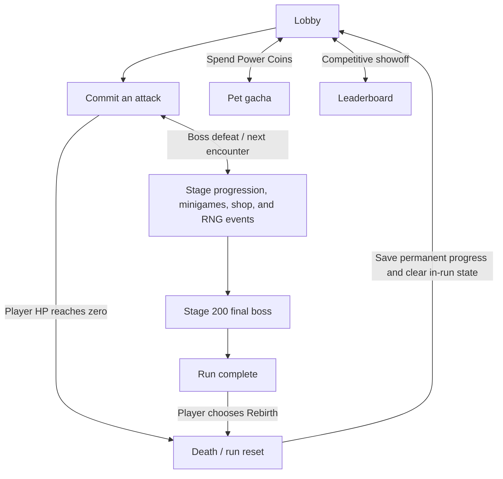
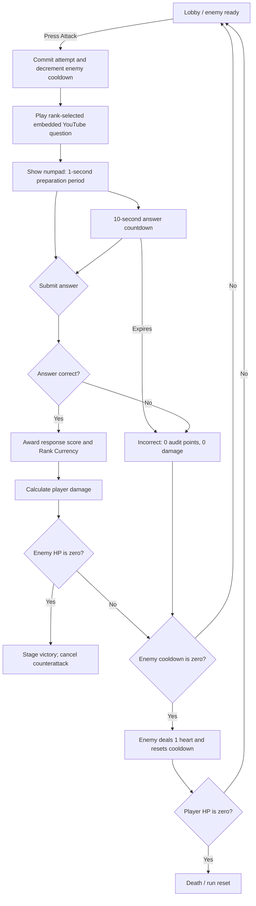

# Power!-Math — Game Design Document

## Document Status

This revision incorporates the new brief and the approved mechanic corrections. Formulas labeled **Starting formula** must be validated through playtesting before they are treated as final balance values.

---

## Project Overview

| Field | Direction |
| --- | --- |
| Title | **Power!-Math** |
| Genre | **2D UI Interactive / Education-Driven / Rogue-lite** |
| Theme | **Fantasy / Boss Rush / RPG** |
| Core Fantasy | Upgrade your sword, challenge yourself, and go beyond your power through a mathematics-driven rogue-lite boss rush. Solve video-based questions, build strength across multiple runs, and reach Stage 200. |
| Platform | **Unity WebGL with mobile compatibility** |
| Presentation | **2D interactive gameplay and visuals**, using “Tan Titan” as the visual reference named in the brief. |
| Run Length | **200 stages** |

### Core Aesthetics

1. **Challenge** — overcome increasingly durable bosses through mathematical performance and multiple runs.
2. **Expression** — shape a run through weapons, pets, upgrades, buffs, and card choices.
3. **Ownership** — retain educational progress, permanent currencies, pets, weapons, and honor across runs.

---

<!-- @tag:core-loop -->
## Core, Meta, and Social Loops



### Player Flow

1. A newly registered student begins at Silver Rank and enters the `Lobby` scene.
2. The lobby displays the current enemy, action panel, visual stage, enemy HP, player hearts, and the enemy’s remaining attack cooldown.
3. Selecting **Attack** commits one combat attempt and loads the active Rank question in an embedded YouTube IFrame Player.
4. When the embedded player reports that the video ended, the answer interface appears. The student enters one non-negative integer answer using the numpad.
5. A correct answer awards a responsiveness score, grants the active Rank Currency, and attacks the enemy.
6. An incorrect answer, timeout, browser close, refresh, or abandoned committed attempt records an incorrect result and deals no damage.
7. Every committed attempt consumes one count from the current enemy’s attack cooldown.
8. If the enemy survives when its cooldown reaches zero, it attacks for 1 heart and its cooldown resets.
9. Defeating the enemy advances the visual stage and creates a new enemy with its own full cooldown.
10. If player HP reaches zero, the run resets and awards Power Coins through the run-reset formula.
11. Fixed or chance-based encounters can include a Math Minigame, Shop, or RNG Card Draw.
12. Defeating the Stage 200 final boss enters `RunComplete`. The player may remain in the lobby, but further combat progression is locked until the optional **Rebirth** button is used.

---

<!-- @tag:combat-attempt -->
## Combat Attempt State Machine



### Attempt Commitment and Resolution Order

1. The server creates a unique attempt transaction when **Attack** is pressed.
2. The current enemy cooldown decreases by one.
3. The question is locked to that attempt; refreshing cannot reroll it.
4. The video and answer window resolve.
5. On success, player damage resolves before any enemy counterattack.
6. If player damage defeats the enemy, the enemy cannot counterattack, even if its cooldown reached zero.
7. If the enemy survives with zero cooldown, it attacks and resets to its unique maximum cooldown.
8. A new enemy always begins with its own full cooldown.

Each enemy definition must provide a unique maximum cooldown value. The lobby must show the remaining count so the next enemy attack is predictable.

---

<!-- @tag:answer-scoring -->
## Answer Input, Timer, and Audit Scoring

### Integer Answer Input

- Valid answers are non-negative integers entered using digits `0–9` only.
- The input supports digit entry, Backspace, Clear, and Submit.
- Submit is disabled while the input is empty.
- Leading zeros are normalized before validation.
- Each question definition must declare an answer-length limit suitable for its correct answer.
- Questions with negative, decimal, fractional, operator-based, or otherwise unsupported answers must be rejected during content validation.
- One submitted answer ends the attempt; there is no second guess.

### Response Timer

After the video completes:

1. Show and enable the numpad.
2. Give a **1-second preparation period**. A correct answer during this period receives the maximum 10 points.
3. Begin a **10-second countdown**.
4. During the final fractional second, the visual timer may display `0`, but an answer is valid only while actual remaining time is greater than zero.
5. When actual remaining time reaches zero, the attempt times out and becomes incorrect.

### Response Score Formula

For a correct answer submitted before timeout:

```text
ResponseScore = clamp(ceil(TimeRemainingSeconds), 1, 10)
```

During the 1-second preparation period:

```text
ResponseScore = 10
```

For an incorrect answer, timeout, refresh, browser close, or abandoned committed attempt:

```text
ResponseScore = 0
```

### Five-Question Audit

- The backend audits performance in non-overlapping windows of exactly **5 resolved questions**.
- Maximum audit score: **50 points**.
- The audit value and partial audit position persist across death, rebirth, reconnection, and sessions.
- After the fifth result, the server evaluates Rank and resets the audit window.
- Audit calculations remain hidden. The UI displays a popup only when an actual promotion or demotion occurs.

| Outcome | Rule |
| --- | --- |
| Promote one Rank | Audit score **≥ 40** |
| Remain at current Rank | Audit score **26–39** |
| Demote one Rank | Audit score **≤ 25** |

- Silver cannot demote below Silver.
- Diamond cannot promote above Diamond.
- A newly registered student starts at Silver.
- Active Rank is educational/meta progression and does **not** reset when a run ends.

### Rank Combat Privilege

Harder question pools provide a direct combat benefit:

| Rank | Damage Multiplier |
| --- | ---: |
| Silver | ×1.0 |
| Gold | ×1.5 |
| Diamond | ×2.0 |

This lets stronger mathematics performance accelerate combat without attaching question difficulty to the visual stage.

---

<!-- @tag:combat-stats -->
## RPG Stats and Damage Calculation

### Enemy Stats

- **Base HP:** positive integer configured per enemy.
- **Current HP:** integer generated when the enemy spawns.
- **Attack Damage:** 1 heart.
- **Maximum Cooldown:** positive integer unique to the enemy.
- **Remaining Cooldown:** initialized from Maximum Cooldown when the enemy spawns or after it attacks.

### Player Stats

- **ATK:** base attack value.
- **CR:** critical rate percentage, clamped from 0% to 100%.
- **CD:** bonus critical damage percentage.
- **HP:** 3 hearts by default.
- Equipped pets, equipped weapons, and in-run effects can modify these stats, including maximum hearts.
- All stats and accumulated bonuses must use data-defined clamps.

### Effective ATK

```text
EffectiveATK =
    BaseATK
    + WeaponATK
    + PetATK
    + InRunFlatATK
```

Percentage in-run damage bonuses stack additively before the final multiplication:

```text
BuffMultiplier = 1 + SumOfPercentageDamageBuffs
```

Critical hits are rolled by the server:

```text
CriticalMultiplier = 1 + (CD / 100)   when critical
CriticalMultiplier = 1                otherwise
```

### Final Damage Formula

```text
FinalDamage = max(1, round(
    EffectiveATK
    × RankMultiplier
    × BuffMultiplier
    × CriticalMultiplier
))
```

- Incorrect and timed-out attempts deal 0 damage.
- Damage and critical results are calculated server-side.
- Enemy HP cannot fall below zero.
- Full Final Damage counts toward `TotalDamageDealt`, including overkill damage.

```text
EnemyHP = max(0, EnemyHP - FinalDamage)
TotalDamageDealt = TotalDamageDealt + FinalDamage
```

---

<!-- @tag:question-data -->
## Math Video Database and Rank Question Inventory

### Firestore Question Schema

The `question` collection contains exactly three Rank documents: `silver`, `gold`, and `diamond`. Each document contains an `items` array. Rank is inferred from the owning document and is not repeated in an item.

| Field | Purpose |
| --- | --- |
| `id` | Stable non-negative numeric identifier, unique within its Rank |
| `video_link` | Valid embeddable YouTube watch, short, or embed link |
| `answer` | Correct non-negative integer answer |

Catalog validation must reject duplicate IDs within a Rank, invalid owning documents, invalid/non-YouTube links, missing videos, and unsupported answers before questions enter the live pool. Runtime identity is the composite `(Rank, id)`.

### Per-Rank FIFO Rules

- Unity receives questions as `question.id` values and stores them in per-rank `RankQuestionInventory` queues.
- Silver, Gold, and Diamond each retain an independent queue position.
- One question can appear at most once within a five-question audit window.
- Correctly answered questions are removed from the current question cycle.
- Incorrect questions are skipped for the rest of the current audit window and remain in the incorrect/played list.
- After an audit finishes, failed questions return to the front of that Rank’s FIFO queue in failure order.
- If the player changes Rank, unfinished questions wait in their original Rank queue until the player returns.
- Example: a five-question Silver batch beginning at ID 93 covers IDs `93–97`; a Gold batch beginning at ID 23 covers IDs `23–27` when those IDs are sequentially available.

### Pool Exhaustion

- When every valid question in a Rank pool has been cleared for the current cycle, that Rank database restarts from index zero as a new cycle.
- Historical correctness, responsiveness, audit, and mastery analytics remain intact.
- Restarting the pool does not make old questions appear historically unplayed.
- The server records a cycle counter so repeated content can be distinguished in analytics.

### Content or Delivery Failure

- A confirmed missing/corrupt video or invalid server question voids the attempt, restores the consumed enemy cooldown count, and records a content error rather than an incorrect student answer.
- A student closing, refreshing, or abandoning a valid committed question records an incorrect answer.
- If the server received the submission before disconnect, reconnecting returns the authoritative saved result without resolving it twice.

---

<!-- @tag:stage-progression -->
## Stage, Map, and Difficulty Progression

### Stage Rules

- A run contains **200 visual stages**.
- A stage advances only when the current enemy is defeated.
- Ordinary stages randomize an enemy from the range configured for that stage.
- Fixed stages can contain predetermined minigames or shops.
- Visual stage and `question.id` are independent values.
- Math difficulty follows the active Rank; enemy durability follows World Level.

### Map and Biomes

- The map presents the run as a pseudo stage-like UI.
- The visual biome changes at each quarter of the 200-stage journey.

### Starting Enemy HP Formula

The 200 stages are divided into 40 World Levels, with one World Level per five stages:

```text
WorldLevel = ceil(Stage / 5)
GrowthSteps = WorldLevel - 1
```

Enemy HP gains an additive 12% of Base HP per completed World Level step:

```text
ScaledHP = BaseHP × (1 + 0.12 × GrowthSteps)
SpawnHP = max(1, round(ScaledHP × RandomRange(0.95, 1.05)))
```

- Stages 1–5 use Base HP before randomization.
- Stages 196–200 use 5.68 × Base HP before randomization.
- The server generates and saves Spawn HP once. Refreshing cannot reroll enemy HP.
- Only enemy HP uses the World Level scaling formula.

This is a **starting formula**. Playtest the number of correct attempts required per enemy across early, middle, and late runs. If late fights become repetitive rather than more strategic, reduce HP growth or strengthen the planned upgrade curve.

---

<!-- @tag:encounters -->
## Rogue-lite Encounters

### Math Minigame

- Appears at fixed stage positions.
- Can be replayed on later runs after death or rebirth.
- The first account-wide clear of each fixed minigame stage grants **25 Power Coins**.
- Later clears remain playable but grant an existing in-run buff or Rank Currency instead of another permanent 25-Power-Coin reward.
- A permanent reward-claimed flag is stored for each fixed minigame stage.

### Shop

- Supports permanent equipment upgrades and run preparation.
- Weapon access is unlocked by accumulated Rank Currency thresholds without deducting Rank Currency.
- Data-defined equipment upgrade costs spend Power Coins.

### RNG Card Draw

- The player chooses between card outcomes by swiping left or right.
- A resolved choice grants an in-run buff or power-up card.
- Card ownership and effects reset on death or rebirth.
- A committed choice is saved as an idempotent server transaction so reconnecting cannot reroll or claim both choices.

---

<!-- @tag:run-reset -->
## Death, Rebirth, and Persistence

### State Ownership

| State | Death/Rebirth Behavior |
| --- | --- |
| Visual stage and World Level | Reset to Stage 1 |
| Current enemy HP and cooldown | Cleared |
| Player current/max run hearts | Reset to equipped starting values |
| RNG buffs and power-up cards | Cleared |
| Active Rank and partial audit | Preserved |
| Per-rank question queues and cycle history | Preserved |
| Rank Currencies and Power Coins | Preserved |
| Pets, weapons, unlocks, and upgrades | Preserved |
| Profile analytics, Highest Stage, and honor | Preserved |

### Death

- Player HP reaching zero ends the run immediately.
- The server snapshots the final run values, calculates and grants the run reward once, clears in-run state, and returns the player to Stage 1.
- Death and Rebirth use the same progression-reset rules.

### Stage 200 and Rebirth

- Defeating the Stage 200 final boss enters `RunComplete`.
- The lobby, profile, gacha, and leaderboard remain available.
- Further attacks and stage farming are disabled while the run is complete.
- Rebirth is activated only when the player presses the optional button.
- Rebirth grants the run reward, increments Prestige/Honor, clears in-run state, and returns the player to Stage 1.

---

<!-- @tag:economy -->
## Currency and Run-Reset Economy

### Rank Currencies

- Correct answers permanently award the currency associated with the active Rank.
- Silver, Gold, and Diamond balances are separate and persist across runs.
- Rank Currency serves as a cumulative weapon-unlock threshold and is not deducted when an unlock requirement is met.

The values below are weighting coefficients in the run-reset formula, not a direct currency-exchange transaction:

| Currency Earned This Run | Power Coin Weight |
| --- | ---: |
| 1 Silver | 0.5 |
| 1 Gold | 0.7 |
| 1 Diamond | 1.0 |

### Power Coins

- Power Coins are permanent and spendable.
- A pet gacha pull costs **25 Power Coins**.
- Equipment upgrades can also use data-defined Power Coin costs.
- Power Coins come from first-clear minigame rewards and death/rebirth run rewards.

### Starting Run-Reward Formula

```text
WeightedRankCurrency =
    (SilverEarnedThisRun × 0.5)
    + (GoldEarnedThisRun × 0.7)
    + (DiamondEarnedThisRun × 1.0)

CompletionFactor = (StageReached / 200)²

RunPowerCoins = floor(
    WeightedRankCurrency
    × CompletionFactor
    × BonusMultiplier
)
```

- `StageReached` is clamped from 1 to 200.
- The formula uses currency earned during the current run, never the player’s permanent balance.
- `BonusMultiplier` is snapshotted before in-run effects are cleared.
- A result below 1 rounds down to 0; very short failed runs may grant no Power Coins.
- Each death or rebirth transaction can grant its reward only once.

This is a **starting formula**. Simulate Power Coins per minute for normal progression, deliberate early death, and repeat minigame routes. Continuing a viable run must remain more profitable than intentional death. If farming wins, increase the completion exponent or reduce repeat rewards before changing unrelated systems.

---

<!-- @tag:gacha -->
## Pet Gacha and Duplicate Handling

### Percentage-Ratio Redistribution

Each rarity category owns a fixed percentage of the complete gacha probability. That percentage is divided among only the pets inside that rarity; redistribution never changes the rarity category’s total rate.

Within one rarity category:

1. Divide the category percentage equally among every pet in that rarity.
2. Treat each pet’s original equal share as a ratio weight of `1.0`.
3. When a pet is owned, reduce its original individual share to a ratio weight of `0.5`—half its default probability.
4. Divide the removed probability equally among every unowned pet in the same rarity.
5. Keep the combined probabilities of all pets exactly equal to the rarity category percentage.
6. When every pet in the rarity is owned, restore the original equal division because there are no unowned pets that can receive the removed probability.

For rarity percentage `R`, total pets `N`, owned pets `O`, and unowned pets `U = N - O`:

```text
BasePetChance = R / N
OwnedPetChance = BasePetChance / 2

When U > 0:
    UnownedPetChance =
        BasePetChance
        + ((O × BasePetChance / 2) / U)

When U = 0:
    EveryPetChance = BasePetChance
```

#### Percentage Example — One Owned Pet

An SSR rarity has a total rate of 3% and contains five pets:

```text
Default chance per pet = 3% / 5 = 0.6%

One owned pet:
    Owned pet chance = 0.6% × 0.5 = 0.3%

Removed chance:
    0.6% - 0.3% = 0.3%

Redistribution across four unowned pets:
    0.3% / 4 = 0.075% added to each

Each unowned pet chance:
    0.6% + 0.075% = 0.675%

Category total:
    0.3% + (4 × 0.675%) = 3%
```

Therefore, the owned pet has a 0.3% chance and every unowned pet has a 0.675% chance.

#### Percentage Example — Rarity Complete

If all five SSR pets are owned, the rarity returns to its original equal ratio:

```text
Every pet chance = 3% / 5 = 0.6%
Category total = 5 × 0.6% = 3%
```

### Duplicate Result

- Pulling an already-owned pet is an **empty duplicate pull**.
- It does not level, merge, convert, or otherwise modify the owned pet.
- When a rarity category is complete, its original equal odds return even though every result in that category is an empty duplicate.
- The UI must display the current calculated probabilities before the player confirms a pull.
- The server performs the roll and reward as one idempotent transaction.

---

<!-- @tag:leaderboard-profile -->
## Leaderboard, Profile, and Challenger League

### Fun Leaderboard

The main leaderboard is a social showoff feature rather than a pure educational ranking. It contains three grade tabs:

1. Grade 7
2. Grade 8
3. Grades 9–10

Each entry displays:

- Display Name
- Current Stage
- Accumulated Rank System/Currency progress
- Total Damage Dealt, including overkill

Current Stage resets to 1 after death or rebirth. Prestige/Honor remains visible in the player profile.

### Public Profile Data

Other players may inspect only general progression and ownership data:

- Icon and Display Name
- Leaderboard position
- Current Stage and Highest Stage
- Prestige/Honor
- Rank Currency totals
- Total Damage Dealt
- Equipped Pet, Weapon, and Avatar
- First Time Reaching Stage 200

Online status is not public. Registration date, total play time, response history, question history, audit statistics, efficiency statistics, and other educational analytics remain private to the student and authorized education views.

### Private Educational Analytics

- Total Questions Cleared
- Correct and incorrect results by question and Rank
- Response Score and response duration
- Mean and median response efficiency
- Mean and median audit score
- Rank changes and question-cycle history

### Challenger League

Challenger League is a separate pure-mathematics competitive mode.

- Pets, weapons, ATK upgrades, CR, CD, RNG cards, and all account combat bonuses are disabled.
- Competitors use the same grade-appropriate content rules and timing conditions.
- Results depend only on answer correctness and responsiveness.
- Challenger League results use a leaderboard separate from the fun progression leaderboard.

---

<!-- @tag:server-authority -->
## Server Authority, Saving, and Recovery

- The server is authoritative for attempts, timers, answers, audit scores, Rank changes, damage, critical rolls, cooldowns, HP, currencies, gacha, unlocks, RNG cards, stage progression, death, and rebirth.
- Save after every completed question or committed state-changing action.
- Every state-changing action uses a unique transaction ID and is idempotent.
- Pressing Attack commits the question and boss cooldown consumption before content begins.
- The server opens and timestamps the answer window after validated video completion; the client timer is presentation only.
- A valid attempt unresolved by its deadline becomes incorrect.
- Refreshing or closing during a valid committed question does not restore the consumed cooldown and cannot reroll the question.
- Reconnecting after a received submission returns the saved authoritative result.
- A confirmed server/content failure voids the attempt without penalizing the student.

---

<!-- @tag:feedback -->
## Required Player Feedback

Significant actions require at least visual and audio feedback:

| Event | Required Feedback |
| --- | --- |
| Attack committed | Input acknowledgement and question transition |
| Correct answer | Correct-state UI plus positive audio cue |
| Incorrect answer or timeout | Clear failure reason plus non-punitive audio cue |
| Player damage | Heart loss animation plus impact audio |
| Enemy damage | Damage number/HP response plus hit audio |
| Critical hit | Visually stronger impact plus distinct audio |
| Enemy cooldown change | Persistent numeric indicator and warning state before zero |
| Promotion or demotion | Rank popup plus transition audio |
| Enemy defeat | Defeat animation plus stage-progression feedback |
| Death/Rebirth | Clear reset summary showing preserved and removed state |

Players must be able to tell why an attack succeeded, why it failed, when the enemy will attack, and what survived a reset.

---

<!-- @tag:player-experience -->
## Player-Experience Evaluation

| Component | Current Design Requirement |
| --- | --- |
| **Clarity** | Show the answer timer, enemy cooldown, damage result, failure reason, Rank-change popup, and reset summary before the player must make the next decision. |
| **Motivation** | Correct mathematics creates immediate damage and Rank Currency while deeper runs improve permanent Power Coin rewards, equipment ownership, prestige, and profile honor. |
| **Response** | Numpad input acknowledges every valid press, one submission resolves deterministically, and authoritative reconnect handling prevents duplicated or lost outcomes. |
| **Satisfaction** | Correct answers, critical hits, enemy defeats, promotions, death, and rebirth each use distinct visual and audio feedback. |
| **Fit** | Harder Rank questions grant higher damage, directly connecting mathematical challenge to the fantasy of growing beyond the player’s current power. |

When these goals conflict, protect input response and outcome clarity before increasing spectacle or reward size.

---

<!-- @tag:guardrails -->
## Design Guardrails

- Keep visual stage, World Level, active Rank, and `question.id` as separate concepts.
- Advance the visual stage only after defeating the current enemy.
- Treat pressing Attack as an irreversible committed attempt unless a confirmed system/content failure occurs.
- Resolve player damage before an enemy counterattack.
- Preserve educational/meta progression across run resets.
- Clear only rogue-lite in-run progression on death or rebirth.
- Attempt each question at most once per five-question audit window.
- Preserve the total probability of every gacha rarity while redistributing owned-pet chances.
- Do not deduct Rank Currency when it satisfies a weapon-unlock threshold.
- Prevent Stage 200 farming by locking combat after the final victory until Rebirth.
- Prevent repeat minigame Power Coin farming with permanent first-clear reward flags.
- Strip all account power from Challenger League.
- Keep private educational analytics out of public profiles.

---

<!-- @tag:playtest -->
## Validation and Playtest Plan

### New Player Test

- Ask a fresh player to complete an attack without explanation.
- Verify that the player can identify the timer, Submit action, enemy cooldown, correct/incorrect result, and stage objective.
- Starting pass target: the player correctly explains the result of at least 8 of 10 observed attempts.

### Stress and Recovery Test

- Spam digits, Backspace, Clear, and Submit.
- Attempt double submission and repeated action requests.
- Refresh during video, preparation time, countdown, and result resolution.
- Disconnect before and after the server receives a submission.
- Verify that each attempt, reward, damage event, and gacha pull resolves no more than once.

### Skill and Rank Test

- Compare accurate-fast, accurate-slow, inaccurate-fast, and timeout behavior.
- Verify that five-question audit boundaries and Rank transitions match the documented thresholds.
- Confirm with educators that Rank movement reflects intended student placement rather than input friction.

### Combat Pacing Test

- Measure correct answers required to defeat early-, middle-, and late-run enemies across expected equipment levels.
- Verify that Rank multipliers create meaningful faster progression without making Silver mathematically unable to advance.
- If combat feels repetitive, tune HP growth and the upgrade curve before adding more random damage.

### Economy Abuse Test

- Compare Power Coins per minute from normal progression, intentional early death, fixed-minigame repetition, and Stage 200 completion.
- Continuing a viable run must outperform deliberate death farming.
- Verify that retries, reconnects, and duplicate requests cannot grant currency twice.

### Readability Test

- Ask an observer to explain why the player dealt damage, why the enemy attacked, which state reset, and which progression persisted.
- Starting pass target: correct explanation in at least 8 of 10 observed resolutions.

---

## Tunable Content Values

The mechanics are defined, but these content values remain data-driven tuning work:

- Base ATK, weapon ATK, pet ATK, CR, CD, and all stat clamps.
- Individual enemy Base HP and maximum cooldown values.
- Equipment unlock thresholds and Power Coin upgrade costs.
- Encounter positions, RNG-card pools, and buff caps.
- Enemy pools per stage and biome presentation details.
- Challenger League content sets, session format, and scoring presentation.
- Final balance confirmation for the timer, 12% World Level HP growth, 25-Power-Coin costs/rewards, and squared completion factor.
