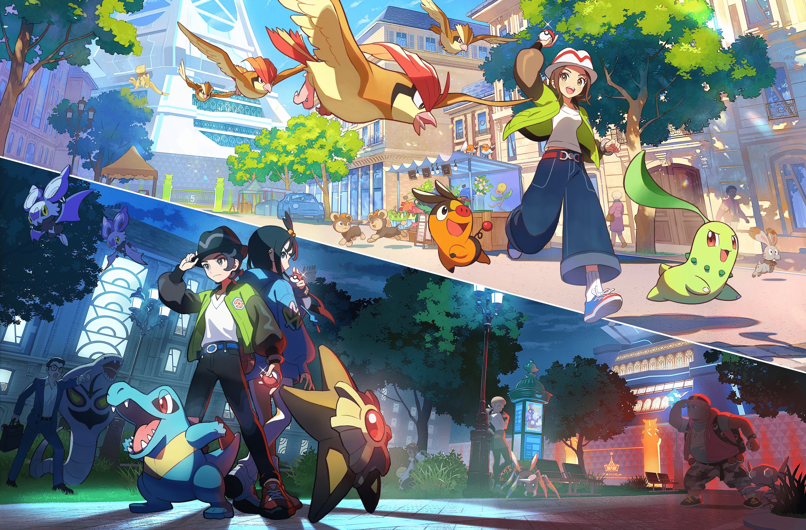
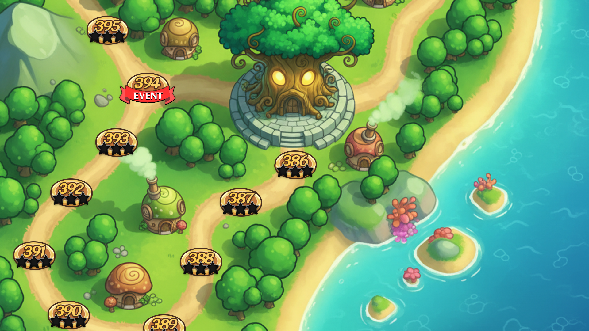
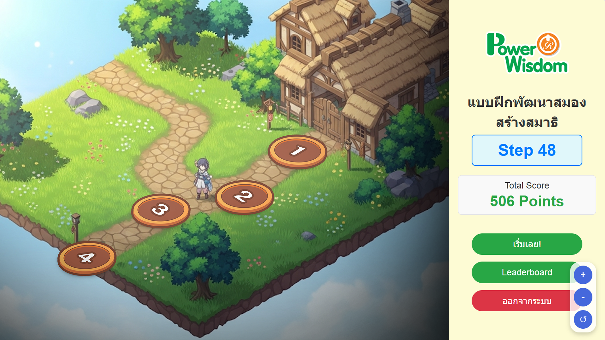
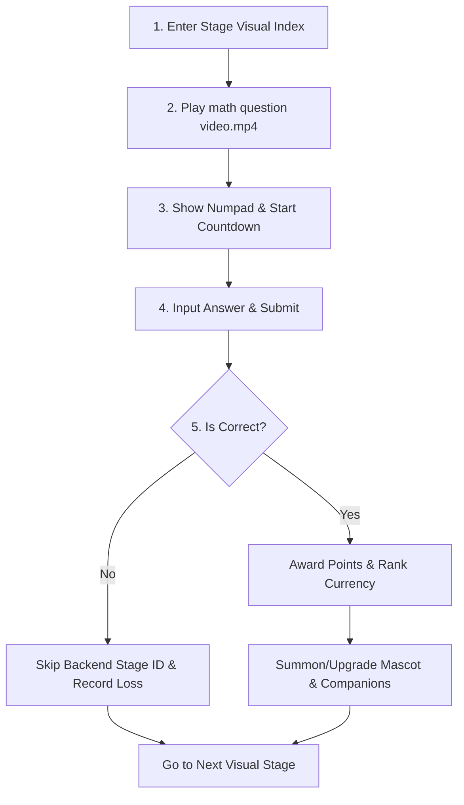
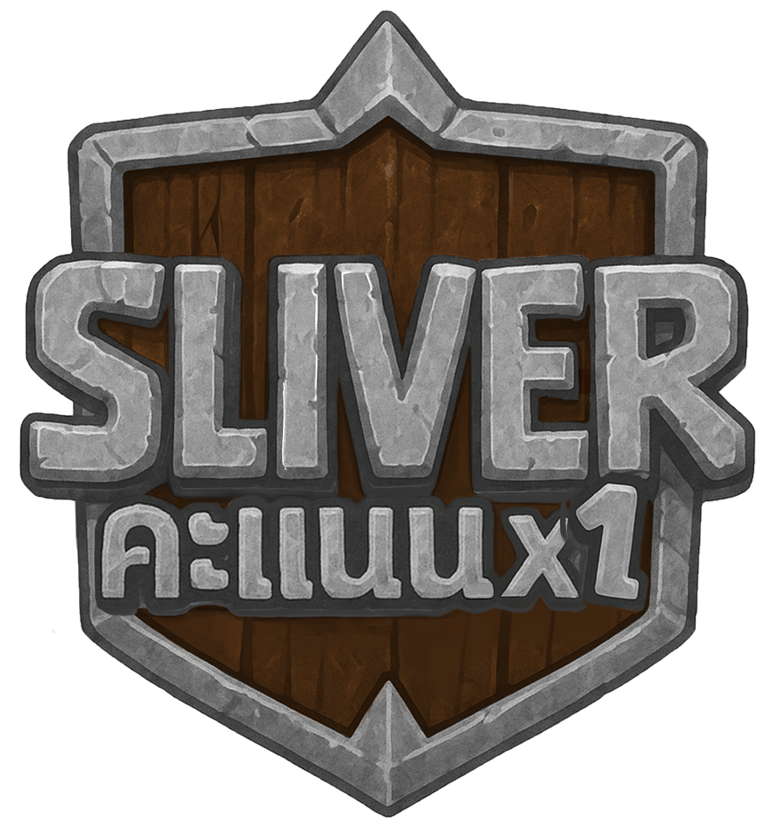
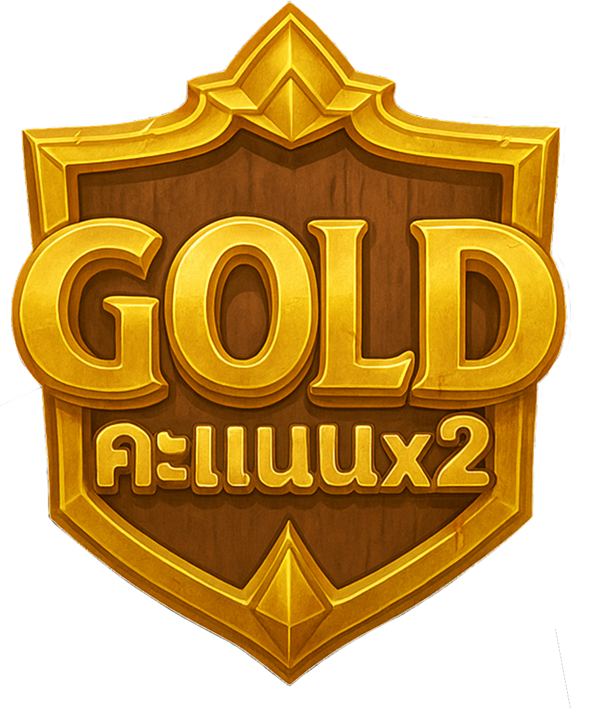
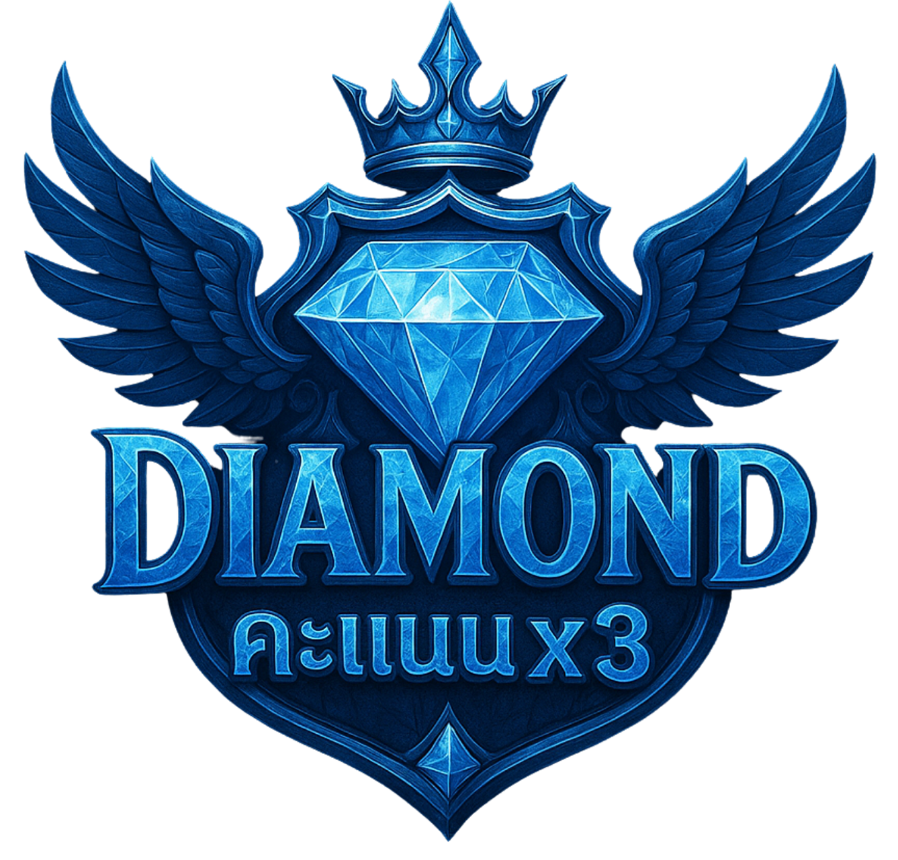
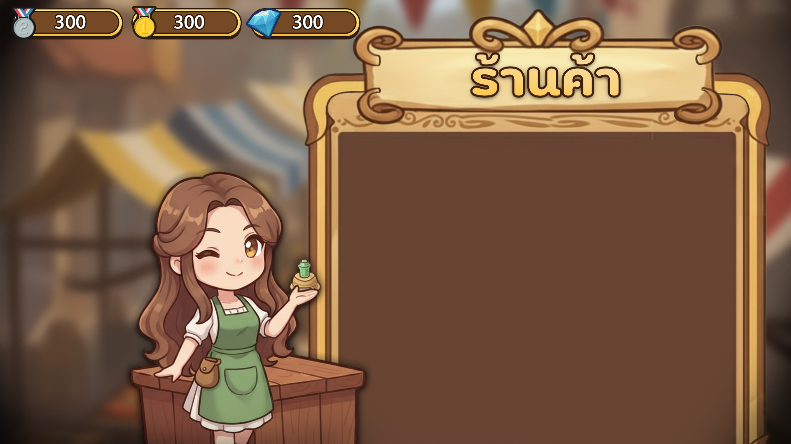
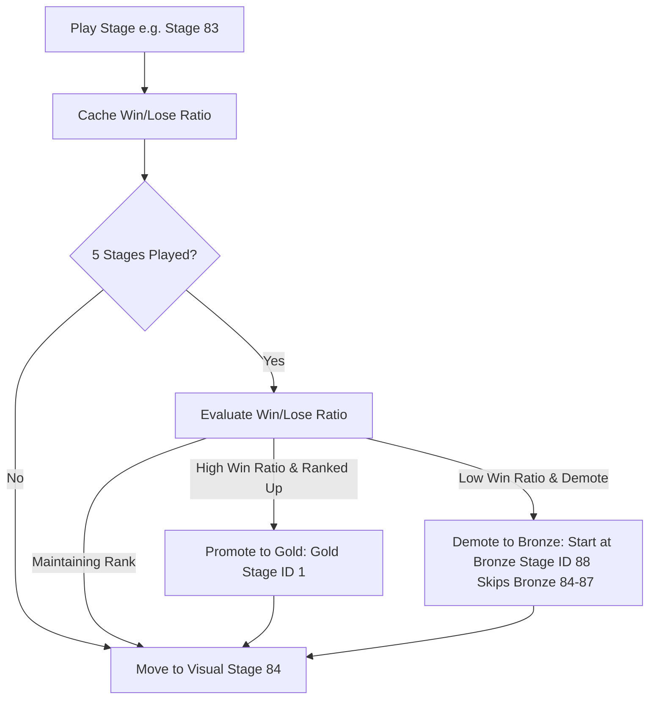
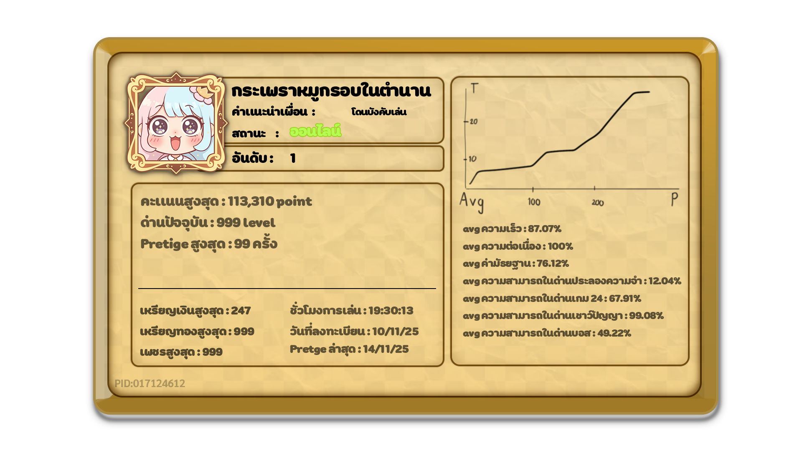

# PowerMath Project — Game Design Document

## Project Visual Concepts (Reference Only)

---

## Project Identity

| Field | Direction |
| --- | --- |
| Working Title | **PowerMath** |
| Genre | **Educational / Mathematic / Fantasy / 2D / Level-Driven** |
| Core Fantasy | A young wizard-scholar battling fantasy forces and summoning magical companions by mastering mathematical challenges. |
| Player Promise | Play rewarding level-driven challenges, summon cute anime companions for collection and expression, and climb dynamic leaderboards through math mastery. |
| Platform Priority | **Unity WebGL on React Web-App**, with **PC / Mobile** browser support |
| Camera / Play Plane | **2D Side-scroller / Screen-fixed interactive UI** |
| Tone | **Cute, Colorful, Competitive, Educational, Gamified, Rewarding** |
| Story Intent | |

### Experience Pillars(รอเเก้เนื้อหาส่วนนี้)

1. **Adaptive Gamified Pedagogy**
   Dynamic, backend-driven math progression that adjusts to a student's real-time performance without visual frustration.

2. **Anime Gacha Collection**
   Psychological motivation loop inspired by Pokémon and LINE RANGERS, letting players summon and level up adorable companions.

3. **Dual-Tiered Competition**
   Merging a global top leaderboard with small-cohort micro-leaderboards to keep kids of all mathematical abilities engaged.

4. **Cute Narrative & Mascots**
   A bright, cartoonish fantasy setting with a central guide mascot that turns learning into an adventure.

---

<!-- @tag:inspirations -->
## Inspirations

### Primary Inspirations

- **MathFriend:** Adaptive mathematical mapping.
- **LINE RANGERS:** Vibrant side-scroller mascot battle UI.
- **Pokemon GO:** Gacha collection feel, elemental types, and helper mascot presence.

### What To Borrow

- The visual polish, reward pacing, and cute creature collection loops that drive long-term player retention.
- Double-tier leaderboards to prevent low-tier player demotivation.

### What Not To Copy Blindly

- Punitive gameplay states. Kids must never feel stuck in a loop of negative feedback or repetitious basic stages.

---

<!-- @tag:visual-audio -->
## Visual, Mood, and Audio Direction(รอเเก้เนื้อหาส่วนนี้)

### Mood Board Theme

- Pokémon-like Companions
- LINE RANGERS Battle UI
- Cute Guide Mascot
- Colorful Cartoon Fantasy

(หา Referene)

### Rendering Style(รอเเก้เนื้อหาส่วนนี้)

- Vibrant, high-contrast HSL tailored color palette.
- Anime/Cartoon style resembling Pokemon and LINE RANGERS.
- Premium, dynamic industry-standard UI design.
- Smooth CSS and Unity canvas micro-animations on interaction.
- Clean 2D character sprites and interactive numpads.

(หา Referene)

### Character Design

(หา Referene)

### Monster Design / Enviroment Design

(หา Referene)

### UX/UI

(หา Referene)

### Biome Design

(หา Referene)

### Audio Direction(รอเเก้)

- Upbeat, energetic cartoon-fantasy background music.
- Positive chime SFX for correct inputs and level completions.
- Soft, non-punitive boop sound for incorrect answers.
- Playful sound cues associated with the mascot guide's presence.

(หา Resource Website or stock song)

---

<!-- @tag:platform-input -->
## Platform and Input Philosophy

### Primary Rule

**WebGL (React Web-App Wrapper)** is the authoritative input model. Supporting both Desktop browser mouse/keyboard and Mobile browser touch input layers seamlessly.

### Web Controls(รอเเก้)

- **Mouse Click / Mobile Touch:** Answer selection, UI navigation, and gacha pulls.
- **Physical Keyboard (PC):** Numpad input for quick mathematical answers.
- **On-Screen Numpad:** Custom graphic UI for touch devices and mouse users.

---

<!-- @tag:core-loop -->
## Core Game Loop(รอเเก้)

The fundamental loop is:

### Progression Cadence

- Difficulty ramps up or down in blocks of 5 stages based on the cached win/loss ratio.
- Ranks (Bronze, Gold, Diamond) determine the pool of 200 stage IDs loaded (out of 600 cumulative stages).
- Speed bonus rewards fast computation to build arithmetic automaticity.

### Failure / Recovery Pattern

- Incorrect answers do not halt visual progress or display demotivating skip notifications on the front-end.
- The backend silently skips the stage ID to adjust next difficulty, maintaining the kid's sequential visual flow (Stage 1, 2, 3...) to keep the game positive.

---

<!-- @tag:contents -->
## Canonical Gameplay Content — Enemies and Threats

### Chaotic Number Monsters

**Role:** Mathematical blockers that guard the stages.

**Design intent**

- Represent the specific mathematical concepts (e.g., Division, Subtraction).
- Appear in `video.mp4` animated question clips.
- Apply pressure via the countdown timer bar.

**Counterplay**

- Analyze the animated problem statement.
- Type/touch the correct answer on the numpad before the countdown expires.

<!-- @tag:badges -->
## Canonical Gameplay Content — Badges

| Image | Role | Intended Effect |
| --- | --- | --- |
|  | Bronze Currency | Awarded in Bronze stages. Used to pull Common/Rare companions. |
|  | Gold Currency | Awarded in Gold stages. Used to pull Rare/Epic companions. |
|  | Diamond Currency | Awarded in Diamond stages. Used to pull Epic/Legendary companions. |

---

<!-- @tag:mechanics -->
## System Mechanics

### Adaptive Normal Stage

- **Visuals:** Shows 200 sequential stages on the map interface.
- **Backend Map:** Utilizes 200 distinct Stage IDs per rank (600 total).
- **Execution:** Shows math problem -> shows numpad -> countdown starts.
- **Fail Mechanism:** If incorrect, the current backend Stage ID is skipped. The front-end stage visual progression remains continuous (e.g., visual stage 83 moves to visual stage 84).

### Mini-Games

- Pre-fixed special stages (e.g., Make 24, Picture Matching, Quick Math, Wish Questions).
- Act as bonus levels offering significantly higher points and gacha currency.
- Offer visual and interactive variety to prevent math fatigue.

### Rank System & Ranking Up/Down Logic

- **Ranks:** Bronze (Easy/Basic), Gold (Medium/Intermediate), Diamond (Hard/Advanced).
- **Performance Evaluation:** Every 5 stages, the cache of win/lose results is analyzed.
- **Transition Logic:** If a kid on Bronze Stage 83 gets promoted to Gold, they begin Gold Stage ID 1 on Visual Stage 84. If they fail to maintain performance after 5 stages (at Visual Stage 88), they demote back to Bronze Stage ID 88 (skipping Bronze IDs 84–87).

### Social / Gamification / Competition Model

- **Top Leaderboard (Global):** Displays the ultimate high-scorers. Caters to highly competitive students.
- **Micro Leaderboard (Weekly Cohorts):** Automatically groups 10-15 active students of matching ranks. Resets weekly to provide realistic goals and achievable wins for lower/middle-tier students.
- **Anime Gacha Summoning:** Kids spend earned Rank Currency to summon cute companions. Higher rank currency unlocks better summon pools.
- **Mascot Bonding:** Feed, train, and bond with collected pets to boost their animations and cosmetic tiers, translating learning success into tangible game progress.
- **Classroom Milestones:** Collaborative points goals where a school or class works together to unlock shared mascot cosmetics.

---

<!-- @tag:data-analytics -->
## Data Analytics Plan

| Data Point | Metric Captured | Purpose / Pedagogical Value | Target Improvement Indicator |
| --- | --- | --- | --- |
| **Response Latency** | Milliseconds from Numpad spawn to submission | Monitors arithmetic fluency and automaticity | Decreasing average response time over successive stages |
| **Topic-Specific Accuracy** | % correct answers per concept (e.g., Division, Decimals) | Identifies specific mathematical concept mastery and learning gaps | Shift from low mastery (<70%) to high mastery (>90%) |
| **Error Vector Analysis** | Categorization of wrong inputs (e.g., off-by-one, inversion errors) | Detects common cognitive bugs and math misunderstandings | Reduction in systematic errors, showing conceptual correction |
| **Rank Transition Velocity** | Rate of moving between Bronze, Gold, and Diamond tiers | Monitors overall progression rate and learning curve steepness | Positive slope in rank over weeks; less time spent in Bronze |
| **Play Retention & Stamina** | Daily Active Users (DAU), play duration per session, stages cleared | Measures engagement, perseverance, and learning stamina | High weekly session frequency and longer play streaks |
| **Mini-Game Efficacy** | Completion rates and scores in non-standard levels | Assesses lateral mathematical thinking and visual math skills | Improved scoring and faster completion in diverse puzzle types |

---

<!-- @tag:tech-stack -->

### Technical Stack

| Area | Current Repo Truth |
| --- | --- |
| Engine | **Unity (WebGL)** |
| Web Wrapper | **React Web-App Framework** |
| Authentication & DB | **Firebase (Authentication & Realtime Database/Firestore)** |
| Hosting & CDN | **Cloudflare (Domain & static WebGL hosting)** |
| Gameplay Dimension | **2D** |
| Input | **On-Screen Numpad / Mouse / Touch** |
| UI | **Unity UI Canvas + React Web Interface** |

---

<!-- @tag:scene-roles -->
## Canonical Future Scene Roles

| Scene Role | Purpose |
| --- | --- |
| `ReactBootstrap` | Initial login, user authentication via Firebase, and UI entry. |
| `StageSelector` | Map screen displaying 1-200 visual levels, progress tracker, and gacha portal. |
| `NormalStage` | Unified gameplay scene that plays `video.mp4`, handles timers, and loads numpad inputs. |
| `MiniGameStage` | Unique gameplay scenes for quick math, matching pictures, and 24 math. |
| `GachaRoom` | Visual hub for spending rank currency, viewing companion rosters, and feed mechanics. |

---

### Hard Rule

No gameplay state or adaptation calculation should bypass the `RankCacheManager` or be saved strictly client-side to prevent cheating or data loss.

---

<!-- @tag:architecture -->
## Target Architecture Direction

### Architecture Principles

1. **Academic progression authority first**
   The student's math profile and the adaptive Stage ID mapping are the authoritative sources of truth for loaded content.

2. **Data-driven stage definitions**
   Stages, video paths, question solutions, and mini-game configs must be loaded from data objects (e.g., ScriptableObjects or JSON definitions).

3. **Decoupled Web-Unity layer**
   Unity handles gameplay performance, audio, and visual presentation; React handles analytics dashboards, leaderboards, and session persistence.

4. **Event-driven UI**
   The game UI elements (numpad, timer, mascot reactions) listen to gameplay events and avoid direct script polling.

### Recommended Folder Direction

- `Assets/Core/` — Game loop, managers, and React-Unity bridges.
- `Assets/Gameplay/` — Normal stages, timer controllers, and mini-game scenes.
- `Assets/Companions/` — Gacha definitions, mascot data, and feeding systems.
- `Assets/UI/` — Custom canvas components, numpad interfaces, and HUDs.

---

<!-- @tag:guardrails -->
## Contributor Guardrails

### Preserve These Non-Negotiables

- Front-end level map must show continuous linear progression (1 to 200). Never skip visual stages upon failure.
- Performance statistics (Response Latency, Accuracy, Error Types) must be sent on every stage completion.

<!-- @tag:roadmap -->
## Phased Refactor Roadmap

### Phase 1 — Core Gameplay & Stage Logic

**Goal:** Setup basic normal stage with video playback, numpad entry, and timed response.

- Initialize `video.mp4` playback handler.
- Wire timer countdown with numpad input verification.

### Phase 2 — React-Unity-Firebase Bridge

**Goal:** Implement auth verification and WebGL cross-communication.

- Connect React wrapper to Firebase authentication.
- Establish Unity WebGL external calls to sync user data and rank.

### Phase 3 — Rank Caching & Adaptation

**Goal:** Implement the 5-stage check and promotion/demotion logic.

- Build the `RankCacheManager` for tracking win/loss ratio.
- Implement Bronze/Gold/Diamond stage ID mapping.

### Phase 4 — Analytics & Gacha Features

**Goal:** Hook up the data harvesting pipeline and mascot summoning room.

- Integrate the telemetry collector for speed, accuracy, and errors.
- Build the gacha summon pool and roster database.

### Phase 5 — Micro-Leaderboards & Polish

**Goal:** Integrate the social loops and classroom guild targets.

- Develop React weekly cohort assignment scripts.
- Polish visual effects, mascot guide sound cues, and gacha pull experiences.
