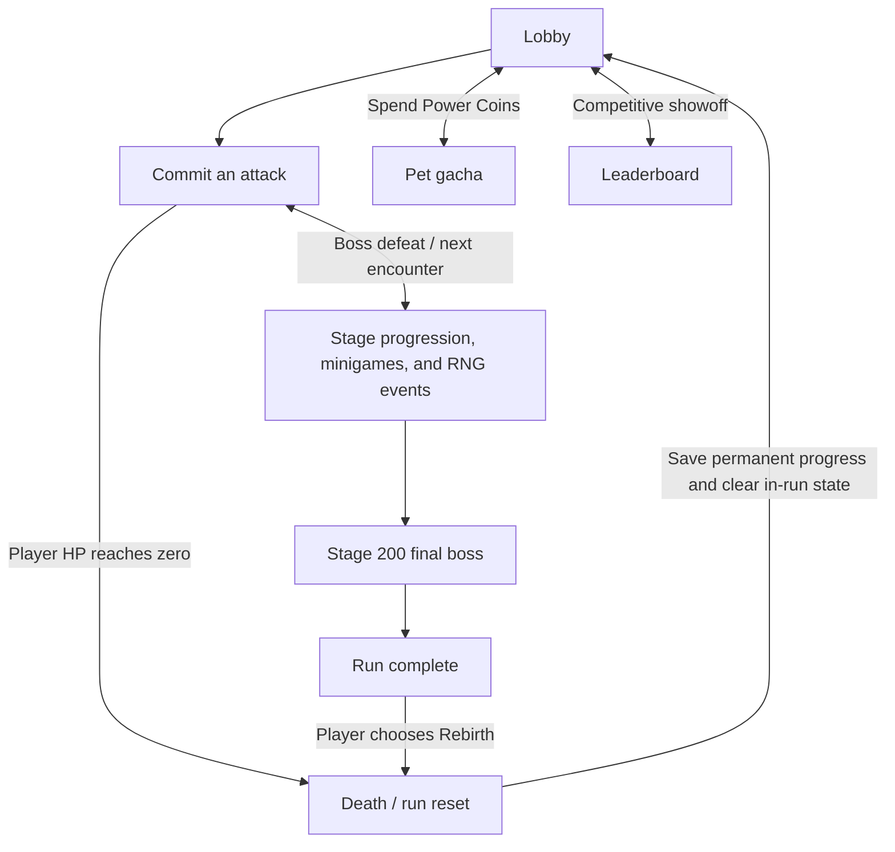
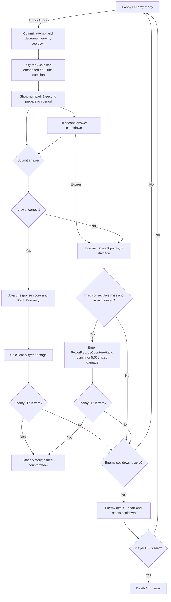

# Power!-Math — Game Design Document

## Document Status

This revision is the canonical product-design source of truth for the kid-friendly power-fantasy and economy direction approved on 2026-09-13 and the story-tutorial/Power Rescue direction approved on 2026-09-14. It supersedes older GDD language describing equip-driven pet stats/passives, empty pet duplicates, retrying Challenge Monsters, `+0.1%` Legacy ATK per Stage, or Rebirth at Stage 50. Formulas or values labeled **Starting** keep their stated tuning status; all other rules below are current design requirements.

---

## Project Overview

| Field | Direction |
| --- | --- |
| Title | **Power!-Math** |
| Genre | **2D UI Interactive / Education-Driven / Rogue-lite** |
| Theme | **All Kid-Friendly / Number Rank-Up Power Fantasy / Generous Economy** |
| Core Fantasy | Make numbers visibly grow through mathematics: raise one evolving sword from 20 to 1,500 ATK, build an always-helpful pet collection, return stronger after every run, and reach Stage 200 without trap rewards or gear regret. |
| Platform | **Unity WebGL with mobile compatibility** |
| Presentation | **2D interactive gameplay and visuals**, using “Tan Titan” as the visual reference named in the brief. |
| Run Length | **200 stages** |

### Core Aesthetics

1. **Readable Growth** — children can see their ATK, collection, and run rewards increase without comparing ambiguous gear stats.
2. **Power Fantasy** — Weapon Ascend supplies the large flat-number jumps needed to catch enemy HP, while Rank, response, and Legacy multipliers make that base power explode in later runs.
3. **No-Regret Ownership** — every pet pull improves the account, the favorite equipped pet remains a cosmetic choice, and permanent progress survives death/Rebirth.

---

<!-- @tag:core-loop -->
## Core, Meta, and Social Loops



### Player Flow

1. A newly registered student begins at Silver Rank and enters the `Lobby` scene.
2. The lobby displays the current combat/Event encounter, action panel, visual Stage, relevant HP/rules, player hearts, and the enemy cooldown when standard combat is active.
3. Selecting **Attack** commits one combat attempt and loads the active Rank question in an embedded YouTube IFrame Player.
4. When the embedded player reports that the video ended, the answer interface appears. The student enters one non-negative integer answer using the numpad.
5. In standard combat, a correct answer awards a responsiveness score, grants the active Rank Currency, and attacks the enemy. Event questions use their Event Definition's explicit audit/currency policy.
6. An incorrect answer, timeout, browser close, refresh, or abandoned committed attempt records an incorrect result and the player deals no damage. After three consecutive non-void failures against the same standard enemy, an unused Power Rescue Counter-Attack may deal separate support damage.
7. Every committed standard-combat attempt consumes one count from the current enemy's attack cooldown; Events use their explicit committed-attempt policy.
8. If the enemy survives when its cooldown reaches zero, it attacks for 1 heart and its cooldown resets.
9. Defeating an enemy or resolving an Event advances the visual stage and resolves the next saved encounter from the Stage Map. A failed one-trial Challenge Monster resolves by fleeing rather than blocking progression.
10. If player HP reaches zero, the run resets and awards Power Coins through the run-reset formula.
11. Fixed or chance-based encounters can include a Math Minigame or RNG Card Draw; permanent Weapon Ascend is available from Main Menu between combat actions.
12. Defeating the Stage 200 final boss enters `RunComplete`. The player may remain in the lobby, but further combat progression is locked until the optional **Rebirth** button is used.

Story tutorials may temporarily guide a safe Lobby interaction, but they never bypass the committed-attempt, encounter-resolution, settlement, or save order above. A tutorial waits for the required authoritative Battle State before it advances.

---

<!-- @tag:tutorial-system -->
<!-- @tag:power-rescue -->
## Story Tutorial and “Power Won't Let You Down!” System

### Experience Goal

The tutorial is both story and playable onboarding. **Power**, the game's character mascot, forms an emotional relationship with the student while teaching the real interface through guided actions. The child should feel that Power celebrates effort, explains permanent growth, and returns during frustration without replacing mathematical success.

The tutorial presentation uses a full visual-novel-style overlay:

- an animated Power character sprite with data-defined `emotionState` and animation state;
- a transparent black background scrim that preserves context from the underlying screen;
- a localized dialogue box with speaker name, dialogue text, and advance indicator;
- visual and audio transitions appropriate to Power's current emotion;
- a tutorial focus layer that highlights one required tap, panel, tab, or button and blocks unrelated interactions;
- a queued wait state that hides or minimizes dialogue while authoritative combat, settlement, gacha, navigation, or pet-action resolution completes.

Tutorial presentation must support the same text localization, subtitles, Reduced Motion behavior, readable contrast, and mobile-compatible tap targets as the rest of the UI. Reduced Motion replaces large character entrances or screen movement with fades and pose/emotion changes without removing story information.

### Tutorial Queue and Battle-State Contract

Only one tutorial sequence may be active at a time. Other eligible tutorials remain in the saved queue and begin only at the next compatible safe state.

```text
Trigger becomes eligible
  -> save TutorialQueued
  -> wait for compatible authoritative state
  -> lock unrelated UI interactions
  -> play dialogue step
  -> highlight one required interaction
  -> accept only that interaction
  -> unlock the underlying system long enough to resolve it
  -> wait for authoritative result
  -> resume dialogue or advance to next step
  -> save TutorialCompleted
```

- A tutorial can begin only when no question answer timer, unresolved submission, damage sequence, enemy counterattack, Event resolution, gacha transaction, or run-settlement transaction is active.
- Tutorial dialogue never pauses, extends, or covers an active server answer window.
- Forced interactions call the same production command as an ordinary player action. They never edit Stage, HP, cooldown, Rank, audit, currency, pet, weapon, or encounter state directly.
- The focus layer acknowledges a valid required tap immediately. Repeated taps are ignored after the first accepted command.
- While waiting for a result, the tutorial does not submit answers, manufacture success, replay a reward, or predict a result the server has not committed.
- Combat resolution, death, and run settlement always complete before another tutorial step begins.
- If several tutorials become eligible together, their authoritative trigger time determines queue order. Only one queued sequence is presented per safe Lobby arrival so story sequences do not stack into one long interruption.
- Closing or refreshing preserves the current tutorial step. Reconnecting first restores any committed gameplay transaction, then resumes the tutorial from its last saved incomplete step.

### Firebase Tutorial Progress Map

Each player document owns a server-authoritative `tutorialMap`. The map is independent from run state and survives death, Rebirth, logout, refresh, and ordinary content updates.

Each stable tutorial entry stores at minimum:

```text
tutorialMap[tutorialId] = {
    version,
    status,              // Eligible, Queued, Active, Completed
    currentStepId,
    triggerRecordedAt,
    completedAt,
    rewardClaimed,
    lastTransactionId
}
```

- Missing `tutorialMap` or missing tutorial entries mean “not yet completed,” never “account is too old.”
- Tutorial eligibility is evaluated from durable player state and future authoritative events, so an account created before a tutorial release can still experience the new sequence.
- A completed stable tutorial ID does not replay automatically. A newer content version reuses completion unless its definition explicitly declares an authorized replay policy.
- An authorized admin may update or repair one tutorial-map entry without resetting combat, Rank, economy, inventory, or run progress.
- Reward grants, forced gacha pulls, and completion updates use unique transaction IDs and are idempotent. Editing presentation text or animation data cannot regrant a completed reward.
- The server owns eligibility, queue order, rewards, and completion. The client owns only presentation and sends the same validated interaction requests used outside tutorials.

### Tutorial Sequence — `OnFirstCreate`

**Eligibility:** the player has completed character creation and `tutorialMap.OnFirstCreate` is not completed. For a legacy account that predates this tutorial, the sequence queues on the next safe Lobby entry with a standard-combat encounter rather than requiring a new account or resetting its run. Legacy presentation uses returning-player dialogue and treats the current/next enemies as the guided first/second encounter.

1. Power enters with a grateful/welcoming emotion and greets the child.
2. Power introduces the student to **Math:World** and explains that mathematics becomes visible battle power.
3. For a new account, the tutorial highlights the Stage 1 monster and forces the child to tap the monster/Attack interaction. A legacy account uses its current saved standard enemy.
4. The normal committed-attempt flow opens the first Rank question. Power and the tutorial overlay remain absent during video and answer timing.
5. After the first result, Power congratulates the child's **first try** whether it was correct, incorrect, or timed out. A failed attempt is acknowledged as effort, not represented as success.
6. If the guided enemy is still active, the tutorial releases normal battle input and waits until the child clears that encounter through authoritative combat.
7. When the next monster appears—Stage 2 for a new account—Power changes to a scared/surprised emotion, reacts to the new threat, and hands control of the battle to the child.
8. Save `OnFirstCreate` as completed only after the next-enemy handoff dialogue finishes.

### Tutorial Sequence — `OnFirstRankChange`

**Eligibility:** the first authoritative promotion or demotion is recorded and `tutorialMap.OnFirstRankChange` is not completed. A legacy account with preserved Rank-change history queues the sequence on its next safe Lobby entry; otherwise the next actual Rank change becomes the trigger.

1. Power appears after the triggering attempt, counterattack/death check, and any settlement have fully resolved.
2. Power congratulates the child for reaching a new learning milestone. A demotion uses a supportive/refocusing emotion rather than a failure celebration.
3. Power forces the child to open **Profile Analytics** and highlights the permanent Rank Currency associated with their learning history.
4. Power explains that Rank Currency is never spent: it is a forever record of honor and learning experience.
5. Power forces the child to open the **Leaderboard** and highlights where accumulated Rank Currency contributes to competitive showoff.
6. The sequence completes after both required panels have opened and the final explanation has been advanced.

### Tutorial Sequence — `OnFirstEnemySurvive`

**Eligibility:** the first authoritative standard-combat attempt in which the player deals positive damage, the enemy survives, the enemy does not flee, and that enemy consumes one cooldown action is fully presented while `tutorialMap.OnFirstEnemySurvive` is not completed. Enemy defeat, Challenge/Event flee, zero-damage failure, cancelled presentation, and tutorial-only preview never qualify.

1. The triggering attempt resolves the player result and death check first. Only if that same enemy survives does it immediately consume its queued action on entering its turn, then attack when due; any run settlement resolves before tutorial presentation begins.
2. At the next compatible safe Lobby state, Power appears with a scared/alert emotion and warns that stronger monsters may survive a hit and move one action closer to attacking after every committed standard-combat attempt.
3. Power explains the visible **Enemy Action Queue**: each `MOVE` box is one remaining action step, the front box is consumed by the next committed attempt, and the red `ATTACK` box means the monster attacks when it reaches the front and the monster is still alive.
4. The dialogue hides and the focus layer highlights only the Enemy Action Queue. Tapping the highlighted queue acknowledges the explanation without consuming another combat action or changing cooldown state.
5. Power returns with an encouraging emotion, wishes the adventurer courage, and reminds them not to give up because mathematics can overcome the threat.
6. Save `OnFirstEnemySurvive` as completed only after the queue focus is acknowledged and the final encouragement dialogue is advanced.

The tutorial observes the real persisted combat receipt and never simulates a surviving enemy, consumes a cooldown token, forces an enemy attack, or awards combat/economy progress. `OnFirstEnemySurvive` is a root tutorial that explicitly depends on `OnFirstCreate`: its qualifying receipt is saved to the queue immediately, but it cannot take UI ownership until the active `OnFirstCreate` result branch (for example `first-try-correct`) has completed. This keeps child/result dialogue ahead of a newly-triggered root tutorial; unrelated roots continue using normal trigger-time ordering.

### Tutorial Sequence — `OnFirstRebirth`

**Eligibility:** the first death or optional Rebirth has settled the run back to Stage 1 and `tutorialMap.OnFirstRebirth` is not completed. A legacy account that has already reset can still receive the sequence after its next authoritative death/Rebirth settlement.

1. The normal death/Rebirth summary resolves first and clearly shows preserved and removed state.
2. At the safe Stage 1 Lobby, Power enters with a crying/sad emotion, empathizes with the loss, then changes to a soothing/hopeful emotion.
3. Power explains that retrying creates greater permanent strength and grants exactly **180 Power Coins** through the one-time `OnFirstRebirth` tutorial transaction.
4. Power forces the child to open **Pet Gacha** and confirms one 180-PC pull using the normal server-authoritative purchase flow.
5. If the account has not yet received the pre-fixed Follow-Up SSR, this tutorial pull fulfills the one-time First-Pet Hook and returns that guaranteed SSR. If the account already owns it, the pull uses the disclosed normal probabilities and the existing Follow-Up SSR is selected for the demonstration.
6. The pre-fixed Follow-Up SSR is automatically selected as the child's cosmetic follower after the transaction. Its passive remains account-wide under the normal pet rules.
7. Power returns the child to the Stage 1 Lobby, highlights the monster/Attack interaction, and asks them to try again.
8. The tutorial waits for the child's next successful standard-combat attack, then lets the pet's real Follow-Up resolve. If the answer is incorrect or times out, Power encourages another try and the tutorial remains pending without creating a fake pet attack.
9. After the Follow-Up resolves, Power forces the child to open **Player Hub** and introduces **Weapon Ascend** and **Pet Equipment**. Power explains that Weapon Ascend increases permanent power and pet equipment changes the visible companion without removing account-wide pet stats or passives.
10. The sequence completes after both Player Hub sections have been revealed and the final dialogue has advanced.

The one-time 180-PC tutorial grant is separate from run-settlement rewards. It cannot be earned again by replaying dialogue, editing presentation content, refreshing, reconnecting, dying again, or resetting a tutorial's visual step without explicit authorized data repair.

### “Power Won't Let You Down!” — Power Rescue Counter-Attack State

Power provides an anti-frustration rescue after the student records **three consecutive failed standard-combat questions against the same enemy**. The rescue attack is a dedicated `PowerRescueCounterAttack` Battle State in the counter-attack state family; it is not a normal player attack, pet attack, tutorial dialogue state, or enemy attack.

For this rule, a failed question is an authoritative incorrect answer, timeout, refresh/close abandonment, or other non-void attempt that resolves with `ResponseScore = 0`. Confirmed system/content failures are void and do not increment the streak. Challenge Monster/Event questions do not increment or consume the standard-combat streak.

```text
Failed standard attempt resolves
  -> increment ConsecutiveMissesForEnemy
  -> if count < 3: continue normal cooldown/counterattack resolution
  -> if count == 3 and Power Rescue not used for this enemy:
       queue PowerRescueCounterAttack before pending enemy counterattack
       lock combat input
       enter PowerRescueCounterAttack Battle State
       Power enters with a confident/cool animation
       Power punches the current enemy
       apply Starting PowerRescueDamage = 5,000
       if enemy is defeated: resolve normal victory and cancel counterattack
       if enemy survives: continue normal cooldown/counterattack resolution
       reset miss streak and mark Power Rescue used for this enemy
```

- **Entry conditions:** the third consecutive non-void standard-combat failure has resolved against the same living enemy; the rescue has not been used for that enemy; no higher-priority result animation or transaction is active.
- **Exit conditions:** after the punch damage and enemy defeat/survival branch are saved, transition to Stage victory if the enemy died or to the normal cooldown/enemy-counterattack check if it survived.
- **Interruptibility:** once the server commits `PowerRescueCounterAttack`, player input, tutorial dialogue, navigation, refresh, and other counter-attacks cannot cancel or duplicate it. Reconnect resumes or returns its saved result.
- **Chained actions:** a killing rescue chains only to Stage victory. A surviving enemy may perform its pending enemy attack; if that attack removes a heart and the player survives, an eligible pet Counter-Attack may then queue under the normal pet rule.
- **Resource cost:** none. The rescue consumes only its once-per-enemy availability flag and resets the current consecutive-miss streak.
- Starting `PowerRescueDamage` is **5,000 fixed damage**. It does not use player ATK, Rank, response, buffs, CR/CD, pet triggers, enemy random variation, or player damage multipliers.
- Power Rescue is available at most once per enemy encounter. A new standard enemy initializes a new streak and availability flag.
- Any correct standard-combat answer resets the current enemy's consecutive-miss streak to zero.
- The rescue is a Counter-Attack State and support damage, not a correct student answer. It grants no Response Score, audit points, Rank Currency, critical roll, Lifesteal, Follow-Up, pet Counter-Attack, or other on-player-hit/on-pet-hit trigger.
- Entering `PowerRescueCounterAttack` does not consume, satisfy, or recursively trigger a pet Counter-Attack. Counter-attack-family states resolve serially through the battle queue, never simultaneously.
- If the 5,000 damage defeats the enemy, ordinary Stage victory and saved encounter progression occur. Normal settlement Stage credit remains, but the failed triggering attempt grants no correctness reward.
- Power Rescue damage does not add to the student's `TotalDamageDealt` educational/profile statistic.
- The trigger, animation, damage, victory/counterattack branch, and used flag resolve as part of the same idempotent attempt transaction. Refreshing cannot repeat the punch or damage.
- Player damage and pet actions already queued from a successful answer resolve before any rescue check. Power Rescue never interrupts an active result animation or transaction.
- Power Rescue must not appear in Challenger League, Math Minigames, Challenge Monster Events, or other non-standard-combat modes.

### Five-Component Evaluation

| Component | Design Requirement |
| --- | --- |
| **Clarity** | Power names the required action, highlights exactly one target, and never describes a failed answer as correct. The rescue Counter-Attack clearly identifies Power as the damage source. |
| **Motivation** | Story reactions connect first combat, Rank honor, reset recovery, the guaranteed pet, and permanent growth into one relationship with Power. |
| **Response** | Guided taps acknowledge immediately; tutorials wait for authoritative gameplay rather than overriding it; answer input remains fully player-controlled. |
| **Satisfaction** | Major Power entrances, tutorial completion, the free first-reset pull, pet Follow-Up, and Power Rescue Counter-Attack each use distinct visual and audio feedback. |
| **Fit** | Power is a supportive mascot who celebrates effort and helps after repeated struggle without fabricating mathematical success. |

---

<!-- @tag:combat-attempt -->
## Combat Attempt State Machine



### Attempt Commitment and Resolution Order

1. The server creates a unique attempt transaction when **Attack** is pressed.
2. The current enemy cooldown decreases by one.
3. The question is locked to that attempt; refreshing cannot reroll it.
4. The video and answer window resolve.
5. On success, player damage and eligible pet actions resolve before any enemy counterattack.
6. On a third consecutive failed standard-combat question against the same enemy, an unused `PowerRescueCounterAttack` resolves before any pending enemy counterattack.
7. If player, pet, or Power Rescue damage defeats the enemy, the enemy cannot counterattack, even if its cooldown reached zero.
8. If the enemy survives with zero cooldown, it attacks and resets to its unique maximum cooldown.
9. A new enemy always begins with its own full cooldown and a fresh Power-Rescue streak/availability state.

Each enemy definition must provide a unique maximum cooldown value. The lobby must show the remaining count so the next enemy attack is predictable.

### Battle Presentation Pairing

Authoritative damage order does not require serial presentation. After the result screen delay, each attacker action and target reaction play as one synchronized blocking presentation:

```text
Player Attack begins
  -> Player impact marker: Enemy TakeDamage + HP/FCT/hit feedback begin immediately
  -> both actors settle

Enemy Attack begins
  -> Enemy impact marker: Player TakeDamage + heart loss + light combat-world impulse begin immediately
  -> both living actors settle
```

- The target reaction begins on the attack's impact marker, never after the attacker has returned to Idle.
- Player damage retains the existing attack wind-up for anticipation, then uses the existing short knockback plus a lighter impulse than a critical player hit.
- Reduced Motion removes combat-world translation but keeps the synchronized sprite/flash, HP or heart change, and audio cue.
- Interaction remains locked until both members of the paired action have settled, so faster presentation cannot expose an unsafe input gap.

#### Approved Impact Accent Starting Values

- Attacks use a three-part pose: a `12 px` backward anticipation ending at normalized time `0.22`, accelerated travel into the existing impact marker, then a short recovery. The Player uses translation only and never squash/stretches; Enemy actors may retain restrained squash/stretch before returning exactly to the authored pose.
- Contact applies a presentation-local pose hold only; it never changes `Time.timeScale`, authoritative timing, or audio playback. Starting holds are `60 ms` for a normal player hit, `75 ms` for a critical player hit, and `60 ms` when the player is damaged.
- Target motion is one readable outward knockback with a small recovery overshoot, not a repeated shake. Starting travel is `24 px` for normal enemy damage, `30 px` for critical enemy damage, and `20 px` for player damage.
- Normal player hits apply a restrained combat-world impulse (`6 px`, `120 ms`, one oscillation). Critical hits retain the stronger `14 px`, `180 ms`, two-oscillation impulse. Reduced Motion removes combat-world translation.
- Floating Damage Text and Floating Reward Text spawn at a bounded random offset around their source anchor and independently select clockwise or counter-clockwise rotation. After a short contact hold, both use one continuous jump trajectory: `Position = Origin + LaunchVelocity × Time + 0.5 × Gravity × Time²`. `Burst Height`, `Drop Distance`, `Fall Horizontal Distance`, and `Drop Seconds` author the resulting launch velocity and gravity. Pop scale, flash, fade, and rotation layer over the trajectory but never drive position. FRT ensures its configured drop reaches beyond the screen bottom. All values are presentation-only.
- FDT starts with the same `520 ms` flight baseline as FRT and remains fully visible until the final `10%` of its flight (`Fade Start Normalized = 0.90`). Adjusting flight duration changes trajectory timing; it does not add a stationary apex hold.
- Every damaging contact creates a six-ray, kid-friendly starburst at the target anchor. Starting lifetimes are `180 ms` normal, `260 ms` critical, and `200 ms` player damage. Critical uses gold emphasis; player damage uses warm red-orange emphasis.
- Damage flash is one white contact flash followed by a short red settle instead of repeated alternating flicker.
- The lost heart performs a `1.25×` punch over `180 ms` while becoming empty.
- The post-hit readability tail is `0.20 s` normal and `0.35 s` critical, replacing the slower `0.45 s` and `0.70 s` holds.
- Reduced Motion uses a maximum `25 ms` local pose hold, removes positional knockback and combat-world impulse, and preserves a static burst/fade, single flash, HP or heart change, FCT, and audio.

**Validation:** In ten muted mixed-hit clips, an observer should identify the contact frame in at least `9/10` and distinguish critical from normal in at least `9/10`. If combat feels slow, reduce the post-hit tail first, then reduce local pose hold in `10 ms` steps. If it feels noisy, reduce burst size/opacity before reducing knockback. If contact remains weak, increase target travel in `4 px` steps.

---

<!-- @tag:answer-scoring -->
## Answer Input, Timer, and Audit Scoring

### Integer Answer Input

- Valid answers are non-negative integers entered using digits `0–9` only.
- The input supports digit entry, Backspace, Clear, and Submit.
- Submit is disabled while the input is empty.
- Leading zeros are normalized before validation.
- Each question definition must declare an answer-length limit suitable for its correct answer.
- Questions with negative, decimal, fractional, operator-based, or otherwise unsupported answers must be rejected during content validation.
- One submitted answer ends the attempt; there is no second guess.

### Response Timer

After the video completes:

1. Show and enable the numpad.
2. Give a **1-second preparation period**. A correct answer during this period receives the maximum 10 points.
3. Begin a **10-second countdown**.
4. During the final fractional second, the visual timer may display `0`, but an answer is valid only while actual remaining time is greater than zero.
5. When actual remaining time reaches zero, the attempt times out and becomes incorrect.

### Response Score Formula

For a correct answer submitted before timeout:

```text
ResponseScore = clamp(ceil(TimeRemainingSeconds), 1, 10)
```

During the 1-second preparation period:

```text
ResponseScore = 10
```

For an incorrect answer, timeout, refresh, browser close, or abandoned committed attempt:

```text
ResponseScore = 0
```

### Response Damage Multiplier

Correct-answer Response Score multiplies the fully composed combat damage. To protect educational confidence and avoid penalizing thoughtful students who take time to calculate, **a correct answer never deals below 100% Effective ATK damage**. Faster response speed awards an upward bonus from +0% up to +100% (200% total):

```text
ResponseDamageMultiplier = ResponseDamagePolicy.GetMultiplier(ResponseScore)
```

| Response Score | Time Remaining Band | Response Damage Multiplier | Bonus Meaning |
| ---: | :--- | ---: | :--- |
| 10 | 10s / 1-sec Grace Period | 200% | Maximum speed bonus (+100%) |
| 9 | 9s remaining | 180% | +80% bonus |
| 8 | 8s remaining | 170% | +70% bonus |
| 7 | 7s remaining | 160% | +60% bonus |
| 6 | 6s remaining | 150% | +50% bonus |
| 5 | 5s remaining | 140% | +40% bonus |
| 4 | 4s remaining | 130% | +30% bonus |
| 3 | 3s remaining | 120% | +20% bonus |
| 2 | 2s remaining | 110% | +10% bonus |
| 1 | 1s or less remaining | 100% | Base hit; zero speed penalty (1.0×) |

This combat multiplier is separate from the student-visible `Response Efficiency` educational metric. A score of 9 multiplies composed damage 50 by 180%, producing 90 Final Damage. A score of 1 multiplies composed damage 50 by 100%, guaranteeing the full 50 base damage.

### Five-Question Audit

- The backend audits performance in non-overlapping windows of exactly **5 resolved questions**.
- Maximum audit score: **50 points**.
- The audit value and partial audit position persist across reconnection and ordinary sessions, but reset to an empty five-question window after death or Rebirth.
- After the fifth result, the server evaluates Rank and resets the audit window.
- Audit calculations remain hidden. The UI displays a popup only when an actual promotion or demotion occurs.

| Outcome | Rule |
| --- | --- |
| Promote one Rank | **CorrectCount ≥ 4** AND **Audit score ≥ 40** |
| Remain at current Rank | **CorrectCount ≥ 3** OR (**CorrectCount ≥ 4** but **Audit score < 40**) |
| Demote one Rank | **CorrectCount ≤ 2** |

- Silver cannot demote below Silver.
- Diamond cannot promote above Diamond.
- A newly registered student starts at Silver.
- Active Rank is educational/meta progression and does **not** reset when a run ends.
- A reset preserves the authoritative Rank produced by the final resolved attempt, then clears the partial audit and rebuilds question-cycle runtime at that Rank. A high-efficiency student therefore does not return to an easier Rank after every run.

### Rank Combat Privilege

Harder question pools provide a direct combat benefit:

| Rank | Damage Multiplier |
| --- | ---: |
| Silver | ×1.0 |
| Gold | ×1.5 |
| Diamond | ×2.0 |

This lets stronger mathematics performance accelerate combat without attaching question difficulty to the visual stage.

---

<!-- @tag:combat-stats -->
## RPG Stats and Damage Calculation

### Enemy Stats

- **Normal HP Baseline:** positive global Stage-progression value; normal Monster Definitions do not author HP.
- **Boss HP Modifier:** positive data-defined Mini-Boss/Big-Boss/Final-Boss spike applied after normal Stage scaling.
- **Current HP:** integer generated when the enemy spawns.
- **Attack Damage:** 1 heart.
- **Maximum Cooldown:** positive integer unique to the enemy.
- **Remaining Cooldown:** initialized from Maximum Cooldown when the enemy spawns or after it attacks.

### Player Stats

- **ATK:** the permanent flat attack total led by Weapon Ascend and the pet collection.
- **CR:** critical rate percentage, clamped from 0% to 100%.
- **CD:** bonus critical damage percentage.
- **HP:** 3 hearts by default.
- Weapon Ascend is the player's canonical base flat ATK. Every owned pet copy adds its Main Stat account-wide; equipping a pet is cosmetic and never changes combat power.
- Unlocked SSR collection passives and in-run effects can modify secondary stats, triggers, and maximum hearts.
- All stats and accumulated bonuses must use data-defined clamps.

### Effective ATK

```text
PermanentFlatATK = WeaponAscendATK + CollectionPetATK

EffectiveATK =
    round(PermanentFlatATK × LegacyATKMultiplier)
    + InRunFlatATK
```

`LegacyATKMultiplier` is permanent account progression awarded when a run settles after death or optional Rebirth:

```text
LegacyATKMultiplier = 1 + (LegacyATKBonusBasisPoints / 10,000)

StagesClearedThisRun = clamp(StagesClearedThisRun, 0, 200)
LegacyATKGainBasisPoints = StagesClearedThisRun × 50
```

- Fifty basis points equal `0.5%`, so each Stage cleared contributes a permanent additive `+0.5% ATK` when the run settles.
- Death and Rebirth use the same Stage-based Legacy ATK calculation. Rebirth has no special fixed ATK grant.
- Rebirth additionally increments Prestige/Honor because it is an intentional reset available from Stage 30 onward.
- Legacy ATK bonuses stack additively across runs and are applied once to Weapon Ascend ATK plus collection Pet ATK before temporary in-run flat bonuses.
- Each run ID can grant its Legacy ATK increase only once.

Percentage in-run damage bonuses stack additively before the final multiplication:

```text
BuffMultiplier = 1 + SumOfPercentageDamageBuffs
```

Critical hits are rolled by the server:

```text
CriticalMultiplier = 1 + (CD / 100)   when critical
CriticalMultiplier = 1                otherwise
```

### Final Damage Formula

```text
FinalDamage = max(1, round(
    EffectiveATK
    × RankMultiplier
    × BuffMultiplier
    × CriticalMultiplier
    × ResponseDamageMultiplier
))
```

- Incorrect and timed-out attempts deal 0 damage.
- `ResponseDamageMultiplier` is applied last so response speed scales the complete ATK, Rank, Buff, and Critical result exactly once.
- Damage and critical results are calculated server-side.
- Enemy HP cannot fall below zero.
- Full Final Damage counts toward `TotalDamageDealt`, including overkill damage.

```text
EnemyHP = max(0, EnemyHP - FinalDamage)
TotalDamageDealt = TotalDamageDealt + FinalDamage
```

---

<!-- @tag:question-data -->
## Math Video Database and Rank Question Inventory

### Firestore Question Schema

The `question` collection contains exactly three Rank documents: `silver`, `gold`, and `diamond`. Each document contains an `items` array. Rank is inferred from the owning document and is not repeated in an item.

| Field | Purpose |
| --- | --- |
| `id` | Stable non-negative numeric identifier, unique within its Rank |
| `video_link` | Valid embeddable YouTube watch, short, or embed link |
| `answer` | Correct non-negative integer answer |

Catalog validation must reject duplicate IDs within a Rank, invalid owning documents, invalid/non-YouTube links, missing videos, and unsupported answers before questions enter the live pool. Runtime identity is the composite `(Rank, id)`.

### Per-Rank FIFO Rules

- Unity receives questions as `question.id` values and stores them in per-rank `RankQuestionInventory` queues.
- Silver, Gold, and Diamond each retain an independent queue position.
- One question can appear at most once within a five-question audit window.
- Correctly answered questions are removed from the current question cycle.
- Incorrect questions are skipped for the rest of the current audit window and remain in the incorrect/played list.
- After an audit finishes, failed questions return to the front of that Rank’s FIFO queue in failure order.
- If the player changes Rank, unfinished questions wait in their original Rank queue until the player returns.
- Example: a five-question Silver batch beginning at ID 93 covers IDs `93–97`; a Gold batch beginning at ID 23 covers IDs `23–27` when those IDs are sequentially available.

### Pool Exhaustion

- When every valid question in a Rank pool has been cleared for the current cycle, that Rank database restarts from index zero as a new cycle.
- Historical correctness, responsiveness, audit, and mastery analytics remain intact.
- Restarting the pool does not make old questions appear historically unplayed.
- The server records a cycle counter so repeated content can be distinguished in analytics.

### Content or Delivery Failure

- A confirmed missing/corrupt video or invalid server question voids the attempt, restores the consumed enemy cooldown count, and records a content error rather than an incorrect student answer.
- A student closing, refreshing, or abandoning a valid committed question records an incorrect answer.
- If the server received the submission before disconnect, reconnecting returns the authoritative saved result without resolving it twice.

---

<!-- @tag:stage-progression -->
## Stage, Map, and Difficulty Progression

### Stage Rules

- A run contains **200 visual stages**.
- A stage advances only when its active combat encounter or Event encounter is successfully cleared.
- Encounter classification uses this fixed priority so one Stage can never become two encounter types:

```text
if Stage == 200       -> Final Boss
else if Stage % 30=0 -> Big Boss
else if Stage % 5=0  -> Mini-Boss
else                  -> Normal Candidate

Normal Candidate -> Normal Monster or eligible Event replacement
```

- Normal Stages randomize one normal Monster Definition from the current biome's normal-monster pool.
- Every Stage divisible by 5 is a Mini-Boss unless the Big-Boss or Final-Boss rule has higher priority.
- Stages 30, 60, 90, 120, 150, and 180 are Big-Boss encounters that close their biome.
- Stage 200 remains the unique Final Boss and ends the run in `RunComplete`.
- Events may replace only a Normal Candidate. Events can never replace Mini-Boss, Big-Boss, or Final-Boss Stages.
- Every 20-Stage block schedules one guaranteed Challenge Monster on a randomly selected eligible Normal Candidate Stage. An account-wide pet modifier may add one bonus Challenge Monster in that block, so the player encounters one or two per 20 Stages, never zero and never more than two.
- The authoritative encounter selection and generated HP are saved once. Reloading cannot reroll a normal monster, Event, boss, or Spawn HP.
- Visual stage and `question.id` are independent values.
- Standard combat question difficulty follows the active Rank; Challenge Events use the centrally configured Challenge Rank documents.
- Enemy durability follows Stage/World Level and the encounter class, not the selected normal-monster artwork.

### Map and Biomes

- The run contains **seven sequential biomes**:

| Biome Slot | Stage Range | Closing Encounter |
| ---: | ---: | --- |
| 1 | 1-30 | Big Boss at Stage 30 |
| 2 | 31-60 | Big Boss at Stage 60 |
| 3 | 61-90 | Big Boss at Stage 90 |
| 4 | 91-120 | Big Boss at Stage 120 |
| 5 | 121-150 | Big Boss at Stage 150 |
| 6 | 151-180 | Big Boss at Stage 180 |
| 7 | 181-200 | Final Boss at Stage 200 |

- Biome identity changes only the available monster set and background presentation. It does not change the student's active Rank, question-audit rules, currencies, player stats, hearts, or stage formulas.
- The pseudo-map is accessed from the Biome Map window. It shows all seven biome landmarks in journey order, their Stage ranges, cleared/current/upcoming state, and the player's current biome marker.
- The map presentation may follow the reference's illustrated-region composition, but PowerMath does not include Story/Dark/Master mode tabs or per-biome mode percentages.

<!-- @tag:waypoint-system -->
### Waypoint System & The Cat Witch Girl

The Waypoint System is an earned quality-of-life feature designed to let experienced players experience the game to its fullest by eliminating repetitive low-level clearing, respecting player time, and preventing level mismatching after Rebirth:

1. **Free Earned Quality-of-Life:** Waypoints do **not** cost Power Coins to purchase. They are unlocked automatically through account-wide progression milestones.
2. **The "+2 Biome" Mastery Prerequisite:** To unlock a Waypoint teleport to Biome $N$, the student must have previously defeated the closing Big Boss of **Biome $N + 1$** (two biomes ahead of the skipped start) in any prior run. This guarantees the student has comprehensively mastered and out-leveled the skipped content:
   - **Biome 2 Waypoint (Stage 31):** Requires defeating the **Biome 3 Big Boss** (Stage 90).
   - **Biome 3 Waypoint (Stage 61):** Requires defeating the **Biome 4 Big Boss** (Stage 120).
   - **Biome 4 Waypoint (Stage 91):** Requires defeating the **Biome 5 Big Boss** (Stage 150).
   - **Biome 5 Waypoint (Stage 121):** Requires defeating the **Biome 6 Big Boss** (Stage 180).
   - **Biome 6 Waypoint (Stage 151):** Requires defeating the **Biome 7 Final Boss** (Stage 200).
3. **Cat Witch Girl NPC & Map Access:** Inside the Biome Map window after a Rebirth or fresh run start, a mysterious **Cat Witch Girl** appears. If the player meets the mastery condition for at least one higher biome, she offers a one-time Waypoint teleport.
4. **Biome Selection:** Tapping an eligible unlocked Biome landmark on the map warps the player directly to that Biome's opening Stage (e.g., Biome 2 → Stage 31, Biome 3 → Stage 61, etc.).
5. **World Level Scaling:** The target Stage immediately initializes with its authentic World Level (`WorldLevel = ceil(Stage / 5)`). Enemies scale their durability and cooldowns using standard formulas for that World Level; no weakened monsters appear in higher biomes.
6. **Single-Use Availability:** The Cat Witch Girl's Waypoint offer is **one-time per run**. Once the player accepts a teleport, the Waypoint option becomes unavailable for the remainder of that run. It becomes available again only after a fresh Rebirth or Death reset back to Stage 1.
7. **Teleport Settlement Reward Penalty (Anti-Spam / Anti-Exploit):**
   - If the player teleports during an active run (via the Cat Witch Girl Waypoint or Admin Teleport), `activeRun.wasTeleported` is marked true.
   - When that run settles (via voluntary Rebirth or Death), all settlement rewards (both Legacy ATK bonus and Power Coins) are scaled down to **10%** (`TeleportPenaltyMultiplier = 0.10`).
   - For example, if a player teleports to Stage 180, normal Legacy ATK bonus would be $0.5\% \times 180 = 90\%$ ($9,000$ basis points); under the teleport penalty, they receive only $(0.5\% \times 180) \times 0.1 = 9\%$ ($900$ basis points), and Power Coins are similarly reduced to 10%.
   - This prevents players from exploiting teleports to spam meta-progression rewards without earning them through continuous run progression.
   - Upon settlement, the newly initialized Stage 1 run resets `wasTeleported = false`.


### Biome Shift Sequence

Defeating Stages 30, 60, 90, 120, 150, or 180 commits the next Stage and then plays a non-interactive biome transition:

```text
Boss Defeated
  -> Stage Advance Saved
  -> Combat Input Locked
  -> New Biome Title + Audio Cue
  -> Background Crossfade/Slow Shift
  -> New Biome Encounter Appears
  -> EnemyReady / EventReady
```

- The new biome title appears before the new monster so the player can predict why the visual set changed.
- Background movement must respect Reduced Motion; the accessible version uses a short fade without camera drift.
- Biome transition presentation is repeat-safe and grants no reward. Reconnecting after the Stage save loads the correct new biome and encounter without duplicating the defeated boss or reward.
- Transition timing is presentation tuning, not authoritative gameplay state. Attack remains unavailable until the new encounter is ready.

### Data-Defined Map Structure

`StageMapDefinition` is the ordered root ScriptableObject for the 200-Stage route. It references seven `BiomeDefinition` assets and Event-stage scheduling rules. Validation rejects gaps, overlaps, unsorted ranges, missing Stage 1/200 coverage, an incorrect biome-closing boss, or an Event binding on a protected boss Stage.

`BiomeDefinition` owns presentation and encounter-set references only. Biome changes must not contain hidden combat multipliers; difficulty modifiers belong to the Stage/encounter policy so the same rule remains inspectable and testable.

### Monster Structure

`MonsterDefinition` contains a stable monster ID, localized name/fallback name, sprite/presentation references, encounter class, biome membership, and maximum attack cooldown.

- **Normal Monster:** belongs to one biome's random pool and does not author its own HP. The Stage HP policy generates HP independently so a random art/name selection cannot create an accidental difficulty reroll.
- **Mini-Boss:** uses a fixed Stage binding, unique presentation, and a data-defined HP-spike modifier applied after normal Stage scaling.
- **Big Boss:** uses a fixed biome-closing Stage binding, unique presentation, and a stronger data-defined HP-spike modifier.
- **Final Boss:** uses the fixed Stage 200 binding and enters `RunComplete` when defeated.
- Boss modifiers and cooldowns are tunable content values. No starting boss multiplier is final until pacing playtests measure correct-answer counts.

### Starting Enemy HP Formula

The 200 stages are divided into 40 World Levels, with one World Level per five stages:

```text
WorldLevel = ceil(Stage / 5)
GrowthSteps = WorldLevel - 1
```

Enemy HP scales dynamically across four distinct game phases to ramp up power challenge while avoiding an unmanageable hockey-stick cliff:

- **Phase 1: Early Game (Stages 1–60, World Levels 1–12)**:
  `GrowthFactor = 1.0 + 0.15 × (WorldLevel - 1)`
  Growth runs from `1.0×` at World Level 1 to `2.65×` at World Level 12.
  Normal monsters scale from 30 to 80 HP. Bosses in Biomes 1–2 have a relaxed 3-turn action cooldown before attacking.
- **Phase 2: Mid Game (Stages 61–120, World Levels 13–24)**:
  `GrowthFactor = 2.65 + 0.35 × (WorldLevel - 12)`
  Growth runs from `2.65×` at World Level 13 to `6.85×` at World Level 24.
  Normal monsters scale from 90 to 205 HP.
- **Phase 3: Transition Bridge (Stages 121–150, World Levels 25–30)**:
  `GrowthFactor = 6.85 + 0.80 × (WorldLevel - 24)`
  Growth steps up smoothly from `6.85×` at World Level 25 to `11.65×` at World Level 30.
  Normal monsters scale from 230 to 350 HP, preparing the player for the endgame escalation.
- **Phase 4: Late Game (Stages 151–200, World Levels 31–40)**:
  `GrowthFactor = 11.65 + 1.50 × (WorldLevel - 30)`
  Brings back the formidable ~+150% endgame scaling (watered down from the original +197.5% cliff) to test endgame Weapon Ascend power. At Stage 180 (World Level 36), growth reaches `20.65×` (scaling Fox Empress to **30,975 HP**). At Stage 200 (World Level 40), growth reaches `26.65×` (scaling the 5,000 Base HP Final Boss to **133,250 HP**).

```text
ScaledHP = BaseHP × PhaseGrowthFactor
SpawnHP = max(1, round(ScaledHP × RandomRange(0.95, 1.05)))
```

- Bosses on Biomes 1 and 2 feature a 3-turn action cooldown before attacking; later bosses attack every 2 turns.
- Normal Monster Definitions do not provide Base HP; the global normal-enemy baseline and encounter-class modifier own durability. Challenge Monster Events use a 1-HP runtime target.
- The server generates and saves Spawn HP once. Refreshing cannot reroll enemy HP.
- Only enemy HP uses the World Level scaling formula.

---

<!-- @tag:encounters -->
## Rogue-lite Encounters

### Event Stages

An Event is a separate encounter family that can replace only an eligible Normal Candidate Stage. An `EventDefinition` does not depend on or masquerade as a `MonsterDefinition`.

#### Challenge Scheduling

The run is divided into ten sequential 20-Stage blocks. For each block, the server selects and saves:

1. one guaranteed Challenge Monster at a random eligible Normal Candidate Stage; and
2. at most one additional Challenge Monster from the remaining eligible Normal Candidate Stages after a single bonus roll.

```text
EffectiveBonusEventChance = clamp(
    encounter_chance_event × PetEncounterChanceMultiplier,
    0%,
    100%
)
```

`PetEncounterChanceMultiplier` comes only from the account-wide pet collection and defaults to `×1.0`. Protected Mini-Boss, Big-Boss, and Final-Boss Stages are excluded before selection. The complete block schedule is authoritative and saved so refresh/reconnect cannot reroll an Event or exceed the one-to-two-per-block limit.

Each Event Definition contains at minimum:

- stable Event ID and Event kind;
- localized title/instructions and its own main sprite/presentation asset;
- eligible biome/Stage constraints and selection policy;
- logical question-catalog reference when mathematics is used; `GameApiSettings` owns the physical Firebase document mapping;
- commit, success, failure, reconnect, and completion rules;
- reward policy and permanent first-clear/once-per-run flags when applicable;
- Event-stage type so future Slot Game, RNG, or other Event types can use different logic without adding fake monster fields.

Pressing **Attack** while an Event is ready commits that Event before opening its content. The button changes label/presentation if needed but retains the same clear input location. A committed Event is idempotent: refresh/reconnect resumes or returns its saved authoritative result without rerolling the Event or granting its reward twice.

#### Challenge Monster Event

- Uses an Event-owned sprite and title rather than a Monster Definition.
- Creates an Event runtime target with exactly **1 HP**.
- Loads a harder mathematics question from the shared Challenge catalog for the active Rank rather than the ordinary active-Rank document. `GameApiSettings` centrally maps the Challenge catalog to `question/challenge-silver`, `question/challenge-gold`, and `question/challenge-diamond`.
- Each Challenge Rank document uses the same deployed top-level question structure as normal questions: `qN: { id, video-url, answer }`. IDs are canonical strings `csN`, `cgN`, and `cdN`; the Rank letter and numeric ordinal must match the containing Rank document and `qN` field.
- Challenge selection uses one reconnect-safe FIFO cursor per Rank across Challenge Events. Individual Event Definitions do not own independent question inventories.
- Allows exactly **one committed trial**. Refresh/reconnect resumes or returns that same trial; it never grants a retry or a new question.
- A correct authoritative answer deals the required 1 damage and clears the Stage.
- An incorrect answer or timeout causes the Challenge Monster to flee. It does not attack, remove a heart, or block progression; the Event resolves and the Stage advances.
- By default, Event questions do not alter the student's five-question Rank audit because intentionally harder Event content should not unfairly demote placement. Any Rank Currency or Event reward must be explicit in the Event Definition.
- Every resolved Challenge Monster grants **10–20 Power Coins** in one idempotent transaction. Failure grants 10 PC; success grants at least 10 PC and up to 20 PC according to the Event's data-defined response-speed bands.

Future Events such as Slot Game or RNG interactions use their own Event runtime handler, art, instructions, and resolution rules while retaining the same Normal-Stage replacement, commit, persistence, and Stage-clear contract.

### Math Minigame

- Appears at fixed stage positions.
- Can be replayed on later runs after death or rebirth.
- The first account-wide clear of each fixed minigame stage grants **25 Power Coins**.
- Later clears remain playable but grant an existing in-run buff or Rank Currency instead of another permanent 25-Power-Coin reward.
- A permanent reward-claimed flag is stored for each fixed minigame stage.

### Weapon Ascend

The weapon shop is removed. `Weapon Ascend` is a permanent, linear Level 0–100 upgrade path opened from `MainMenuScene`.

- The student owns one evolving weapon path rather than comparing or purchasing many weapons.
- Weapon Ascend ATK is the player's primary base flat stat. It intentionally grows faster in the middle and late game so multiplication bonuses have a strong base and the player can catch accelerating enemy HP.
- Every Ascend spends only Power Coins, shows the exact cost and stat change before confirmation, and saves immediately after acceptance.
- Rank Currency never unlocks, buys, or upgrades weapons. Silver, Gold, and Diamond remain permanent accumulated achievement values used by the fun leaderboard.
- A failed, retried, or duplicated Ascend request cannot spend Power Coins or grant a level more than once.
- Level 100 is the maximum. The Ascend button becomes `MAX LEVEL` and cannot spend currency.

Weapon ATK curve for Ascension Level `L` (starts at 20 ATK, scaling to 1,500 ATK at maximum tier):

```text
WeaponATK(L) = 20 + round(1480 × (L / MaxLevel)^1.4)
```

- Early levels begin at 20 ATK, keeping an upgrade affordable during Run 1.
- Mid and late levels scale smoothly with exponent 1.4 up to the 1,500 base attack cap at Max Level (115).

#### Required Balance Checkpoints

| Ascension Level | Weapon ATK | Reference Ascend Cost | Player Meaning |
| ---: | ---: | ---: | --- |
| 0 | 20 | 10 PC | Starting learner weapon |
| 10 | ~69 | 85 PC | Solid boost around Biome 1 clear |
| 20 | ~149 | 230 PC | Champion Sword; comfortable early-mid clear |
| 50 | ~488 | 1,085 PC | Mid-game power jump |
| 75 | ~839 | 2,295 PC | Late-game power jump for Biome 5–6 |
| 115 | 1,500 | 5,014 PC curve endpoint | Max Mythic; no purchase exists beyond Max Level |

The target lifetime spend from Level 0 to Level 100 is approximately **135,000 PC**. Because Level 100 is capped, its 3,910-PC value is a curve-end reference; the UI must show `MAX LEVEL`, not offer a Level 101 purchase.

#### Ascend Milestones

```text
WeaponCR(L) = 3% × floor(L / 10)
WeaponCD(L) = 7% × floor(L / 15)
```

- Every 10th level adds `+3% CR`.
- Every 15th level adds `+7% CD`.
- Milestone levels use a stronger transformation, name change, and two-channel celebration rather than looking like an ordinary stat increase.

Weapon presentation tiers are data-defined in an ordered Unity `WeaponAscensionCatalogDefinition` ScriptableObject. Each list entry contains at minimum a stable tier ID, localized display-name key/fallback name, icon/sprite reference, first unlocked Ascension Level, appearance reference, and milestone feedback key. Runtime selects the highest entry whose unlock level is less than or equal to the saved Weapon Ascension Level. Catalog validation rejects duplicate IDs, duplicate/unsorted unlock levels, missing Level 0 coverage, missing icons, unlocks outside Level 0–100, and a final tier above Level 100.

| Ascension Level | Weapon Name | Appearance Direction |
| ---: | --- | --- |
| 0–19 | Base Sword | Simple learner weapon |
| 20–39 | Champion Sword | Bright champion trim |
| 40–59 | Hero Sword | Larger heroic silhouette |
| 60–79 | Mythic Sword | Magical glow and engraved blade |
| 80–99 | Legendary Sword | Strong aura and premium ornament |
| 100 | Power Wisdom Sword | Final signature transformation |

At Level 20, the Champion Sword has `ATK +79`, `CR +6%`, and `CD +7%`.
At Level 100, the Power Wisdom Sword reaches `ATK 1,500`, `CR +30%`, and `CD +42%`.

### RNG Card Draw

- The player chooses between card outcomes by swiping left or right.
- A resolved choice grants an in-run buff or power-up card.
- Card ownership and effects reset on death or rebirth.
- A committed choice is saved as an idempotent server transaction so reconnecting cannot reroll or claim both choices.

---

<!-- @tag:run-reset -->
## Death, Rebirth, and Persistence

### State Ownership

| State | Death/Rebirth Behavior |
| --- | --- |
| Visual stage and World Level | Reset to Stage 1 |
| Current enemy HP and cooldown | Cleared |
| Current-enemy consecutive-miss streak and Power Rescue used flag | Cleared |
| Player current/max run hearts | Reset to base values plus active account-wide collection passives |
| RNG buffs and power-up cards | Cleared |
| Active Rank | Preserved at the authoritative Rank before reset settlement |
| Partial five-question audit | Cleared to score 0 / resolved count 0 |
| Per-rank question queue runtime | Cleared and rebuilt from canonical catalog order |
| Historical question/audit/cycle analytics | Preserved |
| Rank Currencies and Power Coins | Preserved |
| Pets, weapons, unlocks, and upgrades | Preserved |
| Profile analytics, Highest Stage, and honor | Preserved |
| Weapon Ascension level and milestone stats | Preserved |
| Permanent Legacy ATK bonus | Preserved and increased once when the run settles |
| `tutorialMap`, tutorial queue/progress, and one-time tutorial rewards | Preserved; an active step resumes at its next compatible safe state |

### Death

- Player HP reaching zero ends the run immediately.
- The server snapshots the final run values, calculates and grants the run reward once, clears in-run state, and returns the player to Stage 1.
- Death and Rebirth use the same progression-reset rules.
- Death settlement grants `+0.5%` permanent Legacy ATK per Stage cleared in that run (+100.0% for 200 cleared Stages, +15.0% for 30). It does not increment Prestige/Honor.
- If settlement cannot be saved, the player remains in `RunDefeat` and may retry the same run transaction; combat cannot restart and rewards cannot duplicate.

### Rebirth from Stage 30

- The optional Rebirth button becomes available after the current run reaches Stage 30 and remains available through Stage 200.
- Rebirth can be requested only from a safe Main Menu/combat-lobby state with no committed or unresolved question.
- The confirmation previews the same Stage-based Power Coin and Legacy ATK settlement used by death, plus the Rebirth-only `+1` Prestige/Honor.
- Rebirth clears the same run, question-cycle, and audit state as death and returns the student to Stage 1 while preserving their current active Rank.
- Defeating the Stage 200 final boss enters `RunComplete`; further attacks and Stage farming remain disabled until Rebirth.
- The lobby, profile, Weapon Ascend, gacha, and leaderboard remain available while `RunComplete` waits for Rebirth.

### Atomic Run Settlement

Death and Rebirth settle one persistent transaction keyed by the current `runId`:

1. Snapshot Stages cleared, Stage reached, Rank Currency earned during this run, and the saved Pet Run-Reward Multiplier.
2. Calculate `RunPowerCoins` and the Legacy ATK increase.
3. Add Power Coins and the same Stage-based Legacy ATK basis points for either settlement; add `+1` Prestige/Honor only for Rebirth.
4. Preserve active Rank, accumulated Rank Currency, profile analytics/history, inventory, pets, Weapon Ascension, Highest Stage, and leaderboard ranking inputs.
5. Clear the partial audit, rebuild per-Rank question queue runtime from canonical catalog order, and clear enemy state, current run hearts, temporary cards/buffs, and run-only currency counters.
6. Create a fresh run at Stage 1 only after the settlement save succeeds.

The saved last-settled run ID makes the operation idempotent. Reconnect returns either the unchanged terminal run or the already-settled Stage 1 state; it never recalculates from client-submitted balances.

---

<!-- @tag:economy -->
## Currency and Run-Reset Economy

### Rank Currencies

- Correct answers permanently award the currency associated with the active Rank.
- Silver, Gold, and Diamond balances are separate and persist across runs.
- Rank Currency is never spent. It remains a cumulative achievement record and leaderboard input.

The values below are weighting coefficients in the run-reset formula, not a direct currency-exchange transaction:

| Currency Earned This Run | Power Coin Weight |
| --- | ---: |
| 1 Silver | 1.0 |
| 1 Gold | 1.5 |
| 1 Diamond | 2.0 |

### Power Coins

- Power Coins are permanent and spendable.
- A pet gacha pull costs **180 Power Coins**.
- Weapon Ascend and Pet Gacha are the only Power Coin spending systems.
- Power Coins come from first-clear minigame rewards, challenge events, flat stage completion bonuses, and death/rebirth run rewards.
- There are no empty pet pulls: every new pet and duplicate adds its Main Stat to the account-wide collection total.

### Run-Reward Formula

```text
WeightedRankCurrency =
    (SilverEarnedThisRun × 1.0)
    + (GoldEarnedThisRun × 1.2)
    + (DiamondEarnedThisRun × 1.5)

DepthBonusMultiplier = 1.0 + (StageReached > 100 ? (StageReached - 100) × 0.015 : 0.0)
CompletionFactor = (StageReached^2 / 7,000) × DepthBonusMultiplier
FlatPCStage = StagesClearedThisRun × 1

RunPowerCoins = FlatPCStage + floor(
    WeightedRankCurrency
    × CompletionFactor
    × PetRunRewardMultiplier
)
```

- `StagesClearedThisRun` is clamped from 0 to 200. `StageReached` is clamped from 1 to 200.
- **Flat Stage Bonus:** every cleared Stage grants `+1 Power Coin` upon settlement.
- **Progressive Depth Scaling:** Early stages ($S \le 60$) yield modest Power Coins ($\sim 50\text{–}380\text{ PC}$) to eliminate low-stage suicide farming loops, while late stages ($S \ge 150$) receive deep run bonuses scaling to $\mathbf{28,000\text{–}43,000\text{ PC}}$ at Stage 200.
- **Waypoint Skipped Stages ("No Free Reward"):** Skipped stages from a Waypoint teleport do NOT increment `StagesClearedThisRun`. Only encounters physically defeated during the active run award `FlatPCStage` and `LegacyATKGainBasisPoints`.
- **Challenge Events (Scaled by Biome):** each one-trial Challenge Monster grants scaled Power Coins immediately when it resolves:
  - Biome 1: $10\text{–}20\text{ PC}$ (Base 10)
  - Biome 2: $15\text{–}30\text{ PC}$ (Base 15)
  - Biome 3: $25\text{–}50\text{ PC}$ (Base 25)
  - Biome 4: $35\text{–}70\text{ PC}$ (Base 35)
  - Biome 5: $50\text{–}100\text{ PC}$ (Base 50)
  - Biome 6: $75\text{–}150\text{ PC}$ (Base 75)
  - Biome 7: $100\text{–}200\text{ PC}$ (Base 100)
  The guaranteed base PC applies even when the monster flees after failure; correct answers add up to $+100\%$ based on Response Score. This reward is not added to `WeightedRankCurrency` and is not paid again at settlement.
- The weighted currency component uses currency earned during the current run, never the player’s permanent balance.
- `PetRunRewardMultiplier` comes only from the account-wide pet collection, defaults to `×1.0`, and is snapshotted before run state is cleared.
- Each death or rebirth transaction can grant its reward only once.
- Power Coins, Legacy ATK, and Prestige/Honor from a reset are committed atomically with the Stage 1 reset.
- Rebirth requires `StageReached >= 30`; death and Rebirth otherwise use the same reward/reset calculation. Rebirthing with 0 actual stage clears yields no flat coins or legacy ATK.

---

<!-- @tag:pet-system -->
<!-- @tag:gacha -->
## Pet Collection, Gacha, and Duplicate Handling

### Collection-First Power

Pets exist to improve quality of life on every run without creating gear regret or an optimization burden for young players.

- Every pet copy has a permanent flat `MainStatATK` value. All copies stack account-wide:

```text
CollectionPetATK = sum(MainStatATK × OwnedCopyCount)
```

- A 3-star pet contributes `+2 ATK` per copy. Pulling a duplicate must visibly report the new copy and `+2 ATK added to your collection!` rather than presenting a consolation or trash result.
- Other rarity Main Stat values are data-defined, but every valid pull must increase `CollectionPetATK` by its authored positive value.
- The equipped pet is a cosmetic follower choice only. Players may walk with the pet they like without losing stats or passives.
- Only SSR pets own passives. Unlocking a unique SSR activates its passive account-wide whether or not that pet is equipped. Extra copies continue adding Main Stat but do not create duplicate passive instances.
- Non-SSR pets have no passive to compare or configure; their value is the clear permanent Main Stat increase.

### SSR Passive Families

SSR passives use simple automatic triggers and never require a loadout screen:

- **Follow-Up:** after a successful player attack resolves, the pet enters `attackState` and deals its defined follow-up damage. If the player's attack already defeated the current enemy, the pending follow-up is preserved, combines with any other pending follow-up value, and attacks the next valid combat target after it spawns. A pet-triggered hit cannot recursively trigger another Follow-Up.
- **Counter-Attack:** after the player actually loses a heart and remains alive, the pet enters `attackState` and attacks the surviving current enemy. Shielded or prevented damage does not trigger it; reaching zero hearts proceeds to death settlement before a Counter-Attack can resolve.
- **Sustainability:** automatically improves survival or question forgiveness through a data-defined effect such as Shield, Lifesteal, increased maximum Hearts, or a Second-Chance Equation on screen. Each pet definition must specify its trigger, limit, and reset boundary; no hidden choice is required from the child.
- When several unlocked SSR passives respond to the same trigger, the server combines same-family numeric values into one readable pet action/result sequence and saves the resolution once.
- `PetEncounterChanceMultiplier` and `PetRunRewardMultiplier` are also account-wide pet QoL effects. Because they change behavior beyond flat Main Stat ATK, only an SSR passive definition may contribute to them.

### First-Pet Hook & OnFirstGachaPull Guarantee

The very first pet gacha pull on any player account ID (`economy.firstGachaPullCompleted`), whether performed as an individual 180 PC pull or as part of a 10x pull, is guaranteed to award the SSR pet **Sapphire** (`sapphire`). This occurs exactly once per player ID. Because Sapphire is an SSR pet, its roll immediately resets SSR pity to 0 and satisfies the SR-or-better guarantee. Subsequent pulls use the disclosed normal gacha probabilities. If the pet was already granted before the `OnFirstRebirth` tutorial became available, the tutorial reuses that owned Sapphire pet for its battle demonstration without duplicate granting outside normal rules.

### Percentage-Ratio Redistribution

### Pull Packs and Pity

- A single pull costs **180 PC**. A 10x pull costs **1,800 PC** with no price discount.
- Every 10x transaction returns exactly ten ordered results and guarantees at least one **SR or SSR**. If the first nine results contain no SR-or-better result, the tenth result is rolled from the configured SR rarity unless SSR hard pity applies.
- SSR hard pity is counted across both single and 10x transactions. The 90th individual pull since the most recent SSR is guaranteed to roll from the configured SSR rarity.
- Any SSR obtained naturally, through the 10x guarantee, or through hard pity resets the SSR counter to zero immediately. Later results in the same 10x transaction count from that reset.
- The counter, ordered results, per-result copy deltas, currency cost, and resulting balance are committed with the same idempotent receipt. Retrying or reconnecting returns the original ordered results without rerolling or spending again.

Each rarity category owns a fixed percentage of the complete gacha probability. That percentage is divided among only the pets inside that rarity; redistribution never changes the rarity category’s total rate.

Within one rarity category:

1. Divide the category percentage equally among every pet in that rarity.
2. Treat each pet’s original equal share as a ratio weight of `1.0`.
3. When a pet is owned, reduce its original individual share to a ratio weight of `0.5`—half its default probability.
4. Divide the removed probability equally among every unowned pet in the same rarity.
5. Keep the combined probabilities of all pets exactly equal to the rarity category percentage.
6. When every pet in the rarity is owned, restore the original equal division because there are no unowned pets that can receive the removed probability.

For rarity percentage `R`, total pets `N`, owned pets `O`, and unowned pets `U = N - O`:

```text
BasePetChance = R / N
OwnedPetChance = BasePetChance / 2

When U > 0:
    UnownedPetChance =
        BasePetChance
        + ((O × BasePetChance / 2) / U)

When U = 0:
    EveryPetChance = BasePetChance
```

#### Percentage Example — One Owned Pet

An SSR rarity has a total rate of 3% and contains five pets:

```text
Default chance per pet = 3% / 5 = 0.6%

One owned pet:
    Owned pet chance = 0.6% × 0.5 = 0.3%

Removed chance:
    0.6% - 0.3% = 0.3%

Redistribution across four unowned pets:
    0.3% / 4 = 0.075% added to each

Each unowned pet chance:
    0.6% + 0.075% = 0.675%

Category total:
    0.3% + (4 × 0.675%) = 3%
```

Therefore, the owned pet has a 0.3% chance and every unowned pet has a 0.675% chance.

#### Percentage Example — Rarity Complete

If all five SSR pets are owned, the rarity returns to its original equal ratio:

```text
Every pet chance = 3% / 5 = 0.6%
Category total = 5 × 0.6% = 3%
```

### Duplicate Result

- Pulling an already-owned pet increments its permanent copy count and immediately adds that copy's Main Stat to `CollectionPetATK`.
- Duplicate SSR copies add Main Stat but do not unlock or stack a second instance of the already-active passive.
- When a rarity category is complete, its original equal odds return; every result remains useful because every copy adds Main Stat.
- The UI must display the current calculated probabilities before the player confirms a pull.
- The server performs the roll, copy-count increment, Main Stat increase, and first-time passive unlock as one idempotent transaction.

---

<!-- @tag:leaderboard-profile -->
## Leaderboard, Profile, and Challenger League

### Fun Leaderboard

The main leaderboard is a social showoff feature rather than a pure educational ranking. It contains three locked grade cohorts derived from the authenticated student's level document:

1. `level1` — Grade 4
2. `level2` — Grade 5
3. `level3` — Grade 6

Students may view only their own cohort and cannot select or request another grade leaderboard.

Leaderboard order is:

1. Highest Stage descending.
2. Weighted accumulated Rank Currency descending.

The weighted score is `Silver × 5 + Gold × 7 + Diamond × 10`, reusing the established `0.5 / 0.7 / 1.0` Rank Currency value ratio without decimals. Power Coins do not contribute. Exact score ties share the same displayed rank.

Each entry displays:

- Display Name
- Current Stage and Highest Stage
- Silver, Gold, and Diamond balances
- Equipped Avatar, Pet, and Weapon
- Total Damage Dealt, including overkill

Current Stage resets to 1 after death or rebirth. Prestige/Honor remains visible in the player profile.

Leaderboard ranking inputs are lifetime snapshots: `highestStage` and accumulated Silver/Gold/Diamond never reset on death or Rebirth. Therefore, when multiple students have reached Stage 200, weighted accumulated Rank Currency remains the stable secondary ordering instead of the list resetting with each new run.

The leaderboard fetches once when opened and only again when the student manually presses Refresh. It does not poll or refresh automatically while open.

### Public Profile Data

Other players may inspect only general progression and ownership data:

- Icon and Display Name
- Leaderboard position
- Current Stage and Highest Stage
- Prestige/Honor
- Rank Currency totals
- Total Damage Dealt
- Equipped Pet, Weapon, and Avatar
- First Time Reaching Stage 200

The owner may edit their Display Name from the private Profile Analytics panel. The first accepted change is available immediately; after each accepted change, the next change is locked for seven full days using an authoritative timestamp. The UI shows when editing becomes available again. Login usernames and credentials are never used as public names.

Online status is not public. Registration date, total play time, response history, question history, efficiency statistics, and other educational analytics remain private to the student and authorized education views. Current audit score/count, audit thresholds, and mean/median audit score remain hidden from the student UI and are available only to authorized education views.

### Private Educational Analytics

- Total Questions Cleared
- Correct and incorrect results by question and Rank
- Response Score and response duration
- Mean and median response efficiency
- Mean and median audit score (authorized education views only)
- Rank changes and question-cycle history

Per-attempt Response Efficiency is `responseScore × 10` for a correct result and `0` for incorrect, timeout, or abandoned results, producing a value from 0% to 100%. Mean and median Response Efficiency use all resolved non-void attempts. This student-visible metric does not expose the hidden five-question audit total or boundary.

### Challenger League

Challenger League is a separate pure-mathematics competitive mode.

- Pets, weapons, ATK upgrades, CR, CD, RNG cards, and all account combat bonuses are disabled.
- Competitors use the same grade-appropriate content rules and timing conditions.
- Results depend only on answer correctness and responsiveness.
- Challenger League results use a leaderboard separate from the fun progression leaderboard.

---

<!-- @tag:server-authority -->
## Server Authority, Saving, and Recovery

- The server is authoritative for attempts, timers, answers, audit scores, Rank changes, damage, critical rolls, cooldowns, HP, currencies, gacha, unlocks, RNG cards, stage progression, death, rebirth, tutorial eligibility/progress/rewards, consecutive-miss streaks, and `PowerRescueCounterAttack` resolution.
- Save after every completed question or committed state-changing action.
- Every state-changing action uses a unique transaction ID and is idempotent.
- Pressing Attack commits the question and boss cooldown consumption before content begins.
- The server opens and timestamps the answer window after validated video completion; the client timer is presentation only.
- A valid attempt unresolved by its deadline becomes incorrect.
- Refreshing or closing during a valid committed question does not restore the consumed cooldown and cannot reroll the question.
- Reconnecting after a received submission returns the saved authoritative result.
- A confirmed server/content failure voids the attempt without penalizing the student.

---

<!-- @tag:feedback -->
## Required Player Feedback

Significant actions require at least visual and audio feedback:

| Event | Required Feedback |
| --- | --- |
| Attack committed | Input acknowledgement and question transition |
| Correct answer | Correct-state UI plus positive audio cue |
| Incorrect answer or timeout | Clear failure reason plus non-punitive audio cue |
| Player takes damage | Heart loss animation plus impact audio |
| Enemy takes damage | Damage number/HP response plus hit audio |
| Critical hit | Visually stronger impact plus distinct audio |
| Enemy cooldown change | Persistent numeric indicator and warning state before zero |
| Promotion or demotion | Rank popup plus transition audio |
| Enemy defeat | Defeat animation plus stage-progression feedback |
| Event revealed/committed | Event-specific title/art plus immediate committed-state audio/UI acknowledgement |
| Challenge failure/flee | Friendly flee animation, clear one-trial result, and guaranteed `+10 PC` count-up/audio |
| Pet Follow-Up/Counter-Attack | Visible pet `attackState`, damage response, and distinct pet-action audio |
| New or duplicate pet | Collection ATK count-up, copy-count change, and positive reveal audio; never “trash” or “empty” language |
| Biome shift | New-biome title plus background transition and audio cue before the next encounter appears |
| Death/Rebirth | Clear reset summary showing preserved and removed state |
| Power tutorial appears | Animated emotion/pose change, readable dimmed context, localized dialogue, and tutorial transition audio |
| Required tutorial interaction | Strong single-target highlight plus immediate visual/audio tap acknowledgement; unrelated controls visibly disabled |
| One-time tutorial reward | `+180 PC` count-up plus positive reward audio before the forced gacha confirmation |
| Power Rescue Counter-Attack triggered | Confident Power entrance, distinct counter-attack transition, punch animation/impact, `5,000` support-damage number, enemy HP response, and unique rescue audio |

Players must be able to tell why an attack succeeded, why it failed, when the enemy will attack, and what survived a reset.

---

<!-- @tag:player-experience -->
## Player-Experience Evaluation

| Component | Current Design Requirement |
| --- | --- |
| **Clarity** | Show the answer timer, enemy cooldown or Event rules, encounter type, biome title, damage/result, failure reason, Rank-change popup, reset summary, tutorial target, and Power as the source of rescue Counter-Attack damage before the player must make the next decision. |
| **Motivation** | Correct mathematics creates immediate damage and Rank Currency; every Stage, Weapon Ascend, and pet pull visibly grows permanent power, while Power connects first attempts and resets to a supportive story about retrying and learning. |
| **Response** | Numpad input acknowledges every valid press, one submission resolves deterministically, tutorial taps use normal production actions, and authoritative reconnect handling prevents duplicated or lost outcomes. |
| **Satisfaction** | Correct answers, critical hits, enemy defeats, promotions, death, rebirth, tutorial milestones, pet demonstrations, and Power Rescue Counter-Attack each use distinct visual and audio feedback. |
| **Fit** | Harder Rank questions grant higher damage, directly connecting mathematical challenge to the fantasy of growing beyond the player's current power; Power supports repeated struggle without pretending a failed answer was correct. |

When these goals conflict, protect input response and outcome clarity before increasing spectacle or reward size.

---

<!-- @tag:guardrails -->
## Design Guardrails

- Keep visual stage, World Level, active Rank, and `question.id` as separate concepts.
- Advance the visual stage only after the authoritative current combat/Event encounter is cleared.
- Apply encounter priority as Final Boss, Big Boss, Mini-Boss, then Normal/Event replacement; never let an Event replace a protected boss Stage.
- Keep biome effects presentation-only: monster pool and background art.
- Save random encounter identity and Spawn HP once so reconnect cannot reroll either.
- Treat pressing Attack as an irreversible committed attempt unless a confirmed system/content failure occurs.
- Resolve player damage before an enemy counterattack.
- Preserve educational/meta progression across run resets.
- Clear only rogue-lite in-run progression on death or rebirth.
- Attempt each question at most once per five-question audit window.
- Preserve the total probability of every gacha rarity while redistributing owned-pet chances.
- Make pet power account-wide: every copy adds Main Stat, only unique SSR pets unlock passives, and equipped-pet choice remains cosmetic.
- Guarantee one saved Challenge Monster per 20-Stage block and allow at most one additional pet-modified Challenge in that block.
- Resolve each Challenge Monster in one trial; on failure it flees, deals no heart damage, advances the Stage, and still awards 10 PC.
- Never spend Rank Currency; only Weapon Ascend and Pet Gacha spend Power Coins.
- Settle each death/rebirth run ID no more than once before allowing a new Stage 1 run.
- Preserve active Rank but reset partial audit and question-cycle runtime on every death/Rebirth settlement.
- Persist `tutorialMap` independently from run state; missing entries keep legacy accounts eligible instead of marking tutorials complete.
- Never begin tutorial dialogue over an active answer timer, unresolved combat result, Event, gacha request, or run settlement.
- Forced tutorial taps must use the same validated actions as normal play and must not write combat/economy state directly.
- Grant the `OnFirstRebirth` 180 PC and First-Pet result no more than once through idempotent transactions.
- Count only authoritative non-void standard-combat failures toward Power Rescue; never treat its Counter-Attack damage as student correctness or player damage.
- Resolve `PowerRescueCounterAttack` before a pending enemy attack, at most once per enemy, serially with all other counter-attack-family states, and never in Challenger League or Event content.
- Permit Rebirth only at Stage 30 or later and only with no unresolved attempt.
- Prevent Stage 200 farming by locking combat after the final victory until Rebirth.
- Prevent repeat minigame Power Coin farming with permanent first-clear reward flags.
- Strip all account power from Challenger League.
- Keep private educational analytics out of public profiles.

---

<!-- @tag:playtest -->
## Validation and Playtest Plan

### New Player Test

- Ask a fresh player to complete an attack without explanation.
- Verify that the player can identify the timer, Submit action, enemy cooldown, correct/incorrect result, and stage objective.
- Starting pass target: the player correctly explains the result of at least 8 of 10 observed attempts.

### Stress and Recovery Test

- Spam digits, Backspace, Clear, and Submit.
- Attempt double submission and repeated action requests.
- Refresh during video, preparation time, countdown, and result resolution.
- Disconnect before and after the server receives a submission.
- Verify that each attempt, reward, damage event, and gacha pull resolves no more than once.

### Skill and Rank Test

- Compare accurate-fast, accurate-slow, inaccurate-fast, and timeout behavior.
- Verify that five-question audit boundaries and Rank transitions match the documented thresholds before reset; after death/Rebirth, the final active Rank remains while audit and queue runtime restart cleanly.
- Confirm with educators that Rank movement reflects intended student placement rather than input friction.

### Combat Pacing Test

- Measure correct answers required to defeat early-, middle-, and late-run enemies across expected equipment levels.
- Verify that Rank multipliers create meaningful faster progression without making Silver mathematically unable to advance.
- If combat feels repetitive, tune HP growth and the upgrade curve before adding more random damage.

### Stage, Biome, and Event Test

- Verify encounter classification at Stage boundaries 4/5, 29/30/31, 179/180/181, 195, and 200.
- Verify all seven biome ranges have no gaps/overlaps and each closing boss belongs to the outgoing biome.
- Ask a new player to predict whether the next Stage is normal, Mini-Boss, Big Boss, Final Boss, or Event from its telegraph.
- Starting pass target: players identify the new biome and protected boss encounters correctly in at least 8 of 10 observations.
- Refresh before/after encounter selection, during a biome transition, and during an Event. The selected encounter, HP, Stage, and reward must not reroll or resolve twice.
- Verify each 20-Stage block contains one guaranteed Challenge Monster and no more than one pet-modified bonus Challenge, with neither replacing a protected boss Stage.
- Abuse-test Challenge Monster refresh/reconnect so its single trial, flee/success result, 10–20 PC reward, and Rank-audit exclusion cannot reroll or resolve twice.
- With Reduced Motion enabled, verify the biome change remains understandable without background drift.

### Economy Abuse Test

- Compare Power Coins per minute from normal progression, intentional early death, fixed-minigame repetition, and Stage 200 completion.
- Continuing a viable run must outperform deliberate death farming.
- Verify that retries, reconnects, and duplicate requests cannot grant currency twice.
- Compare intentional low-stage death loops against continuing the run, including permanent Legacy ATK gained per minute.
- Starting pass condition: intentionally dying early must not produce more combined Power Coin and useful Legacy ATK progression per minute than continuing a viable run.
- Verify every cleared Stage contributes exactly 1 settlement PC and every Challenge failure grants exactly 10 immediate PC.

### Weapon Ascend Test

- Ask a new student to predict the next Power Coin cost, ATK gain, milestone reward, and remaining balance before confirming.
- Starting pass condition: at least 8 of 10 confirmations are correctly predicted without adult explanation.
- Compare Pet Gacha and Weapon Ascend choices at early, middle, and late levels; both must produce a visible permanent gain without requiring stat comparison.
- Verify the Weapon Ascension ScriptableObject resolves the correct name/icon/appearance tier at every unlock boundary.
- Verify Level 20 displays Champion Sword with `ATK 79`, `CR +6%`, and `CD +7%`, and Level 100 displays `ATK 1,500` and cannot ascend again.
- Verify double-click, reconnect, stale revision, and insufficient-balance cases never double-spend or skip levels.

### Pet Collection Test

- Verify the first account pet is always the pre-fixed Follow-Up SSR and the first normal random roll occurs only afterward.
- Pull a new 3-star pet and a duplicate 3-star pet; each must add exactly `+2 CollectionPetATK` and show the same positive power-growth feedback.
- Change the equipped pet and verify ATK, active SSR passives, maximum hearts, encounter chance, and run-reward multiplier do not decrease or disappear.
- Trigger Follow-Up, carried Follow-Up, Counter-Attack, Shield/Lifesteal/Heart changes, and Second-Chance Equation boundaries; verify one readable resolution, no recursive pet trigger, and no duplicated server reward.

### Story Tutorial and Power Rescue Test

- Fresh-account test: complete character creation and verify `OnFirstCreate` guides one real committed attack, congratulates effort after either result, waits for Stage 1 clearance, and hands control back at Stage 2.
- Legacy-account test: add missing tutorial-map entries to an existing progressed account and verify tutorials queue at safe states without resetting Stage, Rank, audit, currencies, inventory, pets, weapons, or run state.
- Rank tutorial test: trigger the first promotion and first demotion paths; verify supportive emotion/dialogue, Profile Analytics navigation, permanent Rank Currency explanation, and Leaderboard navigation remain accurate.
- Rebirth tutorial test: settle the first death and the first optional Rebirth in separate test accounts; verify exactly one 180-PC grant, one paid gacha transaction, the guaranteed Follow-Up SSR when still eligible, cosmetic auto-selection, a real successful Follow-Up demonstration, and Player Hub introduction.
- Existing-pet migration test: run `OnFirstRebirth` on an account that already owns the starter Follow-Up SSR; verify no duplicate free starter grant, a normal disclosed pull, and a valid demonstration using the owned pet.
- Reconnect test: refresh during every dialogue, forced navigation, reward grant, gacha request, post-answer wait, pet action, and completion boundary; verify the tutorial resumes without duplicate actions or rewards.
- Battle-state test: cause Rank change and death on the same attempt; verify combat and settlement finish first and queued tutorials appear one at a time only in compatible safe states.
- Power Rescue state test: resolve three incorrect/timeout/abandoned standard attempts against one enemy; verify entry into `PowerRescueCounterAttack`, one 5,000 fixed-damage punch before the enemy attack, correct kill/survive branching, streak reset, and no player/pet/audit/currency triggers.
- Counter-attack queue test: let the enemy survive the rescue and then damage the player; verify the enemy attack resolves after Power, an eligible pet Counter-Attack resolves afterward, and no state overlaps or recursively triggers another counter-attack.
- Power Rescue reset test: insert a correct answer between failures, change enemy, enter an Event, and reconnect after the third miss; verify streak boundaries, Battle State restoration, and idempotency.
- Abuse test: intentionally fail three questions on every eligible enemy; continuing with correct answers must remain faster and more rewarding than farming Power Rescue, and rescue damage must not inflate `TotalDamageDealt`.
- Readability starting pass target: in at least 8 of 10 observations, a child can identify the required tutorial target, explain that Power helped after three misses, and distinguish Power's damage from a correct-answer reward.
- Starting 5,000-damage tuning test: compare early, middle, late, Mini-Boss, Big-Boss, and Final-Boss encounters. If it trivializes intentional failure or is imperceptible late, adjust the fixed damage or eligibility by encounter class only after Clarity and Response pass.

### Readability Test

- Ask an observer to explain why the player dealt damage, why the enemy attacked, which state reset, and which progression persisted.
- Starting pass target: correct explanation in at least 8 of 10 observed resolutions.

---

## Tunable Content Values

The mechanics are defined, but these content values remain data-driven tuning work:

- Weapon Ascend ATK, per-rarity Pet Main Stat values above the fixed 3-star `+2 ATK`, SSR passive magnitudes/limits, CR, CD, and all stat clamps.
- Global normal-enemy HP baseline, boss HP-spike modifiers, and individual maximum cooldown values.
- Weapon Ascend ATK/cost exponents, transformation names/appearance assets, and milestone stat clamps.
- Permanent Legacy ATK cap or diminishing-return policy if repeated-run playtests produce runaway damage.
- Base `encounter_chance_event`, pet encounter/reward multiplier values, Challenge success speed bands within the fixed 10–20 PC range, RNG-card pools, and buff caps.
- Normal-monster pools, unique boss bindings, seven biome names/art, pseudo-map layout, and biome-transition timing.
- Challenger League content sets, session format, and scoring presentation.
- Final balance confirmation for the timer, the canonical +14% early World-Level HP step and accelerated mid/late phase anchors, the 25-PC gacha/minigame values, and the Stage-based Completion Factor.
- Tutorial dialogue content, emotion/animation assets, focus-highlight presentation, queue pacing, version/replay policy, and the Starting 5,000 Power Rescue Counter-Attack damage/eligibility by encounter class.
