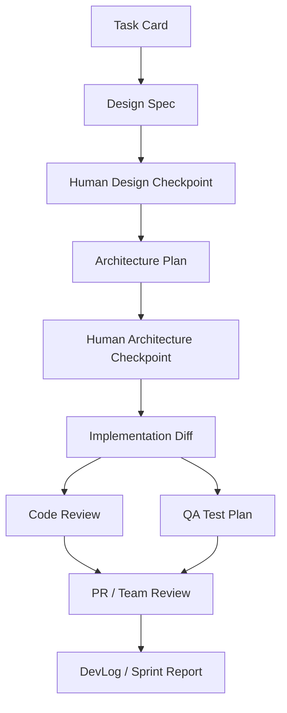

# Handoff Contracts

These contracts define the required shape of artifacts passed between agents.

The goal is not bureaucracy. The goal is to make automation safe: every agent should know what it can trust, what it must produce, and where the next agent should look.

## Contract Rules

1. Every workflow starts from a task card.
2. Every artifact has frontmatter with `slug`, `status`, `gdd_tags`, `owner`, `human_checkpoint`, `next_agent`, and `blocked_by`.
3. Agents may draft artifacts, but humans approve design feel, architecture decisions, PR merges, and official team status.
4. If a required field is missing, the next agent must stop and request clarification instead of guessing.
5. Discord and Notion discussions are inputs only until converted into a tracked task card.

## Artifact Flow



## Required Artifacts
 
| Artifact | Path | Producer | Consumer |
| --- | --- | --- | --- |
| Task Card | `Docs/3_Outputs/Specs/{slug}-task-card.md` | Human, router, or intake agent | Orchestrator, all role agents |
| Design Spec | `Docs/3_Outputs/Specs/{slug}-design-spec.md` | Game Design Agent | Architect, QA, Implementer |
| Architecture Plan | `Docs/3_Outputs/Specs/{slug}-arch-plan.md` | Architect Agent | Implementer, Reviewer |
| Impact Analysis | `Docs/3_Outputs/Specs/{slug}-impact-analysis.md` | Architect Agent | Refactor workflow |
| Test Plan | `Docs/3_Outputs/TestPlans/{slug}-test-plan.md` | QA Agent | Human tester, PR reviewer |
| Review | PR comment or `Docs/3_Outputs/Specs/{slug}-review.md` | Code Review Agent | Implementer, PR reviewer |
| DevLog | `Docs/3_Outputs/DevLog/{YYYY-MM-DD}-{slug}.md` | Implementer or PM Agent | PM Reporter |

## Standard Frontmatter

```yaml
---
slug: parry-timing
status: draft
source: github|discord|notion|manual
gdd_tags:
  - mechanics
owner: human-name-or-agent-role
human_checkpoint: required
next_agent: game-design-agent
blocked_by: []
---
```

## Status Values

| Status | Meaning |
| --- | --- |
| `draft` | Agent or human is still shaping the artifact. |
| `needs-human` | Automation must pause for approval or clarification. |
| `approved` | The next agent may consume this artifact. |
| `changes-requested` | Rework is required before moving forward. |
| `blocked` | Work cannot continue until `blocked_by` is resolved. |
| `superseded` | Do not use as current truth; keep only as history. |

## Rework Loop

If a checkpoint rejects the artifact:

- Design rejected: update task card or GDD tag, then rerun Game Design Agent.
- Architecture rejected: update design constraints or ADR decision, then rerun Architect Agent.
- Implementation rejected: keep approved specs fixed, rerun Implementation Agent only on affected files.
- QA rejected: file a bug report, switch to `/fix-bug`, then rerun affected tests.
- Game feel rejected: add playtest notes to the design spec, then rerun the tuning slice only.

## Minimal Validation Checklist
 
- [ ] Artifact path matches the table above.
- [ ] `slug` is stable and kebab-case.
- [ ] `gdd_tags` references real tags in `Docs/1_Inputs_Templates/GDD.md`.
- [ ] `status` allows the next step.
- [ ] `human_checkpoint` is `required` before design feel, architecture, merge, or official team publishing.
- [ ] `blocked_by` is empty before implementation begins.
