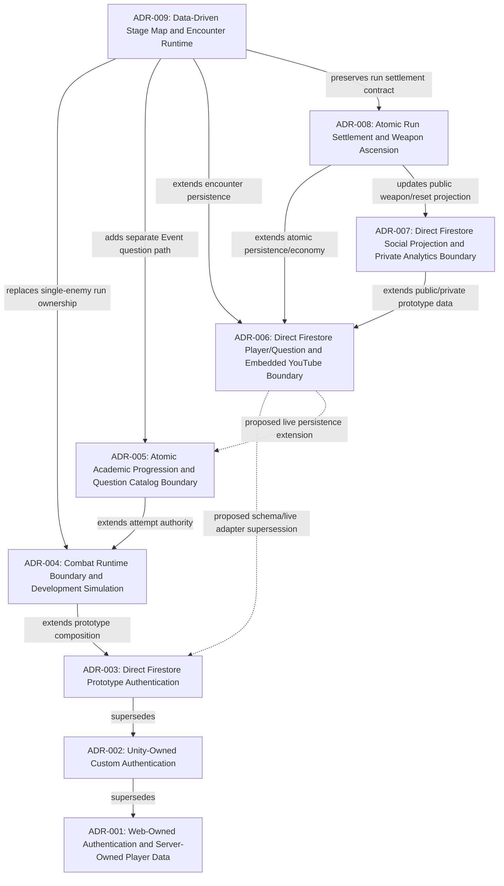

# Architecture Decision Records Index

## Dependency Order

Update this diagram as ADRs are added. Show which decisions depend on others.

## ADR Registry

| # | Title | Status | Phase | Current Note |
|---|---|---|---|---|
| [001](001-web-unity-session-and-player-data-boundary.md) | Web-Owned Authentication and Server-Owned Player Data | **Superseded by ADR-002** | Data architecture | Launch-code source removed during ADR-003 cutover |
| [002](002-unity-owned-custom-authentication.md) | Unity-Owned Custom Authentication with a Hosting-Adjacent REST Boundary | **Superseded by ADR-003** | Authentication migration | Host Function rejected by the team |
| [003](003-direct-firestore-prototype-authentication.md) | Direct Firestore Prototype Authentication | **Partially superseded by ADR-006** | Prototype authentication | Risk acceptance retained; schema/path decision replaced |
| [004](004-combat-runtime-boundary-and-development-simulation.md) | Combat Runtime Boundary and Development Simulation | **Accepted** | Stage combat prototype | Response Score now applies an explicit 20%-200% final damage multiplier |
| [005](005-atomic-academic-progression-and-question-catalog-boundary.md) | Atomic Academic Progression and Question Catalog Boundary | **Partially superseded by ADR-006** | Academic progression infrastructure | Atomic domain retained; no-live-adapter restriction replaced |
| [006](006-direct-firestore-player-question-and-youtube-boundary.md) | Direct Firestore Player/Question and Embedded YouTube Boundary | **Accepted** | Live prototype data/content | Direct GET/PATCH, live Rank catalog, embedded YouTube |
| [007](007-direct-firestore-social-profile-projection.md) | Direct Firestore Social Projection and Private Analytics Boundary | **Accepted** | Social/profile data | One-read cohort projection, private owner analytics, manual refresh |
| [008](008-atomic-run-settlement-and-weapon-ascension.md) | Atomic Run Settlement and Weapon Ascension | **Accepted** | Run reset/economy | Shared stat projection, Player Hub, and structured Rebirth preview implemented |
| [009](009-data-driven-stage-map-and-encounter-runtime.md) | Data-Driven Stage Map and Encounter Runtime | **Accepted** | Stage/encounter infrastructure | Architecture approved; implementation in progress |

## Phase Mapping

| GDD Phase | ADRs | Current Status |
|---|---|---|
| **Phase 1** - Stabilize Prototype | ADR-001, ADR-002, ADR-003 | ADR-003 is current |
| **Authentication migration** | ADR-003 | Accepted; direct Firestore refactor in implementation |
| **Phase 2** - Split Core Runtime | ADR-001 | Ready for task breakdown |
| **Phase 3** - Data-Drive Content | ADR-001 | Not started |

## How to Use

1. **Before making an architecture decision** - Check this index for existing decisions.
2. **To create a new ADR** - Copy `Docs_PowerMath/1_Inputs_Templates/ADR_TEMPLATE.md` and name it `{NNN}-{kebab-case-title}.md`.
3. **After creating** - Add a row to the registry table above.
4. **When superseding** - Update the old ADR's status to `Superseded by ADR-{NNN}`.
