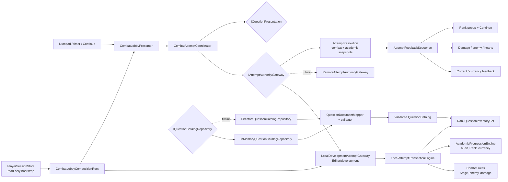
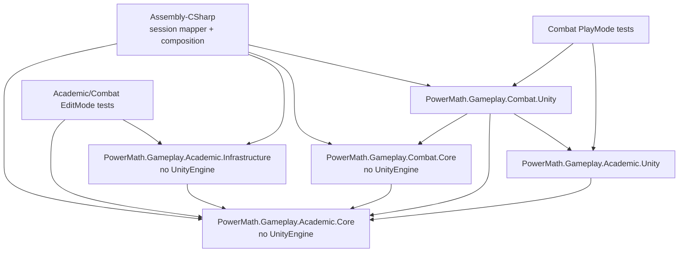
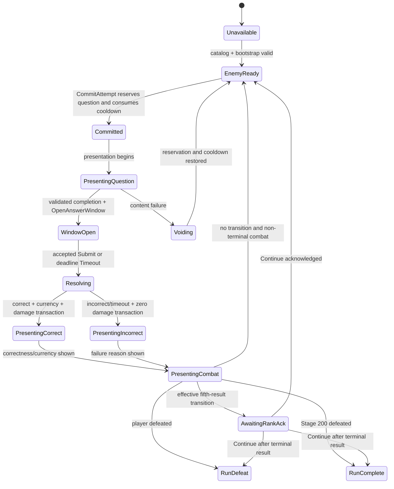

# Architecture Plan: Audit, Rank, and Question Infrastructure

## 1. Decision Summary

Add a Unity-free `PowerMath.Gameplay.Academic.Core` assembly for Rank, hidden audit, Rank Currency projections, question definitions, validation contracts, and per-Rank FIFO state. Extend the existing combat attempt boundary into one `IAttemptAuthorityGateway` so question reservation, answer result, audit append, Rank transition, Rank Currency, and combat resolve under one idempotent command receipt.

The current implementation will use a deterministic, scene-memory `LocalDevelopmentAttemptGateway` and in-memory question catalog. A future remote authority may implement the same gateway and question catalog port. This slice defines a Firestore-shaped question DTO using the approved `video_link` field, but does not call Firestore or authorize client-side gameplay persistence.

## 2. Architectural Invariants

1. **One atomic authority:** no separate audit manager, wallet manager, and combat manager may independently commit one answer.
2. **Rank is not Stage:** `AcademicRank`, `StageId`, and `QuestionId` are distinct value types and never convert implicitly.
3. **Hidden means absent:** audit score/count never enter a normal player view model, UXML label, tooltip, accessibility label, or player log.
4. **Question answer stays inside authority:** presentation receives video/dev prompt metadata, never the production correct answer.
5. **Void is not incorrect:** content failure restores question reservation and combat cooldown without audit, currency, history, or damage mutation.
6. **Old Rank owns result five:** question, multiplier, currency, and FIFO resolution use the Rank locked at commit; a transition affects only the next attempt.
7. **Idempotent commands:** duplicate command IDs return immutable original receipts across commit, answer-window open, submit/timeout, void, and presentation acknowledgement.
8. **Development cannot become production:** in-memory fixtures/progression compile and compose only in Editor/development builds; production fails closed without remote authority.
9. **Player bootstrap remains read-only:** local Rank/currency/audit changes never mutate `PlayerSessionStore`.
10. **No transport leakage:** Firestore field names and REST DTOs do not cross into Core, combat rules, or UI.

## 3. System Diagram



## 4. Assembly and Dependency Boundaries



### Boundary Rules

- `Academic.Core` references only BCL namespaces and owns no JSON, Firestore, Unity, session, or combat types.
- `Academic.Infrastructure` owns the approved question wire DTO and mapping/validation implementation; it contains no live network client in this slice.
- `Combat.Core` may reference `Academic.Core` because combat attempts consume academic question/rank results; `Academic.Core` never references combat.
- `Academic.Unity` owns Rank HUD/popup/audio presentation and references no session or Firestore classes.
- `Combat.Unity` coordinates the ordered feedback sequence but does not calculate audit, Rank, currency, correctness, or damage.
- `Assembly-CSharp` maps `PlayerSnapshot.activeRank` and wallet balances into a local bootstrap request. It does not map the undocumented `rankProgress`.
- The future Firestore adapter must live in Infrastructure and implement a port. It may not be added to `FirestoreRestClient`, which is currently authentication/bootstrap-specific under ADR-003.

## 5. Authority Model

| Concern | Development slice | Production target |
| --- | --- | --- |
| Question catalog | Validated deterministic in-memory documents | Remote validated catalog/content service |
| Question reservation | Scene-memory transaction | Server transaction |
| Answer correctness | Local locked answer | Server-only answer authority |
| Timer/score | Injected monotonic development clock | Server timestamps and deadline |
| Audit/Rank/currency | Scene-memory atomic aggregate | Persisted server aggregate |
| Combat | Existing local rules with Rank multiplier | Server-authoritative result |
| Persistence | None; badge says not saved | Save after each committed mutation |
| Retry | In-memory command receipt cache | Durable transaction receipt |

> [!WARNING]
> The approved question DTO contains `answer` because the requested schema requires it. A live direct-to-client Firestore catalog would expose correct answers and cannot satisfy the GDD's authoritative/anti-cheat model. ADR-005 therefore approves only the DTO/mapper/validator infrastructure. Enabling a live adapter requires a later security/authority checkpoint.

## 6. Core Domain Model

### Academic Values and Entities

| Type | Responsibility and invariants |
| --- | --- |
| `AcademicRank` | Closed value object: Silver, Gold, Diamond; comparison, one-step transition, multiplier `1.0/1.5/2.0`, strict wire parsing. |
| `QuestionId` | Globally unique non-empty identifier; unrelated to Stage/order. |
| `QuestionDefinition` | Immutable ID, Rank, validated absolute video URI, non-negative integer answer, derived answer digit limit. |
| `QuestionCatalog` | Immutable, globally unique definitions grouped in canonical per-Rank order; at least five distinct questions per Rank. |
| `AuditWindow` | Hidden score `0-50`, resolved count `0-4`; fifth append returns evaluation and resets atomically. |
| `AuditEvaluation` | Previous/new Rank, total score, effective transition, and boundary marker; total remains Core-only. |
| `RankCurrencyBalances` | Non-negative Silver/Gold/Diamond totals with checked `long` increment; no deduction API in this slice. |
| `RankQuestionInventory` | One Rank's canonical IDs, pending FIFO, reserved ID, failed-in-current-audit order, cleared-in-cycle set, cycle counter. |
| `RankQuestionInventorySet` | Owns three independent inventories and delegates by explicit `AcademicRank`. |
| `AcademicProgressionState` | Immutable active Rank, audit window, balances, and inventory snapshots. |
| `AcademicAttemptResult` | Question/Rank at commit, correctness/outcome, score, currency delta, before/after progression, optional effective Rank transition. |

### Attempt Outcome

```text
QuestionOutcome = Correct | Incorrect | Timeout | Abandoned
Content failure is not a QuestionOutcome; it uses VoidAttempt.
```

- `Correct` requires answer equality and actual remaining time greater than zero.
- Response score comes from the authority-owned answer window.
- `Incorrect`, `Timeout`, and `Abandoned` contribute zero audit points, zero currency, and zero damage.
- Only `Correct` grants the approved development `+1` active Rank Currency.

## 7. Question Catalog Infrastructure

### Approved Wire DTO

```csharp
[Serializable]
public sealed class QuestionDocumentDto
{
    public string id;
    public string video_link;
    public long answer;
    public string rank;
}
```

`long` is used at the transport edge because Firestore integer values are 64-bit. The mapper rejects values above `Int32.MaxValue` because the current numpad/domain answer is an `int`.

### Validation Pipeline

```text
Raw QuestionDocumentDto[]
  -> per-document shape validation
  -> strict Rank parsing
  -> HTTPS/video URI validation
  -> answer range + digit-limit derivation
  -> global ID uniqueness
  -> per-Rank distinct-count validation (minimum five)
  -> immutable QuestionCatalog
```

Validation returns all typed failures in one result for authoring/QA; runtime activation is all-or-nothing. No partially valid catalog is exposed.

### Repository Port

```csharp
public interface IQuestionCatalogRepository
{
    void Load(Action<QuestionCatalogLoadResult> completed);
    void Cancel();
}
```

- `InMemoryQuestionCatalogRepository` maps fixed development DTO fixtures through the same validator as future remote documents.
- `UnavailableQuestionCatalogRepository` returns a safe unavailable result.
- `FirestoreQuestionCatalogRepository` is a named future adapter, not created in this slice.

## 8. FIFO and Cycle Algorithm

Each Rank inventory owns:

```text
CanonicalOrder
PendingQueue
ReservedQuestionId?
FailedThisAudit (ordered)
ClearedThisCycle
CycleNumber
```

### Reserve

1. Reject if a question is already reserved.
2. Scan the pending queue for the first ID not present in the current audit's attempted-ID set.
3. If the queue is exhausted, rebuild from canonical order, increment cycle, and continue scanning.
4. If no distinct candidate exists for the current audit, return `CatalogInsufficientForAudit`; never repeat an ID.
5. Remove the candidate from pending and mark it reserved.

### Resolve

- Correct: clear reservation and add ID to `ClearedThisCycle`.
- Incorrect/timeout/abandoned: clear reservation and append ID to `FailedThisAudit`.
- Audit boundary: prepend failed IDs to that Rank's pending queue in original failure order, then clear `FailedThisAudit` and attempted-ID set.
- Void: put the reserved ID back at the front immediately; do not add it to attempted/failed/history.

Rank transition never moves questions between inventories.

## 9. Atomic Attempt State Machine



### Transition Guards

- Attack is accepted only from `EnemyReady` with a valid catalog and no Rank popup.
- Commit is one transaction: reserve question and consume cooldown or mutate neither.
- `OpenAnswerWindow` is idempotent and authority-timestamped.
- Submit and timeout share one terminal command gate.
- Rank evaluation occurs inside resolution five but presentation waits until combat feedback completes.
- Continue acknowledges presentation only; it never recalculates Rank.

## 10. Interface Definitions

### Attempt Authority

```csharp
public interface IAttemptAuthorityGateway
{
    GameplaySnapshot Snapshot { get; }

    AttemptCommit CommitAttempt(CombatCommandId commandId);

    AnswerWindowReceipt OpenAnswerWindow(
        CombatCommandId commandId,
        QuestionId questionId
    );

    AttemptResolution SubmitAnswer(
        CombatCommandId commandId,
        string normalizedAnswer
    );

    AttemptResolution ResolveTimeout(CombatCommandId commandId);

    GameplaySnapshot VoidContentFailure(CombatCommandId commandId);

    GameplaySnapshot CompletePresentation(CombatCommandId commandId);
}
```

### Commit/Resolution Projections

```csharp
public sealed class AttemptCommit
{
    public QuestionPresentationDescriptor Question { get; }
    public AnswerInputPolicy AnswerPolicy { get; }
    public GameplaySnapshot Snapshot { get; }
}

public sealed class AttemptResolution
{
    public AcademicAttemptResult Academic { get; }
    public CombatResolution Combat { get; }
    public GameplaySnapshot Snapshot { get; }
}
```

`GameplaySnapshot` combines immutable `CombatSnapshot` plus the player-safe `AcademicProgressionProjection`. The safe projection includes active Rank, multiplier, Rank Currency balances, local/not-saved marker, and pending effective transition; it excludes audit score/count and correct answer.

### Question Presentation

```csharp
public interface IQuestionPresentation
{
    void Begin(
        QuestionPresentationDescriptor question,
        Action<QuestionPresentationResult> completed
    );

    void Cancel();
}
```

- Production descriptor contains ID, Rank, and video URI only.
- Development descriptor may contain a compile-guarded QA prompt generated inside the local adapter.
- `QuestionPresentationResult` never reports correctness.

### Clock

```csharp
public interface IMonotonicClock
{
    double NowSeconds { get; }
}
```

The local gateway owns an injected clock. A remote gateway ignores client authority and uses server receipts/deadlines while returning a display projection.

## 11. Local Transaction Order

### Commit

```text
Validate command/state/catalog
  -> choose Rank inventory from active Rank
  -> reserve QuestionId
  -> consume enemy cooldown
  -> lock Rank, multiplier, question, and answer policy
  -> store immutable receipt
```

### Correct Submit

```text
Validate one active attempt + deadline + answer
  -> calculate response score
  -> calculate damage using Rank locked at commit
  -> apply enemy damage before retaliation
  -> grant +1 locked Rank Currency
  -> finalize question as correct
  -> append hidden audit score
  -> on result five, requeue failures then evaluate/reset Rank
  -> create combined immutable result
  -> store command receipt
```

### Incorrect/Timeout

```text
Validate one active attempt
  -> final damage 0 and currency delta 0
  -> apply cooldown/counterattack rules
  -> append failed question to current-audit list
  -> append hidden audit score 0
  -> on result five, requeue failures then evaluate/reset Rank
  -> create/store combined immutable result
```

All validation occurs before mutation. The local engine owns both combat and academic state so an expected failure cannot commit half the transaction.

## 12. Presentation Architecture

### UI Ownership

| Class | Responsibility |
| --- | --- |
| `AcademicProgressionView` | Cache and render active Rank, multiplier, active currency gain, local-not-saved badge, popup content, and Continue event. |
| `AcademicProgressionPresenter` | Translate safe projections into view state; never receives hidden audit values or answers. |
| `RankTransitionFeedbackPlayer` | Play promotion/adjustment visual and audio sequence, then wait for explicit Continue. |
| `AttemptFeedbackSequence` | Order correctness/currency -> combat feedback -> optional Rank transition; return control once complete. |
| `DevelopmentQuestionPresentation` | Render QA-only ID/Rank/target prompt under compile guard. |
| `VideoQuestionPresentation` | Future adapter; not implemented until content delivery exists. |

### Feedback Order

1. Correct/incorrect/timeout reason.
2. Correct-only `+1 {LockedRank}` feedback and positive audio.
3. Damage, enemy HP, defeat/counterattack, and hearts.
4. Effective promotion/demotion popup and distinct transition audio.
5. Continue acknowledgement.
6. Render the new active Rank and unlock the next Attack unless combat is terminal.

No popup appears for remain, Silver floor, or Diamond ceiling outcomes.

## 13. Class Responsibility Table

| Class | Responsibility | Depends on | Owned state |
| --- | --- | --- | --- |
| `AcademicRank` | Rank rules/multiplier | BCL | Value only |
| `QuestionDefinition` | Validated question data | `QuestionId`, `AcademicRank` | Immutable values |
| `QuestionCatalogBuilder` | Validate DTO-neutral inputs and create catalog | Validator services | None |
| `AuditWindow` | Append exactly five scores and evaluate threshold | Rank policy | Score/count |
| `RankQuestionInventory` | Reservation, FIFO, failure requeue, cycle | Catalog IDs | Per-Rank queue state |
| `AcademicProgressionEngine` | Pure transition service: apply outcome to an input state and return the next state/result | Audit/inventory policies | None |
| `LocalAttemptTransactionEngine` | Sole scene-state owner; atomically replace academic + combat state after successful validation | Academic engine, combat rules, clock | Combined scene gameplay state |
| `LocalDevelopmentAttemptGateway` | Idempotent authority adapter | Transaction engine, receipt cache | Command receipts |
| `QuestionDocumentMapper` | Map approved wire DTO to domain candidate | Validators | None |
| `InMemoryQuestionCatalogRepository` | Load deterministic fixtures through mapper | DTO mapper | Fixture DTOs |
| `CombatAttemptCoordinator` | Input/state sequencing and timer presentation | Authority, question presentation | Active UI phase/buffer |
| `AttemptFeedbackSequence` | Ordered feedback orchestration | Academic/combat feedback players | Active coroutine only |
| `AcademicProgressionView` | Player-safe Rank/currency/popup UI | UI Toolkit | Cached element refs |
| `CombatLobbyCompositionRoot` | Thin assembly and PlayerSnapshot mapping | Session + definitions | Service lifetime |

## 14. Existing Files to Modify

| File | Change |
| --- | --- |
| `Combat/Core/PowerMath.Gameplay.Combat.Core.asmdef` | Reference Academic Core. |
| `Combat/Core/CombatModels.cs` | Split combined attempt projection from combat-only result; preserve combat facts. |
| `Combat/Core/ICombatGateway.cs` | Replace with `IAttemptAuthorityGateway` contract and local development gateway. |
| `Combat/Core/IQuestionPresentation.cs` | Accept a locked question presentation descriptor. |
| `Combat/Core/CombatAttemptCoordinator.cs` | Consume commit/window/result receipts and per-question answer limit. |
| `Combat/Core/LocalCombatEngine.cs` | Refactor random-score resolution into explicit correct/incorrect transaction inputs and Rank multiplier. |
| `Combat/Unity/CombatLobbyPresenter.cs` | Present locked question and delegate combined feedback. |
| `Combat/Unity/CombatLobbyView.cs` | Preserve combat UI; remove any academic formatting responsibility. |
| `Combat/Unity/QuestionPresentations.cs` | Replace any-answer simulation with deterministic development fixture presentation. |
| `UI/MainMenu/CombatLobbyCompositionRoot.cs` | Load catalog, map bootstrap Rank/currencies, and construct unified local authority. |
| `UI/MainMenu/MainMenuUI.uxml` | Add distinct Rank HUD, local progression badge, QA question metadata, currency result, and transition modal. |
| `UI/CombatLobbyUI.uss` | Add semantic Rank/currency/modal states and reduced-motion transitions. |
| Existing combat tests | Migrate to explicit outcome/Rank-aware contracts and preserve previous regressions. |

`PlayerSnapshot`, `PlayerSessionStore`, `FirestoreRestClient`, authentication, build settings, and scenes require no schema or persistence mutation in this slice.

## 15. New File Plan

```text
Assets/Project/Script/Gameplay/Academic/Core/
  PowerMath.Gameplay.Academic.Core.asmdef
  AcademicRank.cs
  QuestionModels.cs
  QuestionCatalog.cs
  AuditWindow.cs
  RankCurrencyBalances.cs
  RankQuestionInventory.cs
  AcademicProgressionModels.cs
  AcademicProgressionEngine.cs
  IQuestionCatalogRepository.cs

Assets/Project/Script/Gameplay/Academic/Infrastructure/
  PowerMath.Gameplay.Academic.Infrastructure.asmdef
  QuestionDocumentDto.cs
  QuestionDocumentMapper.cs
  InMemoryQuestionCatalogRepository.cs
  UnavailableQuestionCatalogRepository.cs

Assets/Project/Script/Gameplay/Academic/Unity/
  PowerMath.Gameplay.Academic.Unity.asmdef
  AcademicProgressionView.cs
  AcademicProgressionPresenter.cs
  RankTransitionFeedbackPlayer.cs
  AcademicAudioPlayer.cs

Assets/Project/Script/Gameplay/Combat/Core/
  AttemptAuthorityModels.cs
  LocalAttemptTransactionEngine.cs
  IMonotonicClock.cs

Assets/Project/Script/Gameplay/Combat/Unity/
  UnityMonotonicClock.cs
  AttemptFeedbackSequence.cs
  DevelopmentQuestionPresentation.cs

Assets/Project/Tests/EditMode/Academic/
  PowerMath.Gameplay.Academic.EditModeTests.asmdef
  AcademicRankTests.cs
  AuditWindowTests.cs
  QuestionCatalogTests.cs
  RankQuestionInventoryTests.cs
  AcademicProgressionEngineTests.cs
  QuestionDocumentMapperTests.cs

Assets/Project/Tests/EditMode/Combat/
  LocalAttemptTransactionTests.cs

Assets/Project/Tests/PlayMode/Combat/
  AuditRankCombatSceneTests.cs
```

Small related models may share one file; assembly and responsibility boundaries may not be collapsed.

## 16. Error and Recovery Matrix

| Failure | Mutation | Player-facing behavior | Recovery |
| --- | --- | --- | --- |
| Invalid catalog document | No catalog activation | Combat unavailable; development console lists typed authoring errors | Fix fixture/content and reload |
| Fewer than five distinct questions in Rank | No catalog activation | Rank pool unavailable | Add valid content |
| No unique question during audit | No commit | Content pool unavailable; cooldown unchanged | Authority/content repair |
| Question/video failure after commit | Reservation and cooldown restored | Neutral content error | EnemyReady, same audit state |
| Invalid answer metadata | Treat as content failure, never incorrect | Neutral content error | Void transaction |
| Duplicate submit/timeout | Return cached result | One feedback sequence | No repeated mutation |
| Rank popup interrupted by scene disable | Domain result remains committed | UI closes safely | Rehydrate authoritative pending presentation later; local scene resets |
| Currency overflow | Reject transaction before mutation | Progression unavailable/error | Server/data repair |
| Undocumented bootstrap Rank | Fail visible; do not default silently | Rank data unavailable | Fix snapshot mapping |
| Production without remote authority | None | Combat unavailable | Configure approved remote authority |

## 17. Verification Strategy

### EditMode

- Parse exact Silver/Gold/Diamond values; reject other casing/values.
- Confirm multipliers `1.0`, `1.5`, `2.0`.
- Audit thresholds at 25/26/39/40 and all Silver/Diamond bounds.
- Fifth result changes at most one Rank and resets score/count exactly once.
- Void does not advance audit or inventory history.
- Correct grants one locked-Rank currency; incorrect/timeout grant zero.
- Result five uses old Rank multiplier/currency, next commit uses new Rank.
- DTO mapper covers missing/duplicate ID, strict Rank, HTTPS/video URI, answer range, and digit limit.
- Independent FIFO positions survive Rank switches.
- Failed questions return front in failure order after audit.
- Correct questions remain absent until a new cycle.
- Pool restart increments cycle and does not violate current-audit uniqueness.
- Duplicate command IDs return identical receipts and do not double-mutate any subsystem.
- Local transaction validates before mutation; induced failure leaves both academic/combat snapshots unchanged.

### PlayMode

- Active Rank/multiplier is visible and visually distinct from Stage.
- Development question shows ID, Rank, and QA target only under development guard.
- Correct and incorrect answers drive distinct currency/damage results.
- Five fast-correct Silver questions promote to Gold and show one blocking popup.
- Five timeout/incorrect Gold questions demote to Silver and show neutral adjustment popup.
- Continue unlocks Attack once; spam does not duplicate transition/audio.
- Audit values/count do not exist in the visual tree or accessibility text.
- Silver floor and Diamond ceiling produce no popup.
- Content void restores cooldown/reservation and does not consume an audit slot.
- Existing Stage, enemy, timeout, authentication/bootstrap, and logout smoke tests remain green.

### Manual

- New-player distinction test for Stage vs. Rank vs. currency.
- Observer readability for promotion vs. adjustment without color.
- Narrow/mobile-compatible layout and touch Continue.
- Reduced motion retains semantic information.
- Non-development build cannot compose fixtures/local progression.

## 18. Incremental Implementation Plan

1. Academic Core value objects, audit policy, balances, tests.
2. Question DTO mapper/catalog validation, fixtures, tests.
3. Per-Rank FIFO/cycle aggregate and tests.
4. Academic progression engine and atomic result-five rules.
5. Refactor combat engine to explicit outcome/Rank inputs while preserving existing tests.
6. Replace gateway contract with combined commit/window/resolution receipts and transaction tests.
7. Integrate deterministic development question presentation and real correctness.
8. Add Rank HUD, currency feedback, popup/Continue, audio, and feedback order.
9. Extend PlayMode real-scene smoke for promotion/demotion/hidden audit.
10. Self-review, QA plan, DevLog, and human PR review; do not merge or publish automatically.

## 19. Risks and Mitigations

| Risk | Mitigation |
| --- | --- |
| Audit/combat/wallet partial commits | One transaction engine and one command receipt. |
| Correct answers exposed by future direct Firestore | No live adapter authorized; answer stays out of presentation models; later security ADR required. |
| Hidden audit leaks through UI/debug | Player-safe projection omits fields entirely; UI contract tests inspect names/text. |
| Existing `rankProgress` misinterpreted | Ignore until backend contract documents semantics. |
| Rank change applies too early | Lock Rank in `AttemptCommit`; transition effective only for next commit. |
| FIFO repeat/exhaustion bugs | Explicit reservation/failed/cleared/cycle state and boundary tests. |
| Local simulation mistaken for saved progress | Persistent badge, compile guard, no session mutation, fail-closed production. |
| Presenter becomes god-object | Separate academic view/presenter and composite feedback sequence. |
| Refactor regresses Stage combat | Preserve combat-only models/tests and add combined transaction regression coverage. |

## 20. ADR Impact

- ADR-003 remains limited to prototype authentication/bootstrap and is not extended to gameplay content or writes.
- ADR-004's local simulation boundary remains valid but is extended: Rank multiplier 1 is replaced by the active local Rank multiplier, and random success is replaced by validated deterministic development questions.
- Proposed ADR-005 records the atomic academic/combat authority and question catalog boundary.
- Enabling a live Firestore question adapter or persistence requires another explicit checkpoint because it exposes answers and changes the authority/security model.

## 21. Human Architecture Checkpoint

> [!NOTE]
> Approved by the project owner on 2026-08-10 (`LGTM`). ADR-005 is accepted for implementation.

Approve or request changes to:

1. Separate Academic Core/Infrastructure/Unity assemblies.
2. Replace the narrow `ICombatGateway` with one atomic `IAttemptAuthorityGateway`.
3. Refactor local random success into deterministic fixture correctness and authority-owned timing.
4. Keep `QuestionDocumentDto {id, video_link, answer, rank}` infrastructure-only with no live Firestore adapter.
5. Ignore `rankProgress`, keep local progression scene-memory only, and fail closed in production.
6. Exact FIFO, result-five ordering, presentation sequence, and incremental file/test plan.

Implementation may proceed. PR merge and official publishing remain separate human checkpoints.
