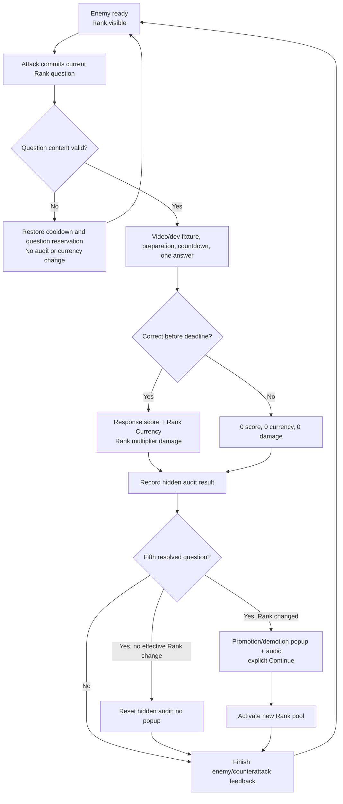

# Design Spec: Audit, Rank, and Question Infrastructure

## 1. Player Goal and Context

The student should experience Rank as a quiet placement system that adjusts question difficulty based on recent performance—not as a public score or punishment. Every answer still produces immediate combat feedback and matching Rank Currency, while the hidden five-question audit occasionally produces a clear Rank transition.

The design protects three separations:

- **Stage** communicates rogue-lite combat progress.
- **Rank** communicates educational difficulty and its combat privilege.
- **Question ID** selects content and never implies Stage or Rank order.

The current build has no production gameplay authority. Development mode may simulate this experience, but it must remain visibly labelled, non-persistent, deterministic, and unable to silently become production behavior.

## 2. GDD Rules

### Audit

- One audit contains exactly five resolved questions.
- Each correct result contributes its response score from 1-10; incorrect, timeout, refresh/abandon, or valid-attempt disconnect contributes 0.
- Content/system failure is void and does not consume an audit position.
- After result five: `>= 40` promotes one Rank, `26-39` remains, and `<= 25` demotes one Rank.
- Silver and Diamond are hard lower/upper bounds.
- The audit then resets to zero results and zero points.
- Partial audit survives run death/rebirth in target production behavior.
- Audit value and position are hidden from the normal player UI.

### Rank

| Rank | Question pool | Damage multiplier | Correct-answer currency |
| --- | --- | ---: | --- |
| Silver | Silver | 1.0 | Silver |
| Gold | Gold | 1.5 | Gold |
| Diamond | Diamond | 2.0 | Diamond |

- Rank can move only one step at an audit boundary.
- An actual Rank change swaps the active question pool after the fifth result finishes resolving.
- Inactive Rank queues retain their positions and unfinished questions.
- Rank is preserved when a combat run resets.

### Question FIFO

- A committed attempt locks one question from the current Rank inventory.
- The same question cannot be attempted twice within one audit window.
- Correct removes the question from the current cycle.
- Incorrect/timeout keeps the question in the failed list, then returns it to the front after audit in original failure order.
- A content failure unlocks/voids the question without recording an educational result.
- Exhausting a Rank pool begins a new cycle while history remains intact.

## 3. Player Interaction Flow



## 4. State Machine Checklist

| Property | Definition |
| --- | --- |
| Entry | A valid committed question resolves as correct, incorrect, timeout, or abandonment. |
| Exit | Non-fifth result returns to combat presentation; fifth result evaluates Rank and resets the audit. |
| Interruptibility | Content failure voids before resolution. Once a valid result is accepted, audit/rank/currency resolution is atomic and cannot be cancelled. |
| Chained actions | Result -> hidden audit append -> optional Rank transition -> question-pool switch -> combat feedback completion. |
| Resource cost | Correct grants Rank Currency; no result deducts Rank Currency. Audit points are placement state, not spendable currency. |
| Lockout | Attack stays disabled until any Rank-change popup is acknowledged and result presentation completes. |
| Retry | Duplicate transaction IDs return the original result and feedback does not award twice. |

## 5. Rank Transition Experience

### Promotion

- Header: `RANK UP`
- Body: `{OldRank} → {NewRank}` and `Your next questions will match your new Rank.`
- Show the new damage multiplier and matching currency icon/name.
- Use a positive transition audio cue plus a visual rise/glow.
- Require explicit `CONTINUE`; do not auto-dismiss an educational placement change.

### Demotion

- Header: `RANK ADJUSTED`
- Body: `{OldRank} → {NewRank}` and `Questions have been adjusted to your current level.`
- Avoid loss language, red failure framing, ridicule, or displaying the hidden audit score.
- Use a neutral transition audio cue plus a stable crossfade, not a fall/crash animation.
- Require explicit `CONTINUE`.

### No Effective Change

- No popup when the audit says remain.
- No popup when Silver receives a demotion outcome but stays Silver.
- No popup when Diamond receives a promotion outcome but stays Diamond.
- Continue normal combat feedback without exposing the audit boundary.

## 6. Rank HUD and Currency Feedback

- Active Rank is always glanceable near the combat Stage HUD but visually distinct from Stage.
- Correct result shows `+1 {Rank}` beside the correctness result before damage; this is a development starting value pending backend reward configuration.
- Incorrect/timeout shows no currency gain and never flashes a zero-reward punishment.
- The three persistent balances may remain in an on-demand/profile area; the combat HUD highlights only the active Rank currency.
- Development mode adds `LOCAL PROGRESSION - NOT SAVED` beside the existing simulation badge.
- Hidden audit score and position never appear in normal UI, tooltips, accessibility labels, or player logs.

## 7. Development Question Fixtures

Because real videos are unavailable, a local fixture must make correctness testable without masquerading as real educational content.

- Persistent banner: `DEVELOPMENT QUESTION - NO VIDEO`.
- Prompt: `QA target answer: {answer}`.
- Show question ID and Rank only in the development fixture panel.
- The normal numpad/timer/one-submit rules remain unchanged.
- Fixtures use stable IDs and deterministic ordering so FIFO and Rank-transition bugs reproduce.
- Production builds never display answers and never instantiate the fixture provider.

## 8. Firestore-Shaped Content Contract

Recommended future wire document:

```text
{
  id: string,
  video_link: string,
  answer: integer,
  rank: "Silver" | "Gold" | "Diamond"
}
```

The domain uses neutral names (`QuestionId`, `VideoUri`, `CorrectAnswer`, `AcademicRank`) so changing a Firestore field name does not affect gameplay.

> [!WARNING]
> The request specifies `video_link`, while the GDD currently specifies `source_video_link`. This design recommends `video_link` for the future wire DTO and requires the GDD/schema to be reconciled before live data is created.

Validation behavior:

- Reject missing or duplicate IDs across all Rank pools.
- Reject unknown/case-invalid Rank values at the transport boundary.
- Reject missing, non-HTTPS, or non-video links before catalog activation.
- Reject negative, decimal, fractional, operator, or out-of-range answers.
- Derive the numpad answer-length limit from the validated integer's digit count because the requested four-field wire schema has no explicit length field.
- Reject a Rank catalog that cannot provide five distinct valid questions for a fresh audit; never violate the no-repeat rule to keep playing.

## 9. Five-Component Evaluation

| Component | Design response | Acceptance signal |
| --- | --- | --- |
| Clarity | Rank is always labelled separately from Stage; transition popup explains the new pool/multiplier without exposing audit math. | New player distinguishes Stage from Rank and explains a transition 8/10 times. |
| Motivation | Correct mathematics grants immediate matching currency and higher Rank provides stronger combat privilege. | Player can identify both immediate and longer-term value of a correct answer. |
| Response | Numpad remains immediate; one accepted result resolves audit, Rank, currency, inventory, and combat atomically. | Spam/retry cannot create duplicate results or rewards. |
| Satisfaction | Promotion uses visual and audio lift; demotion uses respectful neutral feedback; correct reward appears before damage. | Observer identifies promotion vs. adjustment without relying on color. |
| Fit | Mathematical challenge changes Rank/question pool and combat multiplier without coupling to visual Stage. | Player understands harder questions create combat power, not enemy Stage. |

## 10. Edge and Abuse Cases

| Scenario | Expected behavior |
| --- | --- |
| Content fails after commit | Void reservation, restore cooldown, no audit/currency/history mutation. |
| Submit and timeout race | One transaction wins; duplicate returns cached authoritative result. |
| Disconnect after server accepted result | Reconnect returns same result; no double award or second audit append. |
| Rank changes on question five | Resolve question under old Rank/multiplier/currency, then change Rank for the next question. |
| Player dies on question five | Finish atomic result/audit/Rank/currency first, then run reset preserves meta progression. |
| Silver low audit | Audit resets; Silver remains; no fake demotion popup. |
| Diamond high audit | Audit resets; Diamond remains; no fake promotion popup. |
| Pool has fewer than five unique questions | Fail catalog activation visibly; do not repeat within audit. |
| Rank changes away and back | Resume that Rank's preserved FIFO/cycle state. |
| All questions cleared | Increment cycle; repopulate in canonical order while retaining history. |
| Same question ID appears in two ranks | Reject catalog as invalid because IDs are globally unique. |
| Currency threshold reached | Balance increments; no currency is deducted. Weapon unlock remains outside this slice. |

## 11. Numbers and Tuning Policy

| Value | Status | Basis / validation |
| --- | --- | --- |
| 5 results per audit | Fixed | GDD `@tag:answer-scoring`. |
| Maximum 50 audit points | Fixed | GDD `@tag:answer-scoring`. |
| Promote `>= 40`; remain `26-39`; demote `<= 25` | Fixed | GDD `@tag:answer-scoring`. |
| Multipliers `1.0 / 1.5 / 2.0` | Fixed | GDD `@tag:answer-scoring`. |
| `+1` active Rank Currency on correct | Development starting value | Pass if players understand one correct answer produces one matching unit; backend may return a data-defined delta later. |
| Explicit popup acknowledgement | Design rule | Pass if observers explain the new Rank/pool before the next Attack 8/10 times. |

## 12. Playtest Scenarios

1. **New player:** Run a promotion and ask the player to distinguish Stage, Rank, and currency; pass at 8/10 correct explanations.
2. **Stress:** Spam Submit/Continue, resolve on deadline, disable scene mid-popup, and retry command IDs; no duplicated result, reward, or transition.
3. **Skill:** Run fast-correct, slow-correct, incorrect, and timeout sequences across exactly five questions; verify GDD thresholds.
4. **Abuse:** Attempt Rank-pool switching, question replay, catalog IDs duplicated across ranks, and pool exhaustion; no audit repeat or free currency.
5. **Readability:** Observer identifies correct/incorrect, Rank change direction, new multiplier, and next question pool without seeing audit points.

## 13. Assumptions Requiring Human Approval

### A. Wire field

**ASSUMPTION:** Future Firestore uses `video_link` as requested; domain remains field-name agnostic.  
**IMPACT:** Mapper differs from the current GDD table.  
**IF WRONG:** Live documents fail mapping or require a migration.  
**VALIDATE:** Approve `video_link` now and update the GDD before live collection creation.

### B. Currency delta

**ASSUMPTION:** Each correct answer grants one unit of the active Rank Currency in development mode.  
**IMPACT:** Enables complete reward/UI tests.  
**IF WRONG:** Only the local reward projection/configuration changes; audit rules remain stable.  
**VALIDATE:** Confirm `+1`, or provide a different/data-defined rule.

### C. Existing `rankProgress`

**ASSUMPTION:** Do not interpret the existing integer because its mapping to hidden audit score/count is undocumented.  
**IMPACT:** Local development audits begin empty after scene load; production persistence requires explicit fields.  
**IF WRONG:** A known legacy mapping could be adapted later.  
**VALIDATE:** Provide the field's exact meaning if it already stores audit state.

### D. Development fixture

**ASSUMPTION:** A QA-only panel may reveal fixture answers under Editor/development compile guards.  
**IMPACT:** Enables real correct/incorrect and FIFO testing without videos.  
**IF WRONG:** We can retain random outcomes, but question correctness and inventory integration cannot be validated end-to-end.

## 14. Human Design Checkpoint

> [!NOTE]
> Approved by the project owner on 2026-08-10 (`LGTM!`). All six listed design decisions are accepted for the development slice.

Approve or request changes to:

1. Hidden audit with popup only for an effective Rank change.
2. Respectful `RANK ADJUSTED` demotion language and explicit Continue.
3. `video_link` wire field recommendation and derived answer-length limit.
4. Development `+1` matching Rank Currency per correct answer.
5. Ignoring undocumented `rankProgress` and starting local audits empty.
6. QA-only answer-revealing question fixtures.

Architecture may proceed. Implementation remains gated on architecture and ADR-005 approval.
