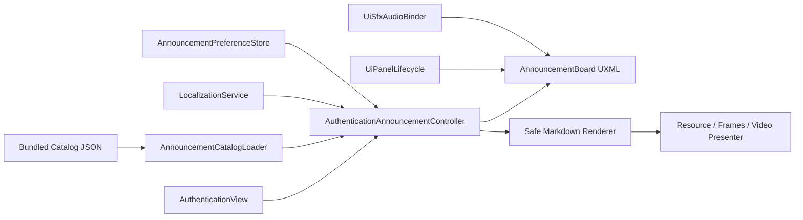

# Architecture Plan: Authentication Announcement Board

## Current and Target State

Current Authentication UI owns login, locale controls, shared Settings and generic UI SFX. No announcement catalog or board exists. ADR-014 requires views to remain narrow and panel lifecycle to use the shared motion layer. ADR-016 reserves server acknowledgement for future authenticated announcements.

Target state adds a presentation-only controller alongside `AuthenticationView`. The login view supplies ready/busy lifecycle signals but does not own catalog, Markdown, media or daily suppression behavior.

## Responsibilities

| Component | Responsibility |
|---|---|
| `AnnouncementCatalogLoader` | Load and validate schema/revision/stable IDs and English fallback |
| `AnnouncementPreferenceStore` | Persist local-date auto-show suppression only |
| `AnnouncementMarkdownRenderer` | Escape raw tags and render approved block/inline syntax |
| `AnnouncementMediaPresenter` | Own and dispose static, frame-sequence and video presentation resources |
| `AuthenticationAnnouncementController` | Catalog selection, locale refresh, lifecycle, focus and user intents |
| `AuthenticationView` | Notify board when auth becomes ready or unavailable; retain login ownership |

## Data Flow

1. `AuthenticationView.RenderReady` ensures/binds the controller.
2. Controller loads `Resources/Announcements/Catalog.json`.
3. Valid catalog creates buttons keyed by stable patch ID.
4. Daily suppression gates only automatic open.
5. Selection resolves locale, updates metadata and renders Markdown/media.
6. Close or auth transition disposes media and ends lifecycle in a stable state.

## Persistence Boundary

The local date preference is non-critical and may use `PlayerPrefs`. It neither calls `IServerGameCommands.AcknowledgeAnnouncement` nor claims an account-level read receipt. Future remote delivery/authenticated acknowledgement remains a separate ADR-016 slice.

## Existing Files Modified

- `Assets/Project/Script/UI/Authentication/AuthenticationView.cs`
- `Assets/Project/UI/Authentication/AuthenticationScreen.uxml`
- `Assets/Project/UI/Authentication/AuthenticationScreen.uss`

All catalog, controller, renderer, media, UXML/USS and tests are additive files. No scene, package, build, CI, secret or deployment setting changes are required.

## Architecture Decision

No new ADR is required. This is an additive application of accepted ADR-014 and the local/future-authority separation already approved in ADR-016.

## Approval

Project owner authorized implementation on 2026-09-17 after approving the preceding design and landscape-only revision.
