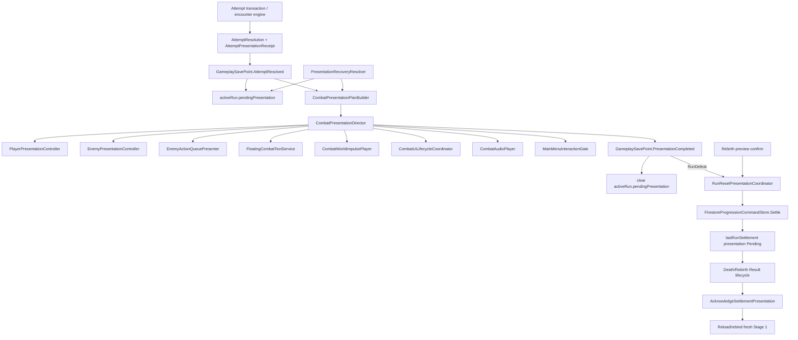

# Architecture Plan: Data-Driven Combat Presentation and Game Juice

## 1. Architecture Outcome

Replace the current coroutine-and-view-method combat feedback path with three explicit layers:

1. **Authoritative outcome receipts** record what happened and remain stable across saves/reloads.
2. **A Unity-free semantic plan builder** converts those receipts into ordered presentation steps.
3. **Scene-scoped Unity presenters** animate player/enemy actors, FCT, action boxes, UI lifecycles, audio, and impact impulse, then acknowledge completion.

The feature does not change damage, cooldown, Rank, Stage, settlement, or reward rules. It changes how accepted results are represented for presentation and when interaction may safely reopen.

Two persistence obligations are introduced:

- `activeRun.pendingPresentation`: an accepted attempt result awaiting combat presentation completion.
- `lastRunSettlement.presentationStatus`: a Death/Rebirth settlement result awaiting mandatory result acknowledgement.

No animation clip name, tween progress, UI class, coroutine position, or frame number is saved. On recovery, the client rebuilds the semantic plan from the receipt and replays from the start.

This plan extends ADR-004, ADR-006, ADR-008, ADR-009, and ADR-011 and requires a new ADR because it adds persistent presentation receipts and a schema migration.

## 2. Verified Current Constraints

- Unity version is `6000.5.3f1`.
- The Main Menu is hybrid: UI Toolkit owns HUD/panels while one Screen Space Overlay uGUI Canvas owns `bg`, `playerPresentation`, and `monsterPrefab`.
- `CombatLobbyPresenter` currently owns commit, question, saving, answer feedback, battle feedback, biome transition, and presentation completion.
- `CombatFeedbackPlayer` animates the enemy HUD card, not the visible enemy sprite.
- `CombatLobbyView.RenderEnemyActions` clears and recreates every action box, retaining spent boxes through opacity.
- FCT is a root-level UI Toolkit Label with a fixed `top` and no actor anchor.
- `AttemptResolved` is saved before feedback and `PresentationCompleted` after feedback, but the accepted resolution payload is not persisted.
- restored `PresentingResult` is currently normalized to ready by both local encounter engines.
- `RunSettlementPanelController` starts Death settlement as soon as `PlayerSessionStore` reports `RunDefeat`.
- settlement resets `activeRun` to Stage 1 and stores a compact `lastRunSettlement` receipt, but the receipt has no presentation status/acknowledgement.
- LeanTween is already present and used by `MainMenuTransitionController`; TextMesh Pro resources are already imported; Cinemachine is not installed.
- The filled project stack file remains a template, so this plan relies only on verified code, accepted ADRs, and approved GDD/spec facts.

## 3. System Diagram



## 4. Assembly and Dependency Boundaries

### Existing authoritative assembly

`PowerMath.Gameplay.Combat.Core` remains Unity-free and gains only immutable authoritative/persistence projections:

- `AttemptPresentationReceipt`
- `AttemptOutcomeKind`
- before/after combat fields required to reconstruct presentation
- stable `PresentationId`
- receipt validation

These are outcome records, not animation instructions. Core does not reference a presentation assembly or Unity.

### New Unity-free presentation assembly

Create `PowerMath.Gameplay.Combat.Presentation.Core` with references to:

- `PowerMath.Gameplay.Combat.Core`
- `PowerMath.Gameplay.Academic.Core`

It owns:

- semantic presentation models and enums;
- `CombatPresentationPlanBuilder`;
- actor transition policies;
- interaction-readiness policy;
- recovery classification from persisted receipts;
- plan validation and deterministic step ordering.

It has `noEngineReferences: true` and can be tested without scenes.

### Existing Unity presentation assembly

`PowerMath.Gameplay.Combat.Unity` references the new presentation assembly and owns scene/component behavior. Assembly-CSharp composition/infrastructure continues to reference Core/Unity assemblies as it does today.

The split prevents ScriptableObjects, LeanTween, UI Toolkit, TMP, audio, or scene objects from entering combat authority.

## 5. Authoritative Receipt Model

The exact names may change during implementation, but the data contract must retain these semantics.

```csharp
public enum AttemptOutcomeKind
{
    Correct,
    Incorrect,
    Timeout
}

public sealed class AttemptPresentationReceipt
{
    public string PresentationId { get; }
    public string AttemptId { get; }
    public int Version { get; }
    public AttemptOutcomeKind Outcome { get; }
    public int ResponseScore { get; }
    public int FinalDamage { get; }
    public bool IsCritical { get; }

    public CombatPresentationSnapshot Source { get; }
    public CombatPresentationSnapshot Destination { get; }

    public bool EnemyDefeated { get; }
    public bool EnemyAttacked { get; }
    public bool PlayerDefeated { get; }
    public bool StageAdvanced { get; }
    public bool BiomeChanged { get; }
    public RankTransitionReceipt RankTransition { get; }
}
```

`CombatPresentationSnapshot` is a compact immutable projection rather than the mutable player DTO. It includes Stage, biome/encounter identity and kind, enemy current/maximum HP and cooldown, player current/maximum hearts, and Combat phase. Source refers to the resolved encounter before damage/retaliation; Destination refers to the saved post-resolution state, including a newly selected encounter after victory.

`LocalAttemptTransactionEngine` captures Source immediately before resolving the answer and builds the receipt alongside `AttemptResolution`. `GameplaySaveRequest` carries the receipt on `AttemptResolved`; `PresentationCompleted` carries its matching `presentationId` for idempotent clear/transition.

### Receipt invariants

- IDs are non-empty and stable for the attempt.
- Destination phase is `PresentingResult`, `RunDefeat`, or `RunComplete` for a pending receipt.
- Final damage and HP/hearts deltas agree with the accepted resolution.
- `PlayerDefeated` requires destination hearts zero and `RunDefeat`.
- `EnemyDefeated` cancels enemy action presentation even when a committed cooldown step existed.
- Rank transition data is copied from the accepted academic result; presentation never recalculates Rank.
- Unknown receipt versions fail closed into recovery UI and never unlock combat.

## 6. Semantic Plan Model

```csharp
public enum PresentationActor { System, Player, Enemy, Ui }

public enum PresentationActionKind
{
    AnswerFeedback,
    PlayerPrimaryAttack,
    PlayerFailedAttack,
    PlayerTakeDamage,
    PlayerDie,
    PlayerRebirth,
    PlayerPotionReaction,
    PlayerRankUp,
    PlayerRankDown,
    EnemyAppear,
    EnemyWalk,
    EnemyAttack,
    EnemyTakeDamage,
    EnemyDie,
    ArmEnemyAction,
    ConsumeEnemyAction,
    CancelEnemyAction,
    InitiateEnemyActions,
    SpawnFloatingText,
    InterpolateEnemyHp,
    InterpolatePlayerHearts,
    PlayImpactImpulse,
    ShowStageResult,
    PlayBiomeTransition
}

public sealed class CombatPresentationStep
{
    public string StepId { get; }
    public PresentationActor Actor { get; }
    public PresentationActionKind Kind { get; }
    public string TargetId { get; }
    public PresentationPayload Payload { get; }
    public string ProfileKey { get; }
    public PresentationBarrier Barrier { get; }
}

public interface ICombatPresentationPlanBuilder
{
    CombatPresentationPlan Build(AttemptPresentationReceipt receipt);
    CombatPresentationPlan BuildDeathRecovery(RunPresentationReceipt receipt);
    CombatPresentationPlan BuildRebirthRecovery(RunPresentationReceipt receipt);
}
```

The builder is deterministic and data-only. It emits the approved order:

1. answer-result lifecycle;
2. player PrimaryAttack or FailedAttack;
3. impact group: enemy reaction, HP, FCT, audio, optional critical impulse;
4. enemy defeat/cancelled token or surviving enemy Walk/Attack;
5. player damage/Death if applicable;
6. new encounter queue/Appear or biome transition;
7. Rank reaction/modal;
8. completion barrier.

Future follow-ups and counterattacks add new accepted action records to the receipt/plan; Unity presenters and the gate do not need one-off button-lock code.

## 7. Presentation Director

```csharp
public interface ICombatPresentationDirector
{
    bool IsPlaying { get; }
    string ActivePresentationId { get; }
    event Action<PresentationCompletion> Completed;
    event Action<PresentationFailure> Failed;

    bool TryPlay(CombatPresentationPlan plan);
    void CancelAndApplyRecoveryState();
}
```

`CombatPresentationDirector` owns only orchestration:

- validate one active plan;
- acquire the combat-presentation interaction lock;
- dispatch each step to the registered specialized presenter;
- wait for explicit completion callbacks/barriers;
- apply the profile completion bound if a callback is lost;
- verify the approved unlock readiness predicate;
- publish success/failure with presentation/action IDs;
- never call damage, Rank, cooldown, reward, or settlement calculations.

It does not manipulate RectTransforms, Labels, VisualElements, audio clips, or Firestore directly.

## 8. Interaction Gate

Replace scattered `SetEnabled`, `_saveInFlight`, panel visibility, and transition-only input blocking with one scene-scoped gate service. Existing guards remain as defense-in-depth, but the gate is the shared player-interaction contract.

```csharp
[Flags]
public enum InteractionScope
{
    Lobby = 1,
    Navigation = 2,
    Question = 4,
    ModalDismiss = 8,
    TerminalAction = 16
}

public interface IMainMenuInteractionGate
{
    event Action<InteractionGateSnapshot> Changed;
    bool IsAllowed(InteractionScope scope);
    IInteractionLock Acquire(string ownerId, InteractionScope blockedScopes);
}
```

Lock owners include session bootstrap transition, attempt commit/save, question presentation, answer resolution, combat presentation, Rank modal, Rebirth confirmation after acceptance, settlement save, mandatory run result, and presentation acknowledgement.

### Integration rules

- `CombatLobbyPresenter` checks `Lobby` before Attack.
- `MainMenuPanelHost.TryOpen` checks `Navigation` and rejects opening while blocked.
- question controls check `Question`; presentation can block Lobby/Navigation while permitting Question.
- the Death result acquires all scopes except its explicit Retry/Restart action.
- `MainMenuTransitionController` acquires a gate lock instead of independently disabling the full safe area; `MainMenuTransitionView` remains visual only.
- a dedicated UI Toolkit `main-menu-interaction-shield` mirrors aggregate blocked state and owns pointer/focus capture without obscuring permitted scoped controls.

The director releases its lease only after the plan is empty, both living actors report Idle, action boxes report Stable, blocking UI reports stable, and authority is ready. Terminal flows transfer the lock to the run-reset coordinator instead of briefly reopening interaction.

## 9. Actor Presentation Architecture

```csharp
public enum ActorVisualState
{
    Hidden,
    Appearing,
    Idle,
    Attacking,
    FailedAttack,
    TakingDamage,
    Walking,
    Dying,
    Rebirthing
}

public interface IActorPresentationController
{
    ActorVisualState State { get; }
    bool IsIdle { get; }
    ICombatAnchor DamageTextAnchor { get; }
    void Play(ActorPresentationCommand command, Action completed);
    void CancelAndApply(ActorVisualState state);
}
```

### Classes

- `PlayerPresentationController` enforces approved Player transitions and queues Rank/Potion reactions behind exclusive combat states.
- `EnemyPresentationController` enforces Appear/Idle/Walk/Attack/TakeDamage/Die and binds the active enemy profile/sprite.
- `ActorPresentationPlayer` executes one profile entry and publishes named impact/recovery markers.
- `IActorAnimationDriver` separates motion implementation:
  - `TweenActorAnimationDriver` uses the existing LeanTween dependency for static uGUI images.
  - `AnimatorActorAnimationDriver` is available when final Animator/clip assets exist.
- `ActorPresentationView` caches `RectTransform`, `CanvasGroup`, `Graphic`, optional `Animator`, authored origin, and target anchor.

Missing final clips select the authored tween fallback. Missing required profile data logs a configuration error and uses a visible fade/pose fallback with deterministic completion.

Actor state is scene presentation only and is never serialized to Firestore.

## 10. Floating Combat Text Architecture

Use a component-driven uGUI/TMP FCT layer because the target actors are uGUI RectTransforms and TMP is already available.

```csharp
public interface ICombatAnchor
{
    bool TryGetLocalPoint(RectTransform overlayRoot, Camera camera, out Vector2 point);
}

public interface IFloatingCombatTextService
{
    void Spawn(FloatingCombatTextRequest request);
    void CancelAll();
}
```

### Components

| Component | Responsibility |
|---|---|
| `RectTransformCombatAnchor` | Convert visible actor bounds plus profile offset into local coordinates of the FX overlay. |
| `FloatingCombatTextService` | Validate semantic request, assign deterministic overlap offset, acquire pool item, and start lifecycle. |
| `FloatingCombatTextPool` | Prewarm/reuse views, enforce configured active cap, and release deterministically. |
| `FloatingCombatTextView` | Own `TMP_Text`, `CanvasGroup`, RectTransform, Pop/Hold/Slide-Fade tween, and reset. |
| `FloatingCombatTextStyleDefinition` | Font asset/material, size, outline, semantic colors/labels, offsets, curves, timings, pool capacity, and reduced-motion settings. |

The request contains only presentation ID, semantic type, accepted value, target anchor, critical flag, and spawn ordinal. It cannot calculate damage.

The current `combat-damage-label` and `combat-critical-label` remain temporarily for migration compatibility, then are removed after FCT parity tests. Designers edit the TMP prefab for component styling and the ScriptableObject for style/motion; runtime text comes from the accepted request.

## 11. Critical Impact Impulse

Create a uGUI `CombatWorldPresentationRoot` containing background, Player, and Enemy art. `CombatWorldImpulsePlayer` applies a short profile-driven local offset to that root and always restores its authored origin. HUD, question UI, FCT overlay, and modal panels stay outside the moved root.

`ImpactImpulseProfileDefinition` contains the approved starting strength/duration/curve and reduced-motion alternative. The player is invoked only by an explicit critical-impact plan step. Normal hit, Rank, and UI transitions cannot trigger it accidentally.

Do not move the Unity Main Camera; it does not affect the existing Screen Space Overlay characters. Do not add Cinemachine.

## 12. Enemy Action Queue Architecture

Keep the queue in UI Toolkit, but stop treating `CombatLobbyView.Render` as its owner.

```csharp
public enum EnemyActionTokenKind { Walk, Attack, EventRisk }
public enum EnemyActionTokenVisualState
{
    Entering,
    Idle,
    Armed,
    Consuming,
    CancelledExit,
    Exiting
}

public interface IEnemyActionQueuePresenter
{
    bool IsStable { get; }
    void Synchronize(CombatSnapshot snapshot, bool animateInitiate);
    void ArmNext(string presentationId);
    void ConsumeArmed(EnemyActionTokenKind kind, Action completed);
    void CancelArmed(Action completed);
    void CancelAndRebuild(CombatSnapshot snapshot);
}
```

`EnemyActionQueuePresenter` owns token identity/order and lifecycle; `EnemyActionQueueView` owns VisualElements, geometry capture, and transitions.

### Reflow algorithm

1. Capture each surviving element's world/layout position before removing the first token.
2. mark the first token Consuming/CancelledExit and wait for Exit completion.
3. remove it from hierarchy and allow UI Toolkit auto-layout to calculate new positions.
4. compute old-to-new offsets for survivors.
5. apply inverse offset, then animate each to zero (FLIP-style layout animation).
6. declare Stable only after all survivors are Idle.

On commit, the current leftmost token becomes Armed and remains present during the question. The authoritative cooldown decrement is already saved. After player presentation:

- enemy defeated/content void -> CancelledExit;
- enemy survives without attack -> Consume Walk, reflow, play Enemy Walk;
- enemy attacked -> Consume Attack, play Enemy Attack, then initiate the reset queue from Destination cooldown;
- new encounter -> discard old queue after cancelled/defeat flow and initiate Destination queue during Enemy Appear.

Initial/recovered lists are rebuilt from authoritative remaining/maximum cooldown plus the pending receipt. A recovered pending result prepends its Armed token to the Destination queue where required, so the saved post-resolution cooldown does not visually skip the committed action.

## 13. UI Lifecycle Architecture

Create a reusable lifecycle controller for combat UI units:

```csharp
public enum UiLifecycleState { Hidden, Entering, Idle, Exiting }

public interface IUiLifecycleController
{
    UiLifecycleState State { get; }
    bool IsStable { get; }
    void Enter(Action completed = null);
    void Exit(Action completed = null);
    void CancelAndApply(UiLifecycleState finalState);
}
```

`UiToolkitLifecycleController` applies cached semantic classes/scheduled callbacks and controls picking/focus. `CanvasLifecycleController` does the equivalent for CanvasGroup/RectTransform views. Both consume `UiTransitionProfileDefinition` and use unscaled time.

Combat HUD group, question panel, answer result, action queue, battle/stage banner, Rank modal, Death/Rebirth preview/result, FCT, and interaction shield receive explicit lifecycle ownership. FCT is non-blocking; all other configured blocking lifecycles expose stability to the director/gate.

`MainMenuPanelHost` remains the one-panel identity/focus authority. Combat-related panels use lifecycle callbacks around accepted host open/close; the host is not allowed to restore focus or publish close completion until Exit reaches Hidden. Existing unrelated panel behavior can use an immediate lifecycle adapter during migration.

## 14. Death/Rebirth and Settlement Architecture

Split the current `RunSettlementPanelController` responsibilities:

| Class | Responsibility |
|---|---|
| `RunResetPresentationCoordinator` | Own Death/Rebirth flow, locks, actor sequence, settlement command, result lifecycle, acknowledgement, and restart. |
| `RunSettlementPanelView` | Bind/render shared settlement payload and Death/Rebirth-specific copy/control states. |
| `RunSettlementProjectionFactory` | Use existing stat projection policy to create preview/result projections; UI does not calculate. |
| `FirestoreProgressionCommandStore` | Settle idempotently and acknowledge result presentation idempotently. |
| `RunPresentationRecoveryResolver` | Decide Normal, PendingAttempt, RunDefeat, PendingDeathResult, PendingRebirthResult, or UnsupportedReceipt at bootstrap. |

### Death handoff

```text
AttemptResolved saved with pending receipt
-> semantic plan plays Enemy Attack / Player TakeDamage / Player Die
-> PresentationCompleted clears attempt receipt while phase remains RunDefeat
-> director transfers interaction lock to RunResetPresentationCoordinator
-> Settle(Death) writes fresh Stage 1 + lastRunSettlement presentation Pending atomically
-> shared Death result enters
-> Restart calls AcknowledgeSettlementPresentation(sourceRunId)
-> acknowledgement succeeds/idempotently already succeeded
-> scene reloads to fresh Stage 1
```

Settlement begins only after Die completes. If the request takes time, a terminal non-interactive saving state may appear after Die; the Death result enters only after the settlement receipt is accepted. If settlement fails, the terminal Retry view enters and keeps the run locked.

### Rebirth handoff

```text
safe preview Enter/Idle
-> Confirm acquires hard lock; Cancel is removed
-> Settle(Rebirth) accepts and writes presentation Pending
-> Player Rebirth plan plays
-> shared Rebirth result enters
-> Continue acknowledges receipt
-> scene reloads to fresh Stage 1
```

If product review prefers Rebirth motion immediately after the accepted save rather than overlapping the request, `RunResetPresentationCoordinator` already provides that strict boundary; no store/UI responsibility changes.

## 15. Settlement Presentation Receipt

Extend `PlayerSnapshot.RunSettlementData` with immutable transaction-display and acknowledgement fields:

```text
presentationVersion
presentationStatus          // None | Pending | Acknowledged
presentationCause           // Death | Rebirth
sourceBiomeId
sourceEncounterId
sourceEncounterKind
sourcePowerCoins
resultingPowerCoins
sourceLegacyAtkBasisPoints
resultingLegacyAtkBasisPoints
sourcePrestige
resultingPrestige
sourceEffectiveAttack       // display receipt only, not combat authority
resultingEffectiveAttack    // display receipt only, not combat authority
acknowledgedAtUnixSeconds
```

The source run ID remains `lastRunSettlement.runId`; the newly created Stage 1 run ID remains in `activeRun.runId`.

Effective ATK values are immutable display-receipt fields calculated by the existing shared `PlayerStatProjectionFactory` during settlement. They are never read back into combat stats and do not replace canonical inventory/Legacy inputs. This narrow exception must be recorded in ADR-012 because ADR-008 otherwise derives rather than persists effective stats.

### Acknowledgement command

`AcknowledgeSettlementPresentation(sourceRunId)`:

1. re-read the player document;
2. verify `lastRunSettlement.runId` matches;
3. if already Acknowledged, return the existing receipt;
4. if Pending, PATCH status, acknowledgement server time, and revision with update-time precondition;
5. mutate the local snapshot and notify `PlayerSessionStore`;
6. only then permit reload/rebind.

It changes no reward, run, inventory, Rank, Stage, or analytics value.

## 16. Refresh and Recovery Order

`CombatLobbyCompositionRoot` must resolve presentation recovery before enabling combat or playing the ordinary Main Menu bootstrap transition:

1. unsupported receipt/schema -> fail closed with update/recovery message;
2. `lastRunSettlement.presentationStatus == Pending` -> hard-lock and replay Death/Rebirth presentation from the settlement receipt;
3. `activeRun.phase == RunDefeat` -> hard-lock and replay Death before settlement Retry/acceptance;
4. valid `activeRun.pendingPresentation` -> rebuild and replay the attempt plan;
5. legacy `PresentingResult` without a receipt -> run a neutral legacy synchronization presentation, save completion, then enter ready;
6. committed/preparation/answering saved attempt -> preserve the existing fail-closed unfinished-attempt behavior for this slice;
7. otherwise -> normal encounter bootstrap.

Both encounter engines stop converting restored `PresentingResult` to ready. Recovery, not constructor normalization, decides when `CompletePresentation` is allowed.

For pending settlement recovery, the composition renders the saved source encounter temporarily from the Stage Map catalog, plays the cause-specific actor sequence, and keeps the already-created Stage 1 run hidden/locked until acknowledgement/reload.

## 17. Persistence Schema and Migration

### Active run additions

Add a nullable `activeRun.pendingPresentation` map containing the fixed receipt fields required by Section 5.

- `AttemptResolved`: write/replace the map atomically with combat/academic result fields.
- `PresentationCompleted`: validate matching ID, clear the map, and transition `PresentingResult` to EnemyReady/EventReady where applicable.
- content void/settlement/reset/admin reset: clear the map.

### Settlement additions

The settlement PATCH writes the full presentation receipt with `Pending` in the same transaction that grants rewards, stores `lastRunSettlement`, creates the next run ID, and resets Stage 1.

### Schema version

Propose schema version `2`:

- `PlayerSchemaMigrator`: add V1 -> V2 initialization and validation.
- `PlayerSessionStore.SupportedSchemaVersion`: update to 2.
- `PlayerDefaultsPlanner` and `PlayerResetPayloadBuilder`: create empty/default receipt fields.
- Firestore shallow mapper: read the new fixed fields without a new JSON dependency.
- `GameVersionManifest`/hosted version manifest: update only after explicit migration/publish approval; publishing remains a separate checkpoint.

Existing V1 players receive `pendingPresentation = null` and `presentationStatus = None`. Existing `RunDefeat` is recoverable from terminal active-run fields. Existing `PresentingResult` without a receipt uses the neutral legacy recovery path rather than replaying invented damage/critical results.

## 18. Authority Decisions

| Decision | Choice | Rationale |
|---|---|---|
| Damage/Rank/cooldown/settlement authority | Existing Core + accepted direct-Firestore prototype stores | Presentation consumes accepted results only |
| Pending attempt presentation | Persist semantic outcome receipt in active run | Refresh can replay without saving animation state |
| Death/Rebirth result obligation | Persist Pending/Acknowledged settlement presentation receipt | Stage 1 can be prepared without becoming interactive early |
| Plan generation | Unity-free deterministic local builder | Testable order and future follow-up/counter expansion |
| Actor/UI state | Scene-scoped presentation controllers | Visual states do not survive scene unload |
| Interaction locking | Shared scoped lease gate | Prevent conflicting local booleans and transient unlock gaps |
| FCT framework | uGUI/TMP component pool | Direct actor anchoring; existing project support; no new package |
| Enemy queue framework | UI Toolkit presenter/view with FLIP reflow | Retains current HUD framework while enabling animated auto-layout |
| Motion implementation | Existing LeanTween behind driver interfaces | Reuse installed dependency; keep future Animator path |
| Critical impulse | Move combat-world Canvas root, not Main Camera | Current overlay characters ignore camera movement |
| Data authoring | Focused ScriptableObject profiles | Timing/style changes do not require code edits |
| Recovery | Replay semantic plan from start; never resume frame | Deterministic and versionable |
| Effective ATK in settlement receipt | Display-only immutable before/after values | Required stable summary; never used as combat authority |

## 19. Class Responsibility Table

| Class | Responsibility | Depends on | Owned state |
|---|---|---|---|
| `AttemptPresentationReceiptFactory` | Build/validate authoritative before/after receipt | attempt/academic/combat result | None |
| `CombatPresentationPlanBuilder` | Deterministically map receipt to semantic steps | Core receipt | None |
| `PresentationRecoveryResolver` | Classify saved presentation obligations | mapped player snapshot | None |
| `CombatPresentationDirector` | Dispatch steps and barriers, transfer lock, report completion | specialized presenters, gate | active plan/index/generation |
| `MainMenuInteractionGate` | Aggregate scoped locks and publish allowed scopes | lock owners | active lease registry |
| `InteractionShieldView` | Reflect aggregate blocking in UI Toolkit/focus | gate | cached elements only |
| `PlayerPresentationController` | Enforce Player state transitions/reactions | actor player/profile | visual state/queued reactions |
| `EnemyPresentationController` | Enforce Enemy state and active encounter profile | actor player/catalog | visual state/current encounter |
| `ActorPresentationPlayer` | Execute one profile action/markers | animation driver/audio/VFX hooks | active action/generation |
| `FloatingCombatTextService` | Spawn semantic FCT at actor anchor | pool/style | spawn ordinal |
| `FloatingCombatTextPool` | Prewarm/acquire/release TMP views | prefab/root | free/active collections |
| `CombatWorldImpulsePlayer` | Apply/restore critical combat-root motion | world root/profile | active tween/origin |
| `EnemyActionQueuePresenter` | Own queue tokens/lifecycle/reflow decisions | queue view/profile | token list/stability |
| `EnemyActionQueueView` | Own VisualElements/layout measurement/classes | UI Toolkit root | token element map |
| `CombatUiLifecycleCoordinator` | Register/query blocking combat UI lifecycles | lifecycle controllers | registry only |
| `RunResetPresentationCoordinator` | Orchestrate Death/Rebirth save, actor, result, ack, restart | store/view/director/gate | active flow/generation |
| `RunSettlementPanelView` | Shared payload render and cause-specific controls/lifecycle | UI Toolkit root | view/lifecycle state |
| `FirestoreGameplayPersistence` | Write/clear pending attempt receipt at save points | academic store/player DTO | active coroutine |
| `FirestoreProgressionCommandStore` | Write settlement receipt and acknowledgement | Firestore REST/player DTO | active coroutine only |
| `CombatLobbyPresenter` | Retain attempt/question orchestration; delegate result presentation | coordinator/director/persistence | question/save state |
| `CombatLobbyCompositionRoot` | Thin construction, recovery routing, direct scene references | definitions/session | service references only |

## 20. ScriptableObject Authoring

### New definitions

- `CombatPresentationSettingsDefinition`: root references and completion-bound policy; does not duplicate answer/combat rules.
- `ActorPresentationProfileDefinition`: semantic action entries, optional AnimationClip/Animator state, tween fallback, impact/recovery markers, audio/VFX keys, reduced-motion entry.
- `FloatingCombatTextStyleDefinition`: TMP prefab/style, offsets, curves, timings, capacity, semantic variants.
- `EnemyActionQueueStyleDefinition`: token visuals/classes, spacing/compression, initiate/consume/reflow curves and audio.
- `ImpactImpulseProfileDefinition`: critical-only combat-root impulse and reduced-motion pulse.
- `UiTransitionProfileDefinition`: combat UI Enter/Exit profiles.

### Binding

- Composition owns the default Player profile and default enemy fallback profile.
- `EnemyDefinition` gains an optional actor-presentation-profile reference; runtime encounter Core data remains Unity-free.
- missing enemy override selects the catalog fallback.
- all definitions validate required keys, duplicate semantic entries, non-negative durations, valid curves, FCT prefab/component, and Reduced Motion fallback.

The approved design starting values become editable defaults. This architecture introduces no new balance values.

## 21. Scene and UI Composition

Target relevant Canvas hierarchy:

```text
Canvas
  CombatWorldPresentationRoot
    bg
    playerPresentation
    monsterPrefab
  CombatFxRoot
    FloatingCombatTextPool
```

The existing root separators remain sorting markers, not parents. `Canvas` remains under the UI section. Add a `CombatPresentationSceneBindings` component with serialized references to world root, player/enemy views, FCT root/prefab, and composition services. Remove runtime `GameObject.Find("bg")` / `GameObject.Find("monsterPrefab")` after serialized wiring verifies successfully.

UI Toolkit additions/changes:

- add `main-menu-interaction-shield` with semantic blocked states;
- retain `combat-enemy-actions` as the queue root;
- add lifecycle classes/data attributes for attempt, feedback, banner, Rank, settlement, and biome views;
- remove legacy damage/critical labels only after component FCT cutover tests;
- split Death/Rebirth title, copy, control, and semantic classes while preserving one shared result layout.

`MainMenuTransitionController` keeps its direct Player/Enemy references and acquires gate leases during its existing motion. Its Canvas target interpolation remains compatible with the new common world parent.

## 22. Data Flows

### Normal accepted attempt

```text
Submit/timeout
-> LocalAttemptTransactionEngine resolves authority and builds receipt
-> AttemptResolved save writes combat/academic state + pendingPresentation
-> save acknowledgement
-> plan builder creates semantic plan
-> director plays answer -> player -> enemy -> queue -> rank/transition steps
-> director reports stable completion
-> CompletePresentation validates presentation ID
-> PresentationCompleted save clears receipt and writes ready phase
-> gate releases
```

### Refresh during combat presentation

```text
bootstrap maps activeRun.pendingPresentation
-> recovery resolver selects PendingAttempt
-> interaction gate blocks Lobby/Navigation/Question
-> engine restores PresentingResult without normalizing
-> plan builder reconstructs from receipt
-> director replays from start
-> PresentationCompleted clears matching receipt
-> normal ready flow resumes
```

### Refresh during/after Death

```text
if activeRun RunDefeat:
  render saved source encounter -> replay lethal enemy action/TakeDamage/Die -> settle/retry
else if lastRunSettlement Death + Pending:
  render source encounter from receipt -> replay TakeDamage/Die -> show saved result
Restart -> acknowledge receipt -> reload Stage 1
```

### Rebirth

```text
safe preview -> Confirm
-> settlement PATCH writes rewards/reset + Rebirth presentation Pending
-> Rebirth actor sequence
-> shared result projection/view
-> Continue acknowledgement PATCH
-> reload Stage 1
```

## 23. Affected Files

### New Core/presentation files

```text
Assets/Project/Script/Gameplay/Combat/Core/
  AttemptPresentationReceipt.cs

Assets/Project/Script/Gameplay/Combat/Presentation/Core/
  PowerMath.Gameplay.Combat.Presentation.Core.asmdef
  CombatPresentationModels.cs
  CombatPresentationPlanBuilder.cs
  ActorPresentationStatePolicy.cs
  CombatInteractionReadinessPolicy.cs
  PresentationRecoveryResolver.cs
```

### New Unity presentation files

```text
Assets/Project/Script/Gameplay/Combat/Unity/Presentation/
  CombatPresentationDirector.cs
  MainMenuInteractionGate.cs
  InteractionShieldView.cs
  ActorPresentationController.cs
  ActorPresentationPlayer.cs
  ActorAnimationDrivers.cs
  RectTransformCombatAnchor.cs
  FloatingCombatTextService.cs
  FloatingCombatTextPool.cs
  FloatingCombatTextView.cs
  CombatWorldImpulsePlayer.cs
  EnemyActionQueuePresenter.cs
  EnemyActionQueueView.cs
  CombatUiLifecycleCoordinator.cs
  UiLifecycleControllers.cs
  CombatPresentationSceneBindings.cs
  CombatPresentationSettingsDefinition.cs
  ActorPresentationProfileDefinition.cs
  FloatingCombatTextStyleDefinition.cs
  EnemyActionQueueStyleDefinition.cs
  ImpactImpulseProfileDefinition.cs
  UiTransitionProfileDefinition.cs

Assets/Project/Script/UI/MainMenu/RunEconomy/
  RunResetPresentationCoordinator.cs
  RunSettlementPanelView.cs
```

### New assets/prefabs

```text
Assets/Project/Prefabs/UI/Combat/FloatingCombatText.prefab
Assets/Project/Resources/CombatPresentationSettings.asset
Assets/Project/Settings/Gameplay/Presentation/
  DefaultPlayerPresentation.asset
  DefaultEnemyPresentation.asset
  DefaultFloatingCombatTextStyle.asset
  DefaultEnemyActionQueueStyle.asset
  DefaultCriticalImpulse.asset
  DefaultCombatUiTransitions.asset
```

### Modify existing files

| File | Change |
|---|---|
| `CombatModels.cs`, `AttemptAuthorityModels.cs`, `LocalAttemptTransactionEngine.cs` | expose before/after presentation receipt with accepted resolution |
| `IGameplayPersistence.cs`, `ICombatGateway.cs`, `CombatAttemptCoordinator.cs` | carry/validate presentation ID and recovered receipt |
| `LocalCombatEngine.cs`, `LocalRunEncounterEngine.cs` | preserve restored `PresentingResult`; completion only through matching presentation flow |
| `CombatLobbyPresenter.cs` | delegate resolution flow/director/recovery and use interaction gate |
| `AttemptFeedbackSequence.cs`, `CombatFeedbackPlayer.cs` | split/remove monolithic battle coroutine after parity |
| `CombatLobbyView.cs` | delegate queue/lifecycles; remove root FCT and HUD-card actor reaction |
| `CombatAudioPlayer.cs` | expose semantic cues/profile integration without generating authority |
| `RankTransitionFeedbackPlayer.cs` | lifecycle/actor reaction integration and gate lease |
| `EnemyDefinition.cs` | optional actor-presentation profile reference |
| `CombatRuntimeSettingsDefinition.cs` | remain accessibility/combat settings source; do not absorb new juice profiles |
| `FirestoreAcademicProgressionStore.cs`, `FirestoreGameplayPersistence.cs` | write/map/clear pending attempt presentation receipt |
| `FirestoreProgressionCommandStore.cs`, `RunSettlementPolicy.cs` | return settlement receipt and acknowledge presentation; reward rules unchanged |
| `RunSettlementPanelController.cs`, `RunEconomyPanelController.cs` | split into view/coordinator and wire shared run-reset flow |
| `PlayerSnapshot.cs`, `PlayerSchemaMigrator.cs`, `PlayerSessionStore.cs` | schema V2 receipt DTO/default/migration support |
| Firestore player mapper/default/reset files | parse/write/default/clear new fields |
| `MainMenuPanelHost.cs` | gate check and asynchronous lifecycle adapter for combat panels |
| `MainMenuTransitionController.cs`, `MainMenuTransitionView.cs` | acquire shared lock; view stops owning global input authority |
| `CombatLobbyCompositionRoot.cs` | recovery-first composition and serialized presentation bindings |
| `CombatSurface.uxml`, `RebirthPanel.uxml`, `MainMenuUI.uxml` | lifecycle hooks, queue root, shield, cause-specific settlement presentation |
| `CombatLobbyUI.uss`, `RebirthPanel.uss`, `MainMenuExperience.uss` | lifecycle/token/result/reduced-motion classes; retire legacy FCT styles |
| `MainMenuScene.unity` | world/FX roots, presenter bindings, TMP FCT pool/prefab, direct refs |
| `Cloudflare/public/version.json` | schema version only after explicit publish/config approval |

## 24. Verification Strategy

### Unity-free EditMode tests

- receipt validation rejects mismatched HP/hearts/terminal flags and unknown versions;
- plan builder emits Player action first for correct, incorrect, and timeout;
- critical plan contains exactly one impulse and one critical FCT;
- enemy-defeat plan cancels the Armed token and emits no Walk/Attack;
- enemy-survive Walk and Attack plans emit the approved order;
- player-defeat plan ends in Die and terminal lock transfer;
- Stage advance/biome change emits old enemy Die before destination queue/Appear;
- Rank Up/Down reaction ordering is stable;
- readiness policy never unlocks with active plan, non-Idle living actor, unstable queue/UI, unsafe phase, or pending required receipt;
- future follow-up/counter records preserve deterministic order.

### Persistence/EditMode tests

- AttemptResolved PATCH writes one pending receipt with stable IDs;
- retrying the same attempt does not duplicate analytics/damage or replace receipt inconsistently;
- PresentationCompleted clears only the matching receipt and transitions normal result to ready;
- stale/mismatched completion ID fails closed;
- settlement PATCH writes reward/reset and `presentationStatus=Pending` atomically;
- acknowledgement is idempotent and changes no reward/run/Rank/Stage fields;
- V1 -> V2 migration creates safe defaults and classifies legacy RunDefeat/PresentingResult correctly;
- admin reset/default planner clears presentation obligations;
- Firestore shallow mapping round-trips every new field.

### Unity EditMode tests

- actor state policies reject illegal transitions and always restore authored transform/alpha;
- Tween and Animator drivers produce the same marker/completion contract;
- RectTransform anchor maps enemy/player bounds correctly at multiple Canvas scale factors/aspect ratios;
- FCT pool reuses views, resets TMP/transform/alpha, honors cap, and cancels cleanly;
- queue Arm/Consume/CancelledExit/Initiate and FLIP reflow preserve order and stable state;
- UI lifecycle prevents picking/focus during Enter/Exit;
- gate leases combine scopes and cannot unlock while another owner remains;
- MainMenu transition uses gate without stranded locks;
- missing optional profile/clip/audio selects deterministic fallback.

### PlayMode tests

- full correct/incorrect/timeout/critical/lethal/enemy-attack sequence order;
- Attack/navigation/modal spam creates one attempt and no interaction leak;
- both living actors and queue/UI must reach Idle/Stable before Attack enables;
- Death animation completes before result Enter;
- simulated reload from pending attempt replays then clears receipt once;
- simulated RunDefeat and pending Death settlement replay Die and remain locked;
- Rebirth Cancel works before acceptance and cannot cancel afterward;
- Reduced Motion removes impulse/large travel without changing barriers;
- scene disable/cancellation restores final semantic state and releases only owned locks.

### Manual Editor/WebGL checks

- inspect FCT anchor on the actual `monsterPrefab` and `playerPresentation` at narrow mobile, 16:9, 16:10, 1440p, and ultrawide layouts;
- refresh/close during player Attack, enemy reaction, action-box reflow, enemy Attack, Die, result Enter, settlement Retry, and acknowledgement;
- verify browser refresh never exposes Stage 1 before pending Death acknowledgement;
- verify real Firestore retries/precondition conflicts do not duplicate settlement or acknowledgement;
- review full and Reduced Motion clips against approved design playtest thresholds;
- profile 30 FPS target, allocations, pool behavior, and UI Toolkit geometry/reflow.

## 25. Failure and Recovery Matrix

| Failure | Required behavior |
|---|---|
| Attempt result save fails | No plan begins; remain unavailable with authority unchanged remotely |
| Pending receipt missing/invalid in PresentingResult | Neutral legacy recovery or fail-closed unsupported message; never invent damage/critical |
| Presenter step exceeds completion bound | Snap that view to semantic end, log IDs, continue only if authority/readiness permits |
| Actor/profile/clip missing | visible fallback, deterministic completion, configuration error |
| FCT prefab/TMP missing | log and continue semantic action; HP/actor/audio still explain hit; production validation fails |
| Queue geometry unavailable for one frame | wait for geometry callback/scheduled layout; do not report Stable early |
| Scene disable | cancel owned tweens/coroutines, restore authored transforms, keep persisted receipt pending |
| PresentationCompleted save fails | retain persisted pending receipt; local gate remains blocked; reload can replay |
| Settlement fails after Die | terminal Retry panel; active run remains RunDefeat; no Stage 1 access |
| Refresh after settlement before result | pending settlement receipt replays cause-specific sequence/result |
| Acknowledgement conflict/failure | result remains Idle with Retry; no reload/unlock |
| Duplicate acknowledgement | return existing Acknowledged receipt; no additional mutation |
| Unknown receipt version | update-required/fail-closed UI; no unsafe combat |
| Reduced Motion | semantic fade/outline/audio path with identical completion barriers |

## 26. Performance and Allocation Rules

- No permanent combat-presentation `Update()` loop.
- LeanTween/coroutines run only while an action, lifecycle, FCT, reflow, or impulse is active and use unscaled time.
- Cache all RectTransform, CanvasGroup, TMP, Animator, VisualElement, and profile lookups during composition/binding.
- FCT and action token views are pooled/reused; no per-hit prefab Instantiate/Destroy after prewarm.
- Plan/receipt allocations occur once per accepted result, never per frame.
- Queue reflow uses cached element maps and one geometry/layout phase; no repeated `Q()` traversal.
- No string interpolation in per-frame tween callbacks.
- Cancel LeanTween IDs by owner/view, not global cancellation.
- Profile at the documented mobile target before changing pool capacity or effect count.

## 27. Incremental Implementation Plan

Each phase must compile and pass focused tests before the next. Existing feedback remains behind an adapter until parity is reached.

1. **Schema/receipt Core:** immutable receipt, before/after capture, validation, save-request fields, migration tests.
2. **Presentation Core:** semantic plan, state/readiness policies, recovery resolver, Unity-free tests.
3. **Interaction gate/lifecycle:** shared leases, shield, MainMenu transition integration, UI lifecycle tests.
4. **Actor presenters:** scene bindings, tween fallback, state machines, direct serialized Player/Enemy refs.
5. **FCT/impulse:** world/FX roots, TMP prefab/pool/anchor conversion, critical impulse, reduced-motion tests.
6. **Action queue:** presenter/view, Armed state, consume/cancel/initiate, FLIP reflow, event token.
7. **Director cutover:** replace battle portion of `AttemptFeedbackSequence`; keep answer feedback compatibility until lifecycle parity.
8. **Attempt recovery:** persist/clear receipt, preserve PresentingResult, recovery-first composition.
9. **Run-reset split:** Death/Rebirth coordinator, shared panel lifecycle, settlement pending receipt, acknowledgement command.
10. **Schema V2 integration:** mapper/default/reset/version code; hosted manifest/publish remains separately approved.
11. **Legacy cleanup:** remove root UI Toolkit FCT, HUD-card actor hit classes, spent-box renderer, and superseded monolithic feedback only after regression parity.
12. **PlayMode/WebGL/game-feel review:** stress, refresh, accessibility, profiler, screenshots/clips, human approval.

## 28. ADR-012 Draft

### Title

Persisted Combat Presentation Receipts and Scene-Scoped Presentation Orchestration

### Status

Proposed; acceptance requires the architecture checkpoint.

### Context

Combat authority currently saves an accepted result before a scene-only coroutine and saves presentation completion afterward, but it does not persist the result payload. Reload normalizes `PresentingResult` to ready, FCT/actors/action boxes have no reusable state contract, and Death settlement can reset to Stage 1 before a mandatory defeat presentation is acknowledged.

### Decision

- Persist a versioned semantic attempt outcome receipt under `activeRun.pendingPresentation` until matching `PresentationCompleted` succeeds.
- Persist a versioned Death/Rebirth presentation receipt under `lastRunSettlement` with Pending/Acknowledged status.
- Rebuild presentation plans locally from receipts; never persist animation frames or Unity implementation keys.
- Add a Unity-free plan/state/readiness assembly and scene-scoped specialized presenters behind one director.
- Use one shared scoped interaction gate across combat, panels, terminal results, and existing Main Menu transitions.
- Use existing LeanTween and TMP support; add no new package or Cinemachine.
- Move Screen Space Overlay world art through a dedicated combat-world root for critical impulse.
- Store settlement Effective ATK before/after only as immutable display-receipt values; never consume them as combat authority.
- Migrate player schema from V1 to V2 and fail closed on unknown receipt versions.

### Alternatives considered

| Alternative | Advantage | Rejected because |
|---|---|---|
| Keep coroutine-only feedback | smallest change | refresh skips/loses result and Death obligation |
| Persist current animation state/frame | exact resume attempt | tightly couples save data to clips/tweens and is not version-safe |
| Persist the entire rendered action list | simple replay | stores presentation implementation rather than authoritative meaning |
| Delay all settlement mutation until result panel closes | no acknowledgement field | terminal reward/reset remains vulnerable to long disconnects and mixes presentation with settlement eligibility |
| Let each presenter enable/disable its controls | local simplicity | creates transient unlocks and untraceable lock ownership |
| Add Cinemachine/TMP package/tween package | ready-made effects | Cinemachine does not move current overlay characters and no new dependency is needed |
| Keep FCT in root UI Toolkit | no component migration | cannot reliably anchor to the separate uGUI actor bounds |

### Consequences

Positive:

- refresh/reconnect can replay accepted combat and mandatory Death/Rebirth results without duplicating gameplay;
- future follow-ups/counters extend semantic data instead of presenter conditionals;
- actor/FCT/queue/UI state is testable and authorable;
- one gate makes interaction ownership traceable;
- animation/art can change without persistence migration.

Negative/trade-offs:

- player schema and Firestore patch/mapping surface grow;
- a new pure assembly and several focused presenters increase initial file count;
- result saves carry a larger fixed receipt;
- settlement acknowledgement adds one write before Restart;
- hybrid UI coordinate conversion and queue geometry require targeted tests;
- display-only Effective ATK receipt values are intentionally redundant and must never become combat inputs.

Migration:

1. add V2 fields/defaults while legacy feedback still runs;
2. write receipts at AttemptResolved and settlement but keep recovery disabled behind composition validation;
3. cut presentation to the new director;
4. enable recovery and acknowledgement;
5. remove legacy visual paths after parity;
6. update hosted schema manifest only under separate publish approval.

### Related

- ADR-004 Combat Runtime Boundary and Development Simulation.
- ADR-006 Direct Firestore Player/Question and Embedded YouTube Boundary.
- ADR-008 Atomic Run Settlement and Weapon Ascension.
- ADR-009 Data-Driven Stage Map and Encounter Runtime.
- ADR-011 Version Control, Browser Cache Management, and Data Migration.

## 29. Human Architecture Checkpoint

Approved by the project owner on 2026-08-28 (`LGTM`). Approval covers:

1. versioned attempt and settlement presentation receipts, including schema V2 migration;
2. Unity-free semantic plan/state/readiness assembly plus scene-scoped specialized presenters;
3. one shared scoped interaction gate, including integration with MainMenu panel/transition behavior;
4. uGUI/TMP pooled target-anchored FCT and no additional package;
5. UI Toolkit action queue with Armed state and FLIP auto-layout reflow;
6. Canvas combat-world root impulse instead of Unity Main Camera/Cinemachine;
7. split Death/Rebirth coordinator, mandatory receipt acknowledgement, and forced reload/restart;
8. display-only Effective ATK before/after values in the immutable settlement receipt;
9. phased migration with legacy feedback retained until regression parity;
10. ADR-012 as drafted above.

Approval authorizes implementation of this architecture and creation/acceptance of the ADR-012 document. It does not authorize hosted manifest publication, build/CI changes, dependency changes, final art/audio acceptance, PR merge, team-status publishing, deployment, or release.
