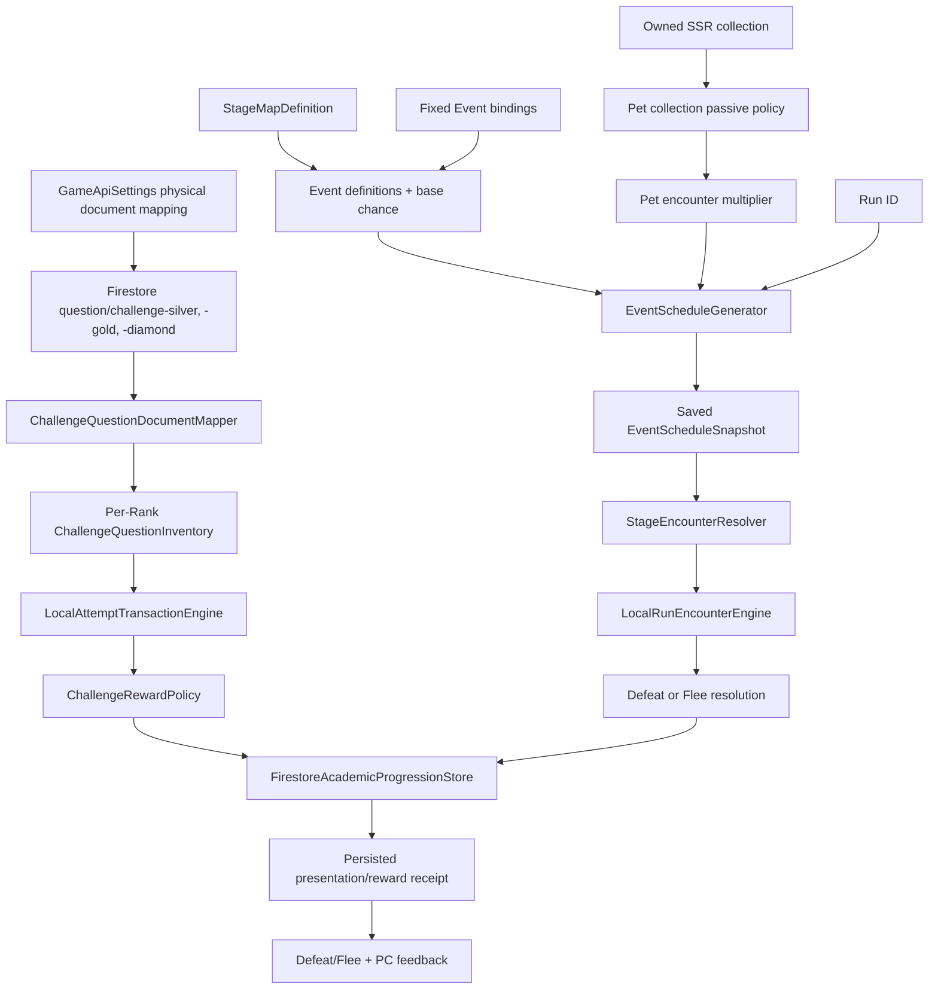

# Architecture Plan: Event Stage Scheduling and Challenge Resolution

## 1. Current State and Target

Current implementation supports only fixed `StageMapDefinition.fixedEvents`. `EventDefinition` has no Event type or scheduling policy. `StageEncounterResolver` treats `ChallengeEvent` as a special non-enemy with 1 HP, while `LocalRunEncounterEngine` lets failure remove a heart and return to `EventReady`, allowing retries. Event questions are parsed with numeric `QuestionId`, forced to Diamond Rank, and selected by stable hash rather than ordinary per-Rank sequence rules. Attempt persistence stores `activeRun.questionId` as an integer and does not grant Challenge Power Coins.

Target implementation adds a saved block schedule, typed Event Stage definitions, Rank-aware string Challenge content IDs, a one-trial flee transition, and an atomic immediate reward while retaining fixed designer bindings.

## 2. System Diagram



## 3. Recommended Definition Boundary

Use composition and handler dispatch rather than C# inheritance from `EnemyDefinition`:

```csharp
public enum EventStageType
{
    ChallengeMonster,
    Minigame
}

public interface IEventStageHandler
{
    EventStageType Type { get; }
    EventResolution Resolve(EventAttemptContext context);
}
```

`EventDefinition` remains an independent ScriptableObject with identity, type, and presentation configuration. Runtime dispatch uses the typed `EventStageType`; `ChallengeMonster` reuses common encounter presentation/action contracts and owns its 1-HP runtime rule; it does not inherit normal-monster cooldown, boss class, HP scaling, or attack fields. `Minigame` does not inherit combat state.

This preserves the current GDD and ADR-009 rule that Events do not masquerade as monsters while satisfying the requirement that Challenge Monster presentation can use enemy actions such as `Flee`.

## 4. Interfaces and Value Objects

```csharp
public interface IEventScheduleGenerator
{
    EventScheduleSnapshot Create(
        string runId,
        StageMapData map,
        int baseChanceBasisPoints,
        int petMultiplierBasisPoints);
}

public readonly struct ChallengeQuestionId
{
    public string Value { get; }
    public AcademicRankTier Rank { get; }
    public int Ordinal { get; }
}

public static class ChallengeRewardPolicy
{
    public static int Calculate(QuestionOutcome outcome, int responseScore);
}
```

The Challenge ID parser accepts only lowercase canonical IDs matching `^c[sgd][1-9][0-9]*$`. It derives Rank from `s`, `g`, or `d`. Ordinary `QuestionId` stays numeric because the canonical `@tag:question-data` contract and persisted Rank inventories are numeric.

## 5. Class Responsibility Table

| Current owner | Current responsibility | Target owner | Target responsibility |
| --- | --- | --- | --- |
| `EventDefinition` | One implicit Challenge shape | `EventDefinition` + typed config | Event identity/type/presentation only; Challenge document mapping and dispatch are centralized runtime services |
| `StageMapDefinition.fixedEvents` | Entire Event schedule | `StageMapDefinition` | Base chance, eligible Event catalog, and unchanged fixed overrides |
| `StageMapData._events` | Fixed Stage lookup | `EventScheduleSnapshot` | Immutable saved generated Stage/Event mapping for one run |
| `StageEncounterResolver` | Fixed Event or monster selection | same | Fixed/generated Event priority followed by boss/normal resolution |
| `LocalRunEncounterEngine` | Event retry and heart-loss behavior | same | One-trial Event resolve; emits `EnemyFled`; advances on either outcome |
| `EventQuestionCatalog` | Hash-select numeric Diamond questions | `ChallengeQuestionCatalog` + `ChallengeQuestionInventory` | Three centrally configured Rank documents exposed through one shared per-Rank FIFO/reservation state |
| `QuestionId` | Numeric Rank and Event IDs | `QuestionId` + `ChallengeQuestionId` | Preserve numeric Rank contract; isolate prefixed Event content identity |
| `FirestoreAcademicProgressionStore` | Attempt/Stage/academic atomic save | same + reward receipt fields | Atomically save Event result, Stage, wallet delta, schedule/inventory, and receipt |
| `EnemyActionTokenKind.EventRisk` | Generic Event consequence token | `EnemyActionTokenKind.Flee` | Telegraph/consume the Challenge's one failure action |
| `AttemptPresentationReceipt` | Combat damage/attack result | extended receipt | Carries flee flag, Power Coins granted, and resulting balance |
| `PetDefinition`/pet catalog | Equipped attack bonus/multiplier | collection passive projection | Exposes and aggregates unique SSR Event chance multiplier contributions |

## 6. Data Flow

```text
New run
  -> aggregate account-wide pet Event multiplier
  -> generate ten block schedule entries (guaranteed + optional bonus)
  -> merge using approved fixed-binding rule
  -> save schedule snapshot
  -> resolve current Stage from saved schedule

Challenge commit
  -> GameApiSettings resolves challenge-{silver|gold|diamond}
  -> reserve next Challenge question from the shared FIFO for active Rank
  -> save committed attempt ID + string content ID
  -> present video/answer
  -> resolve correct as defeat OR failure as flee
  -> calculate 10-20 PC
  -> atomically save next Stage/encounter + wallet + inventory + reward receipt
  -> play persisted result presentation
```

## 7. Persistence Migration

Additive fields are recommended for one compatibility release:

| Path | Type | Purpose |
| --- | --- | --- |
| `activeRun.eventScheduleVersion` | integer | Validate supported schedule schema |
| `activeRun.eventScheduleStages` | integer array | Generated Challenge Stage positions for this run |
| `activeRun.eventScheduleCatalogVersion` | string | Detect content mismatch without rerolling |
| `activeRun.eventChanceBasisPoints` | integer | Saved base chance used at run creation |
| `activeRun.petEventMultiplierBasisPoints` | integer | Saved account-wide pet multiplier used at run creation |
| `activeRun.questionContentId` | string | Canonical committed content ID, including `cs1`/`cg1`/`cd1` |
| `activeRun.challengeQuestions.{rank}` | map | Separate pending/reserved/cleared Challenge FIFO state |
| `activeRun.lastChallengeRewardAttemptId` | string | Idempotency receipt key |
| `activeRun.lastChallengeRewardPowerCoins` | integer | Granted amount |
| `activeRun.lastChallengeRewardResultingPowerCoins` | integer | Recovery/display value |

Keep legacy numeric `activeRun.questionId` for ordinary Rank attempts during migration. Do not change that Firestore leaf between integer and string types. Increment `PlayerSchemaMigrator.CurrentSchemaVersion`, add defaults/reset behavior, and update `FirestoreRestClient` mapping. Schedule creation occurs only when a new run lacks a supported saved schedule; it is not regenerated when pets or content change mid-run.

## 8. Fixed Event Resolution Decision

The direct prompt says fixed bindings can remain as a designer bonus outside the new calculation. The canonical GDD also says each block contains one or two Challenges, never more than two. These cannot both be true when a fixed Challenge shares a block with one guaranteed and one bonus generated Challenge.

Approved on 2026-09-14: fixed bindings win their exact Stage and count toward the block's guaranteed/bonus total. This preserves the GDD's one-to-two cap and prevents accidental Event-heavy blocks.

## 9. Challenge Sequence Decision

Approved on 2026-09-14: implement a separate per-Rank `ChallengeQuestionInventory` using the same FIFO/reservation rules as ordinary questions, excluding Challenge outcomes from Rank audit and ordinary question queues. Persist it under `activeRun` so run reset semantics can be explicit.

Alternative: map `csN`/`cgN`/`cdN` to the ordinary Rank queue's current numeric `N`. This guarantees exact cross-catalog alignment but makes missing matching IDs a content failure and couples Challenge content authoring to every ordinary catalog change.

## 10. Flee and Presentation State

Add `Flee` to `EnemyActionTokenKind`, `EnemyFlee` to `PresentationActionKind`, and `EnemyFled` to `CombatResolution` plus `AttemptPresentationReceipt`. `Flee` is not an attack:

- it never decrements hearts;
- it never sets `EnemyAttacked`;
- it never triggers counter-attack or damage reactions;
- it resolves the Event and advances the Stage;
- its action token is consumed once and its receipt is replay-safe.

## 11. Affected Files

Expected modifications:

- Combat definitions/models/resolver/engine and presentation plan/view/feedback.
- Event question repository/catalog and attempt transaction models.
- Firestore gameplay store, local snapshot application, REST mapping, defaults, reset, and schema migration.
- Player snapshot and challenge inventory persistence models.
- Pet definition/catalog and a collection passive aggregation policy.
- `CombatLobbyCompositionRoot` wiring and development fallback content.
- Event/Stage Map ScriptableObject assets and authoring validation.
- Combat, academic, persistence, presentation, and pet EditMode tests.

No Firebase rules publication, deployment, build settings, or dependency changes are authorized.

## 12. Incremental Implementation

1. Add pure value objects and tests for `EventStageType`, schedule generation, Challenge IDs, rewards, and flee result invariants.
2. Add ScriptableObject fields/mapping while retaining fixed-event behavior.
3. Add saved schedule and migration/default mapping; prove reload determinism.
4. Add separate Rank-aware Challenge catalog/inventory and string active content ID.
5. Change Event resolution to one-trial defeat/flee and extend receipts/presentation.
6. Add atomic wallet reward and idempotency receipt.
7. Add pet collection multiplier projection; snapshot it only at new-run creation.
8. Update assets, development fallback, UI copy, and regression tests.

## 13. Human Architecture Checkpoint

The project owner approved all three recommended decisions with `lgtm` on 2026-09-14:

1. **Definition boundary:** independent `EventDefinition` with typed composition.
2. **Fixed bindings:** count inside the one-to-two block cap.
3. **Question sequence:** separate per-Rank Challenge FIFO and reservation state.

Implementation is complete and awaits implementation review plus the manual Editor/WebGL playtest checkpoint.
