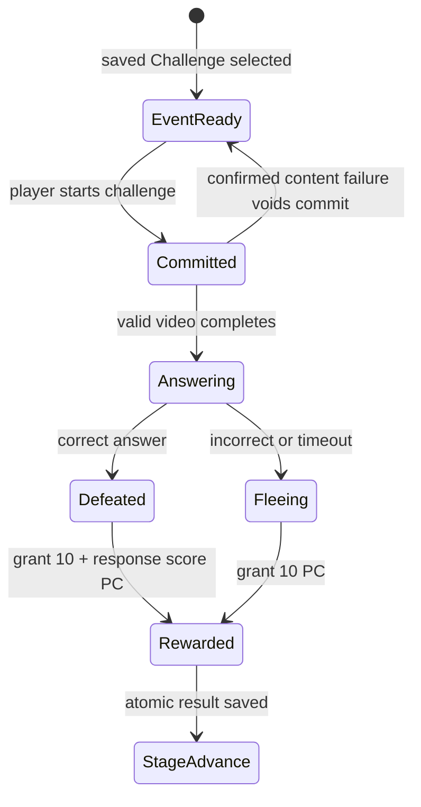

# Design Spec: Event Stage and Challenge Migration

> The player-facing rules are already recorded as approved requirements in the canonical GDD revision dated 2026-09-13. Architecture choices that are not settled by the GDD remain open in the companion architecture plan.

## 1. Player Goal and Context

The student should recognize a Challenge Monster as a surprising but fair one-trial opportunity. The encounter never traps progression: solving it defeats the target, while an incorrect answer or timeout makes it flee. Both outcomes immediately acknowledge the attempt and grant Power Coins, with faster correct responses earning more.

## 2. System Rules

### Encounter cadence

For each sequential 20-Stage block:

1. remove Mini-Boss, Big-Boss, and Final-Boss Stages from the eligible set;
2. schedule one guaranteed Challenge Monster on an eligible Normal Candidate;
3. make one bonus roll using the configured base Event chance multiplied by the account-wide pet encounter multiplier;
4. on a successful bonus roll, schedule one additional distinct eligible Stage;
5. save the authoritative schedule before it can affect encounter resolution.

The configured base chance has no final default in the GDD. It remains a data-authored tuning value and requires a later balance pass; no implementation should silently invent a non-zero production value.

### Challenge state machine



- A valid commit consumes the only trial.
- Browser refresh resumes or returns the same committed/result transaction; it cannot create a second trial.
- A confirmed invalid or missing content item voids the commit because no valid trial was delivered.
- Failure deals no heart damage and never enters `RunDefeat` by itself.
- Challenge results remain outside the five-question Rank audit.

### Challenge question content

Physical Firebase document names are centralized in `GameApiSettings`; Event Definitions contain no document or handler ownership fields:

- `question/challenge-silver`
- `question/challenge-gold`
- `question/challenge-diamond`

Each document uses the same deployed top-level structure as ordinary questions: `qN: { id, video-url, answer }`.

| Field | Rule |
| --- | --- |
| `id` | String `c` + Rank initial + positive ordinal: `cs1`, `cg1`, `cd1` |
| `video-url` | Valid supported HTTPS YouTube URL |
| `answer` | Non-negative integer |

The Rank initial and `qN` ordinal must agree with the containing Rank document. Sequence semantics match ordinary enemy questions—stable per-Rank ordering, no duplicate within the applicable cycle, and reconnect-safe reservation—but there is one shared Challenge FIFO cursor per Rank across Challenge Events. Challenge inventory remains separate from ordinary questions so Event outcomes cannot mutate Rank audit placement.

### Power Coin reward

The requested efficiency mapping is exact rather than a proposed tuning value:

```text
CorrectRewardPC = 10 + clamp(ResponseScore, 0, 10)
FailureRewardPC = 10
```

Therefore score 10 grants 20 PC, score 0 grants 10 PC, and any incorrect/timeout outcome grants 10 PC. Reward, Event resolution, and Stage advance share the committed attempt ID and save atomically.

### Feedback

- Reveal: Event title/art plus a one-trial rule and guaranteed reward message.
- Success: correct feedback, target defeat, reward count-up, and success audio.
- Failure: clear incorrect/timeout reason, friendly flee motion, `+10 PC` count-up, and failure/flee audio.
- Recovery: a reloaded pending receipt replays presentation only; it never reapplies state or currency.

## 3. Five-Component Evaluation

| Component | Requirement |
| --- | --- |
| Clarity | Telegraph one trial, flee-on-failure, and the 10-20 PC range before commitment. |
| Motivation | Every Challenge resolves with a useful permanent reward; skill improves it by up to 10 PC. |
| Response | One committed answer deterministically selects defeat or flee; content failure restores readiness. |
| Satisfaction | Defeat/flee and reward each use distinct visual and audio feedback. |
| Fit | Harder mathematics creates a compact power/reward spike without blocking the 200-Stage run. |

Response and Clarity remain higher priority than reward spectacle.

## 4. Risks and Abuse Cases

- Regenerating schedules on load can reroll Events or let pet changes alter an active run.
- Per-stage chance rolls can exceed the promised one generated bonus per block.
- A string Challenge ID stored in the existing integer `activeRun.questionId` field can corrupt recovery.
- Reusing Rank inventory for Challenge selection can remove or reorder ordinary questions and affect promotion/demotion.
- Advancing before the wallet transaction saves can grant Stage progress without reward; rewarding before advance can duplicate currency on retry.
- Treating flee as enemy attack can accidentally remove a heart or trigger counter-attack pet passives.
- Fixed Events and generated Events can collide unless priority and cap semantics are explicit.

## 5. Playtest Scenarios

- **New player:** before pressing Start Challenge, explain the one-trial rule, failure outcome, and reward range.
- **Stress:** double-click commit, submit twice, refresh during video, refresh after answer, and reconnect during flee presentation.
- **Skill:** verify scores 0, 5, and 10 grant 10, 15, and 20 PC on correct answers; failure always grants 10 PC.
- **Abuse:** repeat a resolved attempt ID and confirm Stage and wallet do not change again.
- **Readability:** an observer distinguishes defeat from flee and can state why the Stage advanced.
- **Cadence:** inspect all ten 20-Stage blocks and protected boss boundaries.

## 6. Tuning Priority

1. Fix single-trial and reconnect correctness.
2. Fix flee/reward clarity.
3. Validate schedule frequency and protected-stage exclusions.
4. Tune the data-authored base bonus chance only after cadence playtests.
