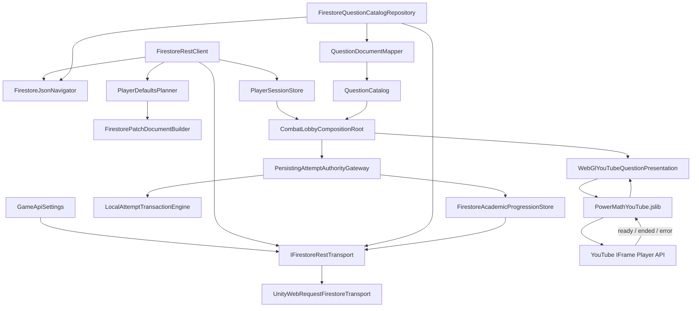

# Architecture Plan: Firestore Player/Question Migration and Embedded YouTube

## 1. Decision Summary

1. Replace nested `JsonUtility` Firestore DTO graphs with a shallow raw-JSON navigator and typed leaf readers; no new JSON package.
2. Change configured competition paths to `competition/{level1|level2|level3}` and map direct `{student}.gamedata`; runtime has no `game1` dependency.
3. After credentials match an existing student, calculate a missing-leaf patch and send one REST PATCH with `updateMask` plus the document `updateTime` precondition. Re-read after success; reload/recalculate once after conflict.
4. Load independent shared content from `question/{silver|gold|diamond}` where each document owns `items: [{id, video_link, answer}]`.
5. Introduce `QuestionKey(Rank, QuestionId)`; numeric IDs are sorted/unique within Rank and may repeat across Ranks.
6. Validate and normalize YouTube watch, short, shorts, and embed links to a video ID without resolving or downloading a media stream.
7. On WebGL, a project-owned `.jslib` creates the official YouTube IFrame Player over the Unity canvas and reports ready/ended/error events to C#. Editor tests use the deterministic presentation.
8. Keep shared question content outside student documents. Persist only the student's audit, Rank inventory/history, wallet deltas, and active question reservation in `{student}.gamedata`.
9. Production composes the live Firestore catalog and WebGL YouTube presentation. It never falls back silently to QA fixtures.
10. Automated tests use fake REST transport and fake question presentation; they never call or mutate real Firebase.

## 2. System Diagram



## 3. Firestore Contracts

### 3.1 Competition/player document

```text
competition/{level1 | level2 | level3}
  {normalizedStudentName}: map
    userdata: map
      username: string
      password: string
    gamedata: map
      revision: integer
      profile: map
      progression: map
      wallet: map
      inventory: array
      loadout: map
      activeRun: map
      academic: map
```

`academic` owns only per-student state:

```text
academic:
  auditScore: integer
  auditResolvedCount: integer
  activeAttempt: null | map
    commandId: string
    rank: string
    questionId: integer
  inventories: map
    silver|gold|diamond: map
      cycle: integer
      pendingIds: array<integer>
      failedIds: array<integer>
      attemptedInAuditIds: array<integer>
      clearedInCycleIds: array<integer>
```

- Active Rank stays in `progression.activeRank`.
- Rank Currency stays in `wallet.silver/gold/diamond`.
- `rankProgress` is neither created nor read.
- When direct data is missing but a legacy `gamedata.game1` leaf exists, initialization copies the valid legacy leaf instead of replacing it with a default. Runtime then re-reads only direct `gamedata`. Legacy `game1` is left untouched for rollback and can be removed manually later.

### 3.2 Shared question documents

```text
question/silver
question/gold
question/diamond

items: array<map>
  id: integer
  video_link: string
  answer: integer
```

- Minimum five valid items per Rank.
- `id >= 0`, unique inside one Rank, sorted numerically.
- Duplicate numeric IDs across Ranks are valid because domain identity is `QuestionKey`.
- `video_link` must normalize to an HTTPS YouTube video ID.
- `answer` remains a supported non-negative `Int32`.
- Catalog activation is all-or-nothing across all three documents.

## 4. Interfaces

```csharp
public interface IFirestoreRestTransport
{
    IEnumerator Get(string url, Action<FirestoreRestResponse> completed);
    IEnumerator Patch(
        string url,
        string jsonBody,
        IReadOnlyList<string> updateFieldPaths,
        string expectedUpdateTime,
        Action<FirestoreRestResponse> completed);
}

public interface IQuestionCatalogRepository
{
    IEnumerator Load(Action<QuestionCatalogLoadResult> completed);
    void Cancel();
}

public interface IAcademicProgressionStore
{
    IEnumerator Save(
        AcademicPersistenceSnapshot snapshot,
        long expectedRevision,
        Action<AcademicSaveResult> completed);
}

public interface IYouTubePlayerBridge
{
    void Show(string videoId, YouTubeViewport viewport);
    void Hide();
    event Action Ready;
    event Action Ended;
    event Action<YouTubePlaybackError> Failed;
}
```

`IAttemptAuthorityGateway` operations that can perform network persistence migrate from synchronous returns to `IEnumerator` plus a completion callback. Local implementations complete in the same frame; Firestore-backed implementations yield until the PATCH result is known. Attack remains blocked until the command receipt is durably accepted or presents a retry/error state.

## 5. Class Responsibilities

| Class | Responsibility | Depends On | Owned State |
| --- | --- | --- | --- |
| `FirestoreJsonNavigator` | Navigate object/array slices and read Firestore typed leaves without recursive serialization | None | None |
| `FirestoreFieldPath` | Quote/escape dynamic update-mask segments such as student names | None | None |
| `FirestorePatchDocumentBuilder` | Serialize typed Firestore values and exact nested PATCH bodies | None | Builder buffer only |
| `PlayerDefaultsPlanner` | Compare an existing student document with required schema; prefer valid legacy leaves; output only missing fields | Defaults policy, JSON navigator | None |
| `FirestorePlayerMapper` | Map direct `gamedata` into `PlayerSnapshot` and academic persistence DTO | JSON navigator | None |
| `UnityWebRequestFirestoreTransport` | GET/PATCH, timeouts, headers, status mapping, cancellation | `GameApiSettings` | Active request only |
| `FirestoreRestClient` | Authenticate existing student, ensure defaults, retry one version conflict, re-read and bootstrap | Transport, planner, mapper | Request operation only |
| `QuestionId` | Stable non-negative numeric ID | None | Value |
| `QuestionKey` | Composite Rank plus numeric ID | `AcademicRank`, `QuestionId` | Value |
| `YouTubeVideoId` | Parse/normalize supported YouTube URLs | `Uri` | Value |
| `QuestionDocumentMapper` | Map `{id, video_link, answer}` with Rank supplied by parent document | YouTube parser | None |
| `FirestoreQuestionCatalogRepository` | Fetch three Rank docs, parse arrays, and activate one validated catalog | Transport, mapper, settings | Cancellation/generation token |
| `AcademicPersistenceMapper` | Import/export audit and Rank inventory snapshots | Academic Core | None |
| `FirestoreAcademicProgressionStore` | PATCH per-student academic/progression/wallet fields with revision precondition | Transport, settings | Latest update token |
| `PersistingAttemptAuthorityGateway` | Decorate local transaction authority; persist commit/result receipts before publishing completion | Local gateway, progression store | Pending command receipt |
| `WebGlYouTubeBridge` | C# wrapper and callback receiver for `.jslib` | Unity WebGL interop | One active video/generation |
| `WebGlYouTubeQuestionPresentation` | Convert descriptor URL to video ID, show player, map ended/error into presentation result | Bridge | One active completion callback |
| `SimulationQuestionPresentation` | Editor-only deterministic completion | None | Cancellation flag |
| `CombatLobbyCompositionRoot` | Select live/test adapters and wire them; no parsing/persistence rules | Settings, scene components | Service lifetime |

## 6. Player Initialization Flow

```text
GET competition/{level}
  -> shallow-locate fields.{student}.mapValue.fields
  -> validate userdata credentials
  -> build MissingFieldPlan against direct gamedata
      no missing fields -> map player
      missing fields -> PATCH exact leaf update masks + current updateTime
          success -> GET again -> map complete player
          version conflict -> GET again -> recalculate -> one retry
          permission/network/invalid -> Bootstrap error; never publish local defaults
```

Safety invariants:

- PATCH begins only after an existing student's credentials match.
- Missing students are never created.
- Every update path is a required missing leaf; no parent map is replaced wholesale.
- Existing invalid values are reported as invalid data, not silently reset.
- Inventory/question arrays already present—even empty—are preserved.
- Re-read is mandatory before Main Menu hydration.

## 7. Question/Attempt Flow

```text
Main Menu loads three Rank documents
  -> validate all items and build QuestionCatalog
  -> hydrate/import student's academic state
  -> initialize absent pendingIds from the sorted active catalog and persist once

Attack
  -> reserve QuestionKey from active Rank FIFO
  -> persist activeAttempt + inventory reservation receipt
  -> show embedded player
      ready -> wait for student playback
      ended -> open GDD answer window
      error/embed denied -> void reservation and committed cooldown
  -> submit/timeout
  -> local transaction calculates one immutable academic/combat result
  -> persist audit, Rank, currencies, inventories, cleared activeAttempt, revision
  -> publish result/feedback once
```

If persistence fails after a valid answer is calculated, the gateway retains the command receipt and exposes Retry. It must not ask the student to answer again or apply damage/currency twice.

## 8. Embedded YouTube Boundary

New asset:

```text
Assets/Plugins/WebGL/PowerMathYouTube.jslib
```

The bridge dynamically creates one absolute-positioned DOM container over the Unity canvas; no custom WebGL template or external package is required. It loads the official IFrame API once, creates/destroys one `YT.Player`, and passes only a normalized video ID.

Callbacks include an operation generation. Late callbacks from a cancelled/destroyed player are ignored. YouTube `ENDED` completes presentation; embed-disabled/not-found/HTML5 errors are content failures. Autoplay-blocked is not a failure because standard YouTube controls remain visible.

The iframe is a browser DOM overlay, not a Unity `RenderTexture`. UI Toolkit owns the reserved visual region and sends its screen rectangle to the bridge. Resize/orientation changes refresh the overlay rectangle.

## 9. Existing Files to Modify

| File | Change |
| --- | --- |
| `Session/GameApiSettings.cs` and asset | Defaults `competition`, `level1..3`; add `question` and Rank document URL builders. Do not change project ID/API key. |
| `Session/FirestoreRestClient.cs` | Reduce to orchestration; remove recursive wrapper DTO parsing; ensure missing defaults. |
| `PlayerData/PlayerSnapshot.cs` | Add explicit academic persistence projection; remove runtime dependence on `rankProgress` without deleting the legacy field yet. |
| `Academic/Core/QuestionModels.cs` | Numeric `QuestionId`, composite `QuestionKey`, YouTube content descriptor. |
| `Academic/Core/QuestionCatalog.cs` | Composite lookup and per-Rank ID uniqueness. |
| `Academic/Core/RankQuestionInventory.cs` | Import/export persistence snapshot and numeric IDs. |
| `Academic/Core/AcademicProgressionModels.cs` | Import/export audit/inventory state and persistence snapshot. |
| `Academic/Core/IQuestionCatalogRepository.cs` | Coroutine load contract. |
| `Academic/Infrastructure/QuestionDocumentDto.cs` | Remove Rank; numeric ID. |
| `Academic/Infrastructure/QuestionDocumentMapper.cs` | Receive parent Rank and validate YouTube URL. |
| `Combat/Core/ICombatGateway.cs` and coordinator | Async command completion/persistence gating. |
| `Combat/Unity/QuestionPresentations.cs` | Keep Editor mock; add platform selection via composition. |
| `UI/MainMenu/CombatLobbyCompositionRoot.cs` | Compose live catalog/store/WebGL player in production; explicit Editor fixture mode only. |
| `UI/MainMenuUI.uxml` and `CombatLobbyUI.uss` | Reserve embedded-video viewport and loading/error states. |

## 10. New File Plan

```text
Assets/Project/Script/Session/
  FirestoreJsonNavigator.cs
  FirestoreFieldPath.cs
  FirestorePatchDocumentBuilder.cs
  FirestoreTransport.cs
  FirestorePlayerMapper.cs
  PlayerDefaultsPlanner.cs

Assets/Project/Script/Gameplay/Academic/Core/
  AcademicPersistenceModels.cs
  YouTubeVideoId.cs

Assets/Project/Script/Gameplay/Academic/Firestore/   # Assembly-CSharp for Session/settings access
  FirestoreQuestionCatalogRepository.cs
  FirestoreAcademicProgressionStore.cs

Assets/Project/Script/Gameplay/Combat/Unity/
  WebGlYouTubeBridge.cs
  WebGlYouTubeQuestionPresentation.cs

Assets/Plugins/WebGL/
  PowerMathYouTube.jslib
```

## 11. Verification

### EditMode/contract

- Parse deeply nested live-shaped Firestore JSON without `JsonUtility` or serialization-depth warnings.
- Complete user causes zero PATCH requests.
- Every missing-field combination produces only exact missing update masks.
- Existing values and unrelated students/game fields survive PATCH request construction.
- Version conflict reloads/replans once; missing student never writes.
- Legacy `game1` valid leaves migrate to direct fields without deleting legacy data.
- Three Rank docs, numeric sorting, same ID across Ranks, duplicate within Rank, invalid answer, and fewer-than-five validation.
- All accepted YouTube URL forms normalize; non-YouTube and malformed IDs fail.
- FIFO/audit state export-import round-trips exactly.
- Persist retry returns one command receipt and cannot double-score/damage/currency.
- Late/cancelled YouTube callbacks cannot advance an attempt.

### PlayMode/WebGL manual

- Editor mock preserves existing correct/incorrect/promotion/demotion tests.
- WebGL embedded video appears within reserved viewport, resizes, plays with controls, and `ENDED` opens the numpad.
- Embed denied, removed video, offline load, callback duplication, scene change, and refresh use defined recovery.
- Human Firebase E2E uses a dedicated disposable test student; automated tests never use live settings.

## 12. Incremental Implementation Order

1. Pure shallow JSON navigator/writer, field-path escape, defaults planner, and tests.
2. Player mapper plus competition schema GET/PATCH/re-read flow and fake-transport tests.
3. Numeric/composite question identity, three-document DTO mapper, catalog/inventory test migration.
4. Live question repository with fake transport and explicit production composition.
5. Academic persistence import/export and Firestore store.
6. Async attempt gateway persistence gating and regression tests.
7. WebGL `.jslib` bridge, C# presentation, callback-generation tests, and UI viewport.
8. Unity EditMode/PlayMode, disposable-user E2E plan, self-review, and DevLog.

## 13. Architecture Checkpoint

Approval authorizes runtime implementation of:

- direct anonymous Firestore GET/PATCH under the already accepted prototype risk;
- changing collection/document defaults to `competition/level1..3` and adding `question/silver|gold|diamond` reads;
- a project-owned WebGL `.jslib` bridge using the official YouTube IFrame API;
- no new package, custom WebGL template, secret, rules, index, CI, deployment, or real-data automated mutation.

Live Firestore E2E writes remain limited to a human-provided disposable student after code/test review.

Approved by the project owner on 2026-08-10 (`LGTM`).
