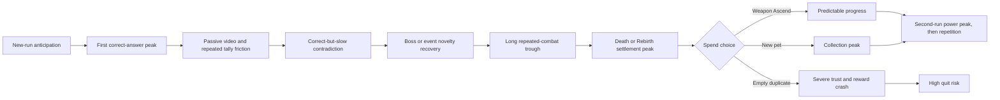

# Friction and Reward-Pulse Playthrough Analysis — Design Spec

## Analysis Status

This is a predictive design review of the redesigned GDD, not a finding from observed players or telemetry. In this document, "reward pulse" means the player's observable anticipation, satisfaction, sense of progress, and desire to continue. It does not claim to measure neurochemistry.

GDD sections reviewed: `@tag:core-loop`, `@tag:combat-attempt`, `@tag:answer-scoring`, `@tag:combat-stats`, `@tag:question-data`, `@tag:stage-progression`, `@tag:encounters`, `@tag:run-reset`, `@tag:economy`, `@tag:gacha`, `@tag:player-experience`, and `@tag:playtest`.

## Assumptions

> [!NOTE]
> **ASSUMPTION:** The current GDD describes target player experience, not necessarily the complete shipped implementation. **IMPACT:** Findings predict design risk and do not diagnose runtime defects. **IF WRONG:** Implementation-specific timing or presentation may already mitigate some risks. **VALIDATE:** Run this case against the current WebGL build and compare the observation log with the predictions below.

> [!NOTE]
> **ASSUMPTION:** The representative player is a 9-year-old first-time Grade 5 learner, starts at Silver with no upgrades, understands the mathematics at an average pace, and plays in a browser with sound enabled. **IMPACT:** This emphasizes the documented 6–10-year-old audience and the onboarding experience. **IF WRONG:** Experienced, highly fluent, muted, or accessibility-needs players will produce different friction peaks. **VALIDATE:** Repeat the case with the variant profiles at the end.

> [!NOTE]
> **ASSUMPTION:** Question videos have enough duration or delivery variance for passive watch time to be perceptible. The GDD does not document video lengths. **IMPACT:** Mandatory video playback may be the largest time cost in the loop. **IF WRONG:** If every clip is consistently brief and compelling, repetition rather than waiting becomes the larger risk. **VALIDATE:** Record median and longest time from Attack commitment to numpad availability.

## 1. Player Experience Description

The first correct answer should feel powerful: the learner watches a problem, solves it, sees the sword convert that knowledge into damage, earns Rank Currency, and advances toward a visible boss. The fantasy is clearest when one answer causes an immediately legible combat result.

The experience is predicted to weaken when the learner realizes that nearly every combat action has the same shape:

```text
Attack
  -> passive video period
    -> one-answer window
      -> result/tally
        -> damage or no damage
          -> repeat
```

The most frustrating local moment is predicted to be a correct-but-slow answer on an attempt that reduces the enemy cooldown to zero. The game first says "correct," then applies a low response multiplier, leaves the enemy alive, and immediately removes a heart. The learner succeeded academically but receives a mixed or negative gameplay outcome.

The largest sustained motivation drop is predicted between early novelty and the first meaningful meta decision. Biomes change presentation, while ordinary combat difficulty mainly changes HP and cooldown. If no event or minigame intervenes, the player repeats the same decision rather than learning a new combat behavior.

The harshest meta-progression drop is an empty pet duplicate after spending Power Coins. The pull produces neither collection progress nor power progress, converting anticipation directly into loss.

## 2. Interaction Flow: Representative Playthrough Case

### Case PM-FR-01 — First Run, First Reset, First Spend

**Starting test scope:** One blind first run until death or the Stage 30 boss is resolved, followed by one settlement/spend decision and the opening portion of a second run. This is a research boundary, not a gameplay balance value. If the player voluntarily stops earlier, do not prompt them to continue; the stopping point is the primary finding.

**Observer rule:** Do not explain the UI or ask the player to think aloud during video, preparation, or countdown states. Ask recall questions only after the complete combat resolution so observation does not alter response speed.

| Beat | Player action and system response | Predicted feeling | Friction hypothesis | Reward-pulse hypothesis | Evidence to capture |
| --- | --- | --- | ---: | ---: | --- |
| 1. Lobby arrival | Player identifies enemy, Stage, hearts, cooldown, and Attack without instruction | Curious, slightly overloaded | 2/4 | 3/4 | First-click hesitation; elements named correctly |
| 2. First commitment | Player presses Attack; attempt and cooldown commit before the video begins | Loss of control if commitment is not unmistakable | 3/4 | 2/4 | Time to input acknowledgement; whether commitment is understood |
| 3. Video-to-answer handoff | Video ends; numpad appears for the 1-second preparation period and 10-second countdown | Urgent; may shift from learning to speed pressure | 3/4 | 2/4 | Missed first input; confusion about when timing starts |
| 4. First fast correct | Correct UI, Rank Currency, damage tally, hit, and enemy HP response fire | Strong knowledge-to-power payoff | 1/4 | 4/4 | Can player explain why damage was high? |
| 5. Correct but slow | Correct result receives a low multiplier; enemy may survive and counterattack | "I was right, so why was I punished?" | 4/4 | 1/4 | Surprise at damage; fairness statement; heart-loss attribution |
| 6. Incorrect or timeout | Zero damage, cooldown still consumed, possible enemy attack | Failure compounds into lost progress and threat | 4/4 | 0/4 | Whether the player distinguishes wrong, timeout, and enemy attack |
| 7. Fifth resolved question | Hidden audit evaluates; only an actual Rank change produces a popup | Outcome can feel disconnected from its cause | 3/4 | 1/4 on demotion; 4/4 on promotion | Can player explain which five results caused the change? |
| 8. Stage 5 Mini-Boss | New boss art and HP spike, but the action remains Attack/video/answer | Visual novelty with mechanical repetition | 3/4 | 2/4 | Expected versus actual attempt count; desire to continue afterward |
| 9. Post-novelty stretch | Player repeats ordinary stages toward the first biome close | Habituation; video and tally become throughput costs | 4/4 | 1/4 | Voluntary pauses; skipped attention; requests to speed up |
| 10. Event/minigame/card, if encountered | Presentation or choice interrupts the standard loop | Temporary recovery if rules and reward are clear | 2/4 | 3/4 | Whether the choice changes later combat decisions |
| 11. Stage 30 boss | Player reaches a biome close and possible Rebirth gate | High anticipation, high fatigue risk | 3/4 | 4/4 on clear | Whether boss changes decisions or only answer count |
| 12. Settlement | Death or Rebirth reveals Power Coins, Legacy ATK, preserved state, and cleared state | Delayed progress finally becomes concrete | 2/4 | 4/4 if understood | Can player name what was kept, gained, and lost? |
| 13. First spend | Player compares Weapon Ascend with a 25-Power-Coin pet pull | Meaningful ownership choice if values are legible | 2/4 | 3/4 | Can player predict each option's effect? |
| 14. Empty duplicate branch | Gacha spends Power Coins and grants no pet or conversion | Betrayal of anticipation; likely session-ending | 4/4 | 0/4 | Immediate continue/quit choice; trust/fairness language |
| 15. Second-run opening | Higher permanent power meets the same early encounters | Brief empowerment, then possible triviality | 2/4 | 3/4 falling to 1/4 | Time until repetition is mentioned; early one-shot frequency |

Scores are predicted ordinal labels for prioritization, not measured results: friction `0 = effortless`, `4 = wants to disengage`; reward pulse `0 = none/negative`, `4 = strong desire to continue`.

### Critical Returning-Player Branch — Correct Answers, Rank Demotion

Run a separate five-question window with a Gold player whose correct Response Scores total exactly 25, for example `6 + 5 + 5 + 5 + 4`.

```text
Five correct answers
  -> audit total is 25
    -> demotion rule fires
      -> player sees Gold -> Silver
```

This is legal under `@tag:answer-scoring`. It is predicted to be the single strongest fairness failure because correctness, the game's educational promise, is followed by explicit status loss. The audit is hidden, so the player cannot inspect the cause or improve deliberately. Test whether the learner describes the result as unfair, confusing, or proof that being correct did not matter.

### Predicted Flow Curve



## 3. Feedback Loops

| Trigger | Current GDD feedback | Strength | Predicted weakness |
| --- | --- | --- | --- |
| Attack commitment | Input acknowledgement and question transition | Clear if immediate | Irreversibility may be learned only after a mistake |
| Fast correct answer | Correct-state UI, audio, tally, damage, currency | Strong immediate loop | Repetition may turn the tally into blocking ceremony |
| Slow correct answer | Same positive result with smaller final damage | Mixed | Correctness and combat punishment can occur together |
| Incorrect/timeout | Failure reason, gentle audio, zero damage | Clear locally | Cooldown loss and heart loss stack onto the same failure |
| Audit boundary | Popup only on promotion/demotion | Low-frequency surprise | Cause is hidden; a correct answer can precede demotion |
| Stage clear | Defeat animation and Stage progression | Strong early | Stage increment is mostly linear and may lose salience |
| Biome shift | Title, background transition, audio | Strong presentation beat | Biomes do not change decisions or rules |
| Run settlement | Reset summary and permanent rewards | Potentially strong | Spendable reward is deferred until death/Rebirth |
| Weapon Ascend | Exact cost/stat preview and milestone celebration | Clear, predictable | Linear stat gain may reduce later encounters to throughput |
| Pet pull | Odds preview and result | High anticipation | Empty duplicates provide no compensating progress |

### Reward-Loop Diagnosis

| Loop | Intended motivation | Predicted leak |
| --- | --- | --- |
| Per attempt | Correctness becomes damage and Rank Currency | Passive wait, speed pressure, and correct-but-slow punishment |
| Per enemy | HP reaches zero and Stage advances | Same answer action; HP growth increases repetition more than decisions |
| Per five questions | Rank reflects performance | Hidden boundary and speed-weighted demotion obscure mastery |
| Per biome | New art, boss, and journey progress | Presentation-only change may not refresh strategy |
| Per run | Power Coins, Legacy ATK, Prestige/Honor | Payoff is delayed and reset rules conflict in the GDD |
| Meta spend | Weapon growth or pet collection | Empty duplicate can erase a full reward cycle |

## 4. Juice and Pacing Evaluation

The GDD meets the minimum two-channel feedback requirement for major events. The risk is not missing feedback in isolation; it is feedback hierarchy and frequency.

- Repeated correct-answer tallies may be satisfying on the first attempts but become pacing friction if they block the next decision.
- A correct cue followed immediately by heart-loss impact creates competing emotional messages. The heart-loss event will likely dominate the memory of the attempt.
- Boss, biome, promotion, and milestone feedback are appropriately stronger, but the distance between them is not yet protected by a documented novelty cadence.
- Frequent sounds require variation to avoid repetition fatigue; the GDD requires distinct cues but does not define variation for the standard attempt loop.
- Reduced Motion is defined for biome transitions but not for repeated combat hit, tally, critical, rank, or gacha feedback.

Do not tune VFX duration, enemy HP, damage, or reward magnitude until the correct-but-slow and hidden-rank clarity tests are complete. The design-framework priority is Response, then Clarity, then Satisfaction.

## 5. Edge Cases and Frustration Amplifiers

### High-Risk Player States

- A correct slow answer leaves the enemy alive exactly when cooldown reaches zero, so success and heart loss occur in one resolution.
- A Gold player answers five of five correctly with a total Response Score of 25 and is demoted.
- A failed question returns to the front of its Rank FIFO after the audit, producing a repeated blocker without a visible mastery plan.
- Death/Rebirth rebuilds the question queues from canonical order, potentially making familiar early questions recur across runs.
- A player reaches a boss with one heart; a single incorrect, timeout, or low-damage correct answer can erase a long run before settlement presentation.
- A player spends the first meaningful Power Coin payout on an empty duplicate.
- A fully completed rarity restores equal odds even though every result in that rarity is empty, so collection completion makes that category permanently non-rewarding.
- A high Legacy ATK account may one-shot early content, collapsing combat anticipation into video throughput.
- A low-math-fluency or slower-input player may face lower damage, lower audit scores, more counterattacks, and delayed progression from the same underlying speed constraint.
- Closing or refreshing a valid committed question becomes an incorrect result, which may feel like punishment for browser or device behavior unless abandonment versus system failure is unmistakable.

### GDD Consistency Blockers

These must be resolved before quantitative pacing or economy conclusions are trustworthy:

1. `@tag:combat-stats` grants `+0.1%` Legacy ATK per Stage, while `@tag:run-reset` grants `+0.25%` per Stage.
2. `@tag:combat-stats` and `@tag:guardrails` describe Rebirth as available from Stage 50, while `@tag:run-reset` and `@tag:economy` use Stage 30.
3. `@tag:combat-stats` says normal Monster Definitions do not author HP, while `@tag:stage-progression` says they provide Base HP per biome archetype.
4. `@tag:encounters` defines Level 20 Weapon ATK as `+79`, while `@tag:playtest` expects `+25`.
5. Challenge Monster failure, retry, heart-loss, and reward behavior remain explicitly unapproved. Its frustration and reward effect therefore cannot be evaluated as a finished loop.

## 6. GDD Alignment and 5-Component Evaluation

| Component | Rating | Diagnosis | Primary evidence |
| --- | --- | --- | --- |
| Clarity | At risk | Local outcomes are specified well, but audit causality, correct-plus-heart-loss, reset thresholds, and some formulas are unclear or contradictory | `@tag:answer-scoring`, `@tag:run-reset`, `@tag:guardrails` |
| Motivation | Weak in sustained play | Immediate damage is strong, but repeat combat adds durability rather than decisions; meaningful Power Coins are delayed; Rank Currency is not spendable | `@tag:core-loop`, `@tag:stage-progression`, `@tag:economy` |
| Response | At risk | Input is deterministic, but every attack is irreversibly committed before a passive video and one-shot answer; speed strongly controls power | `@tag:combat-attempt`, `@tag:answer-scoring` |
| Satisfaction | Strong peaks, weak baseline | Correct hits, bosses, ranks, biomes, and milestones have two-channel feedback; repetition and empty duplicates can invert those peaks | `@tag:player-experience`, `@tag:gacha` |
| Fit | Strong concept, uneven expression | Math directly powers the sword, but a correct answer that causes low damage or demotion conflicts with the knowledge-as-power fantasy | `@tag:answer-scoring`, `@tag:combat-stats` |

### Tuning Priority

1. **Resolve rule contradictions first:** choose one Rebirth threshold, one Legacy ATK rate, one normal-enemy HP ownership rule, and one Level 20 ATK value.
2. **Validate fairness before numbers:** test correct-but-slow counterattacks and five-correct-answer demotion before changing damage, timer, or HP.
3. **Measure repeated-loop cost:** isolate passive video time, result-presentation time, and active decision time per attempt; identify the first voluntary stopping Stage.
4. **Validate reward trust:** observe first settlement, first spend, and empty-duplicate response; do not rely only on whether the player understands the odds.
5. **Validate decision novelty:** at normal, Mini-Boss, Big Boss, event, biome shift, and second-run states, ask what the player does differently—not merely what looks different.
6. **Only then tune economy and durability:** use observed attempts-to-kill, attrition, quit points, and spend choices rather than adding more spectacle or random damage.

## Playtest Observation Sheet

For every resolved attempt, record:

| Field | Value |
| --- | --- |
| Stage / encounter class | |
| Video-to-numpad time | |
| Response Score / correct / timeout | |
| Damage and enemy HP remaining | |
| Cooldown before / after | |
| Heart loss | |
| Player's explanation of outcome | |
| Friction `0–4` | |
| Reward pulse `0–4` | |
| Continue chosen without prompting | Yes / No |

At each major checkpoint, ask only after resolution:

1. What did your answer cause?
2. Why did the enemy attack or not attack?
3. What are you working toward right now?
4. What will persist if this run ends?
5. What would you choose next, and why?

The GDD's existing pass target remains authoritative for outcome readability: players should correctly explain at least 8 of 10 observed resolutions. Additional pass/fail thresholds for retention, fairness, and reward cadence are not documented and require a human playtest checkpoint before becoming design requirements.

## Variant Cases

- **PM-FR-02 — Accurate but slow Gold learner:** Force five correct scores totaling 25; validate whether demotion violates fairness and knowledge-as-power Fit.
- **PM-FR-03 — Fast high-mastery returner:** Use strong permanent ATK; measure when one-shot combat becomes passive video throughput.
- **PM-FR-04 — Recovery stress:** Refresh during video, countdown, submission, damage, and settlement; distinguish trusted recovery from perceived punishment.
- **PM-FR-05 — Collection-complete player:** Pull from a completed rarity and observe whether transparent odds offset an empty result.
- **PM-FR-06 — Accessibility stress:** Repeat with muted audio, Reduced Motion, slower input, and unstable network; verify that clarity survives without speed or audiovisual advantage.

