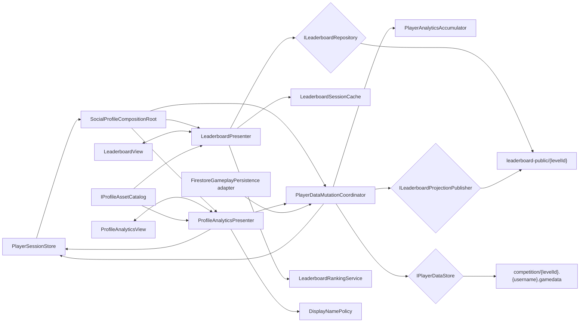

# Architecture Plan: Grade-Filtered Leaderboard and Profile Analytics

## 1. Decision Summary

Add a scene-scoped Social/Profile feature beside the existing Main Menu and combat presenters. It uses pure domain policies for cohort validation, ranking, analytics accumulation, and Display Name eligibility; Firestore adapters own wire parsing and writes; dedicated UI Toolkit presenters own the two modals.

For the accepted direct-Firestore prototype:

- Keep private owner analytics under the authenticated student's existing `competition/{levelId}.{username}.gamedata` map.
- Add one sanitized `leaderboard-public/{levelId}` document per Grade 4-6 cohort, containing public entries only and requiring one GET per open or manual Refresh.
- Add a persistent opaque `publicPlayerId`; never use the credential username as a public key or UI value.
- Replace the academic-only persistence transport with one serialized player-data mutation coordinator so an accepted attempt updates progression, wallet, analytics, and the in-memory session under one student-document revision.
- Publish the resulting public leaderboard entry after the private student write. The public projection is derived, revisioned, idempotent, and repairable; temporary lag never rolls back authoritative private state.
- Perform Display Name changes through the same mutation coordinator. A Firestore server timestamp owns the accepted-change time; the seven-day date is derived from it.
- Calculate Response Efficiency as `correct ? responseScore × 10 : 0`, as approved by the project owner.
- Add no package, backend worker, CI/build change, or automatic leaderboard polling.

This plan extends ADR-006's accepted prototype limitations. It does not claim that anonymous direct Firestore can prove caller ownership or prevent a modified client from tampering.

## 2. Current State and Required Changes

| Area | Current implementation | Target architecture |
| --- | --- | --- |
| Session state | `PlayerSessionStore` owns a hydrated mutable `PlayerSnapshot` and emits `Changed`. | Extend snapshot with public identity, profile timestamps, lifetime progression, and owner analytics. Keep one session store. |
| Gameplay persistence | `FirestoreGameplayPersistence` delegates to academic-specific `FirestoreAcademicProgressionStore`, then mutates the snapshot. | Make it a thin adapter over a centralized `PlayerDataMutationCoordinator`; retire the academic-specific transport. |
| Attempt save identity | `GameplaySaveRequest.TransactionId` is newly generated per save checkpoint. | Separate stable `AttemptId` from per-write `OperationId`; analytics apply only once for one resolved attempt. |
| Analytics | Only hidden audit and Rank FIFO state are saved. | Add fixed-size aggregates, bounded histories, total damage/play time, and factual response distributions. |
| Main Menu | `MainMenuPresenter/View` own identity, logout, and basic labels. | Leave them focused; add separate Leaderboard and Profile presenter/view pairs. |
| Leaderboard | No repository, public projection, ranking policy, or panel. | Add one public cohort-document repository, parser, cache, ranking service, presenter, and view. |
| Profile editing | `displayName` is bootstrap data only. | Add validated rename command, server-timestamp cooldown, and projection repair. |
| Firestore rules | Shared student maps are anonymously readable/updatable under accepted prototype rules. | Add reviewed rules for three pre-created public leaderboard documents; do not publish automatically. |

## 3. Architectural Invariants

1. **Cohort is session-owned:** repository calls accept `CohortId` derived from the authenticated level document, never a UI-selected string.
2. **Public means sanitized:** leaderboard parsing has no DTO fields for username, password, play time, attempts, questions, response data, or audit data.
3. **Public identity is opaque:** `publicPlayerId` is stable, random, persisted, and unrelated to the credential username.
4. **Ranking is pure:** `highestStage` descending, then `silver ×5 + gold ×7 + diamond ×10` descending; exact score ties share rank.
5. **One mutation lane:** gameplay saves and Display Name changes serialize through one coordinator and one player revision.
6. **One analytics append:** only `AttemptResolved` with a stable unseen `AttemptId` changes attempt aggregates.
7. **Void remains absent:** content/system voids never change outcomes, currencies, damage, or learning analytics.
8. **Audit stays unreachable:** student profile view models never receive audit score/count, thresholds, or audit averages.
9. **No automatic leaderboard traffic:** open and explicit manual Refresh are the only read triggers.
10. **Private wins over projection:** a failed public projection write never rolls back an accepted private save; it produces a repairable stale projection.
11. **No raw Firestore in UI/Core:** Firestore paths, JSON nodes, update masks, and REST errors stay in Infrastructure.
12. **No Main Menu god-object:** existing `MainMenuPresenter/View` do not absorb leaderboard, chart, rename, or analytics responsibilities.

## 4. System Diagram



## 5. Firestore Data Layout

### 5.1 Existing Private Student Map (Extended)

```text
competition/{level1 | level2 | level3}
  {normalizedUsername}
    userdata
      username
      password
    gamedata
      revision
      profile
        publicPlayerId
        displayName
        displayNameChangedAt        // Firestore server timestamp; absent = eligible
        createdAt                   // server timestamp when known/migrated
        iconId
      progression
        currentStage
        highestStage
        activeRank
        prestige
        firstStage200Reached
        firstStage200ReachedAt
        totalDamage
      wallet
      inventory
      loadout
      activeRun
      academic                     // includes hidden audit/FIFO; never profile-mapped
      analytics
        schemaVersion
        revision
        lastAppliedAttemptId
        totalQuestionsResolved
        totalCorrect
        totalIncorrect
        totalTimeout
        totalAbandoned
        totalPlaySeconds
        responseScoreHistogram
        responseDuration100msHistogram
        byRank
        byQuestion
        recentAttempts
        dailyBuckets
        rankHistory
        cycleHistory
```

`displayNameChangeAvailableAt` is derived as `displayNameChangedAt + 168 hours`; it is not stored independently, preventing timestamp drift between two fields.

For existing students with no reliable registration timestamp, `createdAt` is left absent and the UI shows `Registration date unavailable`. Migration must not invent a historical registration date.

### 5.2 Public Cohort Projection

```text
leaderboard-public/{level1 | level2 | level3}
  _meta
    schemaVersion
    cohortId
  {publicPlayerId}
    entryRevision
    updatedAt
    displayName
    iconId
    avatarId
    petId
    weaponId
    currentStage
    highestStage
    silver
    gold
    diamond
    weightedCurrencyScore
    totalDamage
```

- The three documents are manually pre-created and `_meta` is immutable to clients.
- A document contains no credential username and no private analytics.
- `weightedCurrencyScore` is validated against balances when read and recalculated by the publisher; rank is never stored.
- A single public document provides the complete cohort in one billable document read and lets Unity compute shared ranks consistently.
- This shape inherits Firestore's document-size and shared-document contention limits. Migrate to per-entry documents or a trusted materialized view before approaching the Firestore document limit or when observed update conflicts become material.

## 6. Core Domain Models

### 6.1 Cohort and Public Identity

```csharp
public readonly struct CohortId
{
    public string LevelDocumentId { get; }
    public int Grade { get; }
}

public readonly struct PublicPlayerId
{
    public string Value { get; }
}
```

- `CohortId` accepts only `level1`, `level2`, or `level3` through a closed parser.
- `PublicPlayerId` accepts only the approved opaque identifier format and never converts to/from username.

### 6.2 Leaderboard Models and Policy

```csharp
public sealed class LeaderboardEntry
{
    public PublicPlayerId PlayerId { get; }
    public string DisplayName { get; }
    public int CurrentStage { get; }
    public int HighestStage { get; }
    public long Silver { get; }
    public long Gold { get; }
    public long Diamond { get; }
    public long WeightedCurrencyScore { get; }
    public long TotalDamage { get; }
    public string IconId { get; }
    public string AvatarId { get; }
    public string PetId { get; }
    public string WeaponId { get; }
    public long EntryRevision { get; }
}

public readonly struct RankedLeaderboardEntry
{
    public LeaderboardEntry Entry { get; }
    public int DisplayedRank { get; }
    public bool IsSelf { get; }
    public bool IsScoreTie { get; }
}

public interface ILeaderboardRankingService
{
    LeaderboardRankingResult Rank(
        IReadOnlyList<LeaderboardEntry> entries,
        PublicPlayerId selfId);
}
```

`LeaderboardWeightPolicy` owns checked 64-bit score calculation with constants sourced from the approved GDD. The repository rejects negative balances, invalid stages, duplicate public IDs, mismatched stored scores, unsupported schemas, and overflow.

### 6.3 Analytics Models

```csharp
public sealed class ResolvedAttemptAnalyticsRecord
{
    public string AttemptId { get; }
    public long QuestionId { get; }
    public AcademicRank Rank { get; }
    public QuestionOutcome Outcome { get; }
    public int ResponseScore { get; }
    public int ResponseDurationMilliseconds { get; }
    public int FinalDamageIncludingOverkill { get; }
    public RankTransition RankTransition { get; }
    public DateTimeOffset ResolvedAt { get; }
}

public interface IPlayerAnalyticsAccumulator
{
    PlayerAnalyticsSnapshot Apply(
        PlayerAnalyticsSnapshot current,
        ResolvedAttemptAnalyticsRecord record);
}
```

- Response Score uses a fixed 0-10 histogram, allowing exact mean and median.
- Response duration uses 100 ms buckets across the approved answer window plus an overflow bucket; mean uses total milliseconds/count and median is reported to the containing bucket.
- `byRank` contains exactly Silver, Gold, and Diamond aggregates.
- `byQuestion` is keyed only by IDs in the validated question catalog.
- `recentAttempts`, `dailyBuckets`, `rankHistory`, and `cycleHistory` are bounded projections, not unbounded event logs. Older data remains represented by lifetime/per-Rank/per-question aggregates.
- Raw hidden audit values never enter `PlayerAnalyticsSnapshot` exposed to Profile presentation.
- `ResponseEfficiencyPolicy` returns `responseScore × 10` for correct results and `0` otherwise; mean and median include all resolved non-void attempts.

### 6.4 Display Name Policy

```csharp
public interface IDisplayNamePolicy
{
    DisplayNameValidation Validate(string candidate);
    DateTimeOffset? GetNextEligibleAt(DateTimeOffset? changedAt);
    bool IsEligible(DateTimeOffset serverNow, DateTimeOffset? changedAt);
}

public interface IProfileCommandService
{
    void ChangeDisplayName(
        string candidate,
        string operationId,
        Action<DisplayNameChangeReceipt> completed,
        Action<PlayerDataFailure> failed);
}
```

The policy owns Unicode normalization, trimmed grapheme count, control/markup rejection, prohibited-content hook, no-op detection, and the approved seven-day interval. The store—not UI—uses Firestore server time and the player revision.

## 7. Ports and Adapters

```csharp
public interface ILeaderboardRepository
{
    void LoadCohort(
        CohortId cohort,
        Action<LeaderboardDocument> completed,
        Action<PlayerDataFailure> failed);
    void Cancel();
}

public interface ILeaderboardProjectionPublisher
{
    void Publish(
        CohortId cohort,
        LeaderboardEntry entry,
        Action completed,
        Action<PlayerDataFailure> failed);
}

public interface IPlayerDataStore
{
    void SaveGameplay(
        PlayerGameplayMutation mutation,
        Action<PlayerMutationReceipt> completed,
        Action<PlayerDataFailure> failed);
    void ChangeDisplayName(
        DisplayNameMutation mutation,
        Action<DisplayNameChangeReceipt> completed,
        Action<PlayerDataFailure> failed);
}
```

Editor/development fakes implement the same ports using deterministic sample data and must remain clearly labeled. Production never silently substitutes a fake after a Firestore failure.

## 8. Class Responsibility Table

| Class | Responsibility | Depends on | Owned state |
| --- | --- | --- | --- |
| `SocialProfileCompositionRoot` | Assemble social/profile services and presenters for `MainMenuScene`. | Settings, session, UIDocument, asset catalog | Component lifetimes only |
| `LeaderboardPresenter` | Coordinate open/cache/fetch/manual refresh/rank/render/close. | Repository, ranking, cache, view, session | Request generation and modal state |
| `LeaderboardView` | Bind UI Toolkit elements and render semantic states/rows. | UI Toolkit | Element refs and callbacks |
| `ProfileAnalyticsPresenter` | Map owner snapshot to private view model and coordinate rename. | Session, command service, policy, view | Rename flow/request state |
| `ProfileAnalyticsView` | Render owner cards/charts/history/rename states. | UI Toolkit | Element refs and callbacks |
| `LeaderboardSessionCache` | Hold last valid result by session/cohort in memory only. | None | One validated cohort snapshot |
| `LeaderboardRankingService` | Validate score tuple, stable sort, shared rank, self lookup. | Weight policy | None |
| `PlayerAnalyticsAccumulator` | Idempotently update factual aggregates and bounded histories. | Analytics policies | None |
| `DisplayNamePolicy` | Validate name and derive seven-day eligibility. | Unicode/content policy | None |
| `PlayerDataMutationCoordinator` | Serialize gameplay/rename mutations, own revision, update session, trigger public projection. | Player store, publisher, session, accumulator | Busy state, revision, last receipts |
| `FirestorePlayerDataStore` | GET/precondition/commit one student's private mutation and map receipts. | REST transport, settings | No gameplay rules |
| `FirestoreLeaderboardRepository` | GET and parse only `leaderboard-public/{levelId}`. | REST transport, settings | Active request only |
| `FirestoreLeaderboardProjectionPublisher` | Merge one sanitized public entry by opaque ID. | REST transport, mapper | Active request only |
| `LeaderboardPublicDocumentMapper` | Strict Firestore JSON ↔ public DTO mapping. | JSON navigator | None |
| `ProfileAssetCatalog` | Resolve avatar/pet/weapon IDs to sprites and localized labels. | Existing content assets | Catalog index |
| `GameplayPersistenceAdapter` | Adapt existing `IGameplayPersistence` calls to mutation coordinator. | Mutation coordinator | Active callback only |

## 9. Data Flows

### 9.1 Bootstrap and Default Repair

```text
Authenticated competition level found
→ validate/repair publicPlayerId and analytics/profile leaves
→ map PlayerSnapshot including owner analytics
→ hydrate PlayerSessionStore
→ SocialProfileCompositionRoot derives immutable CohortId/PublicPlayerId
→ Main Menu opens
```

- Existing `publicPlayerId` is preserved forever.
- A missing ID is generated once, saved with the existing update-time precondition, and never derived from username.
- Missing analytics begin at zero/empty; no historical attempts, play time, damage, or registration dates are fabricated.

### 9.2 Leaderboard Open/Refresh

```text
Open or explicit Refresh
→ presenter increments request generation
→ render valid memory cache or skeleton
→ repository GETs exactly session CohortId
→ strict public mapper validates all entries
→ ranking service computes 5/7/10 score and shared ranks
→ asset catalog resolves visuals
→ replace view atomically and cache valid result
```

- One open produces at most one public document read.
- Refresh while a request is active is ignored/coalesced.
- Closing invalidates presentation callbacks; a valid response may update only the same-session cache.
- No timer, `Update()`, session-change callback, or progression event triggers a leaderboard GET.

### 9.3 Resolved Attempt

```text
AttemptResolved with stable AttemptId
→ save-request factory builds factual analytics record
→ mutation coordinator rejects duplicate/busy/revision mismatch
→ analytics accumulator creates next immutable analytics snapshot
→ FirestorePlayerDataStore patches progression + wallet + academic + analytics
→ accepted receipt updates PlayerSessionStore and notifies presenters
→ sanitized public entry is published idempotently
→ projection failure is reported as pending but private result remains accepted
```

Only `AttemptResolved` updates totals. Commit, answer-window, void, and presentation checkpoints may persist run state but cannot increment attempt analytics.

### 9.4 Display Name Change

```text
Profile Edit
→ local policy validation and exact preview
→ confirm creates unique OperationId
→ mutation coordinator serializes command
→ store GETs latest student/updateTime and obtains Firestore server time
→ revalidate eligibility and no-op against authoritative document
→ commit displayName + server timestamp with precondition
→ receipt updates PlayerSessionStore immediately
→ publish sanitized public entry
→ leaderboard changes only on next open/manual Refresh
```

- If server time cannot be established, the command fails closed.
- A response-loss retry with the same operation ID returns/recognizes the original accepted result and does not restart the cooldown.
- Public projection failure yields `Name saved; leaderboard update pending` and is repaired on a later successful publish.

### 9.5 Profile Open

```text
ProfilePanel pressed
→ read current PlayerSessionStore snapshot only
→ map owner-safe ProfileAnalyticsViewModel
→ derive means/medians and Display Name eligibility
→ resolve assets
→ render modal
```

Opening Profile Analytics performs no Firestore read. Rename is the only profile action that requires a read/write.

## 10. Analytics Aggregation and Retention

### Fixed Aggregates

- Lifetime totals for resolved/correct/incorrect/timeout/abandoned.
- Lifetime total damage including overkill.
- Fixed Silver/Gold/Diamond aggregates.
- Per-question outcome/score/duration aggregates for validated catalog IDs.
- Exact Response Score histogram and 64-bit sum/count.
- Response duration 100 ms histogram, 64-bit sum/count, and overflow count.

### Bounded Presentation History

- Keep the most recent 50 resolved attempts.
- Keep the most recent 30 daily buckets.
- Keep the most recent 50 Rank-change summaries.
- Keep the most recent 50 question-cycle summaries.

These are storage starting bounds for the shared-document prototype. Human E2E must verify useful trends while Firestore document size remains comfortably below its hard limit. If full unbounded history becomes a requirement, migrate analytics to per-player documents/subcollections behind trusted authentication rather than increasing arrays indefinitely.

### Play Time

`ProfileActivityTracker` accumulates focused, unpaused monotonic session seconds in memory. It piggybacks pending seconds on existing authoritative gameplay saves and attempts a final flush on explicit logout/application pause. It creates no heartbeat or recurring write. Browser termination can lose seconds since the last accepted save; the UI treats total play time as accumulated recorded time, not billing-grade presence.

## 11. Concurrency, Idempotency, and Recovery

| Scenario | Architecture behavior |
| --- | --- |
| Duplicate save callback/retry | Same OperationId/AttemptId returns or recognizes the accepted receipt; aggregates do not append twice. |
| Two local mutations | Coordinator serializes; UI reports busy instead of racing revisions. |
| Two devices | Student-document update-time precondition lets one win; loser reloads before another mutation. |
| Public publish fails | Private state remains accepted; next gameplay save/bootstrap repair/rename republishes a newer entry revision. |
| Older projection write arrives late | Publisher includes entry revision; this is best-effort under direct anonymous Firestore and becomes tamper-proof only after trusted authority migration. |
| Rename response lost | Reload private profile; if OperationId/name/timestamp show acceptance, return success without another cooldown. |
| Invalid public entry | Reject the new cohort payload; retain last valid memory cache and show stale/error state. |
| Logout during request | Increment generations, cancel transports, clear session cache, and ignore late callbacks. |
| Schema version unsupported | Fail closed; no partial leaderboard/profile mapping. |

## 12. UI and Scene Ownership

### New UXML/USS Structure

- Keep the existing `MainMenuUI.uxml` document and add two top-level modal roots so focus and combat blocking share one UI Toolkit tree.
- Extract leaderboard/profile visual rules into `LeaderboardPanel.uss` and `ProfileAnalyticsPanel.uss`; do not grow inline styles.
- Use `ListView` virtualization for cohort rows and reusable row elements.
- Render charts with UI Toolkit `VisualElement`/mesh generation behind a small `AnalyticsChartView`; domain/presenter passes normalized points and text summaries only.
- Add reduced-motion USS classes/state instead of branching chart/ranking rules.

### Modal Arbitration

`MainMenuModalCoordinator` owns exactly one open reference modal (`None`, `Leaderboard`, `ProfileAnalytics`, existing settings where integrated). Combat supplies a read-only `CanOpenReferenceModal` state; modal code never changes combat phase. Opening is rejected while a committed attempt/result transition is active.

### Existing Main Menu Classes

- `MainMenuPresenter`: continue session availability and logout only; emit/forward no leaderboard/profile business rules.
- `MainMenuView`: continue base header/profile summary only; the `profile-panel` press may be surfaced to the composition root through a small event or dedicated opener component.
- `CombatLobbyCompositionRoot`: do not add social/profile construction. Add a sibling `SocialProfileCompositionRoot`.

## 13. Failure Model

Use typed failures rather than raw Firestore messages:

```text
AuthenticationRequired
InvalidCohort
UnsupportedSchema
InvalidPublicProjection
Busy
Conflict
Offline
QuotaOrRateLimited
DisplayNameInvalid
DisplayNameCooldown
ServerTimeUnavailable
ServiceUnavailable
```

Transport logs may include HTTP status and document path category, but never credentials, raw peer payloads, question history, or analytics values. Player-facing messages follow the approved design spec.

## 14. Affected Files

### Existing Files to Modify

| File | Planned change |
| --- | --- |
| `Assets/Project/Script/PlayerData/PlayerSnapshot.cs` | Add public ID, profile timestamps, total damage/milestones, and owner-safe analytics DTOs. |
| `Assets/Project/Script/Session/PlayerDefaultsPlanner.cs` | Plan missing public ID/profile/analytics leaves without overwriting existing values. |
| `Assets/Project/Script/Session/FirestoreRestClient.cs` | Map new bootstrap fields only; do not add leaderboard business logic. |
| `Assets/Project/Script/Session/GameApiSettings.cs` | Add public leaderboard collection/document configuration without new secrets. |
| `Assets/Project/Script/Gameplay/Combat/Core/IGameplayPersistence.cs` | Separate stable AttemptId from per-operation persistence ID and carry resolved analytics facts. |
| `Assets/Project/Script/Gameplay/Combat/Core/AttemptAuthorityModels.cs` | Expose stable attempt identity and response duration needed by persistence. |
| `Assets/Project/Script/Gameplay/Academic/FirestoreGameplayPersistence.cs` | Reduce to adapter over the mutation coordinator. |
| `Assets/Project/Script/UI/MainMenu/MainMenuView.cs` | Surface base profile/leaderboard open intents only if not owned by dedicated opener components. |
| `Assets/Project/UI/MainMenuUI.uxml` | Add accessible modal roots, row template, profile sections, and rename confirmation states. |
| `Firebase/firestore.rules` | Add reviewed prototype rules for three pre-created sanitized public documents; do not publish automatically. |
| `Firebase/README.md` | Document the new public/private layout, manual refresh traffic, and retained prototype risks. |

### Existing File to Retire After Migration

| File | Replacement |
| --- | --- |
| `Assets/Project/Script/Gameplay/Academic/FirestoreAcademicProgressionStore.cs` | `FirestorePlayerDataStore` plus `PlayerDataMutationCoordinator`; delete only after behavior parity and human approval. |

### New Source Areas

```text
Assets/Project/Script/PlayerData/Core/
  PlayerAnalyticsModels.cs
  PlayerAnalyticsAccumulator.cs
  DisplayNamePolicy.cs
  PlayerDataMutationModels.cs

Assets/Project/Script/PlayerData/Infrastructure/
  FirestorePlayerDataStore.cs
  FirestoreServerClock.cs
  FirestorePlayerDataMapper.cs

Assets/Project/Script/Social/Core/
  CohortId.cs
  PublicPlayerId.cs
  LeaderboardModels.cs
  LeaderboardWeightPolicy.cs
  LeaderboardRankingService.cs
  LeaderboardPorts.cs

Assets/Project/Script/Social/Infrastructure/
  FirestoreLeaderboardRepository.cs
  FirestoreLeaderboardProjectionPublisher.cs
  LeaderboardPublicDocumentMapper.cs

Assets/Project/Script/UI/MainMenu/SocialProfile/
  SocialProfileCompositionRoot.cs
  MainMenuModalCoordinator.cs
  LeaderboardPresenter.cs
  LeaderboardView.cs
  LeaderboardViewModel.cs
  LeaderboardSessionCache.cs
  ProfileAnalyticsPresenter.cs
  ProfileAnalyticsView.cs
  ProfileAnalyticsViewModel.cs
  AnalyticsChartView.cs

Assets/Project/UI/
  LeaderboardPanel.uss
  ProfileAnalyticsPanel.uss
```

Exact assembly-definition placement must follow existing Core/Unity dependency direction; Core code references no Unity or Firestore namespace.

## 15. Firestore Rules, Indexes, and Dependencies

- No new Unity package or external JSON/chart library is required.
- The single-document cohort design requires no Firestore composite index.
- Three `leaderboard-public` documents must be pre-created/migrated before reads are enabled.
- Proposed rules allow `get` for only `level1/2/3`, deny list/create/delete, keep `_meta` immutable, and allow the accepted prototype's constrained single-entry update path.
- Rules and documents require manual Firebase console/deployment approval; this plan does not publish them.
- Because the caller is anonymous and students remain dynamic fields in a shared document, rules still cannot prove ownership. ADR-003/006 risk acceptance remains active.

## 16. Migration Plan

1. Add pure cohort/public-ID/ranking/name/analytics models and policies.
2. Extend defaults and bootstrap mapping; verify existing students load with absent analytics safely.
3. Create a one-time reviewed migration plan that assigns opaque public IDs and pre-populates the three sanitized public documents; do not execute without Firebase approval.
4. Add `PlayerDataMutationCoordinator` and `FirestorePlayerDataStore` behind the existing `IGameplayPersistence` adapter.
5. Add stable AttemptId and resolved factual analytics to the persistence envelope.
6. Persist owner analytics, total damage/play time, and approved Response Efficiency.
7. Add projection publisher and repair-on-next-success behavior.
8. Add leaderboard repository/cache/ranking/presenter/view with open/manual-only reads.
9. Add Profile Analytics presenter/view/charts using session data only.
10. Add Display Name command/server-time flow and public projection update.
11. Review rule diff and migration documents; stop for manual Firebase publication.
12. Project owner performs the approved human E2E plan; no automated test scripts are created.
13. Remove the old academic-only store only after human parity verification and separate deletion approval.

## 17. Security and Prototype Limitations

ADR-003 explicitly triggers migration when competitive state or public discovery is introduced. This leaderboard is that trigger. The recommended production destination is trusted authentication plus per-player private documents and an authority-built public leaderboard projection.

The architecture above is intentionally the lowest-read continuation of ADR-006, matching the existing project decision not to operate Firebase Authentication or a backend worker. Therefore:

- A modified client can still inspect the existing shared competition document during login.
- Firestore Rules cannot prove which student map/public entry an anonymous caller owns.
- A modified client can attempt to bypass Display Name policy or publish false competitive data.
- The normal game client uses server timestamps, revisions, validation, and idempotency, but those controls are not cryptographic authority.
- No rewards, purchases, Challenger League results, or consequential decisions may depend on this prototype leaderboard.

Human approval of ADR-007 is required to accept this additional competitive-state risk. If tamper-proof authority is required now, stop this plan and replace ADR-003/006 with a trusted authentication/backend architecture instead.

## 18. Manual E2E Architecture Acceptance

The project owner will test after implementation. Architecture-specific evidence must include:

1. Network inspection proves one public document GET per open/manual Refresh and no periodic requests.
2. Public leaderboard responses contain no username, password, play time, attempts, questions, response history, or audit values.
3. Exact ties remain `1,1,3`; stored weighted score mismatch fails the payload.
4. One resolved AttemptId increments all matching aggregates/damage once; duplicate retries do not increment again.
5. Void/commit/window/presentation saves do not increment attempt analytics.
6. Rename uses Firestore server time, survives reload/device-clock changes, and does not restart cooldown on retry/no-op/failure.
7. Projection failure leaves private progress/name accepted and later repairs without duplicating analytics.
8. Logout clears social cache and late callbacks cannot render another account's data.
9. Profile UI never receives or exposes hidden audit fields.
10. Existing authentication, questions, combat persistence, Rank FIFO, and Main Menu logout remain functional.

## 19. Human Architecture Checkpoint — Approved

Approve or request changes to:

1. One sanitized `leaderboard-public/{levelId}` document per cohort for one-read open/manual refresh.
2. Opaque `publicPlayerId` and no credential-derived public key.
3. Private analytics under existing student `gamedata`, with fixed aggregates and bounded 50/30/50/50 histories.
4. Central mutation coordinator replacing the academic-specific transport while preserving `IGameplayPersistence` as an adapter.
5. Private-first save followed by idempotent, repairable public projection publication.
6. Firestore server-timestamp Display Name cooldown with known anonymous-client limitations.
7. No new package/backend/index/polling and manual Firestore rules/migration publication.
8. ADR-007's explicit acceptance of competitive-state tampering risk under direct anonymous Firestore.
9. Response Efficiency is `correct ? responseScore × 10 : 0` over resolved non-void attempts.

Approved by the project owner on 2026-08-11 (`LGTM`). Implementation may proceed; Firestore publication, build settings, merge, and destructive migration remain separate human checkpoints.
