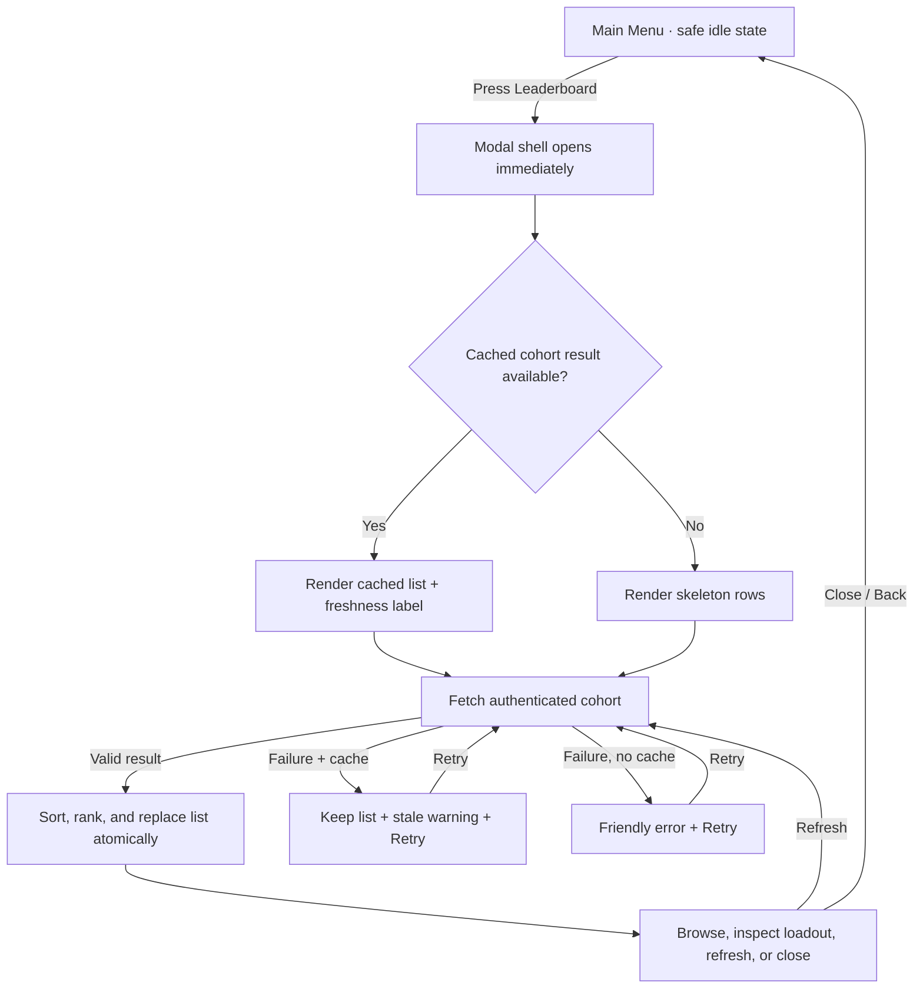
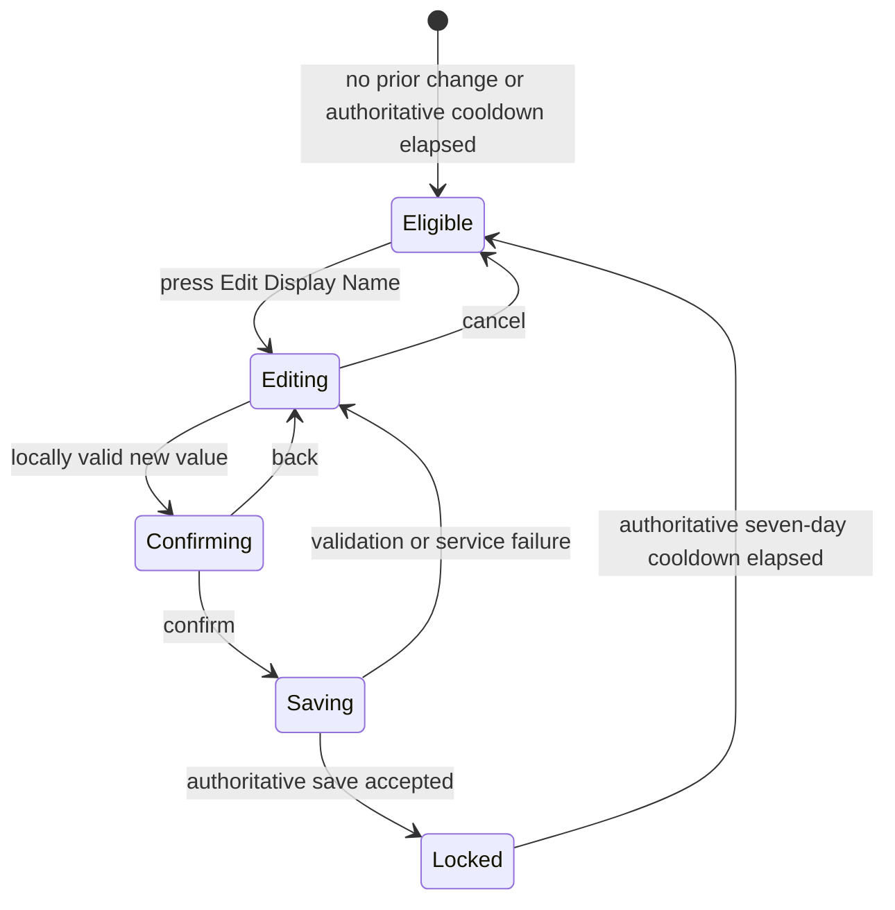

# Design Spec: Grade-Filtered Leaderboard and Profile Analytics

## 1. Player Goal and Context

The leaderboard is a friendly social showoff feature. A student should feel that comparison is relevant and fair because every visible peer belongs to the same grade cohort. The interface must explain rank through visible progress, keep the student's own standing easy to find, and celebrate the leaders without making lower placement feel like failure.

The Profile Analytics panel is private self-reflection. It should turn saved data into understandable progress, not expose hidden placement machinery or resemble a punitive report card. Public progression/ownership and private educational performance remain visibly and structurally separate.

Primary platform is Unity WebGL with mobile compatibility. Desktop uses a wide modal with a left first-place showcase; narrow/mobile layouts move that showcase above the list and preserve large tap targets and readable charts.

## 2. Experience Principles

| Principle | Design requirement |
| --- | --- |
| Fair cohort | The authenticated Firestore level fixes the visible grade; the student cannot switch to or request another cohort. |
| Explainable rank | The modal states `Best Stage first, then total Rank Currency`; each row exposes both values. |
| Supportive comparison | Use `YOUR STANDING`, `YOU`, and progress language; never use loss, failure, or bottom-rank ridicule. |
| Public/private boundary | Public rows contain only approved progression and loadout data. Educational analytics are owner-only. |
| Honest freshness | Show loading, last-updated, refreshing, stale, empty, and retry states; never pretend cached data is live. |
| Stable presentation | One accepted refresh replaces the list atomically; rows do not visibly shuffle while partial data arrives. |

## 3. Cohort, Scoring, and Rank Rules

### 3.1 Cohort Mapping

| Authenticated document | Student cohort | Leaderboard label |
| --- | --- | --- |
| `level1` | Grade 4 | `GRADE 4 · LEVEL 1` |
| `level2` | Grade 5 | `GRADE 5 · LEVEL 2` |
| `level3` | Grade 6 | `GRADE 6 · LEVEL 3` |

- No grade tabs are shown because the student may access only their own cohort.
- The grade label is a locked context badge, not a selector.
- A missing or unsupported cohort fails closed with `We couldn't identify your class leaderboard. Return to sign in and try again.`

> [!NOTE]
> The project owner approved this Grade 4-6 mapping on 2026-08-11, and the GDD now records it.

### 3.2 Ranking Tuple

```text
primary:   highestStage descending
secondary: (silver × 5) + (gold × 7) + (diamond × 10) descending
tie group: equal primary and secondary values share the same displayed rank
row order within a tie: displayName ascending, then stable public player ID ascending
```

- Power Coins do not contribute.
- Weights are Silver ×5, Gold ×7, and Diamond ×10, matching the GDD's established `0.5 / 0.7 / 1.0` relative values while keeping the leaderboard score integral.
- Weights affect leaderboard order only; they never convert, spend, or alter wallet balances.
- Shared competition ranking is used: `1, 1, 3`, not `1, 2, 3`, for an exact score tie.
- The alphabetical/public-ID fields stabilize presentation only; they do not break a score tie or change the displayed rank.
- Negative/overflowing/invalid values invalidate that entry rather than creating an impossible rank.
- The header explicitly states `Best Stage first, then weighted Rank Currency` and the info panel explains the three weights.

**Source-backed values:** The GDD run-reward formula already values Silver/Gold/Diamond at `0.5 / 0.7 / 1.0`; multiplying by ten produces the exact leaderboard ratio `5 / 7 / 10` without decimals.  
**Human E2E test:** Prepare equal-Best-Stage accounts with contrasting Silver/Gold/Diamond balances and confirm Diamond progress has the intended advantage without making sustained Silver/Gold progress irrelevant.  
**Adjustment:** If the relative values need balance changes, update the shared GDD currency-value policy first so leaderboard and economy meanings do not silently diverge.

**ASSUMPTION:** The phrase `highest stage` means the persistent historical `highestStage`, not the resettable `currentStage`.  
**IMPACT:** Death/Rebirth does not erase earned leaderboard standing, and the row must show `Current` plus `Best` Stage for clarity.  
**IF WRONG:** Ranking changes to `currentStage`; the rest of the presentation and tie rules remain valid.  
**VALIDATE:** Approve historical Best Stage or request current-run Stage before architecture begins.

## 4. Leaderboard Interaction Flow



### Entry and Exit Rules

- The Leaderboard button is enabled only in a safe Main Menu state with no committed question/video/countdown/result transition covering the screen.
- Pressing the enabled button acknowledges input immediately and blocks combat actions behind the modal.
- `Close`, Escape, Android/browser Back, or the explicit back control returns to Main Menu without changing game state.
- Outside-click does not close the modal; this prevents accidental dismissal during scrolling.
- Repeated open/refresh presses coalesce into one request and cannot create duplicate overlays or concurrent list replacements.

## 5. Leaderboard Layout

### 5.1 Wide WebGL Layout

```text
┌────────────────────── LEADERBOARD · GRADE 4 / LEVEL 1 ──────────────────────┐
│ Best Stage, then weighted Rank Currency                Updated 12:42  ↻  X │
├───────────────────────┬─────────────────────────────────────────────────────┤
│  FIRST-PLACE THRONE   │ YOUR STANDING · YOU                                │
│  Avatar + name        │ #24  Name  Current 68 · Best 91  S/G/D  Pet Weapon │
│  Pet     Weapon       ├─────────────────────────────────────────────────────┤
│  Best Stage + medals  │ #1   spacious VIP row                              │
│                       │ #2   spacious VIP row                              │
│                       │ #3   spacious VIP row                              │
│                       │ #4…  virtualized scroll rows                       │
└───────────────────────┴─────────────────────────────────────────────────────┘
```

### 5.2 Narrow/Mobile Layout

- The first-place showcase becomes a compact hero card above `YOUR STANDING`.
- Row content wraps into two lines: identity/Stage on the first, currencies/loadout tiles on the second.
- Pet and weapon remain two distinct square tiles with icon plus accessible label/tooltip.
- Horizontal scrolling is not required for core information.

### 5.3 Row Anatomy

Every row contains:

1. Displayed rank badge.
2. Public avatar/icon and `displayName`.
3. `Current Stage` and a smaller `Best Stage` ranking value.
4. Silver, Gold, and Diamond balances as three icon/value pairs.
5. Equipped pet and weapon as a two-cell loadout grid.
6. `YOU` label and green outline/fill treatment when the entry is the signed-in student.
7. Total Damage including overkill, placed on the secondary row so ranking inputs remain visually dominant.

The login username is never displayed. If a content asset is missing, show a labeled neutral silhouette; never print raw asset IDs as the polished fallback.

### 5.4 VIP and Throne Treatment

- Rank 1 uses the requested Diamond VIP banner, crown/throne motif, and restrained cyan-white shimmer.
- Rank 2 uses the requested Gold VIP banner.
- Rank 3 uses the requested Silver VIP banner.
- Badge number, crown/medal silhouette, and label remain present so VIP state is not color-only.
- If first place is tied, all tied rank-1 list rows receive rank-1 treatment; the throne chooses the first deterministic row and labels the score tie.
- The self row remains green even in the top three, using a green outer edge plus the VIP inner banner so neither meaning is lost.

### 5.5 Pinned Self Standing

- `YOUR STANDING` is always pinned above the scroll list after a valid result.
- The student also remains in the correctly sorted list; the in-list row repeats the green `YOU` treatment.
- Selecting `Jump to my row` scrolls to the in-list occurrence when it is off-screen.
- If the student's public projection is temporarily missing, show the current private snapshot only as `Rank updating…`; do not invent a rank.

## 6. Refresh and Update Behavior

| Trigger | Behavior |
| --- | --- |
| First open | Fetch the authenticated cohort; show skeletons if no valid cache exists. |
| Reopen | Render valid cached data immediately, then perform the single fetch caused by opening. |
| Manual refresh | Disable only the refresh control, keep the current list readable, and replace atomically on success. |
| While open | Perform no timer, polling, local-update, or background refresh after the open-triggered fetch. |
| Transient failure | Keep the last valid result, show `Showing saved standings`, timestamp, and Retry. |
| Invalid response | Reject the new payload, retain the last valid result, and show a recoverable data warning. |
| Session/cohort change | Close and clear leaderboard cache; require the new authenticated cohort. |

The only network triggers are opening the leaderboard and explicitly pressing Refresh. Repeated Refresh presses while a request is active coalesce into that request; no queued duplicate fetch starts afterward.

**Human E2E test:** Keep the leaderboard open after its initial fetch and verify no periodic request occurs. Change a peer's data and confirm it remains unchanged until the student presses Refresh, then updates atomically.

## 7. Empty, Error, and Boundary States

| State | Player-facing result |
| --- | --- |
| Only one student | First-place showcase plus `You're the first explorer in this grade.` |
| No public entries | `No standings yet for your grade.` plus Retry; never show another grade. |
| Missing loadout | Neutral `No pet equipped` / `No weapon equipped` tiles. |
| Very long name | Two-line clamp with full accessible label; rank/currency cells never disappear. |
| Exact score tie | Shared displayed rank and `Tied` tooltip; deterministic visual order. |
| Self outside loaded page | Pinned self row remains visible with authoritative rank or `Rank updating…`. |
| Offline after prior load | Stale list remains usable and clearly timestamped. |
| Offline without cache | Error illustration, concise reason, Retry, and Close. |
| Refresh during close | Result is ignored by the closed view and may update cache only for the same session/cohort. |
| Death/Rebirth | Current Stage can reset while Best Stage/rank persists; row explains both. |

## 8. Profile Analytics Interaction and Layout

Selecting the existing `ProfilePanel` expands a private modal. It uses a warm parchment/gold frame inspired by reference image 3, with dark ink-like chart lines and rank accent colors. The panel is owner-only; there is no path from a leaderboard row into educational analytics.

### 8.1 Layout

```text
┌────────────────────────────── MY PROFILE ──────────────────────────────────┐
│ Avatar  Display Name      Grade 4 · Level 1      Rank Silver      Close   │
│ Leaderboard #24          Prestige/Honor 3        First Stage 200: date/—  │
├───────────────────────────────┬────────────────────────────────────────────┤
│ ADVENTURE                    │ LEARNING TREND                             │
│ Current / Best Stage         │ metric selector + time-series chart         │
│ Total Damage                 │ honest no-data / partial-data states         │
│ Total Play Time              ├────────────────────────────────────────────┤
│ Registration Date            │ PERFORMANCE BY RANK                         │
├───────────────────────────────┤ Silver / Gold / Diamond bars                │
│ WALLET & LOADOUT             ├────────────────────────────────────────────┤
│ Silver · Gold · Diamond      │ QUESTION INSIGHTS / RECENT HISTORY           │
│ Power Coins                  │ outcomes, response metrics, cycles, changes  │
│ Avatar · Pet · Weapon        │                                              │
└───────────────────────────────┴────────────────────────────────────────────┘
```

On narrow/mobile screens these sections become a single vertical scroll in the same information order.

### 8.2 Profile Sections and Fields

| Section | Student-visible fields | Visualization |
| --- | --- | --- |
| Identity | Avatar, display name, grade/level, active Rank, leaderboard standing | Framed identity card |
| Adventure | Current Stage, Best Stage, Prestige/Honor, first Stage 200 date, total damage including overkill | Milestone path/summary cards |
| Economy | Silver, Gold, Diamond, Power Coins | Four icon/value cards; no comparative graph |
| Loadout | Equipped avatar, pet, weapon | Three catalog-resolved tiles |
| Activity | Registration date, total play time, total questions cleared | Compact lifetime summary |
| Outcomes | Correct, incorrect, timeout, abandoned; overall/by Rank/by question | Stacked bars or donut with numeric labels |
| Response | Mean/median response score, duration, and approved `correct ? responseScore × 10 : 0` efficiency | Metric cards plus selectable time-series trend |
| Rank history | Date/time and `Silver → Gold` style changes; no hidden trigger score | Respectful chronological timeline |
| Question cycles | Completed cycles and per-Rank cycle progress/history | Three progress strips plus history summary |

### 8.3 Display Name Editing

The Identity card includes `Edit Display Name` when the owner is eligible.



- The first accepted Display Name change is available immediately.
- Every accepted change starts a seven-full-day (`168` hour) cooldown from the authoritative accepted timestamp.
- The confirmation screen previews the exact public name and warns: `You can change this again on {localized date/time}.`
- A rejected, failed, cancelled, duplicate, or normalized no-op request does not start or extend the cooldown.
- The device clock, logout/login, reinstall, browser refresh, and scene reload cannot shorten the cooldown.
- After an accepted save, Profile Analytics updates immediately. The leaderboard shows the new name on its next open or manual Refresh; it does not start an automatic fetch.
- Display Names are not required to be unique; stable public player ID—not the name—owns self matching and ties.
- The login username is never prefilled, disclosed, or changed by this feature.
- Authority validates length, allowed Unicode, whitespace/control characters, and prohibited content before accepting the public name.

**Starting value:** 3–20 visible grapheme clusters after trimming and normalization, supporting Thai and English.  
**Human E2E test:** Validate short/long Thai and English names, mixed scripts, emoji, spaces, control/markup input, prohibited content, exact no-op, service failure, accepted save, and the full locked presentation.  
**Adjustment:** Widen the upper bound only if legitimate names are frequently rejected and the leaderboard/mobile row remains readable; tighten permitted content if it enables impersonation, layout abuse, or unsafe public text.

### 8.4 Educational Language

- Use `Correct`, `Try again`, `Timed out`, and `Not completed`; do not label the child `weak`, `slow`, or `failing`.
- Chart tooltips explain the metric in one sentence and always include the exact number represented.
- Accuracy and speed are separate; fast incorrect answers are not presented as improvement.
- If too little data exists for a mean/median/trend, show `Complete more questions to see this insight` rather than zero.
- Rank demotions appear as `Questions adjusted to your current level`, matching the approved non-punitive Rank design.

### 8.5 Hidden Audit Boundary

The approved audit design states that live audit score and position never enter normal player view models, labels, tooltips, accessibility text, or logs. Therefore:

- The student ProfilePanel does not show current audit score/count, mean audit score, median audit score, thresholds, or a countdown to Rank evaluation.
- Rank-change history may show the old/new Rank and date, but not the hidden audit total that triggered it.
- Mean/median audit analytics from the GDD are reserved for a future authenticated education view.

> [!NOTE]
> The project owner approved this student/education-view boundary on 2026-08-11.

## 9. Conceptual Data Contract

This section defines player-facing information needs, not a Firestore schema or approved architecture.

### 9.1 Public Leaderboard Projection

| Field | Purpose | Visibility |
| --- | --- | --- |
| Stable public player ID | Self matching and deterministic ordering | Public within cohort; not a credential |
| Level/cohort ID | Enforce Grade 4/5/6 partition | Public within cohort |
| Mutable Display Name + icon/avatar ID | Row identity | Public within cohort |
| Current Stage + Highest Stage | Current state and primary ranking explanation | Public within cohort |
| Silver/Gold/Diamond balances | Row display and secondary ranking | Public within cohort |
| Derived weighted Rank Currency score | Sorting/validation | Public within cohort |
| Total damage including overkill | GDD public progression/profile detail | Public within cohort or detail view |
| Equipped pet + weapon IDs | Two-tile loadout display | Public within cohort |
| Projection revision + updated timestamp | Atomic replacement and freshness | Public within cohort |

Credential username, password, registration date, play time, raw attempts, response history, question history, audit data, and private analytics are forbidden from this projection.

### 9.2 Private Owner Analytics Projection

| Group | Required information |
| --- | --- |
| Identity editing | Current Display Name, last accepted change timestamp, next eligible timestamp, validation result |
| Lifetime | Registration date, total play time, current/best Stage, Prestige/Honor, first Stage 200 timestamp, total damage |
| Economy/ownership | Four balances, equipped loadout, owned item references as needed by the profile |
| Outcome aggregates | Total questions, result counts overall/by Rank/by question |
| Response aggregates | Count, sum/distribution support for mean and median score/duration/efficiency |
| Time series | Bounded daily/session buckets for honest trend charts |
| History | Rank changes and question-cycle summaries; raw audit trigger values excluded from student projection |
| Freshness | Analytics revision and last-updated timestamp |

### 9.3 Update Invariants

- One accepted attempt ID contributes to totals, currency, damage, histories, and ranking inputs at most once.
- Void content/system failures contribute to none of those analytics.
- Incorrect, timeout, and abandoned outcomes count as resolved outcomes but grant zero currency and damage.
- Overkill remains included in the cumulative damage field, matching the GDD.
- Mean/median values are derived from authoritative accepted data; the client never uploads a precomputed `rank` or trusted average.
- Weighted leaderboard score is derived from authoritative balances and configured weights; the client never uploads a trusted score.
- An accepted Display Name change and its next-eligible timestamp persist together under one idempotent authoritative mutation.
- Public projection and private analytics may refresh at different times, but each includes revision/freshness information and never partially renders mixed revisions as one result.

## 10. Privacy and Access Matrix

| Data | Self Profile | Same-cohort leaderboard | Other player's public profile | Authorized education view |
| --- | :---: | :---: | :---: | :---: |
| Display name/avatar | Yes | Yes | Yes | Yes |
| Current/Best Stage | Yes | Yes | Yes | Yes |
| Rank Currency totals | Yes | Yes | Yes | Yes |
| Equipped pet/weapon/avatar | Yes | Yes | Yes | Yes |
| Prestige/Honor | Yes | No in row | Yes | Yes |
| Total damage | Yes | Optional row/detail | Yes | Yes |
| First Stage 200 | Yes | No in row | Yes | Yes |
| Registration date/play time | Yes | No | No | Yes |
| Response/question history | Yes | No | No | Yes |
| Correctness/efficiency analytics | Yes | No | No | Yes |
| Current audit score/count | No | No | No | Authority only |
| Mean/median audit score | No | No | No | Yes |
| Login username/password | Never | Never | Never | Never through game UI |

## 11. Feedback and Juice Specification

| Trigger | Visual feedback | Audio feedback | Starting timing |
| --- | --- | --- | --- |
| Open modal | Background dims; card scales/fades into stable frame | Soft parchment/gold reveal | 180 ms |
| Refresh pressed | Refresh glyph rotates; timestamp changes to `Refreshing…` | Light tick | Immediate acknowledgment |
| Refresh success | Rows crossfade as one list; changed self rank briefly pulses | Quiet confirm chime | 180 ms crossfade |
| Rank 1 reveal | Throne glow and one restrained shimmer | Short celebratory flourish | 450 ms, once per open |
| Jump to self | Self row scroll target receives green outline pulse | Soft locator ping | 350 ms |
| Refresh failure | Non-destructive warning strip; existing list remains | Muted warning cue | Immediate after failure |
| Profile metric change | Changed card uses restrained up/down-neutral transition | None for routine values | 250 ms |

- No screen shake, camera zoom, hitstop, or haptics: these are information panels, and stability/readability outrank spectacle.
- Reduced-motion mode removes scale, shimmer, pulsing, and animated scrolling; state changes remain clear through text/icons.
- Repeated refreshes do not replay celebratory audio or stack animations.

**Starting values:** All timings above are tuning starts, not standards.  
**Human E2E test:** On desktop and a narrow mobile viewport, a player should identify the opened/refreshing/success/error state without reading debug logs; animation must not delay interaction or obscure numbers.  
**Adjustment:** Shorten or remove transitions if interaction feels delayed; reduce shimmer/pulse contrast or frequency if it distracts from row scanning.

## 12. Accessibility and Localization

- Rank, VIP, self, success, stale, and error states use icon/shape/text in addition to color.
- Text and currency values maintain readable contrast over dark leaderboard rows and parchment profile panels.
- Focus is trapped inside the open modal, starts on the heading/close control, and returns to the invoking control on close.
- Scroll lists and charts are keyboard/touch accessible; chart insights have equivalent text summaries.
- Touch targets remain comfortably tappable on mobile and do not depend on hover.
- Large currency/damage values use locale-aware separators; full precise values remain available.
- Long Thai/English display names wrap or clamp without covering Stage/currency values.
- Decorative avatar/pet/weapon art does not replace accessible item names.

## 13. Five-Component Evaluation

| Component | Strength | Acceptance condition |
| --- | --- | --- |
| Clarity | Cohort badge, ranking explanation, visible Best Stage/currency, freshness states | A new observer correctly explains cohort and the top two sort keys in 8 of 10 checks. |
| Motivation | Same-grade comparison, persistent Best Stage, loadout showoff, personal trend | Students voluntarily reopen the panel and can name one next personal goal without being prompted. |
| Response | Immediate modal shell, non-blocking cached display, coalesced refresh, predictable close | Every valid press acknowledges immediately; spam never duplicates modal/list state. |
| Satisfaction | VIP hierarchy, throne showcase, green self locator, restrained audio/animation | Top-three and self states are recognizable without reading color names. |
| Fit | Fantasy parchment/gold profile plus RPG loadout leaderboard, while educational metrics remain supportive | The feature feels part of PowerMath and not like a generic school spreadsheet. |

## 14. Risks and Abuse Cases

| Risk/abuse | Required mitigation |
| --- | --- |
| Student forces another level query | Cohort comes from authenticated session; reject client-selected level IDs. |
| Raw grade document leaks passwords/private analytics | Use a public-safe projection; never feed raw peer maps into leaderboard presentation. |
| Client submits inflated Stage/currency/rank | Authority derives accepted updates; rank is read-only and calculated from trusted fields. |
| Duplicate attempt inflates analytics | Idempotent attempt ID updates all affected aggregates at most once. |
| Tie feels arbitrary | Shared displayed rank; alphabetical/public-ID ordering is disclosed as presentation-only. |
| Rebirth makes rank inexplicable | Rank on Best Stage, show both Current and Best Stage. |
| Missing self row feels exclusionary | Pinned `Rank updating…` state from private snapshot; never fabricate a placement. |
| Analytics discourages a student | Supportive copy, private scope, accuracy/speed separation, no public education score. |
| Charts lie with sparse data | Minimum-data empty state and exact numeric summaries; no invented zero baseline. |
| Shared Firestore document grows beyond safe limits | Architecture phase must choose a scalable public/private storage boundary before implementation. |
| Repeated Refresh causes excessive reads | Coalesce presses while a request is active; architecture may enforce an authority-side request limit without adding polling. |
| Display Name spam or cooldown bypass | Authoritative accepted timestamp, seven-day lock, idempotent save, and no reliance on the device clock. |
| Unsafe or layout-breaking Display Name | Authority-owned validation, prohibited-content policy, Unicode-aware length, and escaped text rendering. |
| Duplicate Display Names cause mistaken identity | Stable public player ID owns identity/self matching; name is presentation only. |

## 15. Human E2E Acceptance Scenarios

No automated test scripts are part of this slice. The project owner can validate these scenarios manually after implementation.

### Cohort and Privacy

1. Sign in as one account from each level and verify only the matching Grade 4/5/6 board appears.
2. Attempt to manipulate the requested level and verify no cross-grade rows are shown.
3. Inspect every public row and error/log surface; verify no credential, registration, play-time, question, response, or audit data appears.

### Sorting and Self

1. Prepare peers that differ by Best Stage and verify Best Stage wins regardless of currency.
2. Prepare equal Best Stage with different balances and verify `Silver ×5 + Gold ×7 + Diamond ×10` determines order.
3. Prepare an exact score tie and verify shared rank plus stable row order.
4. Verify the student is pinned above the list and green-highlighted in the sorted list.
5. Verify Diamond/Gold/Silver VIP banners for ranks 1/2/3 and the first-place throne loadout.

### Refresh and Recovery

1. Open with no cache, with cache, offline with cache, and offline without cache.
2. Change Stage/currency/loadout for a peer, refresh, and confirm one atomic reorder with no duplicate rows.
3. Spam Open/Refresh/Close and confirm no overlapping requests corrupt the modal or session.
4. Rebirth the current player and verify Current Stage resets while Best Stage and the approved ranking remain explainable.
5. Keep the modal open after its initial fetch and verify no timer, local update, or background polling performs another read.

### Profile Analytics

1. Verify all approved lifetime, progression, economy, loadout, outcome, response, Rank-history, and cycle fields against authoritative saved values.
2. Verify sparse/missing data produces an honest no-data message, not misleading zeroes.
3. Verify current audit score/count and trigger thresholds are absent from visible text, tooltips, accessibility labels, and player logs.
4. Verify desktop and narrow/mobile layouts remain readable in Thai and English with long names and large values.
5. Change Display Name, confirm immediate Profile update, confirm leaderboard changes only after open/manual Refresh, and verify the next edit remains locked until the authoritative seven-day date.
6. Test failed, duplicate, no-op, device-clock, logout/login, refresh, and reconnect rename attempts; none may bypass or incorrectly start the cooldown.

### Readability Pass Targets

- An observer identifies the student's grade cohort, ranking key, and self row correctly in at least 8 of 10 observations.
- A student identifies whether analytics are current, stale, loading, or unavailable correctly in at least 8 of 10 observations.
- If either target fails, adjust labeling/hierarchy before animation, color, or reward spectacle.

## 16. Implementation Sequence After Design Approval

1. Use the approved GDD cohort, weighted score, audit visibility, manual-refresh, and Display Name cooldown decisions.
2. Produce an architecture plan for public/private projections, authority, persistence, weighted query/rank calculation, Display Name mutation/cooldown, caching, and UI ownership.
3. Stop for architecture plus Firestore schema/rules/index approval.
4. Implement data capture/projections before charts so every visual has trustworthy inputs.
5. Implement leaderboard shell/states, sorting/rank, self pinning, responsive row/throne presentation, and catalog asset resolution.
6. Implement private ProfilePanel sections and accessible chart/text summaries.
7. Perform self-review and hand the build to the project owner for the manual E2E scenarios above.
8. Fix E2E findings, then stop for PR review/merge approval.

## 17. Human Design Checkpoint — Approved

Approved decisions:

1. Grade 4/5/6 locked cohort mapping and removal of grade tabs.
2. Best Stage, then GDD-aligned weighted `Silver ×5 + Gold ×7 + Diamond ×10` ranking with shared ties.
3. Mutable public `displayName` only, seven-day authoritative edit cooldown, dual Current/Best Stage row, pinned self duplication, requested VIP order, and responsive throne layout.
4. Public-safe leaderboard projection separate from credentials/private analytics.
5. Private Profile Analytics sections, charts, and supportive language.
6. Hidden student audit boundary with audit means/medians reserved for authorized education views.
7. Fetch on open and explicit manual Refresh only, with no automatic while-open refresh.
8. Restrained motion/audio direction and labeled starting tuning values.

Approved by the project owner on 2026-08-11 (`LGTM`) with weighted currency, seven-day Display Name editing, and manual-only refresh amendments. Architecture may proceed; implementation still requires architecture plus Firestore schema/rules/index approval.
