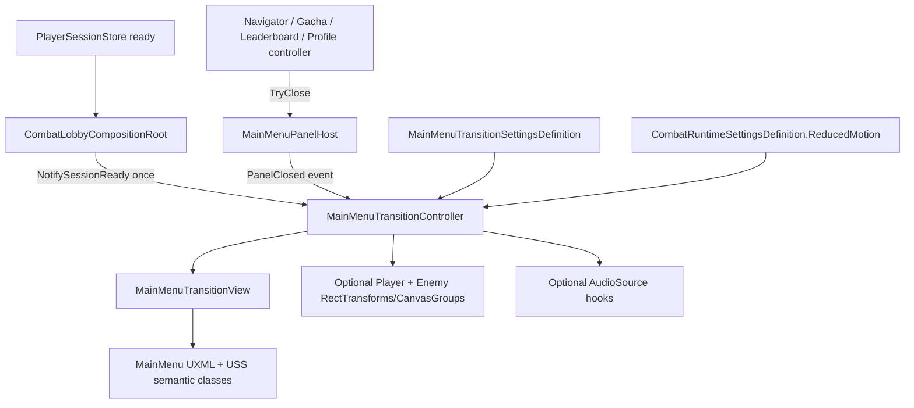
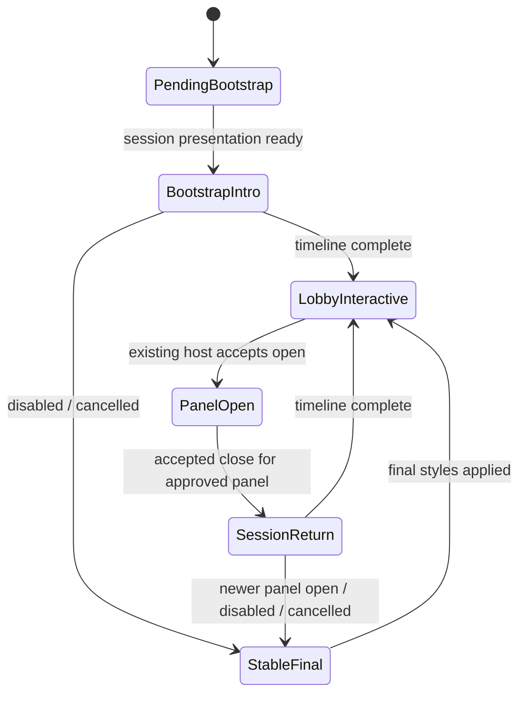

# Architecture Plan: Main Menu Tween Transitions

> Approved by the project owner on 2026-08-27 (`lgtm`), including use of a temporary original non-canon Player placeholder for the first visual pass.

## 1. Current State and Target State

### Current implementation

- `MainMenuScene` uses one UI Toolkit `UIDocument` for all HUD and panels plus a screen-space Canvas for the biome background and Enemy image.
- `MainMenuPresenter.Awake` ensures the scene-scoped `MainMenuPanelHostProvider`, combat composition root, and social composition root exist.
- `CombatLobbyCompositionRoot` binds the combat view after session readiness and currently resolves the Canvas `bg` and `monsterPrefab` images.
- `MainMenuPanelHost` synchronously shows/hides one panel and restores focus. It has no close notification for presentation observers.
- Leaderboard, Pet Gacha, Profile Analytics, and Navigator all close through `IMainMenuPanelHost.TryClose`.
- `CombatRuntimeSettingsDefinition.ReducedMotion` is already the Main Menu accessibility source used by combat and Pet Gacha presentation.
- Main Menu UXML has stable named targets for Profile, Navigator, Player Menu, encounter/Stage, and Player Dashboard.
- The Canvas currently has no separate Player sprite. The existing background does not contain one, and unrelated/copyrighted images must not be repurposed as player art.

### Target architecture

Add one scene-scoped, presentation-only transition feature. `MainMenuTransitionController` coordinates an immutable timing definition, a UI Toolkit transition view, optional Canvas Player/Enemy art targets, and the existing audio source. It starts bootstrap only after combat/session presentation is ready and starts session-return only after the panel host reports an accepted close for one of the four approved reference panels.

No tween owns gameplay or panel eligibility. No package is added. Every cancellation path applies the authored final layout before restoring input/focus.

## 2. System Diagram



## 3. Presentation State Machine



Rules:

- Bootstrap is one-shot per `MainMenuScene` component lifetime.
- Session-return is triggered only for `WorldMap`, `PetGacha`, `Leaderboard`, and `ProfileAnalytics`.
- `ForceCloseAll` never emits a session-return event; it remains lifecycle/terminal-flow cleanup.
- A generation token invalidates older scheduled callbacks/coroutines.
- `OnDisable` stops routines, cancels scheduled items, unsubscribes events, applies stable final styles, and clears presentation input lock.

## 4. Interface Definitions

The signatures below are the required responsibility boundaries; implementation may use equivalent naming while preserving behavior.

```csharp
public interface IMainMenuPanelHost
{
    MainMenuPanelId OpenPanel { get; }
    event Action<MainMenuPanelId> PanelClosed;

    bool TryOpen(MainMenuPanelId panelId, VisualElement panelRoot, Focusable opener);
    bool TryClose(MainMenuPanelId panelId, Focusable fallbackFocus);
    void ForceCloseAll();
}

public interface IMainMenuTransitionPlayer
{
    bool IsPlaying { get; }
    void NotifySessionReady();
    void PlaySessionReturn(MainMenuPanelId sourcePanel);
    void CancelAndApplyFinalState();
}
```

`PanelClosed` fires only after `TryClose` has hidden the accepted panel, cleared host identity, and restored its existing focus target. Subscribers cannot veto close or change authority behavior.

## 5. Class Responsibilities

| Class | Responsibility | Depends on | Owned state |
| --- | --- | --- | --- |
| `MainMenuTransitionController` | Orchestrate bootstrap/return timelines, presentation locks, Canvas art interpolation, cancellation, and audio hooks | `UIDocument`, panel host provider, transition view, settings, optional Canvas art/audio | Current presentation phase, one-shot bootstrap flag, generation token, active routine/scheduled handles |
| `MainMenuTransitionView` | Bind required named UI Toolkit elements and apply/remove semantic classes and picking state | Main Menu root | Cached element references only |
| `MainMenuTransitionSettingsDefinition` | Store tunable starting durations, offsets, easing selection, and optional audio clips | Unity `ScriptableObject` | Immutable serialized presentation settings |
| `MainMenuPanelHost` | Preserve one-panel visibility/focus behavior and publish accepted synchronous close completion | Existing panel elements/focus | Current panel and opener |
| `CombatLobbyCompositionRoot` | Notify transition controller once live or fallback combat presentation has rendered | Existing session/combat wiring | Existing lifecycle references only |
| `MainMenuPresenter` | Ensure the transition component exists for legacy scene compatibility if scene wiring is absent | Existing scene components | No transition state |

`MainMenuTransitionController` does not format player data, decide panel safety, invoke combat commands, or mutate the session store.

## 6. UI and Scene Composition

### UI Toolkit additions

`MainMenuUI.uxml` gains a top-level, non-data transition layer:

```text
main-menu-screen
  safe-area
    existing MainMenuShell
    existing CombatSurface
    existing panels
  main-menu-transition-layer
    main-menu-transition-cover
    battle-start-accent-left
    battle-start-accent-right
    battle-start-title
```

Existing named HUD elements are reused as transition targets; no duplicate Profile, Stage, Navigator, Player Menu, or Dashboard is created.

`MainMenuExperience.uss` gains semantic states:

- `.is-bootstrap-pending`
- `.is-bootstrap-active`
- `.is-session-returning`
- `.transition-top-enter`
- `.transition-player-menu-enter`
- `.transition-dashboard-enter`
- `.is-reduced-motion`

The controller removes transient inline translate/opacity values at completion so authored USS layout remains the sole final-position authority.

### Canvas scene art

- Enemy target: existing `monsterPrefab` `RectTransform` and `Image`.
- Player target: a new left-side `playerPresentation` Canvas `Image`, raycast disabled, with a separate approved sprite reference.
- First-pass content proposal: use a clearly labeled temporary, original neutral adventurer silhouette so the two-sided motion can be evaluated now. It is non-canon and must be replaceable through the serialized `Image.sprite` without code changes.
- If Player art is missing, the controller skips that target and completes the remaining timeline without delay or exception.
- Canvas art returns to cached authored anchored positions and alpha at every completion/cancellation.

Creating or accepting final/canon Player art remains a separate human content checkpoint.

## 7. Data and Event Flow

### Bootstrap

```text
Main Menu scene creates visual tree in pending classes
→ MainMenuPresenter/CombatLobbyCompositionRoot binds live session and encounter
→ CombatLobbyCompositionRoot.NotifySessionReady()
→ transition controller snapshots authored Canvas positions
→ presentation lock enabled
→ BATTLE START semantic classes/audio
→ cover fade + Player/Enemy Canvas interpolation
→ top HUD → Player Menu → Dashboard semantic classes
→ final authored styles applied
→ presentation lock removed
→ normal Main Menu input
```

### Session return

```text
existing feature controller requests close
→ MainMenuPanelHost validates identity
→ panel hidden, host identity cleared, focus restored
→ PanelClosed(panelId)
→ controller filters approved source panel
→ short presentation lock
→ top HUD → Player Menu → Dashboard
→ final styles + focus retained
→ presentation lock removed
```

## 8. Input and Focus Policy

- A full-screen transition blocker exists only while bootstrap/session-return targets are moving; it is removed deterministically at final state.
- The blocker consumes pointer input but is not focusable and never changes feature focus ownership.
- Keyboard navigation is disabled at the root during presentation lock and restored afterward without selecting a new target.
- Panel-host focus restoration occurs before session-return. The returned focus target remains selected and becomes actionable once motion ends.
- A newer accepted panel open during a return first calls `CancelAndApplyFinalState`, preventing a moving click target or stale blocker.
- Committed Rebirth/Gacha behavior is unchanged because feature controllers still decide whether close can be requested.

## 9. Timing and Motion Mechanics

- UI Toolkit motion uses semantic USS transitions and scheduled phase boundaries.
- Canvas Player/Enemy motion uses one unscaled-time coroutine owned by the scene controller; no permanent `Update()` loop is added.
- Easing functions are local deterministic math helpers, not a new tween library.
- `MainMenuTransitionSettingsDefinition` uses the approved design values as editable defaults.
- Frame spikes evaluate elapsed normalized time and apply the correct final sample; callbacks are not chained by frame count.
- Reduced motion uses the existing `CombatRuntimeSettingsDefinition.ReducedMotion` flag and skips Canvas translation/scale.

## 10. Authority Decisions

| Decision | Choice | Rationale |
| --- | --- | --- |
| Transition ownership | Scene-scoped controller | Presentation ends when Main Menu unloads and must not persist |
| Gameplay/session authority | Existing stores, presenters, and controllers | Tweening cannot affect Stage, encounter, HP, currency, or transactions |
| Close eligibility | Existing feature controller and panel host | Presentation observes accepted close; it never grants close |
| Close notification | Synchronous `PanelClosed` event after stable hidden state | Small, testable seam shared by all four requested panels |
| Final layout | Existing USS and Canvas authored positions | Avoid resolution-specific absolute end positions in animation code |
| Timing data | Dedicated `ScriptableObject` | Human tuning should not require code edits or pollute combat rules |
| Reduced motion | Existing runtime settings flag | Preserve one current Main Menu behavior source |
| Tween mechanism | UI Toolkit transitions + scheduler + one Canvas coroutine | No dependency/build-setting change; compatible with current architecture |
| Player art | Serialized optional Canvas `Image` | Art can change independently; missing art fails soft |
| Audio | Optional clips/source | Missing content must never block navigation |

## 11. Affected Files

### New

| File | Purpose |
| --- | --- |
| `Assets/Project/Script/UI/MainMenu/Transitions/MainMenuTransitionController.cs` | Scene lifecycle and timeline orchestration |
| `Assets/Project/Script/UI/MainMenu/Transitions/MainMenuTransitionView.cs` | Named-element binding and semantic style application |
| `Assets/Project/Script/UI/MainMenu/Transitions/MainMenuTransitionSettingsDefinition.cs` | Tunable presentation settings |
| `Assets/Project/Resources/MainMenuTransitionSettings.asset` | Approved starting values |
| `Assets/Project/Tests/EditMode/UI/MainMenuTransitionViewTests.cs` | Binding/final-state/reduced-motion checks |
| `Assets/Project/Tests/EditMode/CombatUnity/MainMenuPanelHostTransitionTests.cs` | Accepted-close event and force-close exclusion tests |
| `Assets/Project/Art/UI/MainMenu/PlayerPlaceholder.png` | Temporary original non-canon Player silhouette, only if approved at this checkpoint |

### Modify

| File | Planned change |
| --- | --- |
| `Assets/Project/UI/MainMenuUI.uxml` | Add transition cover/title/accent layer and initial pending state |
| `Assets/Project/UI/MainMenu/MainMenuShell.uxml` | Add transition grouping classes without changing binding names |
| `Assets/Project/UI/MainMenu/CombatSurface.uxml` | Add top/dashboard transition grouping classes without changing binding names |
| `Assets/Project/UI/MainMenu/MainMenuExperience.uss` | Add transition, input-lock, and reduced-motion rules |
| `Assets/Project/Script/Gameplay/Combat/Unity/MainMenuPanelHost.cs` | Add accepted `PanelClosed` notification; preserve synchronous visibility/focus behavior |
| `Assets/Project/Script/UI/MainMenu/CombatLobbyCompositionRoot.cs` | Notify bootstrap presentation readiness and provide reduced-motion setting |
| `Assets/Project/Script/UI/MainMenu/MainMenuPresenter.cs` | Legacy-safe transition component presence only if scene serialization is absent |
| `Assets/Project/Scenes/MainMenuScene.unity` | Wire transition component, Enemy target, optional Player target, and optional audio source |

No existing feature controller needs modification because all requested closes already use the shared panel host.

## 12. Validation Plan

### Automated

- `MainMenuPanelHost` fires one close event only for an accepted `TryClose`.
- Rejected close and `ForceCloseAll` fire no session-return event.
- Bootstrap readiness starts once even if notified repeatedly.
- Cancel/disable always clears input lock and restores final UI/Canvas state.
- Missing optional Player, Enemy, settings, or audio content fails soft.
- Reduced motion excludes translate/scale classes and still completes.
- UXML binding test verifies the cover, title, Profile, encounter card, Navigator, Player Menu, and Dashboard names exactly once.
- Existing Main Menu panel-host, combat, Gacha, leaderboard, and profile UI tests remain green.

### Unity verification

1. Compile until Editor reports `is_compiling == false`.
2. Read the Unity console for errors and warnings.
3. Run focused EditMode transition/binding tests, then the affected EditMode assembly.
4. Enter Main Menu from Authentication/Bootstrap and capture the sequence at 1920×1080.
5. Close each requested panel and verify order/focus.
6. Repeat at 30 FPS simulation, reduced motion, minimum window, 16:10, and ultrawide.
7. Stress twenty rapid close/open/back cycles and verify no parallel sequence or stranded blocker.

## 13. Failure and Recovery Matrix

| Failure | Required result |
| --- | --- |
| Session/combat initialization fails | Cover is removed; unavailable UI stays readable; no permanent input blocker |
| Required UXML transition element missing | Log one explicit error, apply stable final lobby state, leave gameplay usable |
| Player or Enemy art missing | Skip missing art target; HUD/cover sequence completes |
| Audio clip/source missing | Silent transition; no exception or timing change |
| Panel close rejected | No close event and no return sequence |
| Scene unload or component disable mid-animation | Cancel all work, restore final styles/positions, unsubscribe |
| Frame spike skips a phase boundary | Apply current elapsed phase or final state; never replay earlier beats |
| Another panel opens during return | Cancel return, restore stable HUD, then allow existing host behavior |
| Reduced-motion enabled | Crossfade only; same state and focus outcome |

## 14. ADR Assessment

No new ADR is required.

- The approved UI migration architecture already selects a presentation-only transition service, UI Toolkit scheduling/coroutines, reduced-motion behavior, and no new runtime dependency.
- ADR-004 already keeps combat authority outside presentation.
- This slice adds no persistence, network, build, framework, or dependency decision.

A new ADR becomes necessary only if implementation proposes a third-party tween library, persistent cross-scene transition state, a new UI framework, Addressables, or gameplay authority in the transition layer.

## 15. Human Architecture Checkpoint

Approval authorizes implementation of:

1. One scene-scoped transition controller plus a focused UI Toolkit view.
2. A post-close `PanelClosed` event on the existing host; `ForceCloseAll` stays silent.
3. UI Toolkit transitions for HUD/title and one unscaled coroutine for Canvas Player/Enemy art.
4. Existing reduced-motion flag, no third-party tween package, and no gameplay-state mutation.
5. Main Menu scene wiring for the existing Enemy target and an optional Player target.
6. A temporary original non-canon Player silhouette for the first visual pass; replacing it later requires no code change, while final/canon art still needs separate approval.
7. Focused automated tests plus Unity compile, console, EditMode, stress, and screenshot verification.

Architecture approved on 2026-08-27 (`lgtm`). Implementation is authorized; final/canon Player art remains a separate human content checkpoint.
