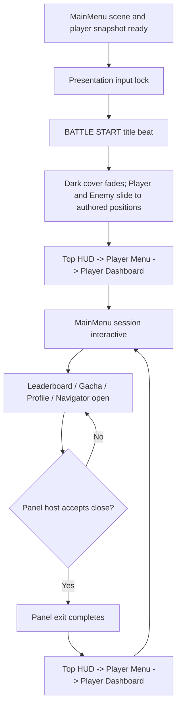

# Design Spec: Main Menu Tween Transitions

> Approved by the project owner on 2026-08-27 (`lgtm`). The timing values remain playtest starting values and may be tuned at the final human game-feel checkpoint.

## 1. Player Experience Description

### MainMenu Bootstrap

After authentication or another scene change, the player arrives on a darkened Main Menu. An original Math:World `BATTLE START` title punches into the center with a quick overshoot and a restrained streak/accent treatment. It clears promptly rather than becoming a cutscene.

The dark cover then recedes as the battle scene becomes visible. The Player enters from the left and the Enemy enters from the right with smooth deceleration, stopping cleanly at their authored scene positions. Once both silhouettes are readable, the normal Main Menu session assembles: the top Profile/Stage/Navigator group, the left Player Menu, and the bottom Player Dashboard. Control becomes available only when targets are stable.

The intended feeling is energetic, confident, and battle-ready—not a copy of Pokemon presentation. Shape, color, type, sound, and accents remain Math:World originals.

### MainMenu Session Return

Closing Leaderboard, Pet Gacha, Profile Analytics, or Navigator returns the player to the same battle context they left. The panel exits first. Then the top Profile/Stage/Navigator group settles into view, the Player Menu glides in from the left, and the Player Dashboard rises into place. The short stagger makes the screen feel composed without making repeated navigation sluggish.

Rebirth and other committed/authoritative flows retain their existing safe-close rules. The transition presents a state change; it never decides whether a panel may close.

## 2. Interaction Flow

## 3. Presentation State Contract

| State | Entry condition | Exit condition | Interrupt behavior | Player input |
| --- | --- | --- | --- | --- |
| `BootstrapIntro` | Main Menu visual tree and session data are ready for presentation | Full sequence or reduced-motion substitute completes | Scene disable/unload cancels and restores authored end styles | Lobby actions locked; Skip may be added only after separate approval |
| `LobbyInteractive` | No reference panel is open and all reveal targets are stable | Safe panel open or scene disable | New valid panel-open request wins immediately | Normal existing controls |
| `PanelOpen` | Existing panel host accepts open | Existing panel host accepts close | Transaction/committed rules remain authoritative | Existing panel rules |
| `SessionReturn` | Safe panel exit has completed | Dashboard settles at authored end state | A valid panel reopen cancels the reveal and restores stable HUD state before opening | Lobby actions locked until targets stop moving |
| `ReducedMotionReveal` | Motion reduction is enabled | Short opacity transition completes | Same cancellation and final-state guarantees | Same semantic lock, shorter duration |

No tween may survive `OnDisable`, scene unload, panel reopen, or a newer transition token. Cancellation always applies final authored styles before handing control to the next state.

## 4. Feedback Loops and Starting Values

All numbers below are **starting values** for human playtesting, not fixed standards.

### Bootstrap Timeline

| Beat | Visual | Audio hook | Starting timing | Test and adjustment |
| --- | --- | --- | ---: | --- |
| Cover | Full-screen dark cover; lobby targets pre-positioned but not interactive | Very short low battle swell | 0.05 s settle | Pass if no one-frame flash of final HUD is visible. If a flash appears, initialize hidden state before first layout. |
| `BATTLE START` entry | Opacity 0→1; scale 1.28→0.96→1.00; original angular accent/streak | One title impact layered over the swell | 0.22 s | Pass if 8/10 observers read the phrase without the motion feeling harsh. Reduce overshoot before increasing duration. |
| Title hold/exit | Brief readable hold, then opacity/scale exit | Short rising whoosh | 0.28 s hold + 0.16 s exit | Pass if total intro still feels replayable after five consecutive scene entries. Reduce hold in 0.05 s steps if it drags. |
| Scene reveal | Dark cover opacity 1→0 | Music/UI ambience opens; no extra hit required | 0.42 s | Pass if the background is readable before HUD detail competes. Shorten in 0.05 s steps if the scene feels blocked. |
| Character entrance | Player translates from left; Enemy from right; 0.06 s enemy stagger; ease-out with no bounce | One paired lateral whoosh, softly panned if supported | 0.52 s | Pass if 8/10 observers identify both sides and neither appears to float. Reduce travel distance before increasing speed. |
| Session reveal | Top group, Player Menu, then Player Dashboard with overlapping stagger | One light three-part UI flourish, or one composite cue | 0.58 s total | Pass if all primary actions are findable immediately after unlock. Reduce stagger before reducing individual easing quality. |

Target bootstrap duration from first stable layout to input unlock: approximately **2.1 seconds**, subject to the tests above.

### Session-Return Timeline

| Order | Group | Motion | Starting timing | Test and adjustment |
| ---: | --- | --- | ---: | --- |
| 1 | Profile, Stage/Encounter, Navigator | 18 px downward settle plus opacity 0→1 | 0.20 s | Pass if the battle context is the first readable information after close. Reduce translation if it looks like content reloaded. |
| 2 | Player Menu | Translate from 72 px left plus opacity 0→1, starting 0.10 s after top group | 0.24 s | Pass if the menu feels anchored to the left edge and does not overshoot its click targets. |
| 3 | Player Dashboard | Translate from 56 px below plus opacity 0→1, starting 0.10 s after Player Menu | 0.28 s | Pass if the dashboard has visual weight but repeated panel navigation remains responsive. Reduce travel in 8 px steps if it feels slow. |

Target return duration after panel exit: approximately **0.48 seconds** due to overlap. The existing 0.15-second panel-close target remains the outer-panel exit starting value.

### Easing Direction

- Title: restrained back-out/overshoot only on the title, not on interactive controls.
- Character and HUD entrances: cubic/quartic ease-out with zero end bounce.
- Opacity: smooth ease-out; no flash, blur dependency, or rapid luminance pulse.
- Exit/cancellation: faster ease-in or immediate authored end-state application when another valid state takes priority.

## 5. Juice Specification

### Visual Feedback

- Screen shake: none for the first pass; the menu is an information surface and readability takes priority.
- Particles: optional lightweight streak/spark accents behind `BATTLE START`; zero particles is an acceptable first slice.
- UI animation: opacity, translate, and scale only; all targets finish at their current authored USS layout.
- Camera: no camera movement or zoom.
- Layering: cover/title above scene art and lobby; reference panels remain above the lobby; decorative layers remain non-pickable.

### Audio Feedback

- Bootstrap: low swell, title impact, paired character whoosh, and a restrained completion flourish.
- Session return: one short soft UI flourish; avoid one loud sound per HUD group.
- Audio hooks must tolerate missing clips and never block state completion.
- Final audio assets remain a separate human content-approval checkpoint.

### Physical Feedback

- Haptics: none in the first pass. Mobile haptics require a separate platform/content decision.

### Reduced Motion

- Remove title overshoot, streak travel, character translation, and HUD translation.
- Use a 0.12-second title crossfade followed by a 0.12-second whole-lobby crossfade.
- Preserve the same state order and focus/input result.
- Do not use rapid flashes as a motion substitute.

## 6. Five-Component Evaluation

| Component | Design response | Acceptance signal |
| --- | --- | --- |
| Clarity | Battle text precedes the reveal; battle context appears before meta controls; all targets finish at their familiar authored positions | A new observer identifies “battle starting” and then points to Stage/Enemy before opening a panel in 8/10 trials |
| Motivation | The intro frames the lobby as an active encounter rather than a static dashboard | Players voluntarily wait through five entries without asking to skip in more than 2/10 trials |
| Response | Short, bounded locks; no moving click targets; cancellation tokens restore stable styles | Twenty rapid open/close/back attempts cause no duplicate action, stranded lock, invisible HUD, or focus loss |
| Satisfaction | Title impact plus sound, character reveal plus whoosh, and composed HUD stagger | Observers distinguish bootstrap entry from ordinary panel return without reading debug text |
| Fit | Original Math:World color/type/shape grammar; battle energy supports the boss-rush fantasy | Side-by-side capture matches the approved Main Menu art direction and does not read as copied Pokemon branding |

Priority when tuning remains Response, Clarity, Satisfaction, Fit, then Motivation.

## 7. Edge Cases

- A panel close rejected by the existing host plays no return reveal.
- Rebirth or another committed operation keeps its current lock/recovery behavior.
- Reopening a panel during `SessionReturn` cancels the return tween, restores stable HUD end styles, and opens only the accepted panel.
- Repeated Close/Back while closing is idempotent; it cannot start parallel sequences.
- Disabling the GameObject, scene unload, logout, or domain reload cancels every scheduled callback and restores safe end state.
- A missing Player/Enemy image skips that target without delaying the remaining timeline.
- A missing audio source/clip logs no gameplay-breaking error and does not extend the sequence.
- At low frame rate, elapsed time determines progress; the system jumps to the correct final state rather than replaying missed steps.
- Layout or resolution change during motion keeps authored USS end positions as the source of truth; pixel offsets are relative transition values only.
- Keyboard focus is restored after the sequence to the same target the existing panel host selects.
- Hidden compatibility elements and unavailable/disabled controls do not become visible through animation classes.

## 8. Playtest Scenarios

1. **New player:** enter from Authentication and ask what is happening, where the current Stage is, and which side is the Enemy. Pass when the sequence is correctly explained in 8/10 trials.
2. **Repeatability:** enter the Main Menu five times. Pass when no more than 2/10 users request an immediate skip and no participant calls the sequence sluggish.
3. **Stress:** spam Escape/Back and panel buttons during close/return for twenty cycles. Pass with one open panel maximum, no duplicate authoritative operation, stable focus, and no invisible input blocker.
4. **Readability:** record at 30 FPS and simulate frame spikes. Pass when the final layout and unlock state are identical to 60 FPS.
5. **Reduced motion:** complete bootstrap and all four panel-return paths with motion reduction enabled. Pass when state change remains obvious and no large translation/overshoot occurs.
6. **Missing feedback asset:** remove/clear optional audio and accent references. Pass when the visual state machine completes without exception.

## 9. GDD Alignment Check

- `@tag:core-loop`: the reveal ends on the existing live lobby encounter and does not delay or replace its information.
- `@tag:feedback`: bootstrap and return expose both visual and audio hooks.
- `@tag:player-experience`: moving targets stay locked until stable; clarity and response outrank spectacle.
- `@tag:guardrails`: transition state is presentation-only and cannot mutate Stage, encounter, HP, cooldown, session, or persistence.
- Primary GDD direction is Unity WebGL with mobile compatibility; current implementation validation begins on the active Windows Editor target and must avoid dependency or input assumptions that block WebGL/mobile.

## 10. Human Design Checkpoint

Approval authorizes architecture planning for the recommended direction:

- original Math:World `BATTLE START` punch-and-streak treatment;
- approximately 2.1-second bootstrap intro;
- approximately 0.48-second session-return reveal after panel exit;
- simultaneous Player/Enemy entrance with a slight Enemy stagger;
- no screen shake or camera motion;
- reduced-motion crossfade path;
- presentation-only input lock with cancellation and stable end-state guarantees.

Design/game-feel direction approved on 2026-08-27 (`lgtm`). Architecture approval remains required before implementation.
