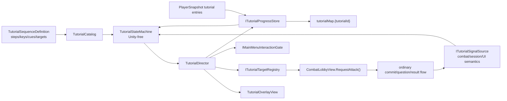

# Architecture Plan: State-Driven Localized Tutorial System

> Approved by the project owner with `lgtm` on 2026-09-14. Implementation completed on 2026-09-15 with the adjustments recorded in Section 17.

## 1. Decision Summary

Build a generic tutorial domain separated into four boundaries:

1. a Unity-free state engine that consumes semantic signals and emits presentation/interaction commands;
2. a ScriptableObject catalog that defines sequences without hardcoded presenter branches;
3. a tutorial progress store that maps the Firebase `tutorialMap` contract to client snapshots and idempotent commands;
4. a Main Menu overlay/focus adapter that uses the existing combat view and shared interaction gate.

Only an `OnFirstCreate` definition is authored now. Adding a later tutorial must require a new definition plus localization/content and any new semantic target adapter—not edits to the state engine.

## 2. Existing Constraints

- ADR-012 requires persisted semantic receipts and one shared scoped interaction gate.
- ADR-016 accepts the lightweight keyed localization catalog and states that protected production writes ultimately belong behind trusted commands.
- The current running persistence is a direct-Firestore prototype. It cannot honestly claim trusted server authority.
- Player schema version is currently V4; a tutorial-map client model requires a V5 migration.
- `CombatLobbyView.RequestAttack()` already routes enemy-actor input through the same `AttackRequested` event used by the Attack button.
- `CombatLobbyPresenter` owns answer/result safety and currently does not expose a stable post-presentation semantic event.

## 3. System Diagram



## 4. Persistence Contract

### 4.1 Firebase shape

```text
tutorialMap.OnFirstCreate = {
  version: 1,
  status: "Eligible" | "Queued" | "Active" | "Completed",
  currentStepId: "welcome-new",
  triggerRecordedAt: <server timestamp>,
  completedAt: <server timestamp or null>,
  rewardClaimed: false,
  lastTransactionId: "<stable operation/attempt id>",
  context: {
    legacyPlayer: false,
    guidedEncounterId: "...",
    firstAttemptOutcome: "Correct" | "Incorrect" | "Timeout" | "Abandoned"
  }
}
```

`context` extends the GDD minimum so reconnect can select truthful result copy after the combat receipt has been acknowledged. It stores semantic values only; no localization string, sprite, animation, focus rect, or scene reference is persisted.

### 4.2 Client representation

- Replace `PlayerSnapshot.tutorial` as the source of truth with `PlayerSnapshot.tutorialEntries: TutorialProgressData[]` (or a dedicated immutable wrapper) while mapping Firebase's dynamic map keys to `tutorialId` values.
- Keep the legacy `tutorial` fields readable for one migration version only. V5 migration converts a legacy completed checkpoint only when an explicit mapping exists; an empty/unknown checkpoint does not mark `OnFirstCreate` complete.
- Sort client entries by ordinal tutorial ID during mapping for deterministic tests. Never rely on dictionary enumeration for queue order.
- `PlayerDefaultsPlanner` creates the map container but does not pre-complete `OnFirstCreate`. Eligibility evaluation creates/queues the entry when character creation and safe-state rules are satisfied.
- Player reset intentionally resets the tutorial map only because the existing admin reset means full user-data reset; ordinary death/Rebirth never touches it.

### 4.3 Commands

Introduce `ITutorialProgressStore`:

```csharp
public interface ITutorialProgressStore
{
    bool IsServerAuthoritative { get; }
    void Apply(TutorialProgressCommand command,
        Action<TutorialProgressReceipt> succeeded,
        Action<string> failed);
    void Cancel();
}
```

`TutorialProgressCommand` contains tutorial ID, definition version, expected status/step, transition kind, expected player revision, stable operation ID, related gameplay transaction ID, and semantic context delta. The store must be idempotent by operation ID and compare expected revision/status/step before mutation.

- Editor sample: `ImmediateTutorialProgressStore`, deterministic and in memory.
- Current prototype: `DirectFirestoreTutorialProgressStore`, explicitly `IsServerAuthoritative == false`, using the existing patch/precondition conventions.
- Production target: a trusted implementation behind the same interface. Deployment and Firestore-rule changes remain a separate human checkpoint.

The UI never directly mutates `PlayerSnapshot`. On success it replaces/hydrates the authoritative snapshot through `PlayerSessionStore` and emits one `Changed` notification.

## 5. Tutorial Core

Create `Assets/Project/Script/Gameplay/Tutorial/Core/PowerMath.Gameplay.Tutorial.Core.asmdef` with no Unity reference.

| Type | Responsibility |
|---|---|
| `TutorialId` | Validated stable string identifier. |
| `TutorialStatus` | Eligible, Queued, Active, Completed. |
| `TutorialStep` | Immutable semantic step: kind, localization keys, emotion/cue IDs, target ID, wait predicate, branches. |
| `TutorialSequence` | Validated versioned graph with one start and valid terminal completion. |
| `TutorialProgress` | Durable semantic progress mapped from player data. |
| `TutorialSignal` | Session/combat/UI fact with transaction ID and immutable payload. |
| `TutorialStateMachine` | Pure reducer: `(sequence, progress, signal) -> transition`. |
| `TutorialSafeStatePolicy` | Rejects unsafe start/resume states. |
| `TutorialQueuePolicy` | Orders entries by recorded trigger time and allows one sequence per safe Lobby arrival. |
| `TutorialTransition` | Next progress plus presentation command and required persistence boundary. |
| `TutorialDefinitionValidator` | Rejects duplicate IDs, missing keys/targets, broken branches, cycles without waits, and unsupported versions. |

The reducer is generic. Outcome branches are selected by authored predicates such as `CombatAttemptPresented(outcome=Correct)`; no `switch (tutorialId)` is permitted.

## 6. Authored Unity Content

Create `Assets/Project/Script/Gameplay/Tutorial/Unity/PowerMath.Gameplay.Tutorial.Unity.asmdef`, referencing Tutorial Core, UI Core, Combat Unity, Localization, and Audio as needed.

| Type | Responsibility |
|---|---|
| `TutorialSequenceDefinition` | ScriptableObject serialization of metadata and step graph. |
| `TutorialPresentationProfileDefinition` | Scrim, focus, transition, audio cue, and Reduced Motion values. |
| `TutorialCatalogDefinition` | Ordered list of enabled sequences and validation entry point. |
| `TutorialDefinitionMapper` | Converts validated Unity assets to immutable Core models once at composition. |

Author assets under `Assets/Project/Resources/Tutorial/`:

- `TutorialCatalog.asset`
- `OnFirstCreate.asset`
- `TutorialPresentationProfile.asset`

All copy remains in `Assets/Project/Resources/Localization/UI.json`; definitions store keys only. Current Power sprites are asset references in the presentation profile, with a neutral fallback.

## 7. Runtime Orchestration

### `TutorialDirector`

- Scene-scoped coordinator created by `CombatLobbyCompositionRoot` after combat initialization succeeds.
- Subscribes to session/combat semantic signals; it has no `Update()` polling.
- Persists every durable transition before presenting the next input-bearing step.
- Owns one tutorial gate lease and one accepted-input token.
- Hides/minimizes presentation before forwarding a production action.
- On disable, unregisters callbacks, cancels presentation tweens, releases leases, and cancels the progress request without changing progress.

### `TutorialOverlayView`

- Binds required elements from a dedicated `TutorialOverlay.uxml` inserted into `MainMenuShell.uxml` above panels and below emergency/update overlays.
- Resolves speaker/body strings through `LocalizationService` on every render and on locale change.
- Uses `UiPanelLifecycle`/the existing motion driver; Reduced Motion is inherited from `UiMotionDriverProvider`.
- Does not own progression or invoke gameplay commands.

### `ITutorialTargetRegistry`

```csharp
public interface ITutorialTargetRegistry
{
    bool TryResolve(string targetId, out ITutorialTarget target);
}

public interface ITutorialTarget
{
    event Action Activated;
    bool IsAvailable { get; }
    TutorialFocusGeometry FocusGeometry { get; }
    bool TryInvokeProductionAction();
}
```

Adapters register semantic IDs such as `combat.enemy` and `combat.attack`. `combat.enemy` delegates to the existing actor tap / `CombatLobbyView.RequestAttack()` path. The focus layer compares the activated target ID with the current step before consuming input.

### Interaction lease policy

- Dialogue: block `InteractionScope.All`; overlay Advance is outside ordinary game scopes.
- Guided enemy action: block All, then permit only the target adapter through the overlay. The adapter does not temporarily unlock unrelated Lobby UI.
- Question/result wait: release the tutorial lease; existing combat leases own safety and overlay is hidden.
- Encounter-clear wait: no tutorial lease, so normal battle input remains available.
- Persisting a step: hold All until success or localized Retry/Reload recovery.

No new global singleton is introduced. `TutorialDirector` receives explicit collaborators from the Main Menu composition root.

## 8. Combat Signal Boundary

Add semantic events without exposing mutable engines:

| Signal | Emitted when | Payload |
|---|---|---|
| `LobbyStable` | combat initialized/recovered and readiness predicate is true | stage, encounter ID/kind, phase |
| `AttemptCommitted` | ordinary commit is accepted | presentation/attempt ID, encounter ID |
| `AttemptPresentationCompleted` | result feedback and its acknowledgement save succeed | attempt ID, encounter before/after, truthful outcome, enemy defeated, stage advanced |
| `EncounterReady` | a stable ready snapshot has a different encounter ID | stage, encounter ID/kind |
| `TerminalFlowStarted/Completed` | run result takes ownership/releases | semantic phase only |

Prefer one `ICombatTutorialSignalSource` adapter over making `TutorialDirector` subscribe to low-level coordinator internals. Signals are observations; they cannot mutate combat.

Recovery order in `CombatLobbyCompositionRoot` is:

```text
hydrate player
  -> initialize combat
  -> recover pending combat/settlement presentation
  -> publish stable semantic signal
  -> evaluate/resume queued tutorial
```

## 9. Safe-State Predicate

A tutorial dialogue/focus step may present only when:

```text
player session is hydrated
AND onboarding/character creation is complete
AND no tutorial request is in flight
AND no pending combat presentation or terminal settlement presentation exists
AND combat phase is EnemyReady
AND encounter kind is NormalMonster
AND combat actors/action queue/blocking UI are stable
AND no question presentation, answer window, panel transition, or run transaction is active
AND no other tutorial is Active
```

The policy consumes existing readiness semantics where possible. It must not infer safety from elapsed time.

## 10. Files to Create

- `Assets/Project/Script/Gameplay/Tutorial/Core/*.cs`
- `Assets/Project/Script/Gameplay/Tutorial/Core/PowerMath.Gameplay.Tutorial.Core.asmdef`
- `Assets/Project/Script/Gameplay/Tutorial/Unity/*.cs`
- `Assets/Project/Script/Gameplay/Tutorial/Unity/PowerMath.Gameplay.Tutorial.Unity.asmdef`
- `Assets/Project/UI/MainMenu/TutorialOverlay.uxml`
- `Assets/Project/UI/MainMenu/TutorialOverlay.uss`
- `Assets/Project/Resources/Tutorial/TutorialCatalog.asset`
- `Assets/Project/Resources/Tutorial/OnFirstCreate.asset`
- `Assets/Project/Resources/Tutorial/TutorialPresentationProfile.asset`
- `Assets/Project/Tests/EditMode/Tutorial/*Tests.cs`
- `Assets/Project/Tests/PlayMode/Tutorial/*Tests.cs`
- `Docs_PowerMath/3_Outputs/TestPlans/on-first-create-tutorial-test-plan.md`
- `Docs_PowerMath/3_Outputs/DevLog/2026-09-14-on-first-create-tutorial.md`

## 11. Files to Modify

- `Assets/Project/Script/PlayerData/PlayerSnapshot.cs` — generic tutorial entries/context.
- `Assets/Project/Script/PlayerData/PlayerSchemaMigrator.cs` — V4 to V5 migration and defaults.
- `Assets/Project/Script/Session/FirestoreRestClient.cs` — dynamic tutorial-map parsing.
- `Assets/Project/Script/Session/PlayerDefaultsPlanner.cs` — baseline map validation/default.
- `Assets/Project/Script/Session/PlayerResetPayloadBuilder.cs` — full-reset map behavior.
- `Assets/Project/Script/Session/PlayerSaveContract.cs` — V5 contract path.
- `Assets/Project/Script/Session/PlayerLifecycleCommands.cs` — remove the obsolete generic `AdvanceTutorial` branch after callers migrate; tutorial transitions use their own contract.
- `Assets/Project/Script/Gameplay/Combat/Unity/CombatLobbyPresenter.cs` — stable semantic result event.
- `Assets/Project/Script/Gameplay/Combat/Unity/CombatLobbyView.cs` — target availability/focus geometry adapter surface only.
- `Assets/Project/Script/UI/MainMenu/CombatLobbyCompositionRoot.cs` — explicit tutorial composition and recovery ordering.
- `Assets/Project/UI/MainMenu/MainMenuShell.uxml` — overlay template insertion.
- `Assets/Project/UI/MainMenu/MainMenuExperience.uss` — shared overlay layering hooks only if needed.
- `Assets/Project/Resources/Localization/UI.json` — approved Thai/English keys.
- `Firebase/firestore.rules` — only in a separately approved deployment slice; local rule edits alone do not create trusted authority.

Several listed source files currently contain unrelated user changes. Implementation must use narrow patches, inspect each diff before editing, and never revert or reformat unrelated content.

## 12. Failure Handling

- Definition invalid: disable tutorial start, log every validation error, leave gameplay available if no tutorial became Active.
- Missing required target before activation: keep Queued and retry on the next stable signal.
- Missing target while Active: fail closed for tutorial input and expose localized Reload; do not complete or invoke fallback unless it is authored.
- Save conflict: rehydrate, reduce the same semantic signal against current progress, and retry only with the same operation ID when still applicable.
- Network uncertainty: keep the same operation ID and show Retry; never optimistically advance an input-bearing step.
- Unknown saved content version/status/step: show update-required recovery and do not reinterpret it as Completed.
- Locale/art/audio failure: localization validation blocks content; optional art/audio falls back without mutating progression.

## 13. Testing Strategy

### EditMode

- Pure transition table for every step/outcome and invalid/out-of-order signal.
- Queue ordering and one-per-Lobby policy.
- Safe-state truth table across combat phases, encounter kinds, pending receipts, panels, and terminal flow.
- Definition graph/key/target/version validation.
- Firestore dynamic-map parsing/writing, missing entries, legacy V4 migration, unknown version, idempotent operation, and revision conflict.
- `OnFirstCreate` definition contract: no literal dialogue, all keys exist in EN/TH, exactly one target on focus steps.
- Interaction lease acquisition/release and duplicate activation suppression.

### PlayMode

- New and legacy paths using the real enemy-tap-to-Attack route.
- Correct/incorrect/timeout/abandoned outcome copy.
- Surviving and defeated first-enemy paths.
- Refresh/recomposition at every persistence boundary.
- Locale switch and narrow layout.
- Reduced Motion and optional missing Power/audio assets.
- Event/Challenge deferral and death/settlement priority.

### Regression

- Existing combat presentation recovery and readiness tests.
- Existing lifecycle/schema/default/reset tests.
- Existing Main Menu interaction gate and panel transition tests.
- Existing localization duplicate/missing-key tests.

## 14. Incremental Implementation Order

1. Approve design copy/emotions and this architecture.
2. Add V5 tutorial snapshot/mapping/migration tests.
3. Add Tutorial Core reducer, queue, safe-state, and validator tests.
4. Add definition/profile assets and localization keys with validation tests.
5. Add progress-store prototype adapter with idempotency/conflict tests.
6. Add combat semantic signal adapter and target registry.
7. Add overlay/focus presentation and interaction leases.
8. Compose `OnFirstCreate`, then validate recovery before visual tuning.
9. Run EditMode/PlayMode regression and author the QA test plan/DevLog.
10. Stop for visual/game-feel review. Publishing Firebase rules/schema remains separately gated.

## 15. ADR Requirement

After approval, record a new ADR: **Generic Tutorial Map, Pure State Reducer, and Semantic UI Adapters**. It will accept the four-boundary design, V5 semantic persistence, the current direct-Firestore prototype limitation, and the trusted-command migration path. No ADR is marked Accepted before the project-owner checkpoint.

## 16. Human Architecture Checkpoint

Approval is required for:

1. the separate Tutorial Core and Tutorial Unity assemblies;
2. V5 dynamic `tutorialMap` mapping plus persisted semantic context;
3. idempotent `ITutorialProgressStore` and the explicit direct-Firestore prototype limitation;
4. semantic combat signals instead of tutorial access to the combat engine;
5. target registry adapters that invoke production actions;
6. composition inside the Main Menu root with no new singleton;
7. the safe-state predicate and recovery order;
8. leaving trusted backend deployment, Firestore-rule publication, final art/audio, and future tutorial definitions out of this implementation slice.

## 17. Implementation Record

- Tutorial Core is isolated in `PowerMath.Gameplay.Tutorial.Core`; Unity composition remains scene-scoped in the existing Main Menu assembly because it collaborates with predefined-assembly session/lifecycle types.
- `TutorialSequenceDefinition` and `TutorialCatalogDefinition` provide the authored catalog. Presentation values are owned by the dedicated USS and the sequence owns localization, sprite, emotion, audio, target, and transition data; a separate presentation-profile asset was not needed for this first slice.
- `TutorialTargetRegistry` resolves authored primary/fallback semantic IDs to either a scene `RectTransform` or UI Toolkit element. Flow code contains no step-ID switch.
- Combat exposes persisted commit/result checkpoints. Tutorial state saves before the next input-bearing step, and the authoritative revision is merged into the existing live `PlayerSnapshot` object so combat and tutorial never hold divergent revision owners.
- Persisted unfinished attempts without a result receipt are interpreted from the saved combat phase as `Abandoned` only when the authored current step accepts that semantic outcome.
- The current `LifecycleTutorialProgressStore` uses the accepted direct-Firestore prototype and reports `IsServerAuthoritative == false`. Trusted-command/rules publication remains separate.
