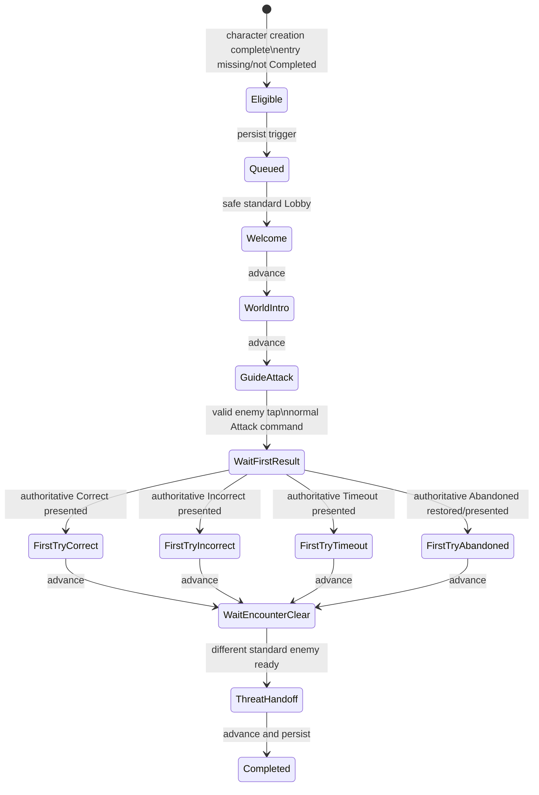

# Design Spec: `OnFirstCreate` Tutorial

> Approved by the project owner with `lgtm` on 2026-09-14. Final visual motion, contrast, art, audio, and mobile sizing remain a post-implementation playtest checkpoint.

## 1. Player Goal and Context

The child meets Power, learns that mathematics becomes visible battle power, performs one real combat action, and then receives a clear handoff into ordinary play. Power celebrates effort rather than correctness, so a first mistake remains emotionally safe and mechanically honest.

The tutorial teaches by guiding the live interface. It does not simulate a fake battle, pause a question clock, alter an answer, grant damage, or skip authority.

## 2. Experience Rules

1. Power speaks only in safe Lobby states or after all result presentation and saving is stable.
2. Ordinary dialogue exposes only its Advance control.
3. The guided-action step exposes exactly one target: the current enemy actor. If the actor binding is unavailable, the authored fallback is the Attack button; both are never highlighted together.
4. The accepted target immediately hides the tutorial presentation, prevents a second acceptance, and invokes the normal Attack request.
5. Video, preparation, answer timing, submission, and combat feedback remain ordinary gameplay with no tutorial overlay.
6. After the first committed result is fully presented and saved, Power responds to the real outcome.
7. If the enemy remains alive, the tutorial stays minimized and ordinary combat continues until that encounter is authoritatively cleared.
8. The final dialogue starts only after a different standard enemy is ready and all transition presentation is stable.
9. Advancing the final dialogue saves completion. No Skip action is defined by the GDD for this sequence.

## 3. State and Interaction Flow

If the first result defeats the guided enemy, the state engine may move directly from the result dialogue's Advance to `ThreatHandoff` once the next enemy is stable. It must still show both required story beats.

## 4. Authored Step Contract

| Stable step ID | Kind | Power emotion | Text key | Advance condition | Interaction policy |
|---|---|---|---|---|---|
| `welcome-new` | Dialogue | Grateful | `tutorial.onFirstCreate.welcomeNew` | Advance | Dialogue only |
| `welcome-returning` | Dialogue | Welcoming | `tutorial.onFirstCreate.welcomeReturning` | Advance | Dialogue only |
| `math-world` | Dialogue | Teach | `tutorial.onFirstCreate.mathWorld` | Advance | Dialogue only |
| `guide-attack` | Focus action | Confident | `tutorial.onFirstCreate.attackPrompt` | Current enemy tapped once | Enemy only; Attack fallback |
| `wait-first-result` | Wait | Hidden | none | Matching committed result presented and saved | Normal question/result flow |
| `first-try-correct` | Dialogue | Cheerful | `tutorial.onFirstCreate.firstTryCorrect` | Advance | Dialogue only |
| `first-try-incorrect` | Dialogue | Supportive | `tutorial.onFirstCreate.firstTryIncorrect` | Advance | Dialogue only |
| `first-try-timeout` | Dialogue | Supportive | `tutorial.onFirstCreate.firstTryTimeout` | Advance | Dialogue only |
| `first-try-abandoned` | Dialogue | Supportive | `tutorial.onFirstCreate.firstTryAbandoned` | Advance | Dialogue only |
| `wait-encounter-clear` | Wait | Hidden | none | A different standard encounter is ready | Normal Lobby/combat flow |
| `threat-handoff` | Dialogue | Scared | `tutorial.onFirstCreate.threatHandoff` | Advance, then complete | Dialogue only |

Step IDs, localization keys, emotion IDs, animation cue IDs, audio cue IDs, target IDs, and transitions belong to the tutorial definition. Presenter code must not switch on `OnFirstCreate` or these IDs.

## 5. Proposed Localized Copy

The copy below is the design checkpoint. `{0}` is the child's display name and remains escaped as plain text by UI Toolkit.

| Key | English | Thai |
|---|---|---|
| `tutorial.speaker.power` | Power | พาวเวอร์ |
| `tutorial.onFirstCreate.welcomeNew` | Hi, {0}! Thank you for coming. I'm Power—and I'm really glad you're here! | สวัสดี {0}! ขอบคุณที่มานะ เราชื่อพาวเวอร์—ดีใจจริง ๆ ที่ได้เจอกัน! |
| `tutorial.onFirstCreate.welcomeReturning` | Welcome back, {0}! I'm Power. Let me show you how your math becomes battle power! | ยินดีต้อนรับกลับนะ {0}! เราชื่อพาวเวอร์ มาดูกันว่าคณิตศาสตร์จะกลายเป็นพลังต่อสู้ได้อย่างไร! |
| `tutorial.onFirstCreate.mathWorld` | This is Math:World. Every problem you solve turns your thinking into real power! | ที่นี่คือ Math:World ทุกโจทย์ที่เธอแก้ได้ จะเปลี่ยนความคิดของเธอให้เป็นพลังจริง ๆ! |
| `tutorial.onFirstCreate.attackPrompt` | A monster is in our way. Tap it to begin your first challenge! | มีมอนสเตอร์ขวางทางอยู่ แตะมันเพื่อเริ่มการท้าทายครั้งแรกของเธอเลย! |
| `tutorial.onFirstCreate.firstTryCorrect` | Amazing first try! Your math became a real attack! | ครั้งแรกก็เยี่ยมมาก! คณิตศาสตร์ของเธอกลายเป็นการโจมตีจริง ๆ แล้ว! |
| `tutorial.onFirstCreate.firstTryIncorrect` | Great first try! Trying is how your power grows. Let's keep going! | การลองครั้งแรกยอดเยี่ยมมาก! ทุกครั้งที่ลอง พลังของเธอก็เติบโต ไปต่อกันเลย! |
| `tutorial.onFirstCreate.firstTryTimeout` | Great first try! Taking time to think is okay. Let's try again! | การลองครั้งแรกยอดเยี่ยมมาก! ค่อย ๆ คิดได้เลย แล้วเรามาลองอีกครั้งนะ! |
| `tutorial.onFirstCreate.firstTryAbandoned` | Welcome back! Your first try still counts—and I'm here with you. Let's keep going! | กลับมาแล้ว! การลองครั้งแรกของเธอยังมีความหมาย—เราจะอยู่ข้าง ๆ เอง ไปต่อกันนะ! |
| `tutorial.onFirstCreate.threatHandoff` | Whoa—a new monster! It looks scary... but you're ready. This battle is yours! | ว้าว—มอนสเตอร์ตัวใหม่! ดูน่ากลัวจัง... แต่เธอพร้อมแล้ว การต่อสู้นี้เป็นของเธอ! |
| `tutorial.advance` | Continue | ต่อไป |

The incorrect and timeout variants praise the attempt, never claim the answer or attack succeeded, and never describe support damage as student success.

## 6. Presentation and Accessibility

- Full-screen overlay: transparent black scrim, Power sprite, speaker label, dialogue body, advance indicator, and a separate focus aperture.
- Focus target: a pulsing outline/halo around one target plus a short directional cue. The scrim intercepts all other pointer input.
- Power poses may initially reuse the existing `Sticker_Power_Teach`, `Sticker_Power_Cheerful`, and `Sticker_Power_Scared` sprites. Missing optional art falls back to a neutral Power pose without changing story state.
- Subtitles are identical to visible dialogue and remain present while Power is speaking.
- Thai text must wrap without truncation at the smallest supported viewport; body text cannot rely on uppercase transformation.
- Mobile target hit area must meet the project's existing button sizing. The enemy actor's full raycast rect is the accepted target.
- Reduced Motion uses fades and direct pose swaps. It removes entrance travel, bounce, pulse translation, and parallax but keeps focus contrast and audio/subtitles.
- Locale changes re-resolve the current speaker/text keys; they do not rewind the step.
- Missing localization keys display a recoverable unavailable state in development and fail the content validation test; they are never silently replaced with authored English literals.

## 7. Starting Presentation Values and Test Plan

These are starting values, not claims of an industry standard:

- Scrim opacity: **starting value 0.62**. Test: the highlighted enemy and dialogue must be readable on all seven biome backgrounds. Increase only if unrelated controls remain visually dominant; decrease if the battlefield context becomes unclear.
- Power/dialogue fade: **starting value 0.20 seconds**; Reduced Motion **0.10 seconds**. Test: five new-player runs must report no perceived input lag at guided Attack. Shorten if input feels delayed; lengthen only if the entrance is missed.
- Focus pulse: **starting value 0.85 seconds per cycle**, disabled as motion in Reduced Motion. Test: the required target is identified without spoken help by at least 4/5 observers. Increase contrast before increasing speed or amplitude.

All presentation values live in a definition/profile asset and may be tuned without changing the state engine or save version.

## 8. Edge Cases and Abuse Cases

- Legacy account: use returning dialogue and the current saved standard enemy; do not reset Stage or run state.
- Event/Challenge encounter: stay queued until a standard-combat Lobby is ready.
- Pending attempt/result on login: combat recovery owns the screen first; tutorial remains queued/hidden.
- Repeated enemy taps: only the first valid acceptance invokes Attack; later taps are ignored by step state and combat locks.
- Attack rejection/content failure: remain at or return to `guide-attack` after recovery; do not record a first result.
- First attempt survives: release normal combat and wait for the encounter to clear.
- First attempt defeats enemy: wait for next-enemy presentation to settle, then show handoff.
- Death or run settlement before encounter clear: settlement completes first; resume at the next compatible standard Lobby without inventing advancement.
- Refresh at dialogue: resume the same step.
- Refresh after guided Attack: restore the committed attempt/result first; never invoke Attack again.
- Refresh after final dialogue before completion acknowledgement: retry the same idempotent completion transaction.
- Locale switch while visible: refresh current text and layout only.
- Unknown status/version/step: block tutorial-owned input, release no unsafe scope, and show localized recovery guidance.

## 9. Five-Component Evaluation

| Component | Design requirement |
|---|---|
| Clarity | Power names one action, one target is highlighted, and outcome copy is truthful. |
| Motivation | Power's welcome and threat reaction connect mathematical effort to the ongoing adventure. |
| Response | The valid tap acknowledges immediately and uses the real Attack path; wait states never absorb answer input. |
| Satisfaction | Power pose, focus response, combat feedback, and final handoff provide visual plus audio feedback where assets exist. |
| Fit | Power supports effort and courage without replacing mathematical success. |

## 10. Playtest Scenarios

1. New player: complete character creation, infer the enemy tap, answer correctly, and reach Stage 2 handoff.
2. Incorrect/timeout: verify the copy celebrates effort without saying the child succeeded.
3. Stress: spam enemy, Attack, navigation, keyboard, and touch during every tutorial state; exactly one production command is accepted.
4. Recovery: refresh at every saved step, during the answer, during result presentation, after encounter defeat, and during completion acknowledgement.
5. Legacy: enter with an incomplete/missing entry at a later standard enemy and complete without Stage reset.
6. Event boundary: enter on an Event and verify the tutorial queues until the next compatible standard encounter.
7. Accessibility: Thai/English, narrow mobile viewport, muted audio, Reduced Motion, and high-contrast focus review.
8. Abuse: edit local definition text/version and verify no completed tutorial replays and no gameplay transaction repeats.

## 11. Human Design Checkpoint

Approval is required for the exact English/Thai copy, emotion mapping, use of current Power sticker art as the first implementation, no Skip action, and the three starting presentation values above. Functional behavior is already grounded in the approved GDD.
