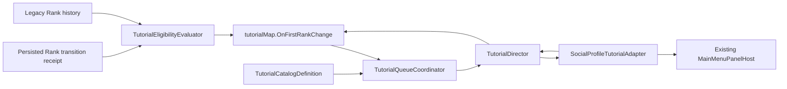

# Architecture Plan: `OnFirstRankChange`

> Approved by the project owner with `lgtm` on 2026-09-15.

## Decision

Extend ADR-020 rather than create a second tutorial subsystem. Generalize runtime orchestration from one sequence to a catalog-backed queue coordinator, add semantic Rank/panel signals, and author `OnFirstRankChange` entirely as data plus localization.

## Data Flow

## Model Extensions

- Add generic `TutorialSignalKind.PanelOpened` and `PanelClosed` signals; reuse `TargetActivated` for the focused proxy click.
- Add a string semantic context value to `TutorialSignal`/rules for `profile-analytics`, `leaderboard`, and currency target matching rather than tutorial-ID switches.
- Extend tutorial progress context with immutable `triggerKind`, `previousRank`, and `currentRank`. Persist semantic values only.
- Preserve V5 compatibility: new context fields are optional; no schema-version bump is required.

## Runtime Responsibilities

| Component | Change |
|---|---|
| `TutorialCatalogDefinition` | Enable both authored sequences and expose deterministic lookup/order. |
| `TutorialQueueCoordinator` | Select one Active/Queued entry by status then `triggerRecordedAt`; never stack overlays. |
| `TutorialDirector` | Operate on the selected sequence; consume generic UI semantic signals. |
| `RankTransitionFeedbackPlayer` / combat checkpoint | Publish the persisted Rank transition only after normal presentation and consequence flow finishes. |
| `TutorialEligibilityEvaluator` | Create the missing entry once from first transition or durable legacy history. |
| `SocialProfileTutorialAdapter` | Register open buttons/currency regions and invoke existing panel-host production paths. |
| Profile/Leaderboard controllers | Expose `Opened`/`Closed` events and narrow `TryOpenFromTutorial()` methods; retain ownership of validation/loading. |
| `TutorialTargetRegistry` | Register `profile.open`, tier-specific `profile.currency.*`, `leaderboard.open`, and `leaderboard.currency`. |

## Sequence Graph

- `promotion` or `demotion` dialogue
- `open-profile` focus → persisted `profile-opened`
- `rank-currency` focus/explanation → `rank-currency-explained`
- `open-leaderboard` focus → persisted `leaderboard-opened`
- `leaderboard-currency` focus/explanation
- final Advance → Completed

Panel focus steps use proxy activation because the global tutorial lease intentionally blocks ordinary navigation. After a valid proxy click, the tutorial releases its lease, invokes the controller’s normal open path, waits for `PanelOpened`, persists the next step, then reacquires only when the panel is stable.

## Queue and Safe-State Rules

- Existing Active tutorial always wins.
- Otherwise choose the lowest `triggerRecordedAt`, tie-broken by catalog order/tutorial ID.
- Start at most one queued tutorial per stable Lobby arrival.
- Rank eligibility may be recorded during combat, but presentation requires the existing safe predicate plus no open/blocking panel.
- `OnFirstCreate` completion/queue state is not rewritten when Rank changes.

## Persistence and Recovery

- Record eligibility and direction in the same revision-checked lifecycle command boundary.
- Every accepted panel-open transition persists before the next explanation.
- Reconnect derives visible panel state independently; it never treats a local click as completion without the saved semantic step.
- Completed tutorial entries remain non-replayable when copy, motion, or asset version changes.

## Files Expected to Change

- Tutorial core models/reducer tests.
- Tutorial progress snapshot/mapper/store optional context fields.
- Tutorial catalog/coordinator/director/target registry.
- Academic Rank transition semantic adapter.
- Profile Analytics and Leaderboard controller adapters/events.
- `CombatLobbyCompositionRoot` or a new scene-scoped tutorial composition root.
- `OnFirstRankChange.asset`, `TutorialCatalog.asset`, and `Resources/Localization/UI.json`.
- EditMode/PlayMode tests, TestPlan, and DevLog.

## Architecture Boundary

No tutorial code calculates Rank, grants currency, edits leaderboard score, bypasses panel validation, or writes combat/economy state. No dependency, build, CI, Firebase-rule, or deployment change is included. This is an implementation extension of accepted ADR-020, not a new architecture decision.
