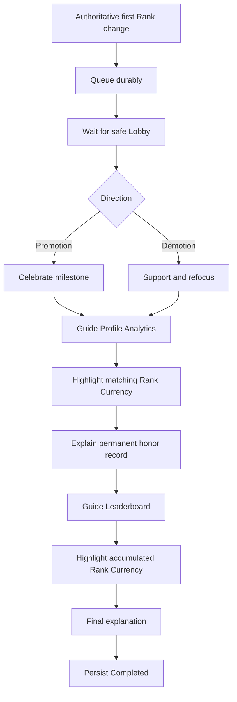

# Design Spec: `OnFirstRankChange`

> Approved by the project owner with `lgtm` on 2026-09-15.

## GDD Alignment

The GDD requires the sequence to start only after the triggering attempt and all consequence/settlement presentation resolve, distinguish promotion from demotion, guide Profile Analytics and its permanent Rank Currency, then guide Leaderboard and complete after the final explanation.

## Player Flow

## Localized Copy Proposal

| Key | English | Thai | Emotion |
|---|---|---|---|
| `tutorial.onFirstRankChange.promotion` | You reached a new learning milestone, {0}! Every challenge is helping your Rank grow. | {0} ก้าวถึงเป้าหมายการเรียนรู้ใหม่แล้ว! ทุกความท้าทายกำลังช่วยให้แรงก์ของเธอเติบโต | cheerful |
| `tutorial.onFirstRankChange.demotion` | This Rank changed, but your learning is not lost, {0}. Let’s look at everything you’ve earned. | แรงก์เปลี่ยนไป แต่สิ่งที่ {0} เรียนรู้ไม่ได้หายไปนะ มาดูสิ่งที่เธอสะสมไว้กัน | supportive |
| `tutorial.onFirstRankChange.openProfile` | Open Profile Analytics so I can show you your learning history. | เปิดสถิติโปรไฟล์ แล้วเราจะพาไปดูประวัติการเรียนรู้ของเธอ | teach |
| `tutorial.onFirstRankChange.rankCurrency` | This is Rank Currency. You never spend it—it stays as a forever record of your honor and learning experience. | นี่คือสกุลเงินแรงก์ เธอไม่ต้องใช้มัน เพราะมันจะอยู่เป็นบันทึกเกียรติยศและประสบการณ์การเรียนรู้ตลอดไป | proud |
| `tutorial.onFirstRankChange.openLeaderboard` | Now open the Leaderboard and see where that learning record can shine. | ต่อไปเปิดกระดานอันดับ แล้วดูว่าบันทึกการเรียนรู้ของเธอเปล่งประกายตรงไหน | confident |
| `tutorial.onFirstRankChange.leaderboard` | Your accumulated Rank Currency helps show your progress among other learners. Keep learning—your story keeps growing! | สกุลเงินแรงก์ที่สะสมไว้ช่วยแสดงความก้าวหน้าของเธอท่ามกลางผู้เรียนคนอื่น เรียนรู้ต่อไปนะ เรื่องราวของเธอยังเติบโตได้อีก! | cheerful |

## Interaction Rules

- Opening dialogue blocks unrelated interactions.
- The Profile focus accepts exactly one click and calls the ordinary panel-open route.
- While Profile Analytics is open, highlight only the currency matching the recorded transition tier; the explanation advances normally.
- Close Profile Analytics through a tutorial-authorized production close before guiding Leaderboard.
- The Leaderboard focus calls the ordinary open route once; loading failure remains recoverable and does not complete the tutorial.
- The final explanation completes the sequence; no Rank or currency state is modified.

## Feedback and Accessibility

- Reuse the current focus pulse and emotion-change portrait entrance.
- Promotion uses positive audio/pose; demotion uses supportive audio/pose, never failure fanfare.
- Highlighting must preserve panel context and readable contrast.
- Reduced Motion retains pose changes and focus contrast but removes pulse/travel.
- All required tap regions retain the current minimum tutorial hit target.

## Edge Cases

- Rank feedback, death, settlement, question, or pending receipt: remain queued/hidden.
- Both tutorials eligible: oldest active/trigger time wins; only one presents.
- Refresh after a panel opened: resume at the saved post-open explanation, do not reopen automatically.
- Panel unavailable or another panel owns the host: release the tutorial lock and show recoverable localized status.
- Leaderboard network failure: the panel may open and show its normal error; tutorial completion depends on the semantic panel-open event, not successful standings data.
- Demotion followed by promotion before presentation: retain the first recorded trigger direction.

## Five-Component Check

- **Clarity:** one pulsing target and one explanation at a time.
- **Response:** each accepted focus tap immediately hands off to the production panel command.
- **Satisfaction:** Power pose/audio plus focused currency feedback.
- **Fit:** permanent learning history is celebrated without claiming every Rank movement is success.
- **Motivation:** Profile and Leaderboard connect past learning to visible identity.

## Playtest

Promotion, demotion, legacy history, concurrent tutorial queue, refresh at every durable step, panel/network failure, narrow Thai layout, Reduced Motion, and rapid repeated taps must all be exercised. Pass condition: one command per focus step, no combat interruption, and no invisible interaction lock.
