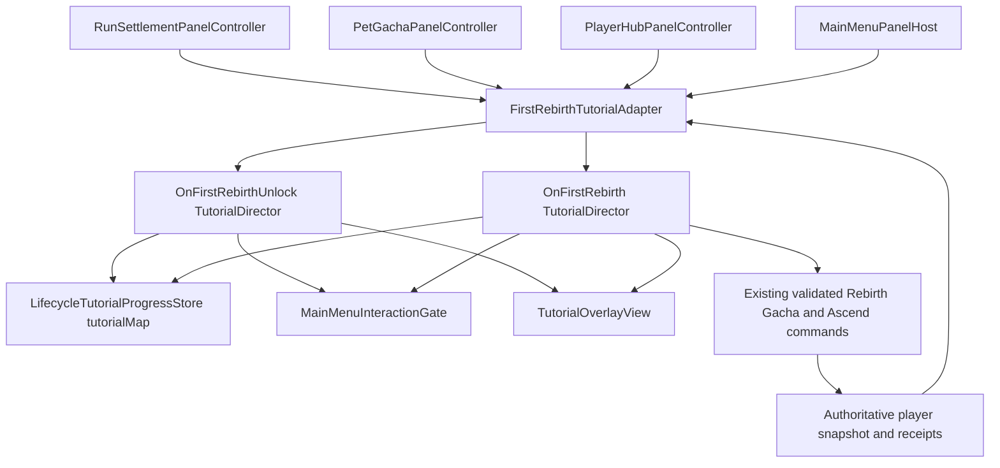

# On First Rebirth Tutorial Sequence Architecture Plan

## Decision

Extend the existing data-driven tutorial map and pure reducer from ADR-020. Add two authored sequences, `OnFirstRebirthUnlock` and `OnFirstRebirth`, plus a thin scene-scoped adapter that translates existing Rebirth, Gacha, Player Hub, and settlement lifecycle events into semantic tutorial signals. The adapter never calculates rewards, changes panel state directly, or manufactures a successful result.

`OnFirstRebirthUnlock` owns only the pre-settlement explanation. `OnFirstRebirth` owns every post-settlement step from the Stage-1 result line through the final Player Hub line. Both use the existing shared overlay and interaction gate, therefore only one can have visual ownership at a time.

## System Diagram



## Required Interfaces

No direct gameplay interface changes are needed. Presentation controllers publish minimal semantic callbacks; the adapter consumes them and calls a new generic director entry point.

```csharp
public enum FirstRebirthTutorialEvent
{
    RebirthPanelOpened,
    DeathPanelOpened,
    RebirthAccepted,
    SettlementReturnedToStageOne,
    PetGachaOpened,
    TutorialGrantCompleted,
    PetRevealCompleted,
    MainMenuReturned,
    PlayerHubOpened,
    WeaponAscendSucceeded,
    PetTabShown
}

public interface IFirstRebirthTutorialEventSource
{
    event Action<FirstRebirthTutorialEvent> Occurred;
}
```

`TutorialDirector` receives an explicit, generic method rather than references to individual controllers:

```csharp
public IEnumerator NotifyExternalEvent(
    TutorialSignalKind kind,
    string targetId = "",
    string transactionId = "");
```

The architecture extends `TutorialSignalKind` with the minimum semantic values necessary for authored transitions: `PanelOpened`, `SettlementCompleted`, `TransactionSucceeded`, `PresentationCompleted`, and `MainMenuReturned`. A transition rule uses a stable target/event ID to distinguish Pet Gacha, Player Hub, Pet tab, Rebirth, and Weapon Ascend events.

## Class Responsibilities

| Class or asset | Responsibility | Depends on | Does not own |
|---|---|---|---|
| `TutorialSequenceDefinition` and new sequence assets | Localized steps, voice cue IDs, transitions, focus target IDs | Existing generic tutorial model | Rewards, gameplay validity, panel references |
| `TutorialDirector` | Persists/reduces external semantic events, applies overlay and focus ownership | Existing store, gate, target registry | Rebirth, Gacha, Ascend, or settlement state |
| `FirstRebirthTutorialAdapter` new | Subscribes to event sources; queues and notifies the applicable director in durable receipt order | Panel controllers, session snapshot, directors | UI drawing, economy, persistence rules |
| `RunSettlementPanelController` | Emits opened, accepted, and Stage-1 settlement-complete events | Existing settlement receipt | Tutorial progression |
| `PetGachaPanelController` | Emits panel-open and reveal-complete events from its existing presentation state | Existing gacha receipt | Tutorial grant and completion |
| `PlayerHubPanelController` | Emits panel-open, successful upgrade, and Pet-tab-shown events | Existing upgrade receipt and view event | Tutorial sequencing |
| `CombatLobbyCompositionRoot` | Creates, registers, disposes the adapter/directors and focus targets | Catalog, panel composition roots | Individual tutorial transition decisions |
| `UI.json` | Exact Thai localization keys for takes 21–38 | Voice sheet | Voice file lookup |

## Data Flow

```text
Ordinary player action
  -> existing controller validates and sends its normal command
  -> authoritative store updates PlayerSnapshot or receipt
  -> controller completes its ordinary presentation
  -> controller emits one semantic event with its target/transaction ID
  -> FirstRebirthTutorialAdapter checks tutorial eligibility and source ordering
  -> TutorialDirector reduces and persists the next authored step
  -> overlay plays the mapped S4/S5/S6 cue or highlights the next real control
```

## Authored Sequences

### `OnFirstRebirthUnlock`

- `death-intro` → `rebirth-explanation` → `rebirth-benefits` → `rebirth-prompt` → `wait-for-stage-one` → `rebirth-result`.
- A voluntary Stage-30+ panel-open variant starts at `rebirth-explanation`, then `rebirth-benefits`, and completes after that panel explanation is acknowledged. It never forces confirmation.
- The death variant waits on the accepted normal restart/Rebirth command and the authoritative Stage-1 settlement before `S4_05_VA`.

### `OnFirstRebirth`

- Queues only after the first authorized Rebirth/restart action has settled at Stage 1. On the death route, this occurs after the player accepts the guided Rebirth/restart command, so Session 05 follows Session 04 automatically; it does not start merely because the defeat window first appears.
- Steps use `S5_01_VA`–`S5_06_VA`, then `S6_01_VA`–`S6_07_VA`, exactly as mapped in the voice sheet.
- One-time +180 PC is a dedicated idempotent tutorial command/receipt. The adapter emits `TutorialGrantCompleted` only after that receipt is reflected in the player snapshot.
- The real 180-PC gacha purchase and weapon upgrade remain their existing commands and receipts. Failure or refresh leaves the current authored wait step active.

## Focus Target Registration

`CombatLobbyCompositionRoot` registers the existing UI Toolkit controls with stable semantic names:

| Target ID | Required target |
|---|---|
| `rebirth.benefits` | Whole Legacy ATK and Power Coin panel |
| `rebirth.confirm` | `Button / Rebirth` |
| `gacha.open` | Pet Gacha menu button |
| `gacha.pull-one` | One-pull action |
| `gacha.confirm` | Gacha confirmation action |
| `hub.open` | Player Hub menu button |
| `hub.ascend` | Weapon Ascend button |
| `hub.pets` | Pet tab |

The corresponding activation lambdas call existing public tutorial-safe methods on their controller. If such methods do not exist, add narrow `TryOpenForTutorial`, `TryRequestOnePullForTutorial`, `TryConfirmPullForTutorial`, `TryOpenForTutorial`, `TryAscendForTutorial`, and `TryShowPetsForTutorial` wrappers that invoke the same private command path as a player tap.

## Authority Decisions

| Decision | Choice | Rationale |
|---|---|---|
| Tutorial eligibility and completion | Existing persisted `tutorialMap` | Retains reconnect safety and one-time completion semantics from ADR-020. |
| Reward ownership | Existing or new idempotent lifecycle/tutorial grant command | Presentation cannot mint the 180 PC. |
| Gacha and Ascend ownership | Existing controller/store command paths | Tutorial remains truthful and cannot bypass validation. |
| Cross-controller wiring | Scene-scoped adapter | Avoids making `TutorialDirector` a Main Menu god object. |
| Voice asset lookup | Existing `VoiceController.PlayVoiceCue` and Resources cue ID | Imported names already match the required `S4_XX_VA` through `S6_XX_VA` pattern. |
| External waits | Semantic reducer signals, not timers | Refresh/recovery preserves the actual result boundary. |

## Affected Systems

- `Assets/Project/Script/Gameplay/Tutorial/Core/TutorialModels.cs` and `TutorialStateMachine.cs`: add generic external signal kinds and reducer coverage.
- `Assets/Project/Script/UI/MainMenu/Tutorial/TutorialDirector.cs`: accept and persist external signals.
- `Assets/Project/Script/UI/MainMenu/Tutorial/FirstRebirthTutorialAdapter.cs`: new scene-scoped semantic adapter.
- `Assets/Project/Script/UI/MainMenu/RunEconomy/RunSettlementPanelController.cs`, `PetGachaPanelController.cs`, and `PlayerHubPanelController.cs`: expose narrow tutorial-safe action methods and post-presentation semantic events.
- `Assets/Project/Script/UI/MainMenu/RunEconomy/RunEconomyPanelController.cs`: surface the controller references/event source to the adapter.
- `Assets/Project/Script/UI/MainMenu/CombatLobbyCompositionRoot.cs`: assemble the adapter, both directors, and target registrations.
- `Assets/Project/Resources/Tutorial/`: add `OnFirstRebirthUnlock.asset` and `OnFirstRebirth.asset`; update `TutorialCatalog.asset`.
- `Assets/Project/Resources/Localization/UI.json`: add exact Thai strings for takes 21–38.
- `Assets/Project/Tests/EditMode/Tutorial/`: reducer, mapping, and adapter event-order tests.

## ADR Impact

No new ADR is required. This plan is an additive application of accepted ADR-020: it retains data-driven sequences, a pure reducer, semantic scene adapters, saved tutorial progress, and authoritative production commands. The implementation must update ADR-020's current note and add a DevLog entry after code lands.

## Architecture Approval

Approved by the project owner with `lgtm` on 2026-09-22. The implementation must keep the tutorial grant receipt-driven and advance authored wait steps only from semantic panel/result events, never animation timing.
