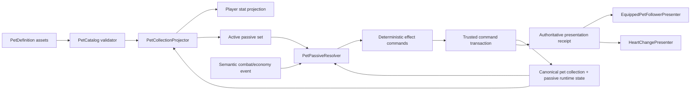

# Architecture Plan: Pet Collection and Passive Runtime Standardization

## Status

Approved by the project owner (`LGTM`) on 2026-09-17. Implementation is incremental: the local domain, catalog, inventory, combat, settlement, and direct-Firestore prototype are being standardized first; trusted backend deployment and final presentation remain gated separately.

## System Diagram



## Core Data Contracts

```csharp
public enum PetStatId
{
    PlayerFlatAttack,
    PlayerAttackPercent,
    PetFlatAttack,
    PetAttackPercent,
    CriticalRatePercent,
    CriticalDamagePercent,
    EncounterChancePercent,
    RunRewardPercent,
    MaximumHearts
}

public enum PetPassiveTrigger
{
    SuccessfulPlayerAttackResolved,
    PlayerHeartLost,
    EncounterDefeated,
    RunSettlementStarted
}

public enum PetPassiveEffectType
{
    DealFollowUpDamage,
    ModifyNthPlayerAttack,
    EnablePetCritical,
    RestoreHearts,
    GrantPowerCoins
}

public enum PetPassiveStackRule
{
    UniquePerDefinition,
    PerCopy,
    CappedCopies
}

public enum PetPassiveResetScope
{
    Never,
    Encounter,
    Stage,
    Run
}
```

These enums name reusable mechanics, not pets. Encounter filters use existing stable encounter classification or data-defined traits; no passive branch names a concrete enemy or pet.

```csharp
public interface IPetCollectionProjector
{
    PetCollectionProjection Project(
        PetCatalog catalog,
        IReadOnlyDictionary<string, int> copyCounts);
}

public interface IPetPassiveResolver
{
    PetPassiveResolution Resolve(
        PetGameplayEvent sourceEvent,
        ActivePetPassiveSet activePassives,
        PetPassiveRuntimeState state,
        string operationId);
}

public interface IPetCommandGateway
{
    IEnumerator Pull(PetPullCommand command,
        Action<PetPullReceipt> completed,
        Action<PetCommandFailure> failed);
}

public interface IPetActionPresentationPort
{
    void Present(PetActionPresentationReceipt receipt);
}
```

## Class Responsibility Table

| Class | Responsibility | Depends on | Owned state |
| --- | --- | --- | --- |
| `PetDefinition` | Unity-authored identity, art, modifiers, passives | Core descriptor types | Serialized content only |
| `PetCatalog` | Immutable validated runtime catalog | Pet definitions | Version and lookup tables |
| `PetCollectionSnapshot` | Canonical positive counts keyed by pet ID | None | Copy counts |
| `PetCollectionProjector` | Checked modifier totals and active passive instances | Catalog, counts, clamp policy | None |
| `PetStatClampPolicy` | Data-defined min/max per stat | Tunable content | Clamp definitions |
| `PetPassiveResolver` | Pure trigger/filter/progress/effect evaluation | Active passives | None |
| `PetPassiveRuntimeState` | Scoped progress, pending effects, idempotency markers | Stable passive keys | Saved runtime state |
| `PetEquipPolicy` | Validate owned cosmetic selection | Catalog, counts | None |
| `PetCommandGateway` | Send command and map receipt/failure | Authenticated backend | None |
| Trusted pet command handler | Validate ownership/catalog/wallet, roll, apply effects atomically | Authoritative catalog/save | Transaction only |
| `EquippedPetFollowerPresenter` | Translate semantic receipts into view states | Equip projection, presentation port | Transient view state |
| `HeartChangePresenter` | Translate reason-coded heart changes into feedback | Heart receipt | Transient view state |

## Canonical Save Shape

The logical shape remains inside the existing player's `gamedata` boundary during migration:

```text
petCollection
  schemaVersion
  catalogVersion
  copiesById
    furbo: 2
    sapphire: 1

petPassiveRuntime
  schemaVersion
  states[]
    passiveKey
    resetScope
    scopeKey
    progress
    pendingMagnitude
    lastAppliedOperationId

economy
  lastPetPullReceipt
    transactionId
    commandFingerprint
    catalogVersion
    pullCount
    cost
    resultingPowerCoins
    results[]
      petId
      resultingCount
      wasFirstCopy
```

Derived totals and `hasPassive` booleans are never saved as authority. They are recomputed from catalog version plus canonical copy counts. Passive progress/effects are saved only when they cannot be derived from the latest authoritative combat receipt.

## Data Flow

### Gacha

```text
Preview catalog/counts/revision
  -> player confirms one 180-PC pull
  -> trusted command validates auth, revision, command ID, wallet, catalog
  -> server rolls and increments one canonical count
  -> transaction saves wallet + count + complete receipt + revision
  -> client projects inventory/stat delta
  -> UI reveals copy count and positive growth
```

### Passive Combat Action

```text
Combat operation emits semantic event
  -> resolver derives active passives from authoritative owned counts
  -> resolver advances scoped progress and returns effect commands
  -> combat transaction applies each effect once
  -> save combat + passive state + operation receipt atomically
  -> presentation receipt animates the equipped cosmetic follower
```

### Equip

```text
Select pet card
  -> validate catalog ID and owned count > 0
  -> persist cosmetic pet ID idempotently
  -> replace follower sprite/view
  -> do not recompute account power from equipped ID
```

## Authority Decisions

| Decision | Choice | Rationale |
| --- | --- | --- |
| Pet identity | Stable canonical ID only | Display names/localization cannot affect saves |
| Copy ownership | Positive count per ID | Prevents duplicate rows and ambiguous presence/level semantics |
| Stats/passives | Derived from catalog + counts | Avoids forged/stale saved totals |
| Equip | Saved cosmetic ID | Preserves favorite-pet choice without power loss |
| Passive progress | Generic keyed state with reset scope | Supports future passives without schema leaves per pet |
| Gacha/passive authority | Trusted authenticated command | Direct clients cannot confirm ownership or prevent tampering |
| Presentation | Receipt-driven, non-authoritative | Animation cannot grant damage/rewards or replay effects |
| Migration | Dual-read, canonical-write, versioned | Allows safe incremental rollout and rollback |

## Compatibility and Migration Rules

- Legacy `inventory[]` pet rows are read once and grouped by canonical ID with checked addition.
- A legacy owned row with no count becomes exactly one only inside the versioned migration, never inside normal projection.
- `upgradeLevel` is not a pet copy count after migration.
- Display-name lookup is removed from runtime resolution; approved aliases live in migration-only data.
- Existing `stageAttackCount` and `pendingPetFollowUpDamage` remain compatibility reads until generic passive state is confirmed in deployed saves.
- `bigBossesDefeated` becomes analytics-only if retained; immediate passive eligibility derives from the authoritative encounter-defeated event plus filter.
- Current multi-pull UI is disabled unless the complete receipt schema is approved and implemented.

## Affected Existing Scripts

- `Gameplay/Pets/Core/PetGachaModels.cs`
- `Gameplay/Pets/Core/PetCollectionPolicy.cs`
- `Gameplay/Pets/Core/EquippedPetAttackPolicy.cs`
- `Gameplay/Pets/Unity/PetDefinition.cs`
- `Gameplay/Pets/PlayerOwnedPetInventory.cs`
- `Gameplay/Pets/FirestorePetGachaCommandStore.cs`
- `Gameplay/Pets/FirestorePetEquipCommandStore.cs`
- `Gameplay/Progression/PlayerStatProjection.cs`
- `Gameplay/Progression/RunSettlementPolicy.cs`
- `Gameplay/Combat/Core/PlayerCombatStats.cs`
- `Gameplay/Combat/Core/LocalRunEncounterEngine.cs`
- `Gameplay/Combat/Core/CombatModels.cs`
- `Gameplay/Academic/FirestoreAcademicProgressionStore.cs`
- `PlayerData/PlayerSnapshot.cs`
- `PlayerData/PlayerSchemaMigrator.cs`
- `Session/FirestoreRestClient.cs`
- `Session/PlayerDefaultsPlanner.cs`
- `UI/MainMenu/RunEconomy/PetGachaPanelController.cs`
- `UI/MainMenu/RunEconomy/PlayerHubPanelController.cs`
- `UI/MainMenu/CombatLobbyCompositionRoot.cs`

## New Scripts After Approval

- `Gameplay/Pets/Core/PetStatModels.cs`
- `Gameplay/Pets/Core/PetCollectionSnapshot.cs`
- `Gameplay/Pets/Core/PetCollectionProjector.cs`
- `Gameplay/Pets/Core/PetPassiveModels.cs`
- `Gameplay/Pets/Core/PetPassiveResolver.cs`
- `Gameplay/Pets/Unity/EquippedPetFollowerPresenter.cs`
- `Gameplay/Pets/Unity/PetFollowerView.cs`
- `Gameplay/Combat/Presentation/Core/PetActionPresentationReceipt.cs`

Backend files are intentionally not named until the owner approves the hosting/runtime choice.

## Verification Plan

- Pure core tests for counts, every stat type, clamps, overflow, stack rules, reset scopes, filters, ordering, and non-recursion.
- Migration tests for absent count, duplicate rows, case variants, unknown IDs, invalid count, and replay.
- Receipt tests for command fingerprint mismatch, retry after commit, stale revision, and full result recovery.
- Combat tests for third-attack progress, Follow-Up carryover, critical eligibility, heart restore cap, Counter-Attack ordering, death, Event exclusion, and reconnect.
- UI tests for one card per ID, `xN`, total values, equip invariance, reduced motion, and missing follower art.
- Security tests against forged wallet/count/passive/pull-count payloads at the trusted command boundary.
