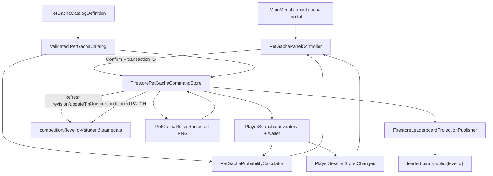

# Architecture Plan: Pet Gacha System

> Approved by the project owner on 2026-08-13 (`lgtm prototype`). This approval accepts client-side cryptographic rolling as an explicit direct-Firestore prototype limitation. Production content remains a fail-closed authoring dependency, not an implementation blocker for the framework and tests.

## 1. Current State and Target State

### Current implementation

- `PlayerSnapshot` already persists a generic `inventory[]`, `loadout.petId`, `wallet.powerCoins`, and an `economy` receipt for Weapon Ascend.
- `FirestoreProgressionCommandStore` implements the current prototype command pattern: refresh the private grade document, validate the local revision, PATCH with an update-time precondition, then mutate the in-memory snapshot.
- `FirestorePatchDocumentBuilder` can already serialize the fixed inventory item shape `{ itemId, upgradeLevel, owned }`.
- `RunEconomyPanelController` composes run settlement and Weapon Ascend UI against one shared progression store.
- `MainMenuUI.uxml` has no gacha entry or panel, and the repository contains no production pet catalog, rarity rates, pet sprites, or pet stats.
- `PlayerStatProjectionFactory` deliberately treats Pet ATK as zero/unconfigured. That boundary is unchanged by this slice.
- The accepted direct-Firestore prototype is concurrency-safe through revision/update-time checks but is not tamper-proof server authority.

### Target architecture

Add a data-driven pet catalog, a pure exact-ratio probability engine, one idempotent pull command, permanent ownership persistence, and a dedicated UI Toolkit controller. A confirmed pull validates refreshed saved state, spends exactly 25 Power Coins, calculates one result from the refreshed ownership set, saves the result receipt and any new inventory ownership in one preconditioned PATCH, updates `PlayerSessionStore`, and best-effort republishes the existing public profile projection.

Pet equip/loadout, Pet ATK/CR/CD/HP, pity, multi-pull, duplicate compensation, monetization, and final production content remain outside this architecture.

## 2. System Diagram



## 3. Core Probability Model

### Category representation

- Each rarity category authors an integer `rateBasisPoints` value.
- All enabled rarity rates must total exactly `10,000` basis points before the catalog is usable.
- Category selection uses an integer roll in `[0, 10,000)`, so category totals cannot drift through floating-point accumulation.
- Basis points define probability precision, not balance; production rates are human-authored content.

### Exact within-rarity redistribution

For total pets `N`, owned pets `O`, and unowned pets `U = N - O`:

- When `O = 0` or `U = 0`, every pet has equal integer weight `1`.
- When `O > 0` and `U > 0`, each owned pet has integer weight `U` and each unowned pet has integer weight `2N - O`.

The total weight is exactly `2NU`, which is algebraically equivalent to the GDD formula:

```text
Owned share within rarity   = 1 / (2N)
Unowned share within rarity = 1 / N + O / (2NU)
```

This permits exact integer weighted selection without changing the category rate. UI percentages are a display projection of the rational values; rolling never uses rounded display text.

### Pure models

```csharp
public readonly struct PetChance
{
    public string PetId { get; }
    public string RarityId { get; }
    public int CategoryRateBasisPoints { get; }
    public long WeightNumerator { get; }
    public long WeightDenominator { get; }
    public bool IsOwned { get; }
}

public interface IPetGachaProbabilityCalculator
{
    PetChance[] Calculate(
        PetGachaCatalog catalog,
        IReadOnlyCollection<string> ownedPetIds);
}

public interface IPetGachaRandomSource
{
    int NextExclusive(int maximumExclusive);
}

public interface IPetGachaRoller
{
    PetGachaResult Roll(
        PetGachaCatalog catalog,
        IReadOnlyCollection<string> ownedPetIds,
        IPetGachaRandomSource random);
}
```

The implementation injects a deterministic sequence source in tests. The live prototype uses a cryptographic operating-system random source where supported by Unity WebGL; it must use unbiased rejection sampling when an arbitrary maximum is required.

## 4. Catalog Boundary

```csharp
[CreateAssetMenu(menuName = "PowerMath/Pets/Gacha Catalog")]
public sealed class PetGachaCatalogDefinition : ScriptableObject
{
    [SerializeField] private string catalogVersion;
    [SerializeField] private List<PetRarityDefinition> rarities;

    public bool TryBuildCatalog(out PetGachaCatalog catalog, out string error);
}

[Serializable]
public sealed class PetRarityDefinition
{
    public string rarityId;
    public string displayName;
    public int rateBasisPoints;
    public Color displayColor;
    public List<PetDefinition> pets;
}

[Serializable]
public sealed class PetDefinition
{
    public string petId;
    public string displayName;
    public Sprite icon;
}
```

Validation rejects:

- missing or duplicate rarity IDs;
- missing or duplicate pet IDs across the complete catalog;
- empty rarity categories;
- zero/negative category rates or totals other than exactly `10,000` basis points;
- missing display names;
- missing icons in production validation;
- catalog changes that make a saved receipt's result pet unresolvable.

The catalog owns identity and presentation only. Pet combat stats are intentionally absent so this feature cannot silently activate `loadout.petId` or change damage.

## 5. Command and Receipt Interfaces

```csharp
public readonly struct PetGachaCommand
{
    public string TransactionId { get; }
    public string CatalogVersion { get; }
    public long PreviewRevision { get; }
}

public readonly struct PetGachaReceipt
{
    public string TransactionId { get; }
    public string CatalogVersion { get; }
    public string PetId { get; }
    public bool WasNew { get; }
    public long Cost { get; }
    public long ResultingPowerCoins { get; }
}

public interface IPetGachaCommandStore
{
    IEnumerator Pull(
        PetGachaCommand command,
        Action<PetGachaReceipt> completed,
        Action<PetGachaFailure> failed);
}
```

`PetGachaFailure` distinguishes `InsufficientFunds`, `StalePreview`, `UnavailableDuringAttempt`, `InvalidCatalog`, `RecoverableTransport`, and `InvalidSavedState`. Presentation maps these stable reasons to player-facing text; it never parses arbitrary exception strings to determine state.

## 6. Authority and Idempotency Decision

### Recommended prototype path

Extend ADR-008's accepted direct-Firestore command boundary:

1. The panel calculates preview odds from `PlayerSessionStore.Snapshot` and records its `revision` plus catalog version.
2. Confirm creates one opaque transaction ID and disables pull/close actions that would imply cancellation.
3. The store GETs the private grade document and reads the authoritative update time, revision, wallet, inventory, and last gacha receipt.
4. If the saved receipt transaction ID matches, return that exact result without spending or rolling again.
5. Reject a preview revision/catalog mismatch before spend; refresh the panel rather than silently changing the shown odds.
6. Validate at least 25 Power Coins, no unresolved combat attempt, and valid inventory/catalog identities.
7. Roll from the refreshed ownership set, subtract exactly 25, add one inventory record only for a new pet, and PATCH revision + wallet + optional inventory + the complete receipt together.
8. Reveal only after the PATCH is acknowledged. A network failure retries recovery with the same transaction ID; it does not expose an unsaved result.

This is concurrency-safe and idempotent under the existing prototype but remains client-tamperable. A modified WebGL client can influence RNG or requests, so it does **not** fully satisfy the GDD phrase “the server performs the roll.” Architecture approval of this path records that limitation in proposed ADR-010.

### Production-authority alternative

A trusted Cloud Function or project-owned REST service must read ownership/balance, generate the random result, transact the private state, and return the saved receipt. That option requires a separate backend architecture, deployment, secrets, rules, and dependency checkpoint and is not authorized by the current task or ADRs.

## 7. Firestore Schema Extension

```text
competition/{levelDocumentId}
  {normalizedUsername}.gamedata
    revision
    wallet
      powerCoins
    inventory
      [{ itemId, owned, upgradeLevel }, ...]
    economy
      ...existing Weapon Ascend receipt
      lastPetGachaTransactionId
      lastPetGachaCatalogVersion
      lastPetGachaPetId
      lastPetGachaWasNew
      lastPetGachaCost
      lastPetGachaResultingPowerCoins
```

- The receipt is the reconnect/idempotency source of truth and is written with the spend/result.
- A new pet uses the existing inventory shape with `upgradeLevel = 0` and `owned = true`.
- A duplicate does not rewrite inventory and grants no item, level, currency, shard, or compensation.
- Missing defaults add empty/zero receipt leaves only; they never alter valid wallet or inventory values.
- Catalog probabilities and derived ownership counts are never persisted.
- No Firestore rules or schema publication occurs automatically.

## 8. Class Responsibilities

| Class | Responsibility | Depends On | Owned State |
| --- | --- | --- | --- |
| `PetGachaCatalog` | Immutable validated rarity/pet content data | None | Catalog data |
| `PetGachaProbabilityCalculator` | Produce exact per-pet rational chances from catalog and ownership | `PetGachaCatalog` | None |
| `PetGachaRoller` | Two-stage category and within-category weighted selection | Calculator, random source | None |
| `PetGachaCatalogDefinition` | Author and validate Unity content into the pure catalog | Unity assets | Serialized content only |
| `CryptoPetGachaRandomSource` | Supply unbiased live random integers | Platform crypto API | Generator only |
| `FirestorePetGachaCommandStore` | Refresh, validate, roll, patch, recover receipt, update snapshot | Settings, player, catalog, RNG | Active coroutine only |
| `PetGachaPanelController` | Render preview/confirm/busy/recovery/result states and coordinate feedback | Store, catalog, snapshot, audio | UI and pending transaction ID only |
| `RunEconomyPanelController` | Compose/dispose the new controller beside existing economy panels | Shared host/settings/player | References only |
| `PlayerSnapshot.EconomyData` | Hold the last accepted gacha receipt in memory | REST mapping | Receipt fields |
| `FirestoreLeaderboardProjectionPublisher` | Republish existing `petId` field without exposing private receipt/economy | Player snapshot | No state |

`CombatLobbyCompositionRoot` remains thin: it loads the catalog asset and passes it into `RunEconomyPanelController`. It does not calculate odds, roll, format receipt rules, or mutate ownership.

## 9. UI Toolkit Composition

Add one `PET GACHA` Main Menu entry and one modal to `MainMenuUI.uxml` containing:

- current Power Coins, fixed cost, and projected balance;
- catalog version/content status;
- a scrollable rarity-grouped per-pet probability list with owned badges;
- duplicate-empty warning visible in preview and confirmation;
- `PULL FOR 25`, confirmation, cancel, recovery, result, continue, and close states;
- pet icon/name, rarity treatment, and explicit `NEW` or `DUPLICATE - NO PET CHANGES` result;
- text-first fallback for missing audio and Reduced Motion presentation.

`PetGachaPanelController` caches all queried visual elements once, registers callbacks in construction, unregisters in `Dispose`, subscribes to `PlayerSessionStore.Changed`, and uses scheduled UI transitions/coroutines rather than `Update()` polling.

The panel is hidden/unavailable in Editor simulation if no valid catalog is assigned. Final production rates, names, icons, rarity colors, and audio clips are content dependencies, not architecture defaults.

## 10. Data Flow

```text
Open Gacha
-> validate local catalog
-> read snapshot revision/wallet/owned pet IDs
-> calculate exact rational odds
-> render category totals + adaptive display percentages + duplicate warning
```

```text
Confirm
-> retain one transaction ID
-> disable repeated input
-> GET refreshed private state
-> recover matching saved receipt OR reject stale preview
-> validate saved balance/inventory/attempt state
-> roll with refreshed ownership
-> PATCH revision + exact spend + optional new inventory + receipt
-> mutate PlayerSnapshot from accepted receipt
-> notify PlayerSessionStore
-> best-effort public projection
-> reveal saved NEW or DUPLICATE result
-> refresh odds before another pull
```

## 11. Failure and Recovery Matrix

| Failure | Required behavior |
| --- | --- |
| Invalid/missing catalog | Disable entry or confirmation and show content-unavailable status; no request |
| Balance below 25 | Show exact shortfall; no request |
| Confirm spam | One pending transaction ID and one active coroutine |
| Preview revision changed | No spend; refresh balance/ownership/odds and require reconfirmation |
| PATCH conflict | No local mutation or reveal; refresh and require reconfirmation |
| Network lost before acceptance is known | Keep transaction ID and recover that ID before enabling a new pull |
| Matching saved receipt | Return identical pet/cost/new-state; no second roll or spend |
| Duplicate result | Spend 25, save receipt, leave inventory unchanged, show no-change result |
| New result | Spend 25 and append exactly one owned Level-0 inventory item |
| Duplicate/corrupt inventory pet IDs | Fail closed and request data repair; do not normalize silently |
| Public projection failure | Private pull remains accepted; log pending projection warning |
| Low frame rate/missing feedback asset | State and text resolve independently of animation/audio |

## 12. Affected Files

### New

- `Assets/Project/Script/Gameplay/Pets/Core/PowerMath.Gameplay.Pets.Core.asmdef`
- `Assets/Project/Script/Gameplay/Pets/Core/PetGachaModels.cs`
- `Assets/Project/Script/Gameplay/Pets/Core/PetGachaProbabilityCalculator.cs`
- `Assets/Project/Script/Gameplay/Pets/Core/PetGachaRoller.cs`
- `Assets/Project/Script/Gameplay/Pets/Unity/PowerMath.Gameplay.Pets.Unity.asmdef`
- `Assets/Project/Script/Gameplay/Pets/Unity/PetGachaCatalogDefinition.cs`
- `Assets/Project/Script/Gameplay/Pets/FirestorePetGachaCommandStore.cs`
- `Assets/Project/Script/UI/MainMenu/RunEconomy/PetGachaPanelController.cs`
- `Assets/Project/Tests/EditMode/Pets/PowerMath.Gameplay.Pets.EditModeTests.asmdef`
- `Assets/Project/Tests/EditMode/Pets/PetGachaCoreTests.cs`

### Modify

- `Assets/Project/Script/PlayerData/PlayerSnapshot.cs` - add receipt fields.
- `Assets/Project/Script/Session/PlayerDefaultsPlanner.cs` - add only missing receipt defaults.
- `Assets/Project/Script/Session/FirestoreRestClient.cs` - map receipt fields.
- `Assets/Project/Script/Gameplay/Progression/FirestoreProgressionCommandStore.cs` - no gacha logic; optionally expose its private refresh/PATCH mechanics through a small shared helper only if review proves duplication unsafe.
- `Assets/Project/Script/UI/MainMenu/RunEconomy/RunEconomyPanelController.cs` - compose/dispose gacha.
- `Assets/Project/Script/UI/MainMenu/CombatLobbyCompositionRoot.cs` - load/pass catalog reference and disable entry when unavailable.
- `Assets/Project/UI/MainMenuUI.uxml` - entry, preview, confirmation, recovery, and result elements.
- `Assets/Project/UI/CombatLobbyUI.uss` - gacha modal styling and Reduced Motion classes.
- `Assets/Project/Script/Bootstrap/EditorSampleStudentFactory.cs` - development receipt fields and only catalog-matching sample ownership after content is supplied.
- `Assets/Project/Tests/EditMode/CombatUnity/CombatLobbyViewTests.cs` or a new UI EditMode test fixture - required element/initial visibility checks.

### Explicitly unchanged

- `PlayerStatProjectionFactory`, `PlayerCombatStatsFactory`, and combat damage.
- `loadout.petId` and public `petId` projection value.
- Firebase rules, CI/build settings, packages, deployments, and secrets.

## 13. Automated Verification

Pure EditMode tests must cover:

- no-owned, some-owned, one-unowned, and all-owned distributions;
- exact category-total preservation for every ownership combination;
- owned chance equals half the original share while unowned pets exist;
- all-owned equal-rate restoration;
- ownership redistribution never crosses rarity categories;
- deterministic category and boundary selection with an injected random sequence;
- invalid catalogs, duplicate IDs, empty rarities, and non-10,000 totals;
- duplicate results leave inventory unchanged;
- new results append exactly one owned item;
- exact 25-Coin spend and insufficient-funds rejection;
- duplicate transaction receipt recovery and stale-preview rejection;
- integer overflow/corrupt saved state fails closed.

UI EditMode/PlayMode smoke tests must cover modal initial state, odds and owned labels, disabled insufficient-balance action, confirm lock, new/duplicate result text, close/cancel rules, and Reduced Motion class selection.

## 14. ADR Impact

This feature extends ADR-006 and ADR-008 but introduces a material authority decision for random rewards. After architecture approval, create:

- `Docs_PowerMath/3_Outputs/ADRs/010-direct-firestore-pet-gacha-prototype.md`

The ADR must record that direct-client cryptographic rolling plus an atomic Firestore receipt is an accepted prototype limitation, not true server-generated randomness, and define the migration trigger to a trusted endpoint before purchases, competition rewards, or production launch depend on the result.

## 15. Architecture Approval Requested

Approval authorizes the recommended direct-Firestore prototype path, exact two-stage probability engine, schema receipt extension, data-driven catalog type, Main Menu UI integration, and automated tests.

It does **not** authorize:

- a trusted backend, Cloud Function, deployment, secrets, or Firestore rule publication;
- invented production rarity rates, pet names, pet art, pet stats, or audio;
- pet equip/loadout or combat stat changes;
- package, CI/build, merge, publish, or release changes.

Production gacha stays unavailable until a human-authored catalog whose rates total 10,000 basis points is supplied. Architecture approval must explicitly accept the prototype RNG authority limitation or select the trusted-backend alternative.
