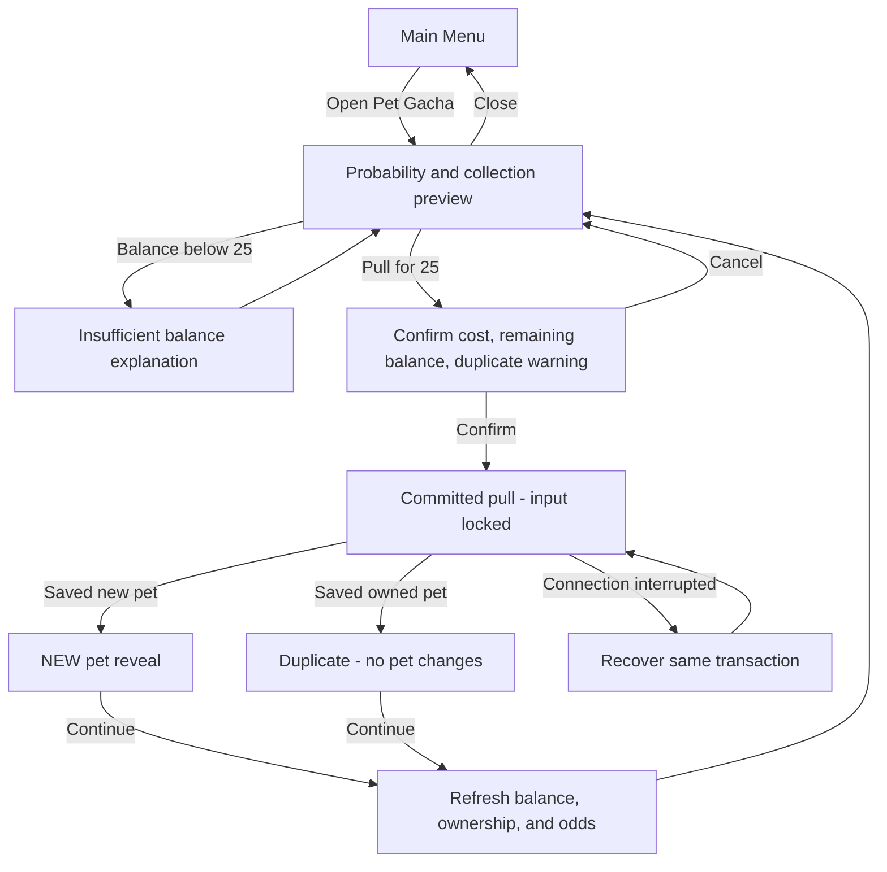

# Pet Gacha System - Design Spec

> Approved by the project owner on 2026-08-13 (`lgtm`). The compact reveal and ownership-only implementation slice are approved. Production catalog content remains data-authored input and is not invented by this spec.

## 1. Player Goal and Experience

From the Main Menu, the student opens Pet Gacha as a deliberate permanent-progression choice beside Weapon Ascend. The screen makes the trade explicit: current Power Coins, the fixed 25-Coin cost, balance after purchase, every pet's current probability, which pets are already owned, and the warning that duplicate pets grant nothing.

The student can inspect and cancel without cost. Once they confirm, the input acknowledges immediately and the pull becomes committed. A short fantasy reveal resolves into either:

- **New pet:** a bright ownership celebration that names the pet and clearly marks it `NEW`.
- **Duplicate:** a shorter, honest result that names the pet and states `Duplicate - no pet changes` without implying compensation.

After either result, the updated Power Coin balance and collection state are visible before the student can pull again. Refreshing or reconnecting during a committed pull returns the same saved outcome rather than charging or rolling again.

This fulfills the GDD pillars of **Expression** and **Ownership** while preserving trust: the player sees the probability and duplicate risk before making the irreversible choice.

## 2. System Rules

### Entry Conditions

- Pet Gacha is available from `MainMenuScene`, including while a completed Stage 200 run waits for Rebirth.
- Opening the panel never spends currency.
- Pull confirmation is enabled only when the authoritative balance is at least 25 Power Coins and no pull is already unresolved.

### Probability Disclosure

- Before confirmation, show each configured rarity category total and every pet's current calculated probability inside it.
- Mark every owned pet and repeat the empty-duplicate warning beside the confirm action.
- The displayed distribution is calculated from the same ownership snapshot used to request the authoritative pull; if that snapshot becomes stale, refresh the preview before allowing another confirmation.
- Internal probability totals must remain exact. **Starting display rule:** use adaptive precision up to four decimal places, never display a positive chance as `0%`, and show each rarity subtotal. Test whether 8 of 10 players can identify the most likely unowned pet and explain the duplicate risk; increase explanatory labels or precision if they cannot.

### Pull Commitment and Resolution

1. The student presses `Pull for 25`.
2. A confirmation state shows the exact cost, projected remaining balance, and empty-duplicate rule.
3. `Cancel` returns to the probability screen without cost.
4. `Confirm` creates one committed pull request and disables further pull input.
5. The authoritative result spends exactly 25 Power Coins and saves the selected pet result atomically.
6. A new pet adds permanent ownership. An owned pet is an empty duplicate and changes no pet state.
7. The result screen shows the saved result and updated balance.
8. `Continue` returns to the refreshed gacha preview; `Close` returns to the Main Menu.

### Rarity Redistribution

- Each rarity owns a fixed configured percentage of the complete pull probability.
- Inside a rarity, all pets begin with an equal share.
- While at least one pet in that rarity is unowned, each owned pet receives half its original equal share and the removed probability is divided equally among the unowned pets.
- When all pets in that rarity are owned, restore the original equal shares.
- Ownership changes distribution only inside the same rarity; it never transfers probability between rarities.

### Exit and Interruption Rules

- Closing before confirmation exits with no state change.
- After confirmation, navigation cannot cancel, refund, or reroll the committed pull.
- A timeout, refresh, browser close, or disconnect after confirmation resumes the same transaction result.
- A confirmed system failure that never committed a transaction leaves the balance and ownership unchanged and offers retry.
- A failure after commitment presents a recovery state until the same transaction can be read; it does not offer a fresh pull.

### Resource Cost

- Cost on confirmed entry: exactly 25 Power Coins, from `@tag:economy`.
- No cost on open, preview, cancel, or uncommitted failure.
- Rank Currency is never accepted.

## 3. Interaction Flow

## 4. Feedback Loops

| Trigger | Visual | Audio | Timing |
| --- | --- | --- | --- |
| Open gacha | Panel enters with balance, cost, rarity subtotals, per-pet odds, and owned badges already readable | Soft menu-open cue | **Starting value:** 180 ms panel transition; remove motion in Reduced Motion mode |
| Pull press | Button depresses, request state appears, all pull inputs disable | Short click/commit cue | Input acknowledgement begins in the same rendered frame |
| Confirm | Cost and projected balance pulse once before the reveal begins | Distinct spend/lock-in cue | **Starting value:** 150 ms pulse, then reveal |
| New pet | Pet art/name resolves with `NEW`, collection count increases, updated balance remains visible | Positive two-layer reveal stinger | **Starting value:** 900 ms reveal plus 600 ms readable hold |
| Duplicate | Pet art/name resolves with `DUPLICATE - NO PET CHANGES`; no fake shards, levels, or compensation appear | Neutral, shorter result cue | **Starting value:** 450 ms reveal plus 600 ms readable hold |
| Insufficient balance | Confirm remains disabled; missing Coin amount is shown next to the cost | Gentle error cue, never the only signal | Immediate, no blocking animation |
| Recovery | Persistent `Recovering your pull...` state with transaction-safe messaging | No looping warning sound | Remains until saved result or explicit uncommitted failure is known |

All proposed timings are **starting values**. Micro-test ten pulls on desktop WebGL and a mobile-sized viewport. Pass when input acknowledgment is visibly immediate, 9 of 10 testers can read the result before `Continue`, and no tester mistakes a duplicate for a reward. If acknowledgment feels delayed, remove pre-reveal motion; if results are missed, lengthen the readable hold in 150 ms increments.

## 5. Juice Specification

### Visual Feedback

- Use rarity-defined color and frame treatments supplied by approved content; do not infer final rarity names or colors.
- New-pet results may use a brief radial glow, icon scale settle, and `NEW` stamp.
- Duplicate results reuse the pet identity reveal at lower intensity and prioritize the explicit no-change message.
- Keep current balance and final cost visible during and after the reveal.
- Reduced Motion replaces scale/particle movement with a short opacity change and static rarity frame.
- Do not use screen shake for this menu action; readability and comfort take priority.

### Audio Feedback

- Separate cues for preview open, commitment, new pet, duplicate, and insufficient balance.
- A new-pet stinger is brighter and layered; a duplicate cue is shorter and neutral, not a failure alarm.
- Audio never carries unique information; text and icon states communicate every result.

### Physical Feedback

- No haptics are required for WebGL. Mobile haptics remain optional and must not be necessary to understand the outcome.

### Timing and Control

- No input buffer, coyote time, hitstop, or camera movement applies.
- Before `Confirm`, the student retains full cancel control.
- After `Confirm`, pull input is locked until the authoritative result or recovery state is shown.
- `Continue` cannot skip the minimum readable result hold; Reduced Motion shortens movement, not the reading interval.

### Mood

- New pet: clear, magical, earned, collectible.
- Duplicate: transparent, concise, emotionally neutral.
- Overall: trustworthy probability disclosure before spectacle.

## 6. Five-Component Evaluation

| Component | Design Requirement | Acceptance Signal |
| --- | --- | --- |
| Clarity | Show exact current odds, owned badges, fixed cost, projected balance, duplicate consequence, and recovery state before the next decision. | A new player predicts the cost and explains the new-versus-duplicate outcome in at least 8 of 10 observed pulls. |
| Motivation | Tie the pull to permanent ownership and future pet expression while making Weapon Ascend's shared-currency trade-off visible. | Players can state why they chose gacha over saving or ascending; no misleading reward implication drives the choice. |
| Response | Preview and cancel remain free; confirm acknowledges immediately; one committed request disables repeated input. | Spam and double-tap tests create only one pull and never leave the UI ambiguously enabled. |
| Satisfaction | New and duplicate outcomes each use coordinated visual and audio feedback at deliberately different intensity. | Observers distinguish new from duplicate without reading the balance or inspecting saved data. |
| Fit | Fantasy collection treatment supports pet ownership, while explicit probability math supports the project's educational identity and trust. | The screen feels part of the existing Main Menu and remains understandable on mobile-compatible WebGL. |

Priority when these conflict: Response, Clarity, Satisfaction, Fit, then Motivation.

## 7. Edge Cases and Abuse Risks

- **Repeated click/tap:** only the first confirmed transaction enters flight; controls stay disabled until resolution.
- **Back/close before confirm:** no spend and no transaction.
- **Back/refresh/close after confirm:** resume the same result; never refund-and-reroll.
- **Balance changes between preview and confirm:** reject the stale preview and refresh balance/odds without spending.
- **Exactly 25 Power Coins:** pull succeeds and displays a zero balance.
- **Below 25 Power Coins:** pull remains unavailable and no request is sent.
- **First-ever pull:** all pets are unowned, so every rarity divides equally within itself.
- **Some pets owned:** halve owned base shares and redistribute only within that rarity.
- **Rarity complete:** restore equal division; every result in that rarity is an empty duplicate.
- **Empty rarity or invalid total:** catalog is invalid and the pull UI must not offer confirmation.
- **Probability rounding:** display must not imply that totals or individual chances differ from the authoritative calculation.
- **Content removed after ownership:** preserve historical ownership safely and block a catalog revision that would make the active distribution invalid.
- **Low frame rate:** committed state and result text update independently of animation completion.
- **Missing art/audio:** fall back to readable name, rarity label, and result text; never block state recovery on presentation assets.
- **Duplicate dissatisfaction:** the warning is repeated at preview and confirmation; no pity, compensation, merge, or level gain is implied.
- **Economy abuse:** transaction identifiers, authoritative balance checks, and saved results prevent double-spend, double-grant, and reroll-by-reconnect.

## 8. Playtest Scenarios

### New Player Test

- Give the player 50 Power Coins and one visible owned pet.
- Ask them to explain the cost, remaining balance, most likely unowned pet, and duplicate outcome before confirming.
- Starting pass target: correct explanations for at least 8 of 10 observations without adult instruction.

### Stress and Recovery Test

- Spam Pull, Confirm, Cancel, Continue, browser back, refresh, and reconnect across every state.
- Pass only if each transaction spends and resolves no more than once and the recovered result never changes.

### Skill and Decision Test

- Present Pet Gacha beside Weapon Ascend at early, middle, and late progression snapshots.
- Ask players to describe the trade-off; flag any point where one option is perceived as obviously deceptive or always wrong.

### Abuse Test

- Retry the same transaction ID, use stale ownership/balance revisions, interrupt after spend but before reveal, and complete a rarity.
- Pass only if no route creates a free reroll, refund plus reward, duplicate compensation, or cross-rarity probability transfer.

### Readability and Accessibility Test

- Observe new and duplicate results with sound on, muted, Reduced Motion on, and a mobile-sized viewport.
- Starting pass target: observers identify result type, cost, and saved consequence in at least 8 of 10 pulls under every presentation mode.

## 9. Tuning Priority

1. Fix input acknowledgment and transaction-state clarity.
2. Fix probability, cost, and duplicate-message comprehension.
3. Tune result hold and visual/audio differentiation.
4. Tune fantasy intensity to approved pet art and rarity content.
5. Balance rarity rates, pet stats, and the choice against Weapon Ascend only after the catalog and economy targets are approved.

## 10. GDD Alignment and Human Decisions

### Alignment

- `@tag:core-loop`: adds the Lobby's Power Coin gacha branch.
- `@tag:combat-stats`: preserves a future path for equipped Pet ATK without defining undocumented values.
- `@tag:economy`: uses the fixed 25-Power-Coin cost and never spends Rank Currency.
- `@tag:gacha`: implements fixed rarity totals, owned-pet redistribution, rarity-complete reset, probability disclosure, and empty duplicates.
- `@tag:server-authority`: treats confirm as an idempotent authoritative transaction and reconnects to the saved result.
- `@tag:feedback`: uses visual plus audio feedback and protects response and clarity before spectacle.
- Primary platform: Unity WebGL pointer input, with touch-compatible target sizing and Reduced Motion support.

### Required Human Decisions Before Architecture

1. **Content:** approve the rarity categories and fixed rates, pet membership per rarity, pet names/art, and pet stat definitions. The GDD provides an SSR example but does not define the production catalog.
2. **Implementation slice:** choose whether this feature includes pet equip/loadout and Pet ATK application, or ends at permanent ownership plus profile projection.
3. **Presentation:** approve this compact reveal direction or request a more elaborate summon sequence; any longer animation must retain skip/readability and Reduced Motion behavior.
4. **Economy target:** define the intended early/mid/late choice between a 25-Coin pull and Weapon Ascend so rarity/stat balance can be tested rather than guessed.

Architecture and code must wait until these design decisions and this checkpoint are approved.
