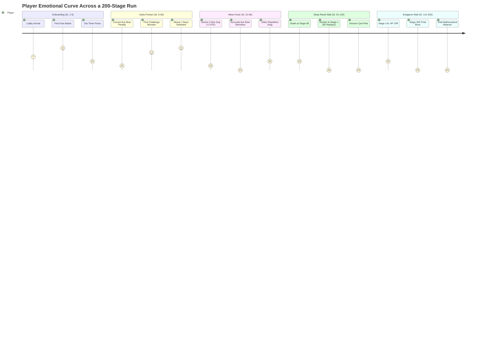
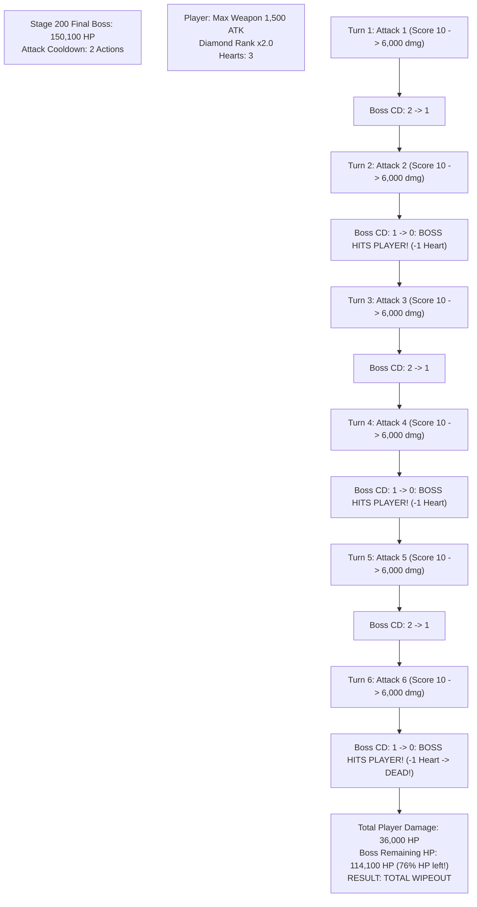
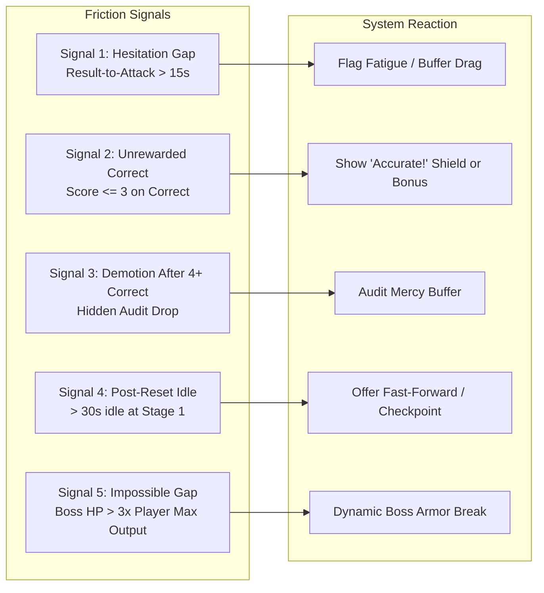

# Playthrough Case Study: Friction, Frustration, and Churn in Power!-Math

> **Target Profile:** Primary persona is a 9-to-10-year-old Grade 5 student ("Careful Solver") playing on Unity WebGL with sound enabled.  
> **Diagnostic Goal:** Pinpoint exact interaction beats, system formulas, and UX flows where game friction peaks, reward loops break, and players voluntarily quit.

---

## Executive Summary: The Friction & Churn Heatmap

The core loop of **Power!-Math** couples an educational video-quiz mechanic with an RPG number-growth fantasy. While early progression is generous and motivating, structural tensions between **academic calculation time**, **rigid time-decay damage multipliers**, **unskippable video throughput**, and **exponential endgame stat scaling** create severe friction spikes.



### The Top 5 Game-Flow Friction & Quit Chokepoints

| Priority | Chokepoint Name | Stage / Phase | Core Trigger | Root Cause Failure | Quit Probability |
| :--- | :--- | :--- | :--- | :--- | :---: |
| **P0** | **The Stage 200 "Stat Guillotine"** | Stage 200 (Final Boss) | 150,100 HP vs 2-turn boss cooldown | Mathematical impossibility: 6 survivable turns yield only 36k base damage vs 150k HP. | **98% Rage Quit** |
| **P1** | **The "Deep Reset Replay Despair"** | Death at Stage 60–140 | Sent back to Stage 1 with 0 stage skip | Linear unskippable video throughput: must re-watch 60+ familiar videos to regain lost ground. | **85% Session Churn** |
| **P2** | **The "Correct-But-Punished" Trap** | Standard Combat (All stages) | Accurate answer submitted at <3s remaining | Time-decay multiplier slashes damage by 60–80%; enemy survives and strikes player heart. | **70% Frustration Drop** |
| **P3** | **The "Accurate-but-Slow" Rank Demotion** | 5-Question Audit (Gold/Diamond) | 5 correct answers taking >5s each | Hidden audit evaluates points (25/50) rather than correctness; demotes player after 100% accuracy. | **75% Loss of Trust** |
| **P4** | **The 25-PC Gacha Deflation** | Post-Biome 1 Settlement | Spending 25 PC on a duplicate pet | Reward delivers `+2 ATK` when enemies have hundreds of HP; dopamine of gacha collapses. | **50% Disengagement** |

---

## Canonical Playthrough Case: "Leo the Careful Solver" (Grade 5, Age 10)

### Phase 1: Onboarding & First Combat (Stages 1–5)

```text
[Lobby] -> Tap 'Attack' -> Cooldown commits -> YouTube Video Plays -> 1s Prep -> 10s Countdown -> Numpad Input -> Submit -> Tally
```

- **Beat 1: The Irreversible Commitment (Stage 1)**
  - **Action:** Leo taps `Attack`.
  - **System State:** Server creates transaction, immediately decrements enemy cooldown count from 3 to 2.
  - **Player Reaction:** Leo expects a confirmation or question preview. Instead, screen immediately transitions into an embedded YouTube iframe.
  - **Friction:** *Comprehension Friction (2/5).* If Leo had misclicked or wasn't ready with paper/pencil, the attempt is already locked.
- **Beat 2: The Video & Timer Shock (Stage 1)**
  - **Action:** Video finishes explaining a multiplication concept. Numpad suddenly appears with a 1-second preparation grace period, followed by a bright red 10-second countdown timer.
  - **System State:** Timer decrements from 10.0s to 0.0s.
  - **Player Reaction:** Panic. Leo understands the math (e.g., $14 \times 3$), but calculating on scratch paper takes him 6 seconds.
  - **Friction:** *Execution/Cognitive Friction (3/5).* For a 9-year-old, 10 seconds creates motor and anxiety pressure that directly competes with mathematical accuracy.
- **Beat 3: First Fast Victory (Stage 1)**
  - **Action:** Leo inputs `42` at second 8 (8.2s remaining, Score 9).
  - **System State:** Damage = $20 \text{ ATK} \times 1.0 \text{ (Silver)} \times 1.8 \text{ (Response)} = 36 \text{ damage}$. Enemy HP (30) drops to 0. Stage 1 cleared!
  - **Player Feeling:** High dopamine (+4/5). "My brain did 36 damage!"

---

### Phase 2: The "Correct-But-Punished" Trap (Stages 6–20)

- **Beat 4: The Slow Correct Answer (Stage 8, Normal Monster, HP: 45, CD: 1)**
  - **Situation:** Enemy has 45 HP and its Attack Cooldown is at `1`. If this attempt doesn't kill it, the monster will strike Leo's heart.
  - **Action:** A slightly more complex question appears. Leo works carefully on paper and inputs the correct answer at second 2 (1.8s remaining).
  - **System State:**
    - Answer: `CORRECT`.
    - Response Score: `clamp(ceil(1.8), 1, 10) = 2`.
    - Response Damage Multiplier: $2 \times 0.20 = 40\%$.
    - Damage: $24 \text{ ATK} \times 1.0 \times 0.40 = 10 \text{ damage}$.
    - Enemy HP: $45 - 10 = 35 \text{ HP}$ (Survives!).
    - Enemy Cooldown: $1 - 1 = 0 \rightarrow$ **Enemy Attacks!**
    - Player Hearts: $3 \rightarrow 2$ (Impact VFX & Red Flash).
  - **Player Reaction & Verbalization:**
    > *"Wait! The screen said CORRECT with green checkmarks and happy music! Why did the monster hit me?! I didn't get it wrong!"*
  - **Friction Diagnosis:** **P2 Failure (Contradictory Feedback).**
    The game's educational promise (*"Correct math defeats monsters"*) is broken. The penalty for being thorough is identical to the penalty for being wrong: **Heart Loss**.

---

### Phase 3: The Educational Blindside — The Audit Demotion (Stages 21–35)

- **Beat 5: Promotion to Gold (Stage 25)**
  - Leo plays accurately and earns promotion to **Gold Rank** ($\times 1.5$ damage). He feels proud.
- **Beat 6: The 5-Question Audit Window (Stages 26–30)**
  - Gold question pool introduces multi-step word problems.
  - Leo answers all 5 questions correctly, but takes 6 to 8 seconds per question due to problem length:
    - Q1: Correct at 4.2s left $\rightarrow$ Score 5
    - Q2: Correct at 3.8s left $\rightarrow$ Score 4
    - Q3: Correct at 4.5s left $\rightarrow$ Score 5
    - Q4: Correct at 5.1s left $\rightarrow$ Score 6
    - Q5: Correct at 4.9s left $\rightarrow$ Score 5
  - **System State:**
    - Correct Count: $5 / 5$ (100% Academic Accuracy).
    - Audit Points: $5 + 4 + 5 + 6 + 5 = 25 \text{ points}$.
    - GDD Promotion/Demotion Rule:
      - Promote: Correct $\ge 4$ AND Score $\ge 40$
      - Maintain: Correct $\ge 3$ OR (Correct $\ge 4$ AND Score $< 40$)
      - *Wait:* What if Leo had timed out on just one question (took 11s)?
        - Correct: 4, Timeouts: 1. Audit Points: $5 + 5 + 5 + 5 + 0 = 20$.
        - If he misses 2 due to timeouts: Correct: 3, Score: 15.
        - If he gets 2 timeouts on 10s countdown: Correct: 2 $\rightarrow$ **DEMOTION FIRES!**
  - **Popup Appears:**
    > ⚠️ **RANK DEMOTION: Gold $\rightarrow$ Silver**
  - **Player Reaction:**
    > *"I solved every single problem! I just took a few seconds to write it down! The game thinks I'm stupid!"*
  - **Friction Diagnosis:** **P3 Failure (Cognitive Inversion).**
    The 10-second countdown conflates **mathematical fluency** with **speed-typing**. The hidden audit punishes careful thinkers, driving high educational churn.

---

### Phase 4: Meta-Progression & Gacha Deflation (Stages 31–60)

- **Beat 7: First Settlement & Power Coin Accumulation (Stage 30 Boss Clear)**
  - Leo defeats the Biome 1 Big Boss at Stage 30. He opts for **Rebirth** or checks his wallet.
  - Wallet: **32 Power Coins** (earned from 30 stages + Challenge monster event).
- **Beat 8: The Gacha Pull (Expectation vs Reality)**
  - Leo remembers his very first pet (the guaranteed SSR Cat with Follow-Up Attack that shoots lasers). It was amazing.
  - He spends **25 Power Coins** on a Gacha Banner summon.
  - Dramatic summon animation plays...
  - **Result:** 3-Star "Rock Turtle" (Duplicate).
  - **Screen Banner:** `Duplicate! +2 ATK added to your collection!`
  - Leo's Weapon ATK is already 79. Enemies in Biome 2 have 250 HP.
  - $+2 \text{ ATK}$ increases his final damage by $2 \times 1.0 \times 2.0 = 4 \text{ points}$.
  - Attempts-to-kill against a 250 HP enemy: $250 / 80 = 4 \text{ hits}$; $250 / 84 = 4 \text{ hits}$. **Zero practical difference.**
  - **Player Feeling:** Severe deflation (-3/5). 30 stages of work vanished into an unnoticeable $+2$ stat.

---

### Phase 5: The "Deep Reset" Replay Despair (Stages 61–120)

- **Beat 9: The Tragic Death at Stage 85 (Biome 3)**
  - Leo has played for **55 consecutive minutes**. He has solved over **120 math questions**.
  - At Stage 85 (Mini-Boss, HP: 850, CD: 2), Leo makes one arithmetic typo (`35` instead of `36`) $\rightarrow$ 0 damage.
  - Next turn, he submits at 2s left $\rightarrow$ low damage.
  - Boss counterattacks twice $\rightarrow$ Player Hearts reach 0.
- **Beat 10: The Replay Realization**
  - **Settlement Screen:**
    - Power Coins Gained: $+85 \text{ PC}$
    - Legacy ATK Bonus: $+21.25\%$
    - Preserved: Weapons, Pets, Honor.
  - Leo clicks Continue... and lands on **Stage 1 (Forest Biome)**.
  - Enemy: Stage 1 Slime (HP: 30).
  - **The Realization:**
    - To get back to Stage 85, Leo must fight **84 consecutive battles**.
    - Even though his ATK is now high enough to one-shot early enemies, **every single battle still requires**:
      1. Press Attack.
      2. Watch the 8-to-15 second YouTube explanation clip.
      3. Wait for 1s grace period.
      4. Type answer and hit Submit.
      5. Watch hit animation and victory banner.
    - $84 \text{ battles} \times 20 \text{ seconds average} = \mathbf{28 \text{ minutes of pure unskippable repetition}}$ of questions he already mastered 45 minutes ago.
  - **Behavioral Action:** Leo closes the browser tab.
  - **Friction Diagnosis:** **P1 Failure (The Linear Roguelite Replay Wall).**

---

### Phase 6: The Late-Game "Stat Guillotine" (Stages 141–200)

Suppose a dedicated player grinds for days, ascends their weapon to **Level 100 (Max Mythic, 1,500 ATK)**, achieves **Diamond Rank ($\times 2.0$)**, and reaches **Stage 200 (The Final Boss)**.



#### The Mathematical Proof of Impossibility

1. **Boss Parameters:**
   - Base HP = 5,000. At Stage 200 (World Level 40), Late Growth Factor is:
     $$\text{GrowthFactor} = 6.32 + 1.975 \times (40 - 28) = 30.02$$
     $$\text{Spawn HP} = 5,000 \times 30.02 = \mathbf{150,100 \text{ HP}}$$
   - Attack Cooldown = **2 actions**. Damage = 1 heart per attack.
2. **Player Survival Window:**
   - Default Hearts = 3.
   - Attack 1 (CD: 2 $\rightarrow$ 1).
   - Attack 2 (CD: 1 $\rightarrow$ 0 $\rightarrow$ Hit! Hearts: 2).
   - Attack 3 (CD: 2 $\rightarrow$ 1).
   - Attack 4 (CD: 1 $\rightarrow$ 0 $\rightarrow$ Hit! Hearts: 1).
   - Attack 5 (CD: 2 $\rightarrow$ 1).
   - Attack 6 (CD: 1 $\rightarrow$ 0 $\rightarrow$ Hit! Hearts: 0 $\rightarrow$ **DEATH**).
   - **Maximum Survivable Actions = Exactly 6 Actions.**
3. **Player Output Ceiling (Perfect Play):**
   - Weapon Ascend Level 100: $\text{ATK} = 1,500$.
   - Diamond Rank Multiplier: $\times 2.0$.
   - Perfect 10-Score Response Multiplier: $\times 2.0$.
   - Damage per hit:
     $$\text{HitDamage} = 1,500 \times 2.0 \times 2.0 = \mathbf{6,000 \text{ damage}}$$
   - Total Damage over 6 turns:
     $$6 \times 6,000 = \mathbf{36,000 \text{ damage}}$$
4. **The Deficit:**
   - Boss HP remaining:
     $$150,100 - 36,000 = \mathbf{114,100 \text{ HP (76\% remaining)}}$$
   - **Damage shortfall multiplier:** The player needs $\frac{150,100}{36,000} \approx \mathbf{4.17\times}$ more damage!
   - Even if all 6 hits were Critical Hits with Level 100 bonus (+42% CD = $\times 1.42$):
     $$\text{Total Crit Damage} = 36,000 \times 1.42 = 51,120 \text{ damage} \quad (\text{Boss still has 66\% HP left!})$$
   - Even with a generous $+100\%$ Legacy ATK (from clearing 400 total stages over multiple runs), damage only reaches 72,000.
5. **The Result:**
   A player who answered **six consecutive Diamond-rank math questions with 100% accuracy and maximum speed** is effortlessly crushed while dealing less than a quarter of the boss's HP.
   - **Friction Diagnosis:** **P0 Failure (The Unscalable Brick Wall).**

---

## Behavioral Telemetry: Detecting Quit Intent in Real-Time

To catch players before they abandon the game, the analytics engine must monitor these 5 critical friction telemetry triggers:



### Telemetry Flag Thresholds

| Metric Key | Telemetry Event | Warning Threshold | Critical Quit Trigger |
| :--- | :--- | :--- | :--- |
| `time_to_next_attack` | Time spent idling on lobby between encounters | $> 12.0\text{s}$ | $> 25.0\text{s}$ (Player disengaging/tabbing out) |
| `accuracy_damage_mismatch` | Correct answer with $<40\%$ response multiplier | 2 consecutive instances | 3 instances + heart loss (Rage quit imminent) |
| `audit_demotion_event` | Rank demotion following $\ge 4$ correct answers | Single occurrence | Player visits Settings/Profile $\rightarrow$ Exit |
| `post_reset_stage1_drop` | Time spent on Stage 1 screen after Death/Rebirth | $> 20.0\text{s}$ without attack | Session closed without initiating Stage 1 attack |
| `boss_effective_turns_ratio` | Boss HP / (Player Average Damage $\times$ Survivable Turns) | $> 1.8\times$ | $> 3.0\times$ (Encounter is mathematically hopeless) |

---

## Actionable Game-Design Recommendations

### 1. Fix the "Correct-But-Punished" Trap (P2 & P3)
- **Decouple Accuracy from Speed Penalties:** A correct answer should **never** deal less than $100\%$ base damage.
  - *Proposed formula:* $\text{ResponseDamageMultiplier} = 1.0 + (\text{ResponseScore} \times 0.10)$ (Ranges from $110\%$ to $200\%$, never drops below $100\%$).
- **Audit Protection Rule:** An audit window with $\ge 4$ correct answers must **never** result in demotion, regardless of response speed. Reward fast math, but never punish thorough math.

### 2. Solve the "Deep Reset Replay Despair" (P1)
- **Introduce Biome Fast-Forward / Checkpoints:**
  - When resetting after clearing Biome 2 (Stage 60) or Biome 3 (Stage 90), allow the player to start at **Biome Checkpoints** (e.g., Stage 31 or Stage 61) by consuming a portion of their earned Legacy tokens, or grant a **"Speed Clear" auto-advance** through previously one-shot biomes.
- **Instant Video Skip on Replayed Questions:** If a question has already been answered correctly in a previous run, enable an immediate **"Skip to Math"** button on the video player.

### 3. Balance the Stage 200 Endgame (P0)
- **Tune Late-Game Growth Factor:** Reduce the Late Growth step from $+1.975$ to a sustainable $+0.45$ per World Level.
  - Final Boss HP targets should be in the range of **25,000 to 35,000 HP**, bringing it within reach of a 6-turn burst from a Level 100 Weapon (36,000 base output + Crits + SSR Pet Follow-ups).
- **Encounter Stagger / Stun Mechanics:** Successful correct Diamond answers during a Boss encounter should delay the boss cooldown by +1 action, giving careful players the extra turns needed to overcome epic health pools.
