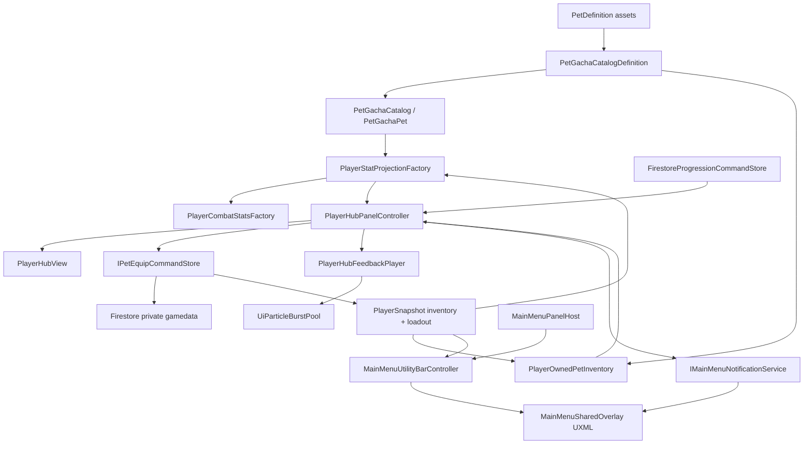
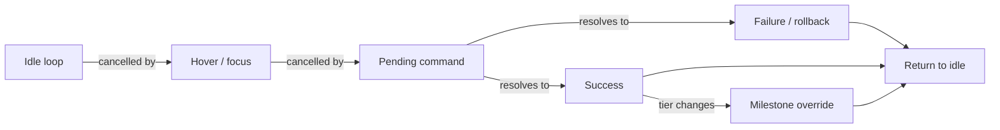

# Player Hub Data and Presentation Polish - Architecture Plan

## 1. Architecture Goal

Implement the approved Player Hub as one full-screen, visual-first equipment destination while preserving the existing authoritative Weapon Ascension and Pet Gacha boundaries.

The architecture adds four focused capabilities:

1. Canonical reusable pet definitions referenced by Pet Gacha, owned inventory, Player Hub, and stat projection.
2. A validated `PlayerOwnedPetInventory` read model over the existing saved inventory and one idempotent Pet Equip command.
3. A shared Main Menu overlay containing the utility bar, semantic notifications, and pooled UI effects.
4. A Player Hub view/feedback split so data orchestration does not become an animation god-object.

No package, build, CI, Firestore rule, backend deployment, or scene-hierarchy change is required. The implementation reuses UI Toolkit, the installed LeanTween layer, existing AudioSource, and current Reduced Motion setting.

## 2. Current and Target Boundaries

| Concern | Current implementation | Target architecture |
| --- | --- | --- |
| Pet identity | Nested `PetGachaCatalogDefinition.PetContent` | `PetDefinition` ScriptableObject referenced by each gacha rarity |
| Pet runtime stats | Hard-coded `petAttack = 0` | Approved Pet ATK resolved from equipped, owned, valid pet definition |
| Ownership | `PlayerSnapshot.inventory` records | Same persistence plus `PlayerOwnedPetInventory` validation/projection |
| Equip | `loadout.petId` is read-only in UI | One tile tap starts an idempotent conditional Firestore equip command |
| Player Hub | One controller queries and renders modal UI | Controller orchestrates; view renders; feedback player owns animation/audio |
| Top utility | Panel-local close buttons and separate currency placements | One shared overlay bar driven by panel-host open/close events |
| Status messages | Panel-local labels | Reusable semantic notification queue, with local labels retained only where detailed context is useful |
| Motion | USS hover transitions and Main Menu LeanTween transitions | USS state transitions plus cancellable LeanTween sequences and pooled UI particles |

## 3. System Diagram



### Presentation Priority



Higher-priority sequences cancel lower-priority tweens before taking ownership of scale, translate, opacity, or color. No two sequences write the same property concurrently.

## 4. Pet Data Model

### Unity content

```csharp
public sealed class PetDefinition : ScriptableObject
{
    public string PetId { get; }
    public string DisplayName { get; }
    public Sprite Icon { get; }
    public Sprite PreviewSprite { get; }
    public int AttackBonus { get; }
    public string AbilityRichText { get; }

    public bool TryBuild(out PetGachaPet pet, out string error);
}
```

- Naming follows the repository's `Definition` suffix policy.
- `PetId`, display name, icon, preview sprite, approved Pet ATK, and rich-text description have one canonical authoring location.
- Rarity remains gacha membership data inside `PetGachaCatalogDefinition.RarityContent`; it is not duplicated in `PetDefinition`.
- `AttackBonus` is non-negative. Existing approved prototype pets migrate with `0` because no non-zero balance values are approved.
- `AbilityRichText` is presentation only in this slice. It cannot activate an effect or contribute an undocumented stat.
- Missing preview art falls back to the icon. Missing identity/icon remains a validation error.

### Gacha catalog migration

`PetGachaCatalogDefinition.RarityContent.pets` changes from nested `PetContent[]` to `PetDefinition[]`. `TryBuildCatalog` maps each asset into `PetGachaPet`, which gains immutable `AttackBonus` while leaving the probability engine unchanged.

The existing `PetGachaCatalog.asset` is migrated in place:

- Create 15 `PetDefinition` assets under `Assets/Project/Resources/Pets/Definitions/`.
- Preserve all approved IDs, names, rarity membership, rates, and placeholder icon references.
- Set Pet ATK to `0` and rich-text content empty until owner-authored content is supplied.
- Update catalog tests to prove IDs, rates, rarity membership, and lookup behavior are unchanged.

## 5. Owned Inventory and Stat Resolution

```csharp
public sealed class PlayerOwnedPetInventory
{
    public IReadOnlyList<OwnedPetEntry> Entries { get; }
    public string EquippedPetId { get; }

    public static bool TryCreate(
        PlayerSnapshot player,
        PetGachaCatalogDefinition definitions,
        out PlayerOwnedPetInventory inventory,
        out string error);

    public bool TryGetOwned(string petId, out OwnedPetEntry entry);
}
```

Rules:

- Read only from `PlayerSnapshot.inventory`; never persist another pet collection.
- Ignore valid non-pet items such as the canonical weapon record.
- Reject duplicate recognized pet IDs, negative/non-zero pet upgrade levels, recognized pets with `owned = false`, an equipped unknown pet, and an equipped unowned pet.
- Empty `loadout.petId` is valid.
- The ordered UI list follows catalog rarity order, then authored pet order; persistence order does not control presentation.
- Unknown inventory items that are not in the current pet catalog remain preserved for forward compatibility and do not become pet tiles.

`PlayerStatProjectionFactory` receives the immutable `PetGachaCatalog` runtime catalog. When `loadout.petId` is empty, Pet ATK is zero. Otherwise it requires exactly one owned matching inventory record and a catalog definition, then adds `AttackBonus` before the existing Legacy multiplier. Invalid equipped state fails closed rather than silently substituting another pet.

The catalog parameter is threaded through:

- `PlayerCombatStatsFactory`
- `CombatLobbyCompositionRoot`
- `PlayerHubPanelController`
- `RunSettlementPanelController`

No second stat formula is introduced.

## 6. Pet Equip Command Boundary

```csharp
public readonly struct PetEquipCommand
{
    public string TransactionId { get; }
    public string PetId { get; }
    public long PreviewRevision { get; }
}

public readonly struct PetEquipReceipt
{
    public string TransactionId { get; }
    public string PetId { get; }
    public long ResultingRevision { get; }
}

public interface IPetEquipCommandStore
{
    IEnumerator Equip(
        PetEquipCommand command,
        Action<PetEquipReceipt> completed,
        Action<PetEquipFailure> failed);
}
```

`FirestorePetEquipCommandStore` is a focused adapter beside `FirestorePetGachaCommandStore`. It follows ADR-006/008/010's direct-Firestore prototype rules:

1. GET the private student document and authoritative update time.
2. Validate saved revision, active-attempt/defeat gate, inventory shape, target ownership, catalog identity, loadout, and last equip receipt.
3. Return the matching saved receipt without a second write.
4. Reject stale preview before mutation and refresh local authoritative fields.
5. PATCH revision, `loadout.petId`, and the complete last-equip receipt with an update-time precondition.
6. Update `PlayerSnapshot` only after acknowledgement, then call `PlayerSessionStore.NotifyAuthoritativeUpdate()`.

### Schema extension

```text
competition/{levelId}/{student}.gamedata
  revision
  loadout
    petId
  economy
    lastPetEquipTransactionId
    lastPetEquipPetId
```

The implementation extends `PlayerSnapshot.EconomyData`, `PlayerDefaultsPlanner`, `FirestoreRestClient`, and reset/migration fixtures with missing-safe string fields. The schema version does not increment because these are optional missing defaults within the existing v2 shape; valid existing values are never overwritten.

### Immediate-tap UX versus authority

- Tile tap immediately selects the tile, updates the preview, plays anticipation, and shows a provisional companion plus `EQUIPPING` badge.
- Only one transaction ID/coroutine is active. Other tile, tab, and back actions are gated until resolution.
- Success transfers the acknowledged equipped badge and applies stat/companion success feedback.
- Failure restores the previous acknowledged companion/badge, keeps the tapped pet preview available, and publishes a semantic notification.
- Tapping the already equipped pet refreshes preview/selection feedback but performs no network write.

## 7. Shared Main Menu Overlay

Add one `MainMenuSharedOverlay.uxml` and `MainMenuSharedOverlay.uss` instance after feature panels in `MainMenuUI.uxml`. It owns:

- `main-menu-utility-bar`: destination title, Power Coin icon/value, context back/exit.
- `main-menu-notification-layer`: one visible semantic notification with queued/coalesced messages.
- `main-menu-ui-fx-layer`: pooled particle elements and non-interactive feedback overlays.

### Utility bar

Extend `IMainMenuPanelHost` with `PanelOpened` and `TryCloseCurrent()`. `MainMenuUtilityBarController` listens to `PanelOpened`/`PanelClosed`, renders the current Power Coin value from `PlayerSessionStore.Changed`, and maps these destinations:

- `WorldMap` -> `BIOME MAP`
- `PlayerHub` -> `PLAYER HUB`
- `ProfileAnalytics` -> `PROFILE`
- `PetGacha` -> `PET GACHA`
- `Leaderboard` -> `LEADERBOARD`

The shared back/exit button replaces visible local close buttons for those five panels. Panel controllers receive `IMainMenuUtilityBar` so pending authoritative actions can temporarily disable back. Rebirth and Admin retain their special local controls because their terminal/destructive semantics differ.

### Notification service

```csharp
public enum MainMenuNotificationKind
{
    Info,
    Warning,
    Success,
    Error,
    Milestone
}

public interface IMainMenuNotificationService
{
    void Publish(MainMenuNotification message);
    void Clear(string channel);
}
```

`MainMenuNotificationController` owns a bounded in-memory queue, coalesces repeated identical channel/message pairs, renders one notification at a time, and never changes player state. Detailed transaction recovery remains in the owning panel; the notification is an additional universal signal, not the sole explanation.

`MainMenuSharedUiProvider.GetOrCreate(...)` is an idempotent composition helper used by both `CombatLobbyCompositionRoot` and `SocialProfileCompositionRoot`, avoiding Start-order assumptions and duplicate overlay controllers.

## 8. Player Hub Presentation Split

| Class | Responsibility | Depends on | Owned state |
| --- | --- | --- | --- |
| `PlayerHubPanelController` | Open/close, tabs, player-session refresh, command orchestration, input gate | View, stores, projections, feedback, notification, utility bar | Active tab, pending transaction, previous acknowledged pet |
| `PlayerHubView` | Query/cache UI Toolkit elements, build/reuse pet tiles, render semantic states | Root, definitions | Tile views and selected ID only |
| `PlayerHubFeedbackPlayer` | Standard animation/audio sequences and priority cancellation | Host GameObject, view targets, juice profile, AudioSource | Tween IDs/generation and idle state |
| `PlayerHubJuiceProfileDefinition` | Author timing, easing, colors, pooled counts, optional audio | Unity assets | Serialized tuning only |
| `UiParticleBurstPool` | Preallocate/reuse particle VisualElements | FX layer, host GameObject | Fixed pool and active tween IDs |
| `MainMenuUtilityBarController` | Shared destination/currency/back presentation | Panel host, session store | Current context and back enabled state |
| `MainMenuNotificationController` | Queue/coalesce/render semantic messages | Overlay view, juice profile | Bounded transient queue |

The current `PlayerHubPanelController` retains Weapon Ascension command ownership but delegates rendering and feedback. It does not calculate stats, create per-frame particles, or write style animation loops itself.

## 9. Weapon Ascend Feedback Architecture

The existing `WeaponAscensionCatalogDefinition` already provides ordered `unlockLevel`, icon, appearance, and `milestoneFeedbackKey`; no milestone levels are invented.

### State mapping

| Trigger | Data decision | Presentation call |
| --- | --- | --- |
| Hub/Weapon tab idle | No state change | `PlayWeaponIdle()`; cancelled on other sequence |
| Insufficient balance tap | No command call | Publish Warning notification, pulse shortfall/coins, nudge button |
| Valid tap | Existing `AscendWeapon` transaction | Stop idle, show pending state, lock conflicting input |
| Saved non-milestone | Apply returned stats/revision/balance | Interpolate stat text, icon squash/bounce, normal pooled burst, success notification/audio |
| Saved milestone | Resolved tier differs from previous tier | Normal success plus milestone ring/pose/larger pooled burst and `milestoneFeedbackKey` notification/audio |
| Save failure | No local mutation | Restore current values, error notification, failure nudge/audio |

The upgrade button remains focusable/clickable when the only blocker is insufficient currency so it can react and explain the shortfall. It remains disabled for busy, committed-question, defeat-settlement, invalid-data, or maximum-level states.

## 10. Standard Animation Implementation

- **USS transitions:** hover/focus/selected/equipped colors, borders, small scale changes, opacity, Reduced Motion classes.
- **LeanTween sequences:** open/tab choreography, anticipation, squash/stretch, bounce/overshoot, follow-through, stat interpolation, failure nudge, notification entry/exit, idle loops.
- **Pooled VisualElements:** weapon success/milestone particles; created once and reused with `PickingMode.Ignore`.
- **AudioSource.PlayOneShot:** optional clips from the juice profile/catalog; semantic UI remains complete without audio.
- **Scheduling:** coroutines/tween completion callbacks and UI Toolkit events; no custom `Update()` polling and no allocations per idle frame.
- **Reduced Motion:** cancel idle loops, replace spatial/scale/particle sequences with short opacity/color changes, preserve immediate final state and notifications.

Starting timing and intensity values come only from the approved design spec and remain serialized in `PlayerHubJuiceProfileDefinition` for playtest tuning.

## 11. Authority Decisions

| Decision | Choice | Rationale |
| --- | --- | --- |
| Pet ownership | Existing private `inventory` array | Gacha already writes it atomically; a second list would drift |
| Equipped pet | Private `loadout.petId` plus last receipt | Persistent, recoverable, and consistent with public projection |
| Pet stats | Derived from canonical content plus valid owned/equipped ID | Prevents redundant/tamper-prone saved derived stats |
| Pet equip authority | Direct Firestore prototype with update-time precondition | Extends accepted ADR-006/008/010 limitation without deployment scope |
| Weapon power | Existing level/policy | ADR-008 remains authoritative; feedback does not alter calculations |
| Milestones | Existing weapon tier catalog | Avoids hard-coded/invented milestone levels |
| Notifications | Scene-local transient presentation | Must never become gameplay state or persist across sessions |
| Animation | Data-driven presentation only | Missing/cancelled animation cannot block or reverse an acknowledged save |

## 12. Assembly and Dependency Plan

- Extend `PowerMath.Gameplay.Pets.Core` models only with immutable `AttackBonus`; retain no Unity references.
- Add `PetDefinition` to `PowerMath.Gameplay.Pets.Unity`.
- Keep `PlayerOwnedPetInventory`, equip command/store, Player Hub, shared overlay, and stat integration in the existing main Unity assembly because they depend on `PlayerSnapshot` and scene/UI composition.
- Do not add a circular reference from the Pets asmdefs to `Assembly-CSharp`.
- Do not add another tween, reactive, DI, or notification package.

## 13. Affected Files

### New code/content

- `Assets/Project/Script/Gameplay/Pets/Unity/PetDefinition.cs`
- `Assets/Project/Script/Gameplay/Pets/PlayerOwnedPetInventory.cs`
- `Assets/Project/Script/Gameplay/Pets/PetEquipModels.cs`
- `Assets/Project/Script/Gameplay/Pets/FirestorePetEquipCommandStore.cs`
- `Assets/Project/Script/UI/MainMenu/Shared/MainMenuSharedUiProvider.cs`
- `Assets/Project/Script/UI/MainMenu/Shared/MainMenuUtilityBarController.cs`
- `Assets/Project/Script/UI/MainMenu/Shared/MainMenuNotificationController.cs`
- `Assets/Project/Script/UI/MainMenu/RunEconomy/PlayerHubView.cs`
- `Assets/Project/Script/UI/MainMenu/RunEconomy/PlayerHubFeedbackPlayer.cs`
- `Assets/Project/Script/UI/MainMenu/RunEconomy/PlayerHubJuiceProfileDefinition.cs`
- `Assets/Project/Script/UI/MainMenu/RunEconomy/UiParticleBurstPool.cs`
- `Assets/Project/UI/MainMenu/MainMenuSharedOverlay.uxml`
- `Assets/Project/UI/MainMenu/MainMenuSharedOverlay.uss`
- `Assets/Project/Resources/PlayerHubJuiceProfile.asset`
- `Assets/Project/Resources/Pets/Definitions/*.asset` (15 migrated definitions)

### Modify data/runtime

- `PetGachaModels.cs` - add immutable Pet ATK field without changing probability behavior.
- `PetGachaCatalogDefinition.cs` and `PetGachaCatalog.asset` - reference canonical definitions.
- `PlayerSnapshot.cs`, `PlayerDefaultsPlanner.cs`, `FirestoreRestClient.cs`, reset/migration samples - add missing-safe equip receipt fields.
- `PlayerStatProjection.cs`, `PlayerCombatStatsFactory.cs` - resolve valid equipped Pet ATK.
- `CombatLobbyCompositionRoot.cs`, `RunEconomyPanelController.cs`, `RunSettlementPanelController.cs` - build/pass one runtime pet catalog and shared UI services.

### Modify presentation/navigation

- `PlayerHubPanelController.cs`, `PlayerHubPanel.uxml`, `PlayerHubPanel.uss` - full-screen layout, tabs, instant tile equip, feedback delegation.
- `MainMenuUI.uxml` - instantiate shared overlay/style.
- `MainMenuPanelHost.cs` - panel-open event and current-close API.
- Navigator, Pet Gacha, Leaderboard, and Profile controllers/UXML/USS - use the shared utility back control and remove visible duplicate close buttons.
- `SocialProfileCompositionRoot.cs` - obtain shared services through the idempotent provider.

### Explicitly unchanged

- Pet probability mathematics and 25-Power-Coin gacha cost.
- Weapon cost/stat formulas and Firestore Ascend command fields.
- Challenger League stat exclusions.
- Firebase rules, backend deployment, Cloudflare, packages, build settings, CI, scenes, and secrets.

## 14. Verification Plan

### Pure/EditMode

- Canonical definition validation: duplicate/missing IDs, missing icon, negative attack.
- Gacha migration preserves version, rarities, rates, IDs, and probabilities.
- Owned inventory: empty, mixed weapon/pets, ordered output, duplicate pet, unknown equipped, unowned equipped, invalid level.
- Stat projection: empty pet, owned/equipped zero ATK, valid non-zero test definition, unowned/unknown fail closed, checked overflow.
- Equip command policy: owned target, already equipped no-op, stale revision, duplicate transaction recovery, invalid inventory, active attempt/defeat gate.
- Weapon milestone detection uses tier transition rather than hard-coded levels.
- Notification coalescing and bounded ordering.

### UI EditMode

- Required shared overlay and Player Hub elements exist once.
- Pet grid tile tap fires one equip request and shows pending state.
- Equip success/failure transfers or rolls back badges/companion.
- Insufficient Weapon Ascend publishes exact shortfall without calling the store.
- Normal versus milestone feedback dispatch.
- Shared utility maps five destination titles and closes through panel host.
- Image-only equipped anchors retain tooltip/accessibility labels.
- Reduced Motion classes suppress loops/particles while final semantic states remain correct.

### PlayMode/manual

- Full-screen layout at desktop reference aspect and narrow mobile-compatible width.
- Scroll grid remains usable with pointer, touch emulation, and keyboard focus.
- Delayed/failed equip and Ascend saves cannot duplicate, close, or leave provisional visuals stuck.
- Animation cancellation under rapid tab/back actions produces the correct final state.
- 20 FPS stress confirms state completion independent of skipped animation frames.

## 15. Migration and Rollback

1. Create/validate PetDefinition code and assets before changing the gacha catalog reference shape.
2. Migrate the existing catalog atomically in one Unity import cycle; verify all 15 identities before continuing.
3. Add missing-safe receipt mapping/defaults before enabling equip UI.
4. Integrate Pet ATK with zero-valued production definitions; non-zero values require separate content approval.
5. Add the shared overlay before hiding any local close control.
6. Implement Player Hub view/feedback and tests, then migrate the four other destination close controls.

Rollback is code/asset revert only. No destructive player-data migration occurs; new receipt leaves may remain harmless and ignored by older clients. Existing inventory, loadout, gacha receipt, and weapon receipt values are preserved.

## 16. ADR Impact

Create ADR-013 after architecture approval: `013-canonical-pet-definitions-loadout-and-shared-main-menu-feedback.md`.

The ADR will extend:

- ADR-006 for conditional direct-Firestore private loadout writes.
- ADR-008 for one shared derived stat projection and unchanged Weapon Ascension authority.
- ADR-010 for canonical pet content referenced by gacha and for ownership validation.
- ADR-012 for presentation remaining replay/cancellation safe and subordinate to acknowledged state.

It will record the accepted prototype limitation, canonical pet-definition boundary, last-equip receipt, shared transient notification layer, and reuse of LeanTween without a new dependency.

## 17. Architecture Checkpoint

Approved by the project owner on 2026-08-29 (`approve architecture`).

Approval authorizes:

1. Fifteen canonical `PetDefinition` assets migrated from the approved gacha catalog with zero production Pet ATK until content approval.
2. A focused `FirestorePetEquipCommandStore` with two missing-safe receipt leaves.
3. Immediate provisional tile equip with authoritative acknowledgement/rollback.
4. One shared utility/notification/FX overlay across Player Hub, Biome Map, Profile, Pet Gacha, and Leaderboard.
5. Player Hub view/feedback separation and data-driven USS/LeanTween/pooled-particle juice.
6. Extension of the existing stat projection so only valid owned/equipped Pet ATK contributes.
7. Drafting ADR-013 and then proceeding to implementation/tests.

It does not authorize invented non-zero pet stats, passive execution, pet levels/stars, a new package, scene/build/CI changes, backend deployment, Firestore rule publication, merge, or release.
