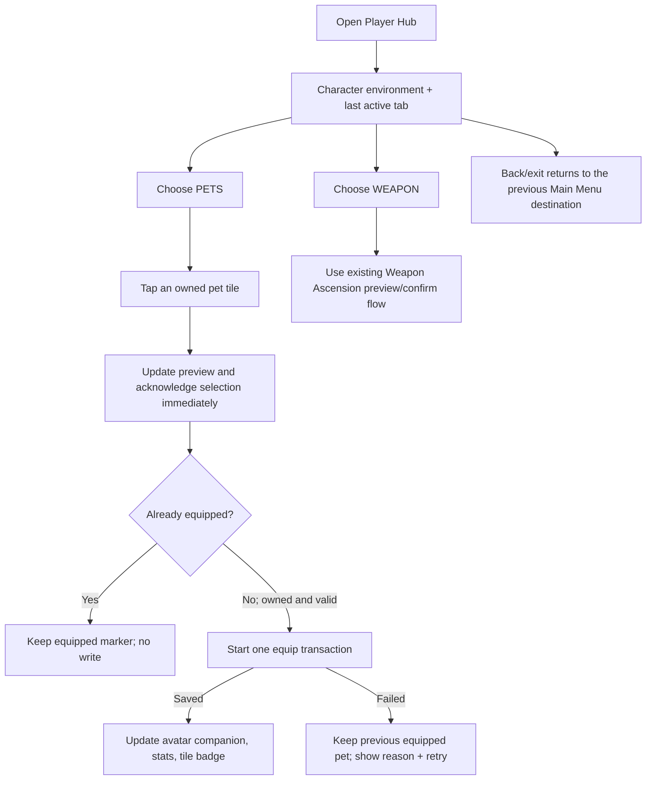

# Player Hub Data and Presentation Polish - Design Spec

## 1. Player Goal and Experience

Player Hub is the student's permanent-power dressing room, not another dashboard modal. Opening it replaces the Main Menu workspace with a full-screen environment:

- The top utility row keeps Power Coins and a single back/exit control in a consistent location.
- The left side presents the avatar, equipped pet, equipped sword, and current stat summary as objects grounded in the scene. The pet and weapon have no visible text labels in this area, and one large opaque panel never covers the character environment.
- The center-right workspace switches between `PETS` and `WEAPON` views without leaving Player Hub.
- `PETS` starts with a scrollable owned-pet grid and a large preview. Tapping an owned tile selects and starts equipping that pet immediately; no second Equip button is required.
- `WEAPON` keeps the current-to-next comparison and approved Weapon Ascension action, with strong idle, insufficient-funds, success, stat-change, particle, icon-bounce, and milestone feedback.

The intended mood follows `player-hub-icon-driven-v16.png`: light-fantasy, warm parchment surfaces, navy structure, blue utility highlights, generous character scale, and icon-first scanning.

### Current Versus Target

| Area | Current | Target |
| --- | --- | --- |
| Container | Centered modal card | Full-screen destination inside the Main Menu shell |
| Player identity | Numeric combat snapshot | Avatar standing in environment with equipped pet and sword nearby |
| Pet data | Gacha identity/icon only; no stat projection | One canonical pet definition with presentation plus approved stat modifiers |
| Ownership | Generic saved inventory records | Validated owned-pet read model over the same saved records |
| Equip | Saved ID exists but Player Hub does not edit it | One tile tap selects, previews, and begins authoritative equip |
| Navigation | Modal close button | Shared top utility contract with Power Coins and context back/exit |

## 2. Required Design Decisions

Approval of this spec approves these four decisions for architecture planning:

1. **Inventory boundary:** keep `PlayerSnapshot.inventory` as the only persisted ownership list. `PlayerOwnedPetInventory` is a validated read model, not a new saved collection.
2. **Definition boundary:** extract pet identity/presentation from gacha's nested pet content into reusable pet definitions. The gacha catalog references those definitions and continues to own rarity membership/rates.
3. **Equip boundary:** tapping an owned tile immediately selects it, updates the preview, and starts one idempotent equip action that writes only the equipped pet ID after verifying ownership. The tile shows a pending state until acknowledgement and rolls back the equipped marker/character companion on failure.
4. **Stat slice:** implement additive Pet ATK first because it is explicitly part of the GDD Effective ATK formula and existing runtime. Keep CR, CD, maximum hearts, elements, and passive mechanics presentation-only or disabled until their formulas and clamps are approved.

> [!WARNING]
> The GDD does not define pet stat values, star progression, elemental effects, defense, or passive-effect rules. This spec does not invent them. Production pets may display `STAT DATA PENDING` and contribute zero Pet ATK until owner-authored values are approved.

## 3. Interaction Flow

### Interaction Rules

- Only owned pets appear in the primary grid. Empty ownership shows a direct path to Pet Gacha without implying that locked pets are selectable.
- One tile may be `selected`; one owned pet may be `equipped` or provisionally `equipping`. These states remain visually distinct.
- Opening `PETS` initially selects the equipped pet. If no pet is equipped, the grid opens without an automatic write; the first player tile tap selects and equips.
- Selecting while an equip save is pending is disabled to keep result ownership clear.
- Back/exit is disabled only while an authoritative spend or equip write is in an ambiguous pending state.
- The provisional companion/icon response may begin immediately, but an equip failure restores the last acknowledged equipped pet and communicates the reason through the universal notification system.
- An unknown or duplicate saved pet ID appears as a recoverable data warning; it never grants stats and cannot be equipped.
- Pet Gacha ownership updates refresh the grid through the existing player-session change event.

## 4. UI State Model

| State | Entry | Exit | Allowed Input | Feedback |
| --- | --- | --- | --- | --- |
| Closed | Back/exit or another destination opens | Open Player Hub | Main Menu input | None |
| Browsing Pets | Open PETS or equip resolves | Tap tile, switch tab, back | Select/equip, scroll, tab, back | Selected/equipped badges remain persistent |
| Browsing Weapon | Open WEAPON | Switch tab, ascend, back | Existing Weapon Ascension inputs | Current/next comparison |
| Equip Pending | Tap a valid non-equipped tile | Save succeeds or fails | No second equip/tab/back action | Immediate tile response + pending badge/audio |
| Equip Success | Authoritative save accepted | Any next input | Browse | Character companion and stat values update together |
| Equip Failure | Save rejected/transport fails | Retry, select, back when safe | Retry or browse | Previous equipped state remains; reason is text-visible |
| Invalid Data | Catalog or saved ownership cannot resolve safely | Data refresh/repair | Back only; unaffected weapon view remains usable | Explicit unavailable warning |

## 5. Information Hierarchy

### Shared Top Utility

- Left: destination title or context back affordance.
- Right: Power Coin amount, optional other approved currency slots, and back/exit.
- Power Coins are always text plus icon; color is not the only identifier.
- The same utility element remains structurally stable across Player Hub, Biome Map, Profile Analytics, Pet Gacha, and Leaderboard. Each destination supplies only title and back behavior.

### Left Character Environment

- Avatar placeholder is acceptable for this slice.
- Equipped pet and sword use smaller grounded anchors near the avatar.
- Compact stat chips may show Effective ATK and Legacy/Pet contribution, but the equipped pet and equipped weapon themselves are image-only anchors with accessibility labels/tooltips rather than visible captions.
- The background environment stays visible around the silhouette. Small labels/chips may have local surfaces, but no full-height opaque panel covers the scene.

### Pet Workspace

- Scrollable grid tile: pet icon, rarity treatment, and equipped/pending badge; avoid paragraph copy in the grid.
- Preview: selected pet sprite/icon, rarity, display name, equipped state, approved Pet ATK, and a rich-text description of what the pet can do. Unsupported mechanics are content text only and must not imply an active runtime effect.
- Primary action is the grid tile itself. There is no separate Equip button.
- Empty state: `NO PETS OWNED` plus `OPEN PET GACHA`.

### Weapon Workspace

- Preserve the existing name/level, current-to-next stats, exact Power Coin cost, balance check, and saved-result messaging.
- The tab changes presentation only; it must not duplicate Weapon Ascension calculation or persistence logic.

## 6. Five-Component Evaluation

| Component | Design Requirement | Acceptance Signal |
| --- | --- | --- |
| Clarity | Selected, equipped, pending, invalid, and insufficient-funds states use distinct icon/color/text treatments and notifications. | A new player predicts that tapping a pet tile equips it in at least 8/10 observations. |
| Motivation | Equipped pet visibly changes the player's companion and permanent-power summary after save. | Players can explain which power is currently active without opening a second screen. |
| Response | Tile tap acknowledges immediately and begins one saved equip action without a second confirmation. | Every valid press has visible acknowledgement on the next rendered frame. |
| Satisfaction | Equip success updates tile badge, preview, avatar companion, stat value, and audio as one event. | Observers identify the newly equipped pet without reading the status sentence. |
| Fit | Motion is buoyant and magical but quieter than gacha reveal or combat victory. | Player Hub feels like calm preparation, not a reward-opening screen. |

## 7. Feedback and Animation Juice

All values below are **starting values**, not balance facts. They require the playtest plan in Section 10.

| Trigger | Visual | Audio | Starting Timing |
| --- | --- | --- | --- |
| Open Player Hub | Utility row settles from above; avatar/environment fades; workspace slides from right | Soft page/room-open cue | Utility 160 ms; environment 220 ms; workspace 240 ms, staggered by 40 ms |
| Switch tab | Active underline/icon pops; old workspace fades; new workspace shifts a short distance | Light paper tick | 140 ms total; input unlocked when content is readable |
| Pet idle | Preview pet uses a restrained breathing/hover loop with offset secondary motion | None or very quiet occasional pet cue | Starting loop: 1.8 s; test for calm readability and stop/reduce under Reduced Motion |
| Select + equip pet | Tile uses anticipation compression then rebound; preview cross-fades; provisional companion performs one settle hop; tile gains `EQUIPPING` state | Quiet selection/equip chirp | Press 70 ms; preview 160 ms; pet settle 220 ms; save remains asynchronous |
| Equip success | Equipped badge transfers; pet lands beside avatar; affected stat chip pulses once | Warm equip chime layered with soft pet cue | Badge/stat 220 ms; companion settle 320 ms |
| Equip failure | Button releases; status row and affected tile perform a short horizontal nudge | Soft non-punitive error cue | 180 ms; no screen shake |
| Weapon idle | Weapon icon uses a low-amplitude float/shine cycle; upgrade button has focus/hover anticipation | No looping audio | Starting loop: 2.4 s; pause while busy and under Reduced Motion |
| Weapon insufficient funds | Button depresses but does not commit; coin value and shortfall pulse; universal warning notification enters | Soft non-punitive reject cue | Input response under 100 ms; nudge/pulse 180 ms; notification readable independently |
| Weapon Ascend success | Current stat anticipates, counts/pulses to the saved value; weapon icon squashes then bounces; pooled particles radiate from the icon | Layered ascend chime plus light impact | Starting sequence: 420 ms, with saved state applied before celebration resolves |
| Weapon milestone | Success sequence adds a stronger icon pose/flash, rarity-colored ring, larger pooled particle burst, and milestone notification | Distinct milestone stinger | Starting sequence: 650 ms; only for levels already identified as milestones by authored weapon data/policy |
| Back/exit | Workspace moves out first, then environment and utility settle to caller | Soft close cue | 180-220 ms; skipped when Reduced Motion is enabled |

### Motion and Audio Rules

- No camera shake for Player Hub inventory actions. Weapon milestone feedback may use a localized UI impulse, never whole-screen shake.
- Frequent selection audio needs at least three content variants before production; until then, use a single low-volume cue without random pitch claims.
- A pet tap may begin a provisional companion settle immediately for response, but the pending badge stays visible and failure rolls back to the last acknowledged companion.
- Use standard Unity animation techniques: USS transitions for simple state changes; the project's existing LeanTween sequence layer for anticipation, easing, squash/stretch, overshoot, follow-through, and stat interpolation; pooled UI particle elements for bursts. Do not add custom per-frame polling or a second tween dependency.
- Idle animation is interruptible and cancelled before success/failure sequences so multiple motions do not fight over the same properties.
- Reduced Motion replaces slide, hop, scale overshoot, shimmer, and nudge with 80 ms opacity/color transitions and immediate state text.
- If audio assets are missing, all states remain fully understandable through text, badges, and focus treatment.
- Pointer hover is supplementary. Touch, keyboard focus, and selected/equipped states must carry the complete meaning.

### Animation Test Plan for Starting Values

- **Pass metric:** 8/10 test interactions correctly predict that a pet tile equips immediately, identify pending versus saved state, and notice input acknowledgment without explanation.
- **If the hub feels slow:** reduce open/switch durations in 20 ms steps before removing state labels.
- **If pet equip feels weak:** increase companion/tile/audio layering before increasing duration.
- **If Weapon Ascend feels weak:** strengthen stat-change and icon-impact contrast before adding more particles or longer lockout.
- **If motion distracts from comparison:** remove overshoot/hop first, then shorten motion; keep selection/equipped clarity.
- **Low-frame-rate pass:** at 20 FPS, the final semantic state resolves correctly even if intermediate animation frames are skipped.

## 8. Data and Content Rules From the Player Perspective

- Pet identity, icon/preview, display name, and approved Pet ATK travel together as one content definition.
- Gacha rarity remains visible presentation context but does not determine equip eligibility or silently calculate combat stats.
- Ownership means the player has at least one valid owned record for that pet ID.
- Duplicate ownership records are an error to surface, not stackable copies or hidden upgrade levels.
- Equip never consumes Power Coins and never changes pet ownership.
- Pet ATK is applied only after the equipped ID is both owned and resolvable.
- A missing sprite may use a visible placeholder. A missing or invalid ID cannot be substituted with another pet.
- Star count is excluded from this slice because no progression rule currently defines it.

## 9. Risks and Abuse Cases

- **Parallel inventories:** adding a second saved pet list would drift from gacha ownership. Prevent by projecting from the existing snapshot only.
- **Catalog identity duplication:** leaving IDs/names/icons in both pet definitions and gacha content would permit mismatches. Gacha must reference the canonical definition.
- **Pending mistaken for saved:** immediate tile equip may look complete before persistence. Keep a visible pending marker and roll back the companion/equipped badge on failure.
- **Stat injection through corrupt loadout:** an equipped but unowned/unknown ID must contribute zero and show a warning.
- **Tap spam:** one transaction ID and one pending write; repeated tile presses do not queue actions.
- **Notification spam:** coalesce repeated identical insufficient/pending messages and display one semantic notification at a time.
- **Motion conflict:** idle, hover, pending, success, and milestone sequences cancel by channel before a higher-priority sequence takes ownership.
- **Destination inconsistency:** copying top-bar markup into five panels would drift. Approve one reusable contract and migrate destinations incrementally.
- **Scope expansion:** passive abilities, elements, defense, pet levels, and star upgrades remain blocked until their decisions exist in the GDD or an approved spec.

## 10. Playtest Scenarios

### New Player

- Start with two owned pets and one equipped pet.
- Ask the player to equip the other pet without explanation.
- Pass: the player taps its tile once, notices pending/success, and identifies the active pet 8/10 times.

### Stress

- Rapidly click/tap tiles, tabs, Weapon Ascend, and Back during delayed saves.
- Pass: one equip transaction occurs; no duplicate action, lost selection, or closed ambiguous state.

### Skill / Efficiency

- Ask a returning player to compare equipped pet and next weapon upgrade.
- Pass: both answers are found without leaving Player Hub or opening unrelated panels.

### Abuse

- Inject duplicate owned records, an unknown equipped ID, an unowned equipped ID, and a catalog entry with missing presentation.
- Pass: invalid pets grant no stats, cannot be equipped, and produce an actionable warning.

### Readability

- An observer watches selection, equip success, and equip failure with audio muted.
- Pass: the observer explains each outcome correctly 8/10 times.

### Accessibility

- Repeat with Reduced Motion, keyboard-only navigation, and a narrow mobile-compatible layout.
- Pass: focus order, labels, selected/equipped distinction, and final states remain complete.

## 11. GDD Alignment

- `@tag:core-loop`: reinforces permanent preparation in the Lobby.
- `@tag:combat-stats`: activates only the documented Pet ATK term through a shared projection.
- `@tag:economy`: shows Power Coins consistently while keeping equip free and Weapon Ascend authoritative.
- `@tag:gacha`: reuses permanent ownership and catalog identity without changing probability rules.
- `@tag:server-authority`: separates preview from an idempotent saved equip command.
- `@tag:feedback`: provides visual and audio feedback, with text-first fallback.
- `@tag:player-experience`: protects response and clarity ahead of spectacle.

No design approval is inferred for pet balance values, passive mechanics, star progression, or final art/audio content.

## 12. Human Design Checkpoint

Approved by the project owner on 2026-08-29 with these refinements:

1. Owned-pet scroll grid plus large icon/rarity/name/rich-text preview.
2. One pet-tile tap selects and begins equipping immediately; no second Equip button.
3. Expanded Weapon Ascend idle, insufficient-funds, success, stat-change, icon-bounce, particle, and milestone juice.
4. A reusable semantic in-app notification system handles shortfall, failure, pending, success, and milestone messages.
5. The character environment shows the equipped pet and weapon without visible text labels.
6. Motion uses standard USS/LeanTween/pooled-particle animation techniques with reduced-motion fallbacks.

Pet ATK remains the only enabled pet stat in this slice; future stats, abilities, and rich-text claims remain presentation-only until separately approved. Implementation must not begin before the architecture checkpoint is approved.
