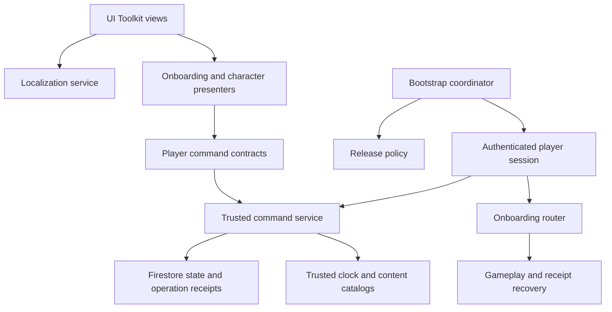

# Player lifecycle and live service architecture proposal

**Status: target architecture for review. No runtime implementation is claimed.**

## Current implementation findings

| Evidence | Observed behavior / implication |
|---|---|
| `Assets/Project/Script/Session/FirestoreRestClient.cs:105` | Authentication repairs missing game-data fields before returning a player. Determine new-player status before repair; never infer it afterward. |
| Same file, `CreateBootstrap` | Returns client SupportedSchemaVersion and local DateTime.UtcNow as schema/server time. Persisted schema and trusted time are not established by this response. |
| `PlayerData/PlayerSchemaMigrator.cs` | Supports V0/V1 to V2 in memory; missing migration path exits loop without a failure result. This is not a durable migration protocol. |
| `Session/PlayerDefaultsPlanner.cs` | Field-mask defaults and updateTime preconditions already help avoid whole-document overwrites; retain this property. |
| `Bootstrap/GameBootstrapper.cs` | Optional manifest check, continues on fetch failure, automatically purges/reloads on incompatibility, then routes directly to Main Menu. |
| `Assets/Plugins/WebGL/PowerMathWebBridge.jslib` | Cache/service-worker deletion is origin-wide and asynchronous; reload is scheduled independently after 150 ms. No reload-loop guard. |
| `Session/DirectFirestoreCredentialStore.cs` | Remembered username/password stored in PlayerPrefs; otherwise session survives only in process memory. Refresh may legitimately require login. |
| `Firebase/firestore.rules` | Prototype level reads and single-map updates have no authenticated owner predicate. Rules file inspection does not verify what is deployed. |
| `PlayerData/PlayerSnapshot.cs` | Profile/icon and loadout/avatar exist; no explicit locale, protagonist, or onboarding progress fields. |
| `Assets/Project/UI/MainMenu/CombatSurface.uxml` | CharacterName label is hard-coded Stellar; mapping stored avatar IDs alone will not update all character presentation. |

ADR-003 accepted the prototype trust limitations. ADR-011 describes version checks/cache/migration; ADR-012 supplies existing presentation recovery. These are foundations to extend, not proof of production authority. GDD @tag:server-authority remains the intended end state.

## Boundaries



| Component | Responsibility |
|---|---|
| LocalizationService + UI binding | Resolve stable keys and format arguments; notify views on locale change; detach subscriptions with view lifetime |
| PlayerPreferencesService | Locale cloud persistence, local cache, account-bound asynchronous responses |
| ReleasePolicyService | Parse/validate build, protocol and content compatibility; maintenance and feature availability |
| PlayerBootstrapService | Return stored schema, player revision, trusted time, and explicit lifecycle state |
| OnboardingService | Monotonic opening/tutorial checkpoints and idempotent preparation completion |
| CharacterPresentationCatalog | Stable ricko/stellar IDs to selection art, profile default, hub sprite, combat sprites/animation configuration |
| PlayerCommandGateway | Typed commands/results, session validation, revisions, retry receipts; no raw arbitrary save payload |
| Existing scene composition roots | Assemble services and presenters; avoid growing GameBootstrapper or FirestoreRestClient into owners of all systems |

Preserve coroutine-style adapters and the existing scene-scoped UI composition. No new localization package is required for the proposed text-only catalog. Evaluate Unity Localization as an alternative only if its authoring benefits justify a separately approved dependency.

## Localization and preferences

Proposed precedence: valid account locale > explicitly chosen device locale > Thai. Local PlayerPrefs contains only a convenience preference; Firebase stores `preferences.locale` for cross-device behavior. A pre-login explicit choice may be offered/applied to the signed-in account as an intentional preference command, never silently overwrite an existing cloud choice on every bootstrap.

Catalog keys are semantic (`onboarding.confirm`, `errors.updateRequired`), not English text or visual-element names. Include UXML text, runtime messages, placeholders, tooltips, dynamic counters, and existing content localization keys. Bind through per-view mappings at creation and re-render formatted values on locale changes. Fallback: selected locale -> English -> visible diagnostic fallback in development. Validate duplicate/missing keys and placeholder parity. Do not translate stable IDs, player-entered names, or math answer values. Inventory Thai/English content separately from UI translation; question translation is not implied.

Test HYWenHai with Thai vowel/tone marks, ellipsis, line height, narrow layouts, and Thai name input. Language persistence failure leaves the current screen usable with a retry indication.

## Data contract (proposed additive fields)

```text
gamedata.schemaVersion                    durable data format, distinct from client version
gamedata.revision                         authoritative concurrency revision
gamedata.preferences.locale               th | en
gamedata.profile.characterId              ricko | stellar
gamedata.onboarding.version               flow version
gamedata.onboarding.phase                 opening | character | name | complete
gamedata.onboarding.openingCheckpointId   stable authored segment ID
gamedata.onboarding.selectedCharacterId   resumable pre-confirmation choice
gamedata.onboarding.completedAt           trusted timestamp
gamedata.tutorial                         independently versioned checkpoint IDs
```

These are proposed logical fields, not an instruction to deploy this exact physical layout. Preserve `iconId` as an optional portrait override and `avatarId` compatibility mapping; do not blindly equate cosmetic avatar and protagonist. All presentation consumers use the catalog resolver. Missing art yields a known fallback plus authoring diagnostic; it must not silently substitute the opposite protagonist.

Command sketches: `SetLocale(locale, operationId)`, `AdvanceOnboarding(checkpointId, expectedRevision, operationId)`, `CompletePlayerPreparation(characterId, displayName, expectedRevision, operationId)`. Server derives player identity from session. Return accepted snapshot/revision or typed conflict, invalid input, update-required, unavailable, or existing receipt. Normalize names consistently, reject blank/control/markup input, support Thai combining sequences, and apply an approved grapheme-length policy on client and server.

## Save and migration protection

1. Read the durable schema before any repair/write. Missing gamedata means new player only after a successful authenticated authoritative read. Missing schema on existing gamedata is legacy, not new.
2. Classify known legacy documents from structural evidence and migration fixtures. Do not declare every unversioned save V0 and clear newer receipt fields.
3. Apply explicit sequential, idempotent migrations. Unknown version, missing step, malformed required data, or downgrade returns a typed failure with no write.
4. Persist migration fields and target schema atomically with revision/precondition checks. Preserve unknown fields and unrelated student maps. Re-read and re-evaluate conflicts.
5. Establish legacy onboarding policy explicitly: preserve existing progression/name; bypass opening; map known character identity or require a one-time choice. No “missing flag = reset.”
6. A new feature uses additive defaults and separate feature versioning where possible. Adding a mailbox or announcement does not require recreating player data.
7. Rebirth/run reset must preserve locale, protagonist, onboarding and tutorial completion. Explicit account deletion/reset remains separately authorized.

In production the trusted service owns migrations and writes. A temporary prototype adapter can share tested migration planning but cannot provide tamper resistance. Existing updateTime checks are document-wide, so unrelated students in a shared grade document can conflict. Proposed production storage separates private per-player documents and public projections; retain stable IDs and verify copied values before cutover. No uncoordinated dual-write phase.

## Release compatibility and browser refresh

Separate build ID/version, API protocol range, save schema support, and content catalog versions. Feature flags specify minimum supported client capability and active catalog. New downloaded configuration cannot add C# functionality absent from an old WebGL build.

Validate manifest structure and version format. A failed/invalid policy fetch presents retry for authoritative online actions; do not silently permit writes. Recheck on session resume and before commands through the trusted service. Version fields supplied by a client are advisory; server validation and authorization still enforce invariants for modified clients.

Deploy immutable hashed build assets, then publish the entrypoint/manifest; retain the prior compatible build for rollback. These are later deployment changes requiring approval. Content rollback must remain compatible with already-migrated data; never downgrade player saves to match an old client.

Replace origin-wide purge with scoped application cache invalidation when necessary. Await completion/failure, preserve preference/auth storage, and record attempted target build in session storage to bound automatic reload. If the same incompatible build returns, show an update/retry screen rather than looping. Do not rely on reload(true) as a cache protocol.

Refresh starts from bootstrap: restore usable session or login, fetch fresh snapshot, resume committed attempt or pending presentation receipt. Do not award currency on animation completion and do not rely on OnApplicationQuit/unload saving. Persist every committed action before presentation. A lost response retries the same operation ID; a timeout means unknown outcome, not safe failure. Multi-tab conflicts trigger rehydrate rather than last-writer overwrite. Existing combat deadlines and receipt logic remain authoritative; onboarding never rerolls an encounter.

## Future server-owned features

Recommended target: Firebase Authentication plus a trusted service (Firebase-hosted backend is one option) performing transactional Firestore writes. This replaces the relevant ADR-003 trust decision and needs explicit acceptance. Existing classroom credentials require an approved secure enrollment/mapping approach; do not expose or copy passwords into new public documents.

| Feature | Authoritative operation |
|---|---|
| Mailbox | ClaimMail(mailId, operationId): validate recipient, expiry and immutable reward definition; atomically write claim receipt and wallet/inventory delta |
| Limited-time event | Validate server time, eligibility, schedule revision and participation limits; persist the selected event/content version |
| Announcements | Versioned localized content and idempotent read receipt; opening a board cannot grant rewards |
| Gacha | Server catalog, price, RNG and ownership/wallet transaction; existing client RNG remains prototype-only until moved |
| Existing economy/combat | Route every protected writer through trusted commands; a secure mailbox cannot protect rewards while old wallet writes remain public |

Use a unique durable receipt keyed by player and business operation; claim uniqueness also keys on mail/event identity so changing operationId cannot duplicate rewards. Same ID with a different payload is rejected. Transaction callbacks have no external side effects; duplicate/retried callbacks must not reroll reward selection. Validate reward catalog server-side, never accept client reward quantities or local time. External notification side effects occur after durable commit.

The service uses least-privilege IAM and explicit identity/ownership checks; server libraries bypass Firestore Security Rules. Client rules deny protected state mutation after the backend cutover. Do not describe interface scaffolding as deployed authority.

## Incremental implementation and acceptance gates

| Slice | Files / integration points | Verification |
|---|---|---|
| 1. Save contracts | FirestoreRestClient, PlayerDefaultsPlanner, PlayerSnapshot, PlayerSessionStore, PlayerSchemaMigrator | Legacy fixtures, future schema rejection before write, unknown field preservation, migration retry/conflict |
| 2. Locale | New Localization service/catalog; auth/bootstrap/settings views and presenters | Thai/English bindings, dynamic text, reload, cloud precedence, account switch |
| 3. Preparation | Bootstrap router, new preparation UI/presenters, character catalog, combat/hub/profile consumers | Both protagonists, every checkpoint refresh, duplicate confirms, legacy progress preservation |
| 4. Release recovery | GameVersionChecker/Manifest, GameBootstrapper, WebCacheBridge/jslib | Invalid policy, unavailable network, stale tab, failed cache deletion, bounded reload, no data/cache collateral deletion |
| 5. Authority integration | Auth/command adapters and backend, then all economy/attempt writers | Auth isolation, duplicate business claim, concurrency, response loss, trusted time, rejected direct mutation |
| 6. Live feature delivery | Mailbox/event/announcement adapters and authored content | Expired/duplicate claims, disabled feature on old client, locale fallback, rollback compatibility |

Each slice has a focused change and regression review. No new backend dependencies, credential migration, rule deployment, hosting edits, or public release is included in this approval-preparation pass.

## Technical references

- [Firebase access protection](https://firebase.google.com/docs/firestore/security/overview): identity, rules and validation boundaries.
- [Firestore transactions](https://firebase.google.com/docs/firestore/manage-data/transactions): atomic updates and retry behavior.
- [Server libraries and rules](https://firebase.google.com/docs/firestore/security/get-started): server library access uses IAM rather than client rules.
- [Unity PlayerPrefs](https://docs.unity.cn/6000.1/Documentation/ScriptReference/PlayerPrefs.html): local browser IndexedDB preferences.


Approval: user accepted design and architecture with “LGTM” on 2026-09-08. Placeholder character/opening assets explicitly authorized. Backend hosting/enrollment and live deployment remain separate integration inputs.
