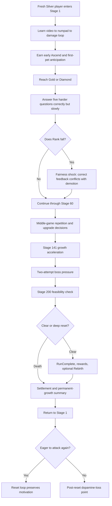

# Post-Redesign Player Friction and Reward-Loss Scenario

## Document Status

| Field | Value |
| --- | --- |
| Type | Fresh diagnostic design spec |
| Date | 2026-09-13 |
| Status | Design-review checkpoint; hypotheses require playtest validation |
| Scope | Player friction, frustration, reward anticipation, and willingness to continue |
| Canonical source | Current `GDD_PowerMathProject.md` revision approved on 2026-09-13 |
| GDD references | `@tag:core-loop`, `@tag:combat-attempt`, `@tag:answer-scoring`, `@tag:combat-stats`, `@tag:stage-progression`, `@tag:encounters`, `@tag:run-reset`, `@tag:economy`, `@tag:pet-system`, `@tag:gacha`, `@tag:feedback`, `@tag:player-experience`, `@tag:guardrails`, `@tag:playtest` |

> [!NOTE]
> This is an independent analysis of the redesigned GDD. The earlier friction/dopamine analysis spec and its DevLog were deliberately not inspected or used as inputs.

## 1. Executive Finding

The redesigned game has a strong early promise: every correct answer creates damage and currency, early Weapon Ascends are visible, the first pet is a guaranteed useful SSR, failed Challenge Monsters still pay a reward, and permanent progress survives resets.

The fresh analysis predicts three different peaks that must not be collapsed into one label:

| Priority | Predicted peak | When it occurs | Why it is dangerous |
| --- | --- | --- | --- |
| **P0 — sharpest fairness frustration** | Correct-but-slow Rank demotion | After a player reaches Gold or Diamond and completes a five-question audit slowly but accurately | Five correct answers at 5 points each total 25 and therefore demote the player. The result says “correct” five times, then removes Rank without exposing the audit. Success is converted into an unexplained punishment. |
| **P1 — highest sustained progression struggle** | Late-game power/survival wall | Stages **141–200**, especially Stage 200 | Enemy growth changes from `+0.25` to `+1.975` GrowthFactor per World Level, while later bosses attack every two committed attempts. The GDD does not specify the minimum permanent-power, survival, or expected-run requirement for reliable completion. |
| **P2 — largest reward-energy drop** | Deep-run reset followed by mastered replay | Immediately after death/Rebirth, during the return to Stages 1–30 | The reset grants permanent rewards, but the player then returns to the same linear route with no stage selection. Once early content is mastered, anticipation can fall faster than permanent power rises. |

The most likely **single frustrating moment** is the unexplained demotion after an accurate-but-slow five-question window. The most likely **game phase with sustained friction** is Stage 141 onward. The most likely **quit point** is the first deep death followed by the realization that the route restarts at Stage 1.

These are hypotheses, not claims about observed players. The scenario below is designed to prove which peak is dominant.

## 2. Operational Definition

“Dopamine loss” is used here as player-experience shorthand, not as a neurological measurement. The playtest measures observable loss of reward anticipation:

- longer delay before voluntarily pressing the next action;
- reduced desire to see the next encounter or reward;
- failure to notice or value a reward that was granted;
- negative surprise after an apparently successful action;
- navigation away from combat immediately after a result;
- refusal to begin another run despite understanding the permanent gain.

**Friction** is any effort between intention and meaningful outcome. The observer must classify each event as:

1. **Comprehension friction** — the player cannot predict or explain the rule.
2. **Execution friction** — the player knows what to do but input, timer, or presentation blocks the intended result.
3. **Progression friction** — the player acts correctly but gains power too slowly to maintain pace.
4. **Repetition friction** — the result is understood but no longer feels novel or decision-rich.
5. **Delivery friction** — buffering, reconnect, content, or device failure; log separately and do not misdiagnose as balance.

## 3. Assumptions and Limits

### Assumption A — Diagnostic participant

**ASSUMPTION:** The primary scenario uses a careful learner who usually finds the correct answer but often submits in the latter half of the countdown.

**IMPACT:** This intentionally exposes conflict between mathematical accuracy, response speed, damage, and Rank movement.

**IF WRONG:** A fast-answer cohort may hide the strongest fairness risk and make late-game balance look healthier than it is.

**VALIDATE:** Run the same route with accurate-fast, accurate-slow, inaccurate-fast, and timeout profiles as required by `@tag:playtest`.

### Assumption B — Delivery is healthy

**ASSUMPTION:** Embedded video playback, network response, server settlement, and numpad input work as designed.

**IMPACT:** The test can attribute hesitation and frustration to game rules rather than technical failure.

**IF WRONG:** Buffering or lost input will inflate combat friction and invalidate response-speed conclusions.

**VALIDATE:** Tag every attempt with video-start latency, video-end event, input acknowledgement, submit acknowledgement, and reconnect state.

### Assumption C — Baseline feasibility calculation

**ASSUMPTION:** The Stage 200 pressure model initially excludes pet damage, temporary buffs, defensive passives, Legacy ATK, and random critical hits so the base progression promise can be inspected independently.

**IMPACT:** It reveals how much completion depends on additional systems beyond Rank, response, and a maximum weapon.

**IF WRONG:** The final encounter may be intentionally balanced around a mandatory amount of Legacy, pet power, or survival that is not presently documented in the GDD.

**VALIDATE:** Define and playtest an explicit minimum viable Stage 200 account state before treating the final encounter as balanced.

### Assumption D — Platform order

**ASSUMPTION:** The primary pass uses the Unity WebGL browser experience with pointer input; the same scenario is repeated on a supported touch device.

**IMPACT:** Numpad targeting time may differ materially between pointer and touch input.

**IF WRONG:** If touch is the primary commercial context, the first pass may underestimate execution friction.

**VALIDATE:** Compare response-score distribution and input-error rate between the two input models.

## 4. Player Experience Description

The diagnostic player is the **Careful Solver**. They like seeing numbers grow, understand the mathematics, and prefer certainty over speed. They have no prior explanation of the game.

At first, the loop feels generous: press Attack, watch a question, answer, see damage, gain currency, defeat a colorful enemy, and move forward. The player quickly understands that knowledge becomes power.

After promotion, the same learner begins receiving harder questions. They continue answering correctly, but they use more of the timer. Their sword hits become weaker despite the green “correct” result. After five correct answers, a demotion popup may appear. Because the audit is hidden, the player experiences a contradiction: “The game said I was right, so why did it rank me down?”

If they continue, the middle game remains readable but increasingly repetitive. In late game, enemy HP rises much faster, bosses attack every two attempts, and each correct-but-slow answer costs both time and survival opportunity. The learner is no longer deciding how to fight; they are repeating the same committed question ritual while waiting to discover whether their account has enough invisible long-term power.

After a deep death, the settlement visibly preserves growth. The immediate reward may feel good. The emotional test happens one screen later, when the next available combat is Stage 1 again. If the learner sees the next run as “do the same 140 stages again” rather than “prove how much stronger I became,” the reward loop has lost energy.

## 5. Interaction Flow Under Test



## 6. Canonical Longitudinal Playthrough Scenario

### Setup

- Use a fresh account at Silver Rank, Stage 1, base hearts, and canonical starting power.
- Give no verbal tutorial beyond “Play until you naturally want to stop.”
- Preserve the same account across sessions; do not grant off-GDD power.
- If the player dies before a phase boundary, record the death and continue with the naturally settled account on a later run; do not silently restore lost in-run state.
- If natural play never reaches Gold/Diamond or a late-stage checkpoint, duplicate the nearest valid save for a clearly labeled diagnostic replay. Never mix checkpoint results into the natural-run record.
- Record screen, input, video state, Rank, response score, answer correctness, damage, enemy HP/cooldown, hearts, reward deltas, upgrades, encounter type, voluntary pauses, and exit/navigation actions.
- After every boss, Rank change, death/Rebirth, and first pet pull, ask only: “What happened, why did it happen, and what do you want to do next?”
- Do not explain the hidden audit during the run.

### Phase-by-Phase Script

| Phase | Player action and system response | Intended reward beat | Friction probe | Evidence to record |
| --- | --- | --- | --- | --- |
| **0. First attack** | Player infers Attack → video → numpad → Submit → damage | Mathematics immediately creates visible power | Can the player act without instruction and explain the cooldown? | Misclicks, gaze/attention, empty Submit attempts, explanation accuracy |
| **1. Stages 1–5** | Repeat standard combat and meet first Mini-Boss | Rapid learning, first boss anticipation, visible Stage growth | Does the full media/question ritual already feel longer than its payoff? | Active play time vs waiting/presentation time, next-Attack delay |
| **2. Stages 6–30** | Encounter guaranteed Challenge Monster within the 20-Stage block, spend available PC, close Biome 1 | Useful failure reward, affordable early Ascend, biome transition | Does the player understand that Challenge failure still succeeded at progression? | Reward noticed, Stage advance understood, upgrade prediction accuracy |
| **3. First settlement/pet hook** | At death or optional Rebirth from Stage 30 onward, receive PC/Legacy; acquire guaranteed Follow-Up SSR when first-pet condition is met | Strong permanent-growth and companion hook | Does the player connect the reset to permanent strength, or only notice lost Stage? | Preserved/lost-state explanation, pull excitement, desire to retry |
| **4. First promoted audit** | Allow normal performance to promote the player; capture the first later five-question window containing all-correct but slower responses | Higher Rank should mean mastery and greater power | Does correct feedback conflict with lower damage or demotion? | Five response scores, audit total, Rank change, verbatim explanation |
| **5. Stages 31–60** | Complete Biome 2 and its later early-game bosses | New biome, stronger weapon, growing collection | Does novelty offset repeated attack structure? | Repeated-action fatigue, boss attempts, voluntary menu detours |
| **6. Stages 61–140** | Continue through middle-game HP growth and Power Coin choices | Large Weapon Ascend progress and permanent collection growth | Does each upgrade change the next combat enough to be felt? | PC earned/spent, ATK delta, attempts per enemy before/after Ascend |
| **7. Stages 141–180** | Enter late growth phase; face bosses with two-action attack pressure | Endgame power fantasy should become visible | Does correct play remain survivable and does the player know the missing power target? | Damage per correct answer, hearts per encounter, predicted vs actual kill attempts |
| **8. Stages 181–199** | Approach the final boss through the last biome | Peak anticipation and mastery | Is tension rising through decisions or only through more repetitions? | Choice count, attempts per Stage, continuation delay, negative comments |
| **9. Stage 200** | Fight the ~150,100 HP final boss under the saved account state | Ultimate proof of mathematical and permanent power | Can the player predict feasibility before committing, and does correct play create visible progress? | Required vs survivable attempts, cause of death, perceived fairness |
| **10. Post-deep-reset Stages 1–10** | Show settlement, return to Stage 1, and leave the account idle until the player acts | “I am much stronger now” should replace loss | Does the player voluntarily start again, and does early replay demonstrate power quickly? | Time to next Attack, one-hit rate, skipped/ignored feedback, voluntary stop |

## 7. Targeted Pressure Probes

### Probe A — Accurate-but-slow Rank inversion

The GDD makes five-question audit score depend on response score:

```text
5 correct answers × 5 response points = 25 audit points
25 audit points = demote one Rank
```

This means a Gold or Diamond player can answer every question correctly and still demote. Because the audit value is hidden, the demotion reason is not available before the popup.

**Failure signal:** The player says any equivalent of “but I got them right,” cannot predict the demotion, or becomes less willing to attempt harder questions.

**5-component diagnosis:** Clarity and Motivation fail first; increasing celebration or currency would not repair the fairness contradiction.

### Probe B — Stage 141 growth cliff

The documented World-Level slope changes from:

```text
Mid game:  +0.25 GrowthFactor per World Level
Late game: +1.975 GrowthFactor per World Level
```

The late slope is **7.9×** the mid-game slope. Weapon power is also designed to accelerate, but the GDD does not define the expected Ascension Level, Legacy multiplier, collection ATK, hearts, or buffs at Stage 141.

**Failure signal:** Attempts-to-kill or hearts lost jump at the phase boundary without a preceding upgrade goal the player can state.

**5-component diagnosis:** This begins as a Clarity problem (“what power do I need?”) and becomes a Motivation problem only after the requirement is understood.

### Probe C — Stage 200 baseline survivability

Using only documented maximum Weapon ATK, Diamond Rank, maximum response score, no critical, and no extra systems:

```text
Damage per correct hit = 1,500 × 2.0 × 2.0 = 6,000
Hits to defeat 150,100 HP = ceil(150,100 / 6,000) = 26
Base-heart attempt capacity against a two-attempt boss = 6 attempts
Reliable damage needed per attempt to win by attempt 6 = ceil(150,100 / 6) = 25,017
Additional reliable multiplier needed over 6,000 = approximately 4.17×
```

Even if all six attacks critically hit with the documented Level-100 `CD +42%`, each hit is 8,520 and the boss survives. Critical hits are also not guaranteed by the documented Level-100 `CR +30%`.

This does **not** prove Stage 200 is impossible. It proves that completion depends on a substantial combination of Legacy ATK, pet/collection power, buffs, added hearts, prevention, or other sustainability. The GDD currently does not state the minimum reliable build or expected number of reset cycles.

**Failure signal:** A player with the expected endgame account performs correctly, cannot survive the required attempts, and cannot identify a reachable power goal that would change the outcome.

**5-component diagnosis:** Response is intact if inputs work, but Motivation and Clarity collapse because correct execution cannot visibly alter the terminal outcome.

### Probe D — Post-reset replay test

After the first death/Rebirth from Stage 141 or later:

1. Show the complete preserved/removed-state summary.
2. Return to Stage 1 without prompting the player to continue.
3. Observe whether they initiate the next attack.
4. If they do, observe ten stages without commentary.

**Failure signal:** The settlement is understood and valued, but the player still declines the next run because the route feels like repeated work.

**5-component diagnosis:** This is repetition/Motivation friction. More reset explanation cannot fix it if Clarity already passes.

## 8. Predicted Friction Heatmap

| Phase | Clarity risk | Execution risk | Progression risk | Repetition risk | Predicted frustration |
| --- | --- | --- | --- | --- | --- |
| First attack | Medium | Medium | Low | Low | Medium |
| Stages 1–30 | Low–Medium | Medium | Low | Low | Low–Medium |
| First pet/Ascend | Low | Low | Low | Low | Low; expected reward peak |
| First promoted audit | **High** | **High** | Medium | Low | **Critical if all-correct demotion occurs** |
| Stages 31–60 | Low | Medium | Low–Medium | Medium | Medium |
| Stages 61–140 | Medium | Medium | Medium | High | Medium–High |
| Stages 141–180 | High | High | **High** | High | **High** |
| Stages 181–199 | High | High | **High** | **High** | **High** |
| Stage 200 | **High** | High | **Critical** | High | **Critical** |
| Post-deep-reset 1–10 | Low | Low | Medium | **Critical** | **High quit risk** |

## 9. Five-Component Evaluation

| Component | Current strength | Fresh risk finding | Validation question |
| --- | --- | --- | --- |
| **Clarity** | Strong required feedback for timer, cooldown, results, Rank changes, reset state, and rewards | Hidden audit prevents prediction of demotion; late-game required-power floor is undefined | Can the player explain both a Rank loss and a final-boss loss before retrying? |
| **Motivation** | Permanent Weapon, pets, PC, Legacy ATK, Prestige, and generous Challenge rewards create many durable gains | Accurate play can precede demotion; deep resets can turn progress into a replay obligation | After each loss, can the player name a desired next gain and voluntarily pursue it? |
| **Response** | Deterministic one-submit input and idempotent reconnect rules protect outcome integrity | Attack is irreversible, one guess only, and every committed attempt advances enemy cooldown; motor/input speed strongly changes both damage and Rank | Do careful correct players feel in control rather than rushed by the interface? |
| **Satisfaction** | Two-channel feedback is required for all significant actions | Frequent identical correct/damage sequences may habituate; a weak correct hit can feel like failure | Can the player feel an Ascend or Rank benefit without reading the number? |
| **Fit** | Math difficulty, response, Rank, and damage support the number-growth fantasy | Correct math causing weak damage or demotion breaks the fantasy’s semantic promise | Does “I solved it” consistently mean “I became stronger,” even when slow? |

Priority resolution follows **Response → Clarity → Satisfaction → Fit → Motivation**. Do not attempt to solve the identified walls with larger reward VFX before verifying agency and explanation.

## 10. Feedback Loop Audit During the Scenario

| Trigger | Required channels from GDD | Observer question | Friction symptom |
| --- | --- | --- | --- |
| Correct answer | Correct-state UI + positive audio | “Did that feel fully successful?” | Player says yes to correctness but no to damage or Rank result |
| Slow correct damage | Damage/HP response + hit audio | “Why was that hit weaker?” | Player cannot connect remaining time to final damage |
| Enemy cooldown reaches zero | Persistent number + warning | “Did you know the enemy would attack now?” | Heart loss feels arbitrary |
| Rank demotion | Popup + transition audio | “Why did your Rank change?” | Hidden audit produces surprise after accurate play |
| Weapon Ascend | Exact cost/stat preview + milestone celebration | “Did the next fight feel different?” | Number rises but attempts-to-kill do not change |
| Challenge failure | Friendly flee + `+10 PC` count-up/audio | “Was that a failure or progress?” | Mixed message erases the generous reward |
| Deep reset | Preserved/removed summary | “What did you gain, and what must you repeat?” | Loss dominates remembered gain |
| Return to Stage 1 | New enemy-ready state | “Do you want to press Attack again?” | Long hesitation or exit despite understanding growth |

## 11. Measurement and Decision Rules

Do not combine all behavior into a hidden weighted “fun score.” Preserve the causal signals.

### Per-attempt capture

- Stage, biome, encounter class, enemy HP, enemy cooldown, player hearts.
- Active Rank, question correctness, response score, audit position, audit total, Rank transition.
- Effective ATK inputs, final damage, critical result, pet/passive result.
- Time from actionable state to Attack, video-end to first input, and result-end to next voluntary action.
- PC/Rank Currency/Legacy changes and whether the player noticed them.
- Delivery errors, frame-rate/input errors, reconnects, and content-validation failures.
- Player explanation and unprompted emotional language.

### Phase winner rule

The “most friction” phase is the phase that leads in at least two of these independent signals:

- highest voluntary stop or navigation-away rate;
- longest result-to-next-action delay;
- largest attempts-to-kill increase relative to the previous phase;
- highest failure-to-explain rate;
- strongest negative reaction after a successful/correct action;
- lowest desire to repeat the loop after understanding its reward.

### Starting test values and adjustment plan

| Starting value | Test plan | Pass/fail use | Adjustment direction |
| --- | --- | --- | --- |
| **6 participants**: two accurate-fast, two accurate-slow, two mixed/timeout-prone | Run the same phase script and compare signal direction, not statistical significance | A pattern appearing across both participants in one profile is a directional risk, not final proof | Add participants in the conflicting profile if results diverge; do not average away profile differences |
| **8/10 explanation target** | Use the GDD’s existing new-player/readability target across ten sampled resolutions | Fewer than 8 correctly explained resolutions fails Clarity | Improve telegraph/failure explanation, then repeat before tuning rewards |
| **Ten post-reset stages** | Observe whether permanent power becomes perceptible quickly enough after a deep reset | Fail if the player understands the gain but voluntarily stops because replay feels unchanged | Strengthen visible power contrast or replay pacing; keep stage/reset guardrails unless separately approved |
| **One natural run plus checkpoint replays** | Preserve the natural account, then replay exact saved states to isolate input/device variance | Fail if the same account state is unwinnable through correct play or produces inconsistent understanding | Define the missing target build before adjusting HP or economy |

## 12. Risks and Confounds

- **Question/content difficulty:** A hard question is intended friction; unsupported answer formats or unclear videos are content defects.
- **Device motor cost:** Touch targeting can lower response score without changing mathematical understanding.
- **Video duration:** Long or inconsistent embedded videos can dominate time-to-reward and create repetition fatigue unrelated to enemy HP.
- **Random criticals/passives:** A lucky run can mask an unsustainable baseline; replay saved checkpoints with deterministic seeds for diagnosis only.
- **Hidden account strength:** Collection and Legacy power can hide a phase wall for veteran accounts while new accounts still fail.
- **Observer intervention:** Explaining the audit or optimal Rebirth timing changes the exact Clarity problem being tested.
- **Reward novelty:** The first pet and first milestone are intentionally stronger than duplicates; compare repeated value after novelty fades.

## 13. Tuning Priority if Hypotheses Validate

These are recommendations for a future human design checkpoint, not approved GDD changes.

1. **Resolve accurate-but-slow demotion first.** Protect educational correctness from motor-speed punishment or expose the audit rule clearly enough that Rank represents the intended skill. Keep response speed as a combat-performance reward if desired.
2. **Define the late-game target account states.** Document expected Weapon Level, Legacy ATK, collection power, hearts/defense, response profile, and reset count at Stages 141, 180, and 200.
3. **Verify deterministic survival before tuning reward size.** A player who performs the intended skill needs a legible route to survive; spectacle cannot repair an unreachable damage requirement.
4. **Make post-reset power immediately perceptible.** Validate that the first ten stages demonstrate faster clears or new automatic pet value without adding an unapproved stage-skip rule.
5. **Reduce ritual fatigue only after the above.** Measure video-to-action and result-to-next-action cadence before changing HP, timer, or reward quantities.
6. **Tune Satisfaction last.** Once results are fair and predictable, scale visual/audio intensity by boss, milestone, promotion, and permanent-growth significance to avoid feedback habituation.

## 14. Edge and Abuse Cases

- Player refreshes after seeing a hard question; the attempt remains committed and must not reroll.
- Player answers correctly at the final fractional second; validity follows actual remaining time, not the displayed `0`.
- Player submits every answer correctly but accumulates an audit score of 25 or less.
- Player promotes immediately before a deep death; active Rank persists while the partial audit resets.
- Player reaches a later boss with base hearts and no defensive passive.
- Player receives a carried Follow-Up on the next target; attribute the damage correctly rather than to the new answer.
- Player fails a Challenge Monster; Stage advances and at least 10 PC is granted once.
- Player double-confirms Ascend or gacha; no double-spend or duplicate resolution occurs.
- Player dies intentionally at low Stage; compare permanent gain per minute against continuing the viable run.
- Player completes Stage 200; combat remains locked until Rebirth, but non-combat systems remain available.
- Player uses Reduced Motion; biome and result changes must remain understandable.
- Low frame rate or touch mis-tap lowers response score; classify it as execution/delivery friction before educational difficulty.

## 15. GDD Alignment Check

- The scenario keeps the canonical Attack commitment and resolution order from `@tag:combat-attempt`.
- It uses the current response multiplier, five-question audit, Rank thresholds, and persistence rules from `@tag:answer-scoring`.
- It preserves the 200-stage linear map, protected bosses, phase growth, biome transitions, and Stage 200 lock from `@tag:stage-progression` and `@tag:guardrails`.
- It treats Weapon Ascend, Challenge rewards, gacha, pets, death, Rebirth, Legacy ATK, and Power Coins exactly as documented in `@tag:encounters`, `@tag:run-reset`, `@tag:economy`, `@tag:pet-system`, and `@tag:gacha`.
- It tests the required two-channel feedback and player-understanding goals from `@tag:feedback` and `@tag:player-experience`.
- It extends the required new-player, stress, skill/Rank, combat-pacing, economy, pet, and readability tests in `@tag:playtest` without changing canonical rules.
- No code, balance value, economy value, state transition, or GDD rule is changed by this document.

## 16. Design Checkpoint

Human approval is required before converting any tuning recommendation into a GDD change. The first decision should be whether an all-correct five-question window is ever allowed to demote Rank. The second should define the intended minimum reliable Stage 200 account state and expected number of reset cycles.
