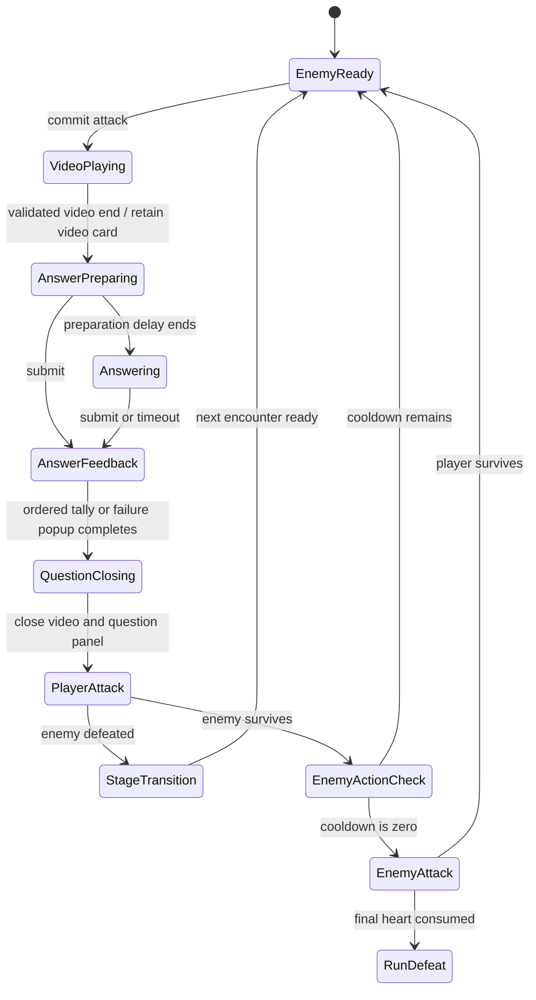

# Question Sequence Visual Flow — Design Spec

## State Contract



## Correct Feedback Hierarchy

The visual tally mirrors the authoritative formula and never recomputes the result:

```text
BASE ATK
   ↓
RANK MULTIPLIER
   ↓
BUFF MULTIPLIER
   ↓
CRITICAL MULTIPLIER
   ↓
RESPONSE SCORE / DAMAGE MULTIPLIER
   ↓
FINAL DAMAGE
```

Rows reveal one at a time. The final damage row receives the strongest scale/contrast treatment. Multipliers of `×1.00` remain visible so the player can see that the factor was considered; the Critical row is labelled `NO CRITICAL` when it did not trigger.

## Failure Feedback Hierarchy

- Incorrect: `INCORRECT` icon/title, `0 DAMAGE`, gentle failure audio.
- Timeout: clock icon/title, `TIME EXPIRED`, `0 DAMAGE`, timeout audio.
- Neither failure path shows a response multiplier or hit animation.

## Presentation Boundaries

- The WebGL adapter owns only browser-video visibility and docked layout.
- The Unity view owns numpad, countdown, answer feedback, tally, damage, HP, Stage, and enemy-action feedback.
- The presenter explicitly dismisses the retained question surface between answer feedback and battle feedback.
- Core combat remains the source of truth for damage and outcome ordering.

## Starting Values and Playtest

| Knob | Starting value | Pass condition | Adjustment |
|---|---:|---|---|
| Correct header hold | 0.25 s | Result is recognized before tally begins in 9/10 observations | Increase by 0.10 s |
| Tally row interval | 0.16 s | Formula order is understood without feeling stalled in 8/10 attempts | Increase for missed rows; decrease if routine feels slow |
| Failure popup hold | 0.75 s | Incorrect and timeout are correctly distinguished in 9/10 observations | Increase by 0.10 s |
| Reduced-motion row interval | 0.05 s | All rows remain readable with minimal travel | Increase only if rows blend together |

These are starting values, not balance rules or claimed standards. The GDD-defined one-second preparation and ten-second answer countdown are unchanged.

