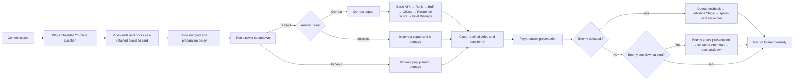

# Task Card: Question Sequence Visual Flow

## Player-Facing Goal

After committing an attack, the player watches the embedded question, answers beside the ended-but-still-visible video, reads an ordered score/damage tally, and only then returns to the battle presentation. Incorrect and timeout outcomes use a distinct zero-damage popup before the same battle handoff.

## Approved Intake

- Origin: Manual project-owner request on 2026-08-27.
- Design checkpoint: The request explicitly approves retaining the ended video through answer feedback, replacing template result text with a visual sequence, and closing the video before battle feedback begins.
- GDD references: `@tag:combat-attempt`, `@tag:answer-scoring`, `@tag:feedback`, `@tag:player-experience`, and `@tag:guardrails`.

## Current Implementation

- `WebGlYouTubeQuestionPresentation.OnYouTubeEnded` hides the browser overlay immediately.
- `CombatFeedbackPlayer.Play` combines answer outcome and battle presentation in one coroutine.
- Correct feedback is one text label containing score and response multiplier before the damage animation.
- Combat authority already resolves player damage, death/stage advancement, cooldown consumption, and conditional enemy attack in the required order.

## Target Visual Flow

## Acceptance Criteria

- [x] Video completion changes the browser overlay to a retained, non-interactive question card instead of hiding it.
- [x] Numpad input is visible and usable beside the retained video card by layout contract.
- [x] Correct feedback reveals each damage factor in formula order, then final damage.
- [x] Incorrect and timeout feedback are distinguishable without color and show zero damage.
- [x] The video/question surface closes after answer feedback and before battle feedback.
- [x] Battle presentation remains player damage, enemy-death/stage handling, then conditional enemy action.
- [x] Duplicate submit/timeout and content-failure behavior remain unchanged.
- [x] Reduced-motion mode preserves all semantic steps with shorter holds.
- [x] UI contract and combat EditMode regression tests pass with no new Unity compilation errors.
- [ ] Human WebGL verification confirms the real iframe/video card and Unity numpad do not overlap at target mobile aspect ratios.

## Scope Guardrails

- No combat formula, answer timing, persistence, Firestore, build-setting, dependency, CI, or publishing change.
- The domain may expose an immutable damage breakdown for presentation, but presentation must not recalculate authoritative damage.
- Animation timings are starting values from the approved combat feedback design and remain subject to human playtest review.
