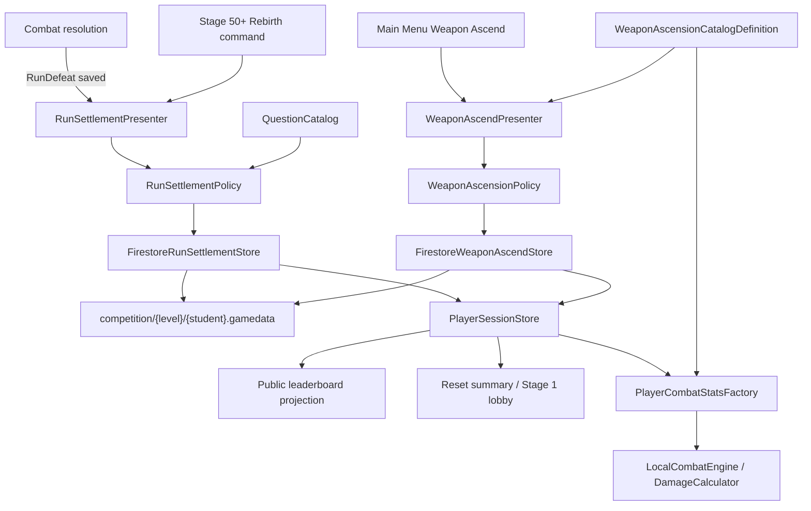
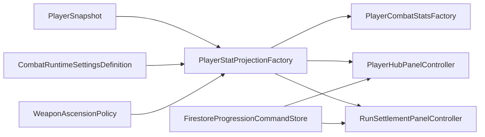

# Architecture Plan: Atomic Run Settlement and Weapon Ascend

> Human checkpoint approved by the product owner on 2026-08-11. Base ATK remains a runtime-authored combat setting with a default of 5.

## 1. Current State and Target

Current combat persists attempts through `FirestoreAcademicProgressionStore` and already reaches `CombatPhase.RunDefeat`/`RunComplete`. It does not settle a run, grant Power Coins, reset Stage, clear audit/question runtime, increment Prestige, or expose Rebirth. `inventory[].upgradeLevel` is read but no writer or Weapon Ascend policy exists. Damage currently uses `responseScore` as the effective attack input and therefore does not yet implement the GDD's Base/Weapon/Pet/Legacy stat composition.

Target architecture adds two explicit command pipelines—Run Settlement and Weapon Ascend—beside attempt persistence. Both re-read the private Firestore grade document, validate authoritative saved leaves, calculate results locally under the accepted direct-Firestore prototype limitation, PATCH one student map with an `updateTime` precondition, update `PlayerSessionStore`, then best-effort refresh the public leaderboard projection.

## 2. System Diagram



## 3. Authority and Transaction Boundary

ADR-006 keeps anonymous direct Firestore REST, so this is prototype concurrency authority—not tamper-proof server authority. The stores never trust a UI-provided balance, Rank, Stage, level, or reward. Each command:

1. GETs the current private grade document.
2. Maps the authenticated student's saved map only.
3. Validates command ID, saved revision, saved phase/run ID, eligibility, balances, and numeric ranges.
4. Derives the entire mutation from refreshed saved state and approved policy/catalog.
5. PATCHes all affected nested leaves beneath that one student field with `currentDocument.updateTime`.
6. Treats conflict as no mutation and asks the player to retry/reload.
7. Updates the in-memory snapshot only from the accepted result.

The current Firestore rule permits one changed top-level student map, so a multi-leaf settlement remains one accepted document update. No rule publication is required unless later shape validation is added; no rules are published automatically.

## 4. Private Firestore Schema Extension

```text
competition/{levelDocumentId}
  {normalizedUsername}.gamedata
    revision
    progression
      currentStage
      highestStage
      activeRank
      prestige
      legacyAtkBonusBasisPoints
    wallet
      silver
      gold
      diamond
      powerCoins
    inventory
      [{ itemId, owned, upgradeLevel }, ...]
    activeRun
      runId
      currentStage
      phase
      silverEarned
      goldEarned
      diamondEarned
      bonusMultiplierBasisPoints
      ...existing enemy/hearts fields
    academic
      auditScore
      auditResolvedCount
      activeAttempt
      inventories.{silver|gold|diamond}
    economy
      lastWeaponAscendTransactionId
      lastWeaponAscendLevel
      lastWeaponAscendCost
    lastRunSettlement
      runId
      type                 // Death | Rebirth
      stageReached
      powerCoinsGranted
      legacyAtkBasisPointsGranted
      prestigeGranted
      resultingPowerCoins
```

- `legacyAtkBonusBasisPoints` is an integer; floats are never persisted.
- `bonusMultiplierBasisPoints` defaults to `10000` (×1.0).
- `activeRun` Rank Currency counters are incremented in the same accepted attempt write that increments lifetime balances.
- Existing accounts missing a valid base weapon item receive `{itemId: "weapon-ascension", owned: true, upgradeLevel: 0}` through the existing missing-default repair/migration path.
- Derived Weapon ATK/CR/CD, tier name, icon, and appearance are never saved; they are recalculated from level plus the versioned local catalog/policy.
- The public leaderboard retains lifetime `highestStage` and balances. Reset publishes only `currentStage = 1`; Ascend publishes the resolved tier ID/level without exposing economy receipts.

## 5. Exact Run Reward Arithmetic

To avoid floating-point currency drift, the existing formula is evaluated with checked integer numerators:

```text
WeightedTenths = SilverEarned×5 + GoldEarned×7 + DiamondEarned×10
CompletionNumerator = StageReached²
CompletionDenominator = 200²

RunPowerCoins = floor(
    WeightedTenths
    × CompletionNumerator
    × BonusMultiplierBasisPoints
    / (10 × CompletionDenominator × 10,000)
)

LegacyGainBasisPoints = StageReached × 10
```

All operands are checked 64-bit integers with explicit upper bounds before multiplication. `StageReached` is clamped only after saved-state validation to 1–200. Invalid negative counters or overflow fail closed.

## 6. Run Settlement State and Idempotency

### Entry validation

- Death: saved phase is exactly `RunDefeat`.
- Rebirth: saved Stage is 50–200, phase is `EnemyReady` or `RunComplete`, `committedAttemptId` is empty, and no academic active attempt exists.
- Both: request `runId` equals saved non-empty `activeRun.runId`.

### Duplicate handling

- If `lastRunSettlement.runId == requestedRunId`, return the saved receipt without writing.
- On first acceptance, store the receipt and replace `activeRun.runId` with a new opaque run ID in the same PATCH.
- A stale request cannot match the new active run and cannot grant again.

### Accepted mutation

- Add `RunPowerCoins` to `wallet.powerCoins`.
- Add `StageReached×10` to `progression.legacyAtkBonusBasisPoints` for either type.
- Add one Prestige only for Rebirth.
- Keep `progression.highestStage`, all lifetime Rank Currency, analytics/history, profile, inventory, and current `activeRank`.
- Set progression/current run Stage to 1.
- Reset audit score/count and active attempt.
- Rebuild all three Rank inventories from canonical `QuestionCatalog` order with cycle 0 and no reserved/failed/attempted/cleared runtime values.
- Clear enemy/hearts/temporary/run counters and set safe `EnemyReady`; composition spawns the next Stage 1 enemy.

## 7. Core Interfaces

```csharp
public enum RunSettlementType { Death, Rebirth }

public readonly struct RunSettlementCommand
{
    public string CommandId { get; }
    public string RunId { get; }
    public RunSettlementType Type { get; }
}

public interface IRunSettlementPolicy
{
    RunSettlementPlan Plan(
        AuthoritativePlayerState current,
        RunSettlementCommand command,
        QuestionCatalog catalog);
}

public interface IRunSettlementStore
{
    void Settle(
        RunSettlementCommand command,
        Action<RunSettlementReceipt> completed,
        Action<string> failed);
}

public readonly struct WeaponAscendCommand
{
    public string TransactionId { get; }
    public int ExpectedCurrentLevel { get; }
}

public interface IWeaponAscensionPolicy
{
    WeaponStats GetStats(int level);
    long GetNextCost(int currentLevel);
    WeaponAscensionTier ResolveTier(int level);
}

public interface IWeaponAscendStore
{
    void Ascend(
        WeaponAscendCommand command,
        Action<WeaponAscendReceipt> completed,
        Action<string> failed);
}
```

## 8. Weapon ScriptableObject Boundary

```csharp
[CreateAssetMenu(menuName = "PowerMath/Progression/Weapon Ascension Catalog")]
public sealed class WeaponAscensionCatalogDefinition : ScriptableObject
{
    [SerializeField] private List<WeaponAscensionTierDefinition> tiers;
    public bool TryBuildCatalog(out WeaponAscensionCatalog catalog, out string error);
}

[Serializable]
public sealed class WeaponAscensionTierDefinition
{
    public string tierId;
    public string displayName;
    public Sprite icon;
    public int unlockLevel;
    public string appearanceId;
    public string milestoneFeedbackKey;
}
```

Validation requires unique non-empty IDs, strictly increasing unique unlock levels, first tier at Level 0, levels within 0–100, names, and icons. Until final UI art is briefed, the implementation may create the catalog type and functional fallback presentation, but production content validation remains red until real icon/tier assets are assigned.

`WeaponAscensionPolicy` owns the approved ATK/cost/CR/CD formulas and checked range handling. The ScriptableObject owns presentation/content only; UI never calculates stats or prices.

## 9. Inventory Ascend Transaction

The saved base item is `weapon-ascension`. On an Ascend command, the store re-reads the complete inventory array, finds exactly one valid owned base item, validates Level 0–99 and the authoritative Power Coin balance, subtracts the policy cost, increments by exactly one, and PATCHes:

- the entire preserved inventory array with only that item's `upgradeLevel` changed;
- `wallet.powerCoins`;
- `revision`;
- the `economy` idempotency receipt.

`FirestorePatchDocumentBuilder` gains a narrowly typed inventory-array serializer rather than a generic arbitrary-object serializer. Missing, duplicate, unknown, or corrupt weapon items fail closed. The command cannot equip, create arbitrary items, or choose its target level.

## 10. Combat Stat Integration

`PlayerCombatStatsFactory` derives an immutable snapshot when combat composition starts:

```text
PermanentAttack = BaseATK + WeaponATK + PetATK
EffectiveAttack = round(PermanentAttack × (1 + LegacyBasisPoints/10,000))
CriticalRate = clamp(BaseCR + WeaponCR + PetCR, authored limits)
CriticalDamage = clamp(BaseCD + WeaponCD + PetCD, authored limits)
```

`LocalCombatEngine.ResolveCorrect` receives the immutable Effective ATK instead of treating `responseScore` as attack. Response Score continues to drive academic outcome/Rank Currency but not a hidden second weapon formula. Starting `BaseATK = 5` is proposed as an authored `CombatRuntimeSettingsDefinition` value solely to keep a valid fallback until enemy/weapon pacing is playtested; it remains data-defined and is not persisted.

Changing Weapon Ascend or Legacy ATK while no attempt is active reconstructs/rebinds combat stats before the next attempt. A committed attempt retains its snapshotted stats through resolution.

## 11. Class Responsibilities

| Class | Responsibility | State owned |
| --- | --- | --- |
| `RunSettlementPolicy` | Validate eligibility and calculate deterministic reset/reward plan | None |
| `FirestoreRunSettlementStore` | Refresh, precondition, patch, map receipt | Active coroutine only |
| `RunSettlementPresenter` | Terminal/rebirth interaction and summary states | UI/busy state only |
| `WeaponAscensionPolicy` | Level 0–100 cost/stat formulas | None |
| `WeaponAscensionCatalogDefinition` | Author and validate tier presentation list | Serialized tier list |
| `FirestoreWeaponAscendStore` | Atomic balance/inventory level mutation | Active coroutine only |
| `WeaponAscendPresenter` | Preview/confirm/busy/error/result flow | UI state only |
| `PlayerCombatStatsFactory` | Compose Base/Weapon/Pet/Legacy stats | None |
| `FirestorePatchDocumentBuilder` | Serialize the approved inventory array shape | Patch-local state |
| `CombatLobbyCompositionRoot` | Thin dependency wiring | Unity references only |

## 12. Data Flow

```text
Fatal attempt accepted
→ saved RunDefeat plus final run-currency counters
→ settlement presenter creates command for saved runId
→ store refreshes authoritative student map
→ policy validates/calculates receipt and fresh academic runtime
→ one update-time-preconditioned PATCH
→ PlayerSessionStore snapshot replaced/mutated from receipt
→ best-effort public projection writes Current Stage 1
→ summary shown; next Stage 1 run enabled
```

```text
Ascend panel opens
→ policy resolves current level/tier/stats/next cost
→ confirm creates one transaction ID
→ store refreshes balance/inventory/revision
→ one preconditioned PATCH changes one level and exact cost
→ session update
→ panel renders accepted tier/stats/balance
```

## 13. Affected Files

### New

- `Gameplay/Progression/Core/RunSettlementModels.cs`
- `Gameplay/Progression/Core/RunSettlementPolicy.cs`
- `Gameplay/Progression/Core/WeaponAscensionPolicy.cs`
- `Gameplay/Progression/Unity/WeaponAscensionCatalogDefinition.cs`
- `Gameplay/Progression/FirestoreRunSettlementStore.cs`
- `Gameplay/Progression/FirestoreWeaponAscendStore.cs`
- `Gameplay/Progression/Unity/RunSettlementPresenter.cs`
- `Gameplay/Progression/Unity/WeaponAscendPresenter.cs`
- `Gameplay/Combat/Core/PlayerCombatStats.cs`
- `Gameplay/Combat/Unity/PlayerCombatStatsFactory.cs`

### Modify

- `PlayerSnapshot.cs`, defaults planner, and REST mapper for run counters/receipts/Legacy ATK.
- Attempt persistence for per-run Rank Currency counters and stable run IDs.
- Patch builder for the fixed inventory array shape.
- Combat engine/composition for immutable player stats.
- Main Menu composition/UXML for functional Rebirth, settlement summary, and Ascend entry points; final styling remains deferred.
- Public leaderboard projection for resolved Weapon tier/level while keeping lifetime sorting inputs.
- Firebase schema documentation; rules are not published.

## 14. Failure and Recovery Matrix

| Failure | Behavior |
| --- | --- |
| Fatal attempt save fails | Remain unavailable; no settlement calculation begins |
| Settlement GET/PATCH fails | Remain terminal with Retry; no local reset |
| Duplicate settlement | Return saved receipt; no second grant |
| Rebirth below Stage 50 | Reject before write |
| Rebirth during attempt | Reject before write |
| Ascend double tap | One command active; duplicate ID returns receipt |
| Ascend insufficient coins | No mutation; show exact shortfall |
| Stale update time | No mutation; reload preview |
| Missing weapon catalog/icon | Functional fallback only in development; production validation fails |
| Public projection fails | Private transaction remains accepted; sync is retried on a later safe write |

## 15. Human E2E Focus

- Death and Rebirth at the same Stage yield identical Power Coin and Legacy ATK values; only Rebirth adds Prestige.
- Rebirth is unavailable at Stage 49 and available at Stage 50 only when safe.
- Final Rank survives; audit score/count and queue runtime reset.
- Highest Stage and accumulated Rank Currency remain stable after Current Stage returns to 1.
- Refresh before/after settlement never duplicates Power Coins, Legacy ATK, or Prestige.
- Ascend changes one level and exact balance, including Level 19→20 milestone and Level 99→100 cap.
- Weapon catalog resolves correct tier/name/icon boundary.
- No automated test script is added; owner performs E2E.

## 16. Architecture Approval Requested

Approval authorizes implementation of ADR-008 and this plan. It does not authorize Firestore rule publication, final UI/art decisions, automated tests, dependencies, build changes, deployment, merge, or release.

## 17. Player Hub Presentation Addendum

Approved by the project owner on 2026-08-12 (`LGTM`).



| Class | Responsibility |
| --- | --- |
| `PlayerStatProjectionFactory` | Single calculation boundary for Base, Weapon, Pet placeholder, Legacy, rounded Effective ATK, CR, and CD. |
| `PlayerCombatStatsFactory` | Adapts the shared projection into immutable combat stats. |
| `PlayerHubPanelController` | Renders permanent stats and owns the existing atomic Weapon Ascend interaction. |
| `RunSettlementPanelController` | Renders death/Rebirth previews, settlement progress, Retry, and accepted result. |
| `RunEconomyPanelController` | Thin composition/disposal facade sharing one command store and public projection publisher. |

Pet stats remain an explicit zero/unconfigured source until a later `PetDefinition` boundary exists. The projection already contains the Pet slot so that later work does not require another combat/UI formula fork.
