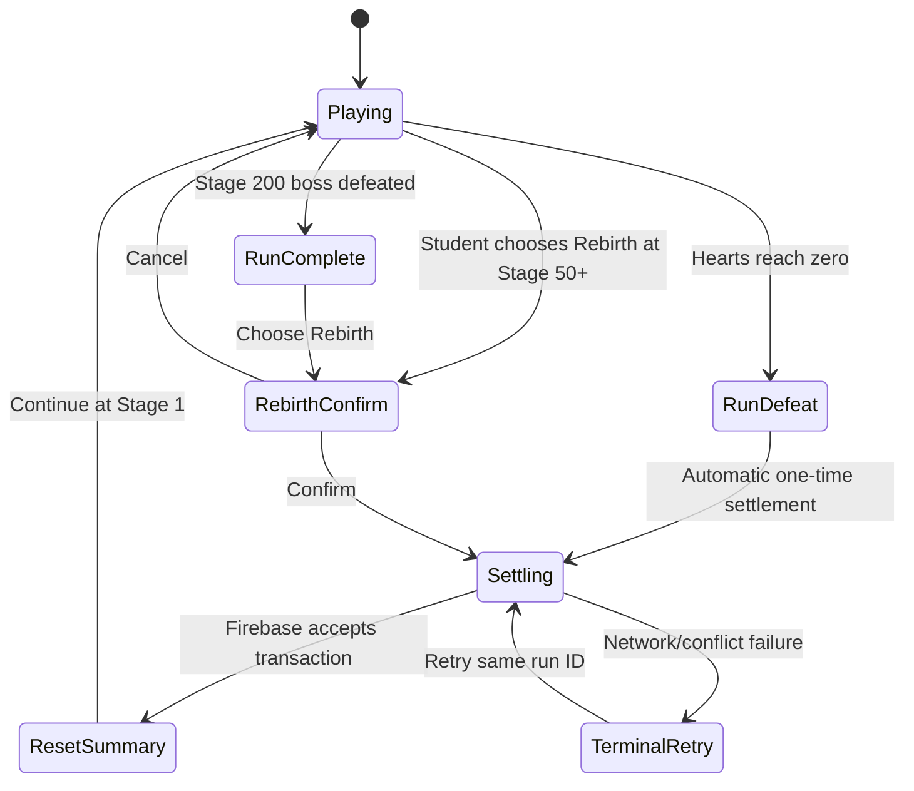

# Design Spec: Persistent Run Settlement and Weapon Ascend

> Approved by the project owner on 2026-08-11 (`LGTM`) after correcting Rebirth to Stage 50+, identical death/Rebirth Legacy ATK calculation, Rank preservation with audit/question-runtime reset, lifetime leaderboard inputs, and a ScriptableObject weapon tier list.

## 1. Player Goal and Experience

Death is a clear end-of-run conversion, not a loss of learning progress. The student sees what the run earned, which temporary things were cleared, which important things stayed, the permanent ATK increase, and the new Power Coin balance before returning to Stage 1.

Rebirth is an optional Prestige decision from Stage 50 onward. It uses exactly the same Stage-based reward and Legacy ATK calculation as death, adds `+1` Prestige/Honor, then starts a fresh Stage 1 run. The student's current Rank survives, while the partial audit and question-cycle runtime restart so strong students remain in appropriately challenging content without carrying an incomplete reset window.

Weapon Ascend gives one obvious Power Coin decision: spend the shown amount to make the same sword stronger. The panel always shows current versus next ATK/CR/CD, the next visual/name milestone, remaining Power Coins, and why confirmation is unavailable.

## 2. System Rules

### Run-settlement state machine



- `RunDefeat` immediately locks combat and economy actions while settlement is pending. `RunComplete` locks further attacks but keeps Profile, Leaderboard, Gacha, and Weapon Ascend available until the student chooses Rebirth. Neither state can start a second settlement.
- Death enters settlement automatically; Rebirth requires Stage 50+, a safe state with no unresolved attempt, and a deliberate confirmation.
- Closing or reconnecting during settlement returns to the terminal state or the accepted summary.
- One `runId` produces at most one Power Coin, Legacy ATK, and Prestige mutation.
- A settlement is all-or-nothing: wallet/profile gain and temporary-state clear cannot separate.

### Preserved versus cleared

| Preserved | Cleared/reset |
| --- | --- |
| Current authoritative Rank | Current visual Stage → 1 |
| Historical Rank/question/cycle analytics | Partial audit → empty 0/0 window |
| Lifetime Rank Currency | Run hearts → equipped defaults |
| Power Coins after reward | Temporary cards/buffs |
| Weapon Ascend, pets, inventory | Run-only currency counters |
| Analytics, Highest Stage, milestone dates | Per-Rank queue runtime → canonical fresh cycles |
| Legacy ATK and Prestige/Honor | Run bonus multiplier snapshot |

### Starting Weapon Ascend curve

```text
WeaponATK(L) = 5 + round(20 × (L / 20)^1.2)
AscendCost(L) = ceil(8 × 1.06^L)
WeaponCR(L) = 3% × floor(L / 10)
WeaponCD(L) = 7% × floor(L / 15)
```

- `L` is the current Ascension Level, 0–100.
- Cost uses current `L` and purchases exactly `L+1`.
- Level 20 is Champion Sword: `ATK +25`, `CR +6%`, `CD +7%`.
- Milestone names/appearance change at Levels 20, 40, 60, 80, and 100.
- Tier names, icons, unlock levels, appearance references, and milestone feedback keys come from an ordered `WeaponAscensionCatalogDefinition` ScriptableObject list; formulas remain in the Ascend policy.
- Only Power Coins are spendable: Weapon Ascend and Pet Gacha are its two sinks.

### Starting Legacy ATK rule

```text
BoostStages = clamp(StageReached, 1, 200)
LegacyATKGainBasisPoints = BoostStages × 10
LegacyATKMultiplier = 1 + LifetimeLegacyBasisPoints / 10,000
```

This is additive, not multiplicatively compounded. Death and Rebirth use the identical formula; Rebirth has no fixed or special ATK bonus. A Stage 50 death or Rebirth grants `+5%`, while a Stage 200 death or Rebirth calculates `+20%` from the same rule. Repeated settled runs may continue accumulating until playtests justify a cap or diminishing returns.

## 3. Interaction Flow

```text
Player dies
  → Input locks and the final run snapshot is shown
    → Firebase settles the run once
      → Summary counts Power Coins and Legacy ATK upward
        → Player reviews “Reset” and “Preserved” columns
          → Continue starts Stage 1

Player reaches Stage 50 or later
  → Rebirth becomes available in a safe lobby state
    → Player selects Rebirth
      → Confirmation previews Stage-based Power Coins, Stage-based Legacy ATK, and +1 Honor
        → Firebase settles once
          → Celebration summary → Stage 1

Player opens Weapon Ascend in Main Menu
  → Panel shows current sword, next stats, exact cost, and next milestone
    → Player confirms one Ascend
      → Immediate busy acknowledgement prevents double tap
        → Firebase atomically spends Power Coins and raises one level
          → Stat count-up and milestone transformation when applicable
```

## 4. Feedback and Juice

All timing below is a starting value requiring human device playtesting.

| Trigger | Visual | Audio | Starting timing |
| --- | --- | --- | --- |
| Death terminal | Hearts empty, combat desaturates, `RUN ENDED` card | Soft low impact; no punitive buzzer | 350 ms transition |
| Settlement accepted | Power Coins and Legacy ATK count upward; preserved items remain green/check-marked | Coin ticks plus warm completion chord | 600–1,000 ms, skippable |
| Rebirth accepted | Gold/blue radial burst, Honor badge pulse, sword silhouette rises | Distinct rebirth fanfare | 1,200 ms; reduced-motion 350 ms |
| Normal Ascend | Sword and ATK number pulse once | Short metal/energy chime | 250 ms |
| CR/CD milestone | CR/CD badge enters with icon and text, not color alone | Layered higher chime | 450 ms |
| Weapon transformation | Old/new name crossfade and silhouette swap | Transformation flourish | 800 ms; reduced-motion 300 ms |
| Insufficient Power Coins | Cost shakes slightly; “Need X more” appears | Gentle blocked tap | 180 ms |
| Save failure | Values remain unchanged; Retry appears | Neutral alert | Immediate |

No mandatory animation blocks acknowledgement of an accepted transaction. Count-ups may be tapped to finish instantly.

## 5. Five-Component Evaluation

| Component | Requirement |
| --- | --- |
| Clarity | Preview exact reset gains/losses and exact Ascend before/after values before confirmation. |
| Motivation | Every meaningful run becomes Power Coins plus visible permanent power; milestone weapons provide identity changes. |
| Response | Busy states acknowledge immediately, reject duplicate input, and allow Retry without recalculation. |
| Satisfaction | Reset, milestone, and transformation use distinct visual and audio feedback at different intensities. |
| Fit | Mathematics Rank progress remains safe while adventure progress resets and permanent power grows. |

## 6. Edge and Abuse Cases

- Stage 1 death: `+0.1%` Legacy ATK and possibly zero Power Coins; summary explains that deeper Stages increase rewards.
- Duplicate/deferred callback: same `runId` or Ascend transaction returns the accepted result without another mutation.
- Disconnect during terminal state: no new combat begins until the existing settlement is accepted.
- Insufficient coins/stale revision: no level or balance changes; reload authoritative state.
- Level 99→100: apply final stats/transformation once; later attempts show `MAX LEVEL`.
- Rank changes just before reset: preserve the accepted final Rank, then clear audit score/count and rebuild question queues from canonical catalog order.
- Rebirth before Stage 50 or during a committed question: unavailable; no transaction is created.
- Leaderboard after reset: Current Stage becomes 1, while lifetime Highest Stage and accumulated Rank Currency remain unchanged.
- Currency earned on the fatal attempt remains included in run counters before settlement.
- Intentional early-death farming: measure combined useful progression per minute; tune the reward exponent or Legacy rule before unrelated combat stats.
- Overflow/corrupt values: reject settlement/Ascend and fail closed rather than clamp a paid transaction silently.

## 7. Playtest and Tuning

The numeric curves are starting values, not established balance.

- New-player test: student predicts four of four outcome values before Ascend/reset; target 8/10 correctly explained events.
- Economy test: compare Pet Gacha and Ascend choices at Levels 0, 20, 50, and 90.
- Pacing test: record correct answers per enemy before and after common Weapon/Legacy states.
- Abuse test: intentional deaths at Stages 2, 10, 25, and 50 must not outperform continuing a viable run.
- Adjustment order: first improve preview/reason messaging, then tune Ascend cost, then ATK curve, then Legacy cap/diminishing returns.

## 8. Assumptions Requiring Approval

> [!WARNING]
> `Exponential calculus` is interpreted as a gentle nonlinear power curve for Weapon ATK and a true exponential Power Coin cost. Making ATK itself compound at the rate required to reach +25 by Level 20 would create extreme Level 100 values.

> [!WARNING]
> `Stage = 0.1% multipliers` is interpreted as additive `+0.1% ATK` per Stage reached. Death and Rebirth use the identical `StageReached × 0.1%` rule; only Rebirth adds Prestige/Honor.

## 9. GDD Alignment

- `@tag:combat-stats`: defines Weapon and Legacy contributions before Rank/in-run/critical multipliers.
- `@tag:run-reset`: preserves active Rank/account history while clearing the partial audit, question runtime, and rogue-lite run state.
- `@tag:economy`: makes Rank Currency accumulation-only and limits Power Coin sinks to Ascend/Gacha.
- `@tag:server-authority`: requires atomic, idempotent Firestore acceptance.
- `@tag:feedback`: provides visible/audio reset and upgrade feedback.
- `@tag:guardrails`: prevents duplicated settlement and Stage 200 farming while preserving Rank and intentionally resetting audit/question runtime.

## 10. Player Hub and Rebirth Preview Addendum

Approved by the project owner on 2026-08-12 (`LGTM`).

- Replace the header Weapon Ascend shortcut with `PLAYER HUB`.
- Present current Effective ATK, the white Base ATK + Weapon ATK subtotal, and the green rounded Legacy/Rebirth contribution as separate values.
- Show `PET ATK: NO STAT CONFIGURED` until a real Pet definition/stat source exists; do not invent a Pet multiplier from the loadout ID.
- Keep Weapon Ascension inside Player Hub with current weapon ATK/CR/CD, next-level values, exact Power Coin cost, current balance, and an explicit shortfall or maximum-level reason.
- Rebirth preview shows Power Coins, Legacy ATK, Effective ATK, and Prestige as current-to-result values before confirmation.
- The death settlement uses the same structured result view and cannot be dismissed after a save failure; it remains on Retry.

The feedback priority is Clarity first: the player must be able to predict every permanent value before accepting Rebirth or a Weapon upgrade. No new balance values are introduced by this addendum.
