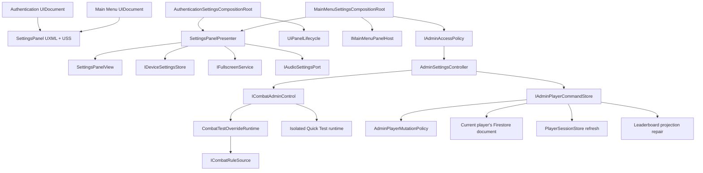

# Shared Settings Panel and Admin Test Tools — Architecture Plan

Architecture approved by the product owner on 2026-09-10 (`lgtm`).

## Scope and Existing Decisions

This plan consumes the approved design spec and extends these accepted boundaries:

- ADR-014: scene-scoped UI composition, shared motion, thin views, and panel lifecycle ownership.
- ADR-008: one stat projection and revision-checked atomic progression/economy commands.
- ADR-015: synthetic/fallback questions remain isolated from real progression.
- ADR-003/006: the running direct-Firestore prototype is client-tamperable; UI hiding is not security.
- ADR-016: protected production mutations ultimately belong behind trusted commands, but backend deployment remains a separate checkpoint.

No scene, script, Firebase rule, build setting, or player data is changed by this plan.

## Architectural Decisions

1. `SettingsPanel.uxml` and `SettingsPanel.uss` are the only Settings content/style definitions. Authentication and Main Menu instantiate the same template.
2. Panel instances and their navigation remain scene-scoped. No persistent global UI manager is introduced.
3. A small non-UI device-preference store owns Music/SFX values. `PlayerPrefs` is permitted only for these non-critical preferences.
4. Fullscreen state is queried from the platform and changed through an interface; remembered intent never falsely reports actual fullscreen.
5. Admin visibility and command eligibility share one fail-closed, data-defined account policy. Main Menu may render Admin only after a hydrated session.
6. ATK/CR/CD, Invincibility, and Quick Test Questions are session-only test overrides. They never enter `gamedata` or public projections.
7. Quick Test Questions use an isolated in-memory practice runtime and answer `0`; no academic, currency, analytics, settlement, or leaderboard write is possible.
8. Rank, wallet, Restore HP, and Reset are explicit revision-checked current-account commands. UI never patches Firestore directly.
9. Reset replaces the entire current student's `gamedata` map, preserves `userdata`, and tracks leaderboard cleanup in a separate admin-operation receipt as a recoverable multi-step command.
10. Missing policy/limits/session data, unresolved attempts, pending presentation receipts, or revision conflicts fail closed.

## System Diagram



## Assembly and Dependency Direction

```text
PowerMath.UI.Core
  - shared view, panel presenter contracts, preference/fullscreen contracts

PowerMath.Audio
  - existing MusicController and SfxController

PowerMath.Gameplay.Combat.Core
  - immutable combat rule snapshots and engine-safe test hooks

PowerMath.Gameplay.Combat.Unity
  - combat override runtime and ICombatAdminControl adapter

Assembly-CSharp scene/application layer
  - Authentication/Main Menu composition
  - audio/fullscreen adapters
  - admin access policy, Firestore command store, session refresh
```

Dependencies point inward toward interfaces and pure policies. `PowerMath.UI.Core` does not reference Session, Firestore, or combat assemblies. Combat Core does not reference UI, Unity scene objects, or Firestore.

## Interface Definitions

The signatures below are contracts for implementation; names may be adjusted only if existing conventions require it without changing responsibilities.

```csharp
public readonly struct DeviceSettingsSnapshot
{
    public float MusicVolume { get; }
    public float SfxVolume { get; }
    public bool FullscreenIntent { get; }
}

public interface IDeviceSettingsStore
{
    DeviceSettingsSnapshot Load();
    void Save(DeviceSettingsSnapshot value);
}

public interface IFullscreenService
{
    bool IsFullscreen { get; }
    FullscreenChangeResult TrySetFullscreen(bool enabled);
}

public interface IAudioSettingsPort
{
    float MusicVolume { get; set; }
    float SfxVolume { get; set; }
    void PreviewSfx();
}
```

```csharp
public interface ISettingsPanelHost
{
    bool TryOpen(VisualElement panel, Focusable opener);
    bool TryClose(Focusable fallbackFocus);
    bool IsOpen { get; }
}

public interface IAdminAccessPolicy
{
    bool TryAuthorize(PlayerSnapshot player, out AdminAccountIdentity identity);
}
```

```csharp
public readonly struct CombatRuleSnapshot
{
    public PlayerCombatStats Stats { get; }
    public bool IsInvincible { get; }
}

public interface ICombatRuleSource
{
    CombatRuleSnapshot CaptureForAttempt();
}

public interface ICombatAdminControl
{
    CombatAdminState State { get; }
    event Action<CombatAdminState> Changed;

    bool TryApply(CombatTestOverrideRequest request, out string error);
    bool TryRestoreHearts(out string error);
    bool TrySetQuickTestMode(bool enabled, out string error);
    void ClearForLogout();
}
```

```csharp
public enum AdminPlayerCommandKind
{
    SetRank,
    SetWallet,
    RestoreHearts,
    ResetSave
}

public sealed class AdminPlayerCommand
{
    public string OperationId { get; }
    public string ExpectedPlayerId { get; }
    public long ExpectedRevision { get; }
    public AdminPlayerCommandKind Kind { get; }
    public AdminPlayerCommandPayload Payload { get; }
}

public interface IAdminPlayerCommandStore
{
    IEnumerator Execute(
        AdminPlayerCommand command,
        Action<PlayerSnapshot, AdminCommandReceipt> succeeded,
        Action<string> failed);
}
```

## Class Responsibility Table

| Class | Responsibility | Depends On | Owned State |
| --- | --- | --- | --- |
| `SettingsPanelView` | Bind one shared Settings subtree, render tabs/control/status states, emit intents | UI Toolkit only | Bound elements and selected tab presentation |
| `SettingsPanelPresenter` | Coordinate General/Sound behavior without scene or player knowledge | View, preference store, fullscreen/audio ports, panel host | Open state and current device snapshot |
| `PlayerPrefsDeviceSettingsStore` | Versioned, clamped local serialization of non-critical preferences | `PlayerPrefs` | Preference keys only |
| `UnityFullscreenService` | Query/set actual native/WebGL fullscreen and return explicit result | `Screen`, WebGL bridge | None |
| `AudioSettingsPort` | Apply volume values and preview SFX | Music/SFX controllers | None |
| `AuthenticationSettingsCompositionRoot` | Compose the shared presenter with a scene-local lifecycle | UIDocument, motion provider | Scene references |
| `MainMenuSettingsCompositionRoot` | Compose shared Settings plus authorized Admin controller | UIDocument, panel host, session, API settings | Scene references |
| `AdminAccessPolicyDefinition` | Author allowed normalized usernames; missing/invalid asset denies all | ScriptableObject | `test1`–`test10` entries |
| `AdminAccountAccessPolicy` | Resolve stable level/username identity and exact allowlist match | Policy definition | None |
| `AdminTestLimitsDefinition` | Author clamps for ATK, CD, and wallet test values | ScriptableObject | Approved limits |
| `AdminSettingsController` | Render Admin, validate input, lock pending commands, show results | Admin view, access policy, combat control, command store | Confirmation/pending UI state |
| `CombatTestOverrideRuntime` | Hold session-only test overrides and publish changes | Limits definition | ATK/CR/CD/invincibility/quick-test snapshot |
| `FixedCombatRuleSource` | Supply immutable normal rules | Player stat projection | Normal rule snapshot |
| `AdminCombatRuleSource` | Decorate normal rules with approved session overrides and freeze them per attempt | Fixed source, override runtime | None |
| `CombatAdminControlAdapter` | Reject unsafe changes, restore hearts, switch isolated Quick Test runtime | Combat coordinator/runtime handle | Current safe-state handle |
| `AdminPlayerMutationPolicy` | Pure validation and before/after computation for Rank, wallet, HP, reset | GDD/domain models, limits | None |
| `FirestoreAdminPlayerCommandStore` | Authorize current account, refresh document, validate revision, idempotently patch, map response | Settings, player, access policy | One in-flight command |
| `AdminCommandReceipt` | Record operation ID/kind/result for retry recovery | None | Immutable result |
| `PlayerResetPayloadBuilder` | Build one complete fresh `gamedata` map including onboarding/tutorial | Defaults contract | None |

## Shared UI Composition

### Assets

- Create `Assets/Project/UI/Shared/SettingsPanel.uxml`.
- Create `Assets/Project/UI/Shared/SettingsPanel.uss`.
- Authentication and Main Menu each declare/instantiate that same UXML template and include the same USS.
- Replace the `AdminPanel` instance inside `LegacyFeaturePanels.uxml` with `SettingsPanel`.
- After bindings and tests migrate, retire `AdminPanel.uxml`, `AdminPanel.uss`, and `AdminPanelController.cs`; do not keep duplicate panel markup.

### Lifecycle

- Main Menu uses an `ISettingsPanelHost` adapter over `IMainMenuPanelHost` with `MainMenuPanelId.Settings`.
- Authentication uses an adapter over `UiPanelLifecycle` and the scene's existing motion provider.
- Only the host/lifecycle owns `display`, `pickingMode`, focus return, enter/exit cancellation, and final hidden/idle state.
- `SettingsPanelView` owns tab classes and content visibility inside the already-open panel; it never opens itself.

## Device Preference Flow

```text
Scene composition
→ load DeviceSettingsSnapshot
→ clamp/corruption fallback
→ apply Music/SFX through IAudioSettingsPort
→ render actual platform fullscreen + saved audio values
→ user changes control
→ apply immediately
→ persist snapshot
→ next scene loads the same values
```

- Use namespaced, versioned preference keys.
- Do not call `PlayerPrefs.Save` for every slider drag if the platform writes synchronously; apply continuously and flush on change completion/panel close/application pause.
- Audio controllers remain playback owners. The preference layer sets public volume properties only.
- Extend `PowerMathWebBridge.jslib` and `WebFullscreenController` for exit/query only if Unity's supported `Screen.fullScreen` path cannot produce a truthful result in WebGL. This is a WebGL plugin change, not a build-setting change.

## Admin Authorization

```text
Hydrated PlayerSnapshot.playerId
→ parse exact levelId:username
→ normalize username with invariant rules
→ compare to AdminAccessPolicyDefinition
→ authorize both tab composition and every command
```

- Editable display name is never consulted.
- Policy defaults to deny all if the asset, player ID, username, or level mapping is invalid.
- Every command repeats authorization immediately before its GET/PATCH; authorization at panel-open time is insufficient.
- The direct-Firestore prototype remains inspectable/tamperable. The architecture makes bypass harder and traceable but does not claim production security.

## Session-Only Combat Override Flow

```text
Admin input
→ AdminSettingsController validates against AdminTestLimitsDefinition
→ ICombatAdminControl checks ready/no-pending-attempt state
→ CombatTestOverrideRuntime updates
→ next CommitAttempt captures one CombatRuleSnapshot
→ resolution uses that frozen snapshot
→ UI keeps TEST OVERRIDES badge visible
```

- `PlayerStatProjectionFactory` remains the only formula owner. ATK/CR/CD overrides replace only its base inputs before weapon/pet/legacy composition.
- CR remains clamped to the GDD's 0–100% range. ATK is positive. CD is non-negative and capped by the authored limits asset; no new balance maximum is invented in code.
- A committed attempt freezes its rule snapshot. Later UI changes cannot alter that attempt's critical roll or damage.
- Invincibility changes only player-damage application. The resolution still records that the enemy attacked, but records zero applied heart loss and a test-override marker for presentation.
- Restore HP is allowed only in a ready phase with no pending presentation. The authoritative/current combat snapshot is saved through the explicit admin command path before the view reports success.
- Logging out clears every session-only override.

## Quick Test Questions

Enabling Quick Test Questions is a runtime-mode transition, not a flag inside the live academic engine.

```text
Enable request at safe boundary
→ cancel live presentation object only after it is idle
→ clone saved Stage/read-only combat projection
→ create practice run ID
→ build synthetic per-Rank catalog whose correct answer is 0
→ use Simulation/instant question presentation
→ use ImmediateGameplayPersistence
→ disable persistent economy/leaderboard projection
→ show TEST QUESTION / PROGRESS NOT SAVED banners
```

- The real player snapshot, live academic queues, active receipt, currencies, analytics, and leaderboard remain untouched.
- Disabling Quick Test disposes the practice runtime and rebuilds normal combat from the still-current `PlayerSessionStore.Snapshot`.
- Mode changes are rejected while an attempt, result presentation, settlement, or panel-blocking operation is active.
- This reuses ADR-015's isolation rule. It does not add a second persistence exception.

## Persistent Admin Commands

### Common Command Protocol

1. Validate current authenticated identity and allowlist.
2. Validate command payload with pure policy and data-defined clamps.
3. GET the current level document.
4. Revalidate the current student map, schema version, player ID, revision, and current command safety state.
5. Recover a matching prior receipt from the student's `adminops` sibling map or build an exact update-mask patch.
6. PATCH with `currentDocument.updateTime` and incremented revision.
7. Map the committed player projection, update `PlayerSessionStore`, and refresh dependent UI.
8. On conflict or uncertain response, GET and recover by operation ID; never blindly replay.

Only one admin command may be in flight per panel/controller.

### Rank

- Patch active Rank, clear audit score/count, clear active attempt, and rebuild the selected Rank inventory from the loaded canonical catalog.
- Do not modify Silver/Gold/Diamond wallet totals.
- Reject when any committed attempt or pending presentation exists.
- Reload/recompose combat after the accepted snapshot is published.

### Wallet

- Set only explicitly changed Silver, Gold, Diamond, and Power Coin leaves.
- Preserve current-run earned counters; they describe the run, not the lifetime manual target.
- Refresh private HUD/profile and repair the public leaderboard projection after commit.

### Restore HP

- Set current hearts to the existing valid maximum only; do not change maximum hearts or equipment.
- Update both the active run projection and live encounter engine after the patch succeeds.

### Reset

- Use the canonical defaults planner/payload builder; do not maintain a second hand-written defaults list.
- The reset command carries one operation ID, one pre-generated new public player ID, and the old public player ID.
- Phase A atomically replaces the entire current student's `gamedata` map, preserves the sibling `userdata` credential map, and records a reset receipt/projection-cleanup pending marker under a separate `adminops` sibling map.
- Phase B removes the old leaderboard projection and publishes/removes the new default projection according to current leaderboard policy.
- Phase C clears the pending marker. If B/C fails, the UI reports partial completion and offers repair using the stored receipt; it must not claim a clean reset.
- Bootstrap ignores `adminops`; it is command-recovery metadata, not player gameplay or preparation state.
- After completion, clear runtime credentials only if the existing Remember Device policy requires it; always clear `PlayerSessionStore` and load Bootstrap for fresh onboarding.

## Authority Decisions

| Decision | Choice | Rationale |
| --- | --- | --- |
| Panel state | Scene-scoped | Follows ADR-014 and prevents cross-scene UI ownership bugs |
| Audio preferences | Local device store | Non-critical comfort preference needed before login |
| Fullscreen truth | Platform query | Browser/OS can change state outside Unity |
| Admin visibility | Hydrated current-account allowlist | Authentication has no trusted player identity |
| Admin command eligibility | Rechecked in command store | UI visibility alone is not authorization |
| Combat overrides | Session-only, captured per attempt | Fast QA without persisting balance cheats |
| Quick Test persistence | Isolated in-memory practice | Follows ADR-015 and protects educational data |
| Rank/wallet/HP/reset | Revision-checked current-player Firestore commands | These are protected persisted state mutations |
| Limits | ScriptableObject-authored, fail closed | Avoids hidden magic numbers and keeps clamps reviewable |
| Production trust | Future trusted command service | Current direct client remains prototype-only per ADR-003/016 |

## Affected Existing Files

### Modify

- `Assets/Project/UI/Authentication/AuthenticationScreen.uxml`
- `Assets/Project/UI/Authentication/AuthenticationScreen.uss`
- `Assets/Project/UI/MainMenuUI.uxml`
- `Assets/Project/UI/MainMenu/LegacyFeaturePanels.uxml`
- `Assets/Project/UI/MainMenu/MainMenuShell.uxml` (tooltip/name normalization only)
- `Assets/Project/Script/UI/Authentication/AuthenticationView.cs` or its presenter only to compose/bind the shared feature; do not absorb settings logic
- `Assets/Project/Script/UI/MainMenu/SocialProfile/SocialProfileCompositionRoot.cs` to stop composing `AdminPanelController`
- `Assets/Project/Script/UI/Core/WebFullscreenController.cs`
- `Assets/Plugins/WebGL/PowerMathWebBridge.jslib`
- `Assets/Project/Script/Audio/Music/MusicController.cs`
- `Assets/Project/Script/Audio/Sfx/SfxController.cs`
- `Assets/Project/Script/Gameplay/Combat/Core/LocalRunEncounterEngine.cs`
- `Assets/Project/Script/Gameplay/Combat/Core/LocalAttemptTransactionEngine.cs`
- `Assets/Project/Script/UI/MainMenu/CombatLobbyCompositionRoot.cs`
- `Assets/Project/Script/Session/PlayerResetPayloadBuilder.cs`
- `Assets/Project/Script/Session/FirestorePlayerResetService.cs` (migrate or replace behind command interface)

### Create

- `Assets/Project/UI/Shared/SettingsPanel.uxml`
- `Assets/Project/UI/Shared/SettingsPanel.uss`
- `Assets/Project/Script/UI/Core/Settings/SettingsPanelView.cs`
- `Assets/Project/Script/UI/Core/Settings/SettingsPanelPresenter.cs`
- `Assets/Project/Script/UI/Core/Settings/DeviceSettings.cs`
- `Assets/Project/Script/UI/Settings/SettingsCompositionRoots.cs`
- `Assets/Project/Script/UI/Settings/AudioSettingsPort.cs`
- `Assets/Project/Script/UI/MainMenu/Admin/AdminSettingsController.cs`
- `Assets/Project/Script/UI/MainMenu/Admin/AdminAccessPolicy.cs`
- `Assets/Project/Script/UI/MainMenu/Admin/FirestoreAdminPlayerCommandStore.cs`
- `Assets/Project/Script/UI/MainMenu/Admin/AdminPlayerMutationPolicy.cs`
- `Assets/Project/Script/Gameplay/Combat/Core/CombatRuleSource.cs`
- `Assets/Project/Script/Gameplay/Combat/Unity/CombatAdminControlAdapter.cs`
- `Assets/Project/Script/Gameplay/Combat/Unity/CombatTestOverrideRuntime.cs`
- `Assets/Project/Settings/Admin/AdminAccessPolicy.asset`
- `Assets/Project/Settings/Admin/AdminTestLimits.asset`

### Retire After Migration

- `Assets/Project/UI/MainMenu/AdminPanel.uxml`
- `Assets/Project/UI/MainMenu/AdminPanel.uss`
- `Assets/Project/Script/UI/MainMenu/AdminPanelController.cs`

Retirement occurs only after references/tests prove the shared replacement is active. Existing files are not deleted during architecture approval.

## Test Architecture

- UI contract tests load both scene UXML roots and assert they instantiate the same Settings template names, tabs, controls, and classes.
- View/presenter EditMode tests cover General/Sound rendering, persistence corruption fallback, tab focus, Admin removal, and pending states.
- Access-policy tests cover `test1`, `TEST10`, `test01`, `test11`, prefixes/suffixes, display-name spoofing, malformed player IDs, and missing policy assets.
- Combat Core tests prove rule capture per attempt, clamp enforcement, invincibility damage semantics, Restore HP safe-state rules, and no mid-attempt mutation.
- Quick Test tests assert answer `0`, immediate presentation, practice run ID, `ImmediateGameplayPersistence`, no live receipt consumption, and no session/wallet/analytics mutation.
- Command-store tests use fake transport for revision conflict, lost response recovery, wrong account, missing schema, duplicate operation ID, wallet overflow, Rank inventory rebuild, and reset partial leaderboard failure/repair.
- PlayMode tests open/close Settings in both scenes, verify focus return and matching geometry, then exercise Main Menu Admin visibility and combat blocking.
- WebGL human tests verify enter/exit fullscreen from a direct user gesture and actual-state correction.

## Implementation Sequence After Approval

1. Add shared UXML/USS and UI contract tests without removing AdminPanel.
2. Add device preference/fullscreen/audio ports and bind Authentication.
3. Bind Main Menu through `IMainMenuPanelHost`; verify visual parity.
4. Add fail-closed access policy and Admin tab composition.
5. Add session-only combat rule source and Invincibility/Restore HP safe-state seams.
6. Add isolated Quick Test runtime using answer `0` and immediate persistence.
7. Add revision-checked Rank/wallet/HP command policy/store.
8. Migrate reset to canonical defaults plus leaderboard repair receipt.
9. Run EditMode/PlayMode/UI contract tests and human child/admin/WebGL checks.
10. Retire old AdminPanel assets/controller and write QA/DevLog artifacts.

## Architecture Checkpoint

Approval authorizes implementation of this plan and acceptance of ADR-017. It does not authorize Firebase rule changes, a trusted backend deployment, build/CI settings, new dependencies, publishing, PR merge, or executing Reset on any account.
