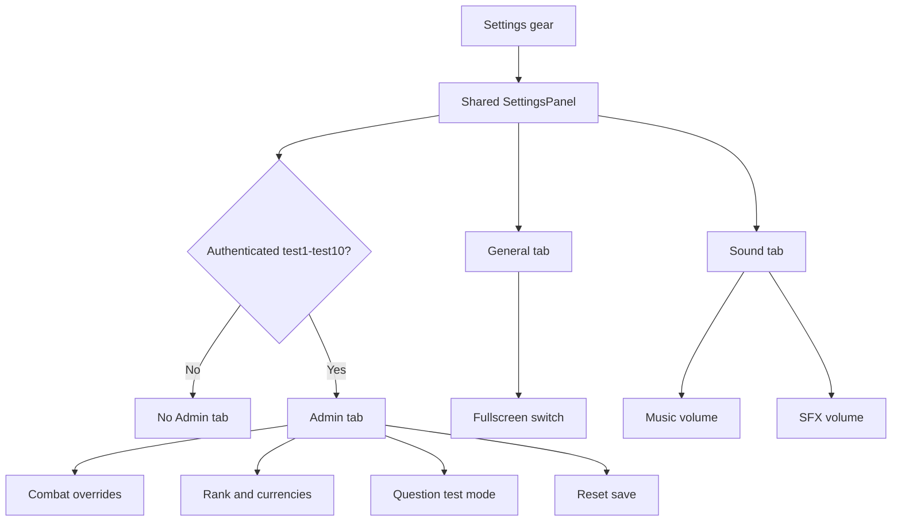
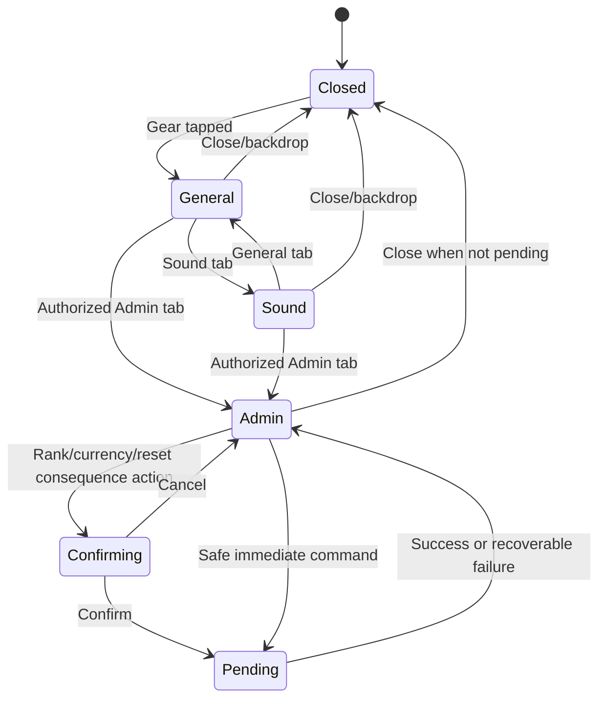

# Shared Settings Panel and Admin Test Tools — Design Specification

## Current State

- Authentication displays a gear button named `Utility / Settings`, but `AuthenticationView` does not bind it and no settings panel exists in that scene.
- Main Menu displays a gear button named `setting`; `AdminPanelController` opens `AdminPanel.uxml` through `MainMenuPanelId.Settings`.
- The current Main Menu panel contains only account summary and reset controls and is not restricted to admin users.
- `MusicController` and `SfxController` expose runtime volume properties, but no shared user-facing settings preference owns or persists them.
- Fullscreen entry exists through `WebFullscreenController`; there is no shared two-way fullscreen control.
- Combat test values come from `CombatRuntimeSettingsDefinition`, while authoritative progression and wallet data live in `PlayerSnapshot`/Firestore paths.
- Player preparation is not a separate `PlayerPrep` save file. It is represented by onboarding/tutorial fields inside `gamedata`.

## Target Experience

The gear always means the same thing. Tapping it opens one friendly, readable panel with three top tabs:

1. **General** — one obvious fullscreen switch.
2. **Sound** — Music and SFX volume controls.
3. **Admin** — visible only to a signed-in approved test account.

General and Sound should feel like part of the child's game rather than a technical control panel: large controls, short labels, immediate visible response, no dense paragraphs, and no unnecessary options. Admin may be denser because it is an adult/test surface, but it remains grouped, scrollable, and explicit about consequences.

## Approved-Default Proposal

> [!WARNING]
> This section is proposed, not yet approved. Implementation must wait for the design and architecture checkpoints.

- Admin identity is an exact, case-insensitive match after normalization: `test1`, `test2`, …, `test10`. Names such as `test01`, `test11`, `mytest1`, or a display name of `test1` do not qualify.
- Authorization uses the authenticated username parsed from stable account identity, never the editable display name.
- Authentication has no authenticated player session, so its panel contains only General and Sound; the Admin tab is not created or is fully removed from layout and focus order.
- Main Menu creates the Admin tab only when the current account qualifies.
- Admin commands can target only the currently signed-in qualifying account.
- Device preferences (fullscreen intent and audio volumes) are local, non-critical preferences. Gameplay/admin mutations are not stored in `PlayerPrefs`.
- Reset preserves `userdata` username/password but rebuilds `gamedata` from fresh defaults, including onboarding and tutorial/player-preparation state, then removes the old leaderboard projection and reloads Bootstrap.

## Information Architecture

## Shared Panel Layout

- One reusable `SettingsPanel.uxml` and `SettingsPanel.uss` is instantiated by both scene roots.
- Both instances use the same modal shell, header, tab strip, content viewport, close action, responsive breakpoints, and style classes.
- The panel uses existing MathWorld palette, typography, control, state, modal, and close-icon conventions rather than creating a separate visual language.
- The modal follows the existing social-panel footprint and safe-area behavior. General and Sound should fit without scrolling in the normal landscape layout; Admin owns the scroll view.
- Tab selection changes only the content viewport. Header, close button, and panel dimensions do not jump between tabs.
- Tab order is General, Sound, then Admin when authorized.
- Each standard setting is a rounded horizontal card: icon and short description on the left; switch/slider and current value on the right.
- Narrow layouts stack the value/control under the label while retaining the same content order.
- Focus begins on the active tab. Close returns focus to the gear that opened the panel.

## General Tab

### Fullscreen

- Label: `Full Screen`.
- Supporting copy: `Use the whole screen`.
- The switch reflects the actual current fullscreen state whenever the panel opens.
- Turning it on invokes platform-appropriate fullscreen from the user's direct click/tap.
- Turning it off exits fullscreen where supported.
- If the platform/browser rejects the request, the switch returns to the actual state and a short non-blocking message explains that fullscreen was unavailable.
- The control must not imply success until the platform state confirms it.

No additional General options are included in this slice. This keeps the child-facing panel intentionally small.

## Sound Tab

### Music

- A Music slider controls `MusicController.MusicVolume` across login, biome battle, enemy override, and boss music.
- The row shows a speaker/music icon, `Music`, and a simple percentage value.
- Changes apply immediately without restarting the active track.

### SFX

- An SFX slider controls `SfxController.SfxVolume` for UI, combat, character, enemy, and question cues.
- The row shows an effects icon, `SFX`, and a simple percentage value.
- Releasing the slider plays one short preview cue unless SFX is at zero.

### Persistence

- Music and SFX preferences are shared device preferences loaded before either scene renders audio.
- Zero volume is represented by the slider value; separate mute switches are not added in this slice.
- Values are clamped to their supported range and corrupted local values fall back safely.

## Admin Visibility and Test-Mode Banner

- Authorized accounts see an `ADMIN` tab with a distinct but non-alarming badge.
- Opening Admin shows the stable account username and a persistent `TEST OVERRIDES` banner.
- Every active override is summarized at the top so a tester cannot forget that normal gameplay rules are bypassed.
- Admin controls are disabled while a command is pending or while an unresolved combat attempt makes the requested mutation unsafe.
- Hiding the tab is presentation only. Architecture must enforce the same allowlist at the command boundary before accepting mutations.

## Admin: Combat Configuration

### Player ATK

- Integer control for Base ATK.
- Apply affects newly composed combat results and does not silently rewrite weapon, pet, legacy, Rank, or buff contributions.
- The UI displays the resulting Effective ATK separately when available.

### Critical Rate (CR)

- Percentage control clamped to 0–100%.
- The value is labelled `Critical Rate (CR)` so the abbreviation is never unexplained.

### Critical Damage (CD)

- Percentage control labelled `Bonus Critical Damage (CD)`.
- It controls the bonus portion of the critical multiplier, matching the GDD definition.

### Player HP / Invincibility

- `Invincible` switch prevents test-account HP from decreasing while active.
- `Restore HP` sets current HP to the currently valid maximum without changing the equipped/loadout maximum.
- Invincibility has a persistent visible badge in combat, not only inside Settings.
- Turning Invincibility off does not retroactively apply prevented damage.

## Admin: Rank Override

- A segmented selector offers Silver, Gold, and Diamond.
- Selecting the current Rank is a no-op.
- Selecting another Rank opens a consequence confirmation explaining that the partial five-question audit will be cleared.
- On confirmation, the command changes active Rank, clears audit score/resolved count, cancels no in-flight attempt, and rebuilds the selected Rank's active question-cycle runtime from canonical content.
- Rank Currency totals remain unchanged because they are lifetime achievement counters, not the active Rank.
- The change is blocked while an attempt is committed or awaiting authoritative resolution.

> [!CAUTION]
> This is a test-only exception to normal Rank placement. It must be traceable as an admin command and must not masquerade as an earned promotion/demotion.

## Admin: Skip Question Video / Answer Zero

- Toggle label: `Quick Test Questions`.
- Supporting copy: `Skip the video and use 0 as the correct answer`.
- When active for an authorized test account, beginning a question bypasses video playback, presents the answer input immediately, and defines `0` as the expected answer for that test attempt.
- No random answer is generated.
- The combat screen displays a `TEST QUESTION: ANSWER 0` banner.
- This mode does not activate or deactivate in the middle of a committed attempt; changes apply to the next attempt.
- Architecture must explicitly decide whether these synthetic correct results participate in audit, Rank Currency, analytics, and leaderboard projection. Recommended default: they affect combat testing but are excluded from educational audit/analytics and ordinary leaderboard publication.

## Admin: Currency Manipulation

- Separate numeric fields show Silver, Gold, Diamond, and Power Coins.
- The action uses explicit `Set values` semantics rather than ambiguous add/subtract behavior.
- Inputs reject negatives and unsupported overflow before submission.
- The confirmation summary shows before → after values for every changed currency.
- Unchanged fields are not written.
- Rank Currency manipulation is visibly marked as a test adjustment because the GDD normally treats it as cumulative achievement data.
- A successful command refreshes the shared session snapshot and all HUD/profile/leaderboard projections consistently.

## Admin: Reset User Data

- The destructive section remains visually separated at the bottom of Admin.
- Copy states exactly what is preserved and removed:
  - Preserved: username/password account credentials.
  - Removed/reset: `gamedata`, progression, run state, active attempt, Rank/audit/question runtime, currencies, inventory/loadout, analytics, onboarding/tutorial/player preparation, and public leaderboard projection.
- Reset cannot target any username other than the current authorized account.
- Confirmation requires the tester to enter the current username, then activate `Reset to Fresh Start`.
- While pending, all panel controls and close/navigation actions are locked against duplicate commands.
- Success clears the local session and remembered runtime state, then returns through Bootstrap so the opening/player-preparation flow begins as a fresh account.
- Failure leaves the current session intact and displays a retryable error.

## Interaction States

## Feedback and Motion

- Opening/closing and tab transitions reuse the project's existing panel transition behavior; this spec introduces no new timing values.
- Switches and sliders update their visual state immediately; platform or command confirmation then settles success/failure.
- Successful preference changes use a compact check/state tint and optional quiet UI cue.
- Failed changes use readable inline copy plus the shared status toast; color is never the only signal.
- Destructive and progression commands show before/after summaries and explicit completion text.
- Reduced Motion removes large translation/scale changes while retaining focus, opacity, text, and audio semantics.

## Five-Component Evaluation

| Component | Design response | Acceptance signal |
| --- | --- | --- |
| Clarity | Three stable tabs, one control per child-facing card, explicit admin banners and before/after summaries. | A child finds fullscreen and audio without instruction; a tester can explain every pending mutation. |
| Motivation | General/Sound improve comfort without exposing technical complexity; Admin accelerates controlled QA. | Children do not enter Admin flows; test accounts can reach a desired test state without editing assets. |
| Response | Preference controls apply immediately; commands lock only their unsafe mutation window. | Every tap/drag acknowledges promptly and duplicate command spam produces one operation. |
| Satisfaction | Shared visual language, clear selected tab, lightweight audio/visual confirmation. | The same panel feels continuous between Authentication and Main Menu. |
| Fit | Friendly standard tabs for children; technical controls isolated behind test identity. | Normal users see no balance/debug language. |

## Risks and Abuse Cases

- A client-only allowlist can be inspected or bypassed in WebGL. The accepted direct-Firestore prototype already has documented security limitations; command-side checks still must not be omitted or described as secure authorization.
- The exact `test1`–`test10` range may exist in multiple grade documents. Stable player identity must include the resolved level document so commands update only the signed-in record.
- Applying ATK/CR/CD/HP changes during an unresolved attempt can desynchronize the displayed and resolved result; block until safe.
- Synthetic answer-zero mode can contaminate audits, analytics, currencies, and leaderboards unless the architecture defines explicit exclusion.
- Rank changes can strand a partial audit or active question inventory; use one atomic command with reset semantics.
- Currency changes can conflict with another device; use revision checks and refresh after success.
- Reset can leave a stale leaderboard entry if projection deletion fails. Reset must report partial failure and retry/repair rather than silently claiming full success.
- Fullscreen state can change outside the switch through browser/OS controls; refresh the actual state whenever the panel opens or regains focus.

## Playtest Scenarios

### New Player / Child Readability

- From Authentication, ask a child to make music quieter and return to login without instruction.
- From Main Menu, ask them to enter fullscreen and close Settings.
- Pass when they use General/Sound without encountering or asking about Admin controls.

### Shared-Panel Consistency

- Open Settings in Authentication, note selected tab, geometry, labels, and controls; repeat in Main Menu at the same resolution.
- Pass when General/Sound content and dimensions match and values persist across the scene transition.

### Admin Gate / Abuse

- Test `test1`, `TEST10`, `test01`, `test11`, `mytest1`, and a non-admin whose display name is `test1`.
- Pass only the normalized exact account usernames `test1` through `test10`.
- Attempt direct invocation of each admin command from a non-admin client path; pass when the command boundary rejects it.

### Mutation Stress

- Spam Apply/Confirm, switch tabs during pending work, disconnect mid-command, reconnect from another device, and retry a revision conflict.
- Pass when each transaction applies at most once and the refreshed snapshot matches the saved result.

### Combat Safety

- Change ATK/CR/CD and Invincibility before a run, between attempts, and during a committed attempt.
- Pass when safe changes apply at the documented boundary and unsafe changes are blocked with a reason.

### Rank and Quick-Test Integrity

- Change Rank with 0–4 partial audit results and with an active attempt; verify audit reset and question inventory behavior.
- Run Quick Test Questions and verify whether audit/currency/analytics/leaderboard behavior matches the approved architecture decision.

### Reset Recovery

- Reset an authorized test account with progression, inventory, active run, preparation complete, analytics, and leaderboard data.
- Pass when credentials still authenticate, Bootstrap treats the game as fresh, preparation starts again, and no stale public projection remains.

## Tuning Priority

1. Clarity of General/Sound and actual fullscreen/audio state.
2. Authorization visibility and command rejection.
3. Mutation atomicity, pending-state behavior, and recovery.
4. Admin density and responsive layout.
5. Motion/audio polish.

## Human Design Checkpoint

Approve or change these decisions before architecture:

1. Exact admin accounts are normalized `test1` through `test10`, and Admin is Main-Menu-only.
2. General contains only Full Screen in this slice.
3. Rank override clears the partial audit and rebuilds the selected Rank's active question cycle.
4. Quick Test Questions skips video and uses answer `0`; recommended behavior excludes synthetic attempts from educational audit/analytics and ordinary leaderboard publication.
5. Reset preserves credentials but rebuilds all `gamedata`, including onboarding/tutorial preparation, and removes the leaderboard projection.

Design approved by the product owner on 2026-09-10 (`LGTM`).

Approval authorizes the architecture-plan phase only. It does not authorize implementation, live Firebase rule changes, build settings, dependencies, deployment, publishing, merge, or an actual reset of any user.
