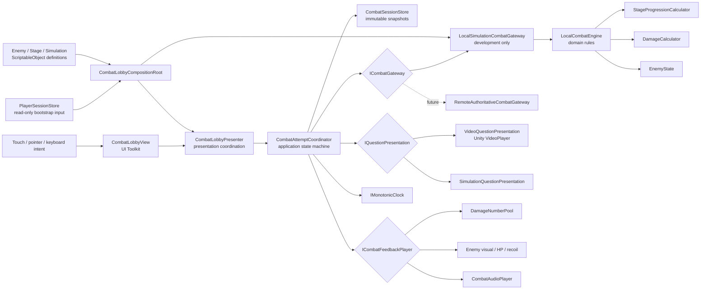
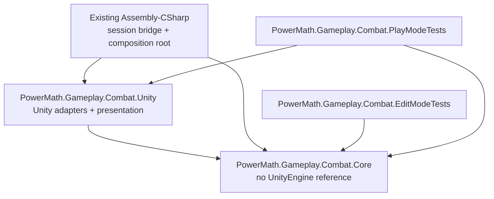
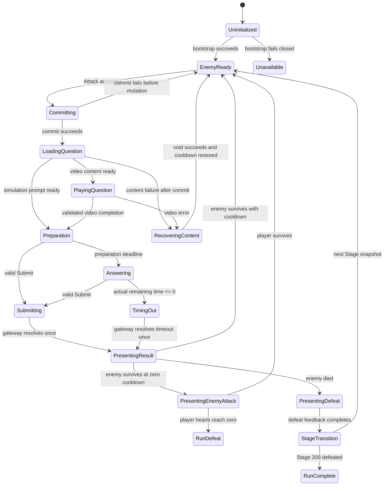
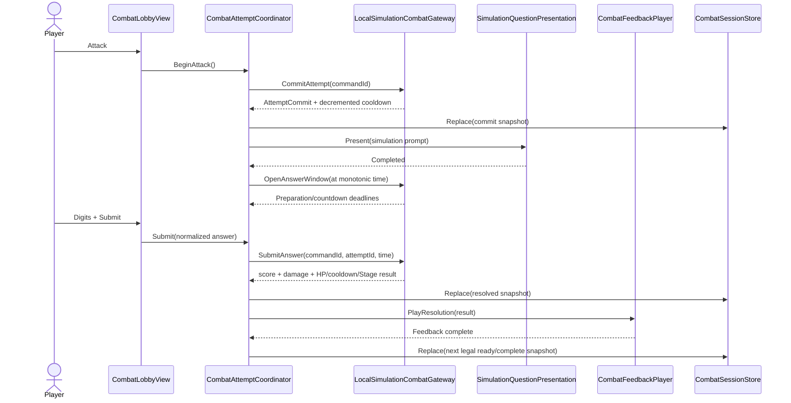

# Architecture Plan: Stage Combat Attempt Loop

## 1. Decision Summary

Build the combat attempt loop as a scene-scoped, layered feature with a pure C# domain and application state machine behind replaceable ports. The first implementation uses an explicitly labelled, seeded `LocalSimulationCombatGateway`. A future authoritative gateway can implement the same contracts withou t moving rules into UI or exposing Firestore details to gameplay classes.

The current slice will:

- Treat `StageId`, `question.id`, Rank, and enemy ID as distinct types and concepts.
- Keep audit, Rank changes, currencies, analytics, and persistent run writes untouched.
- Use UI Toolkit for the combat HUD, numpad, timer, enemy presentation, and feedback overlay.
- Adapt the existing monster sprite into a data-defined placeholder enemy.
- Keep `PlayerSessionStore` as read-only bootstrap input for simulation; local Stage/enemy changes live only in scene memory.
- Use the GDD resolution order: commit cooldown, present question, accept one answer, resolve player damage, cancel retaliation on enemy death, otherwise resolve the enemy cooldown/attack.
- Require no new Unity package.

> [!WARNING]
> This is target architecture, not current implementation. Current gameplay still consists of Main Menu player-data binding plus scene-local uGUI enemy/background images.

## 2. Architectural Principles

1. **One state owner:** `CombatSessionStore` exposes the latest immutable combat snapshot. UI never mutates HP, cooldown, Stage, or attempt phase directly.
2. **Rules stay pure:** Stage, enemy, timer, answer, and damage rules live in the Core assembly without `MonoBehaviour`, `VisualElement`, `VideoPlayer`, or Firestore types.
3. **Authority is replaceable:** `ICombatGateway` is the authority seam. Local simulation calculates results; a future remote gateway returns authoritative results.
4. **No presenter god-object:** existing account/menu presentation remains separate from combat coordination and feedback.
5. **Fail closed in production:** development simulation is selected explicitly and cannot silently activate in a non-development build.
6. **Event-driven runtime:** button events, video callbacks, and one active timer coroutine replace general `Update()` polling.
7. **Data-driven content:** ScriptableObjects map stable IDs to enemy visuals/stats and feedback settings; domain models receive validated primitive data.
8. **Idempotent commands:** every state-changing gateway command has a unique command ID and repeat calls return the original result.

## 3. System Context



## 4. Assembly and Dependency Boundaries



### Boundary Rules

- `Core` may reference only BCL namespaces such as `System`, `System.Collections`, and collections.
- `Unity` may reference Core and Unity modules, but never authentication or Firestore concrete classes.
- Because an asmdef cannot reference predefined `Assembly-CSharp`, the existing session-to-combat mapping stays in `CombatLobbyCompositionRoot` under the current Main Menu scripts.
- `PlayerSnapshot` does not enter Core. The composition root maps its current Stage and future combat primitives into `CombatBootstrapRequest`.
- Firestore DTOs, REST response types, `VisualElement`, `Sprite`, and `VideoPlayer` never cross into Core.

## 5. Runtime Modes and Authority

| Mode | Authority | Question presentation | Score/damage | Persistence |
|---|---|---|---|---|
| `DevelopmentSimulation` | `LocalSimulationCombatGateway` | Simulation card; future optional local video fixture | Seeded local response score and local damage engine | Scene memory only |
| `ProductionUnavailable` | `UnavailableCombatGateway` | Service/content unavailable message | No invented score or damage | None |
| `RemoteAuthoritative` *(future)* | `RemoteAuthoritativeCombatGateway` | Server-locked video reference | Server returns answer result, score, critical, damage, HP, cooldown, and Stage | Server-owned |

### Simulation Build Gate

- The mode is serialized in `CombatRuntimeSettingsDefinition` for Editor use.
- `DevelopmentSimulation` is available only under `UNITY_EDITOR || DEVELOPMENT_BUILD`.
- A non-development build configured for simulation constructs `UnavailableCombatGateway`, logs one configuration error, and disables Attack.
- The HUD always renders a persistent `SIMULATION - NOT SAVED` badge while local simulation is active.
- Local simulation never calls `PlayerSessionStore.TryHydrate`, Firestore REST, wallet code, Rank/audit code, or analytics code.

### Simulation Score-to-Damage Policy

The fallback and Firebase-backed attempt flow both produce a Response Score from 1 through 10 for a correct answer. Response Score is never substituted for Base ATK. `DamageCalculator` receives the immutable combat-stat snapshot and applies:

```text
ResponseDamageMultiplier = ResponseScore × 0.20

FinalDamage = round(
    EffectiveATK
    × RankMultiplier
    × BuffMultiplier
    × CriticalMultiplier
    × ResponseDamageMultiplier
)
```

Incorrect and timeout outcomes bypass the correct-answer calculator and deal exactly zero damage. `DamageResult` and `CombatResolution` expose the applied response multiplier so presentation and diagnostics do not recalculate it.

> [!NOTE]
> Damage midpoint rounding is explicit: `MidpointRounding.AwayFromZero`. The same policy must be adopted by a future backend contract to prevent client/server display drift.

## 6. Domain Model

| Type | Kind | Responsibility and invariants |
|---|---|---|
| `StageId` | Value object | Integer 1-200; calculates `WorldLevel`; exposes `TryNext`; never stores question IDs. |
| `EnemyId` | Value object | Stable non-empty enemy content key. |
| `AttemptId` | Value object | Stable attempt transaction identifier. |
| `CombatCommandId` | Value object | Unique idempotency key for one state-changing command. |
| `EnemyDefinitionData` | Immutable data | Enemy ID, display name, Base HP, max cooldown, visual key; all positive/valid. |
| `EnemyState` | Entity | Current/max HP, remaining/max cooldown, death state; clamps HP at zero and enforces cooldown rules. |
| `PlayerCombatState` | Entity | Current/max hearts plus immutable damage-stat inputs for the current encounter. |
| `AnswerBuffer` | Value object | Digits only, length limit, Backspace/Clear, normalized non-empty submission. |
| `AnswerWindow` | Value object | Preparation deadline, answer deadline, monotonic-time score calculation, one terminal resolution. |
| `CombatSnapshot` | Immutable projection | Stage, enemy, player, attempt phase, runtime mode, and presentation status. |
| `AttemptCommit` | Immutable result | Attempt ID, locked question presentation, and post-commit cooldown snapshot. |
| `AttemptResolution` | Immutable result | Outcome, response score/multiplier, damage/critical, before/after HP, cooldown, counterattack, defeat, Stage change, next enemy. |
| `DamageInput` / `DamageResult` | Immutable values | Explicit ATK, Rank/Buff/Critical/Response multipliers, critical state, raw and rounded damage. |
| `CombatFailure` | Value object | Typed failure kind, safe player message key, retryability, and whether cooldown restoration is required. |

### Domain Services

| Service | Responsibility |
|---|---|
| `StageProgressionCalculator` | World Level and starting enemy HP formula, including injected deterministic ±5% roll. |
| `DamageCalculator` | GDD damage formula, clamps, explicit rounding, and Critical/Response multiplier application. |
| `LocalCombatEngine` | Applies commit, submit/timeout, damage-before-retaliation, cooldown reset, death, Stage advance, and Stage 200 lock rules. |
| `SeededResponseScoreGenerator` | Generates reproducible simulation scores; never used by remote production authority. |
| `SeededRandomSource` | Reproducible enemy HP, score, and critical rolls for QA scenarios. |

## 7. Attempt State Machine



### Transition Guard Rules

- Only `EnemyReady` accepts Attack.
- Only `Preparation` and `Answering` accept Submit.
- `Submitting` and `TimingOut` acquire the same one-shot resolution gate; whichever succeeds first owns the attempt.
- UI input cannot transition a committed attempt back to `EnemyReady`.
- Confirmed question/video failure issues `VoidContentFailure` with a new command ID and must return a snapshot with the consumed cooldown restored.
- `PresentingResult` does not expose Attack until feedback completion returns control to the coordinator.
- Enemy death is evaluated before cooldown retaliation.
- Stage advancement is contained in the same local resolution transaction as enemy defeat and is idempotent.

## 8. Core Interface Definitions

The signatures below define boundaries; implementation may add validation helpers but must preserve ownership and direction.

```csharp
public interface ICombatGateway
{
    IEnumerator Bootstrap(
        CombatBootstrapRequest request,
        Action<GatewayResult<CombatSnapshot>> completed);

    IEnumerator CommitAttempt(
        CombatCommandId commandId,
        Action<GatewayResult<AttemptCommit>> completed);

    IEnumerator OpenAnswerWindow(
        CombatCommandId commandId,
        AttemptId attemptId,
        double openedAtSeconds,
        Action<GatewayResult<AnswerWindowSnapshot>> completed);

    IEnumerator SubmitAnswer(
        SubmitAnswerCommand command,
        Action<GatewayResult<AttemptResolution>> completed);

    IEnumerator ResolveTimeout(
        TimeoutAttemptCommand command,
        Action<GatewayResult<AttemptResolution>> completed);

    IEnumerator VoidContentFailure(
        VoidAttemptCommand command,
        Action<GatewayResult<CombatSnapshot>> completed);
}
```

```csharp
public interface IQuestionPresentation
{
    IEnumerator Present(
        QuestionPresentationRequest request,
        Action<QuestionPresentationResult> completed);

    void Stop();
}

public interface ICombatFeedbackPlayer
{
    IEnumerator PlayResolution(AttemptResolution resolution);
    IEnumerator PlayContentRecovery(CombatSnapshot restoredSnapshot);
    void StopAndReset();
}
```

```csharp
public interface IMonotonicClock
{
    double NowSeconds { get; }
}

public interface IRandomSource
{
    int NextInclusive(int minimum, int maximum);
    double NextUnit();
}
```

```csharp
public interface ICombatSessionReader
{
    CombatSnapshot Current { get; }
    event Action<CombatSnapshot> Changed;
}

public interface ICombatSessionWriter
{
    void Replace(CombatSnapshot snapshot);
    void Clear();
}
```

```csharp
public interface ICombatLobbyView
{
    event Action AttackRequested;
    event Action<int> DigitRequested;
    event Action BackspaceRequested;
    event Action ClearRequested;
    event Action SubmitRequested;

    void Render(CombatLobbyViewModel model);
    void RenderTimer(AnswerTimerViewModel timer);
    void SetInputEnabled(bool enabled);
}
```

## 9. Class Responsibility Table

### Core and Application

| Class | Responsibility | Depends on | Owned state |
|---|---|---|---|
| `CombatAttemptCoordinator` | Enforces legal phases, executes one gateway operation at a time, coordinates question/timer/feedback, and publishes snapshots. | Gateway, question port, feedback port, clock, session writer | Current phase, answer buffer/window, active operation token, one-shot resolution gate |
| `CombatSessionStore` | Scene-scoped observable snapshot source implementing separate read/write ports. | None | Latest immutable snapshot |
| `LocalCombatEngine` | Local transactional combat authority used only by simulation. | Stage calculator, damage calculator, score/random services, enemy catalog data | Local run state and command receipts |
| `EnemyState` | Maintains enemy combat invariants. | Definition data | HP and cooldown |
| `AnswerBuffer` | Maintains valid digit input and normalization. | None | Current digits and maximum length |
| `AnswerWindow` | Calculates preparation/countdown state from monotonic deadlines. | Clock values | Open/resolved state and deadlines |
| `StageProgressionCalculator` | Computes World Level and Spawn HP. | Random source | None |
| `DamageCalculator` | Computes local simulation damage. | None | None |
| `CommandReceiptCache` | Returns the original result for duplicate command IDs. | None | Scene-lifetime bounded receipts |

### Unity Adapters and Presentation

| Class | Responsibility | Depends on | Owned state |
|---|---|---|---|
| `CombatLobbyCompositionRoot` | Maps `PlayerSessionStore` into bootstrap primitives and assembles the selected runtime mode. | Existing session store, settings assets, view/presenter | Constructed scene services only |
| `LocalSimulationCombatGateway` | Adapts coroutine gateway commands to `LocalCombatEngine`. | Local engine | No duplicate combat state |
| `UnavailableCombatGateway` | Fails closed when production authority/content is unavailable. | Localized message keys | None |
| `CompositeQuestionPresentation` | Selects video or simulation presentation from the committed question mode. | Video and simulation presenters | Active presentation handle |
| `VideoQuestionPresentation` | Wraps `VideoPlayer` prepare, completion, and error callbacks; reports validated completion. | VideoPlayer, URI policy | Active clip/URL and event bindings |
| `SimulationQuestionPresentation` | Shows a labelled local prompt and immediately allows the documented preparation flow. | Combat view | None |
| `UnityMonotonicClock` | Exposes unscaled realtime for answer deadlines. | Unity time API | None |
| `CombatLobbyPresenter` | Binds/unbinds view events, starts coordinator routines, renders snapshots, and never calculates rules. | View, coordinator, session reader, view-model factory | Subscription/lifecycle flags |
| `CombatLobbyView` | Caches UXML elements, emits intents, and renders view models. | UIDocument | Cached element references only |
| `CombatLobbyViewModelFactory` | Formats Stage, HP, cooldown, answer, and status strings outside hot paths. | Enemy presentation catalog | None |
| `UiToolkitCombatFeedbackPlayer` | Sequences result banner, damage text, HP interpolation, enemy reaction, retaliation, defeat, and reduced-motion variants. | View, feedback settings, audio player, damage pool | Current feedback routine |
| `DamageNumberPool` | Reuses a small fixed set of UI Toolkit damage labels. | Damage overlay element | Pool occupancy |
| `CombatAudioPlayer` | Plays semantic UI/impact cues with no gameplay authority. | AudioSource and clips | Current audio handles |
| `EnemyDefinition` | Unity ScriptableObject for stable ID, display/visual data, Base HP, and max cooldown. | Sprite/audio/feedback asset refs | Authored immutable data |
| `EnemyCatalogDefinition` | Validates unique enemy IDs/cooldowns and resolves placeholder Stage pools. | Enemy definitions | Authored catalog data |
| `CombatRuntimeSettingsDefinition` | Selects permitted runtime mode, seed, simulation stats, timer constants, and settings assets. | ScriptableObjects | Authored configuration |

## 10. Data Flow

### Successful Simulation Attempt



### Production Content Failure After Commit

```text
Attack intent
  -> Commit succeeds and cooldown visibly decreases
  -> Video preparation reports confirmed content failure
  -> Coordinator enters RecoveringContent and disables input
  -> VoidContentFailure(commandId, attemptId)
  -> Authority returns restored cooldown snapshot
  -> Neutral recovery feedback explains that no answer was recorded
  -> EnemyReady
```

### Timer Boundary

```text
Timer coroutine reads IMonotonicClock.NowSeconds
  -> updates presentation only
  -> Submit and timeout compete for the same resolution gate
  -> if actual remaining <= 0, timeout wins even if UI still displays 0
  -> gateway command resolves once
```

## 11. Enemy, Stage, and Damage Data

### Enemy Authoring

`EnemyDefinition` fields:

- Stable `enemyId` and display name.
- `baseHp > 0`.
- `maximumCooldown > 0` and unique within the active catalog, matching the GDD.
- Enemy sprite/texture key and optional background/biome key.
- `CombatFeedbackProfileDefinition` reference.

`EnemyCatalogDefinition.OnValidate` rejects duplicate IDs, missing visuals, non-positive values, and duplicate maximum cooldowns. The first slice contains one placeholder definition using `Test-ปกคลิปสำหรับงานเเข่ง (1).png`; later stage pools can add enemies without changing domain code.

### Stage Bootstrap

1. Read `PlayerSnapshot.activeRun.currentStage` when positive.
2. Otherwise read `PlayerSnapshot.progression.currentStage` when positive.
3. Otherwise default the simulation bootstrap to Stage 1.
4. Clamp only at the external mapping boundary; Core `StageId` rejects invalid values.
5. Local defeat advances the scene snapshot but never writes the player snapshot.

### HP Scaling

The pure calculator implements:

```text
WorldLevel = ceil(Stage / 5)
GrowthSteps = WorldLevel - 1
ScaledHP = BaseHP * (1 + 0.12 * GrowthSteps)
SpawnHP = max(1, round(ScaledHP * RandomRange(0.95, 1.05)))
```

The injected random source makes the Spawn HP roll reproducible in simulation tests. A future authoritative gateway returns Spawn HP rather than asking the client calculator to regenerate it.

## 12. Presentation Architecture

### UI Ownership

- `MainMenuView` continues owning display name, wallet, loadout, logout, and session availability.
- `CombatLobbyView` takes ownership of Stage label/progress, enemy panel, enemy HP/cooldown, Attack, question panel, numpad, timer, result panel, simulation badge, and feedback overlay.
- `MainMenuViewModel` stops formatting Stage so the local scene combat snapshot can update Stage independently without mutating `PlayerSessionStore`.
- Both views may query the same `UIDocument`, but every named element has exactly one owner.

### Current Hybrid UI Migration

The current scene-local uGUI background and `monsterPrefab` images are presentation placeholders, not gameplay objects. During this slice:

1. Add background and enemy image elements to `MainMenuUI.uxml`.
2. Bind the existing assets through `EnemyDefinition`/USS or view model asset references.
3. Validate visual parity in Editor.
4. Remove the redundant uGUI Canvas objects only after the UI Toolkit replacement renders correctly.

This avoids permanent dual ownership, sorting-order ambiguity, and a fake `monsterPrefab` entity while preserving the existing artwork.

### HCI Damage Feedback Sequence

1. Result reason appears first (`Correct`, simulated score, `Incorrect`, or `Time expired`).
2. Damage/critical semantic label and enemy reaction begin together.
3. HP interpolation follows the authoritative before/after values; feedback never calculates HP.
4. If lethal, HP reaches zero before defeat and Stage-transition feedback.
5. If non-lethal at zero cooldown, warning precedes player-heart loss.
6. Reduced-motion mode keeps semantic text, HP delta, opacity/scale cue, and audio controls while removing shake and large travel.

Damage labels come from a fixed pool and are reset on scene disable, content recovery, and interrupted feedback. USS class toggles and scheduled transitions provide animation; the slice does not add a tweening dependency.

## 13. Exact File Plan

### Existing Files To Modify

| File | Planned change |
|---|---|
| `Assets/Project/UI/MainMenuUI.uxml` | Add owned combat HUD, enemy, attempt, numpad, result, simulation, and feedback elements; preserve account/logout elements. |
| `Assets/Project/Script/UI/MainMenu/MainMenuView.cs` | Stop owning Stage elements; preserve player/session/logout rendering. |
| `Assets/Project/Script/UI/MainMenu/MainMenuViewModel.cs` | Remove Stage formatting and Stage progress from the account/menu view model. |
| `Assets/Project/Scenes/MainMenuScene.unity` | Add composition/presentation references; migrate verified enemy/background visuals; later remove redundant uGUI placeholders. |
| `Assets/Project/Settings/GameApiSettings.asset` | No gameplay changes planned. |
| `Assets/Project/Script/PlayerData/PlayerSnapshot.cs` | No schema changes in the simulation slice. |
| `Assets/Project/Script/PlayerData/PlayerSessionStore.cs` | No mutation API added; remains read-only bootstrap source for combat. |

### New Core Files

```text
Assets/Project/Script/Gameplay/Combat/Core/
  PowerMath.Gameplay.Combat.Core.asmdef
  Domain/
    StageId.cs
    EnemyId.cs
    AttemptId.cs
    CombatCommandId.cs
    EnemyDefinitionData.cs
    EnemyState.cs
    PlayerCombatState.cs
    AnswerBuffer.cs
    AnswerWindow.cs
    CombatSnapshot.cs
    AttemptCommit.cs
    AttemptResolution.cs
    DamageInput.cs
    DamageResult.cs
    CombatFailure.cs
    CombatPhase.cs
  Application/
    ICombatGateway.cs
    IQuestionPresentation.cs
    ICombatFeedbackPlayer.cs
    IMonotonicClock.cs
    IRandomSource.cs
    ICombatSessionReader.cs
    ICombatSessionWriter.cs
    CombatGatewayContracts.cs
    QuestionPresentationContracts.cs
    CombatAttemptCoordinator.cs
    CombatSessionStore.cs
  Services/
    LocalCombatEngine.cs
    StageProgressionCalculator.cs
    DamageCalculator.cs
    SeededResponseScoreGenerator.cs
    SeededRandomSource.cs
    CommandReceiptCache.cs
```

### New Unity and Presentation Files

```text
Assets/Project/Script/Gameplay/Combat/Unity/
  PowerMath.Gameplay.Combat.Unity.asmdef
  Infrastructure/
    LocalSimulationCombatGateway.cs
    UnavailableCombatGateway.cs
    UnityMonotonicClock.cs
    CompositeQuestionPresentation.cs
    VideoQuestionPresentation.cs
    SimulationQuestionPresentation.cs
  Presentation/
    CombatLobbyPresenter.cs
    CombatLobbyView.cs
    CombatLobbyViewModel.cs
    CombatLobbyViewModelFactory.cs
    UiToolkitCombatFeedbackPlayer.cs
    DamageNumberPool.cs
    CombatAudioPlayer.cs
  Definitions/
    EnemyDefinition.cs
    EnemyCatalogDefinition.cs
    CombatFeedbackProfileDefinition.cs
    CombatRuntimeSettingsDefinition.cs

Assets/Project/Script/UI/MainMenu/
  CombatLobbyCompositionRoot.cs

Assets/Project/UI/
  CombatLobbyUI.uss

Assets/Project/Settings/Gameplay/
  PlaceholderRockTitan.asset
  PrototypeEnemyCatalog.asset
  CombatFeedbackProfile.asset
  CombatRuntimeSettings.asset
```

### New Test Files

```text
Assets/Project/Tests/EditMode/Combat/
  PowerMath.Gameplay.Combat.EditModeTests.asmdef
  StageProgressionCalculatorTests.cs
  EnemyStateTests.cs
  AnswerBufferTests.cs
  AnswerWindowTests.cs
  DamageCalculatorTests.cs
  LocalCombatEngineTests.cs
  CombatAttemptCoordinatorTests.cs
  LocalSimulationIdempotencyTests.cs

Assets/Project/Tests/PlayMode/Combat/
  PowerMath.Gameplay.Combat.PlayModeTests.asmdef
  CombatLobbyInputTests.cs
  CombatTimerBoundaryTests.cs
  CombatFeedbackSequenceTests.cs
  CombatContentRecoveryTests.cs
```

File grouping may be compressed where a tiny immutable DTO does not justify a standalone file, but boundaries and responsibilities must remain unchanged.

## 14. Scene Wiring

Target root order after UI migration:

```text
=======System=======
  EventSystem
=======Manager=======
  CombatLobbyCompositionRoot
=======Camera=======
  Main Camera
=======Environment=======
  (background owned by UIDocument)
=======Enemies=======
  (enemy visual owned by UIDocument)
=======UI=======
  UIDocument
=======Debug=======
  SimulationModeMarker (development builds only)
```

Separators are organizational root markers, not parents. The composition root receives serialized definitions and component references; it creates plain services in `Awake`, subscribes in `OnEnable`, bootstraps in `Start`, cancels/unsubscribes in `OnDisable`, and releases scene state in `OnDestroy`.

No build-setting change is required for this slice.

## 15. Error and Recovery Matrix

| Failure | State mutation | Player-facing result | Recovery |
|---|---|---|---|
| Gateway unavailable before commit | None | Service unavailable; Attack disabled/retry | Retry bootstrap or remain safely unavailable |
| Duplicate Attack/input | None beyond original | Existing busy state remains | Ignore duplicate |
| Question/video failure after commit | Cooldown initially consumed, then restored by void command | Neutral content error, not incorrect | Return to EnemyReady after restored snapshot |
| Invalid answer metadata | Attempt voided | Content error | Same as content failure |
| Empty Submit | None | Submit remains disabled | Continue answering |
| Submit after actual deadline | Timeout terminal result | `Time expired` | Normal cooldown/counterattack flow |
| Submit and timeout same frame | One resolution gate wins based on monotonic remaining time | One terminal result | Cached duplicate command result |
| Feedback interruption/scene disable | No new domain mutation | Scene closes cleanly | Stop media/audio, return labels to pool |
| Missing enemy visual definition | Bootstrap fails visibly | Recoverable configuration error | Fix catalog; never spawn invisible enemy |
| Stage 200 defeated | RunComplete snapshot | Combat locked; completion feedback | Rebirth remains out of scope |

## 16. Performance and Allocation Rules

- No general combat `Update()` method.
- One answer-timer coroutine exists only during Preparation/Answering and performs no managed allocation per tick after initialization.
- Cache all UI Toolkit element references once; no repeated `Q()` lookups during gameplay.
- Damage labels are pooled; audio sources are cached.
- USS classes are toggled with cached names; avoid per-frame string interpolation.
- View models are rebuilt only on snapshot changes; timer text updates only when the displayed value changes.
- Video callbacks are bound once per presentation and always unbound on completion/error/disable.
- Profile the target mobile WebGL build before changing pool sizes or adding effects.

## 17. Verification Strategy

### EditMode Contract Tests

- Stage 1, 5, 6, 196, and 200 produce the expected World Levels and HP scaling boundaries.
- Enemy HP never falls below zero; cooldown never falls below zero or above maximum.
- Content void restores exactly one consumed cooldown count and is idempotent.
- Correct/simulated success resolves damage before retaliation.
- Lethal damage cancels retaliation at zero cooldown.
- Stage advances exactly once; Stage 200 enters RunComplete.
- Damage formula covers normal, critical, clamps, and `.5` midpoint rounding away from zero.
- Answer buffer accepts only digits, enforces length, normalizes leading zeros, and rejects empty Submit.
- Preparation returns score 10; countdown uses ceiling; remaining `<= 0` is timeout.
- Duplicate command IDs return identical results without repeated mutation.
- Same seed reproduces score, critical, enemy selection, and HP roll.
- Illegal state transitions are rejected without mutation.

### PlayMode Integration Tests

- Every numpad control emits one intent and renders immediate acknowledgement.
- Double-click, touch plus Enter, and timeout boundary resolve once.
- Attack remains disabled throughout commit, question, answer, resolution, defeat, and counterattack feedback.
- Video error uses content recovery and restores cooldown.
- Normal, critical, lethal, timeout, and enemy-attack feedback appear in the specified order.
- Reduced motion preserves semantic information.
- Simulation badge is always visible in simulation mode.
- Scene disable releases media callbacks, audio, timers, and pooled elements.

### Manual Editor and WebGL Checks

- Render at desktop and narrow mobile-compatible aspect ratios.
- Confirm existing player/logout behavior remains functional.
- Verify the current monster/background visuals survive UI migration.
- Run the new-player and observer readability tests from the approved design spec.
- Profile allocation and frame-time during timer and damage feedback.
- Verify a non-development build cannot activate simulation.

## 18. Incremental Implementation Plan

Each phase should compile and pass its relevant tests before the next begins.

1. **Core assembly and value objects:** Stage, enemy, answer, damage, snapshot, failure types, and EditMode tests.
2. **Local combat transaction engine:** resolution order, cooldown restore, Stage advancement, command receipts, deterministic random, and tests.
3. **Application state machine:** coordinator, store, gateway/presentation ports, fake-driven transition tests.
4. **Unity definitions and simulation gateway:** placeholder enemy catalog, runtime settings, composition bridge, fail-closed build guard.
5. **UI Toolkit combat shell:** Stage/enemy HUD, Attack, attempt panel, numpad, timer, result states, and view bindings.
6. **Question presentation:** simulation card first; VideoPlayer adapter and content-failure recovery second.
7. **Feedback/HCI pass:** pooled damage text, enemy reaction, HP interpolation, critical/defeat/counterattack sequence, audio hooks, reduced motion.
8. **Main Menu migration:** transfer Stage ownership, migrate enemy/background visuals, remove redundant uGUI only after visual verification.
9. **PlayMode and WebGL verification:** stress, boundary, recovery, accessibility, profiler, and readability checks.
10. **Review artifacts:** code review, QA test plan, DevLog, PR; no automatic merge or team-status publishing.

## 19. Risks and Mitigations

| Risk | Mitigation |
|---|---|
| Simulation behavior leaks into production | Compile/build gate, persistent badge, fail-closed production adapter, automated build-mode test. |
| Local rules diverge from future backend | Gateway owns authority; UI consumes returned results; freeze shared rounding/DTO semantics before remote integration. |
| Main Menu presenter becomes a god-object | Separate composition root, coordinator, store, combat presenter, view, and feedback player. |
| UI Toolkit and uGUI fight for ownership/sorting | Migrate combat visuals into UI Toolkit and remove legacy Canvas only after visual checkpoint. |
| Timer race causes double result | Monotonic clock plus one-shot resolution gate plus idempotent gateway receipts. |
| Random fallback cannot reproduce bugs | Seeded random source surfaced in development settings/log. |
| Effects obscure educational result | Result reason precedes damage; fixed feedback layering; reduced-motion path; readability tests. |
| Over-abstraction slows prototype | Interfaces exist only at authority, time/random, question media, feedback, and state-store boundaries; domain entities remain concrete. |

## 20. ADR Impact

- ADR-003 remains accepted for prototype authentication/bootstrap.
- This plan does not extend ADR-003 to gameplay writes; it preserves ADR-003's statement that gameplay writes are out of scope.
- Draft ADR-004 records the combat authority port and development simulation boundary.
- A future remote gameplay gateway or direct gameplay persistence requires a separate human-approved ADR and must revisit GDD server authority.

## 21. Human Architecture Checkpoint

> [!NOTE]
> Approved by the project owner on 2026-08-10 (`LGTM`).

Approve or request changes to:

1. Ports-and-adapters authority boundary and pure Core/Unity assembly split.
2. Development-only `ResponseScore -> SimulationBaseATK` mapping with Rank multiplier fixed at 1.
3. Explicit midpoint rounding away from zero.
4. UI Toolkit migration of the existing enemy/background scene images.
5. Exact phased implementation and test strategy.

Implementation may proceed. PR merge and official publishing remain separate human checkpoints.
