# Design Spec: Stage Combat Attempt Loop

## 1. Player Goal and Context

The student is trying to defeat the enemy guarding the current Stage. Before committing, they can read the enemy's HP and remaining attack cooldown. Pressing Attack visibly locks in one attempt, leading to a question video when content is available, then a touch-friendly integer numpad and timer. The result must explain what happened before the student is asked to act again: correct or incorrect, response score where applicable, damage dealt, HP remaining, whether the enemy will retaliate, and whether the Stage advanced.

This feature supports the GDD's Challenge fantasy: mathematics performance becomes immediate, readable combat power while Stage progression remains separate from question identity and Rank.

## 2. Assumptions Requiring Approval

> [!WARNING]
> **ASSUMPTION:** Random-score fallback is a development simulation mode, never a production offline rule.
> **IMPACT:** The team can build and test numpad, timer, damage, enemy, and Stage presentation before Firestore question delivery exists.
> **IF WRONG:** A production fallback that invents educational results would conflict with `@tag:question-data`, `@tag:server-authority`, and the integrity of audit/Rank data.
> **VALIDATE:** Human approves a persistent, obvious `SIMULATION` badge and confirms that simulation cannot write audit, Rank, wallet, analytics, `TotalDamageDealt`, or authoritative run progress.

> [!NOTE]
> **ASSUMPTION:** The first implementation may adapt the existing `monsterPrefab` scene image into a data-driven placeholder enemy presentation and use placeholder Base HP, cooldown, and player combat stats because individual values and enemy pools are explicitly listed as untuned content in the GDD.
> **IMPACT:** Architecture and interaction can be validated without treating the current monster image, balance, or art hookup as final.
> **IF WRONG:** Implementation must wait for final enemy definitions and assets.
> **VALIDATE:** Review one encounter using `Assets/Project/Material/Test-ปกคลิปสำหรับงานเเข่ง (1).png` in Editor before the architecture checkpoint.

> [!NOTE]
> **ASSUMPTION:** UI Toolkit remains the presentation framework because the current Main Menu uses UXML and presenter/view binding.
> **IMPACT:** Combat HUD and numpad extend the existing scene instead of creating a second UI stack.
> **IF WRONG:** The architecture must define a separate presentation adapter before implementation.
> **VALIDATE:** Confirm the intended Main Menu scene remains the combat Lobby.

### Verified Unity Constraints

- Unity version: `6000.5.3f1`.
- Available without dependency changes: UI Toolkit, Input System `1.19.0`, Video module, Accessibility module, URP `17.6.0`, and Test Framework `1.7.0`.
- Current Lobby presentation is hybrid: UI Toolkit owns menu/player data while a legacy uGUI Canvas owns the background and monster images.
- The existing monster object is named like a prefab but is a scene-local uGUI `Image`; it must not be treated as an enemy domain entity.
- No project-owned gameplay test assembly currently exists.
- Live Unity MCP resources were not connected during this design pass, so final layout and runtime validation remain Editor checkpoint work.

## 3. System Rules

### 3.1 Pre-Attempt Lobby

- Always show visual Stage as `Stage N / 200`; never present it as a question ID.
- Show enemy name/visual, current and maximum HP, and remaining and maximum cooldown.
- Cooldown `1` uses an imminent-attack icon/text treatment so the risk is predictable without depending on color.
- Attack is enabled only when an enemy exists, the run is not complete, and no attempt/result sequence is active.
- Attack input immediately acknowledges commitment and disables repeat input.

### 3.2 Attempt and Answer

- One committed attempt consumes one enemy cooldown count before content begins.
- Available question content plays its locked `.mp4`; skipping/rerolling is not offered.
- After validated video completion, show and enable the numpad for the GDD-defined 1-second preparation period, then run the GDD-defined 10-second countdown.
- Input supports digits `0-9`, Backspace, Clear, and Submit for one non-negative integer answer.
- Empty Submit is disabled. Leading zeros normalize at submission. The provider-supplied answer-length limit is enforced.
- One accepted Submit or timeout closes input immediately; repeated input is ignored while resolution is active.
- A correct answer in preparation scores 10. A later correct answer uses `clamp(ceil(actual remaining seconds), 1, 10)`. Incorrect and timeout score 0.

### 3.3 Resolution Order

1. Freeze answer input and show the result reason.
2. Correct/simulated success reveals response score, then damage and critical status.
3. Apply player damage to enemy HP before evaluating retaliation.
4. If enemy HP reaches zero, play defeat feedback, cancel retaliation, advance Stage exactly once, and present the next enemy with full cooldown.
5. If the enemy survives and remaining cooldown is zero, telegraph and resolve one-heart enemy damage, then reset its cooldown.
6. If neither combatant is defeated, return to enemy-ready state.

Incorrect/timeout attempts skip player damage but continue to the enemy-cooldown check. Enemy HP never displays below zero.

### 3.4 Firestore-Unavailable Behavior

| Mode | Behavior | Persistence |
|---|---|---|
| Production | Confirmed missing/corrupt/unavailable content voids the attempt, restores the consumed cooldown count, explains the content failure, and returns to enemy-ready. | No educational or combat result is committed. |
| Development simulation | A clearly labelled local provider replaces video with a short simulation card. Submit/timeout still exercises input and timing; successful simulated resolution generates a seeded response score from 1-10 and returns a local damage result. | Ephemeral memory only; no audit, Rank, currency, analytics, or authoritative run writes. |

Simulation randomness should be seedable so QA can reproduce normal, critical, defeat, and counterattack paths. Timeout remains a zero-damage failure even in simulation so the timer behavior stays meaningful.

## 4. Interaction and State Flow

```mermaid
stateDiagram-v2
    [*] --> EnemyReady
    EnemyReady --> Committing: Attack
    Committing --> LoadingQuestion: cooldown consumed
    LoadingQuestion --> PlayingVideo: content available
    LoadingQuestion --> SimulatedPrompt: development simulation enabled
    LoadingQuestion --> ContentRecovery: production content failure
    ContentRecovery --> EnemyReady: cooldown restored
    PlayingVideo --> Preparation: validated video completion
    SimulatedPrompt --> Preparation: prompt acknowledged
    Preparation --> Answering: 1-second preparation ends
    Preparation --> Submitting: Submit
    Answering --> Submitting: Submit
    Answering --> ResolvingFailure: timeout
    Submitting --> ResolvingSuccess: correct or simulated success
    Submitting --> ResolvingFailure: incorrect
    ResolvingSuccess --> PlayerImpact: calculate damage
    PlayerImpact --> EnemyDefeat: enemy HP reaches zero
    PlayerImpact --> CounterattackCheck: enemy survives
    ResolvingFailure --> CounterattackCheck
    CounterattackCheck --> EnemyAttack: cooldown reaches zero
    CounterattackCheck --> EnemyReady: cooldown remains
    EnemyAttack --> RunDefeat: player HP reaches zero
    EnemyAttack --> EnemyReady: player survives
    EnemyDefeat --> StageTransition: feedback completes
    StageTransition --> EnemyReady: next enemy spawned
```

### State-Machine Contract

| Property | Rule |
|---|---|
| Entry | Only `EnemyReady` accepts Attack; only Preparation/Answering accepts Submit. |
| Exit | Timer, one accepted Submit, content recovery, feedback completion, enemy defeat, or player defeat. |
| Interruptibility | UI input cannot cancel a committed attempt. Confirmed content/system failure voids it. Scene/browser abandonment is a production incorrect result when authority exists. |
| Chaining | Resolution must follow damage-before-counterattack and defeat-before-stage-advance order. |
| Resource cost | One enemy cooldown count on commitment; restored only for confirmed content/system failure. |
| Edge handling | Duplicate commands are ignored; timeout and Submit at the same boundary resolve once using actual remaining time. |

## 5. HUD and Input Information Hierarchy

| Priority | Information | Presentation Rule |
|---|---|---|
| Critical | Answer, Submit state, actual countdown, result/failure reason | Centered in the active attempt panel; never obscured by damage effects. |
| Critical | Enemy HP and imminent counterattack | Persistent near enemy; warning includes icon/text, not color alone. |
| Important | Stage, enemy name, cooldown count | Always glanceable in Lobby and result sequence. |
| Important | Response score and damage/critical result | Sequential reveal after resolution; readable without watching animation. |
| Reference | Maximum cooldown, maximum HP, simulation badge | Visible but subordinate to current values. |

The numpad is ordered consistently and acknowledges every accepted press through visual state plus a short audio/tactile cue where the platform permits. Keyboard number keys may be supported as a secondary WebGL input, but mobile-compatible pointer/touch input is the primary validation path.

## 6. Feedback Loops and HCI Damage Presentation

| Trigger | Visual | Audio | Timing Rule |
|---|---|---|---|
| Attack committed | Attack control depresses/locks; attempt panel transitions in | Short commit cue | Immediate acknowledgement before loading |
| Valid numpad press | Key depression and answer-field update | Quiet key tick with variation | Same rendered frame when possible |
| Correct result | Positive result banner and response-score reveal | Positive confirmation cue | Must appear before damage text |
| Incorrect answer | Explicit `Incorrect` reason; no damage number | Gentle failure cue | Hold until readable, then cooldown check |
| Timeout | Explicit `Time expired`; timer locks at zero | Distinct timeout cue | Never imply a wrong mathematical answer |
| Normal enemy hit | Enemy flash/recoil, HP bar interpolation, anchored damage text | Layered hit cue | Damage number and HP response begin together |
| Critical hit | Larger `CRITICAL` label, stronger but bounded recoil/particles | Distinct critical layer | Clearly stronger than normal without hiding HP |
| Enemy survives at zero cooldown | Enemy attack telegraph, then player heart loss | Warning then impact cue | Telegraph precedes heart loss |
| Enemy defeat | Enemy collapse/dissolve, HP reaches zero, Stage transition | Defeat stinger | Stage changes only after defeat is understood |
| Content recovery | Neutral service/content-error panel; cooldown visibly restored | Neutral recovery cue | Never use incorrect/failure styling |

### Damage Text Behavior

- Spawn one pooled, enemy-anchored damage label per resolved hit.
- The numeric damage remains the primary text; `CRITICAL` is a separate semantic modifier.
- Use outline/contrast and position/scale differences so meaning does not depend on red/yellow color.
- Combine repeated visual layers carefully: one damage number, one HP reaction, one enemy reaction, and one audio impact are the baseline. Avoid overlapping number spam.
- Reduced-motion mode replaces shake, large travel, and hitstop-like pauses with opacity/scale emphasis while preserving number, critical label, HP update, and audio controls.

## 7. Starting Feedback Values and Test Plans

All values below are starting values for playtesting, not final balance or an industry standard.

| Knob | Starting value | Micro test and adjustment direction |
|---|---:|---|
| Numpad logical target | 64 x 64 UI units minimum | Ten mobile taps per key; pass at 9/10 intended taps. Increase size/spacing on misses. |
| Normal damage text lifetime | 0.70 seconds | Observer reads value in 9/10 hits without delaying the next decision. Increase hold before travel if missed. |
| Critical damage text lifetime | 0.95 seconds | Observer distinguishes critical from normal in 9/10 mixed hits. Increase semantic-label hold before scale. |
| Enemy hit flash | 0.12 seconds | Hit is perceived without obscuring the visual. Reduce opacity/duration if fatiguing. |
| Normal recoil | 10 UI units over 0.16 seconds | Hit feels immediate and returns before next state. Reduce travel in compact/mobile layouts. |
| Critical recoil | 18 UI units over 0.22 seconds | Critical feels stronger without displacing UI or harming readability. Prefer particles/audio before further travel. |
| HP interpolation | 0.25 seconds | Player can associate number with HP change. Shorten if resolution feels slow; lengthen only if delta is missed. |
| Result readable hold | 0.60 seconds minimum | New player correctly states result before cooldown/Stage response. Increase in 0.10-second steps if rushed. |
| Enemy attack warning | 0.55 seconds | Observer predicts heart loss in 8/10 attacks. Increase warning hold if perceived as unfair. |

The 1-second preparation, 10-second answer countdown, Stage count, HP-growth formula, and damage formula are GDD-defined values and are not replaced by these feedback settings.

## 8. Five-Component Evaluation

| Component | Design Requirement | Acceptance Signal |
|---|---|---|
| Clarity | Persistent enemy HP/cooldown; explicit result reason; score then damage then retaliation/defeat. | A new player or observer explains 8/10 resolutions correctly. |
| Motivation | Correct mathematics visibly reduces enemy HP and defeat advances Stage. | Player voluntarily starts the next attempt after understanding the outcome. |
| Response | Immediate press acknowledgement, deterministic one-submit rule, no double commit, and no hidden input during resolution. | Intended numpad input registers at least 9/10 times on target mobile hardware. |
| Satisfaction | Normal, critical, defeat, and enemy retaliation have distinct visual and audio layers. | Players distinguish weak/strong outcomes without reading only the number. |
| Fit | Math response becomes combat power in a fantasy boss-rush presentation; spectacle remains subordinate to answer clarity. | Effects feel like one coherent attack rather than unrelated UI popups. |

Priority when trade-offs appear: Response, Clarity, Satisfaction, Fit, then Motivation.

## 9. Edge Cases and Abuse Cases

- Repeated Attack while committing/loading/answering/resolving does nothing and never consumes a second cooldown count.
- Repeated Submit, pointer double-click, Enter plus touch, or timer expiry in the same frame resolves exactly once.
- Digit spam cannot exceed the current question's answer-length limit and provides a visible rejection state.
- Backspace/Clear on empty input is harmless; Submit remains disabled.
- Video load failure, corrupt video, invalid answer type, or missing answer-length metadata uses content recovery in production.
- Low frame rate uses monotonic elapsed time, not frame counting; an answer at actual remaining time `<= 0` is timeout.
- Scene unload/browser abandonment never invents success. Production authority later reconciles the committed attempt; simulation state is discarded.
- Enemy death and zero cooldown on the same attempt resolves death first and cancels retaliation.
- Stage advancement is idempotent; duplicate defeat feedback cannot spawn multiple enemies.
- Stage 200 defeat locks further attacks until the future Rebirth flow; this slice may render the locked state but does not implement Rebirth.
- Missing enemy definition or visual fails visibly into a recoverable presentation error; it does not spawn an invisible target.
- Simulation mode is unmistakable in screenshots and cannot silently activate in a production build.

## 10. Playtest Scenarios

### New Player

- Give no explanation and ask the player to attack once.
- Pass when the player identifies Attack, answer field, Submit, timer, enemy HP, cooldown risk, result, and Stage objective.
- Starting target: correctly explain at least 8 of 10 observed resolutions.

### Stress

- Spam every numpad control, alternate keyboard/touch, double-submit near zero, and press Attack throughout feedback.
- Pass when only one attempt and one result are produced, with no stuck disabled UI.

### Skill

- Compare preparation-period correct, fast correct, slow correct, incorrect, and timeout attempts.
- Pass when response score ordering matches the GDD and input friction does not determine correctness.

### Abuse and Recovery

- Force content failure before video, during load, and after commitment.
- Pass when production recovery restores cooldown and simulation remains local, labelled, reproducible, and unable to persist rewards/progression.

### Readability

- Mix normal hits, critical hits, lethal hits, and counterattacks while an observer watches.
- Pass when the observer explains why damage happened, who was damaged, whether the hit was critical, and why the Stage did or did not advance in at least 8 of 10 cases.

### Accessibility and Performance

- Validate reduced motion, muted audio, small WebGL viewport, touch input, low frame rate, and rapid layout resize.
- Pass when all outcomes remain understandable and gameplay produces no per-frame managed allocations after the UI is initialized.

## 11. GDD Alignment and Explicit Non-Goals

- Fulfills `@tag:core-loop`, `@tag:combat-attempt`, `@tag:answer-scoring`, `@tag:combat-stats`, `@tag:stage-progression`, `@tag:feedback`, and `@tag:player-experience`.
- Preserves `@tag:guardrails`: Stage is separate from question ID, Attack commits once, damage precedes retaliation, and Stage advances only after defeat.
- Preserves `@tag:question-data` in production by voiding confirmed content failures.
- Audit windows, Rank changes, Rank inventory rules, promotion/demotion UI, currencies, and educational analytics are deliberately untouched.
- The development simulation is test scaffolding, not a new canonical game rule.

## 12. Tuning Priority

If the loop feels wrong, adjust in this order:

1. Input acknowledgement, disabled states, and double-resolution prevention.
2. Outcome/failure clarity and cooldown telegraphing.
3. Result-sequence pacing and damage/HP association.
4. Critical/defeat spectacle and audio layering.
5. Placeholder enemy/stat tuning after the interaction is readable and responsive.

## Human Design Checkpoint

> [!NOTE]
> Approved by the project owner on 2026-08-10 (`LGTM`).

Approve or request changes to:

1. Development-only, non-persistent random-score simulation as the Firebase-unavailable fallback.
2. Production content failure continuing to void the attempt and restore cooldown, as required by the GDD.
3. Adapting the existing scene monster image into placeholder data-driven enemy presentation/stats for the first implementation slice.
4. The feedback hierarchy and starting-value playtest plan.

Architecture work may proceed. Implementation still requires the separate architecture checkpoint.

## Response Damage Addendum

Approved by the project owner on 2026-08-12 (`LGTM process`).

- A correct answer's Response Score contributes `20%` final damage per point: score 1 is 20%, score 5 is 100%, and score 10 is 200%.
- The response multiplier is applied after Effective ATK, Rank, Buff, and Critical contributions have been composed, with one final midpoint-away-from-zero rounding operation.
- Correct-result feedback shows both the score and applied damage percentage before the damage number.
- Incorrect and timeout outcomes continue to deal exactly zero damage.
- Combat `ResponseDamageMultiplier` remains separate from the existing student-visible educational `Response Efficiency` percentage.
