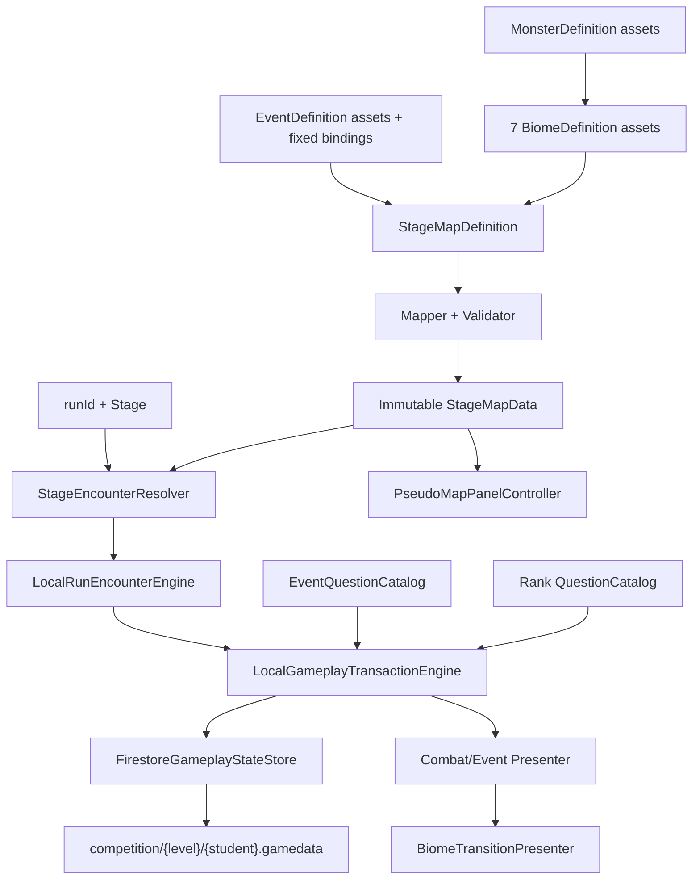

# Architecture Plan: Data-Driven Stage Map, Biomes, Enemies, and Events

> Human architecture checkpoint approved by the product owner on 2026-08-11 (`LGTM`).

## 1. Current State and Target

The current runtime has one `EnemyDefinition` wired by `CombatLobbyCompositionRoot`. `LocalCombatEngine` respawns that immutable definition after every victory and derives HP from the enemy's authored Base HP. `LocalAttemptTransactionEngine` always reserves a Rank question and mutates `AcademicProgressionEngine`. `CombatSnapshot` and private Firestore `activeRun` fields are enemy-specific.

The target replaces this single-enemy assumption with an encounter-aware run engine driven by one validated `StageMapDefinition`. It preserves standard academic combat, adds deterministic biome monster/boss resolution, allows only fixed normal-Stage Event replacement for the MVP, and adds a Challenge Event question path that does not mutate Rank audit state.

This remains under ADR-006's direct-Firestore prototype boundary. It improves deterministic persistence and retry safety but is not tamper-proof server authority.

## 2. System Diagram



## 3. Assembly Boundaries

### `PowerMath.Gameplay.Combat.Core` — no Unity references

Add pure types:

- `StageEncounterKind`: NormalMonster, MiniBoss, BigBoss, FinalBoss, ChallengeEvent.
- `StageMapData`, `BiomeData`, `MonsterData`, `EventData`, and binding records.
- `StageClassificationPolicy`, `StageEncounterResolver`, stable selection/hash policy, and `StageHpPolicy`.
- `LocalRunEncounterEngine`, replacing `LocalCombatEngine` as Stage/hearts/encounter owner.
- `EncounterSnapshot`, `EncounterResolution`, `EventAttemptResult`, and common attempt outcomes.

Core stores IDs and immutable values only—never Sprite, ScriptableObject, VisualElement, Firestore, or scene objects.

### Unity/content layer

Add `StageMapDefinition`, `BiomeDefinition`, refactored `MonsterDefinition`, `EventDefinition`, serializable bindings, and `StageMapDefinitionMapper`. `CombatLobbyCompositionRoot` receives one root map asset and maps it once. Runtime does not walk ScriptableObjects afterward.

### Presentation layer

- `EncounterPresenter` selects monster/Event visuals.
- `BiomeTransitionPresenter` owns title/crossfade/reveal timing only.
- `PseudoMapPanelController` renders local map data plus current Stage and cannot write progression.
- `CombatLobbyView` gains encounter title/sprite/background and state-dependent action-label methods.

## 4. ScriptableObject Schema

```text
StageMapDefinition
  catalogVersion
  finalStage = 200
  normalHpBaseline
  worldLevelGrowthBasisPoints = 1200
  hpVariationBasisPoints = 500
  biomes[7] -> BiomeDefinition
  fixedEvents[]

BiomeDefinition
  biomeId
  localizedTitleKey / fallbackTitle
  firstStage / lastStage
  backgroundSprite
  mapLandmarkSprite / normalizedMapPosition
  transitionAudioKey / transitionVisualKey
  normalMonsters[] -> MonsterDefinition
  bossBindings[] { stage, monster }

MonsterDefinition
  monsterId / localizedNameKey / fallbackName
  encounterClass / biomeId
  sprite / presentationKey
  maximumCooldown
  hpMultiplierBasisPoints

EventDefinition
  eventId / eventKind
  localized title/instructions + fallbacks
  sprite / presentationKey
  questionDocumentId
  failurePolicy / auditPolicy / rewardPolicyId / handlerKey

FixedEventStageBinding
  stage / eventDefinition
```

Normal HP baseline, growth, and variation live at the root, protecting the rule that biome shifts change only monster set/background. Boss modifiers remain explicit encounter content, not hidden biome modifiers.

### Validation

Editor `OnValidate` gives immediate author feedback; runtime mapping repeats validation and fails closed:

- exactly seven ordered ranges covering Stage 1-200 without gaps/overlaps;
- expected range endings and closing boss bindings;
- Stage 200 Final Boss and `%30` Big Boss class matches;
- no Event on Stage 200 or any Stage divisible by 5;
- unique IDs, valid presentation references, and a non-empty normal pool per biome;
- every boss Stage has exactly one binding in its containing biome;
- normal monsters use `10000` HP basis points; bosses use positive approved modifiers;
- each fixed Event has a handler and question document;
- normalized map positions and legal Stage limits.

Architecture recommends unique Big-Boss/Final-Boss sprites. Biome Mini-Boss definitions may recur at multiple fixed Mini-Boss Stages, avoiding a requirement for 33 separate assets.

## 5. Deterministic Encounter Resolution

```csharp
EncounterSelection Resolve(StageMapData map, string runId, StageId stage);
```

1. Classify Stage 200 Final Boss, `%30` Big Boss, `%5` Mini-Boss, or Normal Candidate.
2. Protected boss kinds resolve their fixed biome binding.
3. A Normal Candidate resolves its fixed Event binding when present.
4. Otherwise select a normal monster from the current biome pool.
5. Calculate and freeze Spawn HP/cooldown/Event state.

Normal pool index and HP variation use a stable platform-independent hash of `runId + catalogVersion + stage + purpose`; never `string.GetHashCode()`. The selected ID/kind/biome/HP/cooldown are also persisted in the same accepted Stage-advance write. Determinism supports recovery; it does not replace the saved snapshot.

## 6. Encounter Runtime Refactor

`LocalRunEncounterEngine` becomes the sole owner of current Stage/biome, hearts, immutable encounter selection, mutable monster HP/cooldown or Event state, phase/commit lock, and Stage advancement.

Monster behavior remains: commit consumes one cooldown, correct resolves ATK/critical damage, incorrect deals zero, surviving zero-cooldown enemy costs one heart, and victory resolves the next encounter.

Challenge Event behavior:

- commit consumes no fake monster cooldown;
- correct deals fixed 1 damage and clears the Stage;
- incorrect/timeout/abandon consumes one heart;
- if hearts remain, return to Event ready with incremented attempt ordinal;
- zero hearts enters existing `RunDefeat` settlement;
- critical, weapon, and Rank damage do not apply to the 1-HP target.

`LocalCombatEngine` may remain temporarily as a compile-step compatibility wrapper, but it cannot remain a second Stage authority.

## 7. Question and Attempt Boundary

Generalize `LocalAttemptTransactionEngine` to `LocalGameplayTransactionEngine` with two explicit content paths.

**Standard academic combat:** reserve from `AcademicProgressionEngine`, mutate audit/inventory/Rank Currency, use Rank damage multiplier, and retain existing analytics.

**Challenge Event:** reserve from `EventQuestionCatalog` using Event ID, Stage, and saved attempt ordinal; do not enter Rank inventories/audit; default currency delta to zero; record private Event analytics; resolve fixed Challenge rules.

Common attempt metadata:

```text
attemptId              // generated once at commit, reused for all save points
contentKind            // RankQuestion | EventQuestion
contentSourceId        // Rank or Event document ID
questionId
eventId                // empty for standard combat
outcome / responseScore / duration
```

This fixes the current weakness where `GameplaySaveRequest` generates a different transaction ID at each save point. `AttemptResolution` becomes tagged with either `AcademicAttemptResult` or `EventAttemptResult`; consumers must branch rather than fabricate a Rank result.

## 8. Event Question Repository

Add `EventQuestionCatalogRepository` using the existing configured question-project root/collection. `GameApiSettings` gains a URL-encoded `TryGetQuestionDocumentById` method used only with IDs from validated local Event content.

At Main Menu initialization, map/validate the Stage Map, gather unique Event document IDs, load each once alongside Rank documents, and validate a non-empty items array. Missing fixed Event content fails combat initialization clearly rather than silently skipping/replacing the Event.

Challenge retries select deterministically without repetition until the document is exhausted, using persisted `eventAttemptOrdinal`, then begin a deterministic next cycle. The committed question ID is persisted before presentation.

## 9. Snapshot and Firestore Migration

```text
activeRun
  runId / currentStage / phase
  biomeId
  encounterKind / encounterId
  encounterCurrentHp / encounterMaximumHp
  encounterRemainingCooldown / encounterMaximumCooldown
  eventAttemptOrdinal
  committedAttemptId
  ...existing hearts/run-currency fields

academic.activeAttempt
  attemptId / contentKind / contentSourceId / questionId
  rank       // RankQuestion only
  eventId    // EventQuestion only
  state

analytics.events.{eventId}
  attempted / correct / incorrect / timeout / abandoned
  responseScoreSum / responseDurationMillisecondsSum

lastEventReceipt
  attemptId / eventId / stage / outcome
  rewardPolicyId / rewardGranted
```

Migration/default rules:

- if canonical encounter fields are missing and legacy `enemyId` is valid, map it as a Monster encounter preserving HP/cooldown;
- new Monster writes synchronize canonical and legacy enemy leaves for one compatibility release; Events use canonical fields;
- invalid safe-state encounter data rebuilds deterministically; invalid committed/answering state fails closed;
- run settlement clears generic Event/encounter fields plus legacy enemy fields;
- Event analytics remain private and leaderboard schema stays unchanged.

Rename `FirestoreAcademicProgressionStore` to `FirestoreGameplayStateStore`; it now saves academic, monster, Event, Stage, and analytics state. The PATCH remains one student-map update with an update-time precondition.

## 10. Persistence and Presentation Sequence

- Next encounter resolves only after Stage clear.
- Attempt-resolution PATCH atomically stores result, next Stage/biome/encounter, generated state, and stable attempt receipt.
- The UI never submits encounter IDs.
- Event retries/completion use the stable attempt ID; a future permanent reward writes its first-clear flag/receipt in the same Stage-advance PATCH.
- New Stage/encounter persists before biome animation.
- Resolution exposes `BiomeChanged`; presenter plays boss defeat, biome transition, then saves presentation completion/ready state.
- Reconnect may skip cosmetic transition and render the correct saved biome; it never replays reward.

## 11. Pseudo-Map and UI Integration

Add on-demand UI Toolkit elements: Map button (disabled during committed questions), seven-landmark journey, Stage ranges, closing boss markers, cleared/current/upcoming non-color-only styles, current player marker, and within-biome progress. The map performs no Firestore query or write.

Combat/Event UI changes encounter sprite/name/background, telegraphs `CHALLENGE`, changes the action label to `START CHALLENGE`, hides cooldown for Challenge, displays the 1-HP/failure rule, and scales boss labels/frames. Biome transition consumes existing Reduced Motion settings. Final art/style remains a later UI checkpoint.

## 12. Implementation Order

1. Pure Stage classification/map/HP/selection types and stable hash.
2. ScriptableObject schemas, mapper, validation, and development content catalog.
3. Snapshot/default mapping and generic encounter persistence fields.
4. `LocalRunEncounterEngine`; migrate normal combat before Events.
5. Stable attempt IDs and generalized Firestore gameplay store.
6. Event question repository/catalog and Challenge transaction path.
7. Encounter rendering and biome transition presenter.
8. Informational pseudo-map panel.
9. Unity compile verification and manual E2E handoff; no automated test scripts.

## 13. Verification Boundary

Compile checks: Unity Console clean, map validation covers 1-200, UXML imports, Main Menu loads, and patch JSON includes canonical encounter/Event fields plus stable attempt ID.

Manual owner E2E: boundaries 4/5, 29/30/31, 179/180/181, 195/200; selection refresh persistence; boss classes; biome shift/Reduced Motion; map marker/no teleport; Challenge success/failure/timeout/death/Rank exclusion; refresh at Event commit/result without duplicate outcome/reward.

No automated tests are authored or run per owner instruction.

## 14. Human Architecture Checkpoint

Approval authorizes ADR-009 and this plan: encounter-aware runtime refactor, generic active-run schema, stable attempt IDs, fixed MVP Event bindings, and private Event analytics. It does not authorize final art/UI/audio, Firebase rule publication, deployment, dependencies, build changes, automated tests, merge, or release.
