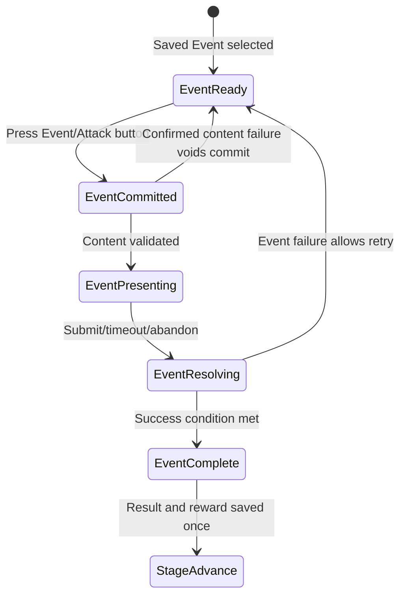
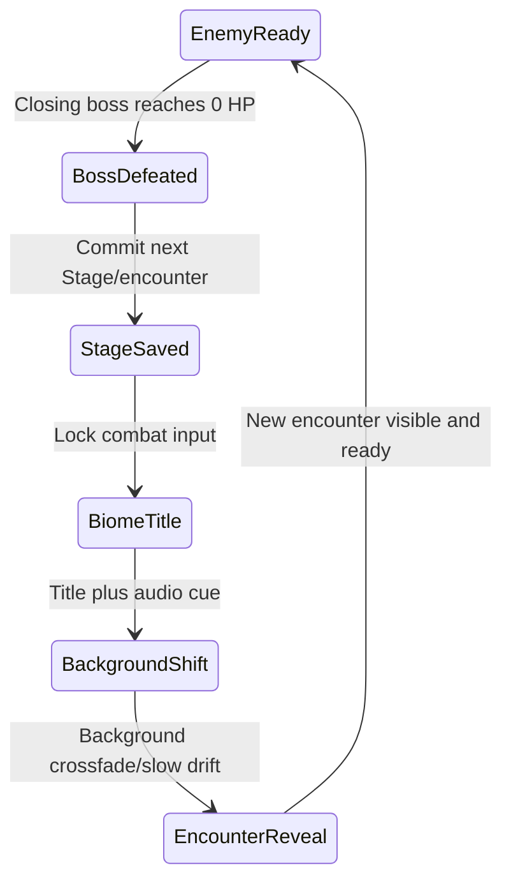

# Design Spec: Stage Map, Biomes, Enemies, and Events

> Approved by the project owner on 2026-08-11 (`LGTM`). Architecture may proceed using fixed MVP Event bindings, Challenge Monster heart loss on unsuccessful outcomes, and Event-question exclusion from the default Rank audit.

## 1. Player Goal and Experience

The student should feel that the 200-Stage run is a visible journey rather than a repeated fight against one reskinned number. Every 30 Stages closes a recognizable region with a Big Boss, then reveals a new biome through title, background, and monster-set changes. The seventh, shorter biome acts as the finale leading to Stage 200.

The pseudo-map provides orientation and anticipation. Like the supplied illustrated world-map reference, it shows distinct landmark regions in one journey composition and clearly marks the current location. Unlike a level-select map, it does not allow teleporting, replaying cleared Stages, choosing modes, or bypassing the linear run.

Events create occasional rule changes without corrupting the monster model. When the usual Attack button represents an Event, its text/visual state and Event instructions make that clear before commitment. Future Events may be structurally different while sharing selection, persistence, reconnect, and Stage-clear contracts.

## 2. System Rules

### Deterministic Stage classification

```text
ResolveBaseStageType(stage):
  stage == 200  -> FinalBoss
  stage % 30=0 -> BigBoss
  stage % 5=0  -> MiniBoss
  otherwise     -> NormalCandidate

ResolveEncounter(stage):
  protected boss type -> fixed boss binding
  normal candidate    -> fixed/eligible Event or biome normal-monster roll
```

This order resolves overlaps predictably. Stage 30 is a Big Boss, not both Mini-Boss and Big Boss. Stage 200 remains the Final Boss rather than a Mini-Boss.

### Biome route

| Slot | Stages | Purpose |
| ---: | ---: | --- |
| 1 | 1-30 | Introduction and first Big Boss |
| 2 | 31-60 | New background and monster family |
| 3 | 61-90 | Third region and Big Boss |
| 4 | 91-120 | Mid/late-run region |
| 5 | 121-150 | Advanced region |
| 6 | 151-180 | Last full-length region |
| 7 | 181-200 | Short finale biome and Final Boss |

Biome membership comes only from the ordered map data. The Stage itself remains the authoritative player position. Biome shifts cannot modify Rank, questions, wallet, player stats, hearts, or difficulty formulas.

### Data model responsibilities

| Definition | Owns | Must not own |
| --- | --- | --- |
| `StageMapDefinition` | Ordered route, 200-Stage coverage, biome references, Event scheduling/bindings | Runtime HP, wallet, player progress |
| `BiomeDefinition` | ID/title, Stage range, background, landmark/map position, normal pool, boss bindings, transition presentation keys | Hidden damage/HP multipliers, player data |
| `MonsterDefinition` | ID/name, sprite, encounter class, biome membership, cooldown, boss spike profile/reference | Event logic; per-monster HP for normal monsters |
| `EventDefinition` | ID/kind, title/instructions, custom sprite, handler key, eligibility, question source, failure/reward policy | Fake monster cooldown/type fields |
| Runtime encounter snapshot | Selected encounter ID/type, Stage, generated HP, cooldown/event state, transaction identity | Authoring assets themselves |

Validation must reject duplicate IDs, missing sprites, empty normal pools, route gaps/overlaps, unsorted ranges, boss-class mismatches, protected-Stage Event bindings, missing handler/question references, and Stage 1/200 coverage errors.

### Monster behavior

- Normal monster identity is randomly selected from the current biome, but its HP comes from the Stage HP curve. Selection is saved once.
- Mini-Boss, Big-Boss, and Final-Boss encounters use fixed Stage bindings with unique presentation and authored HP-spike modifiers after Stage scaling.
- Cooldown remains per Monster Definition because it changes the visible number of question attempts before a heart is lost.
- Boss HP multipliers are tunable and are not assigned final values during this design checkpoint.

### Event behavior

Events replace only normal candidates. For the MVP, explicit fixed Stage bindings are recommended because teachers/designers can predict when harder content appears and E2E can reproduce it. The definition keeps future weighted eligibility fields, but chance selection should remain disabled until a later balance decision.

Event state machine:



Entry requires an eligible normal Stage with no active combat attempt. Attack remains locked after commit. Reconnect restores the committed/result state; it cannot reroll the Event. A content-system failure may void the commit, but ordinary incorrect/timeout/abandon outcomes do not.

### Challenge Monster recommendation

- Runtime target: exactly 1 HP.
- Content: one harder question from `EventDefinition.questionDocumentId` rather than the active-Rank document.
- Correct: deals 1 damage and completes the Stage.
- Recommended incorrect/timeout/abandon rule: lose one heart, keep the Event at 1 HP, and return to `EventReady` if hearts remain. At zero hearts, enter normal `RunDefeat` settlement.
- Rank protection: result is logged in Event analytics but does not alter the five-question Rank audit by default.
- Reward: must be explicit and idempotent. No permanent or repeatable reward amount is proposed until the Event economy target is approved.

The recommended failure rule reuses the game's understandable heart risk without inventing a fake enemy cooldown. It also prevents cost-free unlimited attempts. If approved, its first playtest should compare frustration against standard combat before tuning reward size.

## 3. Pseudo-Map Information Design

The panel shows seven illustrated biome landmarks on one horizontal journey path:

- cleared biomes use a completed/readable treatment, not grayscale-only communication;
- the current biome uses a player marker plus high-contrast outline and `CURRENT` text;
- upcoming biomes remain visible for anticipation but cannot be clicked to travel;
- each landmark shows biome title, Stage range, and closing boss marker;
- Stage progress within the current biome is shown as text/progress, separate from leaderboard Highest Stage;
- map open/close is on-demand and cannot cover a committed question.

The supplied CookieRun-style reference informs region grouping, landmark prominence, and a strong current-location marker. Mode tabs and percentage-completion lists are intentionally excluded because they imply selectable/replayable modes that PowerMath does not have.

## 4. Biome Shift State Machine and Feedback



Starting presentation values—not final balance:

- title reveal/hold: `0.7s`;
- background crossfade/shift: `1.2s`;
- encounter reveal: `0.5s`;
- total target: approximately `2.4s`;
- Reduced Motion target: short title/fade with no drift, approximately `0.8s`.

Micro test: after three observed transitions, at least 8 of 10 students identify that they entered a new biome before the monster appears, and fewer than 2 of 10 repeatedly press Attack during the lock. If the sequence feels slow, shorten the title hold first; if the shift is missed, increase title contrast/hold before increasing motion.

The transition uses title animation plus audio, while the Big Boss defeat uses its own defeat feedback. These channels must not overlap into unreadable “noise soup.”

## 5. Five-Component Evaluation

| Component | Design requirement |
| --- | --- |
| Clarity | Stage-type priority is deterministic; boss/Event telegraphs appear before commitment; biome title precedes monster reveal. |
| Motivation | Map landmarks expose upcoming journey progress and bosses without changing rewards or adding currencies. |
| Response | Attack has one state-dependent meaning, acknowledges Event commitment immediately, and stays unavailable only during saved transition/commit states. |
| Satisfaction | Boss closure, biome title/background shift, and new encounter reveal provide scaled visual/audio feedback. |
| Fit | Monster families and backgrounds change the fantasy region while mathematics, Rank, and persistent progression remain the core identity. |

Response and Clarity take priority over transition spectacle. Reduced Motion keeps all information with less movement.

## 6. Risks and Abuse Cases

- Random Event selection could make classroom/E2E outcomes irreproducible; use fixed bindings for MVP.
- Random normal monsters must not reroll HP/difficulty on refresh; persist selected ID and generated HP.
- A 1-HP Challenge Event with unlimited free retry can become reward farming; require an explicit failure cost and idempotent completion receipt.
- Harder Event questions could unfairly demote Rank; keep them outside the default Rank audit.
- Thirty-three Mini-Boss positions plus six Big Bosses and one Final Boss create a large unique-art burden if every Stage must be distinct. Confirm whether Mini-Boss definitions may repeat within a biome.
- A long biome transition repeated after reconnect could frustrate students; persistence owns the new encounter, presentation is skip/repeat-safe and never owns rewards.
- A pseudo-map that looks clickable may imply teleportation; use non-button landmarks and explicit current/upcoming states.

## 7. Playtest Scenarios

- **New player:** predict encounter type and identify current biome without explanation.
- **Boundary:** inspect Stages 4/5, 29/30/31, 179/180/181, 195, and 200.
- **Stress:** spam Attack during biome transition and Event commit; only one authoritative action occurs.
- **Recovery:** refresh before selection, after selection, during transition, during Event content, and after result submission.
- **Skill/fairness:** compare normal Rank questions with Challenge Event questions; Event results do not move Rank unexpectedly.
- **Abuse:** intentionally retry/refresh Challenge Monster; no reroll, duplicate reward, or free infinite reward loop.
- **Readability:** observer explains why the background/monster changed, why a boss appeared, and why an Event uses different rules.
- **Accessibility:** Reduced Motion preserves title, location, and encounter-state comprehension.

## 8. Tuning Priority

1. Fix encounter/Event telegraph clarity and Attack-button meaning.
2. Fix persistence/reconnect determinism.
3. Tune Challenge failure pressure and frustration.
4. Tune Stage HP baseline and boss spike multipliers from correct-answer counts.
5. Tune biome-transition duration/feedback.
6. Add or tune Event frequency/rewards only after the core route is stable.
