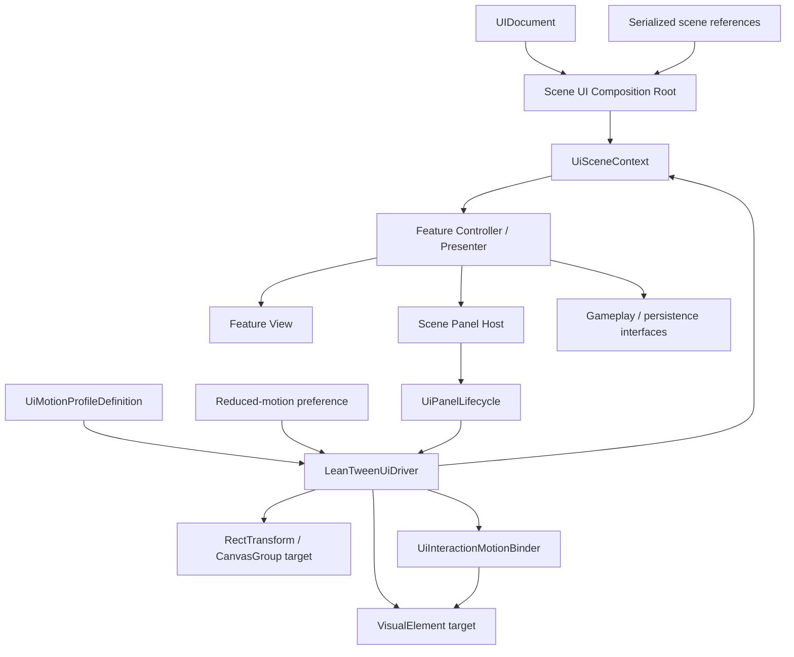

# Architecture Plan: Scene-Scoped UI Composition and Shared Motion

> Approved by the project owner on 2026-08-29 for the Main Menu pilot. Broader panel migration still stops after pilot review.

## 1. Decision Summary

Use a small `PowerMath.UI.Core` foundation that is independent of gameplay. Each scene owns one composition root and one LeanTween UI driver. Views bind only their subtree. Navigation owns panel identity and focus, while a panel lifecycle owns visibility and motion. Feature controllers keep use-case policy and consume the shared driver for presentation primitives.

This extends the approved Main Menu transition design; it does not add a second transition framework.

## 2. Target System Diagram



Dependency direction:

```text
PowerMath.UI.Core -> Unity UI APIs + LeanTween only
Gameplay.*.Unity -> PowerMath.UI.Core (for shared presentation primitives)
PowerMath.UI.MainMenu -> PowerMath.UI.Core + required gameplay/application interfaces
Scene composition -> concrete feature adapters and serialized assets
```

`PowerMath.UI.Core` never references Main Menu panel IDs, combat phases, player data, Firestore, or scene names.

## 3. Interface Definitions

Signatures may be adjusted during implementation, but the responsibility boundaries are required.

```csharp
public enum UiMotionState
{
    Hidden,
    Entering,
    Idle,
    Hovered,
    Pressed,
    Exiting
}

public enum UiMotionChannel
{
    Lifecycle,
    Feedback,
    Interaction,
    Ambient
}

public enum UiMotionEndState
{
    ApplyHidden,
    ApplyIdle
}

public sealed class UiMotionHandle
{
    public bool IsActive { get; }
    public void Cancel();
}

public interface IUiMotionDriver : IDisposable
{
    bool ReducedMotion { get; }
    void SetReducedMotion(bool reducedMotion);

    UiMotionHandle Tween(VisualElement target, UiMotionChannel channel,
        float seconds, UiMotionEasing easing, Action<float> apply,
        Action completed = null, float delaySeconds = 0f,
        bool loopPingPong = false);
    UiMotionHandle Tween(RectTransform target, UiMotionChannel channel,
        float seconds, UiMotionEasing easing, Action<float> apply,
        Action completed = null, float delaySeconds = 0f,
        bool loopPingPong = false);
    void Cancel(VisualElement target, UiMotionChannel channel);
    void Cancel(RectTransform target, UiMotionChannel channel);
}

public interface IUiPanelLifecycle : IDisposable
{
    UiMotionState State { get; }
    bool IsStable { get; }

    void Enter(Action completed = null);
    void Exit(Action completed = null);
    void CancelAndApply(UiMotionEndState endState);
}

```

The driver also supports `AnimationCurve` overloads for both target types. It is intentionally a small sampling/cancellation mechanism: panel lifecycle and feature feedback retain semantic policy, so a second layer of generic `Enter`, `Pulse`, and `Idle` preset functions was not added.

The existing feature-owned `IMainMenuPanelHost` contract remains intact. Introducing a generic global panel-host abstraction during the pilot would add indirection without removing a current dependency. Feature code never receives LeanTween IDs or `LTDescr` objects.

## 4. Core Classes and Ownership

| Class | Responsibility | Depends on | Owned state |
| --- | --- | --- | --- |
| `UiMotionProfileDefinition` | Shared starting durations, transforms, and reduced-motion substitutions | `ScriptableObject` | Authored motion tokens only |
| `LeanTweenUiDriver` | Start, sample, replace, cancel, and finalize tweens per target/channel | LeanTween, scene host, reduced-motion preference | Active target/channel handles |
| `UiInteractionMotionBinder` | Translate pointer/focus/press callbacks into driver requests | Driver, interactive subtree | Callback registrations and pointer/focus flags |
| `UiPanelLifecycle` | Enforce hidden/entering/idle/exiting state and picking/display invariants | Driver, panel root | Lifecycle state and completion revision |
| `UiElementQuery` | Required/optional subtree query with actionable failure messages | `VisualElement` | No state |
| `UiSceneContext` | Read-only handoff of root and stable shared UI services | Root, driver, motion profile | References only |
| Scene composition root | Validate serialized scene references and construct feature controllers | Scene components/assets | Feature lifetime/disposal order |
| Feature view | Bind its own subtree, render values, expose user intents | Root/subtree | Cached element references and event registration |
| Feature controller/presenter | Coordinate feature use case and view state | View, application/gameplay interfaces | In-flight use-case state only |

## 5. Motion Channel Rules

Each target has independent channels where safe:

- `Lifecycle`: opacity, scale, and translate for enter/exit. Highest priority.
- `Interaction`: hover/focus/press scale and translate. Paused/cancelled outside Idle/Hovered/Pressed.
- `Ambient`: optional looping idle. Stops while hidden, busy, pressed, or reduced motion.
- `Feedback`: bounded pulse/shake/burst requested by feature policy. Cannot change visibility or focus.

Priority is Lifecycle > Feedback > Interaction > Ambient. Starting a higher-priority channel cancels conflicting lower-priority channels and restores the correct sampled baseline. This prevents hover, idle, and exit from writing the same style simultaneously.

## 6. Binding and Dependency Rules

- A view receives one root and queries only inside that subtree.
- Element names remain private constants in the owning view; there is no global list of every UXML name.
- `UiElementQuery.Require<T>` centralizes validation behavior, not element ownership.
- Scene-required references are serialized and validated. `Resources.Load` may remain only as a temporary compatibility fallback during a migration phase and must log the missing authoring dependency.
- `GameObject.Find` is removed from final UI wiring. Canvas targets are serialized or provided by an explicit scene binding component.
- Composition roots construct concrete adapters; feature classes receive interfaces/values through constructors.
- Runtime `AddComponent` compatibility paths are removed after scenes are resaved and validation tests pass.

## 7. Visibility, Focus, and Input Flow

```text
User intent
-> feature controller asks scene panel host
-> panel host checks interaction policy and exclusivity
-> lifecycle Enter disables picking and starts shared motion
-> lifecycle reaches Idle and enables picking
-> accepted close disables picking immediately
-> lifecycle Exit completes
-> panel host applies Hidden, clears panel identity, restores focus, publishes PanelClosed
```

`ForceCloseAll` cancels and applies Hidden synchronously, clears identity, and does not publish normal user-return animation events unless the existing feature contract explicitly requires it.

## 8. Semantic State vs. Motion State

`UiSemanticState` remains the typed source for Ready, Busy, Success, Error, and Blocked classes. It never changes display or transforms. `UiMotionState` controls only lifecycle/interaction presentation. A panel can therefore be `Busy` semantically while `Idle` spatially, without string class conflicts.

Local `SetSemanticState(string)` implementations migrate to `UiSemanticState` and are deleted after callers move.

## 9. Migration Plan

### Phase A: Additive foundation

- Add `PowerMath.UI.Core.asmdef` and core classes.
- Add unit tests for cancellation, reversal, stable end states, channel priority, and reduced motion.
- Add `UiMotionProfileDefinition` asset using the approved starting values.
- Do not change existing panel behavior yet.

### Phase B: Main Menu pilot

- Adapt `MainMenuPanelHost` to `UiPanelLifecycle` while preserving its public Main Menu contract.
- Move `MainMenuTransitionController` tween execution into the driver; keep sequence policy and approved settings.
- Move `PlayerHubFeedbackPlayer` pulse/idle execution into the driver; keep feature-specific audio, particles, and milestone policy.
- Remove conflicting transform transitions only from migrated targets.
- Stop for human visual and interaction review.

### Phase C: Feature panels

- Extract subtree views where controllers currently query elements directly.
- Migrate one panel at a time: Admin, Leaderboard, Profile, Gacha, Player Hub, then Rebirth/settlement.
- Preserve use-case/network code and transaction boundaries.

### Phase D: Combat and entry screens

- Replace `UiToolkitLifecycleController` behind existing combat APIs.
- Migrate Bootstrap and Authentication interaction motion without changing validation or scene flow.

### Phase E: Composition cleanup

- Create explicit Main Menu scene bindings.
- Split UI installation and Canvas binding out of `CombatLobbyCompositionRoot`.
- Remove `Find`, required `Resources.Load`, and runtime component installation fallbacks after scene validation.
- Delete deprecated lifecycle/tween helpers and duplicate USS transform rules.

## 10. Validation

- EditMode: lifecycle state transitions, reversal, callback-once behavior, disposal, reduced motion, and authored final-state restoration.
- EditMode: panel host identity, exclusivity, interaction gate, focus target, and `ForceCloseAll` behavior.
- Asset contracts: each view can bind its UXML subtree; migrated targets do not retain conflicting transform transitions.
- PlayMode: twenty-cycle pointer/keyboard open-close stress, scene unload during every phase, and transaction/input regression checks.
- Visual: Main Menu pilot at supported aspect ratios with normal and reduced motion.
- Performance: no persistent `Update()` outside LeanTween's shared runtime; no recurring GC allocation after motion completion.

## 11. Approval Decision

Recommended: approve the scene-scoped architecture and staged migration. Do not approve a global singleton UI manager or an atomic rewrite of all current panels.
