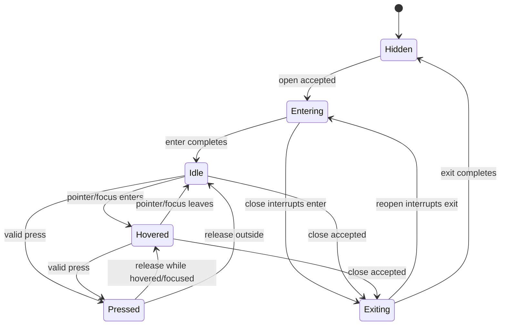

# Design Spec: Shared UI Lifecycle and Motion

> Approved by the project owner on 2026-08-29 for the Main Menu pilot. Values remain starting values subject to the documented pilot review.

## 1. Player Goal and Context

The player should understand when UI is arriving, available, reacting, busy, and leaving. Motion should acknowledge input quickly and consistently, while reduced motion preserves the same state clarity without displacement or looping idle effects.

## 2. System Rules

### Lifecycle

- Visibility authority decides whether a panel may open or close; motion never decides eligibility.
- A newer command cancels the older command on the same target.
- Enter interrupted by exit starts from the current sampled transform/opacity and finishes hidden.
- Exit interrupted by enter starts from the current sampled state and finishes interactive.
- Input remains disabled while a panel is entering or exiting unless a feature explicitly documents early interaction.
- Hidden always means `display: none`, ignored picking, no focus, and no active tween.
- Idle always restores the authored transform/opacity and normal picking.
- Idle animation is opt-in for meaningful decorative targets only. Text fields, dense data, warnings, and every button do not loop by default.
- Significant action feedback may add feature-specific audio/VFX, but uses shared motion primitives rather than direct LeanTween calls.

### Reduced motion

- Enter/exit use a short opacity transition with no translation, overshoot, shake, or looping idle.
- Hover/focus may use color/border emphasis; scale and translation remain at authored values.
- Press retains immediate visual acknowledgement without large displacement.
- Reduced motion uses the existing project preference source until a general accessibility settings owner is approved.

## 3. Starting Motion Values

These are **starting values**, mostly consolidating timings already present in the repository. They are not final quality claims.

| Token | Starting value | Validation | Adjustment if it fails |
| --- | ---: | --- | --- |
| Press | 0.08 s | Ten rapid presses remain visibly acknowledged without delaying action | Reduce toward immediate state if response feels delayed |
| Hover/focus | 0.16 s | Pointer and keyboard focus feel equivalent and readable | Reduce if focus feels floaty; reduce scale before increasing speed |
| Enter | 0.22 s | Panel content is readable and actionable after one clear arrival | Reduce if navigation feels gated; reduce travel before duration |
| Exit | 0.16 s | Close feels acknowledged but does not hold the next action | Shorten if repeated back navigation feels blocked |
| Reduced crossfade | 0.12 s | State change remains clear with no perceived spatial motion | Shorten if it feels like a delay |
| Optional idle cycle | 1.60 s | Decorative emphasis is noticeable but not distracting over 30 seconds | Lower amplitude first; disable when attention is pulled from decisions |
| Hover scale/offset | 1.035, Y -2 px | Focused control is obvious without layout collision | Reduce scale/offset on dense layouts |
| Press scale/offset | 0.94, Y +2 px | Press reads clearly without feeling heavy | Move scale toward 1.0 if repeated input feels sluggish |
| Generic enter start | 0.90 scale, Y +12 px, alpha 0 | Modal arrival is visible without obscuring content | Reduce displacement/overshoot before changing duration |
| Generic exit end | 0.96 scale, Y -6 px, alpha 0 | Direction is readable but close remains quick | Remove translation if it distracts from the destination |

Large authored sequences such as Main Menu bootstrap keep their approved feature profile, but their tween execution and cancellation move behind the shared driver.

## 4. Five-Component Evaluation

| Component | Design response |
| --- | --- |
| Clarity | Named lifecycle states and stable final states make availability and completion predictable. |
| Motivation | Motion does not manufacture stakes; feature-specific rewards retain their own feedback. |
| Response | Press feedback is immediate, reversals are interruptible, and close/open never waits on an obsolete tween. |
| Satisfaction | Shared primitives support feature-specific visual plus audio feedback without duplicating tween mechanics. |
| Fit | One profile creates a coherent light-fantasy UI rhythm while preserving specialized battle/reward sequences. |

Priority remains Response, then Clarity, then Satisfaction, Fit, and Motivation.

## 5. Risks and Abuse Cases

- Input spam during enter/exit could double-submit actions; lifecycle motion must not own command idempotency.
- A hover tween and panel-exit tween could fight over the same style channel; exit cancels interaction and idle channels first.
- USS transform transitions could interpolate against LeanTween samples; migrated targets must have one transform owner.
- Looping idle on many targets could create distraction and unnecessary work; idle is opt-in and pauses while hidden.
- Disabling/unloading a `UIDocument` could leave callbacks or input locks; disposal applies the documented stable state.
- Focus and pointer can overlap; focus remains active when pointer leaves, so the visual does not incorrectly drop to idle.

## 6. Playtest Scenarios

1. New player: open and close each Main Menu panel and explain which UI is actionable.
2. Stress: perform twenty rapid open/close/back cycles with pointer and keyboard; verify one visible panel, one focus target, and no blocked input.
3. Reversal: close during enter and reopen during exit at multiple points; verify stable final state.
4. Readability: compare hover, keyboard focus, disabled, busy, success, and error states without instruction.
5. Reduced motion: repeat all scenarios with reduced motion enabled; verify no large displacement, shake, overshoot, or looping idle.
6. Observer test: watch a recording and identify enter, accepted press, busy state, completion, and exit at least 8 of 10 times.

## 7. Tuning Priority

1. Fix cancellation, input ownership, and focus restoration.
2. Fix clarity of lifecycle and semantic states.
3. Tune travel/scale amplitude.
4. Tune duration/easing.
5. Add or tune optional idle and feature-specific spectacle.
