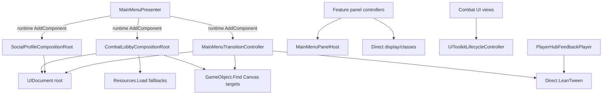

# Impact Analysis: UI Architecture Centralization

> Approved by the project owner on 2026-08-29 for additive foundation work and the Main Menu pilot migration.

## Refactor Goal

Replace competing UI dependency, visibility, lifecycle, and tween mechanisms with scene-scoped composition, subtree-owned views, one panel lifecycle contract, and one LeanTween-backed motion driver, without changing gameplay authority or feature outcomes.

## Audit Evidence

The audit covered the 22 scripts under `Assets/Project/Script/UI` (6,312 lines), relevant combat UI lifecycle code, all project UXML entry documents, and all project USS files.

| Finding | Evidence | Risk |
| --- | --- | --- |
| Composition root growth | `CombatLobbyCompositionRoot.cs` is 1,094 lines and owns runtime construction, resource fallbacks, UXML access, Canvas lookup, actor setup, feedback setup, and feature installation | A UI change can alter combat/session construction or scene art binding |
| Multiple visibility owners | 32 direct `style.display` writes in UI scripts, plus `is-hidden`, `MainMenuPanelHost`, and `UiToolkitLifecycleController` | One path can hide a panel while another still thinks it is open/interactive |
| Split lifecycle systems | Combat uses scheduled USS lifecycle; Main Menu and Player Hub use direct LeanTween; most panels switch display immediately | Cancellation, focus, reduced motion, and final-state behavior differ by feature |
| Motion values are duplicated | 91 USS transition-duration declarations across 13 files and 19 distinct textual values; common 0.08/0.16/0.22/0.24 timings recur locally | Small feel changes require broad edits and drift between panels |
| Stringly UI binding | UI scripts contain 152 named element queries/requirements; `combat-attempt-panel` is queried by three feature controllers | Rename blast radius crosses feature boundaries and failures occur at runtime |
| Runtime fallback wiring | UI/runtime code uses `Resources.Load`, `GameObject.Find`, and runtime `AddComponent` fallbacks for required scene/UI dependencies | Missing authoring errors are hidden until a later feature path executes |
| Semantic state duplication | Several panels implement local `SetSemanticState(string)` while `UiSemanticState` already exists | Typo-prone state classes and inconsistent cleanup |
| Style ownership duplication | Shared theme styles are referenced by entry UXML and again by several child templates; hover/press transforms are repeated in feature USS | Ordering and later edits can produce unexpected overrides |
| Feature/controller mixing | `LeaderboardRuntime.cs` and `ProfileAnalyticsRuntime.cs` combine repositories/stores, formatting, view binding, and controller behavior | Presentation refactors risk data/network regressions |
| Current worktree overlap | 2,189 insertions and 833 deletions are already present in the audited UI surface, including transition and Player Hub work | A big-bang rewrite would overwrite or invalidate active user work |

## Current Dependency Shape

## Blast Radius

| Area | Risk | Required protection |
| --- | --- | --- |
| Main Menu panel navigation | High | Existing panel identity/exclusivity and focus tests; spam/reversal PlayMode tests |
| Combat input and terminal flows | Critical | Interaction gate remains authoritative; no transaction calls move into UI infrastructure |
| Main Menu bootstrap transition | High | Preserve approved sequence, reduced motion, cancellation, and final authored layout |
| Player Hub/Gacha/Rebirth | High | Preserve command idempotency, busy state, accepted close behavior, and feedback sequencing |
| Authentication/Bootstrap | Medium | Preserve validation, retry, and scene flow; migrate only after Main Menu pilot |
| UXML/USS | High | Contract tests for required names/classes and visual checks at supported resolutions |
| Scene assets | Medium | Explicit serialized references and scene validation before removing fallbacks |

## Class Responsibility Table

| Current owner | Current responsibilities | Target owner | Target responsibilities |
| --- | --- | --- | --- |
| `CombatLobbyCompositionRoot` | Combat construction, UI binding, feature installation, Canvas discovery, runtime fallback creation | `MainMenuCompositionRoot` plus existing combat factory/services | Scene UI assembly and explicit dependency passing; combat construction stays in combat-owned collaborators |
| `MainMenuPresenter.Awake` | Adds missing composition components at runtime | Scene authoring + `MainMenuCompositionRoot` validation | Required components/references are explicit; compatibility fallbacks are temporary and logged |
| `MainMenuPanelHost` | Panel identity, visibility, focus, events | `UiPanelHost` / Main Menu adapter | Panel authority and focus; delegates enter/exit to one lifecycle owner |
| `UiToolkitLifecycleController` | USS class scheduling and visibility | `UiPanelLifecycle` | Deterministic lifecycle state, input state, reversal, cancellation, and stable final state |
| `MainMenuTransitionController` | Sequence policy plus direct LeanTween execution and scene discovery | `MainMenuTransitionController` + `LeanTweenUiDriver` | Controller keeps sequence policy; driver owns tween mechanics; references are injected |
| `PlayerHubFeedbackPlayer` | Feature feedback policy plus direct LeanTween mechanics | Same feature policy + `IUiMotionDriver` | Selects pulse/shake/burst/audio meaning; shared driver executes and cancels motion |
| Feature controllers | Data/network work, element queries, display writes, state classes, event hooks | Presenter/controller + feature view | Controller owns use case; view owns subtree binding/rendering; lifecycle owns visibility |
| Local `SetSemanticState(string)` methods | String class mutation | Existing `UiSemanticState` extension | Typed semantic state with one class cleanup policy |
| Repeated feature USS transforms | Per-control hover/press/transition values | Shared motion profile + interaction binder | One timing/easing/transform policy; USS retains layout, color, borders, typography |

## Incremental Migration

1. Baseline: preserve current dirty work, run current tests, and add lifecycle reversal contracts before moving ownership.
2. Foundation: add UI Core assembly, binding helper, motion profile, LeanTween driver, interaction binder, and panel lifecycle without changing callers.
3. Main Menu pilot: adapt `MainMenuPanelHost`, then move `MainMenuTransitionController` and `PlayerHubFeedbackPlayer` onto the driver.
4. Feature panels: migrate Gacha, Player Hub, Rebirth, Leaderboard, Profile, and Admin one panel at a time.
5. Combat lifecycle: replace `UiToolkitLifecycleController` behind the existing combat view API.
6. Entry screens: migrate Authentication and Bootstrap after Main Menu behavior is proven.
7. Composition cleanup: split concrete feature/runtime wiring from `CombatLobbyCompositionRoot`; replace required `Find`/`Resources.Load` fallbacks with explicit scene references.
8. Cleanup: remove deprecated lifecycle code, duplicated transform rules, and compatibility component installation only after no callers remain.

Every phase is independently testable and reversible. No phase requires rewriting UXML or feature business logic.

## Over-Engineering and Unnecessary Work To Avoid

- Do not create a persistent global `UIManager` singleton; UI lifetime and references are scene-scoped.
- Do not introduce a DI container, reflection-based binding, code generation, or event bus for this refactor.
- Do not create one ScriptableObject per button or animation. Use one shared motion profile plus genuinely feature-specific feedback profiles.
- Do not animate every element continuously. Idle is explicit and sparse.
- Do not move layout, typography, color, or data formatting into the tween driver.
- Do not make the driver aware of panel IDs, gameplay phases, Firestore, sessions, or transactions.
- Do not build a universal navigation stack for Bootstrap and Authentication; only Main Menu currently needs panel navigation.
- Do not keep both USS transform transitions and LeanTween transform writes on a migrated target.
- Do not rename all UXML elements as a preliminary cleanup; migrate view ownership first, then rename only with contract coverage.

## Human Checkpoint

Approve or request changes to the target boundaries, staged migration, and motion values before runtime code is changed. The current worktree has substantial overlapping edits, so implementation should begin with additive foundation files and the Main Menu pilot rather than edits across every current panel.
