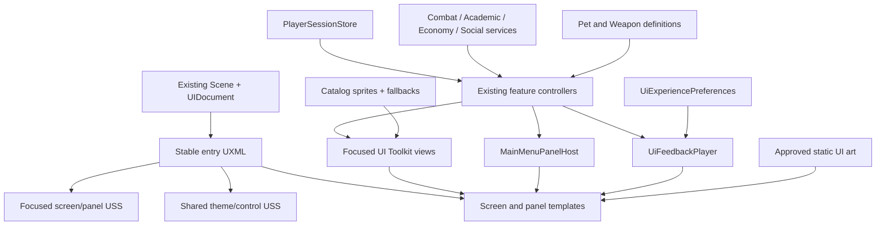
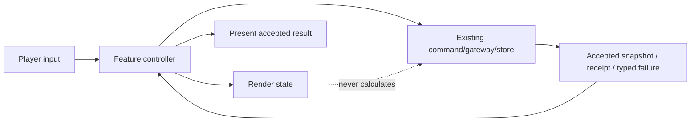

# Architecture Plan: UI Mockup Experience Migration

> Approved by the project owner on 2026-08-26 (`lgtm`). Implementation Slice 1—shared UI foundation, Authentication, and Bootstrap—is authorized.

## 1. Current State and Target State

### Current implementation

- `BootstrapScene`, `AuthenticationScene`, and `MainMenuScene` each use UI Toolkit through one scene `UIDocument`.
- The scene entry assets are `BootstrapUI.uxml`, `AuthenticationUI.uxml`, and `MainMenuUI.uxml`.
- `MainMenuUI.uxml` contains the base lobby, combat layer, World Map, Rebirth, Player Hub, Pet Gacha, Profile Analytics, and Leaderboard in one 256-line document with 31 inline style declarations.
- `CombatLobbyUI.uss` contains 1,139 lines for combat and all Main Menu panels.
- Existing controllers bind by stable UXML names through `root.Q<T>(name)` and own real behavior: authentication, bootstrap recovery, combat, World Map, settlement, Weapon Ascension, one-pull Gacha, leaderboard, profile, and logout.
- `CombatLobbyCompositionRoot` is a large compatibility bridge that wires combat, academic progression, run economy, and several UI surfaces at runtime.
- `SocialProfileCompositionRoot` is already a sibling composition root for Leaderboard and Profile Analytics.
- Accepted ADRs keep game authority and derived rules outside presentation. UI reacts to snapshots/receipts and must not calculate combat, settlement, ranking, probability, or persistence outcomes.
- Approved mockups remain outside `Assets/` and are not separate production-ready layers. Current runtime art under `Assets/Project/Material/` is placeholder-level.

### Target architecture

Keep the three scenes, their existing `UIDocument` components, and the three entry UXML paths. Decompose each entry document into reusable UI Toolkit templates and focused USS files while preserving the existing named-element contracts during each migration slice.

Introduce a small presentation-only foundation:

- a shared theme and control stylesheet set;
- reusable panel/header/currency/icon/status UXML templates;
- one Main Menu panel host that arbitrates visual exclusivity and restores focus;
- one transition/feedback service controlled by reduced-motion preferences;
- explicit UXML binding-contract validation;
- approved, layered UI art imported under a dedicated art root.

Existing domain/application controllers remain the authority-facing boundary. Each panel is migrated by separating its element binding/view concerns from its current command orchestration only where necessary. No controller is rewritten wholesale merely to change visuals.

## 2. Architecture Principles

1. **Stable scene entry points:** scenes continue referencing the same root UXML assets; no build-setting change is required.
2. **Strangler migration:** replace one visual subtree at a time behind the same controller contract.
3. **State is not presentation:** controllers receive authoritative snapshots, policies, catalogs, or receipts; UXML/USS never derives game outcomes.
4. **One open panel:** the host owns only visual exclusivity/focus; each feature controller owns eligibility, busy state, and transaction safety.
5. **Native controls over baked UI:** Main Menu biome/enemy art remains on scene Canvas GameObjects; text, buttons, HUD, scroll views, fields, progress, focus, and error states remain UI Toolkit elements.
6. **Static and dynamic art are separate:** static scene art is referenced by UXML/USS; player/pet/weapon/avatar art resolves through content data or explicit fallbacks.
7. **No new runtime dependency:** use UI Toolkit transitions/scheduling and existing audio/coroutine patterns. LeanTween is not required for this migration.
8. **No per-frame UI polling:** bind on events, open, session changes, or explicit refresh.

## 3. System Diagram



### Authority boundary



## 4. UXML and USS Composition

### Stable entry assets

Keep these paths so scene references do not change:

| Entry asset | Target responsibility |
| --- | --- |
| `Assets/Project/UI/AuthenticationUI.uxml` | Import theme/auth styles and instantiate the Authentication screen template |
| `Assets/Project/UI/BootstrapUI.uxml` | Import theme/bootstrap styles and instantiate the Bootstrap screen template |
| `Assets/Project/UI/MainMenuUI.uxml` | Import theme/Main Menu styles and assemble shell, combat layer, panel templates, feedback, and blocking overlay |
| `Assets/Project/UI/login-input.uss` | Temporary compatibility import; retire only after Authentication style parity |
| `Assets/Project/UI/BootstrapUI.uss` | Temporary compatibility import; reduce to an entry import after migration |
| `Assets/Project/UI/CombatLobbyUI.uss` | Temporary compatibility import; reduce incrementally instead of replacing in one diff |

### Proposed UI asset tree

```text
Assets/Project/UI/
  Theme/
    MathWorldPalette.uss
    MathWorldTypography.uss
    MathWorldControls.uss
    MathWorldPanels.uss
    MathWorldStates.uss
  Shared/
    CurrencyPill.uxml
    IconButton.uxml
    StatusMessage.uxml
    ModalFrame.uxml
    LoadingOverlay.uxml
  Authentication/
    AuthenticationScreen.uxml
    AuthenticationScreen.uss
  Bootstrap/
    BootstrapScreen.uxml
    BootstrapScreen.uss
  MainMenu/
    MainMenuShell.uxml
    MainMenuShell.uss
    CombatLobbyPanel.uxml
    CombatLobbyPanel.uss
    WorldMapPanel.uxml
    WorldMapPanel.uss
    PlayerHubPanel.uxml
    PlayerHubPanel.uss
    RebirthPanel.uxml
    RebirthPanel.uss
    PetGachaPanel.uxml
    PetGachaPanel.uss
    LeaderboardPanel.uxml
    LeaderboardPanel.uss
    ProfileAnalyticsPanel.uxml
    ProfileAnalyticsPanel.uss
```

The exact grouping may be implemented through UXML templates or cloned `VisualTreeAsset` subtrees. The invariant is more important than the mechanism: the stable entry document exposes one visual tree containing each existing required element name exactly once.

### Style policy

- Inline UXML styles are removed as each subtree migrates.
- Theme files contain reusable visual tokens/classes only; screen files own layout.
- State modifiers use consistent classes such as `is-selected`, `is-busy`, `is-success`, `is-warning`, `is-error`, and `is-reduced-motion`.
- Feature controllers toggle semantic state classes; they do not assign per-property colors, margins, or font sizes.
- Display visibility remains a view concern and is exposed through named render methods, not scattered `style.display` writes after migration.

## 5. Presentation Contracts

These interfaces are target contracts. They may remain internal to the UI assembly/predefined assembly until the existing project introduces a dedicated UI assembly definition.

```csharp
public enum MainMenuPanelId
{
    None,
    WorldMap,
    PlayerHub,
    Rebirth,
    PetGacha,
    Leaderboard,
    ProfileAnalytics,
    Settings
}

public interface IMainMenuPanelHost
{
    MainMenuPanelId OpenPanel { get; }
    bool TryOpen(
        MainMenuPanelId panelId,
        VisualElement panelRoot,
        Focusable opener);
    bool TryClose(MainMenuPanelId panelId, Focusable fallbackFocus);
    void ForceCloseAll();
}
```

`MainMenuPanelHost` does not decide whether a Gacha purchase, Rebirth, upgrade, question, or refresh may occur. The feature controller validates its state first and calls the host only for presentation.

```csharp
public interface IUiMotionPolicy
{
    bool ReduceMotion { get; }
    event Action<bool> Changed;
}

public interface IUiFeedbackPlayer
{
    IEnumerator PlayPanelOpen(VisualElement panel);
    IEnumerator PlayPanelClose(VisualElement panel);
    IEnumerator PlayAccepted(UiFeedbackCue cue, VisualElement target);
    void Cancel(VisualElement target);
}
```

`UiFeedbackCue` is a presentation identifier such as `Navigate`, `SavedUpgrade`, `NewPet`, `DuplicatePet`, or `RebirthAccepted`. It contains no reward, rarity, rank, or economy calculation.

```csharp
public interface IUiBindingContract
{
    string AssetPath { get; }
    UiBindingRequirement[] Requirements { get; }
}

public readonly struct UiBindingRequirement
{
    public string Name { get; }
    public Type ElementType { get; }
    public bool Required { get; }
}
```

Binding contracts allow EditMode validation of each entry UXML without entering a scene. They should be data declarations or test fixtures, not reflection over controller private fields.

## 6. Class Responsibilities

| Class | Responsibility | Depends on | Owned state |
| --- | --- | --- | --- |
| `MainMenuPanelHost` | Show one Main Menu panel, hide the previous panel, manage focus, expose current panel | Root visual tree | Current panel ID and focus fallback |
| `UiExperiencePreferences` | Expose reduced-motion preference and persist it as non-critical local presentation data | Local preference storage | Reduced-motion flag |
| `UiFeedbackPlayer` | Apply semantic transition classes, schedule completion, and call existing audio hooks | Motion policy, host MonoBehaviour/scheduler, optional audio | Active presentation handles only |
| `UiBindingContracts` | Declare required names/types for each stable entry UXML | None | Immutable requirements |
| `AuthenticationView` | Continue credential input, validation messages, focus, and ready/busy/error/success rendering | Authentication root | Bound element references only |
| `BootstrapView` | Continue phase/progress/retry rendering against the new template | Bootstrap root | Bound element references only |
| `MainMenuView` | Render persistent player/header/lobby summary and logout state | Main Menu shell | Bound element references only |
| `CombatLobbyView` | Continue combat presentation; adopt semantic CSS classes and new subtree | Combat presenters | Bound references and transient presentation only |
| `WorldMapView` | Isolate current map route rendering and open/close presentation from the combat view | Panel host, combat snapshot | Route elements only |
| `PlayerHubPanelController` | Retain stat projection and Weapon Ascension orchestration; delegate visual states to a focused view | Existing progression store/catalog/session, panel host, feedback | Busy command state |
| `RunSettlementPanelController` | Retain eligibility, preview, confirm/recovery, accepted/reload orchestration | Existing settlement store/session, panel host, feedback | Pending preview and busy/accepted state |
| `PetGachaPanelController` | Retain x1 preview/confirm/recovery/result orchestration | Existing catalog/store/session, panel host, feedback | Pending transaction and busy/result state |
| `LeaderboardPanelController` | Retain open/manual refresh/cache behavior; render reusable rows | Existing repository/session, panel host | Cache and active request generation |
| `ProfileAnalyticsPanelController` | Retain owner-only analytics and Display Name mutation; render grouped view | Existing store/session, panel host | Rename request state |
| `SocialProfileCompositionRoot` | Continue composing social controllers and shared panel/feedback dependencies | UIDocument, settings, session | References only |
| `RunEconomyPanelController` | Continue composing economy controllers and shared panel/feedback dependencies | Existing stores/catalogs/session | References only |
| `CombatLobbyCompositionRoot` | Compose combat plus shared UI foundation; stop owning panel visual details | Existing services, UIDocument | References/lifecycle only |

Focused view classes should be introduced only where they reduce a controller that currently mixes substantial binding/formatting with command orchestration. Authentication and Bootstrap already have adequate view separation and do not need an artificial presenter rewrite.

## 7. Screen Data Flow

### Authentication and Bootstrap

```text
Native field input
→ AuthenticationView emits LoginIntent
→ AuthenticationPresenter calls existing authentication service
→ typed success/failure
→ AuthenticationView renders semantic state
→ existing SceneFlowController loads BootstrapScene
→ GameBootstrapper renders real bootstrap phases
→ existing scene flow loads MainMenuScene
```

### Reference panel

```text
Open input
→ feature controller validates safe lobby/feature state
→ MainMenuPanelHost.TryOpen
→ view renders current snapshot/cache
→ UiFeedbackPlayer presents open cue
→ Back/Close asks feature controller
→ controller rejects close if accepted operation is non-cancellable
→ host closes and restores focus
```

### Authoritative action

```text
Confirm input
→ controller validates once and enters Busy
→ view disables conflicting input and renders Busy
→ existing command store/gateway executes
→ accepted snapshot/receipt OR typed failure
→ controller renders accepted/failure state
→ UiFeedbackPlayer presents the already-known result
→ PlayerSessionStore change refreshes dependent surfaces
```

### Leaderboard manual refresh

```text
Open or explicit Refresh
→ render cached standings if available
→ one existing repository fetch
→ validate/sort/rank using existing policy
→ render accepted public-safe rows and timestamp
→ on failure retain labeled cached rows
→ never schedule another fetch
```

## 8. Authority Decisions

| Decision | Choice | Rationale |
| --- | --- | --- |
| Authentication, persistence, economy, combat, ranking, analytics authority | Existing services/policies/stores | UI migration must not alter accepted system behavior |
| Panel open/focus ownership | Scene-scoped `MainMenuPanelHost` | One host coordinates visual exclusivity without becoming game authority |
| Busy/cancel ownership | Individual feature controller | Only the feature knows whether an accepted operation can close or retry |
| UXML entry ownership | Existing scene `UIDocument` paths | Avoid scene/build-setting churn and preserve current wiring |
| Dynamic content identity | Existing ScriptableObject catalogs and snapshot IDs | Generated mockups cannot become identity sources |
| Static art | Approved imported assets referenced by UXML/USS | Keeps decoration separate from live controls and data |
| Motion preference | Persistent, non-critical local presentation preference | Reduced motion should not require Firestore or affect game state |
| Animation mechanism | UI Toolkit classes/scheduler/coroutines | No new dependency, no `Update()` polling, testable completion |
| Modal state lifetime | Scene-scoped and transient | An open panel is not gameplay state and should not persist across scenes |
| Error state | Typed controller result mapped to view copy | Avoid parsing arbitrary transport strings in presentation |

## 9. Art and Content Pipeline

### Proposed art root

```text
Assets/Project/Art/UI/
  Shared/
    Logo/
    Icons/
    Frames/
    Patterns/
  Authentication/
  Bootstrap/
  MainMenu/
  Characters/
  Animo/
  Leaderboard/
  Profile/
```

### Import rules

- Import only human-approved, text-free, value-free layers.
- Preserve the source/mockup name in asset provenance documentation, not in runtime class names.
- Static full-screen backgrounds are non-interactive and use aspect-safe crop/fit rules.
- Icons are individual sprites or reviewed atlases; do not crop icons ad hoc from a full mockup during implementation.
- Dynamic pet/weapon/avatar content uses catalog sprites. Missing art renders a deliberate generic silhouette plus safe display text.
- Texture size, compression, mipmaps, atlasing, and memory are validated per target platform before final approval.
- No mockup pet, human, name, currency, rank, Stage, or analytic number is copied into production data without separate approval.

The first implementation PR may use clearly labeled temporary text-free backdrop crops only if the project owner approves them in the asset inventory. Temporary flattened controls are forbidden.

## 10. Responsive Layout Strategy

- Use a 16:9 reference composition, approved for Windows-first delivery.
- Anchor critical HUD clusters to safe-area edges and express central content with flexible grow/shrink behavior.
- Use USS classes selected from root aspect buckets rather than per-element absolute pixel branches.
- Keep decoration in clipped overflow layers; live controls remain in the safe interaction region.
- For 16:10 and ultrawide, preserve control size/readability and extend or crop art rather than stretching it.
- At the minimum supported window, reduce decorative art first, then secondary reference detail; never hide required combat/transaction fields.
- Long text wraps inside reserved regions. Buttons have a defined label-expansion behavior instead of reducing fonts until unreadable.

The implementation agent must not lock numeric breakpoints until the project owner confirms the minimum supported window during the Phase 0 asset/layout checkpoint.

## 11. Migration Plan

### Slice 1 — shared foundation, Authentication, Bootstrap

New:

- theme/control/state USS files;
- Authentication and Bootstrap screen templates/styles;
- `UiExperiencePreferences`, `IUiMotionPolicy`, `UiFeedbackPlayer`;
- entry-UXML binding-contract tests.

Modify:

- `AuthenticationUI.uxml`, `login-input.uss`, `AuthenticationView.cs` only as bindings/state classes require;
- `BootstrapUI.uxml`, `BootstrapUI.uss`, `BootstrapView.cs` only as bindings/state classes require.

Preserve all existing element names and presenter/service behavior.

### Slice 2 — Main Menu shell, combat, panel host, Navigator

New:

- Main Menu shell/combat/World Map templates and focused styles;
- `MainMenuPanelHost` and its tests;
- `WorldMapView` if extraction materially reduces `CombatLobbyView`/composition wiring.

Modify:

- `MainMenuUI.uxml` and `CombatLobbyUI.uss` incrementally;
- `MainMenuView.cs`, `CombatLobbyView.cs`, and `CombatLobbyCompositionRoot.cs` for stable subtree binding and shared host injection;
- existing map open/close binding to use the panel host.

Preserve combat presenter/gateway/domain behavior.

### Slice 3 — Player Hub and Rebirth

New:

- focused UXML/USS templates;
- focused view adapters only if controller complexity warrants them.

Modify:

- `RunEconomyPanelController.cs` to receive/share panel host and feedback;
- `PlayerHubPanelController.cs` and `RunSettlementPanelController.cs` to route visibility/focus/semantic states through their views/host.

Preserve `PlayerStatProjection`, settlement policy, command stores, receipts, and idempotency.

### Slice 4 — Pet Gacha x1

New:

- x1 banner/confirm/reveal/result template states and focused style;
- presentation-only reveal sequencing in `UiFeedbackPlayer` or a focused `PetGachaRevealView`.

Modify:

- `PetGachaPanelController.cs` only at view/host/feedback boundaries;
- catalog asset icons after art approval.

Preserve `PullCost = 25`, current odds, probability engine, transaction ID, receipt recovery, and duplicate rules. Do not add x10, guarantee, Details, History, Share, or Repeat-x10 elements.

### Slice 5 — Leaderboard and Profile Analytics

New:

- focused templates/styles and reusable row/metric/card view elements;
- optional `LeaderboardRowView` and `AnalyticsChartView` presentation helpers;
- public/private binding regression tests.

Modify:

- `SocialProfileCompositionRoot.cs` for shared host/feedback injection;
- `LeaderboardRuntime.cs` and `ProfileAnalyticsRuntime.cs` by extracting view formatting without changing repositories or mutation behavior.

Retain manual refresh only, saved-cache behavior, cohort lock, ranking, and hidden-audit boundary.

### Slice 6 — cleanup and polish

- Remove superseded inline styles and compatibility rules only after all slices use the new files.
- Keep root entry asset GUIDs stable.
- Add final approved audio/art, import settings, reduced-motion substitutions, screenshot matrix, and profiler evidence.
- Split `CombatLobbyCompositionRoot` further only if presentation extraction leaves a clear single-responsibility seam; do not combine this UI migration with an unrelated gameplay refactor.

## 12. Affected Files

### Existing files expected to change

| File | Planned change |
| --- | --- |
| `Assets/Project/UI/AuthenticationUI.uxml` | Stable entry that assembles the redesigned Authentication template |
| `Assets/Project/UI/login-input.uss` | Compatibility import/cleanup after new auth styles |
| `Assets/Project/UI/BootstrapUI.uxml` | Stable entry that assembles the redesigned Bootstrap template |
| `Assets/Project/UI/BootstrapUI.uss` | Compatibility import/cleanup after new bootstrap styles |
| `Assets/Project/UI/MainMenuUI.uxml` | Stable entry assembling focused templates with unique binding names |
| `Assets/Project/UI/CombatLobbyUI.uss` | Incrementally delegate rules to focused styles, then retain only compatibility/import rules if needed |
| `Assets/Project/Script/UI/Authentication/AuthenticationView.cs` | Semantic state classes and adjusted bindings only |
| `Assets/Project/Script/Bootstrap/BootstrapView.cs` | Semantic state classes and adjusted bindings only |
| `Assets/Project/Script/UI/MainMenu/MainMenuView.cs` | New shell binding/state rendering without business expansion |
| `Assets/Project/Script/UI/MainMenu/CombatLobbyCompositionRoot.cs` | Compose shared panel host/feedback and stop direct panel visibility edits |
| `Assets/Project/Script/Gameplay/Combat/Unity/CombatLobbyView.cs` | Bind new combat subtree and semantic presentation states |
| `Assets/Project/Script/UI/MainMenu/RunEconomy/RunEconomyPanelController.cs` | Inject shared panel/feedback dependencies |
| `Assets/Project/Script/UI/MainMenu/RunEconomy/PlayerHubPanelController.cs` | Delegate visual state/visibility and preserve upgrade behavior |
| `Assets/Project/Script/UI/MainMenu/RunEconomy/RunSettlementPanelController.cs` | Delegate visual state/visibility and preserve settlement behavior |
| `Assets/Project/Script/UI/MainMenu/RunEconomy/PetGachaPanelController.cs` | Delegate visual sequence/visibility and preserve x1 command behavior |
| `Assets/Project/Script/UI/MainMenu/SocialProfile/SocialProfileCompositionRoot.cs` | Inject shared panel/feedback dependencies |
| `Assets/Project/Script/UI/MainMenu/SocialProfile/LeaderboardRuntime.cs` | Extract reusable row/view rendering while preserving repository/cache behavior |
| `Assets/Project/Script/UI/MainMenu/SocialProfile/ProfileAnalyticsRuntime.cs` | Extract grouped analytics view while preserving privacy/rename behavior |

### New script area

```text
Assets/Project/Script/UI/Shared/
  MainMenuPanelId.cs
  IMainMenuPanelHost.cs
  MainMenuPanelHost.cs
  IUiMotionPolicy.cs
  UiExperiencePreferences.cs
  UiFeedbackCue.cs
  IUiFeedbackPlayer.cs
  UiFeedbackPlayer.cs
  UiBindingContracts.cs
```

Optional focused views are created beside their existing controller only when used by that slice; do not create empty abstractions in advance.

### New test area

```text
Assets/Project/Tests/EditMode/UI/
  UiEntryAssetContractTests.cs
  MainMenuPanelHostTests.cs
  UiFeedbackPlayerTests.cs
  UiFormattingBoundaryTests.cs

Assets/Project/Tests/PlayMode/UI/
  AuthenticationUiFlowTests.cs
  BootstrapUiFlowTests.cs
  MainMenuPanelFlowTests.cs
  MainMenuAuthoritativeActionStressTests.cs
```

No screenshot-comparison dependency is introduced. Visual parity remains a human-reviewed screenshot matrix captured through the Unity Editor.

## 13. Test and Verification Strategy

### Per-slice automated gate

1. Clone/load the stable entry UXML and validate every required name/type exactly once.
2. Instantiate the affected view/controller with representative ready/busy/error/empty data.
3. Verify open/close focus behavior and one-panel exclusivity.
4. Run existing relevant EditMode tests.
5. Run affected PlayMode scene/flow tests.
6. Compile, then read the Unity console for errors/warnings.

### Transaction regression gate

- Login Enter plus click submits once.
- Upgrade confirmation spam executes once.
- Rebirth confirm/close spam cannot cancel or duplicate an accepted settlement.
- Gacha confirm/recovery spam retains one transaction ID and one 25-coin spend.
- Leaderboard open/manual Refresh creates no polling.
- Profile rename busy/response state does not restart cooldown incorrectly.

### Visual and accessibility gate

- Capture Authentication, each Bootstrap phase, Main Menu, every panel state, and all blocking/recovery states.
- Review reference 16:9, 16:10, ultrawide, minimum window, high-DPI, reduced motion, keyboard focus, and long-text variants.
- Confirm focus indication and rank/rarity/status meaning without color.
- Profile and Leaderboard screenshots must be reviewed specifically for private/hidden field leakage.

## 14. Failure and Recovery Matrix

| Scenario | Architecture behavior |
| --- | --- |
| Required UXML element missing/duplicated | Contract test fails; runtime view logs one explicit binding error and feature fails closed |
| Approved static art missing | Render intentional flat-color/pattern fallback; controls remain functional |
| Catalog sprite missing | Render generic silhouette and safe display label; never use a mockup crop silently |
| Panel requested while another is open | Host closes only a safely closable reference panel or rejects the request |
| Panel requested during committed combat state | Feature/controller eligibility rejects open; host does not change combat state |
| Close requested during accepted non-cancellable operation | Feature controller rejects close and retains blocking busy/recovery UI |
| Animation interrupted or low frame rate | Final semantic state is applied deterministically; no authority result is lost |
| Reduced motion enabled | Skip displacement/scale sequences and use short state crossfades; information remains identical |
| Session snapshot changes while panel is open | Existing session event re-renders live values unless controller is displaying an accepted immutable receipt |
| Scene unload/logout | Dispose controllers, cancel scheduled feedback, force-close panels, clear focus/cache per existing ownership |

## 15. Performance and Lifecycle

- Cache all queried `VisualElement` references during binding.
- Register callbacks once and unregister in `Dispose`/`OnDisable`.
- Do not rebuild static template subtrees on every open.
- Reuse leaderboard rows through a virtualized list if cohort size makes the current `ScrollView` allocation measurable; migration is evidence-driven.
- Avoid per-frame string formatting and layout mutation.
- Load only screen art required by the current scene; profile large textures in the target build before enabling them.
- Cancel scheduled transition callbacks when a panel closes, scene unloads, or controller is disposed.
- Apply final visual state before invoking completion callbacks so frame drops cannot strand invisible controls.

## 16. ADR Assessment

No new ADR is required for this plan.

- ADR-004 already decides UI Toolkit presentation reacts to combat state and calls no authority directly.
- ADR-007 already defines Leaderboard/Profile public-private boundaries and manual refresh.
- ADR-008 already separates settlement/Weapon Ascension controllers and requires one stat projection.
- ADR-010 already defines x1 Pet Gacha authority, receipt recovery, and content validation.

This architecture decomposes presentation without changing those accepted decisions. A new ADR becomes mandatory only if implementation proposes a different UI framework, an additional scene/build flow, a new dependency, Addressables, x10/guarantee/history behavior, equip commands, or a persistence/authority change.

## 17. Human Architecture Checkpoint — Approved

Approve or request changes to:

1. Keep the three existing scene `UIDocument` entry paths and decompose them internally.
2. Use a strangler migration with stable UXML element names instead of a full UI rewrite.
3. Add a presentation-only `MainMenuPanelHost`; feature controllers retain eligibility and transaction locks.
4. Add shared theme/templates, semantic state classes, reduced-motion preferences, and feedback services without a new package.
5. Import only approved, separated, text-free art under `Assets/Project/Art/UI/`.
6. Preserve x1 Gacha, current Hub capability, informational World Map, and all accepted authority boundaries.
7. Deliver six implementation slices with automated binding/state gates and human visual approval after each slice.
8. Create no new ADR unless implementation crosses one of the triggers in Section 16.

Approved by the project owner on 2026-08-26 (`lgtm`). Implementation may proceed one reviewed slice at a time; artwork, dependencies, build settings, publishing, and merge remain separate human checkpoints.
