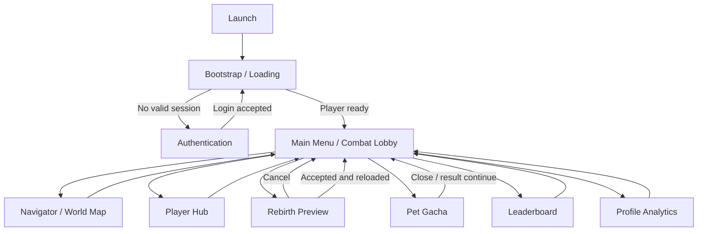
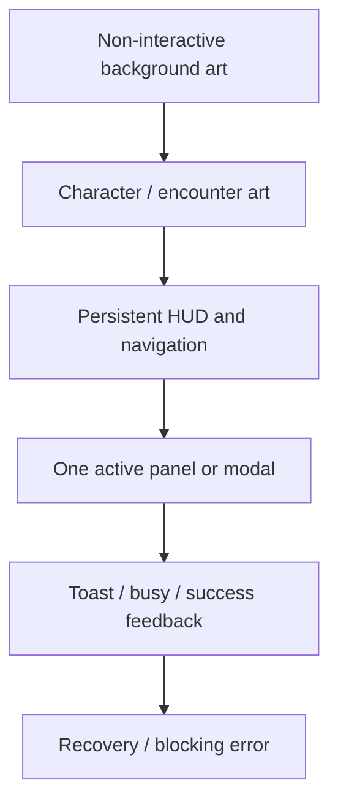
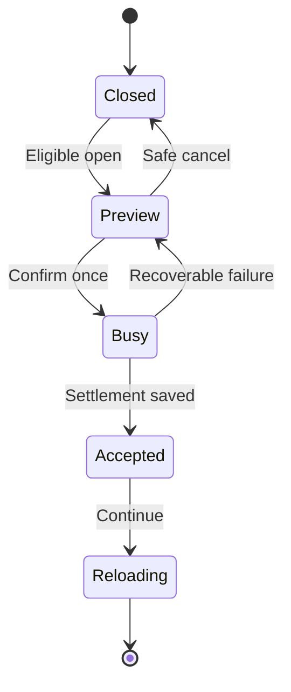

# Design Spec and Implementation Roadmap: UI Mockup Experience

> Approved by the project owner on 2026-08-26 (`lgtm`). The recommended compatibility-first decisions in Section 13 are accepted for architecture planning.

## 1. Outcome

The intended result is a polished UI migration, not a rewrite of working game systems. The player should move from sign-in to loading to the Main Menu, then open each panel with consistent navigation, readable live data, immediate input acknowledgement, and unmistakable busy/success/failure states.

Implementation should use a vertical-slice migration: establish the shared visual foundation, finish one complete scene flow, and then convert one panel at a time while retaining current controller behavior. A screen is not complete merely because it resembles the PNG; it must render every real runtime state and remain safe under repeat input, reconnect, insufficient currency, unavailable data, and modal conflicts.

> [!IMPORTANT]
> The mockup PNGs are composition references, not shippable full-screen UI assets. They contain baked text, sample values, and non-canon generated content. Live text, buttons, focus states, localization space, and data must remain native UI Toolkit elements.

## 2. Sources and Authority

Apply sources in this order:

1. `GDD_PowerMathProject.md` defines product rules and real player data.
2. Approved feature specs/ADRs define existing system behavior and authority boundaries.
3. `master-prompt-guide-art-direction.md` defines the current visual grammar.
4. Animo Gacha v10 banner/result/reveal/transition define the north-star graphic treatment.
5. Other mockups define composition only where they do not conflict with higher sources.
6. Existing controllers define current implemented capability, not final visual design.

## 3. Current-to-Target Gap Map

| Surface | Working behavior to preserve | Mockup experience to adopt | Gap or constraint |
| --- | --- | --- | --- |
| Authentication | Username, six-digit PIN, remember-device warning, busy/error/success, Enter key | Sky/world composition, centered cream card, clear primary action, settings/language icons if functional | Do not ship mockup Email or Guest actions; separate art layers are missing |
| Loading / Bootstrap | Session check, player load, recovery, retry, scene load | Full-screen narrative art, logo, strong progress/status hierarchy | Progress must represent real phases; `72%` is not a baked value |
| Main Menu / Combat Lobby | Player summary, wallet/loadout, combat, map, Hub, Gacha, Rebirth, Leaderboard, Profile, logout | Icon-first HUD, central encounter focus, compact resource/profile cards, side navigation | Must not hide required combat clarity behind decorative art |
| Navigator / World Map | Informational route modal; no progression mutation | Map icon and journey presentation | No dedicated canonical Navigator mockup exists; define before high-fidelity work |
| Player Hub | Effective ATK, pet status, Weapon Ascension preview/save | Character showcase, pet/weapon tabs, icon cards, clear selected state | Full inventory/equip flow is not currently implemented and must not be faked |
| Rebirth | Eligibility, preview, confirm, accepted state, retry/reload | Focused dimmed modal, before/after values, strong confirm hierarchy | Mockup values/icons are placeholders; show GDD KEEP/RESET details and authoritative preview |
| Pet Gacha | Exact current odds, ownership state, confirm, one 25-coin pull, recovery, new/duplicate result | Flat graphic Animo visual system, anticipation, reveal, result feedback | x10, guarantee, Details, History, and ten-card result are outside current approved behavior |
| Leaderboard | Locked cohort, manual refresh, cached/error state, pinned self, ranking rows | First-place feature, clear self row, icon-first currency/loadout display | v13 is rejected as density/art-style authority; retain only its information hierarchy |
| Profile Analytics | Rename/cooldown, progression/economy/learning/rank metrics | Friendly dashboard, visual summaries, trend/milestone language | Use actual persisted metrics only; no invented mastery/streak/focus values |

## 4. Target Player Flow

### Global navigation rules

- Only one reference/modal panel may be open at once.
- A panel may open only from a safe lobby state; committed question/result transitions retain control.
- Close returns to the exact previous lobby state and restores focus to the opener.
- Escape/Back closes a safe reference panel, but never cancels an accepted transaction.
- Confirm spam produces one action; repeat presses are ignored until the controller returns an enabled state.
- A recoverable operation keeps its transaction identity and offers Retry/Recover rather than a new purchase/reset.
- Decorative background layers never intercept pointer or navigation input.

## 5. Shared Visual and Interaction System

### Visual language

- Use the v14 cream, cyan, cobalt, restrained coral, navy, and selective warm-gold system.
- Use icons before short labels where meaning is established; retain text for ambiguous, destructive, or financially meaningful actions.
- Use broad shapes and empty space before interior detail.
- Reserve warm gold for the primary action, rare result, or currency emphasis; do not frame every panel in gold.
- Use coral for exceptional attention such as `NEW` or a clear warning, not as a second default action color.
- Keep human/Animo art, icons, and panels within the same contour, shadow, AO, and grain family.
- Encode selected, rank, rarity, success, and error with shape/icon/text as well as color.

### Reusable UI states

Every interactive surface must specify and implement:

- default;
- hover/focus;
- pressed acknowledgement;
- disabled with a visible reason where useful;
- busy/locked;
- success;
- warning;
- error/recovery;
- empty/unavailable;
- reduced motion.

### Layer model

This hierarchy keeps combat and transaction states legible while allowing the art to carry the fantasy.

## 6. Screen Specifications

### 6.1 Authentication

Player goal: enter the school-provided username and six-digit PIN with confidence, understand device-memory risk, and know whether sign-in is in progress or failed.

Required content:

- Math:World logo;
- Username field, not Email;
- six-digit numeric password/PIN field;
- Remember this device control and private-device warning;
- Sign In primary action;
- concise status/error region;
- Editor sample hint only in Editor configuration;
- language/settings icons only when their destinations exist.

Acceptance:

- Enter/Keypad Enter submits exactly once.
- Invalid PIN keeps the reason visible and returns focus appropriately.
- Busy state cannot be submitted again.
- Background remains readable but does not overpower the form.
- No Guest button or credential-derived public name appears.

### 6.2 Loading / Bootstrap

Player goal: understand that account/progress recovery is active and know what to do if it fails.

Map existing runtime states to player-facing phases:

- checking saved session;
- loading player progress;
- preparing adventure;
- entering world;
- recovery/error with Try Again;
- authentication required, followed by scene transition.

Use real phase progress or an indeterminate treatment. Never animate a fake percentage that can stall or regress without explanation.

Acceptance:

- Status text remains truthful during each bootstrap state.
- Retry is visible only when it can act.
- Error detail wraps without colliding with the progress treatment.
- Reduced motion retains phase and error clarity.

### 6.3 Main Menu / Combat Lobby

Player goal: understand the current encounter and Stage, then choose Attack or one safe meta action.

Priority order:

1. encounter, Stage, HP/rules, hearts, cooldown, Attack;
2. player identity, active Rank, currencies, and current loadout;
3. Hub, Gacha, Rebirth, Navigator, Leaderboard/Profile, Settings/Logout;
4. decorative scenery.

The mockup's central battle composition can be adopted only if all `@tag:feedback` combat signals remain glanceable. Rebirth remains visibly locked/unavailable before Stage 50, with a reason rather than a dead control.

Approved corrective composition from the annotated `Main Menu (2).jpg` reference:

- top-left Profile Analytics opener contains Display Name and icon-coded Silver/Gold/Diamond Rank Currency only;
- top-center encounter HUD contains current Stage, Enemy name/HP, and a left-to-right enemy-action sequence whose consumed steps disappear/dim and whose final slot is the enemy Attack icon;
- top-right Navigator contains exactly three icon controls: Biome, Leaderboard, and Settings;
- center-left Player Menu can collapse and contains Player Hub, Pet Gacha, Rebirth, current Power Coins, and current ATK;
- bottom Player Dashboard contains hearts/HP, current Rank, equipped Pet and Weapon, and visibly unavailable card-shaped Power-up slots until that system exists;
- biome background and enemy presentation remain scene Canvas `GameObject` images; UI Toolkit owns only HUD and modal UI;
- remove marketing copy, duplicate summary cards, decorative full-screen UI backgrounds, and other placeholder boxes.

### 6.4 Navigator / World Map

Until another definition is approved, Navigator is a read-only journey map opened from the map-pin icon. It shows current Stage/biome, completed route, current marker, upcoming protected boss landmarks, and Back to Battle. It does not allow teleporting, encounter rerolling, or Stage selection.

High-fidelity art work for this screen is blocked until a canonical mockup or explicit approval of this interpretation.

### 6.5 Player Hub

First approved slice:

- character/loadout showcase;
- Pet Status tab or card;
- Weapon Ascension tab with current/next stats, price, balance, disabled reason, busy, success, and failure;
- live effective ATK breakdown and Legacy bonus;
- selected/equipped state only where it reflects saved loadout data.

Do not present unequipped pets/weapons as selectable unless an authoritative equip command and persistence flow are approved. A visual inventory with dead cards would reduce Response and Clarity.

### 6.6 Rebirth

State sequence:

Preview must show:

- Stage reached;
- Power Coin before, gain, and after;
- Legacy ATK before, gain, and after;
- Prestige/Honor before and after for Rebirth;
- explicit RESET and KEEP summaries;
- eligibility or blocking reason;
- non-ambiguous confirmation.

Use visual and audio acknowledgement for accepted settlement. The player must never infer success from animation before the save is accepted.

### 6.7 Pet Gacha

#### Slice A — approved behavior parity

- Flat v10-style banner and current balance.
- One `x1 / 25` action.
- Current calculated rarity/pet probabilities and owned state available before confirmation.
- Confirmation, locked commit, recovery, reveal, and result.
- Result clearly distinguishes `NEW` from `DUPLICATE — NO PET CHANGES`.
- Reduced-motion crossfade preserves result and rarity information.

#### Slice B — separate future feature

x10, ten capsules/cards, “3★+ within 10,” Details rules, History, Share, and Repeat-x10 require a new task card because they change transaction, guarantee, data, and recovery behavior. Until approved, remove or visibly omit those mockup controls rather than disabling unexplained promises.

### 6.8 Leaderboard

Player goal: compare progress with the authenticated cohort, understand ranking, and find personal standing quickly.

Required hierarchy:

- locked Grade/Level cohort and ranking explanation;
- update time and manual Refresh;
- pinned green `YOUR STANDING · YOU` row;
- top-three rank silhouettes and first-place feature treatment;
- scrollable remaining rows;
- Best Stage before weighted currency and Total Damage;
- avatar, pet, and weapon resolved through approved content, with safe fallbacks.

Retain last valid cached standings during a refresh failure and label them as saved/stale. Never imply polling.

### 6.9 Profile Analytics

Player goal: understand personal adventure and learning progress without exposure of hidden audit state.

First layout groups:

- identity: avatar, Display Name, cohort, active Rank, rename availability;
- adventure: Current/Best Stage, Prestige/Honor, Stage 200 milestone, Total Damage;
- economy/loadout: rank currencies, Power Coins, equipped pet/weapon/avatar;
- learning: questions, accuracy, response score/time, response efficiency, by-Rank and by-question summaries;
- history: supported rank-change/question-cycle milestones and recorded play time.

Charts must have text equivalents and honest empty states. Do not calculate “Mastery,” “Streak,” “Focus Next,” or registration data unless a documented persisted definition exists.

## 7. Experience Evaluation

| Component | Target response | Acceptance signal |
| --- | --- | --- |
| Clarity | Stable hierarchy, real data labels, explicit disabled/busy/error reasons, redundant rank/rarity/state cues | A new player identifies the primary action and explains the last outcome in 8/10 observed tasks |
| Motivation | Current Stage, progress, permanent rewards, loadout, and social standing remain visible at decision points | Players can state what progress is gained or preserved before confirming Gacha/Rebirth |
| Response | Immediate pressed/focus state, one action per confirm, predictable Back/Close, focus restoration | Stress input creates no duplicate purchase, reset, refresh, login, or upgrade |
| Satisfaction | Significant success uses visual motion plus an audio hook, scaled to importance | Players distinguish normal navigation, saved upgrade, rare/new result, and Rebirth without reading log text |
| Fit | One shape-driven Math:World visual grammar across scenes and panels | Side-by-side screens appear to belong to one product even when character art is hidden |

Conflict priority remains Response, Clarity, Satisfaction, Fit, then Motivation.

## 8. Starting Motion and Feedback Values

These are starting values with tests, not final standards.

| Event | Starting value | Test and adjustment |
| --- | ---: | --- |
| Button press acknowledgement | 0.10 s | Pass if 9/10 users notice the selected action before a transition. Strengthen scale/color response before increasing duration. |
| Reference panel open | 0.20 s | Pass if the panel feels immediate and no controls become interactive before visible. Reduce by 0.05 s if repeated navigation feels slow. |
| Reference panel close | 0.15 s | Pass if return feels faster than entry and focus restores correctly. Remove motion in reduced-motion mode. |
| Toast | 2.0 s minimum, persistent for blocking errors | Pass if observers can repeat the message. Increase only non-blocking duration in 0.5 s steps if missed. |
| Gacha transition | 1.50 s | Use the existing approved sequence test: identify quantity and rarity cue in 8/10 trials. For x1 parity, quantity remains one. |
| Rare/new reveal minimum | 1.20 s | Pass if Animo, rarity, and NEW/duplicate state are identified in 8/10 trials. Adjust input unlock by 0.10 s steps. |

No transaction result waits on animation. Animation presents an already accepted result.

## 9. Delivery Roadmap

### Phase 0 — Approval and asset inventory

Deliverables:

- resolve the six task-card decisions;
- label every mockup element as live UI, reusable art, non-canon placeholder, or unsupported feature;
- identify separate approved backgrounds, characters, portraits, Animo, icons, logo, font, and audio sources;
- approve the design spec, then write the architecture plan.

Exit gate: no unsupported mockup control remains ambiguous, and the asset source/rights for the first slice are known.

### Phase 1 — UI foundation vertical slice

Target sequence: Authentication → Bootstrap → Main Menu shell.

Deliverables:

- shared tokens and reusable control/panel classes;
- responsive safe-area and aspect-ratio rules;
- focus, pointer, keyboard, Back/Escape, modal, toast, and reduced-motion behavior;
- preserve or deliberately migrate stable element bindings;
- first complete visual slice using live data and all error/busy states.

Exit gate: the player can launch, sign in, load, and reach the lobby with no regression and one coherent visual language.

### Phase 2 — Main Menu and Navigator

Deliverables:

- encounter-first lobby composition;
- icon-driven meta navigation with labels/tooltips where needed;
- current player, Stage, Rank, wallet, loadout, HP, cooldown, and combat signals;
- informational World Map/Navigator treatment after its design decision;
- single-modal arbitration and focus restoration.

Exit gate: Attack and every safe meta destination are discoverable, and opening/closing panels never mutates combat state.

### Phase 3 — Player Hub and Rebirth

Deliverables:

- Hub character/loadout shell with implemented Pet Status and Weapon Ascension;
- all upgrade affordability, busy, success, and error states;
- Rebirth preview/busy/failure/accepted/reload states;
- explicit KEEP/RESET communication and visual/audio acceptance feedback.

Exit gate: upgrades and settlement still resolve once, and players can explain all before/after values.

### Phase 4 — Pet Gacha x1 experience

Deliverables:

- v10 flat graphic banner adapted to x1 behavior;
- probabilities/owned states before confirmation;
- commit lock, recovery, reveal, result, new/duplicate treatment;
- reduced-motion and missing-art fallbacks.

Exit gate: one accepted transaction spends 25 once, never reveals an unsaved result, and omits all unapproved x10/guarantee/history promises.

### Phase 5 — Leaderboard and Profile Analytics

Deliverables:

- responsive Leaderboard hierarchy with manual refresh/cache/error states;
- reusable row visuals and resolved content icons;
- Profile Analytics groups/charts/text equivalents and rename cooldown states;
- public/private data boundary regression checks.

Exit gate: no private analytic/credential field enters Leaderboard views, and no hidden audit value enters the student Profile view.

### Phase 6 — Cross-screen polish and release candidate

Deliverables:

- final audio hooks, animation curves, rare/success tiers, reduced-motion substitutions;
- aspect-ratio, keyboard/focus, localization-space, missing-asset, offline, and low-frame-rate passes;
- screenshot matrix and human playtest report;
- performance/profile pass with large background and list views;
- DevLog, review, and final human checkpoint.

Exit gate: every screen meets its acceptance checks and no known blocker is hidden by presentation.

## 10. Validation Matrix

### Automated checks

- UXML contract tests: every required named element binds once.
- View-model formatting tests: long names, zero/large currencies, missing loadout, Stage 1/50/200, unavailable analytics.
- State tests: Ready, Busy, Success, Recoverable Error, Empty/Unavailable, Reduced Motion.
- Input stress: double click, Enter plus click, Escape during busy, repeated Refresh, Gacha/Rebirth/Upgrade confirmation spam.
- Existing authentication, combat, gacha, run-settlement, leaderboard, and analytics logic tests remain green.

### Human visual matrix

Starting matrix pending platform approval:

- reference 16:9;
- minimum supported window;
- 16:10;
- ultrawide;
- high-DPI scaling;
- keyboard-only focus order;
- reduced motion;
- color-deficiency/readability check;
- long localized-like strings at approximately 30% expansion;
- offline/retry and missing-content fallbacks.

### Required playtests

1. New player: sign in, identify Attack and all meta destinations, inspect Gacha odds, and explain Rebirth preservation without instruction.
2. Stress: spam every confirm/close/back path; no duplicate authoritative action occurs.
3. Readability: an observer explains the last success/failure and current blocking reason in 8/10 tasks.
4. Recovery: disconnect or force failures during login, bootstrap, upgrade, Gacha, Rebirth, and leaderboard refresh.
5. Accessibility: complete the non-combat navigation with keyboard only and reduced motion enabled.

## 11. Risks and Controls

| Risk | Control |
| --- | --- |
| Flattened mockup used as live UI | Use it only as a temporary non-interactive background; recreate controls/text natively |
| Generated placeholder becomes canon | Maintain an asset approval manifest; catalogs remain the identity source |
| Giant UXML/USS becomes more brittle | Architecture phase must define screen templates/styles and migration boundaries before edits |
| Existing controller names break | Preserve binding IDs per slice or update view/controller/test in the same reviewed change |
| Modal overlap or combat interruption | One coordinator owns open/close eligibility and focus; transaction controllers own busy locks |
| Mockup promises unsupported behavior | Remove x10/guarantee/history/equip/guest actions until separate approval |
| Art hides educational/combat information | Enforce hierarchy and observer readability tests before adding spectacle |
| Large art harms memory/load time | Import settings, resolution tiers, atlasing, and profiling are architecture/QA acceptance items |
| Profile leaks hidden/private data | Bind from explicit owner-safe view models and regression-test field boundaries |
| Scope becomes a single risky rewrite | Deliver independent vertical slices with human visual approval after each group |

## 12. Definition of Done

- [x] Human has approved this design and the task-card decisions on 2026-08-26 (`lgtm`).
- [ ] Approved architecture plan defines file/template/view/presenter/asset boundaries.
- [ ] Every surface uses live canonical data and handles all runtime states.
- [ ] No mockup-only system behavior has been introduced.
- [ ] Significant actions use at least visual and audio feedback, with reduced-motion alternatives.
- [ ] Keyboard focus, Back/Close, modal arbitration, and safe-area behavior are verified.
- [ ] Automated binding/state tests and existing regression tests pass.
- [ ] Human new-player, stress, recovery, readability, and visual-parity tests pass.
- [ ] Final art/content has explicit human approval.
- [ ] DevLog and review artifacts exist; merge/publishing remains a human action.

## 13. Human Design Checkpoint — Approved

Approve or request changes to:

1. The compatibility-first migration strategy.
2. Authentication composition only, retaining Username/PIN and excluding Guest.
3. Navigator as the current informational World Map unless separately defined.
4. Player Hub Phase 1 as Weapon Ascension plus Pet Status, not new inventory/equip behavior.
5. Pet Gacha Phase 1 as a polished x1/25 flow, excluding x10/guarantee/history.
6. The v14 flat graphic system as the shared visual language, with scene art used selectively.
7. The phased delivery and human review gate after each screen group.

Approved by the project owner on 2026-08-26 (`lgtm`). The next artifact is `ui-mockup-experience-arch-plan.md`. No UI implementation should begin before that architecture checkpoint.
