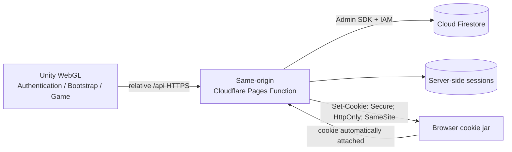

# Architecture Plan: Unity-Owned Custom Authentication

> **Superseded:** Replaced by ADR-003 and `direct-firestore-auth-task-card.md` on 2026-08-09.

## Pre-Refactor Implementation

- `BootstrapScene` waits for a JavaScript launch code and exchanges it through `GameApiClient`.
- `WebGlSessionHandoff` and `PowerMathWebBridge.jslib` connect the host page to Unity.
- `PlayerSessionStore`, `PlayerSnapshot`, and Main Menu data binding are usable migration seams.
- The misspelled `AutheticationScene` was outside the build flow and contained mixed UI Toolkit/uGUI prototype content.
- The Editor sample automatically bypasses authentication from Bootstrap.

## Target Architecture



> [!WARNING]
> The target is not direct Firestore access from Unity. Firebase documents client-side Firestore security around Firebase Authentication; without it, custom student authorization must be enforced by a trusted server. A service-account key or unrestricted Firestore rule must never be shipped in WebGL.

## Recommended Hosting Deployment

| Host | Same-origin API | Firestore connection | Decision |
|---|---|---|---|
| **Cloudflare Pages** | Pages Function/Worker routed at `/api/**` | Firestore REST using a service-account OAuth token held only in Worker secrets; validate any Admin SDK alternative under Workers Node compatibility | **Selected. Requires an early runtime/CPU spike.** |
| Netlify | Netlify Function routed at `/api/**` | Node function with Firebase Admin SDK and environment secrets | Unselected fallback. |

- Unity calls relative URLs such as `/api/v1/auth/login`; no environment-specific domain is embedded in gameplay code.
- The host function keeps Firebase service credentials in its encrypted environment/secrets configuration.
- `_routes.json` invokes Functions only for `/api/*`; Unity static build/assets remain static requests.
- The Worker route is configured fail-closed because authentication and game commands are security-critical.
- Workers Free currently allows 100,000 requests per day and 10 ms CPU per invocation; quota exhaustion must show a recoverable service-unavailable state rather than bypassing authorization.
- Firestore Standard currently includes 50,000 document reads/day, 20,000 writes/day, 20,000 deletes/day, 1 GiB stored data, and 10 GiB monthly outbound transfer for one database; the Spark plan shuts the product off instead of charging beyond its allowed no-cost quota.
- Firestore client rules deny direct student account/player writes; server IAM controls API access.
- App Check may be added as defense in depth, but it does not replace student authentication or authorization.

## Session Restoration

1. `POST /api/v1/auth/login` receives `rememberDevice`, verifies the custom account record, and returns `Set-Cookie`.
2. Cookie stores only a random opaque session ID with `Secure`, `HttpOnly`, `SameSite`, and `Path=/` protections.
3. Firestore stores only a hash of that session ID with player ID, expiry, last-seen, and revocation state.
4. Browser automatically retains the cookie across page refresh; Unity never reads or persists it.
5. `GET /api/v1/game/bootstrap` resolves the cookie and returns the versioned player snapshot plus a CSRF token.
6. When Remember This Device is unchecked, the cookie has no persistent expiry and ends with the browser session.
7. When checked, the cookie receives a configurable expiry and survives browser close until expiry or server revocation.
8. Neither mode stores username/access code, a session token, or a Firestore credential in Unity, `PlayerPrefs`, or Web Storage.

## REST Contract

| Method | Path | Purpose |
|---|---|---|
| `POST` | `/api/v1/auth/login` | Verify username/access code and `rememberDevice`, then rotate/create session cookie. |
| `POST` | `/api/v1/auth/logout` | Revoke server session and expire cookie. |
| `GET` | `/api/v1/game/bootstrap` | Restore session and return schema-versioned player snapshot. |
| `POST` | `/api/v1/game/commands/{type}` | Submit idempotent authoritative game command with revision and CSRF token. |

Login returns a generic invalid-credentials response. Bootstrap returns `401` only for absent/expired sessions; transport failures use separate recoverable errors.

## Implemented Firestore Ownership Contract

```text
accounts/{sha256(normalizedUsername)}
  playerId
  accessCodeHmac
  status

players/{playerId}
  revision
  profile
  progression
  wallet
  loadout
  activeRun

players/{playerId}/inventory/{itemId}
  owned
  upgradeLevel

sessions/{sessionIdHash}
  playerId
  createdAt
  lastSeenAt
  expiresAt
  revokedAt

commandReceipts/{transactionId}
  playerId
  commandType
  resultRevision
```

Generated access codes use HMAC-SHA256 with a Worker-only secret and Web Crypto verification. State-changing commands use Firestore transactions, a unique transaction ID, and expected revision to preserve the GDD server-authority rules.

### Generated Credential Decision

| Credential type | Verification | Trade-off |
|---|---|---|
| Six-digit PIN or human password | Adaptive password hash plus strict per-account and per-source throttling | Familiar input, but low entropy and may exceed the Workers Free CPU budget. |
| Long randomly generated access code | HMAC with a Worker secret plus Web Crypto verification | **Selected** for paid/generated accounts; fast under Workers Web Crypto, but the code must contain enough random entropy and be reissuable operationally. |

HMAC-only verification remains unacceptable for a six-digit PIN. The implementation therefore requires generated access codes containing at least 12 normalized characters and applies a Cloudflare rate-limit binding before any Firestore account lookup.

## Unity Modules

| Module | Responsibility |
|---|---|
| `AuthenticationView` | UI Toolkit fields, submit state, generic error display, access-code clearing. |
| `AuthenticationPresenter` | Coordinates login intent; contains no transport or credential-storage logic. |
| `IAuthenticationService` | Login/logout abstraction for REST and Editor mock implementations. |
| `RestAuthenticationService` | Calls same-origin auth endpoints. |
| `EditorMockAuthenticationService` | `UNITY_EDITOR` sample login with no Firestore or elevated role. |
| `IPlayerBootstrapService` | Restores the browser session and retrieves the snapshot. |
| `RestPlayerBootstrapService` | Calls `/game/bootstrap`; relies on the browser cookie. |
| `BootstrapCoordinator` | Startup, post-login, recovery, resume routing, and scene-transition loading. |
| `SceneTransitionRequestStore` | Holds an in-memory requested destination across the Bootstrap loading scene. |
| `PlayerSessionStore` | Keeps the validated current snapshot and CSRF token in memory. |
| `IGameCommandGateway` | Sends authoritative idempotent commands. |
| `EditorMockGameCommandGateway` | Simulates commands in Editor without weakening production code. |

## Target Scene Order

| Index | Scene | Role |
|---:|---|---|
| 0 | `BootstrapScene` | Startup session check and generic transition loading. |
| 1 | `AuthenticationScene` | Custom Unity login UI. |
| 2 | `MainMenuScene` | First hydrated game scene. |

`AutheticationScene` and its matching UI asset were renamed after reference inspection; their Unity GUIDs were preserved.

## Keep, Replace, and Retire

| Existing asset | Action |
|---|---|
| `PlayerSnapshot` | Keep; version the REST projection. |
| `PlayerSessionStore` | Keep; remove exposed access-token ownership and add in-memory CSRF/session mode. |
| Main Menu presenter/view | Keep. |
| Bootstrap UI/state | Keep and generalize. |
| `GameApiSettings` | Replace launch-code path with same-origin API root and scene names. |
| `GameApiClient.ExchangeSession` | Replace with login/bootstrap/command clients. |
| `WebGlSessionHandoff` | Retire after WebGL E2E passes. |
| `PowerMathWebBridge.jslib` launch-code events | Retire after cookie spike passes. |
| Editor sample auto-bypass | Replace with Editor mock authentication and command gateways. |
| ADR-001 | Mark superseded only when ADR-002 is accepted. |

## Incremental Migration

1. **Backend spike:** Cloudflare Pages Function + Firestore `/login` + `/bootstrap` persistent-cookie roundtrip; measure CPU and request count before Unity refactoring.
2. **Contract:** Freeze response DTO, cookie policy, errors, CSRF strategy, and Firestore mappings.
3. **Unity transport:** Add authentication/bootstrap interfaces while leaving launch-code flow operational.
4. **Authentication scene:** Consolidate the existing prototype onto UI Toolkit and add presenter/service bindings.
5. **Bootstrap refactor:** Add startup session restore, post-login hydration, network recovery, and resume routing.
6. **Editor development:** Route sample credentials and gameplay commands through Editor-only mock services.
7. **Build-flow checkpoint:** Set Bootstrap -> Authentication -> Main Menu after human approval.
8. **WebGL E2E:** Validate refresh, logout, expiry, shared-device behavior, committed-attempt recovery, and duplicate commands.
9. **Cutover:** Remove launch-code bridge/code and mark ADR-001 superseded.

No launch-code file should be deleted before phase 8 passes.

## Required Human Decisions

1. What remembered-session expiry does the school/device policy permit?
2. Who owns account provisioning, credential reissue, stolen-device revocation, and compromised-account support?

## Source Guidance

- [Cloudflare Pages Functions](https://developers.cloudflare.com/pages/functions/)
- [Cloudflare Pages Functions routing](https://developers.cloudflare.com/pages/functions/routing/)
- [Cloudflare Workers pricing](https://developers.cloudflare.com/workers/platform/pricing/)
- [Cloudflare Workers limits](https://developers.cloudflare.com/workers/platform/limits/)
- [Cloudflare Worker secrets](https://developers.cloudflare.com/workers/configuration/secrets/)
- [Cloudflare Web Crypto](https://developers.cloudflare.com/workers/runtime-apis/web-crypto/)
- [Firestore pricing and free quota](https://firebase.google.com/docs/firestore/pricing)
- [Firebase Spark and Blaze plans](https://firebase.google.com/docs/projects/billing/firebase-pricing-plans)
- [Firestore security overview](https://firebase.google.com/docs/firestore/security/overview)
- [OWASP session management](https://cheatsheetseries.owasp.org/cheatsheets/Session_Management_Cheat_Sheet.html)
- [OWASP password storage](https://cheatsheetseries.owasp.org/cheatsheets/Password_Storage_Cheat_Sheet.html)
