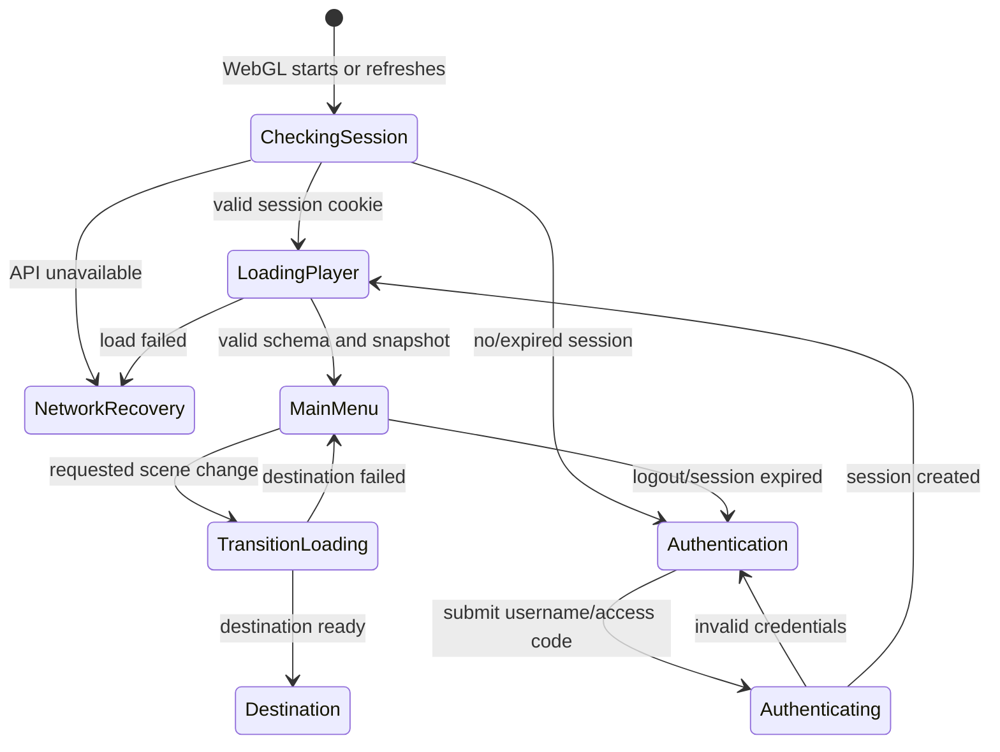

# Design Spec: Unity-Owned Custom Authentication

> **Superseded:** Replaced by ADR-003 and `direct-firestore-auth-task-card.md` on 2026-08-09.

## Player Goal and Context

A student opens the PowerMath WebGL page, signs in inside Unity when necessary, and reaches their authoritative game state with clear loading and recovery feedback. A normal page refresh must not ask for credentials again while the browser session remains valid.

## Assumptions

> [!NOTE]
> **ASSUMPTION:** The WebGL files and `/api/**` host function can be served from one HTTPS Cloudflare Pages origin.
> **IMPACT:** Browser cookies work without cross-site credential/CORS complexity.
> **IF WRONG:** Cross-origin cookies require stricter CORS and `SameSite=None`, increasing implementation and security risk.
> **VALIDATE:** Deploy a minimal login/session cookie spike before Unity refactoring.

> [!NOTE]
> **ASSUMPTION:** Expected API traffic remains inside the Cloudflare Workers Free daily request and CPU limits.
> **IMPACT:** Hosting can remain zero-charge while under quota.
> **IF WRONG:** API requests fail closed until quota reset or the project deliberately moves to a paid plan.
> **VALIDATE:** Measure requests per active student and Worker CPU time during the backend spike.

> [!NOTE]
> **ASSUMPTION:** Students can explicitly select Remember This Device when the device is not shared.
> **IMPACT:** The server may issue a persistent but revocable cookie that survives browser close.
> **IF WRONG:** Remember This Device must be disabled globally for shared school devices.
> **VALIDATE:** Confirm the label and device-sharing warning with the project owner/school.

## Interaction Flow

## System Rules

- Bootstrap is build index 0 and decides between session restoration, Authentication, Main Menu, and later scene transitions.
- Authentication never determines identity locally; it only collects credentials and displays the REST result.
- Invalid username and invalid access code use the same player-facing failure message.
- Network failure is distinct from invalid credentials.
- Successful login clears access-code field memory before leaving Authentication.
- Refresh uses the browser session cookie and authoritative active-run data to restore safely.
- Remember This Device is opt-in, never preselected, and stores no username/access code in browser storage.
- A remembered session can be revoked server-side by logout, expiry, access-code reissue, or account disablement.
- Logout clears the browser session, in-memory player state, and any pending scene transition.
- Main Menu never receives anonymous or partially hydrated data.

## Five-Component Evaluation

| Component | Requirement |
|---|---|
| Clarity | Distinguish checking session, signing in, loading progress, offline recovery, and expired session. |
| Motivation | Successful restoration returns the student to their saved progression without repeated friction. |
| Response | Submit disables only while a request is active; retry and logout have deterministic results. |
| Satisfaction | Successful login uses visual confirmation plus transition audio before Bootstrap loading. |
| Fit | Authentication and loading retain the existing PowerMath UI Toolkit visual language. |

## Risks and Abuse Cases

- Brute-force and credential-stuffing attempts require server-side throttling.
- The existing six-digit PIN has a small search space and must not be treated as a high-entropy generated access code.
- Long generated access codes are verified with a Worker-only HMAC secret and are never stored as plaintext or reversible encryption.
- Browser storage must not contain access codes, session IDs, refresh tokens, or full private snapshots.
- Session fixation is prevented by rotating the session identifier after successful login.
- Remembered sessions create a stolen-device risk and therefore require clear logout/revocation behavior.
- Cookie-authenticated state-changing requests require CSRF protection.
- A valid cookie never authorizes access to another player ID supplied by the client.
- Refresh during a committed attempt returns the same authoritative attempt/result and never rerolls it.
- A network outage does not clear a valid local session state or falsely report bad credentials.

## Playtest Scenarios

- New player: identify username, access code, submit, error, and loading states without explanation.
- Refresh: refresh from Main Menu and each committed-question phase; confirm no duplicate outcomes.
- Recovery: disconnect during login, bootstrap, and scene transition; confirm correct retry location.
- Abuse: repeated submit, guessed player IDs, replayed command IDs, and stale revisions.
- Shared device: logout, refresh, and browser-close behavior match the approved school policy.

## Tuning Priority

1. Input response and unambiguous error states.
2. Refresh/session reliability.
3. Loading feedback and transition polish.
4. Remember This Device wording, expiry policy, and shared-device warning.
