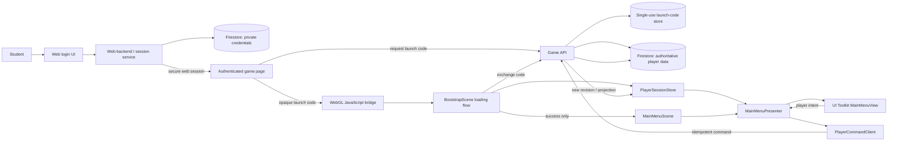
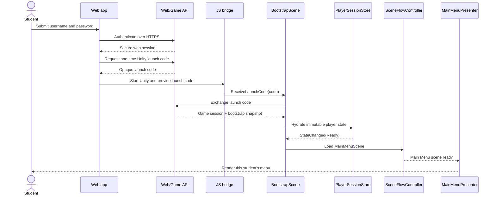

# Web-to-Unity Player Data Architecture Plan

| Field | Value |
|---|---|
| Status | **Approved — implementation not started** |
| Date | 2026-08-08 |
| Scope | Web authentication handoff, Unity session bootstrap, player data, save commands, UI Toolkit Main Menu |
| GDD references | `@tag:stage-progression`, `@tag:economy`, `@tag:leaderboard-profile`, `@tag:server-authority`, `@tag:player-experience`, `@tag:guardrails` |
| Related ADR | `Docs_PowerMath/3_Outputs/ADRs/001-web-unity-session-and-player-data-boundary.md` |

> [!IMPORTANT]
> This is **target architecture**, not completed implementation. Currently there is no project-owned player-data service, `AutheticationScene` is the only enabled build scene, and `MainMenuUI.uxml` contains hard-coded prototype values.

> [!NOTE]
> Architecture approval confirms that `BootstrapScene` must exist as the loading and initialization scene. `MainMenuScene` must not load until the session exchange succeeds and the authoritative player snapshot is validated and stored.

## 1. Player Goal and Context

The student signs in once on the containing web app, opens Unity without entering credentials again, and sees their own profile, stage, progression, inventory, wallet, and equipped items. Loading, reconnecting, and expired-session states must be understandable and recoverable.

### Documented constraints

- Authentication uses the web app's Firestore-backed account database, intentionally without Firebase Authentication.
- The GDD makes the server authoritative for gameplay, currencies, inventory-affecting actions, progression, and saving.
- Private educational analytics must not be exposed through public profile data.
- Critical game state must not use `PlayerPrefs`.

### Assumptions requiring validation

**ASSUMPTION:** The Unity game is a WebGL build embedded in or opened by the authenticated web app.

**IMPACT:** A JavaScript `.jslib` bridge and the Unity instance's `SendMessage` entry point can deliver an opaque launch code.

**IF WRONG:** Native/mobile builds need a separate deep-link or platform handoff adapter.

**VALIDATE:** Confirm the launch platform and whether Unity and the web app share the same origin.

**ASSUMPTION:** A trusted web backend can access Firestore and expose game-specific HTTPS endpoints.

**IMPACT:** Firestore remains the database while neither browser JavaScript nor Unity reads credential records or authoritative saves directly.

**IF WRONG:** Direct client access cannot securely establish player identity without another trusted authority.

**VALIDATE:** Identify the existing backend/runtime and session mechanism.

## 2. Architecture Decisions

| Decision | Choice | Rationale |
|---|---|---|
| Authentication owner | Web application/backend | Unity never receives usernames or passwords. |
| Unity handoff | Opaque, single-use launch code | Limits credential exposure in scripts, logs, URLs, and Unity memory. |
| Session exchange | Unity exchanges the launch code with the game API | The API verifies identity and returns a game-scoped session and bootstrap projection. |
| Firestore access | Backend/game API only for authoritative data | Preserves server authority and avoids trusting a modifiable client. |
| Unity state owner | Persistent `PlayerSessionStore` | One read-only source of truth for scene presenters. |
| Save model | Domain commands with transaction IDs and expected revisions | Supports idempotency, conflict detection, auditability, and reconnect rules. |
| Scene wiring | `BootstrapScene` is build index 0 and gates `MainMenuScene` | The menu cannot render stale, anonymous, or partially loaded player data. |
| UI binding | Presenter plus immutable view model | UI renders state and emits intent; it never defines authoritative state. |
| Local persistence | Non-critical preferences only | Tokens and critical progress are not stored in `PlayerPrefs`. |

> [!WARNING]
> If browser code currently reads a plaintext password or password-comparable value from Firestore, that flow must not be reused. Credential lookup and password-hash verification belong in trusted backend code, and credential documents must be unreadable to clients.

## 3. System Diagram



### Trust boundary

```text
Untrusted: browser UI, page JavaScript, WebGL memory, Unity scenes, UI events
Trusted: web backend, game API, password verifier, Firestore server access
```

Unity may display authoritative results but never decides balances, ownership, stage changes, rewards, or save revisions.

## 4. End-to-End Flow



### Bootstrap response shape

```json
{
  "schemaVersion": 1,
  "session": {
    "accessToken": "opaque-or-signed-game-token",
    "expiresAtUtc": "server-issued timestamp"
  },
  "player": {
    "playerId": "stable-non-username-id",
    "revision": 42,
    "profile": {},
    "progression": {},
    "wallet": {},
    "inventory": [],
    "loadout": {},
    "activeRun": {}
  },
  "serverTimeUtc": "server-issued timestamp"
}
```

The token is never placed in a URL, scene asset, log message, `PlayerPrefs`, or serialized Unity object. Exact token format and expiry remain backend decisions.

## 5. Module Boundaries

```text
Assets/Project/Script/
├── Bootstrap/
├── WebBridge/
├── Session/
├── Transport/
├── PlayerData/
├── Saving/
└── UI/MainMenu/
```

| Module | Responsibility | Depends on | Owned state |
|---|---|---|---|
| `Bootstrap` | Own `BootstrapScene`, compose services, drive loading, and gate the first content scene | Interfaces only | Startup and scene-transition state |
| `WebBridge` | Receive host messages and request host actions | Browser adapter | Pending handoff only |
| `Session` | Exchange/revoke/refresh the game session | Transport, clock | In-memory session |
| `Transport` | HTTPS serialization, headers, cancellation, normalized errors | `UnityWebRequest` adapter | No gameplay state |
| `PlayerData` | Parse/version bootstrap and expose immutable player state | Session, transport | Snapshot plus revision |
| `Saving` | Submit domain commands and reconcile results | PlayerData, transport | Pending command metadata |
| `UI/MainMenu` | Map player state to view model and bind UI Toolkit | Read-only store | Disposable bindings only |
| `Observability` | Correlation IDs and redacted diagnostics | Logger | No secrets/player payloads |

### Class responsibilities

| Class | Responsibility | Depends on | Owned state |
|---|---|---|---|
| `GameBootstrapper` | Run startup state machine and scene transition | Handoff, bootstrap service, scene loader | Startup state |
| `SceneFlowController` | Load `MainMenuScene` once after bootstrap success and report load completion/failure | Scene loading adapter | Active transition only |
| `WebGlSessionHandoff` | Accept a host launch code once | Host bridge | Pending code |
| `EditorSessionHandoff` | Supply safe local test fixtures in development | Fixture provider | Pending test code |
| `GameSessionService` | Exchange/revoke/refresh game sessions | Game API client | In-memory session |
| `PlayerBootstrapService` | Load and validate the player projection | Session, API client | None after hydration |
| `PlayerSessionStore` | Publish immutable snapshots and lifecycle state | None | Snapshot, revision, status |
| `PlayerCommandClient` | Send command envelopes and apply results | API client, store | Pending command IDs |
| `MainMenuPresenter` | Map store state to `MainMenuViewModel` | Store, view | Subscriptions |
| `MainMenuView` | Render named UI elements and raise intent | `UIDocument` | Visual references |

## 6. Interface Definitions

These signatures define seams; they are not completed implementation code.

```csharp
public interface IHostSessionHandoff
{
    event Action<string> LaunchCodeReceived;
    void RequestReauthentication();
}

public interface IGameSessionService
{
    SessionStatus Status { get; }
    Task<GameSession> ExchangeAsync(string launchCode, CancellationToken cancellationToken);
    Task RevokeAsync(CancellationToken cancellationToken);
}

public interface IPlayerBootstrapService
{
    Task<PlayerSnapshot> LoadAsync(GameSession session, CancellationToken cancellationToken);
}

public interface ISceneFlowController
{
    Task LoadMainMenuAsync(CancellationToken cancellationToken);
}

public interface IReadOnlyPlayerSession
{
    PlayerSessionStatus Status { get; }
    PlayerSnapshot Snapshot { get; }
    event Action<PlayerSessionChanged> Changed;
}

public interface IPlayerCommandClient
{
    Task<CommandResult> ExecuteAsync(
        PlayerCommand command,
        long expectedRevision,
        CancellationToken cancellationToken);
}

public interface IMainMenuView
{
    event Action RetryRequested;
    event Action LogoutRequested;
    void Render(MainMenuViewModel model);
}
```

Use the project's selected async approach consistently. Do not add a dependency until the architecture/dependency checkpoint is approved.

## 7. Player Data Model

`PlayerSnapshot` is an immutable game projection, not a mirror of Firestore documents:

| Slice | Example fields | Visibility |
|---|---|---|
| `Profile` | stable player ID, display name, grade band, icon reference | Owner; selected fields public |
| `Progression` | current/highest stage, rank progress, prestige, Stage 200 flag | Owner; selected fields public |
| `Wallet` | rank currencies, Power Coins | Private to owner |
| `Inventory` | owned item IDs, upgrade levels, acquisition state | Private; equipped ownership can be public |
| `Loadout` | equipped pet, weapon, avatar | Owner and public profile projection |
| `ActiveRun` | run ID, stage, committed attempt summary, run currencies | Private and authoritative |
| `Revision` | monotonic concurrency token | Private transport metadata |

Password material, audit statistics, answer/response history, and unrestricted educational analytics never enter this projection.

### Logical Firestore boundary

Exact paths need backend-owner review, but responsibilities should remain separate:

```text
privateCredentials/{accountId}      server-only authentication material
players/{playerId}                  stable identity linkage and schema metadata
players/{playerId}/state/*          authoritative private game state
publicProfiles/{playerId}           explicitly allow-listed public projection
commandReceipts/{transactionId}     idempotency/audit result
launchCodes/{hashedCode}            single-use handoff record
```

The API aggregates documents into a versioned Unity projection. Unity must not depend on Firestore collection paths.

### Write contract

Unity sends intent, not an edited save file:

```json
{
  "commandId": "unique-client-generated-id",
  "expectedRevision": 42,
  "commandType": "EquipItem",
  "payload": { "itemId": "item-definition-id", "slot": "Weapon" }
}
```

The server authenticates, validates ownership/rules, commits atomically, records the command ID, and returns the resulting revision and projection change. A retry with the same `commandId` returns the same result.

## 8. Startup State Machine

| State | Entry | Exit | Recovery | UI signal |
|---|---|---|---|---|
| `WaitingForHost` | Bootstrap starts | Code received | Ask host to relaunch | “Connecting to your account…” |
| `ExchangingSession` | Code accepted | Session returned | Reject duplicate/used code | Loading spinner |
| `LoadingPlayer` | Session valid | Snapshot validates | Retry transient failures | “Loading your progress…” |
| `Ready` | Store hydrated in `BootstrapScene` | Main Menu load begins | Remain in loading scene if load cannot start | “Opening your game…” |
| `LoadingMainMenu` | `Ready` gate passed | Main Menu scene reports ready | Return to retry state on load failure | Loading screen remains visible |
| `BootstrapComplete` | Main Menu initialized against the hydrated store | Logout/expiry/fatal error | Runtime recovery UI owns later failures | Main Menu enabled |
| `Recovering` | Network/session issue | Fresh snapshot received | Retry or reauthenticate | Non-destructive retry panel |
| `ReauthenticationRequired` | Invalid/expired/revoked | Host supplies new launch | Return to web login | Clear signed-out message |
| `IncompatibleClient` | Unsupported schema/build | Compatible deployment | No gameplay access | Update-required message |

`BootstrapScene` remains visible through `WaitingForHost`, `ExchangingSession`, `LoadingPlayer`, `Ready`, and `LoadingMainMenu`. Only `BootstrapComplete` permits gameplay or navigation commands. Unsafe duplicate input stays disabled during bootstrap and recovery.

### BootstrapScene success gate

Bootstrap succeeds only when all of these conditions are true:

1. The host launch code was received and exchanged successfully.
2. The game session is valid.
3. The bootstrap response schema and required fields pass validation.
4. `PlayerSessionStore` contains the authoritative snapshot and revision.
5. A single `MainMenuScene` load request completes successfully.

Recoverable network or scene-load failures keep the player in `BootstrapScene` with retry feedback. Authentication failures request a new host login, and incompatible data/build failures show a blocking message. There is no fallback path that opens `MainMenuScene` with anonymous, cached, or partial player data.

## 9. MainMenuScene UI Toolkit Flow

### Current implementation

- `MainMenuUI.uxml` has no presenter/controller.
- The name is hard-coded as `Kinker2026`.
- Stage/progress values are prototype constants.
- The scene contains a `UIDocument` and `SafeAreaController` only.

### Target implementation

```text
PlayerSessionStore change
→ MainMenuPresenter builds MainMenuViewModel
→ MainMenuView renders named elements
→ Button raises intent
→ Presenter calls navigation/command interface
→ Server result updates PlayerSessionStore
→ UI re-renders
```

Target element names should be stable and data-oriented, for example:

- `player-display-name`, `player-icon`
- `current-stage-label`, `stage-progress`
- `equipped-pet`, `equipped-weapon`, `power-coins-label`
- `loading-overlay`, `error-panel`, `retry-button`

UXML supplies layout/placeholders only, never a realistic fallback identity that can be mistaken for the signed-in student.

## 10. Failure, Security, and Privacy Rules

- Never send username/password to Unity.
- Never log launch codes, tokens, credential hashes, or full snapshots.
- Reject launch-code reuse and bind exchange to the intended game/client context.
- Validate response schema, required fields, and revision before hydration.
- Treat every Unity command payload as hostile server input.
- Return normalized errors to Unity; keep internal auth/database details server-side.
- Build public profiles by allow-list, not by subtracting private fields on the client.
- Logout revokes the game session, clears memory, and notifies the host; it never deletes saves.
- Revision conflict fetches authoritative state before another command.
- Offline startup shows read-only retry UI; it does not load cached progress as playable state.
- Duplicate host callbacks or retry presses cannot trigger multiple `MainMenuScene` loads.
- A failed bootstrap or failed Main Menu load remains in `BootstrapScene` and exposes a clear recovery action.

## 11. Migration Plan

1. **Confirm integration inputs** — confirm WebGL hosting, backend owner/runtime, origin policy, session strategy, and endpoint ownership. ADR-001 is accepted.
2. **Create Unity seams and `BootstrapScene`** — add the loading scene, interfaces, DTOs, state model, fake handoff/API, and Edit Mode contract tests. Build Settings remain a separate checkpoint.
3. **Implement backend handoff** — add trusted credential verification, web session, launch-code issue/exchange, and bootstrap endpoint; security review is a human checkpoint.
4. **Integrate WebGL bridge** — add `.jslib` and host-page integration while retaining an Editor fake.
5. **Bind Main Menu** — add view, presenter, view model, loading/error states, and replace hard-coded values.
6. **Replace deprecated entry** — place `BootstrapScene` at build index 0 and `MainMenuScene` after it, then remove `AutheticationScene` from the entry flow. The Build Settings change requires explicit human approval.
7. **Add authoritative command sync** — migrate inventory, loadout, progression, and other writes one domain at a time.
8. **Retire prototype assets** — delete old authentication assets only after reference/recovery checks and explicit approval.

## 12. Affected Systems

### Existing assets to modify later

- `Assets/Project/UI/MainMenuUI.uxml`
- `Assets/Project/Scenes/MainMenuScene.unity`
- `ProjectSettings/EditorBuildSettings.asset`
- `Assets/Project/Scenes/AutheticationScene.unity` and `Assets/Project/UI/AutheticationUI.uxml` (deprecate, then remove only with approval)

### New Unity areas

- `Assets/Project/Scenes/BootstrapScene.unity`
- `Assets/Project/Script/Bootstrap/`, `Session/`, `PlayerData/`, and `UI/MainMenu/`
- `Assets/Plugins/WebGL/` if WebGL is confirmed

No new Unity package is required by this proposal.

## 13. Validation and Acceptance

### Contract tests

- Supported schema hydrates all required slices; unsupported schema fails without partial state.
- Private fields never reach the Main Menu view model or logs.
- Duplicate command ID resolves once; revision conflict replaces local projection with server state.
- `MainMenuScene` is never requested before session and player-state success.
- Duplicate callbacks result in exactly one Main Menu load request.
- Session, data-validation, and scene-load failures keep `BootstrapScene` active.

### Player-experience tests

- **New player:** A signed-in student reaches their own menu without a second login.
- **Stress:** Refresh/close in every bootstrap state; reuse a launch code; rapidly press retry/menu controls.
- **Abuse:** Modify IDs, revisions, wallet amounts, ownership, and commands; server rejects them.
- **Readability:** Student distinguishes connecting, loading, ready, recovering, signed out, and update-required.
- **Privacy:** Public profile never contains private education or credential data.

### Architecture definition of done

- [x] Current and target states separated.
- [x] Authority boundaries explicit.
- [x] Modules, interfaces, states, contracts, migration, and abuse cases defined.
- [x] Human approved the architecture and required `BootstrapScene` success gate.
- [x] ADR-001 accepted.
- [ ] Integration environment details confirmed before web/backend implementation.

## 14. Remaining Implementation Inputs

Architecture is approved. Web/backend integration still needs these environment details:

1. Is Unity WebGL embedded same-origin, cross-origin, or opened separately?
2. What backend runtime owns credential verification and Firestore server access?
3. Does the web app already have a secure server session?
4. Should exchange return bootstrap data directly or use a separate endpoint?
5. Is the first Main Menu slice profile + stage, or profile + stage + wallet + loadout?
